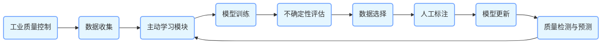

# 主动学习在工业质量控制中的实践研究

> 关键词：主动学习、工业质量控制、机器学习、数据标注、质量检测

> 摘要：本文聚焦于主动学习在工业质量控制领域的实践应用。通过深入探讨主动学习的核心概念、算法原理，结合数学模型和公式进行详细阐释。给出具体的项目实战案例，从开发环境搭建到源代码实现及解读，展示主动学习在工业质量控制中的具体操作。同时分析了主动学习在工业质量控制中的实际应用场景，推荐了相关的学习资源、开发工具框架以及论文著作。最后总结了主动学习在该领域的未来发展趋势与挑战，并提供常见问题解答和扩展阅读参考资料，旨在为工业质量控制中主动学习的应用提供全面且深入的技术指导。

## 1. 背景介绍 
### 1.1 目的和范围
在工业生产中，质量控制是确保产品符合标准和客户需求的关键环节。传统的质量控制方法往往依赖于大量的人力检查和固定的规则，效率低下且容易出现漏检和误检。随着机器学习技术的发展，利用数据驱动的方法进行质量控制成为了研究热点。然而，机器学习模型通常需要大量的标注数据进行训练，而在工业场景中，标注数据的获取往往成本高昂且耗时。主动学习作为一种能够有效减少标注数据量的技术，为工业质量控制提供了新的解决方案。

本文的目的是深入研究主动学习在工业质量控制中的应用，包括主动学习的核心概念、算法原理、实际应用场景以及项目实战等方面。通过对主动学习在工业质量控制中的实践研究，为工业企业提供一种高效、准确的质量控制方法，降低生产成本，提高产品质量。

### 1.2 预期读者
本文预期读者包括工业质量控制领域的工程师、技术人员，机器学习和人工智能领域的研究人员和开发者，以及对主动学习在工业应用感兴趣的相关人员。这些读者可能具有一定的编程基础和机器学习知识，希望通过本文了解主动学习在工业质量控制中的具体应用和实践方法。

### 1.3 文档结构概述
本文将按照以下结构进行组织：
1. 背景介绍：介绍本文的目的和范围、预期读者以及文档结构概述，并给出相关术语的定义和解释。
2. 核心概念与联系：阐述主动学习和工业质量控制的核心概念，分析它们之间的联系，并给出相应的文本示意图和 Mermaid 流程图。
3. 核心算法原理 & 具体操作步骤：详细介绍主动学习的核心算法原理，包括不确定性采样、查询合成等，并使用 Python 源代码进行详细阐述。
4. 数学模型和公式 & 详细讲解 & 举例说明：给出主动学习的数学模型和公式，对其进行详细讲解，并通过具体的例子进行说明。
5. 项目实战：代码实际案例和详细解释说明：通过一个具体的项目实战案例，展示主动学习在工业质量控制中的应用，包括开发环境搭建、源代码详细实现和代码解读。
6. 实际应用场景：分析主动学习在工业质量控制中的实际应用场景，如产品缺陷检测、质量分类等。
7. 工具和资源推荐：推荐相关的学习资源、开发工具框架以及论文著作，帮助读者进一步深入学习和研究主动学习在工业质量控制中的应用。
8. 总结：未来发展趋势与挑战：总结主动学习在工业质量控制中的应用现状，分析其未来发展趋势和面临的挑战。
9. 附录：常见问题与解答：提供常见问题的解答，帮助读者解决在学习和实践过程中遇到的问题。
10. 扩展阅读 & 参考资料：提供扩展阅读的建议和相关参考资料，方便读者进一步深入研究。

### 1.4 术语表
#### 1.4.1 核心术语定义
- **主动学习（Active Learning）**：一种机器学习范式，通过主动选择最有价值的数据进行标注，从而在较少的标注数据下获得较好的模型性能。
- **工业质量控制（Industrial Quality Control）**：在工业生产过程中，通过各种方法和手段确保产品质量符合标准和客户需求的过程。
- **标注数据（Labeled Data）**：带有明确标签（如类别、数值等）的数据，用于训练机器学习模型。
- **未标注数据（Unlabeled Data）**：没有标签的数据，需要通过主动学习等方法选择部分数据进行标注。
- **不确定性采样（Uncertainty Sampling）**：主动学习中的一种采样策略，选择模型预测不确定性最大的数据进行标注。

#### 1.4.2 相关概念解释
- **监督学习（Supervised Learning）**：一种机器学习方法，通过使用标注数据进行训练，学习输入数据和输出标签之间的映射关系。
- **半监督学习（Semi-Supervised Learning）**：结合标注数据和未标注数据进行学习的机器学习方法，主动学习是半监督学习的一种特殊形式。
- **模型性能（Model Performance）**：衡量机器学习模型在预测任务中的表现，常用的指标包括准确率、召回率、F1 值等。

#### 1.4.3 缩略词列表
- **AL**：Active Learning（主动学习）
- **QC**：Quality Control（质量控制）
- **ML**：Machine Learning（机器学习）

## 2. 核心概念与联系 

### 主动学习核心概念
主动学习是一种特殊的机器学习范式，它的核心思想是让模型主动地选择最有价值的数据进行标注，而不是像传统监督学习那样随机选择数据进行标注。在主动学习中，模型会根据自身的不确定性或者对数据的重要性评估，从大量的未标注数据中选择一部分数据，请求人工进行标注，然后使用这些标注数据对模型进行更新和训练。通过这种方式，主动学习可以在较少的标注数据下获得较好的模型性能，从而降低标注成本和时间。

### 工业质量控制核心概念
工业质量控制是工业生产过程中的重要环节，它涉及到对原材料、半成品和成品的质量进行检测和监控，以确保产品符合预定的质量标准和客户需求。工业质量控制的方法包括统计过程控制、抽样检验、无损检测等。随着工业自动化和智能化的发展，利用机器学习技术进行质量控制成为了一种趋势，通过对生产过程中的各种数据进行分析和建模，可以实现对产品质量的实时监测和预测。

### 主动学习与工业质量控制的联系
在工业质量控制中，获取大量的标注数据往往是一项昂贵且耗时的任务。例如，在产品缺陷检测中，需要专业的技术人员对产品进行检测并标注缺陷类型，这需要大量的人力和时间成本。主动学习可以通过选择最有价值的数据进行标注，有效地减少标注数据的数量，从而降低标注成本和时间。同时，主动学习可以根据模型的性能动态地选择数据进行标注，使得模型能够更快地收敛到较好的性能，提高工业质量控制的效率和准确性。

### 文本示意图
```plaintext
工业质量控制
|
|-- 数据收集（包括标注数据和未标注数据）
|
|-- 主动学习模块
|   |
|   |-- 模型训练（使用已有标注数据）
|   |
|   |-- 不确定性评估（对未标注数据）
|   |
|   |-- 数据选择（选择最有价值的数据进行标注）
|
|-- 人工标注（对选择的数据进行标注）
|
|-- 模型更新（使用新的标注数据更新模型）
|
|-- 质量检测与预测（使用更新后的模型进行质量控制）
```

### Mermaid 流程图


## 3. 核心算法原理 & 具体操作步骤 

### 不确定性采样算法原理
不确定性采样是主动学习中最常用的采样策略之一，其核心思想是选择模型预测不确定性最大的数据进行标注。在分类任务中，常用的不确定性度量方法有熵、最小置信度等。

#### 熵
对于一个分类问题，假设模型对一个样本 $x$ 的预测概率分布为 $p(y|x) = [p(y_1|x), p(y_2|x), \cdots, p(y_n|x)]$，其中 $y_i$ 表示第 $i$ 个类别，$n$ 表示类别的数量。则样本 $x$ 的熵定义为：
$$
H(p(y|x)) = -\sum_{i=1}^{n} p(y_i|x) \log p(y_i|x)
$$
熵越大，表示模型对样本的预测不确定性越大。因此，在不确定性采样中，可以选择熵最大的样本进行标注。

#### 最小置信度
最小置信度是指模型对一个样本预测的最大概率。即：
$$
\min_{i} p(y_i|x)
$$
最小置信度越小，表示模型对样本的预测不确定性越大。因此，也可以选择最小置信度最小的样本进行标注。

### Python 代码实现不确定性采样
```python
import numpy as np
from sklearn.linear_model import LogisticRegression

# 生成一些示例数据
X = np.random.rand(100, 10)  # 100 个样本，每个样本有 10 个特征
y = np.random.randint(0, 2, 100)  # 随机生成 0 或 1 的标签

# 划分标注数据和未标注数据
n_labeled = 20
X_labeled = X[:n_labeled]
y_labeled = y[:n_labeled]
X_unlabeled = X[n_labeled:]

# 训练初始模型
model = LogisticRegression()
model.fit(X_labeled, y_labeled)

# 计算未标注数据的熵
probabilities = model.predict_proba(X_unlabeled)
entropies = -np.sum(probabilities * np.log(probabilities), axis=1)

# 选择熵最大的样本
most_uncertain_index = np.argmax(entropies)
most_uncertain_sample = X_unlabeled[most_uncertain_index]

print("选择的最不确定样本的索引:", most_uncertain_index)
```

### 具体操作步骤
1. **数据收集**：收集工业生产过程中的数据，包括标注数据和未标注数据。
2. **模型初始化**：使用现有的标注数据训练一个初始的机器学习模型。
3. **不确定性评估**：使用训练好的模型对未标注数据进行预测，并计算每个样本的不确定性度量（如熵、最小置信度等）。
4. **数据选择**：根据不确定性度量选择最有价值的数据进行标注。
5. **人工标注**：由专业人员对选择的数据进行标注。
6. **模型更新**：将新的标注数据加入到训练集中，重新训练模型。
7. **重复步骤 3 - 6**：不断重复上述步骤，直到模型性能达到满意的程度或者标注数据的数量达到上限。

## 4. 数学模型和公式 & 详细讲解 & 举例说明 

### 主动学习的数学模型
主动学习的目标是在有限的标注数据下，最大化模型的性能。假设我们有一个未标注数据集 $U = \{x_1, x_2, \cdots, x_m\}$ 和一个标注数据集 $L = \{(x_{m+1}, y_{m+1}), (x_{m+2}, y_{m+2}), \cdots, (x_{n}, y_{n})\}$，其中 $x_i$ 表示样本，$y_i$ 表示样本的标签。我们的目标是从 $U$ 中选择一个子集 $S \subseteq U$ 进行标注，使得使用 $L \cup S$ 训练的模型性能最优。

设 $f$ 是一个机器学习模型，$\mathcal{L}$ 是损失函数，我们可以将主动学习的目标表示为：
$$
\min_{S \subseteq U} \mathbb{E}_{(x,y) \sim D} [\mathcal{L}(f_{L \cup S}(x), y)]
$$
其中 $D$ 是数据的真实分布，$f_{L \cup S}$ 是使用 $L \cup S$ 训练的模型。

### 公式详细讲解
上述目标函数的含义是，我们希望选择一个子集 $S$，使得在数据的真实分布 $D$ 下，使用 $L \cup S$ 训练的模型 $f_{L \cup S}$ 的期望损失最小。由于我们无法直接知道数据的真实分布 $D$，通常使用已有的标注数据和未标注数据进行近似估计。

在实际应用中，我们可以通过计算每个未标注样本的不确定性度量，选择不确定性最大的样本进行标注。例如，在不确定性采样中，我们可以根据样本的熵或最小置信度来选择样本。

### 举例说明
假设我们有一个二分类问题，使用逻辑回归模型进行分类。我们有 100 个未标注样本和 20 个标注样本。我们首先使用 20 个标注样本训练逻辑回归模型，然后计算 100 个未标注样本的熵。假设样本 $x_1$ 的预测概率分布为 $[0.5, 0.5]$，样本 $x_2$ 的预测概率分布为 $[0.9, 0.1]$。则样本 $x_1$ 的熵为：
$$
H(p(y|x_1)) = - (0.5 \log 0.5 + 0.5 \log 0.5) = 0.693
$$
样本 $x_2$ 的熵为：
$$
H(p(y|x_2)) = - (0.9 \log 0.9 + 0.1 \log 0.1) = 0.325
$$
由于样本 $x_1$ 的熵大于样本 $x_2$ 的熵，我们选择样本 $x_1$ 进行标注。然后将标注后的样本加入到训练集中，重新训练模型。

## 5. 项目实战：代码实际案例和详细解释说明 

### 5.1  开发环境搭建
#### 操作系统
本文使用的操作系统为 Windows 10 64 位，但以下步骤同样适用于 Linux 和 macOS 系统。

#### Python 环境
建议使用 Python 3.7 及以上版本。可以从 Python 官方网站（https://www.python.org/downloads/）下载并安装 Python。安装完成后，使用以下命令验证 Python 版本：
```sh
python --version
```

#### 虚拟环境
为了避免不同项目之间的依赖冲突，建议使用虚拟环境。可以使用 `venv` 模块创建虚拟环境：
```sh
python -m venv active_learning_env
```
激活虚拟环境：
- 在 Windows 上：
```sh
active_learning_env\Scripts\activate
```
- 在 Linux 和 macOS 上：
```sh
source active_learning_env/bin/activate
```

#### 安装依赖库
在激活的虚拟环境中，使用 `pip` 安装所需的依赖库：
```sh
pip install numpy pandas scikit-learn matplotlib
```

### 5.2  源代码详细实现和代码解读
#### 数据加载和预处理
```python
import numpy as np
import pandas as pd
from sklearn.datasets import make_classification
from sklearn.model_selection import train_test_split
from sklearn.preprocessing import StandardScaler

# 生成示例数据集
X, y = make_classification(n_samples=1000, n_features=20, n_informative=10, n_classes=2, random_state=42)

# 划分训练集和测试集
X_train, X_test, y_train, y_test = train_test_split(X, y, test_size=0.2, random_state=42)

# 数据标准化
scaler = StandardScaler()
X_train = scaler.fit_transform(X_train)
X_test = scaler.transform(X_test)

# 划分初始标注数据和未标注数据
n_labeled = 50
X_labeled = X_train[:n_labeled]
y_labeled = y_train[:n_labeled]
X_unlabeled = X_train[n_labeled:]
```
**代码解读**：
- 使用 `make_classification` 函数生成一个二分类的示例数据集。
- 使用 `train_test_split` 函数将数据集划分为训练集和测试集。
- 使用 `StandardScaler` 对数据进行标准化处理，以提高模型的训练效果。
- 从训练集中选择前 50 个样本作为初始标注数据，其余样本作为未标注数据。

#### 主动学习循环
```python
from sklearn.linear_model import LogisticRegression
from sklearn.metrics import accuracy_score

# 初始化模型
model = LogisticRegression()

# 主动学习循环
n_iterations = 10
accuracies = []

for i in range(n_iterations):
    # 训练模型
    model.fit(X_labeled, y_labeled)
    
    # 评估模型性能
    y_pred = model.predict(X_test)
    accuracy = accuracy_score(y_test, y_pred)
    accuracies.append(accuracy)
    print(f"Iteration {i+1}: Accuracy = {accuracy}")
    
    # 计算未标注数据的熵
    probabilities = model.predict_proba(X_unlabeled)
    entropies = -np.sum(probabilities * np.log(probabilities), axis=1)
    
    # 选择熵最大的样本
    most_uncertain_index = np.argmax(entropies)
    most_uncertain_sample = X_unlabeled[most_uncertain_index]
    most_uncertain_label = y_train[n_labeled + most_uncertain_index]
    
    # 将选择的样本加入到标注数据中
    X_labeled = np.vstack((X_labeled, most_uncertain_sample))
    y_labeled = np.hstack((y_labeled, most_uncertain_label))
    
    # 从未标注数据中移除选择的样本
    X_unlabeled = np.delete(X_unlabeled, most_uncertain_index, axis=0)
```
**代码解读**：
- 初始化一个逻辑回归模型。
- 进行 10 次主动学习迭代。
- 在每次迭代中，使用当前的标注数据训练模型，并在测试集上评估模型的准确率。
- 计算未标注数据的熵，选择熵最大的样本进行标注。
- 将选择的样本加入到标注数据中，并从未标注数据中移除该样本。

#### 结果可视化
```python
import matplotlib.pyplot as plt

plt.plot(range(1, n_iterations + 1), accuracies)
plt.xlabel('Iteration')
plt.ylabel('Accuracy')
plt.title('Active Learning Performance')
plt.show()
```
**代码解读**：
- 使用 `matplotlib` 库绘制模型准确率随迭代次数的变化曲线，直观展示主动学习的效果。

### 5.3  代码解读与分析
通过上述代码，我们实现了一个简单的主动学习项目，在工业质量控制中可以类比为产品质量分类任务。从代码中可以看出，主动学习通过不断选择最有价值的数据进行标注，逐步提高模型的性能。在每次迭代中，模型使用新的标注数据进行更新，从而能够更好地适应数据的分布。

从结果可视化的曲线中，我们可以观察到模型的准确率随着迭代次数的增加而逐渐提高。这表明主动学习能够有效地利用有限的标注数据，提高模型的性能，减少标注成本和时间。

## 6. 实际应用场景 
### 产品缺陷检测
在工业生产中，产品缺陷检测是质量控制的重要环节。传统的缺陷检测方法通常依赖于人工检查，效率低下且容易出现漏检和误检。主动学习可以通过选择最有可能包含缺陷的产品样本进行标注，训练一个高效的缺陷检测模型。例如，在电子产品制造中，可以使用主动学习选择那些外观有轻微瑕疵或者性能指标接近阈值的产品进行标注，从而提高缺陷检测的准确率。

### 质量分类
工业产品通常需要根据质量等级进行分类，以便进行不同的处理和销售。主动学习可以用于质量分类任务，通过选择那些分类不确定性最大的产品样本进行标注，训练一个准确的质量分类模型。例如，在食品加工行业，可以使用主动学习对不同批次的食品进行质量分类，将食品分为优质、合格和不合格等不同等级。

### 过程监控
工业生产过程中的质量控制不仅涉及到产品本身，还包括生产过程的监控。主动学习可以用于生产过程的监控，通过选择那些生产参数变化较大或者异常的数据点进行标注，训练一个能够实时监测生产过程的模型。例如，在化工生产中，可以使用主动学习对温度、压力、流量等生产参数进行监控，及时发现生产过程中的异常情况。

## 7. 工具和资源推荐
### 7.1 学习资源推荐
#### 7.1.1 书籍推荐
- 《机器学习》（周志华）：这本书是机器学习领域的经典教材，涵盖了机器学习的基本概念、算法和应用，对主动学习也有一定的介绍。
- 《深度学习》（Ian Goodfellow、Yoshua Bengio 和 Aaron Courville）：深度学习是机器学习的一个重要分支，这本书对深度学习的理论和实践进行了全面的介绍，对于理解主动学习在深度学习中的应用有很大帮助。
- 《主动学习》（Burr Settles）：这是一本专门介绍主动学习的书籍，详细讲解了主动学习的理论、算法和应用案例。

#### 7.1.2 在线课程
- Coursera 上的“机器学习”课程（Andrew Ng 教授）：这是一门非常经典的机器学习在线课程，涵盖了机器学习的基本概念和算法，对主动学习也有一定的提及。
- edX 上的“深度学习”课程（由多家知名高校联合开设）：该课程深入介绍了深度学习的理论和实践，对于理解主动学习在深度学习中的应用有很大帮助。
- Kaggle 上的教程和竞赛：Kaggle 是一个数据科学竞赛平台，上面有很多关于机器学习和主动学习的教程和竞赛，可以通过参与竞赛来提高实践能力。

#### 7.1.3 技术博客和网站
- Medium 上的机器学习相关博客：Medium 上有很多机器学习领域的优秀博客，其中不乏关于主动学习的文章，可以及时了解主动学习的最新研究成果和应用案例。
- arXiv 网站：arXiv 是一个预印本数据库，上面有很多机器学习和主动学习的最新研究论文，可以及时了解该领域的前沿动态。
- 开源中国、InfoQ 等技术网站：这些网站会发布一些关于机器学习和工业应用的技术文章，对于了解主动学习在工业质量控制中的应用有一定的帮助。

### 7.2 开发工具框架推荐
#### 7.2.1 IDE和编辑器
- PyCharm：一款专门为 Python 开发设计的集成开发环境（IDE），具有代码自动补全、调试、版本控制等功能，非常适合开发机器学习项目。
- Jupyter Notebook：一个基于 Web 的交互式计算环境，可以将代码、文本、图像等内容集成在一起，方便进行数据分析和模型实验。
- Visual Studio Code：一款轻量级的代码编辑器，支持多种编程语言和插件，对于 Python 开发也有很好的支持。

#### 7.2.2 调试和性能分析工具
- TensorBoard：TensorFlow 提供的一个可视化工具，可以用于监控模型的训练过程、可视化模型的结构和性能指标等。
- Py-Spy：一个用于 Python 代码性能分析的工具，可以帮助开发者找出代码中的性能瓶颈。
- PDB：Python 自带的调试器，可以在代码中设置断点，逐步调试代码，找出问题所在。

#### 7.2.3 相关框架和库
- scikit-learn：一个简单易用的机器学习库，提供了各种机器学习算法的实现，包括主动学习中的不确定性采样等算法。
- PyTorch：一个开源的深度学习框架，具有动态图机制，方便进行模型的开发和调试，对于主动学习在深度学习中的应用有很好的支持。
- modAL：一个专门用于主动学习的 Python 库，提供了各种主动学习策略的实现，方便开发者快速搭建主动学习系统。

### 7.3 相关论文著作推荐
#### 7.3.1 经典论文
- “Active Learning Literature Survey”（Burr Settles）：这是一篇关于主动学习的经典综述论文，对主动学习的发展历程、算法和应用进行了全面的总结。
- “Support Vector Machine Active Learning with Applications to Text Classification”（Thorsten Joachims）：该论文提出了一种基于支持向量机的主动学习算法，在文本分类任务中取得了很好的效果。
- “Query by Committee”（H. S. Seung、M. Opper 和 H. Sompolinsky）：这是一篇早期的主动学习论文，提出了“查询委员会”的主动学习策略。

#### 7.3.2 最新研究成果
- 在 NeurIPS、ICML、CVPR 等顶级机器学习和计算机视觉会议上搜索关于主动学习的最新研究论文，可以了解该领域的前沿动态。
- 在 arXiv 网站上关注主动学习相关的预印本论文，及时获取最新的研究成果。

#### 7.3.3 应用案例分析
- 一些工业领域的学术期刊和会议论文会发表关于主动学习在工业质量控制中的应用案例分析，可以通过这些论文了解主动学习在实际工业场景中的应用效果和挑战。

## 8. 总结：未来发展趋势与挑战
### 未来发展趋势
- **与深度学习的结合**：随着深度学习在工业领域的广泛应用，主动学习与深度学习的结合将成为未来的一个重要发展趋势。深度学习模型通常需要大量的标注数据进行训练，主动学习可以通过选择最有价值的数据进行标注，有效地减少标注数据的数量，提高深度学习模型的训练效率和性能。
- **多模态数据的应用**：在工业质量控制中，往往涉及到多种类型的数据，如图像、音频、传感器数据等。未来的主动学习研究将更加关注多模态数据的应用，通过融合不同类型的数据，提高质量控制的准确性和可靠性。
- **自动化和智能化**：随着工业自动化和智能化的发展，主动学习系统也将朝着自动化和智能化的方向发展。未来的主动学习系统将能够自动选择数据进行标注，自动更新模型，实现工业质量控制的全自动化。

### 挑战
- **不确定性度量的准确性**：主动学习的核心是选择最有价值的数据进行标注，而不确定性度量是选择数据的重要依据。然而，目前的不确定性度量方法还存在一定的局限性，不能准确地反映数据的真实不确定性。因此，如何提高不确定性度量的准确性是主动学习面临的一个重要挑战。
- **标注成本和效率**：虽然主动学习可以减少标注数据的数量，但标注数据仍然是一项昂贵且耗时的任务。如何进一步降低标注成本，提高标注效率，是主动学习在工业质量控制中应用的关键问题。
- **模型的泛化能力**：在工业质量控制中，数据的分布往往会随着时间和生产条件的变化而发生变化。因此，如何提高主动学习模型的泛化能力，使其能够适应不同的数据分布，是主动学习面临的另一个挑战。

## 9. 附录：常见问题与解答
### 问题 1：主动学习一定能减少标注数据的数量吗？
解答：主动学习通常可以在一定程度上减少标注数据的数量，但并不是在所有情况下都能实现。主动学习的效果取决于数据的分布、模型的选择和不确定性度量的方法等因素。在某些情况下，如果数据的分布比较简单，或者模型本身对数据的拟合能力较强，主动学习可能无法显著减少标注数据的数量。

### 问题 2：如何选择合适的不确定性度量方法？
解答：选择合适的不确定性度量方法需要考虑具体的任务和数据特点。在分类任务中，熵和最小置信度是常用的不确定性度量方法。如果数据的类别分布比较均匀，可以使用熵作为不确定性度量；如果数据的类别分布不均匀，最小置信度可能更合适。此外，还可以根据具体的任务需求和实验结果选择其他的不确定性度量方法。

### 问题 3：主动学习在处理大规模数据时效率如何？
解答：主动学习在处理大规模数据时可能会面临效率问题。计算大规模未标注数据的不确定性度量需要大量的计算资源和时间。为了提高效率，可以采用抽样的方法，从大规模未标注数据中抽取一部分数据进行不确定性评估；或者使用近似计算方法，减少计算量。

### 问题 4：主动学习与半监督学习有什么区别？
解答：主动学习是半监督学习的一种特殊形式。半监督学习是指结合标注数据和未标注数据进行学习的机器学习方法，而主动学习强调模型主动地选择最有价值的数据进行标注。在半监督学习中，未标注数据的使用方式可以有多种，而主动学习主要通过不确定性采样等策略选择数据进行标注。

## 10. 扩展阅读 & 参考资料
### 扩展阅读
- 深入研究深度学习中的主动学习方法，如基于生成对抗网络（GAN）的主动学习。
- 了解主动学习在其他领域的应用，如自然语言处理、计算机视觉等。
- 学习强化学习与主动学习的结合，探索新的主动学习策略。

### 参考资料
- [1] 周志华. 机器学习. 清华大学出版社, 2016.
- [2] Ian Goodfellow, Yoshua Bengio, Aaron Courville. 深度学习. 人民邮电出版社, 2017.
- [3] Burr Settles. Active Learning Literature Survey. Technical Report 1648, University of Wisconsin–Madison, 2010.
- [4] Thorsten Joachims. Support Vector Machine Active Learning with Applications to Text Classification. Machine Learning, 37(2): 135–163, 1999.
- [5] H. S. Seung, M. Opper, H. Sompolinsky. Query by Committee. Proceedings of the Fifth Annual Workshop on Computational Learning Theory, 1992.

作者：AI天才研究院/AI Genius Institute & 禅与计算机程序设计艺术 /Zen And The Art of Computer Programming