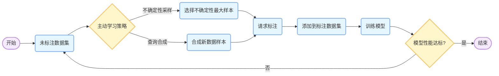

# 主动学习在高效数据采集中的策略创新

> 关键词：主动学习、高效数据采集、策略创新、不确定性采样、查询合成

> 摘要：本文聚焦于主动学习在高效数据采集中的策略创新。首先介绍了主动学习及高效数据采集的背景，明确了研究目的和范围、预期读者等内容。接着阐述了主动学习与高效数据采集的核心概念及联系，给出了相应的原理和架构示意图。详细讲解了核心算法原理，用 Python 代码进行了说明，还介绍了相关的数学模型和公式。通过项目实战，展示了代码的实现与解读。分析了主动学习在多个实际应用场景中的作用。推荐了学习资源、开发工具框架和相关论文著作。最后总结了未来发展趋势与挑战，解答了常见问题，并提供了扩展阅读和参考资料，旨在为相关领域的研究和实践提供全面且深入的指导。

## 1. 背景介绍 
### 1.1 目的和范围
在当今数据驱动的时代，数据的数量和质量对于机器学习模型的性能起着至关重要的作用。然而，获取大量有标注的数据往往是昂贵且耗时的。主动学习作为一种能够显著减少标注工作量的技术，旨在让模型主动选择最有价值的数据进行标注，从而提高数据采集的效率。本文的目的在于探讨主动学习在高效数据采集中的策略创新，涵盖从核心概念、算法原理到实际应用等多个方面，为研究人员和从业者提供全面的理论和实践指导。

### 1.2 预期读者
本文预期读者包括机器学习领域的研究人员、数据科学家、人工智能开发者以及对主动学习和数据采集感兴趣的相关专业人士。无论是希望深入了解主动学习理论的学术研究者，还是需要在实际项目中应用主动学习技术的开发者，都能从本文中获得有价值的信息。

### 1.3 文档结构概述
本文首先介绍主动学习和高效数据采集的核心概念及它们之间的联系，通过文本示意图和 Mermaid 流程图进行直观展示。接着详细阐述核心算法原理，并使用 Python 代码进行具体实现和解释。然后介绍相关的数学模型和公式，并通过举例说明其应用。通过项目实战，展示如何在实际开发中运用主动学习进行高效数据采集。分析主动学习在不同实际应用场景中的应用方式。推荐学习资源、开发工具框架和相关论文著作。最后总结主动学习在高效数据采集中的未来发展趋势与挑战，解答常见问题，并提供扩展阅读和参考资料。

### 1.4 术语表
#### 1.4.1 核心术语定义
- **主动学习（Active Learning）**：一种机器学习范式，模型通过主动选择最有价值的数据样本进行标注，从而在有限的标注数据下获得更好的性能。
- **高效数据采集（Efficient Data Collection）**：在数据采集过程中，通过合理的策略和方法，以最小的成本（如时间、人力、物力等）获取最有价值的数据。
- **不确定性采样（Uncertainty Sampling）**：主动学习中的一种采样策略，选择模型预测不确定性最大的数据样本进行标注。
- **查询合成（Query Synthesis）**：主动学习中的一种策略，通过合成新的数据样本并请求标注，以扩充训练数据。

#### 1.4.2 相关概念解释
- **标注数据（Labeled Data）**：带有明确标签或目标值的数据样本，用于训练监督学习模型。
- **未标注数据（Unlabeled Data）**：没有标签或目标值的数据样本，需要通过某种方式进行标注才能用于训练模型。
- **模型性能（Model Performance）**：衡量机器学习模型在特定任务上表现好坏的指标，如准确率、召回率、F1 值等。

#### 1.4.3 缩略词列表
- **AL**：Active Learning（主动学习）
- **US**：Uncertainty Sampling（不确定性采样）
- **QS**：Query Synthesis（查询合成）

## 2. 核心概念与联系 

### 主动学习原理
主动学习的核心思想是让模型主动参与到数据采集过程中，选择最有价值的数据样本进行标注。传统的机器学习方法通常是随机选择数据进行标注，而主动学习则根据模型的当前状态和数据的特征，有针对性地选择数据。例如，在图像分类任务中，模型可能对某些模糊的图像预测不确定性较大，主动学习会优先选择这些图像进行标注，以提高模型的性能。

### 高效数据采集原理
高效数据采集强调在有限的资源下获取最有价值的数据。这需要综合考虑数据的质量、数量和获取成本。通过合理的采样策略和数据筛选方法，可以减少不必要的数据采集，提高数据采集的效率。例如，在进行用户反馈数据采集时，可以根据用户的活跃度和反馈质量进行有针对性的采样，而不是对所有用户进行全面调查。

### 核心概念联系
主动学习是实现高效数据采集的一种有效手段。通过主动学习的策略，如不确定性采样和查询合成，可以选择最有代表性和最能提升模型性能的数据进行标注，从而减少标注工作量，提高数据采集的效率。同时，高效数据采集的需求也推动了主动学习策略的不断创新和发展。

### 文本示意图
```plaintext
主动学习
    |
    |--- 不确定性采样
    |--- 查询合成
    |--- 其他策略
    |
    |--- 选择最有价值数据
    |
    V
高效数据采集
    |
    |--- 减少标注工作量
    |--- 提高数据质量
    |--- 提升模型性能
```

### Mermaid 流程图


## 3. 核心算法原理 & 具体操作步骤 

### 不确定性采样算法原理
不确定性采样是主动学习中最常用的策略之一。其基本思想是选择模型预测不确定性最大的数据样本进行标注。常见的不确定性度量方法有以下几种：

#### 分类熵（Classification Entropy）
对于一个分类问题，假设模型对一个样本 $x$ 的预测概率分布为 $P(y|x) = [p_1, p_2,..., p_n]$，其中 $p_i$ 表示样本 $x$ 属于第 $i$ 类的概率，$n$ 为类别数。则分类熵定义为：

$$H(P(y|x)) = -\sum_{i=1}^{n} p_i \log(p_i)$$

分类熵越大，说明模型对该样本的预测不确定性越大。

#### 最小预测概率（Least Confidence）
选择模型预测概率最小的样本进行标注。即对于样本 $x$，计算其预测概率分布 $P(y|x)$ 中的最小值：

$$\min_{i=1}^{n} p_i$$

值越小，说明模型对该样本的预测越不确定。

#### 边际采样（Margin Sampling）
选择模型预测概率中最大和次大值之差最小的样本进行标注。即对于样本 $x$，计算：

$$\max_{i=1}^{n} p_i - \max_{j \neq i} p_j$$

差值越小，说明模型对该样本的预测越不确定。

### Python 代码实现不确定性采样
```python
import numpy as np
from sklearn.linear_model import LogisticRegression
from sklearn.datasets import make_classification

# 生成数据集
X, y = make_classification(n_samples=1000, n_features=20, n_informative=10, n_classes=2, random_state=42)

# 初始化模型
model = LogisticRegression()

# 初始标注数据
n_initial = 100
indices = np.random.choice(len(X), n_initial, replace=False)
X_labeled = X[indices]
y_labeled = y[indices]
X_unlabeled = np.delete(X, indices, axis=0)
y_unlabeled = np.delete(y, indices)

# 训练初始模型
model.fit(X_labeled, y_labeled)

# 不确定性采样函数
def uncertainty_sampling(model, X_unlabeled):
    # 预测概率
    probabilities = model.predict_proba(X_unlabeled)
    # 计算分类熵
    entropies = -np.sum(probabilities * np.log(probabilities), axis=1)
    # 选择熵最大的样本
    query_index = np.argmax(entropies)
    return query_index

# 主动学习循环
n_iterations = 10
for i in range(n_iterations):
    # 选择样本
    query_index = uncertainty_sampling(model, X_unlabeled)
    # 获取样本
    X_query = X_unlabeled[query_index].reshape(1, -1)
    y_query = y_unlabeled[query_index]
    # 添加到标注数据集中
    X_labeled = np.vstack((X_labeled, X_query))
    y_labeled = np.hstack((y_labeled, y_query))
    # 从无标注数据集中移除
    X_unlabeled = np.delete(X_unlabeled, query_index, axis=0)
    y_unlabeled = np.delete(y_unlabeled, query_index)
    # 重新训练模型
    model.fit(X_labeled, y_labeled)
```

### 查询合成算法原理
查询合成是另一种主动学习策略，它通过合成新的数据样本并请求标注，以扩充训练数据。常见的查询合成方法有以下几种：

#### 基于生成模型（Generative Model）
使用生成模型（如生成对抗网络 GAN、变分自编码器 VAE 等）生成新的数据样本。生成模型可以学习数据的分布，从而生成与真实数据相似的样本。

#### 特征空间插值（Feature Space Interpolation）
在特征空间中对已有数据样本进行插值，生成新的样本。例如，对于两个数据样本 $x_1$ 和 $x_2$，可以通过线性插值生成新的样本 $x = \alpha x_1 + (1 - \alpha) x_2$，其中 $0 < \alpha < 1$。

### Python 代码实现查询合成（基于特征空间插值）
```python
import numpy as np

# 已有数据样本
X = np.array([[1, 2], [3, 4], [5, 6]])

# 随机选择两个样本
indices = np.random.choice(len(X), 2, replace=False)
x1 = X[indices[0]]
x2 = X[indices[1]]

# 插值系数
alpha = 0.5

# 生成新样本
x_new = alpha * x1 + (1 - alpha) * x2

print("生成的新样本:", x_new)
```

## 4. 数学模型和公式 & 详细讲解 & 举例说明 

### 不确定性采样数学模型
#### 分类熵公式
$$H(P(y|x)) = -\sum_{i=1}^{n} p_i \log(p_i)$$

**详细讲解**：分类熵是信息论中的一个概念，用于衡量一个随机变量的不确定性。在分类问题中，模型对一个样本的预测概率分布可以看作是一个随机变量，分类熵越大，说明这个随机变量的不确定性越大，即模型对该样本的预测越不确定。

**举例说明**：假设一个二分类问题，模型对一个样本的预测概率分布为 $P(y|x) = [0.2, 0.8]$，则分类熵为：

$$H(P(y|x)) = - (0.2 \log(0.2) + 0.8 \log(0.8)) \approx 0.72$$

如果预测概率分布为 $P(y|x) = [0.5, 0.5]$，则分类熵为：

$$H(P(y|x)) = - (0.5 \log(0.5) + 0.5 \log(0.5)) = 1$$

可以看到，当模型对两个类别的预测概率相等时，分类熵最大，不确定性也最大。

#### 最小预测概率公式
$$\min_{i=1}^{n} p_i$$

**详细讲解**：最小预测概率直接选择模型预测概率中最小的值作为不确定性的度量。值越小，说明模型对该样本属于任何一个类别的信心都很低，即不确定性很大。

**举例说明**：假设一个三分类问题，模型对一个样本的预测概率分布为 $P(y|x) = [0.1, 0.3, 0.6]$，则最小预测概率为 $0.1$。如果另一个样本的预测概率分布为 $P(y|x) = [0.2, 0.2, 0.6]$，则最小预测概率为 $0.2$。显然，第一个样本的最小预测概率更小，其不确定性更大。

#### 边际采样公式
$$\max_{i=1}^{n} p_i - \max_{j \neq i} p_j$$

**详细讲解**：边际采样通过计算模型预测概率中最大和次大值之差来度量不确定性。差值越小，说明模型对样本属于最大概率类别和次大概率类别的区分度越小，即不确定性越大。

**举例说明**：假设一个三分类问题，模型对一个样本的预测概率分布为 $P(y|x) = [0.4, 0.3, 0.3]$，则最大概率为 $0.4$，次大概率为 $0.3$，边际为 $0.4 - 0.3 = 0.1$。如果另一个样本的预测概率分布为 $P(y|x) = [0.8, 0.1, 0.1]$，则边际为 $0.8 - 0.1 = 0.7$。显然，第一个样本的边际更小，其不确定性更大。

### 查询合成数学模型
#### 特征空间插值公式
$$x = \alpha x_1 + (1 - \alpha) x_2$$

**详细讲解**：特征空间插值是在特征空间中对两个已有数据样本进行线性组合，生成新的样本。$\alpha$ 是插值系数，取值范围为 $0 < \alpha < 1$。当 $\alpha = 0$ 时，$x = x_2$；当 $\alpha = 1$ 时，$x = x_1$；当 $0 < \alpha < 1$ 时，$x$ 位于 $x_1$ 和 $x_2$ 之间。

**举例说明**：假设两个数据样本 $x_1 = [1, 2]$ 和 $x_2 = [3, 4]$，插值系数 $\alpha = 0.5$，则生成的新样本为：

$$x = 0.5 \times [1, 2] + (1 - 0.5) \times [3, 4] = [0.5 \times 1 + 0.5 \times 3, 0.5 \times 2 + 0.5 \times 4] = [2, 3]$$

## 5. 项目实战：代码实际案例和详细解释说明 

### 5.1  开发环境搭建
#### 安装 Python
首先需要安装 Python 环境，建议使用 Python 3.7 及以上版本。可以从 Python 官方网站（https://www.python.org/downloads/）下载并安装适合自己操作系统的 Python 版本。

#### 安装必要的库
使用 `pip` 包管理器安装必要的机器学习库，如 `scikit-learn`、`numpy` 等。可以使用以下命令进行安装：
```sh
pip install scikit-learn numpy
```

### 5.2  源代码详细实现和代码解读
```python
import numpy as np
from sklearn.datasets import load_iris
from sklearn.model_selection import train_test_split
from sklearn.linear_model import LogisticRegression

# 加载数据集
iris = load_iris()
X = iris.data
y = iris.target

# 划分训练集和测试集
X_train, X_test, y_train, y_test = train_test_split(X, y, test_size=0.2, random_state=42)

# 初始标注数据
n_initial = 20
indices = np.random.choice(len(X_train), n_initial, replace=False)
X_labeled = X_train[indices]
y_labeled = y_train[indices]
X_unlabeled = np.delete(X_train, indices, axis=0)
y_unlabeled = np.delete(y_train, indices)

# 初始化模型
model = LogisticRegression()

# 不确定性采样函数
def uncertainty_sampling(model, X_unlabeled):
    # 预测概率
    probabilities = model.predict_proba(X_unlabeled)
    # 计算分类熵
    entropies = -np.sum(probabilities * np.log(probabilities), axis=1)
    # 选择熵最大的样本
    query_index = np.argmax(entropies)
    return query_index

# 主动学习循环
n_iterations = 10
for i in range(n_iterations):
    # 训练模型
    model.fit(X_labeled, y_labeled)
    # 选择样本
    query_index = uncertainty_sampling(model, X_unlabeled)
    # 获取样本
    X_query = X_unlabeled[query_index].reshape(1, -1)
    y_query = y_unlabeled[query_index]
    # 添加到标注数据集中
    X_labeled = np.vstack((X_labeled, X_query))
    y_labeled = np.hstack((y_labeled, y_query))
    # 从无标注数据集中移除
    X_unlabeled = np.delete(X_unlabeled, query_index, axis=0)
    y_unlabeled = np.delete(y_unlabeled, query_index)

# 评估模型
accuracy = model.score(X_test, y_test)
print("模型准确率:", accuracy)
```

### 5.3  代码解读与分析
#### 数据加载与划分
使用 `load_iris` 函数加载鸢尾花数据集，并使用 `train_test_split` 函数将数据集划分为训练集和测试集。

#### 初始标注数据选择
随机选择一部分数据作为初始标注数据，其余数据作为未标注数据。

#### 不确定性采样函数
`uncertainty_sampling` 函数用于选择模型预测不确定性最大的样本。通过计算分类熵，选择熵最大的样本作为查询样本。

#### 主动学习循环
在主动学习循环中，每次训练模型后，使用不确定性采样函数选择一个样本进行标注，并将其添加到标注数据集中，同时从无标注数据集中移除。重复这个过程多次，直到达到指定的迭代次数。

#### 模型评估
最后，使用测试集评估模型的准确率，以验证主动学习的效果。

## 6. 实际应用场景 
### 医疗影像诊断
在医疗影像诊断中，获取大量有标注的影像数据是非常困难的，因为标注工作需要专业的医生进行，成本很高。主动学习可以帮助选择最有诊断价值的影像进行标注，从而提高诊断模型的性能。例如，在肺癌诊断中，模型可以通过不确定性采样选择那些难以判断是否为肺癌的影像进行标注，让医生集中精力对这些关键影像进行诊断，从而提高诊断效率和准确性。

### 自然语言处理
在自然语言处理任务中，如文本分类、情感分析等，标注大量的文本数据也需要耗费大量的人力和时间。主动学习可以根据模型的预测不确定性选择最有价值的文本进行标注。例如，在社交媒体情感分析中，模型可能对一些语义模糊的文本预测不确定性较大，主动学习可以优先选择这些文本进行标注，以提高情感分析模型的性能。

### 图像识别
在图像识别领域，主动学习可以用于选择最具代表性和最能提升模型性能的图像进行标注。例如，在人脸识别任务中，模型可能对一些光照条件不佳、面部表情特殊的图像预测不确定性较大，主动学习可以选择这些图像进行标注，从而提高人脸识别模型的鲁棒性和准确性。

### 推荐系统
在推荐系统中，主动学习可以用于选择最能提升推荐效果的用户行为数据进行标注。例如，在电商推荐系统中，模型可以通过不确定性采样选择那些用户行为较为复杂、难以预测的样本进行标注，以提高推荐系统的准确性和个性化程度。

## 7. 工具和资源推荐
### 7.1 学习资源推荐
#### 7.1.1 书籍推荐
- 《机器学习》（周志华）：这本书是机器学习领域的经典教材，全面介绍了机器学习的基本概念、算法和应用，对于理解主动学习的基础理论有很大帮助。
- 《深度学习》（Ian Goodfellow、Yoshua Bengio 和 Aaron Courville）：深入介绍了深度学习的原理和方法，其中也涉及到一些主动学习在深度学习中的应用。
- 《主动学习》（Burr Settles）：这是一本专门介绍主动学习的书籍，详细讲解了主动学习的各种策略、算法和应用场景。

#### 7.1.2 在线课程
- Coursera 上的“机器学习”课程（Andrew Ng 教授）：该课程是机器学习领域的经典在线课程，涵盖了机器学习的基础知识和常见算法，为学习主动学习打下坚实的基础。
- edX 上的“深度学习基础”课程：介绍了深度学习的基本概念和方法，对于理解主动学习在深度学习中的应用有很大帮助。
- Kaggle 上的“主动学习教程”：提供了一些实际的主动学习案例和代码实现，通过实践学习主动学习的应用。

#### 7.1.3 技术博客和网站
- Towards Data Science：这是一个专注于数据科学和机器学习的技术博客平台，上面有很多关于主动学习的文章和案例分享。
- Medium：Medium 上有很多机器学习领域的专家和爱好者分享自己的经验和见解，搜索“主动学习”可以找到很多有价值的文章。
- ArXiv：这是一个预印本平台，上面有很多关于主动学习的最新研究成果和论文，可以及时了解该领域的前沿动态。

### 7.2 开发工具框架推荐
#### 7.2.1 IDE和编辑器
- PyCharm：一款功能强大的 Python 集成开发环境，提供了代码编辑、调试、版本控制等功能，适合开发主动学习相关的 Python 代码。
- Jupyter Notebook：一种交互式的开发环境，可以将代码、文本、图表等内容整合在一起，方便进行数据分析和模型开发，对于主动学习的实验和演示非常有用。
- Visual Studio Code：一款轻量级的代码编辑器，支持多种编程语言和插件扩展，安装 Python 相关插件后可以方便地进行 Python 代码开发。

#### 7.2.2 调试和性能分析工具
- PDB：Python 自带的调试工具，可以在代码中设置断点，逐步执行代码，查看变量的值和程序的执行流程，帮助调试主动学习代码。
- cProfile：Python 标准库中的性能分析工具，可以分析代码的执行时间和函数调用情况，找出代码中的性能瓶颈。
- TensorBoard：TensorFlow 提供的可视化工具，可以用于可视化模型的训练过程、损失函数变化等信息，对于调试和优化主动学习模型非常有帮助。

#### 7.2.3 相关框架和库
- scikit-learn：一个广泛使用的机器学习库，提供了各种机器学习算法和工具，包括主动学习中的一些基本算法，如不确定性采样等。
- PyTorch：一个开源的深度学习框架，提供了丰富的神经网络层和优化算法，方便实现主动学习在深度学习中的应用。
- modAL：一个专门用于主动学习的 Python 库，提供了各种主动学习策略和算法的实现，方便快速搭建主动学习系统。

### 7.3 相关论文著作推荐
#### 7.3.1 经典论文
- “Active Learning Literature Survey”（Burr Settles）：这是一篇关于主动学习的综述论文，全面介绍了主动学习的发展历程、各种策略和算法，是主动学习领域的经典文献。
- “Query by Committee”（Yoav Freund 等）：提出了一种基于委员会的主动学习策略，通过多个模型的投票来选择最有价值的数据样本进行标注。
- “Support Vector Machine Active Learning with Applications to Text Classification”（Thorsten Joachims）：介绍了支持向量机在主动学习中的应用，提出了一种基于支持向量机的主动学习算法。

#### 7.3.2 最新研究成果
- 每年在国际机器学习会议（ICML）、神经信息处理系统大会（NeurIPS）等顶级学术会议上都会有很多关于主动学习的最新研究成果发表，可以关注这些会议的论文集。
- 在学术期刊如《Journal of Artificial Intelligence Research》《Machine Learning》等上也会有主动学习领域的最新研究论文。

#### 7.3.3 应用案例分析
- 在一些实际应用领域的学术会议和期刊上，如医疗影像分析会议、自然语言处理会议等，会有很多关于主动学习在实际应用中的案例分析论文，可以从中学习主动学习在不同领域的应用方法和技巧。

## 8. 总结：未来发展趋势与挑战
### 未来发展趋势
#### 与深度学习的深度融合
随着深度学习的广泛应用，主动学习与深度学习的融合将成为未来的一个重要发展趋势。例如，将主动学习策略应用于深度神经网络的训练中，通过选择最有价值的数据进行标注，可以提高深度学习模型的性能和训练效率。

#### 多模态主动学习
在实际应用中，数据往往具有多种模态，如图像、文本、音频等。未来的主动学习将朝着多模态方向发展，综合考虑不同模态数据的特点和信息，选择最有价值的多模态数据进行标注，以提高模型的性能和泛化能力。

#### 主动学习在强化学习中的应用
强化学习是一种通过智能体与环境进行交互来学习最优策略的机器学习方法。主动学习可以在强化学习中发挥重要作用，例如选择最有价值的状态-动作对进行标注，以提高强化学习的学习效率和性能。

### 挑战
#### 策略选择与优化
主动学习有多种策略可供选择，如不确定性采样、查询合成等。如何根据不同的应用场景和数据特点选择最合适的策略，以及如何对策略进行优化，是一个亟待解决的问题。

#### 计算资源消耗
在主动学习过程中，需要不断地训练模型和计算不确定性等指标，这会消耗大量的计算资源。如何在有限的计算资源下实现高效的主动学习，是一个挑战。

#### 标注成本与质量控制
虽然主动学习可以减少标注工作量，但标注仍然是一个成本较高的环节。如何在保证标注质量的前提下，进一步降低标注成本，是主动学习面临的一个重要挑战。

## 9. 附录：常见问题与解答
### 主动学习与传统机器学习有什么区别？
传统机器学习通常是随机选择数据进行标注，而主动学习则根据模型的当前状态和数据的特征，有针对性地选择最有价值的数据进行标注，从而在有限的标注数据下获得更好的性能。

### 主动学习适用于哪些类型的问题？
主动学习适用于标注数据成本较高的问题，如医疗影像诊断、自然语言处理、图像识别等领域。在这些领域中，获取大量有标注的数据非常困难，主动学习可以帮助减少标注工作量，提高模型的性能。

### 如何选择合适的主动学习策略？
选择合适的主动学习策略需要考虑多个因素，如数据的特点、模型的类型、应用场景等。一般来说，不确定性采样是一种常用的策略，适用于大多数情况。如果数据分布比较复杂，可以考虑使用查询合成等策略。

### 主动学习会增加模型的训练时间吗？
在主动学习过程中，需要不断地训练模型和选择数据，这可能会增加模型的训练时间。但是，由于主动学习可以选择最有价值的数据进行标注，从而减少标注数据的数量，总体上可能会提高模型的训练效率。

## 10. 扩展阅读 & 参考资料
### 扩展阅读
- 《数据挖掘：概念与技术》（Jiawei Han 等）：这本书介绍了数据挖掘的基本概念、算法和应用，对于理解数据采集和处理有很大帮助。
- 《人工智能：一种现代的方法》（Stuart Russell 和 Peter Norvig）：全面介绍了人工智能的各个领域，包括机器学习、自然语言处理等，对于拓宽知识面和深入理解主动学习有很大帮助。

### 参考资料
- 本文中引用的所有论文、书籍、在线课程等资料的具体信息。
- 相关的开源代码库和项目，如 modAL 的官方文档和代码仓库。

作者：AI天才研究院/AI Genius Institute & 禅与计算机程序设计艺术 /Zen And The Art of Computer Programming