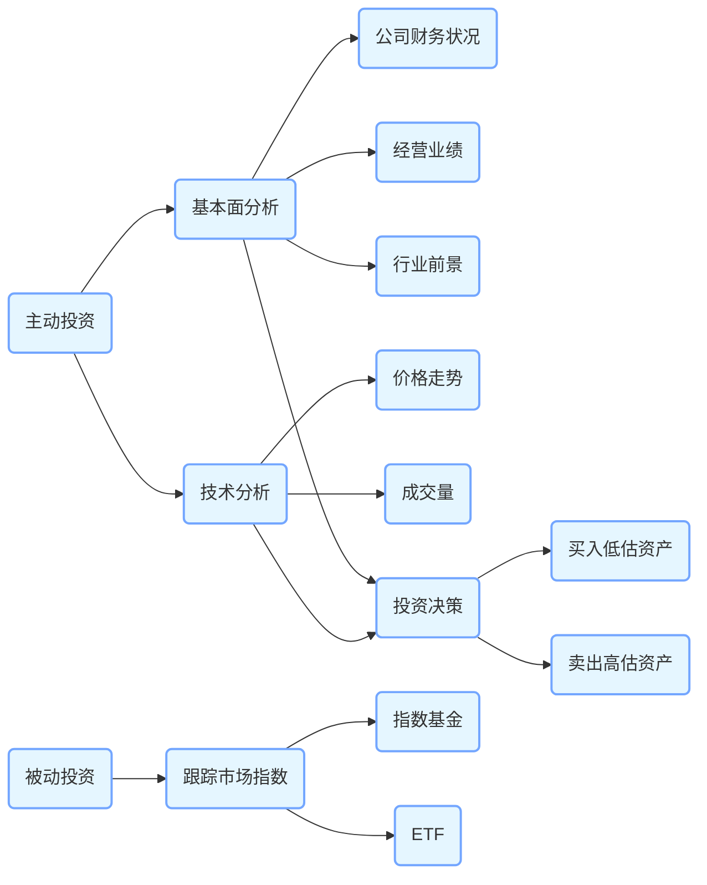

# 乔尔·提尔尼的主动投资者的误区

> 关键词：乔尔·提尔尼、主动投资者、投资误区、投资策略、金融市场

> 摘要：本文围绕乔尔·提尔尼所提出的主动投资者的误区展开深入探讨。首先介绍了相关背景信息，包括目的范围、预期读者等。接着阐述了核心概念，分析了主动投资与被动投资的联系。详细讲解了主动投资涉及的核心算法原理及具体操作步骤，并给出了相应的数学模型和公式。通过项目实战案例，展示了主动投资在实际中的应用及可能出现的问题。同时列举了主动投资的实际应用场景，推荐了相关的学习工具、资源和论文著作。最后总结了主动投资未来的发展趋势与挑战，解答了常见问题并提供了扩展阅读和参考资料，旨在帮助投资者更好地理解主动投资误区，提升投资决策的科学性和合理性。

## 1. 背景介绍 
### 1.1 目的和范围
本文的主要目的是深入剖析乔尔·提尔尼所指出的主动投资者的误区。主动投资作为金融市场中一种重要的投资策略，吸引了众多投资者的参与。然而，许多主动投资者在实际操作中往往陷入各种误区，导致投资收益不尽如人意。通过对这些误区的研究和分析，我们希望帮助投资者更好地认识主动投资，避免常见的错误，提高投资绩效。
文章的范围涵盖了主动投资的各个方面，包括核心概念、算法原理、数学模型、实际应用场景等。同时，结合具体的项目实战案例，详细解释主动投资误区在实际中的表现和影响。

### 1.2 预期读者
本文预期读者主要包括以下几类人群：
- 普通投资者：希望通过了解主动投资误区，优化自己的投资策略，提高投资收益。
- 金融从业者：如基金经理、投资顾问等，他们需要深入理解主动投资的各种问题，为客户提供更专业的服务。
- 金融研究人员：对主动投资领域的理论和实践进行深入研究，探索更有效的投资方法。
- 高校金融专业学生：作为学习金融投资知识的参考资料，帮助他们更好地理解主动投资的复杂性和风险性。

### 1.3 文档结构概述
本文将按照以下结构进行阐述：
- 核心概念与联系：介绍主动投资和被动投资的核心概念，分析它们之间的联系和区别。
- 核心算法原理 & 具体操作步骤：讲解主动投资中常用的算法原理，并给出具体的操作步骤。
- 数学模型和公式 & 详细讲解 & 举例说明：运用数学模型和公式对主动投资进行分析，并通过具体例子进行说明。
- 项目实战：代码实际案例和详细解释说明：通过实际的项目案例，展示主动投资的实施过程和可能出现的问题。
- 实际应用场景：列举主动投资在不同场景下的应用。
- 工具和资源推荐：推荐学习主动投资的相关工具、资源和论文著作。
- 总结：未来发展趋势与挑战：总结主动投资的未来发展趋势和面临的挑战。
- 附录：常见问题与解答：解答读者在阅读过程中可能遇到的常见问题。
- 扩展阅读 & 参考资料：提供相关的扩展阅读材料和参考资料。

### 1.4 术语表
#### 1.4.1 核心术语定义
- **主动投资**：主动投资者通过积极的研究、分析和决策，试图超越市场平均收益。他们会根据自己的判断选择投资标的、调整投资组合，以获取更高的回报。
- **被动投资**：被动投资者通常选择跟踪市场指数的投资策略，如投资于指数基金。他们不试图超越市场，而是追求与市场平均收益相同的回报。
- **投资组合**：投资者将不同的资产（如股票、债券、基金等）组合在一起，以达到分散风险、实现投资目标的目的。
- **市场有效性**：指市场价格能够充分反映所有可用信息的程度。在有效市场中，主动投资者很难通过分析信息获得超额收益。

#### 1.4.2 相关概念解释
- **信息不对称**：在金融市场中，不同投资者获取信息的能力和渠道不同，导致某些投资者拥有更多的信息优势。主动投资者试图利用这种信息不对称来获取超额收益，但实际上，市场的有效性会逐渐削弱这种优势。
- **羊群效应**：投资者在决策时往往会受到其他投资者的影响，跟随大众的投资行为。这种羊群效应可能导致市场的非理性波动，主动投资者如果不能独立思考，也容易陷入其中。
- **过度自信**：主动投资者往往对自己的投资能力过于自信，高估自己的判断和决策能力。这种过度自信可能导致他们承担过高的风险，做出错误的投资决策。

#### 1.4.3 缩略词列表
- **ETF**：交易型开放式指数基金（Exchange Traded Fund），是一种被动投资工具，通常跟踪特定的市场指数。
- **CAPM**：资本资产定价模型（Capital Asset Pricing Model），用于描述资产预期收益率与风险之间的关系。
- **Sharpe Ratio**：夏普比率，用于衡量投资组合的风险调整后收益。

## 2. 核心概念与联系 
### 核心概念原理
#### 主动投资原理
主动投资的核心原理是基于投资者对市场和投资标的的深入研究和分析，通过挖掘被市场低估或高估的资产，进行买卖决策，以获取超越市场平均水平的收益。主动投资者会运用各种分析方法，如基本面分析、技术分析等，来评估资产的价值和未来走势。
基本面分析主要关注公司的财务状况、经营业绩、行业前景等因素，通过分析这些因素来判断公司的内在价值。技术分析则主要通过研究市场价格和成交量等数据，来预测市场的未来走势。

#### 被动投资原理
被动投资的原理是通过跟踪市场指数，实现与市场平均收益相同的回报。被动投资者认为市场是有效的，很难通过主动投资获得超额收益。因此，他们选择投资于指数基金等被动投资工具，以降低投资成本和风险。
指数基金是一种按照特定指数的成分股进行投资的基金，其投资组合的构成与指数的成分股相同。通过投资指数基金，投资者可以获得与指数相同的收益。

### 架构的文本示意图
```plaintext
主动投资
|-- 基本面分析
|   |-- 公司财务状况
|   |-- 经营业绩
|   |-- 行业前景
|-- 技术分析
|   |-- 价格走势
|   |-- 成交量
|-- 投资决策
|   |-- 买入低估资产
|   |-- 卖出高估资产

被动投资
|-- 跟踪市场指数
|   |-- 指数基金
|   |-- ETF
```

### Mermaid 流程图


## 3. 核心算法原理 & 具体操作步骤 
### 核心算法原理
在主动投资中，常用的算法原理包括均值 - 方差优化算法、资本资产定价模型（CAPM）等。

#### 均值 - 方差优化算法
均值 - 方差优化算法的目标是在给定的风险水平下，最大化投资组合的预期收益；或者在给定的预期收益水平下，最小化投资组合的风险。该算法基于现代投资组合理论，通过计算资产的预期收益率、方差和协方差，来确定最优的投资组合权重。
设投资组合中有 $n$ 种资产，第 $i$ 种资产的预期收益率为 $E(R_i)$，权重为 $w_i$，投资组合的预期收益率为 $E(R_p)$，则有：
$$E(R_p)=\sum_{i=1}^{n}w_iE(R_i)$$
投资组合的方差为：
$$\sigma_p^2=\sum_{i=1}^{n}\sum_{j=1}^{n}w_iw_j\sigma_{ij}$$
其中，$\sigma_{ij}$ 是资产 $i$ 和资产 $j$ 的协方差。

#### 资本资产定价模型（CAPM）
资本资产定价模型用于描述资产预期收益率与风险之间的关系。该模型认为，资产的预期收益率等于无风险收益率加上风险溢价，风险溢价与资产的贝塔系数成正比。
设资产 $i$ 的预期收益率为 $E(R_i)$，无风险收益率为 $R_f$，市场组合的预期收益率为 $E(R_m)$，资产 $i$ 的贝塔系数为 $\beta_i$，则有：
$$E(R_i)=R_f+\beta_i(E(R_m)-R_f)$$

### 具体操作步骤
#### 均值 - 方差优化算法操作步骤
1. **数据收集**：收集每种资产的历史收益率数据，计算其预期收益率、方差和协方差。
2. **设定目标**：确定投资组合的风险水平或预期收益水平。
3. **求解优化问题**：使用优化算法求解在给定目标下的最优投资组合权重。
4. **构建投资组合**：根据求解得到的权重，购买相应的资产，构建投资组合。

#### 资本资产定价模型操作步骤
1. **确定无风险收益率**：通常可以使用国债收益率作为无风险收益率。
2. **确定市场组合的预期收益率**：可以使用市场指数的历史收益率来估计市场组合的预期收益率。
3. **计算资产的贝塔系数**：通过回归分析等方法计算资产的贝塔系数。
4. **计算资产的预期收益率**：根据资本资产定价模型公式，计算资产的预期收益率。

### Python 源代码实现
```python
import numpy as np
from scipy.optimize import minimize

# 示例数据
expected_returns = np.array([0.1, 0.15, 0.2])  # 资产预期收益率
cov_matrix = np.array([[0.04, 0.02, 0.01],
                       [0.02, 0.09, 0.03],
                       [0.01, 0.03, 0.16]])  # 资产协方差矩阵

# 定义目标函数：最小化投资组合方差
def portfolio_variance(weights, cov_matrix):
    return np.dot(weights.T, np.dot(cov_matrix, weights))

# 定义约束条件：权重之和为 1
def weight_constraint(weights):
    return np.sum(weights) - 1

# 初始权重
initial_weights = np.ones(len(expected_returns)) / len(expected_returns)

# 约束条件
constraints = ({'type': 'eq', 'fun': weight_constraint})

# 权重范围
bounds = [(0, 1) for _ in range(len(expected_returns))]

# 求解优化问题
result = minimize(portfolio_variance, initial_weights, args=(cov_matrix,),
                  method='SLSQP', bounds=bounds, constraints=constraints)

# 最优权重
optimal_weights = result.x

print("最优投资组合权重:", optimal_weights)
```

## 4. 数学模型和公式 & 详细讲解 & 举例说明 
### 均值 - 方差优化模型
#### 详细讲解
均值 - 方差优化模型是现代投资组合理论的核心模型之一。该模型的基本思想是通过合理分配资产的权重，在风险和收益之间找到一个平衡点。
在均值 - 方差优化模型中，我们需要考虑两个重要的指标：预期收益率和方差。预期收益率反映了投资组合的平均收益水平，方差则反映了投资组合的风险水平。通过最大化预期收益率和最小化方差，我们可以得到最优的投资组合。
具体来说，均值 - 方差优化模型可以表示为以下优化问题：
$$\min_{w}\sigma_p^2=\sum_{i=1}^{n}\sum_{j=1}^{n}w_iw_j\sigma_{ij}$$
$$\text{s.t.}\quad E(R_p)=\sum_{i=1}^{n}w_iE(R_i)=R_{target}$$
$$\sum_{i=1}^{n}w_i = 1$$
$$0\leq w_i\leq 1, \quad i = 1,2,\cdots,n$$
其中，$R_{target}$ 是目标预期收益率。

#### 举例说明
假设我们有三种资产 A、B、C，它们的预期收益率分别为 $E(R_A)=0.1$，$E(R_B)=0.15$，$E(R_C)=0.2$，协方差矩阵为：
$$\Sigma=\begin{bmatrix}
0.04 & 0.02 & 0.01 \\
0.02 & 0.09 & 0.03 \\
0.01 & 0.03 & 0.16
\end{bmatrix}$$
我们希望构建一个预期收益率为 $0.12$ 的投资组合。
首先，我们可以将上述优化问题转化为一个无约束优化问题，使用拉格朗日乘数法求解。
设拉格朗日函数为：
$$L(w,\lambda_1,\lambda_2)=\sum_{i=1}^{3}\sum_{j=1}^{3}w_iw_j\sigma_{ij}+\lambda_1(\sum_{i=1}^{3}w_iE(R_i)-0.12)+\lambda_2(\sum_{i=1}^{3}w_i - 1)$$
对 $w_i$、$\lambda_1$、$\lambda_2$ 分别求偏导数，并令其等于 0，得到一组方程组：
$$\frac{\partial L}{\partial w_i}=2\sum_{j=1}^{3}w_j\sigma_{ij}+\lambda_1E(R_i)+\lambda_2 = 0, \quad i = 1,2,3$$
$$\frac{\partial L}{\partial \lambda_1}=\sum_{i=1}^{3}w_iE(R_i)-0.12 = 0$$
$$\frac{\partial L}{\partial \lambda_2}=\sum_{i=1}^{3}w_i - 1 = 0$$
解这个方程组，就可以得到最优的投资组合权重。

### 资本资产定价模型（CAPM）
#### 详细讲解
资本资产定价模型（CAPM）是一种用于描述资产预期收益率与风险之间关系的模型。该模型基于以下假设：
1. 投资者是理性的，他们追求风险调整后的收益最大化。
2. 市场是有效的，所有投资者都可以获得相同的信息。
3. 投资者可以以无风险利率借贷。
在这些假设下，CAPM 认为资产的预期收益率等于无风险收益率加上风险溢价，风险溢价与资产的贝塔系数成正比。
贝塔系数 $\beta_i$ 衡量了资产 $i$ 的收益率对市场组合收益率的敏感程度。如果 $\beta_i>1$，则资产 $i$ 的收益率波动比市场组合更大；如果 $\beta_i<1$，则资产 $i$ 的收益率波动比市场组合更小。

#### 举例说明
假设无风险收益率 $R_f = 0.03$，市场组合的预期收益率 $E(R_m)=0.1$，资产 A 的贝塔系数 $\beta_A = 1.2$。
根据 CAPM 公式，资产 A 的预期收益率为：
$$E(R_A)=R_f+\beta_A(E(R_m)-R_f)=0.03 + 1.2\times(0.1 - 0.03)=0.114$$
这意味着，在当前的市场环境下，资产 A 的预期收益率为 $11.4\%$。

## 5. 项目实战：代码实际案例和详细解释说明 
### 5.1  开发环境搭建
在进行主动投资项目实战之前，我们需要搭建相应的开发环境。以下是具体的搭建步骤：
1. **安装 Python**：Python 是一种广泛使用的编程语言，具有丰富的科学计算库和金融分析工具。我们可以从 Python 官方网站（https://www.python.org/downloads/）下载并安装最新版本的 Python。
2. **安装必要的库**：在 Python 中，有许多库可以用于金融分析和投资组合优化，如 `numpy`、`pandas`、`scipy` 等。我们可以使用 `pip` 命令来安装这些库：
```sh
pip install numpy pandas scipy
```
3. **选择开发工具**：可以选择使用 Jupyter Notebook 或 PyCharm 等开发工具来编写和运行代码。Jupyter Notebook 适合交互式开发和数据分析，PyCharm 则是一个功能强大的 Python 集成开发环境。

### 5.2  源代码详细实现和代码解读
以下是一个使用 Python 实现主动投资组合优化的代码示例：
```python
import numpy as np
import pandas as pd
from scipy.optimize import minimize

# 读取历史数据
data = pd.read_csv('historical_returns.csv')

# 计算预期收益率
expected_returns = data.mean()

# 计算协方差矩阵
cov_matrix = data.cov()

# 定义目标函数：最小化投资组合方差
def portfolio_variance(weights, cov_matrix):
    return np.dot(weights.T, np.dot(cov_matrix, weights))

# 定义约束条件：权重之和为 1
def weight_constraint(weights):
    return np.sum(weights) - 1

# 初始权重
initial_weights = np.ones(len(expected_returns)) / len(expected_returns)

# 约束条件
constraints = ({'type': 'eq', 'fun': weight_constraint})

# 权重范围
bounds = [(0, 1) for _ in range(len(expected_returns))]

# 求解优化问题
result = minimize(portfolio_variance, initial_weights, args=(cov_matrix,),
                  method='SLSQP', bounds=bounds, constraints=constraints)

# 最优权重
optimal_weights = result.x

# 计算最优投资组合的预期收益率和方差
optimal_portfolio_return = np.dot(optimal_weights, expected_returns)
optimal_portfolio_variance = portfolio_variance(optimal_weights, cov_matrix)

print("最优投资组合权重:", optimal_weights)
print("最优投资组合预期收益率:", optimal_portfolio_return)
print("最优投资组合方差:", optimal_portfolio_variance)
```
### 代码解读与分析
1. **数据读取**：使用 `pandas` 库的 `read_csv` 函数读取历史收益率数据。
2. **计算预期收益率和协方差矩阵**：使用 `mean` 函数计算每种资产的预期收益率，使用 `cov` 函数计算资产之间的协方差矩阵。
3. **定义目标函数和约束条件**：目标函数是最小化投资组合的方差，约束条件是权重之和为 1。
4. **求解优化问题**：使用 `scipy.optimize` 库的 `minimize` 函数求解优化问题，得到最优的投资组合权重。
5. **计算最优投资组合的预期收益率和方差**：根据最优权重计算最优投资组合的预期收益率和方差。

通过这个代码示例，我们可以看到如何使用 Python 实现主动投资组合优化。在实际应用中，我们可以根据需要调整目标函数和约束条件，以满足不同的投资需求。

## 6. 实际应用场景 
### 个人投资者
对于个人投资者来说，主动投资可以帮助他们根据自己的风险偏好和投资目标，构建个性化的投资组合。例如，一个风险偏好较高的投资者可能会选择投资一些成长型股票，通过主动研究和分析，挖掘具有潜力的公司。而一个风险偏好较低的投资者可能会选择投资一些蓝筹股和债券，通过主动调整投资组合的权重，实现资产的稳健增值。

### 基金管理公司
基金管理公司通常采用主动投资策略来管理基金。基金经理会根据市场情况和基金的投资目标，选择合适的投资标的，调整投资组合的权重。例如，一只股票型基金的基金经理可能会通过深入研究行业和公司，选择一些具有竞争优势的股票进行投资，以获取超越市场平均水平的收益。

### 对冲基金
对冲基金是一种采用主动投资策略的投资机构，它们通常会运用各种复杂的投资策略，如套利、对冲等，来获取绝对收益。对冲基金经理会通过对市场的深入分析和研究，发现市场中的定价错误和套利机会，进行相应的投资操作。

### 企业年金管理
企业年金是企业为员工提供的一种补充养老保险。企业年金管理机构通常会采用主动投资策略来管理年金资产，以实现资产的保值增值。他们会根据年金的负债情况和投资目标，选择合适的投资标的，调整投资组合的权重。

## 7. 工具和资源推荐
### 7.1 学习资源推荐
#### 7.1.1 书籍推荐
- 《聪明的投资者》（The Intelligent Investor）：本杰明·格雷厄姆（Benjamin Graham）著，这本书是价值投资的经典之作，对主动投资的理念和方法有深入的阐述。
- 《金融市场与金融机构》（Financial Markets and Institutions）：弗雷德里克·米什金（Frederic Mishkin）著，这本书系统介绍了金融市场和金融机构的基本知识，为主动投资提供了理论基础。
- 《投资组合理论与资本市场》（Portfolio Theory and Capital Markets）：哈里·马科维茨（Harry Markowitz）著，这本书是现代投资组合理论的经典之作，对均值 - 方差优化模型有详细的介绍。

#### 7.1.2 在线课程
- Coursera 上的“投资学原理”（Principles of Investing）课程：该课程由哥伦比亚大学教授讲授，系统介绍了投资学的基本原理和方法。
- edX 上的“金融市场”（Financial Markets）课程：该课程由耶鲁大学教授罗伯特·席勒（Robert Shiller）讲授，对金融市场的运行机制和投资策略有深入的讲解。

#### 7.1.3 技术博客和网站
- Seeking Alpha：这是一个专业的金融投资博客网站，提供了大量的投资分析和研究报告。
- Bloomberg：全球知名的金融信息服务提供商，提供实时的金融市场数据和新闻资讯。
- Yahoo Finance：提供丰富的金融市场数据、公司财报和投资分析工具。

### 7.2 开发工具框架推荐
#### 7.2.1 IDE和编辑器
- PyCharm：功能强大的 Python 集成开发环境，提供了代码编辑、调试、版本控制等功能。
- Jupyter Notebook：交互式开发环境，适合数据分析和可视化，方便进行投资策略的研究和验证。

#### 7.2.2 调试和性能分析工具
- PDB：Python 自带的调试工具，可以帮助我们定位代码中的问题。
- cProfile：Python 标准库中的性能分析工具，可以帮助我们分析代码的性能瓶颈。

#### 7.2.3 相关框架和库
- NumPy：Python 中用于科学计算的基础库，提供了高效的数组操作和数学函数。
- Pandas：用于数据处理和分析的库，提供了强大的数据结构和数据操作功能。
- SciPy：用于科学计算和优化的库，提供了各种优化算法和数学模型。

### 7.3 相关论文著作推荐
#### 7.3.1 经典论文
- “Portfolio Selection”（投资组合选择）：哈里·马科维茨（Harry Markowitz）著，这篇论文提出了均值 - 方差优化模型，奠定了现代投资组合理论的基础。
- “Capital Asset Prices: A Theory of Market Equilibrium under Conditions of Risk”（资本资产定价：风险条件下的市场均衡理论）：威廉·夏普（William Sharpe）著，这篇论文提出了资本资产定价模型（CAPM）。

#### 7.3.2 最新研究成果
- 可以关注《Journal of Finance》、《Review of Financial Studies》等金融领域的顶级学术期刊，了解主动投资领域的最新研究成果。

#### 7.3.3 应用案例分析
- 一些金融机构和研究机构会发布主动投资的应用案例分析报告，可以通过这些报告了解主动投资在实际中的应用情况和效果。

## 8. 总结：未来发展趋势与挑战
### 未来发展趋势
#### 智能化投资
随着人工智能和机器学习技术的不断发展，智能化投资将成为主动投资的一个重要发展趋势。智能投资系统可以通过大数据分析、深度学习等技术，对市场和投资标的进行更深入的研究和分析，提供更精准的投资建议。

#### 绿色投资
随着全球对环境保护和可持续发展的关注度不断提高，绿色投资将成为主动投资的一个新热点。投资者将更加关注企业的环境、社会和治理（ESG）表现，选择具有良好 ESG 表现的企业进行投资。

#### 跨境投资
随着全球经济一体化的不断推进，跨境投资将越来越普遍。主动投资者将有更多的机会投资于全球不同地区的市场和资产，实现资产的全球化配置。

### 挑战
#### 市场不确定性
金融市场充满了不确定性，市场行情的变化难以预测。主动投资者需要面对各种市场风险，如系统性风险、非系统性风险等，如何在不确定的市场环境中做出正确的投资决策是一个巨大的挑战。

#### 信息过载
在信息时代，投资者可以获取大量的金融信息。然而，信息过载也给投资者带来了困扰，如何从海量的信息中筛选出有价值的信息，进行有效的分析和决策是一个难题。

#### 竞争激烈
主动投资领域竞争激烈，投资者需要不断提升自己的投资能力和水平，才能在市场中脱颖而出。同时，随着金融科技的发展，越来越多的智能投资工具和平台涌现，也给传统的主动投资者带来了竞争压力。

## 9. 附录：常见问题与解答
### 主动投资一定能获得超额收益吗？
不一定。虽然主动投资的目标是超越市场平均收益，但市场是复杂多变的，受到多种因素的影响。即使投资者进行了深入的研究和分析，也不能保证一定能获得超额收益。此外，市场的有效性也会逐渐削弱主动投资者的信息优势。

### 如何判断自己是否适合主动投资？
判断自己是否适合主动投资需要考虑多个因素，如投资经验、风险承受能力、时间和精力等。主动投资需要投资者具备一定的投资知识和经验，能够进行独立的研究和分析。同时，主动投资需要花费较多的时间和精力来跟踪市场和投资标的。如果投资者不具备这些条件，可能更适合选择被动投资。

### 主动投资和被动投资可以结合使用吗？
可以。主动投资和被动投资各有优缺点，投资者可以根据自己的投资目标和风险偏好，将两者结合使用。例如，投资者可以将一部分资产投资于指数基金等被动投资工具，以获取市场平均收益；另一部分资产进行主动投资，以追求超额收益。

## 10. 扩展阅读 & 参考资料
### 扩展阅读
- 《漫步华尔街》（A Random Walk Down Wall Street）：伯顿·马尔基尔（Burton Malkiel）著，这本书对有效市场假说和投资策略有深入的探讨。
- 《金融炼金术》（The Alchemy of Finance）：乔治·索罗斯（George Soros）著，这本书介绍了索罗斯的投资理念和操作方法。

### 参考资料
- 相关金融学术期刊和研究报告。
- 金融机构发布的投资研究报告和市场分析报告。
- 各大金融网站和财经媒体的新闻资讯和分析文章。

作者：AI天才研究院/AI Genius Institute & 禅与计算机程序设计艺术 /Zen And The Art of Computer Programming