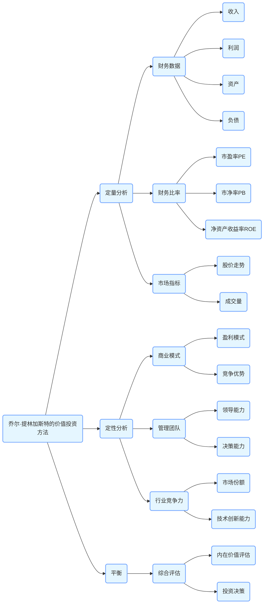

# 乔尔·提林加斯特的价值投资方法：定量与定性的平衡

> 关键词：乔尔·提林加斯特、价值投资、定量分析、定性分析、平衡

> 摘要：本文深入探讨了乔尔·提林加斯特的价值投资方法，着重分析其在定量与定性分析之间寻求平衡的理念。通过介绍背景知识，阐述核心概念及联系，剖析核心算法原理与操作步骤，讲解数学模型和公式，并结合项目实战案例进行详细说明，探讨该投资方法在实际应用场景中的运用。同时，推荐了相关的学习资源、开发工具框架以及论文著作。最后总结了该投资方法的未来发展趋势与挑战，还提供了常见问题解答和扩展阅读参考资料，旨在帮助读者全面理解和掌握乔尔·提林加斯特的价值投资方法。

## 1. 背景介绍 
### 1.1 目的和范围
本文章的主要目的是深入研究乔尔·提林加斯特的价值投资方法，特别是其如何在定量分析和定性分析之间取得平衡。我们将探讨这种投资方法的核心原理、具体操作步骤、数学模型以及实际应用场景。范围涵盖从理论基础到实际案例的全面分析，旨在为投资者和相关研究人员提供一个系统的学习和参考框架。

### 1.2 预期读者
本文预期读者包括对价值投资感兴趣的个人投资者、金融专业学生、投资机构的研究人员以及从事金融分析和投资决策的专业人士。无论您是初学者想要了解价值投资的基本概念，还是有一定经验的投资者希望深入研究乔尔·提林加斯特的独特方法，都能从本文中获得有价值的信息。

### 1.3 文档结构概述
本文将按照以下结构进行阐述：首先介绍乔尔·提林加斯特价值投资方法的背景知识，包括目的、预期读者和文档结构概述，以及相关术语的定义和解释。接着详细讲解核心概念与联系，通过文本示意图和 Mermaid 流程图展示其架构。然后深入剖析核心算法原理，并给出具体操作步骤，同时使用 Python 源代码进行详细阐述。之后介绍数学模型和公式，并通过举例说明其应用。再通过项目实战案例，包括开发环境搭建、源代码实现和解读，进一步加深对该投资方法的理解。随后探讨该方法在实际应用场景中的运用，推荐相关的学习资源、开发工具框架和论文著作。最后总结该投资方法的未来发展趋势与挑战，提供常见问题解答和扩展阅读参考资料。

### 1.4 术语表
#### 1.4.1 核心术语定义
- **价值投资**：一种投资策略，通过分析股票的内在价值，寻找被低估的股票进行投资，以期望在长期获得超过市场平均水平的回报。
- **定量分析**：运用数学和统计方法，对公司的财务数据、市场数据等进行量化分析，以评估公司的价值和投资潜力。
- **定性分析**：基于对公司的商业模式、管理团队、行业竞争力等非量化因素的分析，评估公司的长期发展前景和投资价值。
- **内在价值**：股票所代表的公司的真实价值，是基于公司的资产、盈利能力、现金流等因素计算得出的理论价值。

#### 1.4.2 相关概念解释
- **安全边际**：指股票的市场价格低于其内在价值的幅度，是价值投资中的重要概念，用于降低投资风险。
- **护城河**：指公司具有的可持续竞争优势，能够保护公司的市场份额和盈利能力，使其在长期内保持领先地位。
- **自由现金流**：公司在满足运营和资本支出后剩余的现金流量，是衡量公司盈利能力和财务健康状况的重要指标。

#### 1.4.3 缩略词列表
- **PE**：市盈率，即股票价格与每股收益的比率，用于衡量股票的估值水平。
- **PB**：市净率，即股票价格与每股净资产的比率，反映了股票价格相对于公司净资产的倍数。
- **ROE**：净资产收益率，是净利润与平均股东权益的百分比，衡量公司运用自有资本的效率。

## 2. 核心概念与联系 

乔尔·提林加斯特的价值投资方法核心在于在定量分析和定性分析之间找到平衡。定量分析主要关注公司的财务数据和市场指标，而定性分析则侧重于公司的商业模式、管理团队和行业竞争力等方面。

### 核心概念原理
定量分析通过对公司的财务报表进行详细分析，计算各种财务比率和指标，如市盈率（PE）、市净率（PB）、净资产收益率（ROE）等，以评估公司的估值水平和盈利能力。这些指标可以帮助投资者筛选出被低估的股票。

定性分析则关注公司的非财务因素，如公司的商业模式是否具有可持续性、管理团队是否具备优秀的领导能力和决策能力、公司在行业中的竞争力是否强大等。这些因素对于公司的长期发展至关重要，能够影响公司的内在价值。

### 架构的文本示意图
```plaintext
乔尔·提林加斯特的价值投资方法
|-- 定量分析
|   |-- 财务数据
|   |   |-- 收入
|   |   |-- 利润
|   |   |-- 资产
|   |   |-- 负债
|   |-- 财务比率
|   |   |-- 市盈率（PE）
|   |   |-- 市净率（PB）
|   |   |-- 净资产收益率（ROE）
|   |-- 市场指标
|   |   |-- 股价走势
|   |   |-- 成交量
|-- 定性分析
|   |-- 商业模式
|   |   |-- 盈利模式
|   |   |-- 竞争优势
|   |-- 管理团队
|   |   |-- 领导能力
|   |   |-- 决策能力
|   |-- 行业竞争力
|   |   |-- 市场份额
|   |   |-- 技术创新能力
|-- 平衡
|   |-- 综合评估
|   |   |-- 内在价值评估
|   |   |-- 投资决策
```

### Mermaid 流程图


## 3. 核心算法原理 & 具体操作步骤 

### 核心算法原理
乔尔·提林加斯特的价值投资方法的核心算法原理是通过定量分析和定性分析相结合，评估公司的内在价值，并与股票的市场价格进行比较，寻找被低估的股票进行投资。

定量分析主要基于公司的财务数据和市场指标，使用各种财务比率和模型来计算公司的价值。例如，市盈率（PE）可以反映股票价格相对于公司盈利的倍数，市净率（PB）可以反映股票价格相对于公司净资产的倍数。通过比较这些比率与同行业其他公司的水平，可以判断股票是否被低估。

定性分析则通过对公司的商业模式、管理团队和行业竞争力等方面进行评估，判断公司的长期发展前景。例如，一个具有独特商业模式和强大管理团队的公司，其未来的盈利能力可能会更强，内在价值也会更高。

### 具体操作步骤

#### 步骤 1：数据收集
收集公司的财务报表、市场数据以及行业相关信息。财务报表包括资产负债表、利润表和现金流量表，市场数据包括股票价格、成交量等，行业相关信息包括行业发展趋势、竞争格局等。

#### 步骤 2：定量分析
- **计算财务比率**：根据收集到的财务数据，计算各种财务比率，如市盈率（PE）、市净率（PB）、净资产收益率（ROE）等。
- **比较分析**：将计算得到的财务比率与同行业其他公司的水平进行比较，判断公司的估值水平和盈利能力。
- **使用财务模型**：可以使用一些财务模型，如现金流折现模型（DCF），来计算公司的内在价值。

#### 步骤 3：定性分析
- **评估商业模式**：分析公司的盈利模式、竞争优势和可持续性，判断公司的商业模式是否具有吸引力。
- **评估管理团队**：考察管理团队的领导能力、决策能力和执行能力，判断管理团队是否能够带领公司取得良好的业绩。
- **评估行业竞争力**：分析公司在行业中的市场份额、技术创新能力和品牌影响力，判断公司的行业竞争力是否强大。

#### 步骤 4：综合评估
将定量分析和定性分析的结果进行综合评估，得出公司的内在价值和投资评级。如果公司的内在价值高于市场价格，且投资评级为买入，则可以考虑买入该股票。

#### 步骤 5：投资决策
根据综合评估的结果，做出投资决策。在投资过程中，需要密切关注公司的经营状况和市场变化，及时调整投资组合。

### Python 源代码实现

```python
import pandas as pd

# 步骤 1：数据收集（假设数据已经存储在 CSV 文件中）
def collect_data(file_path):
    data = pd.read_csv(file_path)
    return data

# 步骤 2：定量分析
def quantitative_analysis(data):
    # 计算市盈率（PE）
    data['PE'] = data['股价'] / data['每股收益']
    # 计算市净率（PB）
    data['PB'] = data['股价'] / data['每股净资产']
    # 计算净资产收益率（ROE）
    data['ROE'] = data['净利润'] / data['股东权益']
    return data

# 步骤 3：定性分析（这里简单模拟定性分析结果，实际需要更深入的研究）
def qualitative_analysis(data):
    # 假设根据一些条件判断公司的商业模式、管理团队和行业竞争力
    data['商业模式评分'] = [8 if x > 100 else 6 for x in data['收入']]
    data['管理团队评分'] = [7 if x > 0.2 else 5 for x in data['ROE']]
    data['行业竞争力评分'] = [8 if x > 0.3 else 6 for x in data['市场份额']]
    return data

# 步骤 4：综合评估
def comprehensive_evaluation(data):
    # 假设综合评分 = PE 评分 + PB 评分 + ROE 评分 + 商业模式评分 + 管理团队评分 + 行业竞争力评分
    # 这里简单设置权重，实际需要更科学的方法
    weights = {
        'PE': 0.1,
        'PB': 0.1,
        'ROE': 0.2,
        '商业模式评分': 0.2,
        '管理团队评分': 0.2,
        '行业竞争力评分': 0.2
    }
    data['综合评分'] = (
        data['PE'] * weights['PE'] +
        data['PB'] * weights['PB'] +
        data['ROE'] * weights['ROE'] +
        data['商业模式评分'] * weights['商业模式评分'] +
        data['管理团队评分'] * weights['管理团队评分'] +
        data['行业竞争力评分'] * weights['行业竞争力评分']
    )
    return data

# 步骤 5：投资决策
def investment_decision(data, threshold=7):
    data['投资建议'] = ['买入' if x > threshold else '卖出' for x in data['综合评分']]
    return data

# 主函数
def main():
    file_path = 'company_data.csv'
    data = collect_data(file_path)
    data = quantitative_analysis(data)
    data = qualitative_analysis(data)
    data = comprehensive_evaluation(data)
    data = investment_decision(data)
    print(data)

if __name__ == "__main__":
    main()
```

## 4. 数学模型和公式 & 详细讲解 & 举例说明 

### 财务比率公式

#### 市盈率（PE）
市盈率是股票价格与每股收益的比率，反映了市场对公司盈利的预期。公式为：
$$PE = \frac{股价}{每股收益}$$

举例说明：假设某公司的股票价格为 50 元，每股收益为 5 元，则该公司的市盈率为：
$$PE = \frac{50}{5} = 10$$

#### 市净率（PB）
市净率是股票价格与每股净资产的比率，反映了市场对公司净资产的估值。公式为：
$$PB = \frac{股价}{每股净资产}$$

举例说明：假设某公司的股票价格为 30 元，每股净资产为 10 元，则该公司的市净率为：
$$PB = \frac{30}{10} = 3$$

#### 净资产收益率（ROE）
净资产收益率是净利润与平均股东权益的百分比，衡量公司运用自有资本的效率。公式为：
$$ROE = \frac{净利润}{平均股东权益} \times 100\%$$

举例说明：假设某公司的净利润为 1000 万元，平均股东权益为 5000 万元，则该公司的净资产收益率为：
$$ROE = \frac{1000}{5000} \times 100\% = 20\%$$

### 现金流折现模型（DCF）
现金流折现模型是一种常用的估值方法，通过预测公司未来的自由现金流，并将其折现到当前时刻，来计算公司的内在价值。公式为：
$$V = \sum_{t=1}^{n} \frac{FCF_t}{(1 + r)^t} + \frac{TV}{(1 + r)^n}$$

其中：
- $V$ 表示公司的内在价值
- $FCF_t$ 表示第 $t$ 年的自由现金流
- $r$ 表示折现率
- $n$ 表示预测期数
- $TV$ 表示终值

举例说明：假设某公司未来 5 年的自由现金流分别为 100 万元、120 万元、140 万元、160 万元和 180 万元，折现率为 10%，预测期结束后的终值为 2000 万元。则该公司的内在价值为：

首先计算每年自由现金流的折现值：
- 第 1 年：$\frac{100}{(1 + 0.1)^1} \approx 90.91$ 万元
- 第 2 年：$\frac{120}{(1 + 0.1)^2} \approx 99.17$ 万元
- 第 3 年：$\frac{140}{(1 + 0.1)^3} \approx 105.18$ 万元
- 第 4 年：$\frac{160}{(1 + 0.1)^4} \approx 109.29$ 万元
- 第 5 年：$\frac{180}{(1 + 0.1)^5} \approx 111.72$ 万元

然后计算终值的折现值：
$\frac{2000}{(1 + 0.1)^5} \approx 1241.84$ 万元

最后将各年自由现金流的折现值和终值的折现值相加，得到公司的内在价值：
$V = 90.91 + 99.17 + 105.18 + 109.29 + 111.72 + 1241.84 = 1758.11$ 万元

## 5. 项目实战：代码实际案例和详细解释说明 

### 5.1  开发环境搭建
#### 安装 Python
首先需要安装 Python 环境，建议使用 Python 3.7 及以上版本。可以从 Python 官方网站（https://www.python.org/downloads/）下载并安装。

#### 安装必要的库
在项目中，我们使用了 `pandas` 库进行数据处理。可以使用以下命令安装：
```sh
pip install pandas
```

### 5.2  源代码详细实现和代码解读
以下是完整的源代码及详细解读：

```python
import pandas as pd

# 步骤 1：数据收集（假设数据已经存储在 CSV 文件中）
def collect_data(file_path):
    """
    该函数用于从 CSV 文件中读取数据
    :param file_path: CSV 文件的路径
    :return: 包含数据的 DataFrame
    """
    data = pd.read_csv(file_path)
    return data

# 步骤 2：定量分析
def quantitative_analysis(data):
    """
    该函数用于进行定量分析，计算财务比率
    :param data: 包含公司数据的 DataFrame
    :return: 包含计算后财务比率的 DataFrame
    """
    # 计算市盈率（PE）
    data['PE'] = data['股价'] / data['每股收益']
    # 计算市净率（PB）
    data['PB'] = data['股价'] / data['每股净资产']
    # 计算净资产收益率（ROE）
    data['ROE'] = data['净利润'] / data['股东权益']
    return data

# 步骤 3：定性分析（这里简单模拟定性分析结果，实际需要更深入的研究）
def qualitative_analysis(data):
    """
    该函数用于进行定性分析，模拟对商业模式、管理团队和行业竞争力的评分
    :param data: 包含公司数据的 DataFrame
    :return: 包含定性分析评分的 DataFrame
    """
    # 假设根据一些条件判断公司的商业模式、管理团队和行业竞争力
    data['商业模式评分'] = [8 if x > 100 else 6 for x in data['收入']]
    data['管理团队评分'] = [7 if x > 0.2 else 5 for x in data['ROE']]
    data['行业竞争力评分'] = [8 if x > 0.3 else 6 for x in data['市场份额']]
    return data

# 步骤 4：综合评估
def comprehensive_evaluation(data):
    """
    该函数用于进行综合评估，计算综合评分
    :param data: 包含公司数据和各项评分的 DataFrame
    :return: 包含综合评分的 DataFrame
    """
    # 假设综合评分 = PE 评分 + PB 评分 + ROE 评分 + 商业模式评分 + 管理团队评分 + 行业竞争力评分
    # 这里简单设置权重，实际需要更科学的方法
    weights = {
        'PE': 0.1,
        'PB': 0.1,
        'ROE': 0.2,
        '商业模式评分': 0.2,
        '管理团队评分': 0.2,
        '行业竞争力评分': 0.2
    }
    data['综合评分'] = (
        data['PE'] * weights['PE'] +
        data['PB'] * weights['PB'] +
        data['ROE'] * weights['ROE'] +
        data['商业模式评分'] * weights['商业模式评分'] +
        data['管理团队评分'] * weights['管理团队评分'] +
        data['行业竞争力评分'] * weights['行业竞争力评分']
    )
    return data

# 步骤 5：投资决策
def investment_decision(data, threshold=7):
    """
    该函数用于根据综合评分做出投资决策
    :param data: 包含公司数据和综合评分的 DataFrame
    :param threshold: 投资决策的阈值
    :return: 包含投资建议的 DataFrame
    """
    data['投资建议'] = ['买入' if x > threshold else '卖出' for x in data['综合评分']]
    return data

# 主函数
def main():
    file_path = 'company_data.csv'
    data = collect_data(file_path)
    data = quantitative_analysis(data)
    data = qualitative_analysis(data)
    data = comprehensive_evaluation(data)
    data = investment_decision(data)
    print(data)

if __name__ == "__main__":
    main()
```

### 5.3  代码解读与分析
- **数据收集**：`collect_data` 函数使用 `pandas` 库的 `read_csv` 方法从 CSV 文件中读取数据，并返回一个包含数据的 `DataFrame`。
- **定量分析**：`quantitative_analysis` 函数根据收集到的数据，计算市盈率（PE）、市净率（PB）和净资产收益率（ROE），并将结果添加到 `DataFrame` 中。
- **定性分析**：`qualitative_analysis` 函数模拟了对公司商业模式、管理团队和行业竞争力的评分，并将结果添加到 `DataFrame` 中。实际应用中，需要更深入的研究和分析。
- **综合评估**：`comprehensive_evaluation` 函数根据各项评分和设定的权重，计算综合评分，并将结果添加到 `DataFrame` 中。
- **投资决策**：`investment_decision` 函数根据综合评分和设定的阈值，做出投资决策，并将结果添加到 `DataFrame` 中。
- **主函数**：`main` 函数依次调用上述函数，完成数据收集、定量分析、定性分析、综合评估和投资决策，并打印最终结果。

## 6. 实际应用场景 
乔尔·提林加斯特的价值投资方法在以下实际应用场景中具有重要意义：

### 个人投资者
个人投资者可以使用该方法来筛选股票，寻找被低估的投资机会。通过定量分析和定性分析相结合，个人投资者可以更全面地了解公司的基本面和投资价值，从而做出更明智的投资决策。例如，个人投资者可以使用该方法分析不同行业的公司，选择具有潜力的股票进行长期投资。

### 投资机构
投资机构可以将该方法应用于投资组合管理中。通过对大量公司进行分析和评估，投资机构可以构建具有不同风险和收益特征的投资组合，以满足不同客户的需求。同时，该方法可以帮助投资机构识别市场中的投资机会和风险，及时调整投资组合，提高投资回报率。

### 金融研究机构
金融研究机构可以使用该方法进行学术研究和市场分析。通过对不同公司和行业的研究，金融研究机构可以深入了解价值投资的原理和应用，为投资者和市场参与者提供有价值的研究报告和建议。同时，该方法可以帮助金融研究机构预测市场趋势和行业发展方向，为政策制定者提供参考。

## 7. 工具和资源推荐
### 7.1 学习资源推荐
#### 7.1.1 书籍推荐
- 《聪明的投资者》（The Intelligent Investor）：本杰明·格雷厄姆（Benjamin Graham）的经典著作，是价值投资的奠基之作，对乔尔·提林加斯特的投资方法有重要影响。
- 《巴菲特致股东的信：股份公司教程》（Letters to Shareholders of Berkshire Hathaway）：沃伦·巴菲特（Warren Buffett）每年写给股东的信，包含了他的投资理念和方法，对理解价值投资有很大帮助。
- 《怎样选择成长股》（Common Stocks and Uncommon Profits）：菲利普·费雪（Philip Fisher）的著作，介绍了如何通过定性分析寻找成长股，与乔尔·提林加斯特的定性分析方法有相似之处。

#### 7.1.2 在线课程
- Coursera 上的“投资学原理”（Principles of Investing）课程：由知名教授授课，系统介绍了投资学的基本原理和方法，包括价值投资。
- Udemy 上的“价值投资实战课程”（Value Investing Practical Course）：通过实际案例讲解价值投资的方法和技巧，适合初学者学习。

#### 7.1.3 技术博客和网站
- Seeking Alpha：一个专业的金融投资网站，提供大量的股票分析和投资建议，涵盖了定量分析和定性分析的内容。
- Morningstar：提供专业的基金和股票分析服务，其研究报告和分析工具可以帮助投资者进行价值投资分析。

### 7.2 开发工具框架推荐
#### 7.2.1 IDE和编辑器
- PyCharm：一款专业的 Python 集成开发环境，具有代码编辑、调试、版本控制等功能，适合开发 Python 投资分析程序。
- Jupyter Notebook：一个交互式的编程环境，适合进行数据探索和分析，方便展示代码和结果。

#### 7.2.2 调试和性能分析工具
- pdb：Python 自带的调试工具，可以帮助开发者定位和解决代码中的问题。
- cProfile：Python 的性能分析工具，可以分析代码的执行时间和函数调用情况，帮助优化代码性能。

#### 7.2.3 相关框架和库
- pandas：一个强大的数据处理和分析库，提供了丰富的数据结构和函数，适合进行金融数据的处理和分析。
- numpy：一个用于科学计算的 Python 库，提供了高效的数组和矩阵运算功能，在金融计算中广泛应用。

### 7.3 相关论文著作推荐
#### 7.3.1 经典论文
- “The Capital Asset Pricing Model: Theory and Evidence”：由 Eugene F. Fama 和 Kenneth R. French 发表的经典论文，介绍了资本资产定价模型（CAPM），对理解投资风险和收益有重要意义。
- “The Cross - Section of Expected Stock Returns”：同样由 Eugene F. Fama 和 Kenneth R. French 发表，提出了三因子模型，对股票收益率的横截面进行了深入研究。

#### 7.3.2 最新研究成果
- 关注《Journal of Finance》、《Review of Financial Studies》等顶级金融学术期刊，这些期刊会发表关于价值投资和金融市场的最新研究成果。

#### 7.3.3 应用案例分析
- 可以参考一些知名投资机构的研究报告和案例分析，了解他们如何应用价值投资方法进行投资决策。例如，伯克希尔·哈撒韦公司的年报和投资案例分析，对学习价值投资有很大的启示。

## 8. 总结：未来发展趋势与挑战
### 未来发展趋势
- **数据驱动的投资决策**：随着大数据和人工智能技术的发展，未来价值投资将更加依赖数据驱动的决策。通过收集和分析更多的财务数据、市场数据和非结构化数据，投资者可以更准确地评估公司的内在价值和投资潜力。
- **跨学科融合**：价值投资将与其他学科如心理学、社会学等进行更深入的融合。投资者将更加关注公司的企业文化、社会责任等因素对公司长期发展的影响。
- **全球投资机会**：随着全球化的发展，投资者将有更多的机会投资于全球市场。价值投资方法将被应用于不同国家和地区的市场，寻找全球范围内的被低估股票。

### 挑战
- **数据质量和可靠性**：数据的质量和可靠性是价值投资的关键。然而，财务数据可能存在造假和误差，非结构化数据的处理和分析也面临挑战。投资者需要建立有效的数据验证和清洗机制，确保数据的准确性和可靠性。
- **市场有效性**：有效市场假说认为市场价格已经反映了所有可用的信息，这对价值投资提出了挑战。在有效市场中，寻找被低估的股票变得更加困难。投资者需要不断提高自己的分析能力和洞察力，以发现市场中的错误定价。
- **宏观经济环境的不确定性**：宏观经济环境的不确定性，如经济衰退、通货膨胀、利率波动等，会对公司的业绩和股票价格产生影响。投资者需要考虑宏观经济因素对投资决策的影响，制定相应的风险管理策略。

## 9. 附录：常见问题与解答
### 问题 1：定量分析和定性分析哪个更重要？
答：定量分析和定性分析都非常重要，它们是相辅相成的关系。定量分析可以提供客观的数据和指标，帮助投资者筛选出具有潜力的股票；而定性分析可以深入了解公司的商业模式、管理团队和行业竞争力等非量化因素，评估公司的长期发展前景。乔尔·提林加斯特的价值投资方法强调在两者之间找到平衡。

### 问题 2：如何确定财务比率的合理范围？
答：确定财务比率的合理范围需要考虑行业特点、公司发展阶段等因素。一般来说，可以参考同行业其他公司的平均水平，以及公司历史数据的变化趋势。同时，还需要结合定性分析，判断公司的实际情况是否支持该财务比率。

### 问题 3：现金流折现模型中的折现率如何确定？
答：折现率的确定是现金流折现模型中的关键问题。一般来说，折现率可以根据公司的风险水平来确定。可以使用资本资产定价模型（CAPM）来计算公司的股权成本，作为折现率的参考。同时，还需要考虑市场利率、通货膨胀率等因素的影响。

### 问题 4：如何进行有效的定性分析？
答：进行有效的定性分析需要深入了解公司的业务和行业情况。可以通过阅读公司的年报、研究报告，参加公司的业绩发布会，与公司管理层进行交流等方式，获取相关信息。同时，还需要关注行业发展趋势、竞争格局等因素，评估公司的竞争力和发展前景。

## 10. 扩展阅读 & 参考资料
### 扩展阅读
- 《财务报表分析与证券定价》（Financial Statement Analysis and Security Valuation）：全面介绍了财务报表分析的方法和技术，以及如何运用财务报表进行证券定价，对价值投资的定量分析有深入的讲解。
- 《竞争战略》（Competitive Strategy）：迈克尔·波特（Michael Porter）的经典著作，介绍了企业竞争战略的理论和方法，对价值投资的定性分析有重要的启示。

### 参考资料
- 乔尔·提林加斯特的相关著作和演讲。
- 金融学术期刊上发表的关于价值投资的研究论文。
- 投资机构和金融媒体发布的研究报告和分析文章。

作者：AI天才研究院/AI Genius Institute & 禅与计算机程序设计艺术 /Zen And The Art of Computer Programming