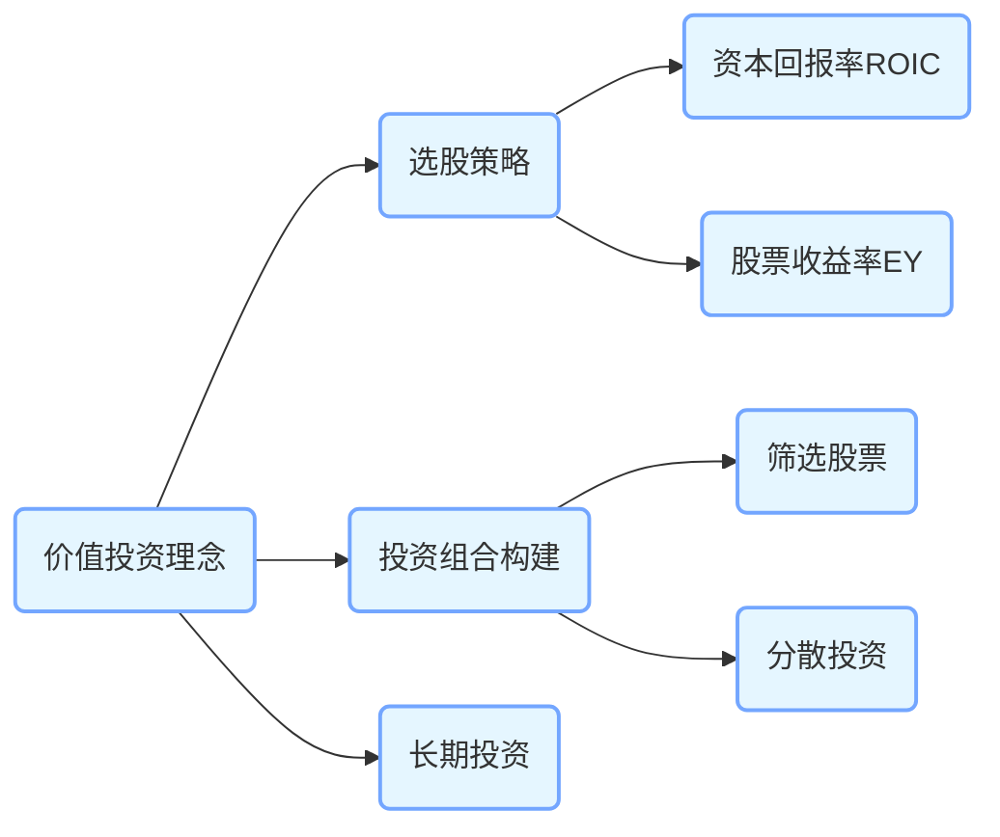

# 乔尔·格林布拉特的价值投资实践指南

> 关键词：乔尔·格林布拉特、价值投资、实践指南、选股策略、投资组合

> 摘要：本文围绕乔尔·格林布拉特的价值投资理念展开，深入剖析其核心概念、选股策略的算法原理，详细讲解相关数学模型和公式。通过项目实战展示如何运用其方法进行股票投资，探讨实际应用场景。同时推荐了学习价值投资的工具和资源，最后总结未来发展趋势与挑战，并解答常见问题，为投资者提供全面的价值投资实践指导。

## 1. 背景介绍 
### 1.1 目的和范围
本指南旨在深入探讨乔尔·格林布拉特的价值投资方法，为投资者提供一套系统的实践方案。我们将详细分析格林布拉特的选股策略、投资组合构建等核心内容，帮助读者理解并运用这些方法进行实际投资。范围涵盖从理论基础到实际操作的各个方面，包括算法原理、数学模型、代码实现以及实际应用场景等。

### 1.2 预期读者
本文适合对价值投资感兴趣的各类投资者，无论是初学者希望了解基本的投资理念和方法，还是有一定经验的投资者想要学习新的选股策略和优化投资组合，都能从本文中获得有价值的信息。同时，对于金融专业的学生和研究人员，本文也提供了深入研究价值投资的理论和实践案例。

### 1.3 文档结构概述
本文将按照以下结构展开：首先介绍核心概念与联系，明确价值投资的基本原理和格林布拉特选股策略的架构；接着阐述核心算法原理和具体操作步骤，并用Python代码详细说明；然后讲解相关的数学模型和公式，并举例说明；通过项目实战展示如何搭建开发环境、实现源代码以及对代码进行解读和分析；探讨实际应用场景；推荐学习价值投资的工具和资源；总结未来发展趋势与挑战；最后在附录中解答常见问题，并提供扩展阅读和参考资料。

### 1.4 术语表
#### 1.4.1 核心术语定义
- **价值投资**：一种投资策略，强调通过分析公司的内在价值，寻找被低估的股票进行投资，以获得长期的投资回报。
- **资本回报率（ROIC）**：衡量公司运用资本创造利润的效率，计算公式为息税前利润（EBIT）除以投入资本（IC）。
- **股票收益率（EY）**：反映股票的盈利能力，计算公式为息税前利润（EBIT）除以企业价值（EV）。
- **企业价值（EV）**：公司的市场价值加上债务减去现金及现金等价物。

#### 1.4.2 相关概念解释
- **选股策略**：根据一定的标准和方法，从众多股票中筛选出具有投资价值的股票的过程。
- **投资组合**：由多种不同的股票组成的集合，通过分散投资降低风险。
- **内在价值**：公司的真实价值，基于其未来的现金流、资产等因素进行评估。

#### 1.4.3 缩略词列表
- **ROIC**：Return on Invested Capital（资本回报率）
- **EY**：Earnings Yield（股票收益率）
- **EBIT**：Earnings Before Interest and Taxes（息税前利润）
- **IC**：Invested Capital（投入资本）
- **EV**：Enterprise Value（企业价值）

## 2. 核心概念与联系 
### 核心概念原理
乔尔·格林布拉特的价值投资理念核心在于寻找被市场低估的优质公司。他提出了一种简单而有效的选股策略，即通过综合考虑资本回报率（ROIC）和股票收益率（EY）来筛选股票。

资本回报率（ROIC）衡量了公司运用资本创造利润的效率，ROIC越高，说明公司利用资本的能力越强。股票收益率（EY）反映了股票的盈利能力，EY越高，意味着股票的性价比越高。

格林布拉特认为，同时具备高ROIC和高EY的公司往往被市场低估，具有较大的投资价值。通过对这两个指标进行排序和筛选，可以选出具有潜力的股票构建投资组合。

### 架构的文本示意图
```plaintext
价值投资理念
|
|-- 选股策略
|   |-- 资本回报率（ROIC）
|   |-- 股票收益率（EY）
|
|-- 投资组合构建
|   |-- 筛选股票
|   |-- 分散投资
|
|-- 长期投资
```

### Mermaid 流程图


## 3. 核心算法原理 & 具体操作步骤 
### 核心算法原理
格林布拉特的选股策略主要基于对ROIC和EY的排序和筛选。具体步骤如下：
1. 计算每只股票的ROIC和EY。
2. 对所有股票的ROIC进行排序，赋予排名。
3. 对所有股票的EY进行排序，赋予排名。
4. 将每只股票的ROIC排名和EY排名相加，得到综合排名。
5. 选择综合排名靠前的股票构建投资组合。

### 具体操作步骤
#### 步骤1：数据收集
收集所有股票的财务数据，包括EBIT、IC、EV等，这些数据可以从金融数据库或财经网站获取。

#### 步骤2：计算ROIC和EY
ROIC的计算公式为：$ROIC = \frac{EBIT}{IC}$
EY的计算公式为：$EY = \frac{EBIT}{EV}$

#### 步骤3：排名计算
对所有股票的ROIC和EY分别进行降序排序，排名从1开始，排名越小表示指标越好。

#### 步骤4：综合排名计算
将每只股票的ROIC排名和EY排名相加，得到综合排名。

#### 步骤5：股票筛选
选择综合排名靠前的一定数量的股票，例如前20只股票，构建投资组合。

### Python源代码详细阐述
```python
import pandas as pd

# 步骤1：数据收集（假设数据已经存储在一个DataFrame中）
data = pd.DataFrame({
    '股票代码': ['A', 'B', 'C', 'D', 'E'],
    'EBIT': [100, 200, 150, 300, 250],
    'IC': [500, 800, 600, 1200, 1000],
    'EV': [1000, 1500, 1200, 2000, 1800]
})

# 步骤2：计算ROIC和EY
data['ROIC'] = data['EBIT'] / data['IC']
data['EY'] = data['EBIT'] / data['EV']

# 步骤3：排名计算
data['ROIC排名'] = data['ROIC'].rank(ascending=False)
data['EY排名'] = data['EY'].rank(ascending=False)

# 步骤4：综合排名计算
data['综合排名'] = data['ROIC排名'] + data['EY排名']

# 步骤5：股票筛选
top_stocks = data.nsmallest(2, '综合排名')

print(top_stocks)
```

## 4. 数学模型和公式 & 详细讲解 & 举例说明 
### 数学模型和公式
#### 资本回报率（ROIC）
$ROIC = \frac{EBIT}{IC}$
其中，$EBIT$ 是息税前利润，$IC$ 是投入资本。ROIC衡量了公司运用资本创造利润的效率，ROIC越高，说明公司利用资本的能力越强。

#### 股票收益率（EY）
$EY = \frac{EBIT}{EV}$
其中，$EBIT$ 是息税前利润，$EV$ 是企业价值。EY反映了股票的盈利能力，EY越高，意味着股票的性价比越高。

#### 综合排名
$综合排名 = ROIC排名 + EY排名$
综合排名综合考虑了ROIC和EY两个指标，排名越小表示股票的综合表现越好。

### 详细讲解
- **ROIC**：ROIC反映了公司在不考虑财务杠杆和税收影响的情况下，运用投入资本创造利润的能力。一个高ROIC的公司通常具有较强的竞争力和盈利能力，因为它能够更有效地利用资本来创造收益。
- **EY**：EY衡量了股票的盈利收益率，即每单位企业价值所对应的息税前利润。EY越高，说明股票的盈利能力越强，投资者可以以较低的价格获得较高的收益。
- **综合排名**：通过将ROIC排名和EY排名相加，综合排名能够同时考虑公司的资本利用效率和股票的盈利能力。选择综合排名靠前的股票，可以筛选出那些既具有高盈利能力又能有效利用资本的公司。

### 举例说明
假设我们有以下三只股票的数据：
| 股票代码 | EBIT | IC | EV |
| ---- | ---- | ---- | ---- |
| A | 100 | 500 | 1000 |
| B | 200 | 800 | 1500 |
| C | 150 | 600 | 1200 |

#### 计算ROIC
- 股票A：$ROIC_A = \frac{100}{500} = 0.2$
- 股票B：$ROIC_B = \frac{200}{800} = 0.25$
- 股票C：$ROIC_C = \frac{150}{600} = 0.25$

#### 计算EY
- 股票A：$EY_A = \frac{100}{1000} = 0.1$
- 股票B：$EY_B = \frac{200}{1500} \approx 0.133$
- 股票C：$EY_C = \frac{150}{1200} = 0.125$

#### 排名计算
| 股票代码 | ROIC | ROIC排名 | EY | EY排名 |
| ---- | ---- | ---- | ---- | ---- |
| A | 0.2 | 3 | 0.1 | 3 |
| B | 0.25 | 1 | 0.133 | 1 |
| C | 0.25 | 1 | 0.125 | 2 |

#### 综合排名计算
| 股票代码 | ROIC排名 | EY排名 | 综合排名 |
| ---- | ---- | ---- | ---- |
| A | 3 | 3 | 6 |
| B | 1 | 1 | 2 |
| C | 1 | 2 | 3 |

从综合排名可以看出，股票B的综合排名最小，表现最好，其次是股票C，股票A表现最差。因此，在构建投资组合时，可以优先考虑股票B和股票C。

## 5. 项目实战：代码实际案例和详细解释说明 
### 5.1  开发环境搭建
#### 安装Python
首先，需要安装Python环境。可以从Python官方网站（https://www.python.org/downloads/）下载适合你操作系统的Python安装包，并按照安装向导进行安装。

#### 安装必要的库
在项目中，我们需要使用`pandas`库进行数据处理。可以使用以下命令安装`pandas`库：
```sh
pip install pandas
```

### 5.2  源代码详细实现和代码解读
```python
import pandas as pd

# 步骤1：数据收集（假设数据已经存储在一个CSV文件中）
data = pd.read_csv('stocks_data.csv')

# 步骤2：计算ROIC和EY
data['ROIC'] = data['EBIT'] / data['IC']
data['EY'] = data['EBIT'] / data['EV']

# 步骤3：排名计算
data['ROIC排名'] = data['ROIC'].rank(ascending=False)
data['EY排名'] = data['EY'].rank(ascending=False)

# 步骤4：综合排名计算
data['综合排名'] = data['ROIC排名'] + data['EY排名']

# 步骤5：股票筛选
top_stocks = data.nsmallest(10, '综合排名')

# 保存筛选结果到CSV文件
top_stocks.to_csv('selected_stocks.csv', index=False)

print(top_stocks)
```

### 代码解读与分析
- **数据收集**：使用`pandas`的`read_csv`函数从CSV文件中读取股票数据。假设CSV文件包含`股票代码`、`EBIT`、`IC`和`EV`等列。
- **计算ROIC和EY**：根据ROIC和EY的计算公式，使用`pandas`的列运算计算每只股票的ROIC和EY。
- **排名计算**：使用`pandas`的`rank`函数对ROIC和EY进行降序排名。
- **综合排名计算**：将ROIC排名和EY排名相加，得到综合排名。
- **股票筛选**：使用`pandas`的`nsmallest`函数选择综合排名靠前的10只股票。
- **保存结果**：使用`pandas`的`to_csv`函数将筛选结果保存到CSV文件中。

## 6. 实际应用场景 
### 个人投资者
个人投资者可以使用格林布拉特的价值投资策略进行股票投资。通过筛选出具有高ROIC和高EY的股票构建投资组合，可以提高投资的胜率和回报率。个人投资者可以根据自己的风险承受能力和投资目标，调整选股的数量和投资组合的权重。

### 机构投资者
机构投资者如基金公司、保险公司等可以将格林布拉特的选股策略作为投资决策的参考。机构投资者可以利用其专业的研究团队和数据资源，对更多的股票进行分析和筛选，构建更加优化的投资组合。同时，机构投资者还可以将该策略与其他投资策略相结合，实现多元化投资。

### 学术研究
在学术研究领域，格林布拉特的价值投资策略可以作为研究对象，探讨其有效性和适用性。研究人员可以通过实证分析，验证该策略在不同市场环境和时间段的表现，为投资者提供更科学的投资建议。

## 7. 工具和资源推荐
### 7.1 学习资源推荐
#### 7.1.1 书籍推荐
- 《股市稳赚》（乔尔·格林布拉特著）：格林布拉特在书中详细介绍了他的价值投资策略和选股方法，是学习其投资理念的必读之书。
- 《聪明的投资者》（本杰明·格雷厄姆著）：价值投资的经典之作，为投资者提供了基本的投资原则和方法。
- 《巴菲特致股东的信：股份公司教程》（沃伦·巴菲特著）：通过巴菲特的信件，了解他的投资哲学和决策过程。

#### 7.1.2 在线课程
- Coursera上的“投资学原理”课程：系统介绍了投资学的基本原理和方法，包括价值投资。
- Udemy上的“价值投资实战课程”：结合实际案例，讲解价值投资的选股策略和投资组合构建。

#### 7.1.3 技术博客和网站
- 雪球网：国内知名的投资社区，提供股票分析、投资策略分享等内容。
- Seeking Alpha：国外的投资研究网站，有大量的股票分析文章和投资策略讨论。

### 7.2 开发工具框架推荐
#### 7.2.1 IDE和编辑器
- PyCharm：功能强大的Python集成开发环境，适合开发Python投资分析程序。
- Jupyter Notebook：交互式的开发环境，方便进行数据探索和代码调试。

#### 7.2.2 调试和性能分析工具
- pdb：Python自带的调试工具，用于调试Python代码。
- cProfile：Python的性能分析工具，用于分析代码的运行时间和性能瓶颈。

#### 7.2.3 相关框架和库
- pandas：用于数据处理和分析的Python库，是投资分析中常用的工具。
- numpy：用于科学计算的Python库，提供高效的数组操作和数学函数。

### 7.3 相关论文著作推荐
#### 7.3.1 经典论文
- “The Cross - Section of Expected Stock Returns”（Eugene F. Fama and Kenneth R. French著）：提出了Fama - French三因子模型，对股票收益率的影响因素进行了深入研究。
- “Value and Growth Investing: Review and Synthesis”（Louis K. C. Chan and Josef Lakonishok著）：对价值投资和成长投资进行了综述和综合分析。

#### 7.3.2 最新研究成果
- 可以关注《Journal of Finance》、《Review of Financial Studies》等金融领域的顶级期刊，获取价值投资的最新研究成果。

#### 7.3.3 应用案例分析
- 可以参考一些投资机构的研究报告和案例分析，了解格林布拉特价值投资策略在实际应用中的效果和经验。

## 8. 总结：未来发展趋势与挑战
### 未来发展趋势
- **量化投资的融合**：随着科技的发展，量化投资将与价值投资进一步融合。投资者可以利用大数据、人工智能等技术，对更多的财务数据和市场信息进行分析，优化格林布拉特的选股策略，提高投资的准确性和效率。
- **国际化投资**：随着全球经济的一体化，投资者将更加关注国际市场。格林布拉特的价值投资策略可以应用于不同国家和地区的股票市场，为投资者提供更广阔的投资机会。
- **社会责任投资**：越来越多的投资者开始关注企业的社会责任，将环境、社会和治理（ESG）因素纳入投资决策。未来，价值投资可能会与社会责任投资相结合，筛选出既具有投资价值又符合社会道德标准的企业。

### 挑战
- **市场有效性**：随着市场的发展，市场的有效性可能会提高，使得被低估的股票越来越难被发现。投资者需要不断改进选股策略，寻找新的投资机会。
- **数据质量和可靠性**：价值投资依赖于准确的财务数据和市场信息。然而，数据的质量和可靠性可能存在问题，如财务造假、数据延迟等，这会影响投资决策的准确性。
- **宏观经济环境变化**：宏观经济环境的变化，如利率波动、通货膨胀、经济衰退等，会对股票市场产生重大影响。投资者需要密切关注宏观经济环境的变化，及时调整投资组合。

## 9. 附录：常见问题与解答
### 问题1：格林布拉特的选股策略适用于所有市场吗？
解答：格林布拉特的选股策略基于价值投资理念，理论上适用于各种市场。然而，不同市场的特点和环境可能会影响策略的效果。在新兴市场，由于市场的有效性相对较低，可能存在更多被低估的股票，策略的效果可能更好。但在成熟市场，市场竞争激烈，被低估的股票可能相对较少，需要更加精细地筛选和分析。

### 问题2：如何获取准确的财务数据？
解答：可以通过以下途径获取准确的财务数据：
- 金融数据库：如Wind、Bloomberg等，提供全面、准确的金融数据。
- 上市公司公告：可以从证券交易所的官方网站获取上市公司的定期报告和公告。
- 财经网站：如东方财富网、新浪财经等，提供股票的基本信息和财务数据。

### 问题3：投资组合需要多久调整一次？
解答：投资组合的调整频率取决于多个因素，如市场环境、公司基本面变化等。一般来说，可以每年或每半年对投资组合进行一次评估和调整。如果市场出现重大变化或公司基本面发生明显恶化，应及时调整投资组合。

## 10. 扩展阅读 & 参考资料
### 扩展阅读
- 《金融炼金术》（乔治·索罗斯著）：探讨了金融市场的运行规律和投资者的心理因素。
- 《漫步华尔街》（伯顿·马尔基尔著）：介绍了不同的投资策略和方法，对价值投资和技术分析进行了比较。

### 参考资料
- Joel Greenblatt, “The Little Book That Beats the Market”.
- Eugene F. Fama and Kenneth R. French, “The Cross - Section of Expected Stock Returns”.
- Louis K. C. Chan and Josef Lakonishok, “Value and Growth Investing: Review and Synthesis”.

作者：AI天才研究院/AI Genius Institute & 禅与计算机程序设计艺术 /Zen And The Art of Computer Programming