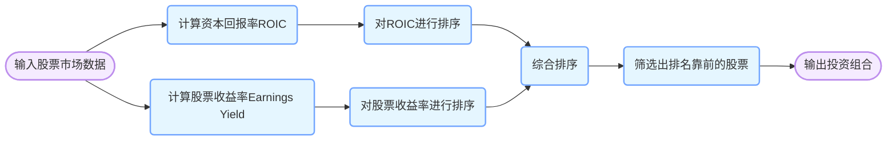

# 乔尔·格林布拉特的价值投资量化模型

> 关键词：乔尔·格林布拉特、价值投资、量化模型、选股策略、投资收益

> 摘要：本文深入探讨了乔尔·格林布拉特的价值投资量化模型。首先介绍了该模型提出的背景，包括目的、预期读者和文档结构等。接着详细阐述了模型的核心概念，通过文本示意图和Mermaid流程图展示其架构。对核心算法原理进行了深入剖析，并用Python源代码进行详细说明。同时给出了模型涉及的数学公式及具体案例。通过项目实战，展示了模型在实际中的应用，包括开发环境搭建、源代码实现与解读。还分析了该模型的实际应用场景，推荐了相关的学习资源、开发工具框架和论文著作。最后总结了模型的未来发展趋势与挑战，并提供了常见问题解答和扩展阅读参考资料。

## 1. 背景介绍 
### 1.1 目的和范围
乔尔·格林布拉特（Joel Greenblatt）是著名的价值投资者和对冲基金经理，他所提出的价值投资量化模型旨在为投资者提供一种系统化、科学化的选股方法。该模型的目的是帮助投资者筛选出被市场低估且具有较高盈利能力的股票，从而获得长期稳定的投资回报。

本文章的范围将围绕格林布拉特的价值投资量化模型展开，详细介绍其核心概念、算法原理、数学模型、实际应用等方面，同时通过项目实战和案例分析，帮助读者更好地理解和应用该模型。

### 1.2 预期读者
本文的预期读者包括对价值投资和量化投资感兴趣的投资者、金融分析师、量化交易员以及相关领域的研究人员。无论是初学者还是有一定投资经验的专业人士，都可以从本文中获取关于格林布拉特价值投资量化模型的深入知识和实践指导。

### 1.3 文档结构概述
本文将按照以下结构进行阐述：首先介绍背景信息，包括模型的目的、预期读者和文档结构；接着详细讲解核心概念和联系，通过示意图和流程图展示模型架构；然后深入分析核心算法原理，并用Python代码进行实现；之后介绍数学模型和公式，并通过具体案例进行说明；再通过项目实战展示模型的实际应用；分析实际应用场景；推荐相关的工具和资源；最后总结模型的未来发展趋势与挑战，提供常见问题解答和扩展阅读参考资料。

### 1.4 术语表
#### 1.4.1 核心术语定义
- **价值投资**：一种投资策略，通过分析股票的内在价值，寻找被市场低估的股票进行投资，以期在股票价格回归内在价值时获得收益。
- **量化模型**：利用数学和统计学方法，对投资策略进行量化分析和建模，以实现自动化的投资决策。
- **资本回报率（ROIC）**：衡量企业运用资本获得收益的能力，计算公式为息税前利润（EBIT）除以投入资本（IC）。
- **股票收益率（Earnings Yield）**：衡量股票盈利能力的指标，计算公式为息税前利润（EBIT）除以企业价值（EV）。

#### 1.4.2 相关概念解释
- **企业价值（EV）**：企业的市场价值，包括股权价值和债务价值，计算公式为市值加上总负债减去现金及现金等价物。
- **投入资本（IC）**：企业用于生产经营的资本，包括股东权益和债务，计算公式为总资产减去非付息流动负债减去现金及现金等价物。

#### 1.4.3 缩略词列表
- **ROIC**：Return on Invested Capital（资本回报率）
- **EBIT**：Earnings Before Interest and Taxes（息税前利润）
- **EV**：Enterprise Value（企业价值）
- **IC**：Invested Capital（投入资本）

## 2. 核心概念与联系 

### 核心概念原理
格林布拉特的价值投资量化模型基于两个核心指标：资本回报率（ROIC）和股票收益率（Earnings Yield）。其基本原理是通过对这两个指标进行排序，筛选出ROIC较高且股票收益率较高的股票，构建投资组合。

- **资本回报率（ROIC）**：反映了企业运用资本创造利润的能力。ROIC越高，说明企业的盈利能力越强，能够更有效地利用投入的资本。
- **股票收益率（Earnings Yield）**：反映了股票的盈利能力和估值水平。股票收益率越高，说明股票的盈利能力越强，同时估值相对较低。

### 架构的文本示意图
```plaintext
输入：股票市场数据（包括财务数据和市场数据）
|
|-- 计算资本回报率（ROIC）
|-- 计算股票收益率（Earnings Yield）
|
|-- 对ROIC进行排序
|-- 对股票收益率进行排序
|
|-- 综合排序，筛选出排名靠前的股票
|
输出：投资组合
```

### Mermaid流程图


## 3. 核心算法原理 & 具体操作步骤 

### 核心算法原理
格林布拉特的价值投资量化模型的核心算法是通过对资本回报率（ROIC）和股票收益率（Earnings Yield）进行排序，然后综合排名，筛选出排名靠前的股票。具体步骤如下：

1. **数据收集**：收集股票市场的财务数据和市场数据，包括息税前利润（EBIT）、投入资本（IC）、企业价值（EV）等。
2. **指标计算**：计算每只股票的资本回报率（ROIC）和股票收益率（Earnings Yield）。
    - 资本回报率（ROIC）计算公式：$ROIC = \frac{EBIT}{IC}$
    - 股票收益率（Earnings Yield）计算公式：$Earnings\ Yield = \frac{EBIT}{EV}$
3. **排序**：分别对ROIC和股票收益率进行排序，得到每只股票在两个指标上的排名。
4. **综合排名**：将每只股票在ROIC和股票收益率上的排名相加，得到综合排名。
5. **筛选股票**：根据综合排名，筛选出排名靠前的股票，构建投资组合。

### 具体操作步骤的Python源代码实现
```python
import pandas as pd

# 假设我们已经有了一个包含股票数据的DataFrame，列名为 'EBIT', 'IC', 'EV'
# 这里我们简单创建一个示例DataFrame
data = {
    'Stock': ['A', 'B', 'C', 'D', 'E'],
    'EBIT': [100, 200, 150, 300, 250],
    'IC': [500, 800, 600, 1200, 1000],
    'EV': [1500, 2000, 1800, 3500, 2800]
}
df = pd.DataFrame(data)

# 步骤2：计算ROIC和股票收益率
df['ROIC'] = df['EBIT'] / df['IC']
df['Earnings_Yield'] = df['EBIT'] / df['EV']

# 步骤3：排序
df['ROIC_Rank'] = df['ROIC'].rank(ascending=False)
df['Earnings_Yield_Rank'] = df['Earnings_Yield'].rank(ascending=False)

# 步骤4：综合排名
df['Composite_Rank'] = df['ROIC_Rank'] + df['Earnings_Yield_Rank']

# 步骤5：筛选股票，假设我们选择排名前2的股票
top_stocks = df.nsmallest(2, 'Composite_Rank')['Stock']

print(top_stocks)
```
### 代码解释
1. **数据准备**：创建一个包含股票数据的DataFrame，包括股票名称、息税前利润（EBIT）、投入资本（IC）和企业价值（EV）。
2. **指标计算**：使用`df['ROIC'] = df['EBIT'] / df['IC']`和`df['Earnings_Yield'] = df['EBIT'] / df['EV']`计算每只股票的ROIC和股票收益率。
3. **排序**：使用`rank()`方法对ROIC和股票收益率进行排序，得到每只股票在两个指标上的排名。
4. **综合排名**：将ROIC排名和股票收益率排名相加，得到综合排名。
5. **筛选股票**：使用`nsmallest()`方法筛选出综合排名前2的股票。

## 4. 数学模型和公式 & 详细讲解 & 举例说明 

### 数学模型和公式
- **资本回报率（ROIC）**：$ROIC = \frac{EBIT}{IC}$
其中，$EBIT$ 表示息税前利润，$IC$ 表示投入资本。

- **股票收益率（Earnings Yield）**：$Earnings\ Yield = \frac{EBIT}{EV}$
其中，$EBIT$ 表示息税前利润，$EV$ 表示企业价值。

### 详细讲解
- **资本回报率（ROIC）**：ROIC反映了企业运用资本创造利润的能力。ROIC越高，说明企业的盈利能力越强，能够更有效地利用投入的资本。例如，一家企业的息税前利润为100万元，投入资本为500万元，则其ROIC为 $\frac{100}{500} = 0.2$ 或 20%。

- **股票收益率（Earnings Yield）**：股票收益率反映了股票的盈利能力和估值水平。股票收益率越高，说明股票的盈利能力越强，同时估值相对较低。例如，一家企业的息税前利润为100万元，企业价值为1000万元，则其股票收益率为 $\frac{100}{1000} = 0.1$ 或 10%。

### 举例说明
假设我们有以下三只股票的数据：

| 股票 | 息税前利润（EBIT） | 投入资本（IC） | 企业价值（EV） |
| ---- | ------------------ | -------------- | -------------- |
| A    | 200                | 1000           | 2500           |
| B    | 300                | 1500           | 3500           |
| C    | 150                | 800            | 2000           |

1. **计算ROIC**
    - 股票A的ROIC：$ROIC_A = \frac{200}{1000} = 0.2$ 或 20%
    - 股票B的ROIC：$ROIC_B = \frac{300}{1500} = 0.2$ 或 20%
    - 股票C的ROIC：$ROIC_C = \frac{150}{800} = 0.1875$ 或 18.75%

2. **计算股票收益率**
    - 股票A的股票收益率：$Earnings\ Yield_A = \frac{200}{2500} = 0.08$ 或 8%
    - 股票B的股票收益率：$Earnings\ Yield_B = \frac{300}{3500} \approx 0.0857$ 或 8.57%
    - 股票C的股票收益率：$Earnings\ Yield_C = \frac{150}{2000} = 0.075$ 或 7.5%

3. **排序**
    - ROIC排名：A = B > C
    - 股票收益率排名：B > A > C

4. **综合排名**
    - 股票A的综合排名：2 + 2 = 4
    - 股票B的综合排名：2 + 1 = 3
    - 股票C的综合排名：3 + 3 = 6

5. **筛选股票**
如果我们选择综合排名前1的股票，则应选择股票B。

## 5. 项目实战：代码实际案例和详细解释说明 

### 5.1  开发环境搭建
要实现格林布拉特的价值投资量化模型，我们需要搭建以下开发环境：

- **编程语言**：Python
- **开发工具**：Jupyter Notebook 或 PyCharm
- **相关库**：pandas、numpy

可以使用以下命令安装所需的库：
```sh
pip install pandas numpy
```

### 5.2  源代码详细实现和代码解读
以下是一个更完整的Python代码示例，用于实现格林布拉特的价值投资量化模型：

```python
import pandas as pd
import numpy as np

# 步骤1：数据收集
# 假设我们从CSV文件中读取股票数据
data = pd.read_csv('stock_data.csv')

# 步骤2：指标计算
data['ROIC'] = data['EBIT'] / data['IC']
data['Earnings_Yield'] = data['EBIT'] / data['EV']

# 步骤3：排序
data['ROIC_Rank'] = data['ROIC'].rank(ascending=False)
data['Earnings_Yield_Rank'] = data['Earnings_Yield'].rank(ascending=False)

# 步骤4：综合排名
data['Composite_Rank'] = data['ROIC_Rank'] + data['Earnings_Yield_Rank']

# 步骤5：筛选股票
top_stocks = data.nsmallest(10, 'Composite_Rank')['Stock']

print(top_stocks)
```

### 代码解读与分析
1. **数据收集**：使用`pd.read_csv()`函数从CSV文件中读取股票数据。CSV文件应包含以下列：`Stock`（股票名称）、`EBIT`（息税前利润）、`IC`（投入资本）和`EV`（企业价值）。
2. **指标计算**：使用`data['ROIC'] = data['EBIT'] / data['IC']`和`data['Earnings_Yield'] = data['EBIT'] / data['EV']`计算每只股票的ROIC和股票收益率。
3. **排序**：使用`rank()`方法对ROIC和股票收益率进行排序，得到每只股票在两个指标上的排名。
4. **综合排名**：将ROIC排名和股票收益率排名相加，得到综合排名。
5. **筛选股票**：使用`nsmallest()`方法筛选出综合排名前10的股票。

## 6. 实际应用场景 
格林布拉特的价值投资量化模型在实际投资中有以下应用场景：

### 个人投资者
个人投资者可以使用该模型筛选出被市场低估且具有较高盈利能力的股票，构建自己的投资组合。通过定期更新数据和重新筛选股票，个人投资者可以实现长期稳定的投资回报。

### 基金经理
基金经理可以将该模型作为选股的参考工具，结合自己的投资策略和风险偏好，构建基金投资组合。该模型可以帮助基金经理提高选股效率，降低投资风险。

### 量化投资机构
量化投资机构可以对该模型进行改进和优化，结合其他量化指标和技术分析方法，开发更加复杂的量化投资策略。通过自动化交易系统，量化投资机构可以实现快速、高效的投资决策。

## 7. 工具和资源推荐
### 7.1 学习资源推荐
#### 7.1.1 书籍推荐
- 《股市稳赚》（*The Little Book That Beats the Market*）：乔尔·格林布拉特的经典著作，详细介绍了价值投资量化模型的原理和应用。
- 《聪明的投资者》（*The Intelligent Investor*）：本杰明·格雷厄姆的经典著作，价值投资的奠基之作，对理解价值投资的基本理念和方法有很大帮助。

#### 7.1.2 在线课程
- Coursera上的“量化投资策略”课程：介绍了量化投资的基本概念、方法和策略，包括价值投资量化模型的应用。
- Udemy上的“Python量化投资实战”课程：通过Python代码实现各种量化投资策略，包括格林布拉特的价值投资量化模型。

#### 7.1.3 技术博客和网站
- Seeking Alpha：提供股票分析、投资策略和市场评论等内容，是投资者获取信息和交流的重要平台。
- Quantopian：提供量化投资的研究平台和社区，投资者可以在该平台上开发、测试和分享量化投资策略。

### 7.2 开发工具框架推荐
#### 7.2.1 IDE和编辑器
- Jupyter Notebook：交互式编程环境，适合数据分析和模型开发，支持Python、R等多种编程语言。
- PyCharm：专业的Python集成开发环境，提供代码编辑、调试、版本控制等功能，适合大型项目的开发。

#### 7.2.2 调试和性能分析工具
- pdb：Python自带的调试工具，可以帮助开发者定位和解决代码中的问题。
- cProfile：Python的性能分析工具，可以分析代码的运行时间和函数调用次数，帮助开发者优化代码性能。

#### 7.2.3 相关框架和库
- pandas：强大的数据处理和分析库，提供了DataFrame和Series等数据结构，方便进行数据清洗、转换和分析。
- numpy：科学计算库，提供了高效的数组和矩阵运算功能，是数据分析和机器学习的基础库。

### 7.3 相关论文著作推荐
#### 7.3.1 经典论文
- Fama, E. F., & French, K. R. (1992). The cross-section of expected stock returns. *Journal of Finance*, 47(2), 427-465. 该论文提出了Fama-French三因子模型，对理解股票收益率的影响因素有重要意义。

#### 7.3.2 最新研究成果
- Asness, C. S., Frazzini, A., & Pedersen, L. H. (2019). Quality minus junk. *The Journal of Financial Economics*, 131(2), 349-378. 该论文研究了质量因子在股票投资中的应用，对格林布拉特的价值投资量化模型有一定的补充和扩展。

#### 7.3.3 应用案例分析
- Greenblatt, J. (2006). The little book that beats the market. Wiley. 乔尔·格林布拉特在该书中通过实际案例分析了价值投资量化模型的应用效果，为投资者提供了实践指导。

## 8. 总结：未来发展趋势与挑战
### 未来发展趋势
- **与其他量化指标结合**：未来，格林布拉特的价值投资量化模型可能会与其他量化指标，如动量因子、质量因子等结合，开发更加复杂和有效的量化投资策略。
- **人工智能和机器学习的应用**：随着人工智能和机器学习技术的发展，该模型可能会引入深度学习、强化学习等方法，对股票数据进行更深入的分析和挖掘，提高选股的准确性和效率。
- **全球化应用**：该模型可能会在全球范围内得到更广泛的应用，投资者可以利用该模型筛选不同国家和地区的股票，实现全球化的资产配置。

### 挑战
- **数据质量和准确性**：模型的有效性依赖于高质量和准确的数据。然而，股票市场数据存在噪声、缺失值和错误等问题，如何获取和处理高质量的数据是一个挑战。
- **市场环境变化**：股票市场是复杂多变的，市场环境的变化可能会导致模型的有效性下降。如何及时调整模型参数和策略，适应市场环境的变化是一个挑战。
- **竞争压力**：随着量化投资的普及，越来越多的投资者和机构开始使用量化模型进行投资，市场竞争日益激烈。如何在竞争中脱颖而出，获得超额收益是一个挑战。

## 9. 附录：常见问题与解答
### 问题1：格林布拉特的价值投资量化模型适用于所有市场吗？
答：该模型在不同市场的适用性可能会有所不同。一般来说，该模型在有效市场中可能会受到一定的限制，因为有效市场中股票价格已经反映了所有公开信息。然而，在一些新兴市场或无效市场中，该模型可能会有更好的应用效果。

### 问题2：如何获取股票的财务数据和市场数据？
答：可以通过以下途径获取股票的财务数据和市场数据：
- 金融数据提供商，如Wind、Bloomberg等。
- 证券交易所的官方网站。
- 财经网站，如新浪财经、东方财富等。

### 问题3：模型的参数可以调整吗？
答：可以。模型的参数，如ROIC和股票收益率的权重、筛选股票的数量等，可以根据投资者的风险偏好和投资目标进行调整。

## 10. 扩展阅读 & 参考资料
- 格林布拉特, J. (2006). *股市稳赚*. 机械工业出版社.
- 格雷厄姆, B. (2006). *聪明的投资者*. 人民邮电出版社.
- Fama, E. F., & French, K. R. (1992). The cross-section of expected stock returns. *Journal of Finance*, 47(2), 427-465.
- Asness, C. S., Frazzini, A., & Pedersen, L. H. (2019). Quality minus junk. *The Journal of Financial Economics*, 131(2), 349-378.

作者：AI天才研究院/AI Genius Institute & 禅与计算机程序设计艺术 /Zen And The Art of Computer Programming