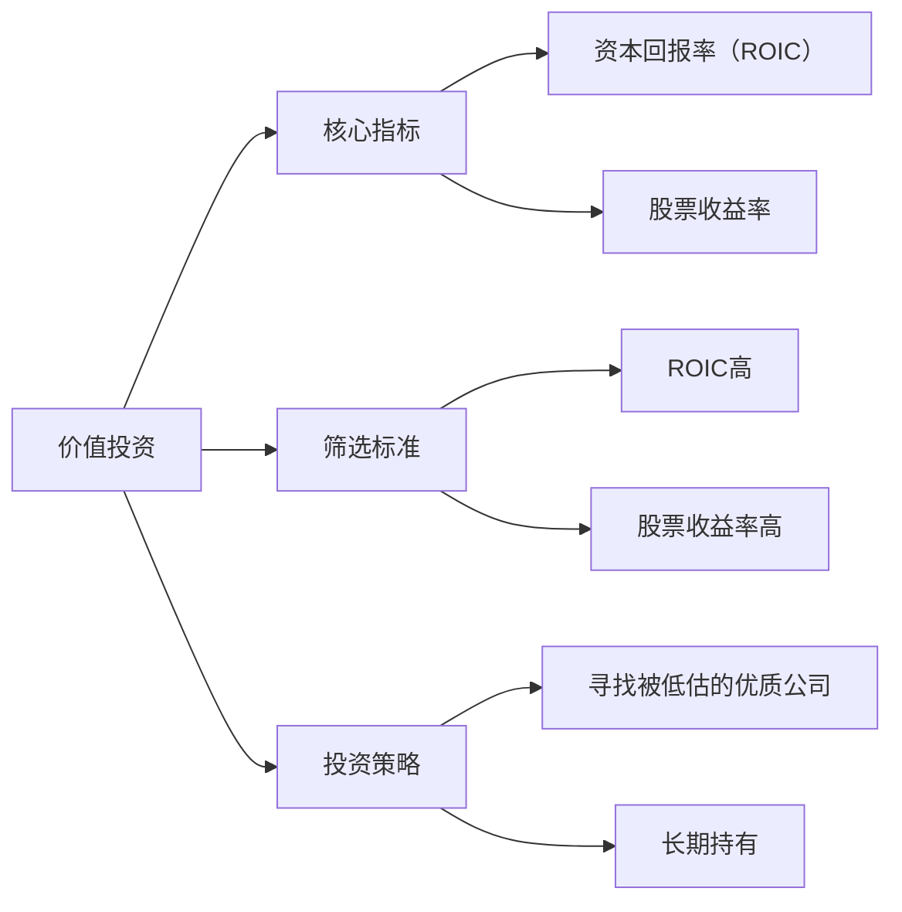

# 乔尔格林布拉特的价值投资教育

> 关键词：乔尔格林布拉特、价值投资、投资教育、投资策略、股票估值

> 摘要：本文聚焦于乔尔·格林布拉特的价值投资教育理念。通过深入剖析格林布拉特的核心投资概念、算法原理、数学模型等，详细讲解其价值投资方法。结合实际案例，展示如何在项目实战中运用这些方法进行股票投资。同时，探讨了价值投资在不同场景下的应用，推荐了相关的学习资源、开发工具和研究论文。最后总结了价值投资的未来发展趋势与挑战，并对常见问题进行解答，为投资者提供全面而深入的价值投资教育内容。

## 1. 背景介绍 
### 1.1 目的和范围
本文的目的在于全面介绍乔尔·格林布拉特的价值投资教育理念和方法，帮助投资者深入理解价值投资的核心思想，掌握实用的投资技巧。范围涵盖了格林布拉特价值投资的核心概念、算法原理、数学模型、实际应用案例等方面，旨在为投资者提供一个系统、深入的学习框架。

### 1.2 预期读者
本文预期读者包括对价值投资感兴趣的初学者、有一定投资经验但希望提升投资水平的投资者、金融专业学生以及从事投资研究的专业人士。

### 1.3 文档结构概述
本文首先介绍乔尔·格林布拉特价值投资的背景信息，包括目的、预期读者和文档结构。接着阐述核心概念与联系，通过文本示意图和Mermaid流程图展示投资理念的架构。然后详细讲解核心算法原理和具体操作步骤，并用Python代码进行说明。之后介绍数学模型和公式，并举例说明其应用。再通过项目实战展示代码实际案例和详细解释。随后探讨实际应用场景，推荐相关的工具和资源。最后总结未来发展趋势与挑战，解答常见问题，并提供扩展阅读和参考资料。

### 1.4 术语表
#### 1.4.1 核心术语定义
- **价值投资**：一种投资策略，通过分析公司的内在价值，寻找被市场低估的股票进行投资。
- **内在价值**：公司资产、盈利、现金流等基本面因素所决定的真实价值。
- **资本回报率（ROIC）**：衡量公司运用资本获取收益能力的指标，计算公式为息税前利润（EBIT）除以投入资本。
- **股票收益率**：公司的息税前利润与企业价值的比率。

#### 1.4.2 相关概念解释
- **企业价值（EV）**：公司的市场价值加上负债减去现金及现金等价物，反映了收购一家公司所需的总成本。
- **安全边际**：股票的内在价值与市场价格之间的差距，投资者通过购买具有较大安全边际的股票降低投资风险。

#### 1.4.3 缩略词列表
- **ROIC**：Return on Invested Capital，资本回报率
- **EBIT**：Earnings Before Interest and Taxes，息税前利润
- **EV**：Enterprise Value，企业价值

## 2. 核心概念与联系 

乔尔·格林布拉特的价值投资核心概念主要围绕寻找被低估的优质公司。其核心思想可以概括为通过两个关键指标来筛选股票：资本回报率（ROIC）和股票收益率。

### 核心概念原理
资本回报率反映了公司运用资本创造利润的能力，资本回报率越高，说明公司的经营效率越高。股票收益率则衡量了股票相对于其价格的盈利能力，收益率越高，说明股票越具有投资价值。

格林布拉特认为，投资者应该寻找那些资本回报率高且股票收益率也高的公司。这样的公司往往被市场低估，具有较大的上涨潜力。

### 架构的文本示意图
```plaintext
价值投资
|-- 核心指标
|   |-- 资本回报率（ROIC）
|   |-- 股票收益率
|-- 筛选标准
|   |-- ROIC高
|   |-- 股票收益率高
|-- 投资策略
|   |-- 寻找被低估的优质公司
|   |-- 长期持有
```

### Mermaid流程图


## 3. 核心算法原理 & 具体操作步骤 

### 核心算法原理
格林布拉特的价值投资算法主要基于对公司财务数据的分析，通过计算资本回报率和股票收益率来筛选股票。

#### 资本回报率（ROIC）的计算
资本回报率的计算公式为：
$$ROIC = \frac{EBIT}{投入资本}$$
其中，$EBIT$ 为息税前利润，投入资本可以通过公司的总资产减去流动负债和现金及现金等价物得到。

#### 股票收益率的计算
股票收益率的计算公式为：
$$股票收益率 = \frac{EBIT}{企业价值（EV）}$$
企业价值（EV）的计算公式为：
$$EV = 市场价值 + 负债 - 现金及现金等价物$$

### 具体操作步骤
1. **收集数据**：收集公司的财务报表，包括资产负债表、利润表和现金流量表，获取所需的财务数据，如 $EBIT$、总资产、流动负债、现金及现金等价物、市场价值等。
2. **计算指标**：根据上述公式计算每家公司的资本回报率和股票收益率。
3. **筛选股票**：按照资本回报率和股票收益率对公司进行排序，选择那些资本回报率高且股票收益率也高的公司。
4. **构建投资组合**：将筛选出的股票纳入投资组合，进行长期投资。

### Python源代码实现
```python
import pandas as pd

# 假设我们已经有了一个包含公司财务数据的DataFrame
# 列名分别为 'EBIT', '总资产', '流动负债', '现金及现金等价物', '市场价值'
data = {
    '公司名称': ['公司A', '公司B', '公司C'],
    'EBIT': [100, 200, 150],
    '总资产': [500, 800, 600],
    '流动负债': [100, 200, 150],
    '现金及现金等价物': [50, 80, 60],
    '市场价值': [400, 600, 500]
}
df = pd.DataFrame(data)

# 计算投入资本
df['投入资本'] = df['总资产'] - df['流动负债'] - df['现金及现金等价物']

# 计算资本回报率（ROIC）
df['ROIC'] = df['EBIT'] / df['投入资本']

# 计算企业价值（EV）
df['企业价值（EV）'] = df['市场价值'] + df['流动负债'] - df['现金及现金等价物']

# 计算股票收益率
df['股票收益率'] = df['EBIT'] / df['企业价值（EV）']

# 按照ROIC和股票收益率排序
df = df.sort_values(by=['ROIC', '股票收益率'], ascending=False)

# 选择排名靠前的公司
selected_stocks = df.head()

print(selected_stocks)
```

## 4. 数学模型和公式 & 详细讲解 & 举例说明 

### 数学模型和公式
#### 资本回报率（ROIC）
$$ROIC = \frac{EBIT}{投入资本}$$
详细讲解：$ROIC$ 衡量了公司运用投入资本获取利润的效率。投入资本是公司用于运营的实际资本，$EBIT$ 是公司在支付利息和所得税之前的利润。$ROIC$ 越高，说明公司利用资本创造利润的能力越强。

举例说明：假设公司A的 $EBIT$ 为100万元，投入资本为500万元，则其 $ROIC$ 为：
$$ROIC_A = \frac{100}{500} = 0.2 = 20\%$$

#### 股票收益率
$$股票收益率 = \frac{EBIT}{企业价值（EV）}$$
详细讲解：股票收益率反映了股票相对于其价格的盈利能力。企业价值（EV）考虑了公司的市场价值、负债和现金等因素，更全面地反映了收购一家公司所需的成本。股票收益率越高，说明股票越具有投资价值。

举例说明：假设公司B的 $EBIT$ 为200万元，企业价值（EV）为800万元，则其股票收益率为：
$$股票收益率_B = \frac{200}{800} = 0.25 = 25\%$$

#### 企业价值（EV）
$$EV = 市场价值 + 负债 - 现金及现金等价物$$
详细讲解：企业价值（EV）是收购一家公司所需的总成本，包括购买公司股权的成本（市场价值）和承担公司负债的成本，同时减去公司持有的现金及现金等价物。

举例说明：假设公司C的市场价值为500万元，负债为200万元，现金及现金等价物为50万元，则其企业价值（EV）为：
$$EV_C = 500 + 200 - 50 = 650（万元）$$

## 5. 项目实战：代码实际案例和详细解释说明 

### 5.1  开发环境搭建
- **Python环境**：建议使用Python 3.7及以上版本。可以通过Anaconda或Python官方网站下载安装。
- **必要的库**：需要安装 `pandas`、`numpy` 等库，用于数据处理和分析。可以使用以下命令进行安装：
```sh
pip install pandas numpy
```

### 5.2  源代码详细实现和代码解读
```python
import pandas as pd

# 读取包含公司财务数据的CSV文件
# 假设文件名为 'financial_data.csv'，列名包括 '公司名称', 'EBIT', '总资产', '流动负债', '现金及现金等价物', '市场价值'
df = pd.read_csv('financial_data.csv')

# 计算投入资本
df['投入资本'] = df['总资产'] - df['流动负债'] - df['现金及现金等价物']

# 计算资本回报率（ROIC）
df['ROIC'] = df['EBIT'] / df['投入资本']

# 计算企业价值（EV）
df['企业价值（EV）'] = df['市场价值'] + df['流动负债'] - df['现金及现金等价物']

# 计算股票收益率
df['股票收益率'] = df['EBIT'] / df['企业价值（EV）']

# 按照ROIC和股票收益率排序
df = df.sort_values(by=['ROIC', '股票收益率'], ascending=False)

# 选择排名靠前的前10家公司
selected_stocks = df.head(10)

# 保存筛选结果到新的CSV文件
selected_stocks.to_csv('selected_stocks.csv', index=False)

print(selected_stocks)
```

### 代码解读与分析
1. **数据读取**：使用 `pandas` 的 `read_csv` 函数读取包含公司财务数据的CSV文件。
2. **指标计算**：根据之前介绍的公式计算投入资本、资本回报率（ROIC）、企业价值（EV）和股票收益率。
3. **排序筛选**：使用 `sort_values` 函数按照ROIC和股票收益率对公司进行排序，并选择排名靠前的前10家公司。
4. **结果保存**：使用 `to_csv` 函数将筛选结果保存到新的CSV文件中。

通过这个项目实战，我们可以根据格林布拉特的价值投资方法筛选出具有投资潜力的公司。

## 6. 实际应用场景 
### 个人投资者
个人投资者可以运用格林布拉特的价值投资方法进行股票投资。通过筛选出资本回报率高且股票收益率高的公司，构建自己的投资组合。这种方法可以帮助个人投资者避免盲目跟风，选择具有内在价值的股票，提高投资收益。

### 机构投资者
机构投资者，如基金公司、保险公司等，也可以采用格林布拉特的价值投资方法进行资产配置。通过对大量公司的财务数据进行分析，筛选出优质的投资标的，优化投资组合，降低投资风险。

### 投资研究
在投资研究领域，格林布拉特的价值投资方法可以作为一种重要的研究工具。研究人员可以通过分析历史数据，验证该方法的有效性，并进一步探索其在不同市场环境下的应用。

## 7. 工具和资源推荐
### 7.1 学习资源推荐
#### 7.1.1 书籍推荐
- 《股市稳赚》（乔尔·格林布拉特著）：这本书详细介绍了格林布拉特的价值投资方法，是学习其投资理念的经典读物。
- 《聪明的投资者》（本杰明·格雷厄姆著）：价值投资的奠基之作，对格林布拉特的投资理念产生了重要影响。
- 《巴菲特致股东的信》（沃伦·巴菲特著）：通过巴菲特的信件，了解价值投资的实践经验和智慧。

#### 7.1.2 在线课程
- Coursera上的“投资学原理”课程：涵盖了价值投资的基本原理和方法。
- edX上的“金融市场”课程：提供了深入的金融市场知识，有助于理解价值投资的背景和应用。

#### 7.1.3 技术博客和网站
- Seeking Alpha：一个专业的投资研究网站，提供了大量的股票分析和投资策略文章。
- 雪球网：国内知名的投资社区，有很多投资者分享价值投资的经验和见解。

### 7.2 开发工具框架推荐
#### 7.2.1 IDE和编辑器
- PyCharm：一款功能强大的Python集成开发环境，适合进行数据处理和分析。
- Jupyter Notebook：交互式的编程环境，方便进行代码调试和数据分析。

#### 7.2.2 调试和性能分析工具
- `pdb`：Python自带的调试工具，可以帮助定位代码中的错误。
- `cProfile`：用于分析Python代码的性能，找出性能瓶颈。

#### 7.2.3 相关框架和库
- `pandas`：用于数据处理和分析的Python库，提供了丰富的数据结构和函数。
- `numpy`：用于科学计算的Python库，提供了高效的数组操作和数学函数。

### 7.3 相关论文著作推荐
#### 7.3.1 经典论文
- Fama, E. F., & French, K. R. (1992). The cross-section of expected stock returns. *The Journal of Finance*, 47(2), 427-465. 该论文提出了著名的Fama-French三因子模型，对价值投资的理论发展产生了重要影响。
- Graham, B., & Dodd, D. L. (1934). *Security analysis*. McGraw-Hill. 本杰明·格雷厄姆和戴维·多德的经典著作，奠定了价值投资的理论基础。

#### 7.3.2 最新研究成果
- Asness, C. S., Frazzini, A., & Pedersen, L. H. (2019). Quality minus junk. *The Journal of Financial Economics*, 131(2), 349-378. 该论文研究了质量因子在投资中的应用，与格林布拉特的价值投资理念有一定的关联。

#### 7.3.3 应用案例分析
- Greenblatt, J. (2006). *The little book that beats the market*. Wiley. 乔尔·格林布拉特在书中通过实际案例展示了其价值投资方法的应用效果。

## 8. 总结：未来发展趋势与挑战
### 未来发展趋势
- **数据驱动的价值投资**：随着大数据和人工智能技术的发展，价值投资将更加依赖于数据的分析和挖掘。投资者可以利用更丰富的数据来源和更先进的分析工具，提高价值评估的准确性和效率。
- **多因子模型的应用**：除了资本回报率和股票收益率，未来价值投资可能会结合更多的因子，如质量因子、动量因子等，构建更完善的投资模型。
- **全球投资机会的拓展**：随着全球经济的一体化，投资者将有更多机会在全球范围内寻找被低估的资产，价值投资的应用范围将不断扩大。

### 挑战
- **市场有效性的挑战**：在有效市场中，股票价格往往已经反映了所有的公开信息，寻找被低估的股票变得更加困难。投资者需要不断提高自己的分析能力和信息获取能力。
- **宏观经济环境的不确定性**：宏观经济环境的变化，如利率波动、通货膨胀、经济衰退等，会对公司的业绩和股票价格产生影响，增加了价值投资的难度。
- **模型的局限性**：任何投资模型都有其局限性，格林布拉特的价值投资方法也不例外。投资者需要认识到模型的不足，结合自己的经验和判断进行投资决策。

## 9. 附录：常见问题与解答
### 问题1：格林布拉特的价值投资方法适合所有投资者吗？
解答：格林布拉特的价值投资方法并不适合所有投资者。这种方法需要投资者具备一定的财务分析能力和耐心，能够进行长期投资。对于那些追求短期高收益、缺乏财务知识的投资者来说，可能不太适合。

### 问题2：如何获取准确的公司财务数据？
解答：可以通过以下途径获取准确的公司财务数据：
- 公司官方网站：公司会定期公布财务报表，这是最直接的数据源。
- 证券交易所网站：可以查询上市公司的财务报告和公告。
- 金融数据提供商：如Wind、东方财富等，提供了丰富的金融数据和分析工具。

### 问题3：价值投资需要多长时间才能看到效果？
解答：价值投资是一种长期投资策略，通常需要3 - 5年甚至更长时间才能看到明显的效果。在短期内，股票价格可能会受到市场情绪、宏观经济环境等因素的影响而波动，但从长期来看，优质公司的内在价值会逐渐得到体现。

## 10. 扩展阅读 & 参考资料
- 格林布拉特, J. (2006). *The little book that beats the market*. Wiley.
- 格雷厄姆, B., & 多德, D. L. (1934). *Security analysis*. McGraw-Hill.
- Fama, E. F., & French, K. R. (1992). The cross-section of expected stock returns. *The Journal of Finance*, 47(2), 427-465.
- Asness, C. S., Frazzini, A., & Pedersen, L. H. (2019). Quality minus junk. *The Journal of Financial Economics*, 131(2), 349-378.

作者：AI天才研究院/AI Genius Institute & 禅与计算机程序设计艺术 /Zen And The Art of Computer Programming