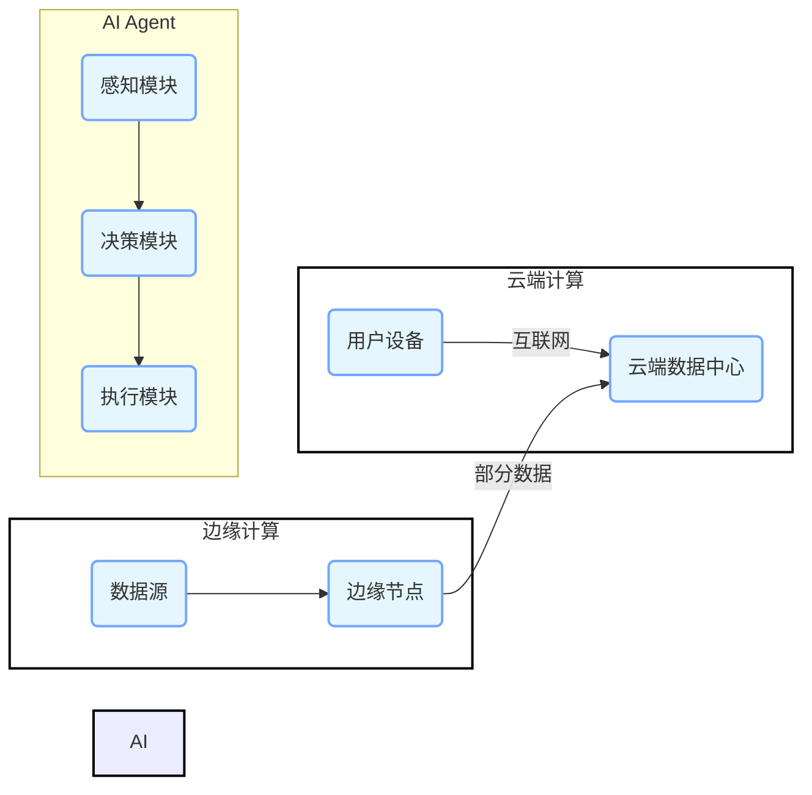

# 云端vs边缘计算：AI Agent的最佳运行环境

> 关键词：云端计算、边缘计算、AI Agent、运行环境、资源分配

> 摘要：本文深入探讨了云端计算和边缘计算两种环境对于AI Agent运行的优劣。通过对核心概念、算法原理、数学模型的详细阐述，结合实际项目案例，分析了在不同场景下AI Agent选择运行环境的关键因素。同时，提供了学习资源、开发工具等推荐，最后对未来发展趋势与挑战进行了总结，旨在为开发者和研究者在选择AI Agent的最佳运行环境时提供全面的参考。

## 1. 背景介绍 
### 1.1 目的和范围
随着人工智能技术的飞速发展，AI Agent在各个领域的应用越来越广泛。AI Agent是一种能够感知环境、做出决策并执行行动的智能实体，其运行环境的选择对于性能、效率和成本等方面都有着重要影响。本文的目的在于全面比较云端计算和边缘计算这两种主要的运行环境，分析它们各自的特点和适用场景，为AI Agent的开发和部署提供指导。范围涵盖了从基本概念的介绍到实际应用案例的分析，以及对未来发展趋势的展望。

### 1.2 预期读者
本文预期读者包括人工智能领域的开发者、研究人员、技术管理人员，以及对AI Agent运行环境感兴趣的相关专业人士。这些读者可能已经具备一定的计算机科学和人工智能基础，希望深入了解云端和边缘计算在AI Agent应用中的具体情况。

### 1.3 文档结构概述
本文将按照以下结构展开：首先介绍核心概念，包括云端计算、边缘计算和AI Agent的定义及联系；接着阐述核心算法原理和具体操作步骤，通过Python代码进行详细说明；然后给出数学模型和公式，并举例说明；之后通过项目实战展示代码实现和解读；再分析实际应用场景；推荐相关的工具和资源；最后总结未来发展趋势与挑战，并提供常见问题解答和扩展阅读参考资料。

### 1.4 术语表
#### 1.4.1 核心术语定义
- **云端计算（Cloud Computing）**：是一种基于互联网的计算方式，通过将计算任务分布在大量计算机构成的资源池上，使各种应用系统能够根据需要获取计算力、存储空间和信息服务。
- **边缘计算（Edge Computing）**：是指在靠近物或数据源头的一侧，采用网络、计算、存储、应用核心能力为一体的开放平台，就近提供最近端服务。
- **AI Agent**：是一种能够感知环境、根据感知信息做出决策并执行相应行动的智能实体，它可以是软件程序、机器人等形式。

#### 1.4.2 相关概念解释
- **云计算服务模式**：常见的有基础设施即服务（IaaS）、平台即服务（PaaS）和软件即服务（SaaS）。IaaS提供基础的计算、存储和网络资源；PaaS提供开发和运行应用程序的平台；SaaS则直接提供可使用的软件应用。
- **边缘节点**：是边缘计算中的关键组成部分，通常部署在靠近数据源的地方，如传感器、物联网设备附近，负责数据的初步处理和分析。

#### 1.4.3 缩略词列表
- **IaaS**：Infrastructure as a Service（基础设施即服务）
- **PaaS**：Platform as a Service（平台即服务）
- **SaaS**：Software as a Service（软件即服务）
- **AI**：Artificial Intelligence（人工智能）

## 2. 核心概念与联系 

### 核心概念原理
#### 云端计算原理
云端计算的核心原理是将大量的计算资源（如服务器、存储设备等）集中管理和分配。用户通过互联网连接到云端数据中心，根据自己的需求使用这些资源。云端数据中心拥有强大的计算能力和存储容量，可以处理大规模的数据和复杂的计算任务。例如，一家电商公司可以将其数据分析和处理任务交给云端计算平台，无需自己搭建和维护庞大的服务器集群。

#### 边缘计算原理
边缘计算的原理是将计算和数据存储靠近数据源进行。边缘节点可以对本地产生的数据进行实时处理和分析，减少数据传输到云端的延迟和带宽需求。例如，在一个智能工厂中，边缘节点可以安装在生产设备附近，对设备产生的实时数据进行分析，及时发现设备故障并采取措施。

#### AI Agent原理
AI Agent通过感知模块获取环境信息，然后利用决策模块根据预设的规则或学习到的模型做出决策，最后通过执行模块执行相应的行动。例如，一个智能客服AI Agent可以通过自然语言处理技术感知用户的问题，根据知识库或训练好的模型做出回答。

### 架构的文本示意图
```plaintext
云端计算架构：
用户设备 <-> 互联网 <-> 云端数据中心（服务器集群、存储系统）

边缘计算架构：
数据源（传感器、物联网设备） <-> 边缘节点（计算、存储） <-> 云端数据中心

AI Agent架构：
感知模块（获取环境信息） -> 决策模块（处理信息并做出决策） -> 执行模块（执行行动）
```

### Mermaid流程图


## 3. 核心算法原理 & 具体操作步骤 

### 云端计算核心算法原理
在云端计算中，资源分配算法是核心之一。常见的资源分配算法有贪心算法、遗传算法等。这里以贪心算法为例，假设我们要将多个计算任务分配到不同的服务器上，目标是最小化所有任务的完成时间。

#### Python源代码实现
```python
# 任务列表，每个任务的处理时间
tasks = [5, 3, 8, 2, 6]
# 服务器数量
num_servers = 3
# 初始化每个服务器的任务处理时间
server_times = [0] * num_servers

# 贪心算法分配任务
for task in tasks:
    # 找到当前处理时间最短的服务器
    min_index = server_times.index(min(server_times))
    # 将任务分配给该服务器
    server_times[min_index] += task

# 输出每个服务器的处理时间
print("每个服务器的处理时间:", server_times)
```

#### 具体操作步骤
1. 初始化每个服务器的任务处理时间为0。
2. 遍历每个任务，找到当前处理时间最短的服务器。
3. 将该任务分配给处理时间最短的服务器，并更新该服务器的处理时间。
4. 重复步骤2和3，直到所有任务分配完毕。

### 边缘计算核心算法原理
边缘计算中，数据缓存和预处理算法是关键。这里以简单的数据缓存算法为例，假设我们有一个边缘节点，要缓存最近的数据以减少数据传输到云端的次数。

#### Python源代码实现
```python
# 缓存大小
cache_size = 5
# 数据缓存
cache = []

# 模拟数据到达
data_stream = [1, 2, 3, 4, 5, 6, 7, 8, 9, 10]

for data in data_stream:
    if len(cache) < cache_size:
        # 如果缓存未满，直接添加数据
        cache.append(data)
    else:
        # 如果缓存已满，移除最早的数据
        cache.pop(0)
        cache.append(data)
    print("当前缓存:", cache)
```

#### 具体操作步骤
1. 初始化缓存为空，并设置缓存大小。
2. 遍历数据流中的每个数据。
3. 如果缓存未满，将数据添加到缓存中。
4. 如果缓存已满，移除最早进入缓存的数据，然后将新数据添加到缓存中。
5. 重复步骤2 - 4，直到处理完所有数据。

### AI Agent核心算法原理
以基于强化学习的AI Agent为例，这里使用Q - learning算法。假设我们有一个简单的网格世界，AI Agent要从起点走到终点。

#### Python源代码实现
```python
import numpy as np

# 定义网格世界的大小
grid_size = 4
# 定义动作空间：上、下、左、右
actions = ['up', 'down', 'left', 'right']
# 初始化Q表
Q = np.zeros((grid_size * grid_size, len(actions)))

# 定义奖励矩阵
rewards = np.array([
    [-1, -1, -1, -1],
    [-1, -10, -1, -1],
    [-1, -1, -1, -1],
    [-1, -1, -1, 10]
])

# 定义超参数
alpha = 0.1  # 学习率
gamma = 0.9  # 折扣因子
epsilon = 0.1  # 探索率
num_episodes = 1000

# 将状态转换为一维索引
def state_to_index(state):
    return state[0] * grid_size + state[1]

# 选择动作
def choose_action(state):
    if np.random.uniform(0, 1) < epsilon:
        # 探索：随机选择动作
        action_index = np.random.randint(0, len(actions))
    else:
        # 利用：选择Q值最大的动作
        state_index = state_to_index(state)
        action_index = np.argmax(Q[state_index])
    return action_index

# Q - learning算法
for episode in range(num_episodes):
    # 初始化状态
    state = [0, 0]
    done = False
    while not done:
        # 选择动作
        action_index = choose_action(state)
        action = actions[action_index]
        
        # 根据动作更新状态
        if action == 'up':
            new_state = [max(state[0] - 1, 0), state[1]]
        elif action == 'down':
            new_state = [min(state[0] + 1, grid_size - 1), state[1]]
        elif action == 'left':
            new_state = [state[0], max(state[1] - 1, 0)]
        else:
            new_state = [state[0], min(state[1] + 1, grid_size - 1)]
        
        # 获取奖励
        reward = rewards[new_state[0], new_state[1]]
        
        # 更新Q表
        state_index = state_to_index(state)
        new_state_index = state_to_index(new_state)
        Q[state_index, action_index] = (1 - alpha) * Q[state_index, action_index] + alpha * (reward + gamma * np.max(Q[new_state_index]))
        
        # 更新状态
        state = new_state
        
        # 判断是否到达终点
        if reward == 10:
            done = True

# 输出最终的Q表
print("最终的Q表:", Q)
```

#### 具体操作步骤
1. 初始化Q表和奖励矩阵。
2. 循环执行多个回合（episodes）。
3. 在每个回合中，初始化状态。
4. 选择动作：根据探索率决定是随机选择动作还是选择Q值最大的动作。
5. 根据动作更新状态，并获取相应的奖励。
6. 使用Q - learning公式更新Q表：
   $$Q(s,a)=(1 - \alpha)Q(s,a)+\alpha(r+\gamma\max_{a'}Q(s',a'))$$
   其中，$Q(s,a)$ 是当前状态 $s$ 下选择动作 $a$ 的Q值，$\alpha$ 是学习率，$r$ 是奖励，$\gamma$ 是折扣因子，$s'$ 是下一个状态。
7. 更新状态，判断是否到达终点，如果到达终点则结束该回合。
8. 重复步骤3 - 7，直到完成所有回合。

## 4. 数学模型和公式 & 详细讲解 & 举例说明 

### 云端计算数学模型
在云端计算的资源分配问题中，我们可以使用线性规划模型。假设我们有 $n$ 个任务，$m$ 个服务器，任务 $i$ 的处理时间为 $t_i$，服务器 $j$ 的处理能力为 $c_j$，任务 $i$ 是否分配给服务器 $j$ 用二进制变量 $x_{ij}$ 表示（$x_{ij}=1$ 表示分配，$x_{ij}=0$ 表示不分配）。目标是最小化所有任务的完成时间 $T$。

#### 数学公式
$$
\begin{align*}
\min T \\
\text{s.t.} \quad & \sum_{i = 1}^{n}t_ix_{ij}\leq T, \quad j = 1,2,\cdots,m \\
& \sum_{j = 1}^{m}x_{ij}=1, \quad i = 1,2,\cdots,n \\
& x_{ij}\in\{0,1\}, \quad i = 1,2,\cdots,n; j = 1,2,\cdots,m
\end{align*}
$$

#### 详细讲解
- 目标函数 $\min T$ 表示要最小化所有任务的完成时间。
- 约束条件 $\sum_{i = 1}^{n}t_ix_{ij}\leq T$ 表示每个服务器的任务处理时间不能超过总完成时间 $T$。
- 约束条件 $\sum_{j = 1}^{m}x_{ij}=1$ 表示每个任务必须分配给一个服务器。
- 约束条件 $x_{ij}\in\{0,1\}$ 表示 $x_{ij}$ 是二进制变量。

#### 举例说明
假设有3个任务，处理时间分别为 $t_1 = 5$，$t_2 = 3$，$t_3 = 8$，有2个服务器，处理能力足够。我们可以列出以下线性规划问题：
$$
\begin{align*}
\min T \\
\text{s.t.} \quad & 5x_{11}+3x_{21}+8x_{31}\leq T \\
& 5x_{12}+3x_{22}+8x_{32}\leq T \\
& x_{11}+x_{12}=1 \\
& x_{21}+x_{22}=1 \\
& x_{31}+x_{32}=1 \\
& x_{ij}\in\{0,1\}, \quad i = 1,2,3; j = 1,2
\end{align*}
$$

### 边缘计算数学模型
在边缘计算的数据缓存问题中，我们可以使用缓存命中率来衡量缓存的性能。假设在一段时间内，总请求次数为 $N$，其中命中缓存的次数为 $H$，则缓存命中率 $HR$ 可以表示为：

#### 数学公式
$$HR=\frac{H}{N}$$

#### 详细讲解
缓存命中率是衡量缓存有效性的重要指标，命中率越高，说明缓存能够满足更多的请求，减少了数据传输到云端的次数，从而提高了系统的性能。

#### 举例说明
假设在一个小时内，边缘节点共收到100个数据请求，其中有60个请求的数据在缓存中找到了，那么缓存命中率为：
$$HR=\frac{60}{100}=0.6$$

### AI Agent数学模型
在基于强化学习的AI Agent中，Q - learning算法的核心公式为：

#### 数学公式
$$Q(s,a)=(1 - \alpha)Q(s,a)+\alpha(r+\gamma\max_{a'}Q(s',a'))$$

#### 详细讲解
- $Q(s,a)$ 表示在状态 $s$ 下选择动作 $a$ 的Q值，Q值反映了在该状态下选择该动作的长期价值。
- $\alpha$ 是学习率，控制了新的经验对Q值更新的影响程度。$\alpha$ 越大，新的经验对Q值的影响越大；$\alpha$ 越小，Q值的更新越缓慢。
- $r$ 是执行动作 $a$ 后获得的即时奖励。
- $\gamma$ 是折扣因子，用于衡量未来奖励的重要性。$\gamma$ 越接近1，说明未来奖励的权重越大；$\gamma$ 越接近0，说明更关注即时奖励。
- $\max_{a'}Q(s',a')$ 表示在下一个状态 $s'$ 下选择最优动作的Q值。

#### 举例说明
假设当前状态 $s$ 下选择动作 $a$ 的Q值 $Q(s,a)=0.5$，学习率 $\alpha = 0.1$，折扣因子 $\gamma = 0.9$，执行动作 $a$ 后获得的即时奖励 $r = 1$，下一个状态 $s'$ 下选择最优动作的Q值 $\max_{a'}Q(s',a') = 0.8$。则更新后的Q值为：
$$
\begin{align*}
Q(s,a)&=(1 - 0.1)\times0.5+0.1\times(1 + 0.9\times0.8) \\
&=0.9\times0.5+0.1\times(1 + 0.72) \\
&=0.45+0.1\times1.72 \\
&=0.45 + 0.172 \\
&=0.622
\end{align*}
$$

## 5. 项目实战：代码实际案例和详细解释说明 

### 5.1  开发环境搭建
#### 云端计算开发环境
- **选择云计算平台**：可以选择阿里云、腾讯云、亚马逊AWS等。这里以阿里云为例，注册并登录阿里云账号，进入控制台。
- **创建云服务器实例**：选择合适的实例规格（如CPU、内存、存储等），操作系统可以选择Ubuntu 20.04。
- **安装必要的软件**：通过SSH连接到云服务器实例，安装Python 3和相关的开发库，如NumPy、Pandas等。
```bash
# 更新系统软件包
sudo apt update
# 安装Python 3
sudo apt install python3
# 安装pip
sudo apt install python3-pip
# 安装NumPy和Pandas
pip3 install numpy pandas
```

#### 边缘计算开发环境
- **选择边缘计算设备**：可以选择树莓派、NVIDIA Jetson等。这里以树莓派为例，将树莓派连接到电源和网络。
- **安装操作系统**：使用Raspberry Pi Imager工具将Raspbian操作系统安装到SD卡上，然后将SD卡插入树莓派。
- **安装必要的软件**：通过SSH连接到树莓派，安装Python 3和相关的开发库。
```bash
# 更新系统软件包
sudo apt update
# 安装Python 3
sudo apt install python3
# 安装pip
sudo apt install python3-pip
# 安装NumPy和Pandas
pip3 install numpy pandas
```

#### AI Agent开发环境
- **安装深度学习框架**：可以选择TensorFlow、PyTorch等。这里以PyTorch为例，根据自己的系统和CUDA版本安装相应的PyTorch。
```bash
# 安装PyTorch（CPU版本）
pip3 install torch torchvision
```

### 5.2  源代码详细实现和代码解读
#### 云端计算资源分配代码实现和解读
```python
import numpy as np

# 任务列表，每个任务的处理时间
tasks = [5, 3, 8, 2, 6]
# 服务器数量
num_servers = 3
# 初始化每个服务器的任务处理时间
server_times = [0] * num_servers

# 贪心算法分配任务
for task in tasks:
    # 找到当前处理时间最短的服务器
    min_index = server_times.index(min(server_times))
    # 将任务分配给该服务器
    server_times[min_index] += task

# 输出每个服务器的处理时间
print("每个服务器的处理时间:", server_times)
```
**代码解读**：
- `tasks` 列表存储了每个任务的处理时间。
- `num_servers` 表示服务器的数量。
- `server_times` 列表用于记录每个服务器的任务处理时间，初始值都为0。
- 通过 `for` 循环遍历每个任务，使用 `index` 方法找到当前处理时间最短的服务器的索引，然后将该任务的处理时间加到该服务器的处理时间上。
- 最后输出每个服务器的处理时间。

#### 边缘计算数据缓存代码实现和解读
```python
# 缓存大小
cache_size = 5
# 数据缓存
cache = []

# 模拟数据到达
data_stream = [1, 2, 3, 4, 5, 6, 7, 8, 9, 10]

for data in data_stream:
    if len(cache) < cache_size:
        # 如果缓存未满，直接添加数据
        cache.append(data)
    else:
        # 如果缓存已满，移除最早的数据
        cache.pop(0)
        cache.append(data)
    print("当前缓存:", cache)
```
**代码解读**：
- `cache_size` 定义了缓存的大小。
- `cache` 列表用于存储缓存的数据，初始为空。
- `data_stream` 列表模拟了数据的到达顺序。
- 通过 `for` 循环遍历数据流中的每个数据，判断缓存是否已满。如果未满，直接将数据添加到缓存中；如果已满，移除最早进入缓存的数据，然后将新数据添加到缓存中。
- 每次更新缓存后，输出当前的缓存内容。

#### AI Agent Q - learning代码实现和解读
```python
import numpy as np

# 定义网格世界的大小
grid_size = 4
# 定义动作空间：上、下、左、右
actions = ['up', 'down', 'left', 'right']
# 初始化Q表
Q = np.zeros((grid_size * grid_size, len(actions)))

# 定义奖励矩阵
rewards = np.array([
    [-1, -1, -1, -1],
    [-1, -10, -1, -1],
    [-1, -1, -1, -1],
    [-1, -1, -1, 10]
])

# 定义超参数
alpha = 0.1  # 学习率
gamma = 0.9  # 折扣因子
epsilon = 0.1  # 探索率
num_episodes = 1000

# 将状态转换为一维索引
def state_to_index(state):
    return state[0] * grid_size + state[1]

# 选择动作
def choose_action(state):
    if np.random.uniform(0, 1) < epsilon:
        # 探索：随机选择动作
        action_index = np.random.randint(0, len(actions))
    else:
        # 利用：选择Q值最大的动作
        state_index = state_to_index(state)
        action_index = np.argmax(Q[state_index])
    return action_index

# Q - learning算法
for episode in range(num_episodes):
    # 初始化状态
    state = [0, 0]
    done = False
    while not done:
        # 选择动作
        action_index = choose_action(state)
        action = actions[action_index]
        
        # 根据动作更新状态
        if action == 'up':
            new_state = [max(state[0] - 1, 0), state[1]]
        elif action == 'down':
            new_state = [min(state[0] + 1, grid_size - 1), state[1]]
        elif action == 'left':
            new_state = [state[0], max(state[1] - 1, 0)]
        else:
            new_state = [state[0], min(state[1] + 1, grid_size - 1)]
        
        # 获取奖励
        reward = rewards[new_state[0], new_state[1]]
        
        # 更新Q表
        state_index = state_to_index(state)
        new_state_index = state_to_index(new_state)
        Q[state_index, action_index] = (1 - alpha) * Q[state_index, action_index] + alpha * (reward + gamma * np.max(Q[new_state_index]))
        
        # 更新状态
        state = new_state
        
        # 判断是否到达终点
        if reward == 10:
            done = True

# 输出最终的Q表
print("最终的Q表:", Q)
```
**代码解读**：
- `grid_size` 定义了网格世界的大小。
- `actions` 列表定义了AI Agent可以采取的动作。
- `Q` 是Q表，初始值都为0。
- `rewards` 矩阵定义了每个状态的奖励值。
- `alpha`、`gamma` 和 `epsilon` 是超参数，分别表示学习率、折扣因子和探索率。
- `num_episodes` 表示训练的回合数。
- `state_to_index` 函数将二维状态转换为一维索引，方便在Q表中查找。
- `choose_action` 函数根据探索率决定是随机选择动作还是选择Q值最大的动作。
- 在每个回合中，初始化状态，然后不断选择动作、更新状态、获取奖励、更新Q表，直到到达终点。
- 最后输出最终的Q表。

### 5.3  代码解读与分析
#### 云端计算代码分析
贪心算法的优点是实现简单、计算速度快，能够在较短的时间内得到一个近似最优的解决方案。但是，贪心算法不一定能得到全局最优解，因为它只考虑了当前的最优选择，而没有考虑到未来的影响。

#### 边缘计算代码分析
简单的数据缓存算法可以有效地减少数据传输到云端的次数，提高系统的性能。但是，这种算法没有考虑数据的访问频率和重要性，可能会导致缓存中存储了一些不常用的数据，而常用的数据却被移除。

#### AI Agent代码分析
Q - learning算法是一种无模型的强化学习算法，它通过不断地尝试和学习，逐渐找到最优的策略。在这个网格世界的例子中，AI Agent通过学习Q表，能够逐渐找到从起点到终点的最优路径。但是，Q - learning算法的收敛速度可能较慢，特别是在状态空间和动作空间较大的情况下。

## 6. 实际应用场景 
### 云端计算应用场景
#### 大数据分析
许多企业需要处理和分析大量的数据，如电商公司的用户行为数据、金融机构的交易数据等。云端计算提供了强大的计算和存储能力，可以快速处理这些数据，提取有价值的信息。例如，阿里巴巴利用阿里云的云端计算平台，对海量的电商数据进行分析，为商家提供精准的营销建议。

#### 人工智能训练
人工智能模型的训练通常需要大量的计算资源和时间。云端计算平台可以提供GPU等高性能计算资源，加速模型的训练过程。例如，谷歌的TensorFlow在云端计算平台上进行大规模的模型训练，用于图像识别、自然语言处理等领域。

#### 软件开发和测试
软件开发和测试过程中需要使用不同的开发环境和测试设备。云端计算平台可以提供虚拟的开发和测试环境，方便开发人员进行代码编写、调试和测试。例如，微软的Azure云平台提供了各种开发工具和服务，支持软件开发和测试的全流程。

### 边缘计算应用场景
#### 智能交通
在智能交通系统中，车辆和交通基础设施需要实时处理大量的数据，如路况信息、车辆位置信息等。边缘计算可以在车辆和路边设备上进行数据处理和分析，减少数据传输到云端的延迟，提高交通系统的安全性和效率。例如，特斯拉的自动驾驶汽车通过边缘计算技术，实时处理摄像头和传感器的数据，做出驾驶决策。

#### 工业物联网
在工业物联网中，工厂的生产设备产生大量的实时数据，如设备状态、生产进度等。边缘计算可以在设备端对这些数据进行预处理和分析，及时发现设备故障和生产问题，提高生产效率和质量。例如，西门子的工业边缘计算平台可以实现对工业设备的实时监测和控制。

#### 智能家居
在智能家居系统中，各种智能设备如智能摄像头、智能门锁等产生大量的数据。边缘计算可以在设备端对这些数据进行处理和分析，实现本地的智能决策，减少对云端的依赖。例如，小米的智能家居设备通过边缘计算技术，实现了设备之间的互联互通和智能控制。

### AI Agent应用场景
#### 智能客服
AI Agent可以作为智能客服，通过自然语言处理技术与用户进行交互，回答用户的问题，提供服务。例如，淘宝的智能客服“阿里小蜜”可以快速响应用户的咨询，解决常见问题。

#### 机器人控制
AI Agent可以用于控制机器人的行为，使机器人能够自主地完成任务。例如，波士顿动力的机器人通过AI Agent技术，实现了复杂的运动和操作。

#### 游戏AI
AI Agent可以作为游戏中的智能对手，与玩家进行对抗。例如，在一些策略游戏中，AI Agent可以根据玩家的行为做出不同的决策，增加游戏的趣味性和挑战性。

## 7. 工具和资源推荐
### 7.1 学习资源推荐
#### 7.1.1 书籍推荐
- 《云计算：概念、技术与架构》：本书全面介绍了云计算的基本概念、技术和架构，适合初学者和有一定基础的开发者阅读。
- 《边缘计算：原理与实践》：详细讲解了边缘计算的原理、技术和应用案例，对理解边缘计算有很大的帮助。
- 《强化学习：原理与Python实现》：系统地介绍了强化学习的理论和算法，并通过Python代码进行实现，是学习AI Agent的重要参考书籍。

#### 7.1.2 在线课程
- Coursera上的“云计算基础”课程：由知名高校的教授授课，内容涵盖了云计算的基本概念、服务模式和应用场景。
- edX上的“边缘计算技术与应用”课程：介绍了边缘计算的关键技术和实际应用，通过实验和案例让学习者深入理解边缘计算。
- Udemy上的“强化学习实战”课程：通过实际项目和代码示例，帮助学习者掌握强化学习的算法和应用。

#### 7.1.3 技术博客和网站
- 阿里云开发者社区：提供了丰富的云计算技术文章、案例和教程，对云计算的学习和实践有很大的帮助。
- 边缘计算社区：专注于边缘计算领域的技术分享和交流，发布了许多关于边缘计算的最新研究成果和应用案例。
- OpenAI博客：发布了关于人工智能领域的最新研究和技术进展，对了解AI Agent的发展趋势有很大的帮助。

### 7.2 开发工具框架推荐
#### 7.2.1 IDE和编辑器
- PyCharm：是一款专门用于Python开发的集成开发环境，提供了丰富的代码编辑、调试和分析功能，适合开发AI Agent和云计算、边缘计算相关的Python程序。
- Visual Studio Code：是一款轻量级的代码编辑器，支持多种编程语言和插件，具有强大的代码编辑和调试功能，也可以用于云计算和边缘计算的开发。
- Jupyter Notebook：是一个交互式的开发环境，适合进行数据探索、模型训练和代码演示，常用于AI Agent的开发和实验。

#### 7.2.2 调试和性能分析工具
- TensorBoard：是TensorFlow提供的可视化工具，可以用于查看模型的训练过程、损失函数变化等信息，帮助开发者调试和优化模型。
- Py-Spy：是一个用于Python程序的性能分析工具，可以实时监测程序的CPU使用率、函数调用时间等信息，帮助开发者找出性能瓶颈。
- cProfile：是Python标准库中的性能分析工具，可以统计程序中各个函数的调用次数和执行时间，帮助开发者优化代码性能。

#### 7.2.3 相关框架和库
- TensorFlow：是一个开源的深度学习框架，提供了丰富的工具和接口，支持各种深度学习模型的开发和训练，可用于AI Agent的开发。
- PyTorch：是另一个流行的深度学习框架，具有简洁易用的接口和动态计算图的特点，也广泛应用于AI Agent的开发。
- Flask：是一个轻量级的Python Web框架，可用于开发云计算和边缘计算的Web应用程序。

### 7.3 相关论文著作推荐
#### 7.3.1 经典论文
- “A Mathematical Theory of Communication”：香农的这篇论文奠定了信息论的基础，对云计算和边缘计算中的数据传输和处理有重要的指导意义。
- “Reinforcement Learning: An Introduction”：这是强化学习领域的经典著作，系统地介绍了强化学习的理论和算法。
- “Cloud Computing and Parallel Processing”：该论文探讨了云计算和并行处理的关系，对理解云计算的计算原理有很大的帮助。

#### 7.3.2 最新研究成果
- “Edge AI: A Survey”：这篇论文对边缘AI的最新研究成果进行了综述，包括边缘计算在人工智能领域的应用、挑战和未来发展方向。
- “Cloud-Native AI: A Paradigm for Building and Deploying AI Applications”：介绍了云原生AI的概念和架构，为AI Agent在云端的开发和部署提供了新的思路。
- “Deep Reinforcement Learning for Autonomous Driving: A Survey”：对深度强化学习在自动驾驶领域的应用进行了总结和分析，对AI Agent在智能交通中的应用有重要的参考价值。

#### 7.3.3 应用案例分析
- “Case Studies in Cloud Computing for Big Data Analytics”：通过实际案例分析了云计算在大数据分析中的应用，包括数据存储、处理和分析的方法和技术。
- “Edge Computing in Industrial Internet of Things: A Case Study”：介绍了边缘计算在工业物联网中的应用案例，分析了边缘计算如何提高工业生产的效率和质量。
- “AI Agent Applications in E-commerce: A Case Study”：通过电商领域的案例，探讨了AI Agent在智能客服、推荐系统等方面的应用。

## 8. 总结：未来发展趋势与挑战
### 未来发展趋势
#### 云端与边缘计算融合
未来，云端计算和边缘计算将更加紧密地融合。边缘计算可以在靠近数据源的地方进行数据的初步处理和分析，减少数据传输到云端的压力；云端计算则可以提供强大的计算和存储能力，进行更复杂的数据分析和模型训练。例如，在智能城市中，边缘节点可以对城市中的传感器数据进行实时处理，将关键信息传输到云端进行综合分析和决策。

#### AI Agent智能化升级
AI Agent将不断智能化升级，具备更强的感知、决策和执行能力。随着深度学习、强化学习等技术的发展，AI Agent可以更好地理解环境和用户需求，做出更准确的决策。例如，未来的智能客服AI Agent可以通过情感分析技术，更好地理解用户的情绪，提供更贴心的服务。

#### 绿色计算
随着对环境保护的重视，云端计算和边缘计算将更加注重绿色计算。通过优化算法、提高硬件效率等方式，降低计算过程中的能耗。例如，一些云计算数据中心采用了液冷技术，提高了能源利用效率。

### 挑战
#### 数据安全和隐私保护
在云端计算和边缘计算环境中，数据的安全和隐私保护是一个重要的挑战。大量的数据在云端和边缘节点之间传输和存储，容易受到攻击和泄露。例如，黑客可能会攻击边缘节点，获取用户的敏感数据。因此，需要加强数据加密、访问控制等技术，保障数据的安全和隐私。

#### 资源管理和调度
在云端和边缘计算环境中，如何有效地管理和调度资源是一个难题。不同的应用和任务对资源的需求不同，需要根据实际情况进行合理的资源分配。例如，在云计算平台上，需要根据用户的需求和资源的使用情况，动态地调整服务器的配置和数量。

#### 标准和规范缺乏
目前，云端计算和边缘计算领域缺乏统一的标准和规范。不同的厂商和平台采用不同的技术和接口，导致系统之间的兼容性和互操作性较差。例如，不同的边缘计算设备可能无法与云端平台进行无缝对接。因此，需要制定统一的标准和规范，促进云端计算和边缘计算的发展。

## 9. 附录：常见问题与解答
### 云端计算和边缘计算有什么区别？
云端计算将计算任务集中在云端数据中心进行处理，具有强大的计算和存储能力，但数据传输延迟较大；边缘计算将计算和数据存储靠近数据源进行，减少了数据传输延迟，但计算和存储能力相对较弱。

### AI Agent在云端和边缘计算环境中各有什么优势？
在云端计算环境中，AI Agent可以利用云端的强大计算资源进行复杂的模型训练和数据分析；在边缘计算环境中，AI Agent可以实时处理本地数据，减少数据传输延迟，提高响应速度。

### 如何选择AI Agent的运行环境？
选择AI Agent的运行环境需要考虑多个因素，如数据的实时性要求、计算资源需求、数据安全和隐私等。如果对数据实时性要求较高，且数据处理可以在本地完成，适合选择边缘计算环境；如果需要进行大规模的模型训练和数据分析，适合选择云端计算环境。

### 云端计算和边缘计算的成本如何？
云端计算的成本主要包括云服务的使用费用，如计算资源、存储资源的使用费用等；边缘计算的成本主要包括边缘设备的采购、维护费用等。具体的成本需要根据实际的使用情况和需求来确定。

## 10. 扩展阅读 & 参考资料
### 扩展阅读
- 《人工智能：现代方法》：全面介绍了人工智能的基本概念、算法和应用，对深入理解AI Agent有很大的帮助。
- 《物联网：技术、应用与标准》：介绍了物联网的技术原理、应用场景和标准规范，对了解边缘计算在物联网中的应用有重要的参考价值。
- 《大数据技术原理与应用》：详细讲解了大数据的采集、存储、处理和分析技术，对云计算在大数据领域的应用有深入的分析。

### 参考资料
- 阿里云官方文档：https://help.aliyun.com/
- 腾讯云官方文档：https://cloud.tencent.com/document
- 亚马逊AWS官方文档：https://docs.aws.amazon.com/
- TensorFlow官方文档：https://www.tensorflow.org/guide
- PyTorch官方文档：https://pytorch.org/docs/stable/index.html

作者：AI天才研究院/AI Genius Institute & 禅与计算机程序设计艺术 /Zen And The Art of Computer Programming