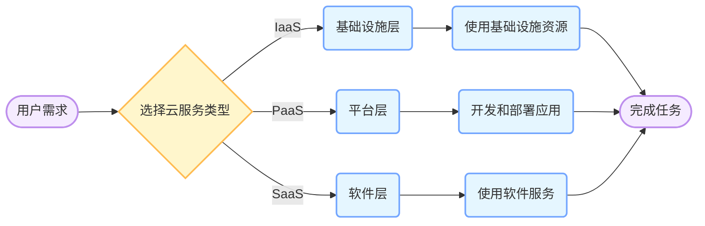

# 云计算技术发展对IT产业格局的影响

> 关键词：云计算技术、IT产业格局、云服务提供商、企业数字化转型、技术创新

> 摘要：本文深入探讨了云计算技术发展对IT产业格局所产生的多方面影响。首先介绍了云计算的相关背景知识，包括其目的、适用读者、文档结构和术语表。接着阐述了云计算的核心概念、算法原理及操作步骤，分析了其数学模型和公式。通过项目实战案例展示了云计算在实际中的应用，探讨了云计算在不同场景下的应用。推荐了学习云计算的工具和资源，最后总结了云计算技术未来的发展趋势与挑战，并对常见问题进行了解答。旨在帮助读者全面了解云计算技术对IT产业格局的改变，为相关从业者和研究者提供有价值的参考。

## 1. 背景介绍 
### 1.1 目的和范围
云计算技术作为当今IT领域的关键技术之一，其发展正在深刻地改变着IT产业的格局。本文的目的在于全面、深入地分析云计算技术发展对IT产业格局所产生的多方面影响，包括市场结构、企业运营模式、技术创新方向等。范围涵盖了云计算的基本概念、核心算法、数学模型，以及在实际项目中的应用案例，同时探讨了其在不同行业的应用场景和未来发展趋势。

### 1.2 预期读者
本文预期读者包括IT行业从业者，如软件开发者、系统架构师、云计算工程师等，他们可以通过本文深入了解云计算技术的原理和应用，为实际工作提供参考。同时，也适合企业管理者和决策者，帮助他们认识云计算技术对企业运营和产业竞争的影响，以便做出合理的战略决策。此外，对云计算技术感兴趣的研究者和学生也可以从本文中获取丰富的知识和研究思路。

### 1.3 文档结构概述
本文将按照以下结构进行阐述：首先介绍云计算技术的背景知识，包括目的、读者和文档结构概述等。接着详细讲解云计算的核心概念与联系，包括其原理和架构的文本示意图以及Mermaid流程图。然后深入分析核心算法原理和具体操作步骤，并给出Python源代码示例。之后介绍云计算的数学模型和公式，并结合具体例子进行说明。通过项目实战案例，展示云计算在实际中的应用，包括开发环境搭建、源代码实现和代码解读。探讨云计算在不同实际场景下的应用，推荐学习云计算的工具和资源，包括书籍、在线课程、开发工具等。最后总结云计算技术的未来发展趋势与挑战，解答常见问题，并提供扩展阅读和参考资料。

### 1.4 术语表
#### 1.4.1 核心术语定义
- **云计算（Cloud Computing）**：是一种基于互联网的计算方式，通过将计算资源（如服务器、存储、软件等）集中管理和提供，用户可以按需使用这些资源，而无需自己构建和维护硬件设施。
- **云服务提供商（Cloud Service Provider）**：指提供云计算服务的企业或机构，如亚马逊AWS、微软Azure、阿里云等。
- **虚拟化（Virtualization）**：将物理资源抽象为逻辑资源，使得多个虚拟机可以在同一物理服务器上运行，提高资源利用率。
- **SaaS（Software as a Service）**：软件即服务，用户通过互联网使用软件，无需在本地安装和维护。
- **PaaS（Platform as a Service）**：平台即服务，提供软件开发和部署的平台，用户可以在该平台上开发、测试和部署应用程序。
- **IaaS（Infrastructure as a Service）**：基础设施即服务，提供计算、存储和网络等基础设施资源，用户可以在这些资源上构建自己的应用系统。

#### 1.4.2 相关概念解释
- **分布式计算（Distributed Computing）**：将一个大的计算任务分解为多个小任务，分布在不同的计算机上同时进行处理，以提高计算效率。云计算通常采用分布式计算技术来实现资源的共享和协同工作。
- **弹性伸缩（Elastic Scaling）**：根据业务需求动态调整云计算资源的使用量，当业务量增加时可以自动增加资源，业务量减少时可以自动减少资源，以降低成本。
- **多租户（Multi - Tenancy）**：多个用户或租户可以共享同一云计算资源，但彼此之间相互隔离，保证数据的安全性和隐私性。

#### 1.4.3 缩略词列表
- **AWS**：Amazon Web Services，亚马逊云服务
- **Azure**：Microsoft Azure，微软云服务
- **VM**：Virtual Machine，虚拟机
- **API**：Application Programming Interface，应用程序编程接口

## 2. 核心概念与联系 
### 核心概念原理
云计算的核心概念基于分布式计算、虚拟化和网络技术。其原理是将大量的计算资源（服务器、存储设备等）通过网络连接起来，形成一个庞大的资源池。用户可以通过互联网访问这个资源池，根据自己的需求获取所需的计算、存储和软件服务。

在云计算中，虚拟化技术是关键。它将物理资源（如服务器、存储等）抽象为逻辑资源，使得多个虚拟机可以在同一物理服务器上运行。每个虚拟机都可以独立运行操作系统和应用程序，彼此之间相互隔离。这样可以提高资源的利用率，降低硬件成本。

云服务提供商负责管理和维护这个资源池，包括资源的分配、监控和故障恢复等。用户只需要根据自己的使用量支付费用，无需自己购买和维护硬件设施。

### 架构的文本示意图
云计算的架构通常可以分为三层：基础设施层（IaaS）、平台层（PaaS）和软件层（SaaS）。

- **基础设施层（IaaS）**：提供基础的计算、存储和网络资源，如服务器、硬盘、网络带宽等。用户可以在这些资源上构建自己的操作系统和应用程序。
- **平台层（PaaS）**：在IaaS的基础上，提供软件开发和部署的平台。用户可以使用平台提供的工具和服务来开发、测试和部署应用程序，无需关心底层的基础设施。
- **软件层（SaaS）**：直接向用户提供软件服务，用户通过互联网访问和使用软件，无需在本地安装和维护。

以下是一个简单的文本示意图：

```plaintext
+----------------------+
|        SaaS          |
| （软件即服务）       |
+----------------------+
|        PaaS          |
| （平台即服务）       |
+----------------------+
|        IaaS          |
| （基础设施即服务）   |
+----------------------+
|  物理基础设施（服务器、存储、网络）  |
+----------------------+
```

### Mermaid流程图


这个流程图展示了用户根据自己的需求选择不同的云服务类型（IaaS、PaaS、SaaS），然后分别使用相应的服务完成任务的过程。

## 3. 核心算法原理 & 具体操作步骤 
### 核心算法原理
云计算中的核心算法之一是资源分配算法，其目的是合理地将云计算资源分配给不同的用户和任务，以提高资源利用率和系统性能。下面以简单的贪心算法为例，介绍资源分配的基本原理。

贪心算法的基本思想是在每一步都选择当前看起来最优的选择，从而希望最终得到全局最优解。在资源分配中，贪心算法可以根据任务的优先级和资源需求，优先将资源分配给优先级高的任务。

### Python源代码示例
```python
# 定义任务类
class Task:
    def __init__(self, id, priority, resource_demand):
        self.id = id
        self.priority = priority
        self.resource_demand = resource_demand

    def __repr__(self):
        return f"Task(id={self.id}, priority={self.priority}, resource_demand={self.resource_demand})"

# 定义资源分配函数
def resource_allocation(tasks, total_resources):
    # 按照优先级从高到低对任务进行排序
    sorted_tasks = sorted(tasks, key=lambda x: x.priority, reverse=True)
    allocated_resources = 0
    allocated_tasks = []

    for task in sorted_tasks:
        if allocated_resources + task.resource_demand <= total_resources:
            # 如果资源足够，分配资源给该任务
            allocated_resources += task.resource_demand
            allocated_tasks.append(task)

    return allocated_tasks

# 示例任务列表
tasks = [
    Task(1, 3, 20),
    Task(2, 1, 10),
    Task(3, 2, 15)
]

# 总资源量
total_resources = 30

# 进行资源分配
allocated_tasks = resource_allocation(tasks, total_resources)

print("分配到资源的任务:", allocated_tasks)
```

### 具体操作步骤
1. **定义任务信息**：首先，需要定义每个任务的信息，包括任务的ID、优先级和资源需求。在上述代码中，通过`Task`类来表示任务。
2. **对任务进行排序**：根据任务的优先级对任务列表进行排序，优先级高的任务排在前面。在代码中，使用`sorted`函数和`lambda`表达式来实现排序。
3. **资源分配**：遍历排序后的任务列表，对于每个任务，检查当前剩余的资源是否足够分配给该任务。如果足够，则将资源分配给该任务，并更新已分配的资源量。
4. **输出结果**：最后，输出分配到资源的任务列表。

## 4. 数学模型和公式 & 详细讲解 & 举例说明 
### 资源利用率数学模型
资源利用率是衡量云计算系统性能的重要指标之一。设 $R_{total}$ 为云计算系统的总资源量，$R_{used}$ 为已使用的资源量，则资源利用率 $U$ 可以用以下公式表示：

$$U=\frac{R_{used}}{R_{total}}\times 100\%$$

### 详细讲解
资源利用率反映了云计算系统中资源的使用效率。当资源利用率接近100%时，说明系统的资源得到了充分利用；当资源利用率较低时，说明系统中存在闲置资源，需要优化资源分配策略。

### 举例说明
假设一个云计算系统的总存储资源为 $R_{total} = 1000GB$，当前已使用的存储资源为 $R_{used} = 600GB$，则该系统的存储资源利用率为：

$$U=\frac{600}{1000}\times 100\% = 60\%$$

这意味着该系统的存储资源有60%被使用，还有40%的资源处于闲置状态。可以通过调整资源分配策略，将闲置资源分配给有需求的任务，以提高资源利用率。

### 任务调度的数学模型
在云计算中，任务调度的目标是在满足任务约束条件的前提下，最小化任务的完成时间。设 $T = \{t_1, t_2, \cdots, t_n\}$ 为任务集合，$M = \{m_1, m_2, \cdots, m_m\}$ 为虚拟机集合，$c_{ij}$ 表示任务 $t_i$ 在虚拟机 $m_j$ 上的执行成本，$x_{ij}$ 为决策变量，当任务 $t_i$ 分配给虚拟机 $m_j$ 时，$x_{ij} = 1$，否则 $x_{ij} = 0$。则任务调度问题可以表示为以下线性规划模型：

$$\min \sum_{i = 1}^{n}\sum_{j = 1}^{m}c_{ij}x_{ij}$$

约束条件：

- $\sum_{j = 1}^{m}x_{ij} = 1, \forall i = 1, 2, \cdots, n$（每个任务只能分配到一个虚拟机上）
- $\sum_{i = 1}^{n}r_{i}x_{ij} \leq R_j, \forall j = 1, 2, \cdots, m$（每个虚拟机的资源限制）

其中，$r_{i}$ 为任务 $t_i$ 的资源需求，$R_j$ 为虚拟机 $m_j$ 的资源总量。

### 详细讲解
这个数学模型的目标是最小化所有任务的执行成本之和。第一个约束条件保证每个任务只能分配到一个虚拟机上，第二个约束条件保证每个虚拟机的资源使用不超过其总量。通过求解这个线性规划问题，可以得到最优的任务调度方案。

### 举例说明
假设有3个任务 $T = \{t_1, t_2, t_3\}$ 和2个虚拟机 $M = \{m_1, m_2\}$，任务在虚拟机上的执行成本矩阵 $C$ 为：

$$C=\begin{bmatrix}
2 & 3 \\
4 & 1 \\
5 & 2
\end{bmatrix}$$

任务的资源需求向量 $r = [2, 3, 4]$，虚拟机的资源总量向量 $R = [6, 7]$。则可以将上述数据代入线性规划模型中，通过求解该模型得到最优的任务调度方案。

## 5. 项目实战：代码实际案例和详细解释说明 
### 5.1  开发环境搭建
本项目使用Python进行开发，需要安装以下库：

- **Flask**：一个轻量级的Web框架，用于构建Web应用程序。
- **Boto3**：AWS的Python SDK，用于与AWS云服务进行交互。

可以使用以下命令安装这些库：

```sh
pip install flask boto3
```

同时，需要配置AWS的访问密钥和密钥ID，可以通过以下步骤进行配置：

1. 登录AWS控制台，进入“安全凭证”页面，创建一个新的访问密钥。
2. 安装AWS CLI，并使用以下命令配置访问密钥：

```sh
aws configure
```

按照提示输入访问密钥和密钥ID，以及默认的区域和输出格式。

### 5.2  源代码详细实现和代码解读
以下是一个简单的基于Flask和AWS S3的文件上传和下载示例：

```python
from flask import Flask, request, send_file
import boto3
import os

app = Flask(__name__)

# 初始化S3客户端
s3 = boto3.client('s3')

# 定义S3存储桶名称
BUCKET_NAME = 'my-cloud-storage-bucket'

# 文件上传接口
@app.route('/upload', methods=['POST'])
def upload_file():
    file = request.files['file']
    if file:
        # 上传文件到S3存储桶
        s3.upload_fileobj(file, BUCKET_NAME, file.filename)
        return 'File uploaded successfully'
    return 'No file provided'

# 文件下载接口
@app.route('/download/<filename>', methods=['GET'])
def download_file(filename):
    try:
        # 从S3存储桶下载文件到本地临时目录
        local_file_path = os.path.join('/tmp', filename)
        s3.download_file(BUCKET_NAME, filename, local_file_path)
        # 返回文件给客户端
        return send_file(local_file_path, as_attachment=True)
    except Exception as e:
        return f'Error downloading file: {str(e)}'

if __name__ == '__main__':
    app.run(debug=True)
```

### 代码解读与分析
1. **导入必要的库**：导入Flask、boto3和os库，分别用于构建Web应用程序、与AWS S3进行交互和处理文件路径。
2. **初始化Flask应用和S3客户端**：创建一个Flask应用实例，并使用boto3初始化S3客户端。
3. **定义S3存储桶名称**：指定要使用的S3存储桶名称。
4. **文件上传接口**：定义一个`/upload`的POST接口，接收客户端上传的文件。使用`s3.upload_fileobj`方法将文件上传到S3存储桶。
5. **文件下载接口**：定义一个`/download/<filename>`的GET接口，根据文件名从S3存储桶下载文件到本地临时目录。使用`send_file`方法将文件返回给客户端。
6. **运行Flask应用**：使用`app.run`方法启动Flask应用。

## 6. 实际应用场景 
### 企业数字化转型
云计算技术为企业的数字化转型提供了强大的支持。企业可以将传统的本地数据中心迁移到云端，降低硬件成本和维护工作量。通过使用云服务，企业可以快速部署新的应用程序和服务，提高业务响应速度。例如，企业可以使用SaaS模式的办公软件，如Office 365，员工可以通过互联网随时随地访问和使用办公软件，提高工作效率。

### 大数据分析
云计算提供了强大的计算和存储能力，非常适合大数据分析。企业可以将大量的数据存储在云端，并使用云服务提供商提供的大数据分析工具，如AWS EMR、Google BigQuery等，对数据进行处理和分析。通过大数据分析，企业可以发现潜在的商业机会，优化业务流程，提高决策的科学性。

### 人工智能和机器学习
人工智能和机器学习需要大量的计算资源来训练模型。云计算提供了弹性的计算资源，企业可以根据需要随时调整计算资源的使用量，降低模型训练的成本。例如，企业可以使用阿里云的机器学习平台PAI，快速构建和训练机器学习模型，应用于图像识别、自然语言处理等领域。

### 游戏开发和运营
游戏开发和运营需要高并发的服务器支持和大规模的存储。云计算可以提供弹性的服务器资源和分布式存储，满足游戏的高并发需求。游戏开发者可以使用云服务提供商提供的游戏开发平台，如腾讯云游戏解决方案，快速开发和部署游戏。同时，云计算还可以提供游戏的实时监控和运维服务，提高游戏的稳定性和用户体验。

## 7. 工具和资源推荐
### 7.1 学习资源推荐
#### 7.1.1 书籍推荐
- 《云计算：概念、技术与架构》：本书全面介绍了云计算的基本概念、关键技术和架构设计，是学习云计算的经典书籍。
- 《深入理解云计算：核心技术剖析与应用实践》：深入剖析了云计算的核心技术，如虚拟化、分布式存储、资源管理等，并结合实际案例进行讲解。
- 《Python云计算实战》：通过Python代码示例，介绍了如何使用Python与云服务进行交互，实现云计算的自动化管理。

#### 7.1.2 在线课程
- Coursera上的“云计算基础”课程：由知名大学的教授授课，系统地介绍了云计算的基本概念、技术和应用。
- edX上的“云服务与架构”课程：深入讲解了云服务的架构设计和实现方法，适合有一定基础的学习者。
- 阿里云大学的云计算课程：提供了丰富的云计算课程，包括入门课程、高级课程和实战课程，适合不同层次的学习者。

#### 7.1.3 技术博客和网站
- InfoQ云计算频道：提供了云计算领域的最新技术文章、行业动态和案例分析。
- 51CTO云计算频道：专注于云计算技术的分享和交流，有大量的技术教程和实践经验分享。
- 开源中国云计算板块：关注开源云计算项目的发展，提供了相关的技术文档和代码示例。

### 7.2 开发工具框架推荐
#### 7.2.1 IDE和编辑器
- PyCharm：一款专业的Python集成开发环境，支持代码编辑、调试、版本控制等功能，非常适合Python云计算开发。
- Visual Studio Code：一款轻量级的代码编辑器，支持多种编程语言和插件扩展，可用于云计算项目的开发和调试。
- IntelliJ IDEA：一款强大的Java集成开发环境，也支持Python等其他语言，适合开发基于Java的云计算应用。

#### 7.2.2 调试和性能分析工具
- AWS CloudWatch：AWS提供的监控和日志管理服务，可以实时监控云计算资源的使用情况和性能指标。
- Google Stackdriver：Google Cloud提供的监控和调试工具，支持对应用程序的性能分析和错误排查。
- New Relic：一款全面的应用性能管理工具，可用于监控云计算应用的性能和用户体验。

#### 7.2.3 相关框架和库
- Flask：一个轻量级的Python Web框架，适合快速开发云计算Web应用。
- Django：一个功能强大的Python Web框架，提供了丰富的插件和工具，可用于开发大型的云计算应用。
- Boto3：AWS的Python SDK，用于与AWS云服务进行交互，支持S3、EC2、Lambda等多种服务。

### 7.3 相关论文著作推荐
#### 7.3.1 经典论文
- “Cloud Computing and Grid Computing 360-Degree Compared”：比较了云计算和网格计算的异同点，对云计算的发展起到了重要的推动作用。
- “A View of Cloud Computing”：提出了云计算的概念和架构，是云计算领域的经典论文之一。
- “The Datacenter as a Computer: An Introduction to the Design of Warehouse-Scale Machines”：介绍了数据中心的设计和管理，为云计算的数据中心建设提供了理论基础。

#### 7.3.2 最新研究成果
- 在ACM SIGCOMM、IEEE INFOCOM等顶级学术会议上，每年都会有关于云计算技术的最新研究成果发表。可以关注这些会议的论文集，了解云计算领域的最新研究动态。
- 学术期刊如ACM Transactions on Internet Technology、IEEE Transactions on Cloud Computing等也会发表云计算领域的高质量研究论文。

#### 7.3.3 应用案例分析
- Gartner的云计算应用案例报告：提供了不同行业的云计算应用案例分析，包括金融、医疗、制造业等，对企业的云计算应用实践具有重要的参考价值。
- 各大云服务提供商的官方网站上也会发布一些云计算应用案例，如AWS、Azure、阿里云等，可以了解这些云服务在实际项目中的应用情况。

## 8. 总结：未来发展趋势与挑战
### 未来发展趋势
- **混合云与多云架构**：越来越多的企业将采用混合云与多云架构，将公有云、私有云和多个云服务提供商的资源进行整合，以满足不同业务场景的需求。
- **人工智能与云计算的融合**：人工智能和机器学习的发展需要大量的计算资源，云计算将为其提供强大的支持。未来，人工智能与云计算的融合将更加紧密，推动智能云的发展。
- **边缘计算与云计算的协同**：边缘计算可以在靠近数据源的地方进行数据处理和分析，减少数据传输延迟。未来，边缘计算将与云计算协同工作，构建更加高效的分布式计算架构。
- **绿色云计算**：随着对环境保护的重视，绿色云计算将成为未来的发展方向。云服务提供商将采用更加节能的技术和设备，降低数据中心的能耗。

### 挑战
- **安全与隐私问题**：云计算中数据存储和处理在云端，安全与隐私问题是企业和用户关注的重点。如何保障数据的安全性和隐私性，防止数据泄露和攻击，是云计算面临的重要挑战。
- **网络带宽和延迟**：云计算依赖于网络连接，网络带宽和延迟会影响云计算的性能和用户体验。特别是在一些对实时性要求较高的应用场景中，如视频会议、游戏等，网络问题更加突出。
- **标准和规范的缺失**：目前云计算领域缺乏统一的标准和规范，不同云服务提供商的接口和服务存在差异，给企业的云迁移和多云管理带来了困难。
- **人才短缺**：云计算技术的快速发展导致相关人才短缺。企业和机构需要培养和吸引更多的云计算专业人才，以满足业务发展的需求。

## 9. 附录：常见问题与解答
### 1. 云计算和传统IT架构有什么区别？
云计算是一种基于互联网的计算方式，用户可以通过互联网按需使用计算资源，无需自己构建和维护硬件设施。而传统IT架构需要企业自己购买和维护服务器、存储等硬件设备，成本较高，且资源利用率较低。

### 2. 如何选择适合自己的云服务提供商？
选择云服务提供商时，需要考虑以下因素：服务质量和可靠性、价格、功能和特性、安全和合规性、技术支持等。可以根据自己的业务需求和预算，对不同的云服务提供商进行评估和比较，选择最适合自己的提供商。

### 3. 云计算安全吗？
云计算的安全性取决于云服务提供商的安全措施和用户自身的安全管理。正规的云服务提供商通常会采取多种安全措施，如数据加密、访问控制、安全审计等，保障用户数据的安全。用户也需要加强自身的安全意识，合理设置访问权限，定期备份数据等。

### 4. 云计算的成本如何？
云计算的成本主要包括资源使用费用、存储费用、数据传输费用等。与传统IT架构相比，云计算可以根据实际使用量付费，降低了企业的前期投资成本。但在使用过程中，需要合理规划资源使用，避免不必要的费用支出。

### 5. 云计算是否适合所有企业？
云计算并不适合所有企业。对于一些对数据安全和隐私要求极高、业务流程复杂且定制化程度高的企业，可能更适合采用传统IT架构或私有云。而对于大多数中小企业来说，云计算可以提供灵活、低成本的解决方案，是一个不错的选择。

## 10. 扩展阅读 & 参考资料
### 扩展阅读
- 《云计算与大数据安全》：深入探讨了云计算和大数据领域的安全问题和解决方案。
- 《容器与Kubernetes实战》：介绍了容器技术和Kubernetes编排系统在云计算中的应用。
- 《无服务器计算：原理、实践与应用》：详细讲解了无服务器计算的原理和应用场景。

### 参考资料
- Amazon Web Services官方文档：https://docs.aws.amazon.com/
- Microsoft Azure官方文档：https://docs.microsoft.com/en-us/azure/
- 阿里云官方文档：https://help.aliyun.com/

作者：AI天才研究院/AI Genius Institute & 禅与计算机程序设计艺术 /Zen And The Art of Computer Programming