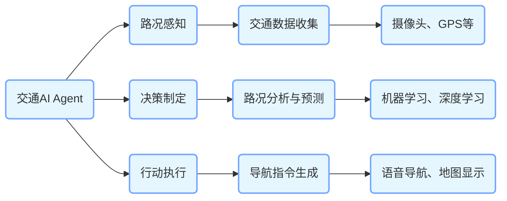

# 交通AI Agent：智能路况分析与导航

> 关键词：交通AI Agent、智能路况分析、导航、人工智能、交通数据处理

> 摘要：本文聚焦于交通AI Agent在智能路况分析与导航领域的应用。详细阐述了交通AI Agent的核心概念、相关算法原理、数学模型，通过实际案例展示其开发与应用过程。同时介绍了该领域的实际应用场景、推荐了相关的学习资源、开发工具和论文著作。最后对交通AI Agent的未来发展趋势与挑战进行了总结，并提供了常见问题解答和扩展阅读参考资料，旨在为读者全面深入地了解交通AI Agent在交通领域的应用提供专业的技术指导。

## 1. 背景介绍 
### 1.1 目的和范围
随着城市化进程的加速和汽车保有量的不断增加，交通拥堵、交通事故等问题日益严重。交通AI Agent作为一种新兴的技术手段，旨在利用人工智能技术对交通路况进行智能分析，并为用户提供高效、准确的导航服务。本文的目的在于深入探讨交通AI Agent的核心技术和应用，包括其原理、算法、实际开发案例等。范围涵盖了从基础概念到实际应用的各个方面，旨在为相关领域的研究人员、开发者和从业者提供全面的技术参考。

### 1.2 预期读者
本文的预期读者包括但不限于以下几类人群：
- 人工智能、交通工程等相关专业的研究人员，希望通过本文了解交通AI Agent的最新研究进展和技术应用。
- 软件开发工程师，尤其是对智能交通领域感兴趣的开发者，期望从本文中获取开发交通AI Agent系统的技术思路和实践经验。
- 交通行业的从业者，如交通规划师、交通管理人员等，通过了解交通AI Agent的功能和应用，为交通管理和规划提供新的思路和方法。

### 1.3 文档结构概述
本文将按照以下结构进行组织：
- 核心概念与联系：介绍交通AI Agent、智能路况分析和导航的核心概念，以及它们之间的联系，并通过文本示意图和Mermaid流程图进行直观展示。
- 核心算法原理 & 具体操作步骤：详细讲解交通AI Agent所使用的核心算法原理，并使用Python源代码进行阐述。
- 数学模型和公式 & 详细讲解 & 举例说明：介绍相关的数学模型和公式，并通过具体例子进行详细讲解。
- 项目实战：代码实际案例和详细解释说明：通过一个实际的项目案例，介绍开发环境搭建、源代码实现和代码解读。
- 实际应用场景：探讨交通AI Agent在智能路况分析与导航领域的实际应用场景。
- 工具和资源推荐：推荐相关的学习资源、开发工具和论文著作。
- 总结：未来发展趋势与挑战：对交通AI Agent的未来发展趋势进行展望，并分析可能面临的挑战。
- 附录：常见问题与解答：解答读者在学习和应用过程中可能遇到的常见问题。
- 扩展阅读 & 参考资料：提供相关的扩展阅读资料和参考文献。

### 1.4 术语表
#### 1.4.1 核心术语定义
- **交通AI Agent**：一种基于人工智能技术的智能体，能够感知交通环境、分析交通数据，并根据分析结果做出决策，为用户提供交通相关的服务。
- **智能路况分析**：利用各种技术手段对交通路况进行实时监测、分析和预测，以获取交通流量、拥堵状况等信息。
- **导航**：根据用户的起点和终点，为用户规划最佳的行驶路线，并提供实时的导航指引。

#### 1.4.2 相关概念解释
- **交通数据**：包括交通流量、车速、交通事故等与交通相关的数据，是交通AI Agent进行路况分析和导航的基础。
- **机器学习**：一种人工智能技术，通过对大量数据的学习和分析，让计算机自动发现数据中的规律和模式，从而实现预测和决策。
- **深度学习**：机器学习的一个分支，通过构建深度神经网络，对数据进行深层次的特征提取和分析，具有更强的学习和预测能力。

#### 1.4.3 缩略词列表
- **GPS**：Global Positioning System，全球定位系统，用于获取车辆的位置信息。
- **GIS**：Geographic Information System，地理信息系统，用于存储、分析和展示地理空间数据。
- **API**：Application Programming Interface，应用程序编程接口，用于不同软件系统之间的交互和数据共享。

## 2. 核心概念与联系 

### 核心概念原理
#### 交通AI Agent
交通AI Agent是一个智能的实体，它可以通过各种传感器（如摄像头、GPS等）收集交通数据，然后利用人工智能算法对这些数据进行分析和处理。它的主要功能包括路况感知、决策制定和行动执行。路况感知是指通过收集和分析交通数据，了解当前的交通状况；决策制定是根据路况感知的结果，为用户提供最佳的行驶路线或交通建议；行动执行则是将决策结果转化为具体的导航指令或其他交通服务。

#### 智能路况分析
智能路况分析是交通AI Agent的重要组成部分。它通过对交通数据的实时监测和分析，能够准确地判断当前的交通拥堵状况、交通事故发生情况等。常用的交通数据包括车辆的位置、速度、行驶方向等，这些数据可以通过GPS、交通摄像头等设备获取。智能路况分析的主要方法包括机器学习、深度学习等，通过对历史数据的学习和分析，建立交通模型，从而实现对未来交通状况的预测。

#### 导航
导航是交通AI Agent为用户提供的核心服务之一。它根据用户输入的起点和终点，结合实时的路况信息，为用户规划最佳的行驶路线。导航系统不仅要考虑路线的距离和时间，还要考虑交通拥堵、道路施工等因素。在导航过程中，系统会实时更新路况信息，并根据实际情况调整行驶路线，以确保用户能够尽快到达目的地。

### 架构的文本示意图
```plaintext
              交通AI Agent
            /        |        \
   路况感知      决策制定      行动执行
      |             |             |
 交通数据收集  路况分析与预测  导航指令生成
      |             |             |
摄像头、GPS等  机器学习、深度学习  语音导航、地图显示
```

### Mermaid流程图


## 3. 核心算法原理 & 具体操作步骤 

### 核心算法原理
#### 路况分析算法 - 基于机器学习的交通流量预测
交通流量预测是智能路况分析的重要任务之一。我们可以使用机器学习中的回归算法，如线性回归、决策树回归等，来预测未来的交通流量。以线性回归为例，其基本原理是通过对历史交通流量数据和相关特征（如时间、天气等）进行拟合，建立一个线性模型，然后利用该模型对未来的交通流量进行预测。

线性回归的数学模型可以表示为：
$$y = \theta_0 + \theta_1x_1 + \theta_2x_2 + \cdots + \theta_nx_n$$
其中，$y$ 是预测的交通流量，$x_1, x_2, \cdots, x_n$ 是相关特征，$\theta_0, \theta_1, \cdots, \theta_n$ 是模型的参数。

#### 导航算法 - Dijkstra算法
Dijkstra算法是一种经典的最短路径算法，用于在图中寻找从起点到终点的最短路径。在交通导航中，我们可以将道路网络抽象为一个图，节点表示路口，边表示道路，边的权重表示道路的行驶时间或距离。Dijkstra算法的基本思想是从起点开始，逐步扩展到相邻的节点，直到找到终点。在扩展过程中，始终选择距离起点最近的节点进行扩展，直到所有节点都被访问过。

### 具体操作步骤
#### 路况分析步骤
1. **数据收集**：使用摄像头、GPS等设备收集交通数据，包括车辆的位置、速度、行驶方向等。
2. **数据预处理**：对收集到的交通数据进行清洗、归一化等处理，以提高数据的质量。
3. **特征提取**：从预处理后的数据中提取相关特征，如时间、天气等。
4. **模型训练**：使用历史数据对机器学习模型进行训练，得到交通流量预测模型。
5. **预测与分析**：使用训练好的模型对未来的交通流量进行预测，并根据预测结果进行路况分析。

#### 导航步骤
1. **地图构建**：将道路网络抽象为一个图，节点表示路口，边表示道路，边的权重表示道路的行驶时间或距离。
2. **起点和终点输入**：用户输入起点和终点。
3. **路径搜索**：使用Dijkstra算法在图中寻找从起点到终点的最短路径。
4. **导航指引**：根据搜索到的最短路径，为用户提供导航指引。

### Python源代码实现
#### 路况分析 - 线性回归
```python
import numpy as np
from sklearn.linear_model import LinearRegression

# 模拟历史交通流量数据和相关特征
X = np.array([[1], [2], [3], [4], [5]])  # 特征数据，如时间
y = np.array([2, 4, 6, 8, 10])  # 交通流量数据

# 创建线性回归模型
model = LinearRegression()

# 训练模型
model.fit(X, y)

# 预测未来交通流量
new_X = np.array([[6]])
predicted_y = model.predict(new_X)

print("预测的交通流量:", predicted_y)
```

#### 导航 - Dijkstra算法
```python
import heapq

def dijkstra(graph, start):
    distances = {node: float('inf') for node in graph}
    distances[start] = 0
    priority_queue = [(0, start)]

    while priority_queue:
        current_distance, current_node = heapq.heappop(priority_queue)

        if current_distance > distances[current_node]:
            continue

        for neighbor, weight in graph[current_node].items():
            distance = current_distance + weight

            if distance < distances[neighbor]:
                distances[neighbor] = distance
                heapq.heappush(priority_queue, (distance, neighbor))

    return distances

# 模拟道路网络
graph = {
    'A': {'B': 1, 'C': 4},
    'B': {'A': 1, 'C': 2, 'D': 5},
    'C': {'A': 4, 'B': 2, 'D': 1},
    'D': {'B': 5, 'C': 1}
}

start_node = 'A'
distances = dijkstra(graph, start_node)
print("从节点", start_node, "到其他节点的最短距离:", distances)
```

## 4. 数学模型和公式 & 详细讲解 & 举例说明 

### 线性回归模型
线性回归模型的数学公式为：
$$y = \theta_0 + \theta_1x_1 + \theta_2x_2 + \cdots + \theta_nx_n$$
其中，$y$ 是因变量，即我们要预测的交通流量；$x_1, x_2, \cdots, x_n$ 是自变量，即相关特征；$\theta_0, \theta_1, \cdots, \theta_n$ 是模型的参数。

线性回归的目标是找到一组最优的参数 $\theta_0, \theta_1, \cdots, \theta_n$，使得预测值 $y$ 与实际值之间的误差最小。常用的误差度量方法是均方误差（Mean Squared Error，MSE），其公式为：
$$MSE = \frac{1}{m} \sum_{i=1}^{m} (y^{(i)} - \hat{y}^{(i)})^2$$
其中，$m$ 是样本数量，$y^{(i)}$ 是第 $i$ 个样本的实际值，$\hat{y}^{(i)}$ 是第 $i$ 个样本的预测值。

为了找到最优的参数，我们可以使用最小二乘法，即通过求解以下方程来得到参数的值：
$$\theta = (X^T X)^{-1} X^T y$$
其中，$X$ 是特征矩阵，$y$ 是目标向量。

### 举例说明
假设我们有以下历史交通流量数据和相关特征：
| 时间（小时） | 交通流量（辆/小时） |
| --- | --- |
| 1 | 20 |
| 2 | 40 |
| 3 | 60 |
| 4 | 80 |
| 5 | 100 |

我们可以将时间作为特征，交通流量作为目标值，使用线性回归模型进行预测。

首先，我们将数据转换为特征矩阵 $X$ 和目标向量 $y$：
$$X = \begin{bmatrix} 1 \\ 2 \\ 3 \\ 4 \\ 5 \end{bmatrix}, y = \begin{bmatrix} 20 \\ 40 \\ 60 \\ 80 \\ 100 \end{bmatrix}$$

然后，我们可以使用最小二乘法求解参数 $\theta$：
$$\theta = (X^T X)^{-1} X^T y = \begin{bmatrix} 0 \\ 20 \end{bmatrix}$$

得到的线性回归模型为：
$$y = 0 + 20x$$

这意味着交通流量与时间之间存在线性关系，每增加1小时，交通流量增加20辆/小时。

### Dijkstra算法的数学原理
Dijkstra算法的核心思想是贪心策略，即每次选择距离起点最近的节点进行扩展。设 $G = (V, E)$ 是一个带权有向图，其中 $V$ 是节点集合，$E$ 是边集合，$w(u, v)$ 表示从节点 $u$ 到节点 $v$ 的边的权重。

Dijkstra算法使用一个优先队列来存储待扩展的节点，队列中的元素按照距离起点的距离从小到大排序。算法的具体步骤如下：
1. 初始化所有节点的距离为无穷大，起点的距离为0。
2. 将起点加入优先队列。
3. 从优先队列中取出距离起点最近的节点 $u$。
4. 对于节点 $u$ 的所有邻居节点 $v$，计算从起点经过节点 $u$ 到节点 $v$ 的距离 $d(u, v)$。
5. 如果 $d(u, v)$ 小于节点 $v$ 当前的距离，则更新节点 $v$ 的距离，并将节点 $v$ 加入优先队列。
6. 重复步骤3 - 5，直到优先队列为空。

### 举例说明
假设我们有以下道路网络：
```plaintext
A --1--> B
|       |
4       2
|       |
v       v
C --1--> D
```

我们要计算从节点 $A$ 到其他节点的最短距离。

首先，初始化所有节点的距离为无穷大，起点 $A$ 的距离为0：
| 节点 | 距离 |
| --- | --- |
| A | 0 |
| B | $\infty$ |
| C | $\infty$ |
| D | $\infty$ |

将起点 $A$ 加入优先队列。

从优先队列中取出节点 $A$，更新其邻居节点 $B$ 和 $C$ 的距离：
| 节点 | 距离 |
| --- | --- |
| A | 0 |
| B | 1 |
| C | 4 |
| D | $\infty$ |

将节点 $B$ 和 $C$ 加入优先队列。

从优先队列中取出节点 $B$，更新其邻居节点 $D$ 的距离：
| 节点 | 距离 |
| --- | --- |
| A | 0 |
| B | 1 |
| C | 4 |
| D | 3 |

将节点 $D$ 加入优先队列。

从优先队列中取出节点 $C$，由于从 $C$ 到 $D$ 的距离为5，大于当前 $D$ 的距离3，所以不更新 $D$ 的距离。

从优先队列中取出节点 $D$，没有需要更新的节点。

最终得到从节点 $A$ 到其他节点的最短距离：
| 节点 | 距离 |
| --- | --- |
| A | 0 |
| B | 1 |
| C | 4 |
| D | 3 |

## 5. 项目实战：代码实际案例和详细解释说明 

### 5.1  开发环境搭建
#### 操作系统
我们选择使用Linux系统，如Ubuntu 20.04，因为它具有良好的开源生态和稳定性，适合进行开发和测试。

#### 编程语言
使用Python 3.8作为开发语言，Python具有丰富的库和工具，非常适合进行数据分析、机器学习和人工智能开发。

#### 开发工具
- **Anaconda**：用于管理Python环境和安装各种库。可以从Anaconda官方网站下载并安装。
- **PyCharm**：一款强大的Python集成开发环境（IDE），可以提高开发效率。可以从JetBrains官方网站下载并安装。

#### 相关库安装
在Anaconda环境中，使用以下命令安装所需的库：
```bash
pip install numpy pandas scikit-learn matplotlib
```

### 5.2  源代码详细实现和代码解读
#### 项目概述
我们要实现一个简单的交通AI Agent系统，包括路况分析和导航功能。路况分析部分使用线性回归模型预测交通流量，导航部分使用Dijkstra算法寻找最短路径。

#### 代码实现

```python
import numpy as np
from sklearn.linear_model import LinearRegression
import heapq

# 路况分析 - 线性回归
def traffic_flow_prediction():
    # 模拟历史交通流量数据和相关特征
    X = np.array([[1], [2], [3], [4], [5]])  # 特征数据，如时间
    y = np.array([2, 4, 6, 8, 10])  # 交通流量数据

    # 创建线性回归模型
    model = LinearRegression()

    # 训练模型
    model.fit(X, y)

    # 预测未来交通流量
    new_X = np.array([[6]])
    predicted_y = model.predict(new_X)

    print("预测的交通流量:", predicted_y)

# 导航 - Dijkstra算法
def dijkstra(graph, start):
    distances = {node: float('inf') for node in graph}
    distances[start] = 0
    priority_queue = [(0, start)]

    while priority_queue:
        current_distance, current_node = heapq.heappop(priority_queue)

        if current_distance > distances[current_node]:
            continue

        for neighbor, weight in graph[current_node].items():
            distance = current_distance + weight

            if distance < distances[neighbor]:
                distances[neighbor] = distance
                heapq.heappush(priority_queue, (distance, neighbor))

    return distances

# 主函数
def main():
    # 路况分析
    traffic_flow_prediction()

    # 模拟道路网络
    graph = {
        'A': {'B': 1, 'C': 4},
        'B': {'A': 1, 'C': 2, 'D': 5},
        'C': {'A': 4, 'B': 2, 'D': 1},
        'D': {'B': 5, 'C': 1}
    }

    start_node = 'A'
    distances = dijkstra(graph, start_node)
    print("从节点", start_node, "到其他节点的最短距离:", distances)

if __name__ == "__main__":
    main()
```

#### 代码解读
- **traffic_flow_prediction函数**：实现了路况分析的线性回归模型。首先，模拟了历史交通流量数据和相关特征，然后创建了线性回归模型并进行训练。最后，使用训练好的模型预测未来的交通流量。
- **dijkstra函数**：实现了Dijkstra算法，用于寻找最短路径。使用优先队列来存储待扩展的节点，每次从队列中取出距离起点最近的节点进行扩展，更新其邻居节点的距离。
- **main函数**：调用traffic_flow_prediction函数进行路况分析，然后模拟道路网络，调用dijkstra函数计算从起点到其他节点的最短距离。

### 5.3  代码解读与分析
#### 优点
- **简单易懂**：代码使用了Python语言和常见的机器学习库，结构清晰，易于理解和维护。
- **可扩展性**：可以很容易地扩展代码，例如添加更多的特征和数据，改进线性回归模型，或者使用更复杂的导航算法。

#### 缺点
- **数据模拟**：代码中使用了模拟数据，实际应用中需要使用真实的交通数据，并且需要进行数据清洗和预处理。
- **模型简单**：线性回归模型是一种简单的模型，对于复杂的交通流量预测可能不够准确，需要使用更复杂的机器学习模型，如神经网络。

## 6. 实际应用场景 
### 智能导航应用
交通AI Agent在智能导航应用中发挥着重要作用。用户在使用导航软件时，系统可以实时获取交通路况信息，利用交通AI Agent的算法对路况进行分析和预测，为用户规划最佳的行驶路线。例如，当遇到交通拥堵时，导航系统可以及时调整路线，避开拥堵路段，节省用户的出行时间。同时，导航系统还可以根据用户的驾驶习惯和历史数据，为用户提供个性化的导航服务。

### 交通管理与规划
交通管理部门可以利用交通AI Agent对城市的交通状况进行实时监测和分析。通过收集和分析交通数据，了解交通流量的分布、拥堵的热点区域等信息，从而制定更加科学合理的交通管理策略。例如，根据交通流量的变化，调整信号灯的时长，优化交通组织；对于拥堵严重的路段，可以考虑进行道路拓宽或建设新的交通设施。此外，交通AI Agent还可以为城市的交通规划提供数据支持，帮助规划部门更好地规划道路网络和公共交通线路。

### 智能交通系统集成
交通AI Agent可以与其他智能交通系统进行集成，如智能停车系统、智能公交系统等。在智能停车系统中，交通AI Agent可以根据实时的交通路况和停车场的车位信息，为用户推荐附近的停车场，并提供导航服务。在智能公交系统中，交通AI Agent可以实时监测公交车的运行状态和位置，预测公交车的到达时间，为乘客提供准确的公交信息，提高公交服务的质量和效率。

### 自动驾驶
在自动驾驶领域，交通AI Agent是自动驾驶车辆的重要组成部分。自动驾驶车辆需要实时感知周围的交通环境，包括其他车辆的位置、速度、行驶方向等信息。交通AI Agent可以利用各种传感器收集这些信息，并进行分析和处理，为自动驾驶车辆提供决策支持。例如，当遇到前方车辆突然刹车时，交通AI Agent可以及时判断危险程度，并控制自动驾驶车辆采取相应的措施，如减速、避让等，确保行车安全。

## 7. 工具和资源推荐
### 7.1 学习资源推荐
#### 7.1.1 书籍推荐
- 《人工智能：一种现代的方法》：这是一本经典的人工智能教材，涵盖了人工智能的各个领域，包括机器学习、深度学习、自然语言处理等。对于理解交通AI Agent的基础理论和算法非常有帮助。
- 《Python机器学习实战》：本书通过实际案例介绍了Python在机器学习中的应用，包括数据处理、模型训练、评估等方面的内容。可以帮助读者快速掌握使用Python进行机器学习开发的技能。
- 《交通工程学》：系统介绍了交通工程的基本概念、理论和方法，包括交通流量分析、交通规划、交通管理等方面的内容。对于了解交通AI Agent在交通领域的应用背景和需求非常有帮助。

#### 7.1.2 在线课程
- Coursera上的“机器学习”课程：由斯坦福大学教授Andrew Ng主讲，是一门非常经典的机器学习课程。课程内容包括线性回归、逻辑回归、神经网络等基本算法的原理和实现，适合初学者学习。
- edX上的“深度学习”课程：由DeepLearning.AI提供，深入介绍了深度学习的理论和实践，包括卷积神经网络、循环神经网络等高级模型。对于想要深入研究交通AI Agent中深度学习算法的读者非常有帮助。
- Udemy上的“Python数据科学实战”课程：课程涵盖了Python在数据科学中的应用，包括数据处理、数据分析、机器学习等方面的内容。通过实际案例的学习，读者可以快速掌握使用Python进行数据科学开发的技能。

#### 7.1.3 技术博客和网站
- Medium：是一个知名的技术博客平台，上面有很多关于人工智能、交通工程等领域的优质文章。读者可以关注一些相关的作者和主题，获取最新的技术动态和研究成果。
- Towards Data Science：专注于数据科学和机器学习领域的博客，提供了大量的技术文章和案例分析。对于学习交通AI Agent中的数据分析和机器学习算法非常有帮助。
- 开源中国：是国内知名的开源技术社区，上面有很多关于人工智能、交通科技等领域的开源项目和技术文章。读者可以在上面了解国内的技术发展动态和开源项目的使用方法。

### 7.2 开发工具框架推荐
#### 7.2.1 IDE和编辑器
- PyCharm：是一款功能强大的Python集成开发环境，具有代码编辑、调试、版本控制等功能。对于Python开发非常方便，尤其适合大型项目的开发。
- Jupyter Notebook：是一个交互式的开发环境，支持Python、R等多种编程语言。可以在浏览器中编写代码、运行代码、展示结果，非常适合数据科学和机器学习的开发和研究。
- Visual Studio Code：是一款轻量级的代码编辑器，支持多种编程语言和插件扩展。具有丰富的代码编辑功能和调试功能，适合初学者和快速开发。

#### 7.2.2 调试和性能分析工具
- Py-Spy：是一个Python性能分析工具，可以实时监测Python程序的CPU使用率、函数调用时间等信息，帮助开发者找出程序中的性能瓶颈。
- PDB：是Python自带的调试工具，可以在代码中设置断点，逐行调试程序，帮助开发者找出代码中的错误。
- TensorBoard：是TensorFlow提供的可视化工具，可以用于可视化深度学习模型的训练过程、模型结构等信息，帮助开发者更好地理解和优化模型。

#### 7.2.3 相关框架和库
- NumPy：是Python中用于科学计算的基础库，提供了高效的多维数组对象和各种数学函数，是其他机器学习库的基础。
- Pandas：是Python中用于数据处理和分析的库，提供了数据结构和数据操作方法，方便进行数据清洗、转换和分析。
- Scikit-learn：是Python中常用的机器学习库，提供了各种机器学习算法和工具，如分类、回归、聚类等算法，以及数据预处理、模型评估等工具。
- TensorFlow：是Google开发的深度学习框架，提供了丰富的深度学习模型和工具，如卷积神经网络、循环神经网络等，支持分布式训练和模型部署。

### 7.3 相关论文著作推荐
#### 7.3.1 经典论文
- “A* Search Algorithm”：介绍了A*搜索算法的原理和应用，是路径规划领域的经典论文。A*算法结合了Dijkstra算法和贪心最佳优先搜索算法的优点，在路径搜索中具有较高的效率。
- “Gradient-Based Learning Applied to Document Recognition”：由Yann LeCun等人发表，介绍了卷积神经网络（CNN）在手写数字识别中的应用，开创了深度学习在计算机视觉领域的先河。
- “Long Short-Term Memory”：由Sepp Hochreiter和Jürgen Schmidhuber发表，介绍了长短期记忆网络（LSTM）的原理和应用，解决了循环神经网络（RNN）中的梯度消失问题，在自然语言处理和时间序列分析等领域具有广泛的应用。

#### 7.3.2 最新研究成果
- 关注IEEE Transactions on Intelligent Transportation Systems、ACM Transactions on Sensor Networks等顶级学术期刊，上面会发表关于交通AI Agent、智能交通系统等领域的最新研究成果。
- 参加国际人工智能联合会议（IJCAI）、神经信息处理系统大会（NeurIPS）等顶级学术会议，了解最新的学术动态和研究进展。

#### 7.3.3 应用案例分析
- 可以参考一些智能交通领域的实际应用案例，如滴滴出行的智能调度系统、百度地图的智能导航系统等。这些案例可以帮助我们了解交通AI Agent在实际应用中的具体实现和优化方法。

## 8. 总结：未来发展趋势与挑战
### 未来发展趋势
#### 融合多种技术
未来的交通AI Agent将融合更多的技术，如物联网、大数据、云计算等。通过物联网技术，交通AI Agent可以实时获取更多的交通数据，如车辆的传感器数据、道路设施的状态数据等；通过大数据技术，可以对海量的交通数据进行存储、分析和挖掘，发现更多的交通规律和模式；通过云计算技术，可以提供强大的计算能力和存储能力，支持交通AI Agent的高效运行。

#### 智能化程度不断提高
随着人工智能技术的不断发展，交通AI Agent的智能化程度将不断提高。例如，交通AI Agent可以通过深度学习技术对交通场景进行更准确的感知和理解，能够识别更多的交通标志、交通信号和障碍物；可以通过强化学习技术进行自主决策和优化，根据实时的交通状况和用户需求，动态调整行驶路线和驾驶策略。

#### 与其他领域的融合
交通AI Agent将与其他领域进行更深入的融合，如智慧城市、智能能源等。在智慧城市建设中，交通AI Agent可以与城市的其他智能系统进行协同工作，实现城市交通的智能化管理和优化；在智能能源领域，交通AI Agent可以根据车辆的行驶情况和能源消耗情况，优化能源分配和管理，提高能源利用效率。

### 挑战
#### 数据隐私和安全问题
交通AI Agent需要收集和处理大量的交通数据，这些数据涉及到用户的隐私和安全。如何保护用户的隐私和数据安全是一个重要的挑战。需要采取有效的技术手段和管理措施，如数据加密、访问控制、匿名化处理等，确保数据的安全性和隐私性。

#### 算法的可解释性和可靠性
交通AI Agent中使用的一些人工智能算法，如深度学习算法，具有较高的复杂度和黑盒性，其决策过程难以解释。在交通领域，算法的可解释性和可靠性非常重要，因为错误的决策可能会导致严重的后果。需要研究和开发可解释的人工智能算法，提高算法的可靠性和透明度。

#### 标准和规范的缺乏
目前，交通AI Agent领域还缺乏统一的标准和规范。不同的厂商和开发者可能采用不同的技术和方法，导致系统之间的兼容性和互操作性较差。需要制定统一的标准和规范，促进交通AI Agent的健康发展。

## 9. 附录：常见问题与解答
### 问题1：交通AI Agent需要哪些数据？
交通AI Agent需要的数据包括但不限于以下几类：
- 交通流量数据：如车辆的数量、速度、行驶方向等。
- 道路信息数据：如道路的长度、宽度、坡度、车道数等。
- 天气数据：如气温、降水、风速等。
- 交通事故数据：如事故发生的时间、地点、原因等。

### 问题2：如何评估交通AI Agent的性能？
可以从以下几个方面评估交通AI Agent的性能：
- 路况分析的准确性：可以通过比较预测的交通流量和实际的交通流量，计算误差率来评估。
- 导航的效率：可以通过比较规划的路线和实际的最佳路线，计算路线的偏差率来评估。
- 系统的响应时间：可以通过记录系统对用户请求的响应时间来评估。

### 问题3：交通AI Agent可以应用于哪些交通场景？
交通AI Agent可以应用于多种交通场景，如城市交通、高速公路交通、公共交通等。在城市交通中，可以用于智能导航、交通管理和拥堵缓解；在高速公路交通中，可以用于事故预警、车道保持和自动驾驶；在公共交通中，可以用于公交调度、客流预测和智能服务。

### 问题4：如何提高交通AI Agent的学习能力？
可以通过以下几种方法提高交通AI Agent的学习能力：
- 增加训练数据：使用更多的历史数据和实时数据对模型进行训练，提高模型的泛化能力。
- 改进算法：使用更复杂的机器学习和深度学习算法，如神经网络、强化学习等，提高模型的学习能力和预测能力。
- 模型融合：将多个不同的模型进行融合，综合利用各个模型的优点，提高整体的性能。

## 10. 扩展阅读 & 参考资料
### 扩展阅读
- 《智能交通系统概论》：系统介绍了智能交通系统的基本概念、技术和应用，对于了解交通AI Agent在智能交通系统中的地位和作用非常有帮助。
- 《深度学习入门：基于Python的理论与实现》：详细介绍了深度学习的基本原理和实现方法，通过Python代码实现了多种深度学习模型，适合初学者学习。
- 《数据挖掘：概念与技术》：介绍了数据挖掘的基本概念、算法和应用，对于理解交通AI Agent中数据处理和分析的方法非常有帮助。

### 参考资料
- IEEE Transactions on Intelligent Transportation Systems：国际电气与电子工程师协会（IEEE）出版的关于智能交通系统的学术期刊，发表了大量关于交通AI Agent、智能交通技术等方面的研究论文。
- ACM Transactions on Sensor Networks：美国计算机协会（ACM）出版的关于传感器网络的学术期刊，涵盖了物联网、传感器技术等方面的研究成果，与交通AI Agent的数据采集和传输密切相关。
- OpenStreetMap：一个开源的地图项目，提供了全球范围内的地理数据，包括道路、建筑物等信息，可以用于交通AI Agent的地图构建和导航。

作者：AI天才研究院/AI Genius Institute & 禅与计算机程序设计艺术 /Zen And The Art of Computer Programming