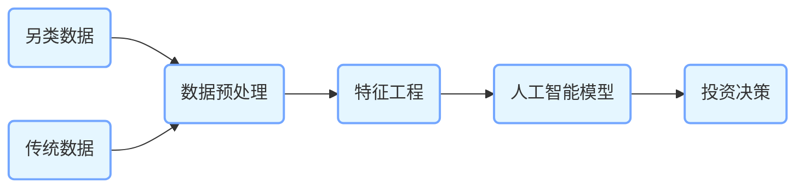

# 人工智能在另类数据分析和投资中的应用

> 关键词：人工智能、另类数据、投资分析、机器学习、深度学习

> 摘要：本文深入探讨了人工智能在另类数据分析和投资领域的应用。随着金融市场的不断发展，另类数据的重要性日益凸显，而人工智能技术为处理和分析这些复杂数据提供了强大的工具。文章首先介绍了相关背景，包括目的范围、预期读者等；接着阐述了核心概念与联系，分析了核心算法原理并给出具体操作步骤；通过数学模型和公式对其进行理论解释，结合实际案例详细说明代码实现和解读；探讨了实际应用场景，推荐了学习和开发所需的工具与资源；最后总结了未来发展趋势与挑战，解答常见问题并提供扩展阅读与参考资料。

## 1. 背景介绍 
### 1.1 目的和范围
本文章的主要目的是全面介绍人工智能在另类数据分析和投资中的应用。随着金融市场的日益复杂和数据量的爆炸式增长，传统的数据分析方法已经难以满足投资决策的需求。另类数据，如卫星图像、社交媒体数据、传感器数据等，蕴含着丰富的信息，但这些数据具有多样性、高维度和非结构化的特点，需要新的技术手段进行分析。人工智能技术，特别是机器学习和深度学习，为处理和分析这些另类数据提供了有效的解决方案。本文将涵盖人工智能在另类数据分析中的核心概念、算法原理、实际应用案例以及未来发展趋势等方面的内容。

### 1.2 预期读者
本文的预期读者包括金融从业者、投资分析师、数据科学家、人工智能研究者以及对金融科技领域感兴趣的人士。对于金融从业者和投资分析师，本文将帮助他们了解如何利用人工智能技术分析另类数据，从而做出更明智的投资决策；对于数据科学家和人工智能研究者，本文将提供在金融领域应用人工智能技术的具体案例和方法；对于对金融科技领域感兴趣的人士，本文将作为一个入门指南，帮助他们了解该领域的基本概念和发展趋势。

### 1.3 文档结构概述
本文将按照以下结构进行组织：
1. **背景介绍**：介绍文章的目的、范围、预期读者和文档结构概述，并定义相关术语。
2. **核心概念与联系**：阐述人工智能、另类数据和投资分析的核心概念，并分析它们之间的联系。
3. **核心算法原理 & 具体操作步骤**：详细介绍在另类数据分析和投资中常用的人工智能算法原理，并给出具体的操作步骤。
4. **数学模型和公式 & 详细讲解 & 举例说明**：通过数学模型和公式对人工智能算法进行理论解释，并结合实际例子进行说明。
5. **项目实战：代码实际案例和详细解释说明**：给出一个具体的项目实战案例，包括开发环境搭建、源代码实现和代码解读。
6. **实际应用场景**：探讨人工智能在另类数据分析和投资中的实际应用场景。
7. **工具和资源推荐**：推荐学习和开发所需的工具和资源，包括书籍、在线课程、技术博客、IDE和编辑器、调试和性能分析工具、相关框架和库以及相关论文著作。
8. **总结：未来发展趋势与挑战**：总结人工智能在另类数据分析和投资中的未来发展趋势，并分析可能面临的挑战。
9. **附录：常见问题与解答**：解答读者在阅读过程中可能遇到的常见问题。
10. **扩展阅读 & 参考资料**：提供扩展阅读的建议和参考资料的列表。

### 1.4 术语表
#### 1.4.1 核心术语定义
- **人工智能（Artificial Intelligence，AI）**：是一门研究如何使计算机系统能够模拟人类智能的学科，包括机器学习、深度学习、自然语言处理等技术。
- **另类数据（Alternative Data）**：指除了传统的财务数据和市场数据之外的其他数据，如卫星图像、社交媒体数据、传感器数据等。
- **投资分析（Investment Analysis）**：是指对投资机会进行评估和分析的过程，包括对资产的估值、风险评估、投资组合优化等。
- **机器学习（Machine Learning，ML）**：是人工智能的一个分支，研究如何让计算机通过数据学习模式和规律，并做出预测和决策。
- **深度学习（Deep Learning，DL）**：是机器学习的一个子集，使用多层神经网络来学习数据的复杂表示和模式。

#### 1.4.2 相关概念解释
- **特征工程（Feature Engineering）**：是指从原始数据中提取和选择有用特征的过程，这些特征将作为机器学习模型的输入。
- **模型训练（Model Training）**：是指使用训练数据来调整机器学习模型的参数，使其能够对未知数据做出准确预测的过程。
- **模型评估（Model Evaluation）**：是指使用评估指标来衡量机器学习模型的性能和效果的过程。
- **过拟合（Overfitting）**：是指机器学习模型在训练数据上表现良好，但在未知数据上表现不佳的现象。
- **欠拟合（Underfitting）**：是指机器学习模型在训练数据和未知数据上都表现不佳的现象。

#### 1.4.3 缩略词列表
- **AI**：Artificial Intelligence
- **ML**：Machine Learning
- **DL**：Deep Learning
- **NLP**：Natural Language Processing
- **CNN**：Convolutional Neural Network
- **RNN**：Recurrent Neural Network
- **LSTM**：Long Short-Term Memory
- **GRU**：Gated Recurrent Unit

## 2. 核心概念与联系 
### 2.1 核心概念原理
#### 2.1.1 人工智能
人工智能是一种模拟人类智能的技术，旨在让计算机系统能够像人类一样感知、学习、推理和决策。人工智能的核心技术包括机器学习、深度学习、自然语言处理等。机器学习是让计算机通过数据学习模式和规律的技术，它可以分为监督学习、无监督学习和强化学习。深度学习是机器学习的一个子集，使用多层神经网络来学习数据的复杂表示和模式，它在图像识别、语音识别、自然语言处理等领域取得了巨大的成功。

#### 2.1.2 另类数据
另类数据是指除了传统的财务数据和市场数据之外的其他数据，如卫星图像、社交媒体数据、传感器数据等。这些数据具有多样性、高维度和非结构化的特点，蕴含着丰富的信息。例如，卫星图像可以用于监测农作物的生长情况、城市的建设进度等；社交媒体数据可以用于了解消费者的情绪和偏好；传感器数据可以用于监测工业设备的运行状态和环境参数等。

#### 2.1.3 投资分析
投资分析是指对投资机会进行评估和分析的过程，包括对资产的估值、风险评估、投资组合优化等。传统的投资分析主要依赖于财务数据和市场数据，但随着金融市场的不断发展，这些数据已经难以满足投资决策的需求。另类数据的出现为投资分析提供了新的视角和方法，通过分析另类数据可以发现一些传统数据无法揭示的信息，从而做出更明智的投资决策。

### 2.2 核心概念架构
下面是人工智能、另类数据和投资分析之间的关系架构图：

从架构图可以看出，另类数据和传统数据首先经过数据预处理和特征工程，提取出有用的特征，然后将这些特征输入到人工智能模型中进行训练和预测，最后根据模型的输出做出投资决策。

### 2.3 核心概念联系
人工智能、另类数据和投资分析之间存在着密切的联系。另类数据为人工智能模型提供了丰富的训练数据，通过分析这些数据，人工智能模型可以学习到更复杂的模式和规律。而人工智能模型则可以帮助投资者更好地理解和分析另类数据，从而做出更明智的投资决策。例如，通过分析卫星图像数据，人工智能模型可以预测农作物的产量，从而帮助投资者做出农产品期货的投资决策；通过分析社交媒体数据，人工智能模型可以了解消费者的情绪和偏好，从而帮助投资者做出股票的投资决策。

## 3. 核心算法原理 & 具体操作步骤 
### 3.1 常用的人工智能算法
#### 3.1.1 线性回归
线性回归是一种简单而常用的机器学习算法，用于建立自变量和因变量之间的线性关系。其数学模型可以表示为：
$$y = \theta_0 + \theta_1x_1 + \theta_2x_2 + \cdots + \theta_nx_n$$
其中，$y$ 是因变量，$x_1, x_2, \cdots, x_n$ 是自变量，$\theta_0, \theta_1, \theta_2, \cdots, \theta_n$ 是模型的参数。线性回归的目标是通过最小化预测值和真实值之间的误差来估计模型的参数。

以下是使用Python实现线性回归的示例代码：
```python
import numpy as np
from sklearn.linear_model import LinearRegression

# 生成训练数据
X = np.array([[1], [2], [3], [4], [5]])
y = np.array([2, 4, 6, 8, 10])

# 创建线性回归模型
model = LinearRegression()

# 训练模型
model.fit(X, y)

# 预测新数据
new_X = np.array([[6]])
prediction = model.predict(new_X)

print("预测值:", prediction)
```

#### 3.1.2 逻辑回归
逻辑回归是一种用于分类问题的机器学习算法，它通过逻辑函数将线性回归的输出映射到概率值。逻辑函数的定义为：
$$\sigma(z) = \frac{1}{1 + e^{-z}}$$
其中，$z$ 是线性回归的输出。逻辑回归的目标是通过最大化似然函数来估计模型的参数。

以下是使用Python实现逻辑回归的示例代码：
```python
import numpy as np
from sklearn.linear_model import LogisticRegression

# 生成训练数据
X = np.array([[1], [2], [3], [4], [5]])
y = np.array([0, 0, 1, 1, 1])

# 创建逻辑回归模型
model = LogisticRegression()

# 训练模型
model.fit(X, y)

# 预测新数据
new_X = np.array([[6]])
prediction = model.predict(new_X)

print("预测值:", prediction)
```

#### 3.1.3 决策树
决策树是一种基于树结构进行决策的机器学习算法，它通过对数据进行递归划分来构建决策树。决策树的每个内部节点是一个特征上的测试，每个分支是测试输出，每个叶节点是一个类别或值。

以下是使用Python实现决策树的示例代码：
```python
import numpy as np
from sklearn.tree import DecisionTreeClassifier

# 生成训练数据
X = np.array([[1, 2], [2, 3], [3, 4], [4, 5]])
y = np.array([0, 0, 1, 1])

# 创建决策树模型
model = DecisionTreeClassifier()

# 训练模型
model.fit(X, y)

# 预测新数据
new_X = np.array([[5, 6]])
prediction = model.predict(new_X)

print("预测值:", prediction)
```

#### 3.1.4 随机森林
随机森林是一种集成学习算法，它通过组合多个决策树来提高模型的性能。随机森林在构建决策树时，会随机选择一部分特征和样本进行训练，从而增加模型的多样性和泛化能力。

以下是使用Python实现随机森林的示例代码：
```python
import numpy as np
from sklearn.ensemble import RandomForestClassifier

# 生成训练数据
X = np.array([[1, 2], [2, 3], [3, 4], [4, 5]])
y = np.array([0, 0, 1, 1])

# 创建随机森林模型
model = RandomForestClassifier()

# 训练模型
model.fit(X, y)

# 预测新数据
new_X = np.array([[5, 6]])
prediction = model.predict(new_X)

print("预测值:", prediction)
```

#### 3.1.5 神经网络
神经网络是一种模仿人类神经系统的机器学习算法，它由多个神经元组成的层构成。神经网络可以自动学习数据的复杂表示和模式，在图像识别、语音识别、自然语言处理等领域取得了巨大的成功。

以下是使用Python和Keras实现一个简单神经网络的示例代码：
```python
import numpy as np
from keras.models import Sequential
from keras.layers import Dense

# 生成训练数据
X = np.array([[0, 0], [0, 1], [1, 0], [1, 1]])
y = np.array([[0], [1], [1], [0]])

# 创建神经网络模型
model = Sequential()
model.add(Dense(2, input_dim=2, activation='relu'))
model.add(Dense(1, activation='sigmoid'))

# 编译模型
model.compile(loss='binary_crossentropy', optimizer='adam', metrics=['accuracy'])

# 训练模型
model.fit(X, y, epochs=1000, verbose=0)

# 预测新数据
new_X = np.array([[0, 0]])
prediction = model.predict(new_X)

print("预测值:", prediction)
```

### 3.2 具体操作步骤
#### 3.2.1 数据收集
首先需要收集相关的另类数据和传统数据。另类数据可以从各种数据源获取，如卫星图像提供商、社交媒体平台、传感器制造商等。传统数据可以从金融数据提供商、证券交易所等获取。

#### 3.2.2 数据预处理
收集到的数据通常需要进行预处理，包括数据清洗、数据集成、数据变换等。数据清洗是指去除数据中的噪声、缺失值和异常值；数据集成是指将不同数据源的数据整合到一起；数据变换是指对数据进行标准化、归一化等处理，以便于模型的训练。

#### 3.2.3 特征工程
特征工程是指从原始数据中提取和选择有用特征的过程。这一步骤非常重要，因为好的特征可以提高模型的性能和效果。特征工程包括特征提取、特征选择和特征变换等。

#### 3.2.4 模型选择和训练
根据问题的类型和数据的特点，选择合适的人工智能模型进行训练。在训练模型时，需要将数据分为训练集和测试集，训练集用于训练模型，测试集用于评估模型的性能。

#### 3.2.5 模型评估和优化
使用评估指标来衡量模型的性能和效果，如准确率、召回率、F1值、均方误差等。如果模型的性能不理想，可以通过调整模型的参数、增加训练数据、进行特征工程等方法来优化模型。

#### 3.2.6 投资决策
根据模型的输出，结合投资者的风险偏好和投资目标，做出投资决策。

## 4. 数学模型和公式 & 详细讲解 & 举例说明 
### 4.1 线性回归
#### 4.1.1 数学模型
线性回归的数学模型可以表示为：
$$y = \theta_0 + \theta_1x_1 + \theta_2x_2 + \cdots + \theta_nx_n + \epsilon$$
其中，$y$ 是因变量，$x_1, x_2, \cdots, x_n$ 是自变量，$\theta_0, \theta_1, \theta_2, \cdots, \theta_n$ 是模型的参数，$\epsilon$ 是误差项，通常假设 $\epsilon$ 服从均值为 0，方差为 $\sigma^2$ 的正态分布。

#### 4.1.2 损失函数
线性回归的目标是通过最小化预测值和真实值之间的误差来估计模型的参数。常用的损失函数是均方误差（Mean Squared Error，MSE），定义为：
$$MSE = \frac{1}{m} \sum_{i=1}^{m} (y^{(i)} - \hat{y}^{(i)})^2$$
其中，$m$ 是样本数量，$y^{(i)}$ 是第 $i$ 个样本的真实值，$\hat{y}^{(i)}$ 是第 $i$ 个样本的预测值。

#### 4.1.3 参数估计
为了最小化均方误差，我们可以使用最小二乘法来估计模型的参数。最小二乘法的目标是找到一组参数 $\theta$，使得均方误差最小。具体来说，我们需要求解以下优化问题：
$$\min_{\theta} MSE(\theta)$$
通过对均方误差求导并令导数为 0，可以得到最小二乘法的解：
$$\theta = (X^T X)^{-1} X^T y$$
其中，$X$ 是特征矩阵，$y$ 是目标向量。

#### 4.1.4 举例说明
假设我们有以下数据集：
| $x$ | $y$ |
| --- | --- |
| 1 | 2 |
| 2 | 4 |
| 3 | 6 |
| 4 | 8 |
| 5 | 10 |

我们可以使用线性回归来建立 $x$ 和 $y$ 之间的线性关系。首先，我们将数据集转换为特征矩阵 $X$ 和目标向量 $y$：
$$X = \begin{bmatrix} 1 & 1 \\ 1 & 2 \\ 1 & 3 \\ 1 & 4 \\ 1 & 5 \end{bmatrix}, y = \begin{bmatrix} 2 \\ 4 \\ 6 \\ 8 \\ 10 \end{bmatrix}$$
然后，我们可以使用最小二乘法来估计模型的参数：
$$\theta = (X^T X)^{-1} X^T y = \begin{bmatrix} 0 \\ 2 \end{bmatrix}$$
因此，线性回归模型为 $y = 0 + 2x$。

### 4.2 逻辑回归
#### 4.2.1 数学模型
逻辑回归是一种用于分类问题的机器学习算法，它通过逻辑函数将线性回归的输出映射到概率值。逻辑函数的定义为：
$$\sigma(z) = \frac{1}{1 + e^{-z}}$$
其中，$z$ 是线性回归的输出。逻辑回归的数学模型可以表示为：
$$P(y = 1 | x) = \sigma(\theta_0 + \theta_1x_1 + \theta_2x_2 + \cdots + \theta_nx_n)$$
其中，$P(y = 1 | x)$ 是给定特征 $x$ 时，样本属于正类的概率。

#### 4.2.2 损失函数
逻辑回归的目标是通过最大化似然函数来估计模型的参数。似然函数的定义为：
$$L(\theta) = \prod_{i=1}^{m} P(y^{(i)} | x^{(i)}; \theta)$$
为了方便计算，我们通常使用对数似然函数：
$$\log L(\theta) = \sum_{i=1}^{m} \log P(y^{(i)} | x^{(i)}; \theta)$$
逻辑回归的损失函数是负对数似然函数，定义为：
$$J(\theta) = -\frac{1}{m} \sum_{i=1}^{m} [y^{(i)} \log P(y^{(i)} | x^{(i)}; \theta) + (1 - y^{(i)}) \log (1 - P(y^{(i)} | x^{(i)}; \theta))]$$

#### 4.2.3 参数估计
为了最大化对数似然函数，我们可以使用梯度下降法来估计模型的参数。梯度下降法的基本思想是通过不断迭代更新参数，使得损失函数逐渐减小。具体来说，我们需要求解以下优化问题：
$$\min_{\theta} J(\theta)$$
梯度下降法的更新公式为：
$$\theta_j := \theta_j - \alpha \frac{\partial J(\theta)}{\partial \theta_j}$$
其中，$\alpha$ 是学习率，$\frac{\partial J(\theta)}{\partial \theta_j}$ 是损失函数对参数 $\theta_j$ 的偏导数。

#### 4.2.4 举例说明
假设我们有以下数据集：
| $x$ | $y$ |
| --- | --- |
| 1 | 0 |
| 2 | 0 |
| 3 | 1 |
| 4 | 1 |
| 5 | 1 |

我们可以使用逻辑回归来对样本进行分类。首先，我们将数据集转换为特征矩阵 $X$ 和目标向量 $y$：
$$X = \begin{bmatrix} 1 & 1 \\ 1 & 2 \\ 1 & 3 \\ 1 & 4 \\ 1 & 5 \end{bmatrix}, y = \begin{bmatrix} 0 \\ 0 \\ 1 \\ 1 \\ 1 \end{bmatrix}$$
然后，我们可以使用梯度下降法来估计模型的参数。假设学习率 $\alpha = 0.1$，迭代次数为 1000 次，最终得到的参数估计值为 $\theta = \begin{bmatrix} -4.0777 \\ 1.5224 \end{bmatrix}$。因此，逻辑回归模型为 $P(y = 1 | x) = \sigma(-4.0777 + 1.5224x)$。

### 4.3 决策树
#### 4.3.1 数学模型
决策树是一种基于树结构进行决策的机器学习算法，它通过对数据进行递归划分来构建决策树。决策树的每个内部节点是一个特征上的测试，每个分支是测试输出，每个叶节点是一个类别或值。决策树的数学模型可以表示为一个递归的划分规则：
$$T(x) = \begin{cases} c_1, & \text{if } x \in R_1 \\ c_2, & \text{if } x \in R_2 \\ \cdots \\ c_k, & \text{if } x \in R_k \end{cases}$$
其中，$T(x)$ 是决策树对样本 $x$ 的预测值，$R_1, R_2, \cdots, R_k$ 是决策树的划分区域，$c_1, c_2, \cdots, c_k$ 是每个划分区域对应的类别或值。

#### 4.3.2 损失函数
决策树的目标是通过最小化划分区域内的不纯度来构建决策树。常用的不纯度度量指标包括基尼不纯度（Gini Impurity）和信息熵（Entropy）。

基尼不纯度的定义为：
$$Gini(p) = 1 - \sum_{i=1}^{k} p_i^2$$
其中，$p_i$ 是第 $i$ 个类别的概率。

信息熵的定义为：
$$Entropy(p) = -\sum_{i=1}^{k} p_i \log_2 p_i$$

#### 4.3.3 参数估计
决策树的构建过程是一个递归的过程，主要包括以下步骤：
1. 选择一个特征作为划分特征。
2. 根据划分特征的取值将数据集划分为多个子集。
3. 对每个子集重复步骤 1 和 2，直到满足停止条件。

常用的特征选择方法包括信息增益（Information Gain）、信息增益比（Information Gain Ratio）和基尼指数（Gini Index）。

#### 4.3.4 举例说明
假设我们有以下数据集：
| Outlook | Temperature | Humidity | Windy | Play Tennis |
| --- | --- | --- | --- | --- |
| Sunny | Hot | High | False | No |
| Sunny | Hot | High | True | No |
| Overcast | Hot | High | False | Yes |
| Rain | Mild | High | False | Yes |
| Rain | Cool | Normal | False | Yes |
| Rain | Cool | Normal | True | No |
| Overcast | Cool | Normal | True | Yes |
| Sunny | Mild | High | False | No |
| Sunny | Cool | Normal | False | Yes |
| Rain | Mild | Normal | False | Yes |
| Sunny | Mild | Normal | True | Yes |
| Overcast | Mild | High | True | Yes |
| Overcast | Hot | Normal | False | Yes |
| Rain | Mild | High | True | No |

我们可以使用决策树来对是否打网球进行预测。首先，我们需要选择一个特征作为划分特征。假设我们选择 Outlook 作为划分特征，根据 Outlook 的取值将数据集划分为三个子集：Sunny、Overcast 和 Rain。然后，我们对每个子集重复上述步骤，直到满足停止条件。最终得到的决策树如下：
```
Outlook
|-- Sunny
|   |-- Humidity
|       |-- High: No
|       |-- Normal: Yes
|-- Overcast: Yes
|-- Rain
|   |-- Windy
|       |-- False: Yes
|       |-- True: No
```

### 4.4 随机森林
#### 4.4.1 数学模型
随机森林是一种集成学习算法，它通过组合多个决策树来提高模型的性能。随机森林的数学模型可以表示为：
$$T(x) = \frac{1}{N} \sum_{i=1}^{N} T_i(x)$$
其中，$T(x)$ 是随机森林对样本 $x$ 的预测值，$T_i(x)$ 是第 $i$ 个决策树对样本 $x$ 的预测值，$N$ 是决策树的数量。

#### 4.4.2 损失函数
随机森林的损失函数通常与单个决策树的损失函数相同，如基尼不纯度或信息熵。

#### 4.4.3 参数估计
随机森林的构建过程主要包括以下步骤：
1. 从原始数据集中有放回地随机抽取 $n$ 个样本，构成一个新的训练集。
2. 从所有特征中随机选择 $k$ 个特征，作为决策树的候选特征。
3. 使用步骤 1 得到的训练集和步骤 2 得到的候选特征，构建一个决策树。
4. 重复步骤 1 - 3，直到构建 $N$ 个决策树。

#### 4.4.4 举例说明
假设我们有一个包含 1000 个样本和 10 个特征的数据集。我们可以使用随机森林来对样本进行分类。首先，我们从原始数据集中有放回地随机抽取 800 个样本，构成一个新的训练集。然后，我们从 10 个特征中随机选择 3 个特征，作为决策树的候选特征。接着，我们使用新的训练集和候选特征，构建一个决策树。重复上述步骤，直到构建 100 个决策树。最终得到的随机森林可以对新的样本进行分类。

### 4.5 神经网络
#### 4.5.1 数学模型
神经网络是一种模仿人类神经系统的机器学习算法，它由多个神经元组成的层构成。神经网络的数学模型可以表示为一个多层的非线性映射：
$$y = f(W_n f(W_{n-1} \cdots f(W_1 x + b_1) + b_2) + \cdots + b_n)$$
其中，$x$ 是输入向量，$y$ 是输出向量，$W_i$ 是第 $i$ 层的权重矩阵，$b_i$ 是第 $i$ 层的偏置向量，$f$ 是激活函数。

#### 4.5.2 损失函数
神经网络的目标是通过最小化预测值和真实值之间的误差来估计模型的参数。常用的损失函数包括均方误差（MSE）、交叉熵损失（Cross-Entropy Loss）等。

#### 4.5.3 参数估计
为了最小化损失函数，我们可以使用反向传播算法（Backpropagation Algorithm）来估计模型的参数。反向传播算法的基本思想是通过计算损失函数对每个参数的偏导数，然后使用梯度下降法来更新参数。

#### 4.5.4 举例说明
假设我们有一个简单的神经网络，包含一个输入层、一个隐藏层和一个输出层。输入层有 2 个神经元，隐藏层有 2 个神经元，输出层有 1 个神经元。激活函数使用 ReLU 函数。我们可以使用以下代码来实现这个神经网络：
```python
import numpy as np

# 定义激活函数
def relu(x):
    return np.maximum(0, x)

# 定义神经网络的参数
W1 = np.array([[0.1, 0.2], [0.3, 0.4]])
b1 = np.array([0.1, 0.2])
W2 = np.array([[0.5], [0.6]])
b2 = np.array([0.3])

# 定义输入数据
x = np.array([[0.1, 0.2]])

# 前向传播
z1 = np.dot(x, W1) + b1
a1 = relu(z1)
z2 = np.dot(a1, W2) + b2
y = z2

print("输出值:", y)
```

## 5. 项目实战：代码实际案例和详细解释说明 
### 5.1  开发环境搭建
#### 5.1.1 安装Python
首先，需要安装Python环境。可以从Python官方网站（https://www.python.org/downloads/）下载适合自己操作系统的Python版本，并按照安装向导进行安装。

#### 5.1.2 安装必要的库
在Python环境中，需要安装一些必要的库，如NumPy、Pandas、Scikit-learn、Keras等。可以使用以下命令来安装这些库：
```sh
pip install numpy pandas scikit-learn keras
```

### 5.2  源代码详细实现和代码解读
#### 5.2.1 数据准备
假设我们要使用卫星图像数据来预测农作物的产量。首先，我们需要收集卫星图像数据和对应的农作物产量数据。然后，我们可以使用以下代码来加载和预处理数据：
```python
import numpy as np
import pandas as pd
from sklearn.model_selection import train_test_split
from sklearn.preprocessing import StandardScaler

# 加载数据
data = pd.read_csv('crop_yield_data.csv')

# 提取特征和目标变量
X = data.drop('yield', axis=1).values
y = data['yield'].values

# 划分训练集和测试集
X_train, X_test, y_train, y_test = train_test_split(X, y, test_size=0.2, random_state=42)

# 数据标准化
scaler = StandardScaler()
X_train = scaler.fit_transform(X_train)
X_test = scaler.transform(X_test)
```

#### 5.2.2 模型训练
接下来，我们可以使用线性回归模型来训练数据：
```python
from sklearn.linear_model import LinearRegression

# 创建线性回归模型
model = LinearRegression()

# 训练模型
model.fit(X_train, y_train)
```

#### 5.2.3 模型评估
最后，我们可以使用测试集来评估模型的性能：
```python
from sklearn.metrics import mean_squared_error

# 预测测试集
y_pred = model.predict(X_test)

# 计算均方误差
mse = mean_squared_error(y_test, y_pred)
print("均方误差:", mse)
```

### 5.3  代码解读与分析
#### 5.3.1 数据准备部分
- `pd.read_csv('crop_yield_data.csv')`：使用Pandas库的`read_csv`函数加载CSV格式的数据文件。
- `data.drop('yield', axis=1).values`：从数据集中删除目标变量`yield`，并将剩余的特征转换为NumPy数组。
- `data['yield'].values`：将目标变量`yield`转换为NumPy数组。
- `train_test_split(X, y, test_size=0.2, random_state=42)`：使用Scikit-learn库的`train_test_split`函数将数据集划分为训练集和测试集，其中测试集占总数据集的20%。
- `StandardScaler()`：使用Scikit-learn库的`StandardScaler`类对数据进行标准化处理，使得特征的均值为0，标准差为1。

#### 5.3.2 模型训练部分
- `LinearRegression()`：使用Scikit-learn库的`LinearRegression`类创建一个线性回归模型。
- `model.fit(X_train, y_train)`：使用训练集对线性回归模型进行训练。

#### 5.3.3 模型评估部分
- `model.predict(X_test)`：使用训练好的线性回归模型对测试集进行预测。
- `mean_squared_error(y_test, y_pred)`：使用Scikit-learn库的`mean_squared_error`函数计算预测值和真实值之间的均方误差。

## 6. 实际应用场景 
### 6.1 股票投资
在股票投资中，人工智能可以通过分析另类数据来预测股票的走势。例如，通过分析社交媒体数据可以了解投资者的情绪和偏好，从而预测股票的短期走势；通过分析卫星图像数据可以监测企业的生产和运营情况，从而预测股票的长期走势。

### 6.2 债券投资
在债券投资中，人工智能可以通过分析另类数据来评估债券的信用风险。例如，通过分析企业的供应链数据可以了解企业的经营状况和财务状况，从而评估债券的违约风险；通过分析宏观经济数据和政策数据可以预测债券市场的走势，从而做出合理的投资决策。

### 6.3 商品期货投资
在商品期货投资中，人工智能可以通过分析另类数据来预测商品的价格走势。例如，通过分析卫星图像数据可以监测农作物的生长情况和库存情况，从而预测农产品期货的价格走势；通过分析传感器数据可以监测工业设备的运行状态和能源消耗情况，从而预测能源期货的价格走势。

### 6.4 房地产投资
在房地产投资中，人工智能可以通过分析另类数据来评估房地产的价值和投资潜力。例如，通过分析卫星图像数据可以了解房地产的周边环境和基础设施建设情况，从而评估房地产的价值；通过分析社交媒体数据可以了解消费者的购房需求和偏好，从而预测房地产市场的走势。

## 7. 工具和资源推荐
### 7.1 学习资源推荐
#### 7.1.1 书籍推荐
- 《机器学习》（周志华著）：这本书是机器学习领域的经典教材，系统地介绍了机器学习的基本概念、算法和应用。
- 《深度学习》（Ian Goodfellow、Yoshua Bengio和Aaron Courville著）：这本书是深度学习领域的权威著作，详细介绍了深度学习的基本原理、模型和算法。
- 《Python机器学习》（Sebastian Raschka和Vahid Mirjalili著）：这本书结合Python编程语言，介绍了机器学习的基本概念和算法，并通过实际案例进行了详细的讲解。

#### 7.1.2 在线课程
- Coursera上的“机器学习”课程（Andrew Ng教授授课）：这是一门非常经典的机器学习课程，系统地介绍了机器学习的基本概念、算法和应用。
- edX上的“深度学习”课程（由多家知名高校联合授课）：这是一门深度学习领域的权威课程，详细介绍了深度学习的基本原理、模型和算法。
- Kaggle上的“微课程”：Kaggle提供了一系列的微课程，涵盖了机器学习、深度学习、数据科学等领域的基础知识和实践技能。

#### 7.1.3 技术博客和网站
- Medium：Medium上有很多关于人工智能、机器学习、深度学习等领域的优秀文章，可以帮助读者了解最新的技术动态和研究成果。
- Towards Data Science：这是一个专注于数据科学和机器学习的技术博客，提供了很多实用的教程和案例。
- ArXiv：ArXiv是一个预印本平台，提供了很多关于人工智能、机器学习、深度学习等领域的最新研究论文。

### 7.2 开发工具框架推荐
#### 7.2.1 IDE和编辑器
- PyCharm：PyCharm是一款专门为Python开发设计的集成开发环境（IDE），提供了丰富的功能和插件，方便开发者进行代码编写、调试和部署。
- Jupyter Notebook：Jupyter Notebook是一个交互式的开发环境，支持多种编程语言，适合进行数据探索、模型训练和可视化等工作。
- Visual Studio Code：Visual Studio Code是一款轻量级的代码编辑器，支持多种编程语言和插件，适合进行快速开发和调试。

#### 7.2.2 调试和性能分析工具
- Py-Spy：Py-Spy是一个用于分析Python程序性能的工具，可以实时监测程序的CPU使用率、内存使用率等指标。
- TensorBoard：TensorBoard是TensorFlow提供的一个可视化工具，可以帮助开发者可视化模型的训练过程、损失函数的变化等信息。
- Scalene：Scalene是一个用于分析Python程序性能的工具，可以提供更详细的性能分析信息，如函数调用次数、内存分配情况等。

#### 7.2.3 相关框架和库
- NumPy：NumPy是Python中用于科学计算的基础库，提供了高效的多维数组对象和各种数学函数。
- Pandas：Pandas是Python中用于数据处理和分析的库，提供了高效的数据结构和数据操作方法。
- Scikit-learn：Scikit-learn是Python中用于机器学习的库，提供了各种机器学习算法和工具，如分类、回归、聚类等。
- Keras：Keras是一个高级神经网络API，支持多种深度学习框架，如TensorFlow、Theano等，方便开发者快速搭建和训练神经网络模型。
- TensorFlow：TensorFlow是一个开源的深度学习框架，提供了丰富的工具和库，支持各种深度学习任务，如图像识别、语音识别、自然语言处理等。

### 7.3 相关论文著作推荐
#### 7.3.1 经典论文
- “A Logical Calculus of the Ideas Immanent in Nervous Activity”（Warren S. McCulloch和Walter Pitts著）：这篇论文提出了人工神经网络的基本概念，是神经网络领域的开山之作。
- “Learning Representations by Back-propagating Errors”（David E. Rumelhart、Geoffrey E. Hinton和Ronald J. Williams著）：这篇论文提出了反向传播算法，是深度学习领域的重要突破。
- “ImageNet Classification with Deep Convolutional Neural Networks”（Alex Krizhevsky、Ilya Sutskever和Geoffrey E. Hinton著）：这篇论文提出了AlexNet模型，在ImageNet图像分类竞赛中取得了巨大的成功，开启了深度学习在计算机视觉领域的应用热潮。

#### 7.3.2 最新研究成果
- 关注顶级学术会议和期刊，如NeurIPS（神经信息处理系统大会）、ICML（国际机器学习会议）、CVPR（计算机视觉与模式识别会议）等，这些会议和期刊会发表人工智能、机器学习、深度学习等领域的最新研究成果。
- 关注知名研究机构和学者的研究动态，如OpenAI、DeepMind、Facebook AI Research等，这些机构和学者在人工智能领域取得了很多重要的研究成果。

#### 7.3.3 应用案例分析
- 《智能金融：人工智能在金融领域的应用与创新》（何大勇等著）：这本书介绍了人工智能在金融领域的应用场景和实践案例，包括投资分析、风险管理、客户服务等方面。
- 《金融科技：人工智能在金融领域的革命》（黄震等著）：这本书探讨了人工智能在金融领域的发展趋势和挑战，以及如何利用人工智能技术提升金融服务的效率和质量。

## 8. 总结：未来发展趋势与挑战
### 8.1 未来发展趋势
#### 8.1.1 多模态数据融合
未来，人工智能将更加注重多模态数据的融合，将另类数据与传统数据、图像数据、文本数据等进行融合，从而获取更全面、更准确的信息。例如，在投资分析中，可以将卫星图像数据、社交媒体数据和财务数据进行融合，以更好地预测资产的价格走势。

#### 8.1.2 强化学习在投资中的应用
强化学习是一种通过智能体与环境进行交互来学习最优策略的机器学习方法。未来，强化学习将在投资领域得到更广泛的应用，例如用于投资组合优化、交易策略制定等。

#### 8.1.3 可解释人工智能
随着人工智能在投资领域的应用越来越广泛，可解释人工智能变得越来越重要。投资者需要了解人工智能模型的决策过程和依据，以便做出更明智的投资决策。未来，可解释人工智能技术将得到进一步的发展，例如通过可视化、规则提取等方法来解释模型的决策过程。

#### 8.1.4 人工智能与区块链技术的结合
区块链技术具有去中心化、不可篡改、安全可靠等特点，与人工智能技术相结合可以为投资领域带来新的机遇。例如，通过区块链技术可以实现另类数据的安全共享和交易，为人工智能模型提供更丰富的数据来源。

### 8.2 挑战
#### 8.2.1 数据质量和隐私问题
另类数据的质量和隐私问题是人工智能在投资领域应用的一大挑战。另类数据通常具有多样性、高维度和非结构化的特点，数据质量参差不齐，需要进行有效的清洗和预处理。同时，另类数据可能涉及到用户的隐私和商业机密，需要采取有效的措施来保护数据的隐私和安全。

#### 8.2.2 模型可解释性和可靠性问题
人工智能模型的可解释性和可靠性问题也是一个重要的挑战。一些复杂的深度学习模型，如神经网络，通常被认为是“黑匣子”，难以解释其决策过程和依据。在投资领域，投资者需要了解模型的决策过程和依据，以便做出更明智的投资决策。同时，模型的可靠性也是一个重要的问题，需要通过有效的评估和验证方法来确保模型的性能和效果。

#### 8.2.3 人才短缺问题
人工智能在投资领域的应用需要具备跨学科知识和技能的人才，如金融知识、数据科学知识、人工智能技术等。目前，这类人才相对短缺，需要加强相关领域的教育和培训，培养更多的专业人才。

#### 8.2.4 法律法规和监管问题
人工智能在投资领域的应用也带来了一些法律法规和监管问题。例如，如何规范人工智能模型的使用和决策过程，如何保护投资者的权益等。需要制定相应的法律法规和监管政策，来规范人工智能在投资领域的应用。

## 9. 附录：常见问题与解答
### 9.1 什么是另类数据？
另类数据是指除了传统的财务数据和市场数据之外的其他数据，如卫星图像数据、社交媒体数据、传感器数据等。这些数据具有多样性、高维度和非结构化的特点，蕴含着丰富的信息。

### 9.2 人工智能在另类数据分析和投资中有哪些优势？
人工智能在另类数据分析和投资中的优势主要包括：
- 处理复杂数据：人工智能技术可以处理高维度、非结构化的另类数据，挖掘其中的潜在信息。
- 发现隐藏模式：通过机器学习和深度学习算法，人工智能可以发现数据中的隐藏模式和规律，为投资决策提供更准确的依据。
- 实时分析：人工智能可以实时处理和分析大量的数据，及时提供投资建议和决策支持。
- 个性化服务：人工智能可以根据投资者的风险偏好和投资目标，提供个性化的投资建议和投资组合。

### 9.3 如何选择适合的人工智能模型？
选择适合的人工智能模型需要考虑以下因素：
- 问题类型：根据问题的类型，如分类问题、回归问题、聚类问题等，选择合适的模型。
- 数据特点：考虑数据的规模、维度、分布等特点，选择适合处理这些数据的模型。
- 模型性能：评估模型的性能指标，如准确率、召回率、F1值、均方误差等，选择性能较好的模型。
- 模型可解释性：在一些应用场景中，需要选择可解释性较好的模型，以便了解模型的决策过程和依据。

### 9.4 人工智能在投资中的应用是否会取代人类投资者？
人工智能在投资中的应用不会取代人类投资者，但会对投资行业产生深远的影响。人工智能可以帮助人类投资者处理和分析大量的数据，发现隐藏的投资机会，提供更准确的投资建议。然而，投资决策不仅仅依赖于数据和模型，还需要考虑投资者的风险偏好、投资目标、市场情绪等因素。人类投资者具有丰富的经验、判断力和创造力，可以在人工智能的辅助下做出更明智的投资决策。

## 10. 扩展阅读 & 参考资料
### 10.