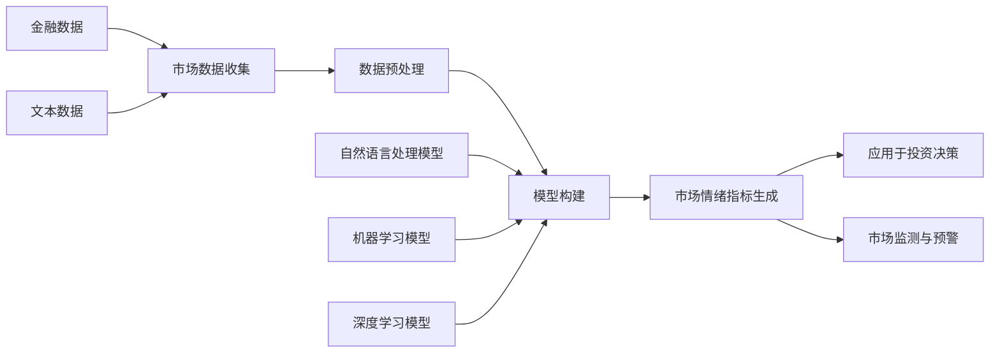

# 人工智能在市场情绪指标构建中的应用

> 关键词：人工智能、市场情绪指标、自然语言处理、机器学习、深度学习

> 摘要：本文深入探讨了人工智能在市场情绪指标构建中的应用。首先介绍了相关背景，包括目的、预期读者等。接着阐述了核心概念如市场情绪、人工智能相关技术及其联系，并给出了相应的原理和架构示意图以及流程图。详细讲解了核心算法原理，通过Python代码进行说明，同时介绍了相关数学模型和公式。通过项目实战展示了如何利用人工智能构建市场情绪指标，包括开发环境搭建、源代码实现与解读。分析了实际应用场景，推荐了学习资源、开发工具框架和相关论文著作。最后总结了未来发展趋势与挑战，提供了常见问题解答和扩展阅读参考资料，旨在为读者全面呈现人工智能在市场情绪指标构建领域的应用全貌。

## 1. 背景介绍 
### 1.1 目的和范围
在金融市场中，市场情绪对资产价格的波动有着重要影响。传统的市场情绪指标构建方法往往存在数据获取不全面、分析主观性强等问题。本文章的目的是探讨如何利用人工智能技术更准确、高效地构建市场情绪指标。范围涵盖了从数据收集、处理到模型构建、指标生成的整个流程，涉及自然语言处理、机器学习、深度学习等多种人工智能技术在市场情绪指标构建中的应用。

### 1.2 预期读者
本文预期读者包括金融分析师、量化交易员、人工智能研究人员、金融科技从业者以及对金融市场和人工智能交叉领域感兴趣的学生和爱好者。他们希望通过本文了解如何将人工智能技术应用于市场情绪指标的构建，以获取更有价值的市场信息和交易策略。

### 1.3 文档结构概述
本文首先介绍背景信息，让读者了解研究的目的和适用人群。接着阐述核心概念与联系，明确市场情绪指标和人工智能相关技术的原理和关系。然后详细讲解核心算法原理和具体操作步骤，结合Python代码进行说明。通过数学模型和公式进一步深入分析。项目实战部分展示实际应用过程，包括环境搭建、代码实现和解读。分析实际应用场景，推荐相关工具和资源。最后总结未来发展趋势与挑战，提供常见问题解答和扩展阅读参考资料。

### 1.4 术语表
#### 1.4.1 核心术语定义
- **市场情绪**：指市场参与者对金融市场整体或特定资产的心理预期和情感倾向，包括乐观、悲观、恐慌等情绪状态。
- **市场情绪指标**：用于量化市场情绪的数值或指数，通过对相关数据的分析和处理得到，反映市场参与者的情绪变化。
- **人工智能**：研究、开发用于模拟、延伸和扩展人的智能的理论、方法、技术及应用系统的一门新的技术科学，包括机器学习、深度学习、自然语言处理等多个领域。
- **自然语言处理（NLP）**：人工智能的一个分支，旨在让计算机理解、处理和生成人类语言，在市场情绪指标构建中可用于分析新闻、社交媒体等文本数据中的情绪信息。
- **机器学习**：一门多领域交叉学科，涉及概率论、统计学、逼近论、凸分析、算法复杂度理论等多门学科。它专门研究计算机怎样模拟或实现人类的学习行为，以获取新的知识或技能，重新组织已有的知识结构使之不断改善自身的性能。
- **深度学习**：机器学习的一个子集，通过构建多层神经网络来学习数据的复杂模式和特征，在图像识别、语音识别、自然语言处理等领域取得了显著成果。

#### 1.4.2 相关概念解释
- **文本情感分析**：自然语言处理的一个重要任务，通过对文本内容进行分析，判断其表达的情感倾向，如积极、消极或中性。在市场情绪指标构建中，可用于分析新闻报道、社交媒体帖子等文本数据中的市场情绪。
- **数据挖掘**：从大量的数据中通过算法搜索隐藏于其中信息的过程，在市场情绪指标构建中可用于从海量的金融数据、文本数据中提取有价值的信息。
- **特征工程**：将原始数据转换为更适合机器学习模型的特征的过程，包括特征选择、特征提取和特征变换等步骤，在市场情绪指标构建中可用于选择和提取与市场情绪相关的特征。

#### 1.4.3 缩略词列表
- **NLP**：Natural Language Processing（自然语言处理）
- **ML**：Machine Learning（机器学习）
- **DL**：Deep Learning（深度学习）
- **LSTM**：Long Short-Term Memory（长短期记忆网络）
- **GRU**：Gated Recurrent Unit（门控循环单元）

## 2. 核心概念与联系 

### 核心概念原理
#### 市场情绪
市场情绪是市场参与者对金融市场的心理预期和情感倾向的综合体现。它受到多种因素的影响，如宏观经济数据、政策变化、公司业绩、突发事件等。市场情绪的变化会影响投资者的决策，进而导致资产价格的波动。例如，当市场情绪乐观时，投资者更愿意买入资产，推动价格上涨；当市场情绪悲观时，投资者倾向于卖出资产，导致价格下跌。

#### 自然语言处理
自然语言处理旨在让计算机理解、处理和生成人类语言。在市场情绪指标构建中，主要应用文本情感分析技术。文本情感分析通过对文本中的词汇、语法、语义等信息进行分析，判断文本所表达的情感倾向。常用的方法包括基于词典的方法、机器学习方法和深度学习方法。基于词典的方法通过预先定义的情感词典，统计文本中积极和消极词汇的数量来判断情感倾向；机器学习方法则通过训练分类模型，对文本进行情感分类；深度学习方法如循环神经网络（RNN）、长短期记忆网络（LSTM）和门控循环单元（GRU）等，能够自动学习文本中的语义和情感特征，具有更高的准确性。

#### 机器学习
机器学习是让计算机通过数据学习模式和规律的技术。在市场情绪指标构建中，常用的机器学习算法包括支持向量机（SVM）、决策树、随机森林、朴素贝叶斯等。这些算法可以用于对市场数据和文本数据进行分类、回归和聚类分析。例如，通过训练一个分类模型，可以将新闻报道分为积极、消极和中性三类，从而提取市场情绪信息。

#### 深度学习
深度学习是机器学习的一个子集，通过构建多层神经网络来学习数据的复杂模式和特征。在市场情绪指标构建中，深度学习模型如卷积神经网络（CNN）、循环神经网络（RNN）及其变体LSTM和GRU等，能够处理序列数据和文本数据，自动提取数据中的特征，具有更高的准确性和泛化能力。例如，LSTM网络可以处理时间序列数据，捕捉市场情绪的动态变化。

### 架构的文本示意图
```plaintext
市场数据收集
|
|-- 金融数据（价格、成交量等）
|-- 文本数据（新闻、社交媒体等）
|
数据预处理
|
|-- 清洗和去噪
|-- 特征提取和转换
|
模型构建
|
|-- 自然语言处理模型（文本情感分析）
|-- 机器学习模型（分类、回归等）
|-- 深度学习模型（CNN、RNN等）
|
市场情绪指标生成
|
|-- 综合各模型结果
|-- 调整和优化指标
```

### Mermaid 流程图


## 3. 核心算法原理 & 具体操作步骤 

### 文本情感分析的基于词典方法
#### 原理
基于词典的文本情感分析方法通过预先定义的情感词典，统计文本中积极和消极词汇的数量，然后根据一定的规则判断文本的情感倾向。例如，如果文本中积极词汇的数量多于消极词汇的数量，则认为文本表达的是积极情感；反之，则认为是消极情感。

#### Python代码实现
```python
# 定义情感词典
positive_words = ["上涨", "利好", "乐观", "盈利"]
negative_words = ["下跌", "利空", "悲观", "亏损"]

def sentiment_analysis(text):
    positive_count = 0
    negative_count = 0
    for word in text.split():
        if word in positive_words:
            positive_count += 1
        elif word in negative_words:
            negative_count += 1
    if positive_count > negative_count:
        return "积极"
    elif positive_count < negative_count:
        return "消极"
    else:
        return "中性"

# 测试
text = "股票价格上涨，市场前景乐观"
print(sentiment_analysis(text))
```

### 机器学习分类模型（支持向量机）
#### 原理
支持向量机（SVM）是一种二分类模型，其基本思想是找到一个最优的超平面，将不同类别的样本分开，使得两类样本到超平面的距离最大。在文本情感分析中，可以将文本的特征向量作为输入，将情感类别（积极、消极或中性）作为输出，训练SVM模型进行分类。

#### Python代码实现
```python
from sklearn.feature_extraction.text import TfidfVectorizer
from sklearn.svm import SVC
from sklearn.model_selection import train_test_split
from sklearn.metrics import accuracy_score

# 示例数据
corpus = [
    "股票价格上涨，市场前景乐观",
    "公司业绩亏损，股价下跌",
    "市场行情平稳，无明显波动"
]
labels = ["积极", "消极", "中性"]

# 特征提取
vectorizer = TfidfVectorizer()
X = vectorizer.fit_transform(corpus)

# 划分训练集和测试集
X_train, X_test, y_train, y_test = train_test_split(X, labels, test_size=0.2, random_state=42)

# 训练SVM模型
model = SVC()
model.fit(X_train, y_train)

# 预测
y_pred = model.predict(X_test)

# 评估模型
accuracy = accuracy_score(y_test, y_pred)
print(f"模型准确率: {accuracy}")
```

### 深度学习模型（LSTM）
#### 原理
长短期记忆网络（LSTM）是一种特殊的循环神经网络，能够解决传统RNN的梯度消失问题，有效地处理长序列数据。在文本情感分析中，LSTM可以学习文本中的上下文信息，捕捉文本的语义和情感特征。

#### Python代码实现
```python
import numpy as np
from tensorflow.keras.preprocessing.text import Tokenizer
from tensorflow.keras.preprocessing.sequence import pad_sequences
from tensorflow.keras.models import Sequential
from tensorflow.keras.layers import Embedding, LSTM, Dense

# 示例数据
corpus = [
    "股票价格上涨，市场前景乐观",
    "公司业绩亏损，股价下跌",
    "市场行情平稳，无明显波动"
]
labels = [1, 0, 2]  # 1: 积极，0: 消极，2: 中性

# 分词和编码
tokenizer = Tokenizer()
tokenizer.fit_on_texts(corpus)
sequences = tokenizer.texts_to_sequences(corpus)

# 填充序列
max_length = max([len(seq) for seq in sequences])
padded_sequences = pad_sequences(sequences, maxlen=max_length)

# 构建LSTM模型
model = Sequential()
model.add(Embedding(input_dim=len(tokenizer.word_index) + 1, output_dim=100, input_length=max_length))
model.add(LSTM(100))
model.add(Dense(3, activation='softmax'))

# 编译模型
model.compile(optimizer='adam', loss='sparse_categorical_crossentropy', metrics=['accuracy'])

# 训练模型
model.fit(padded_sequences, np.array(labels), epochs=10, batch_size=1)

# 预测
test_text = ["股票价格持续上涨"]
test_sequence = tokenizer.texts_to_sequences(test_text)
test_padded = pad_sequences(test_sequence, maxlen=max_length)
prediction = model.predict(test_padded)
predicted_class = np.argmax(prediction)
print(f"预测结果: {predicted_class}")
```

## 4. 数学模型和公式 & 详细讲解 & 举例说明 

### 基于词典方法的情感得分计算
#### 公式
设文本 $T$ 中积极词汇的数量为 $P$，消极词汇的数量为 $N$，则文本的情感得分 $S$ 可以表示为：
$$S = P - N$$

#### 详细讲解
当 $S > 0$ 时，文本表达的是积极情感；当 $S < 0$ 时，文本表达的是消极情感；当 $S = 0$ 时，文本表达的是中性情感。

#### 举例说明
对于文本 “股票价格上涨，公司业绩盈利，但市场竞争激烈”，其中积极词汇有 “上涨”、“盈利”，$P = 2$；消极词汇有 “激烈”（假设 “激烈” 在消极词典中），$N = 1$。则情感得分 $S = 2 - 1 = 1 > 0$，文本表达的是积极情感。

### 支持向量机的决策函数
#### 公式
对于二分类问题，支持向量机的决策函数可以表示为：
$$f(x) = \text{sign}(\sum_{i=1}^{n} \alpha_i y_i K(x_i, x) + b)$$
其中，$\alpha_i$ 是拉格朗日乘子，$y_i$ 是样本的类别标签，$K(x_i, x)$ 是核函数，$b$ 是偏置项。

#### 详细讲解
核函数 $K(x_i, x)$ 用于将输入数据映射到高维空间，使得在高维空间中可以找到一个线性可分的超平面。常用的核函数包括线性核、多项式核、高斯核等。决策函数 $f(x)$ 的输出为 $+1$ 或 $-1$，分别表示样本属于正类或负类。

#### 举例说明
假设我们有一个二维数据集，使用线性核函数 $K(x_i, x) = x_i^T x$，经过训练得到 $\alpha_1 = 0.5$，$\alpha_2 = 0.3$，$y_1 = 1$，$y_2 = -1$，$b = 0.1$，$x_1 = [1, 2]$，$x_2 = [3, 4]$，要判断样本 $x = [2, 3]$ 属于哪一类。
首先计算 $K(x_1, x) = 1\times2 + 2\times3 = 8$，$K(x_2, x) = 3\times2 + 4\times3 = 18$。
然后计算 $f(x) = \text{sign}(0.5\times1\times8 + 0.3\times(-1)\times18 + 0.1) = \text{sign}(4 - 5.4 + 0.1) = \text{sign}(-1.3) = -1$，所以样本 $x$ 属于负类。

### LSTM的单元结构和计算公式
#### 公式
LSTM单元主要由输入门 $i_t$、遗忘门 $f_t$、输出门 $o_t$ 和细胞状态 $C_t$ 组成，其计算公式如下：
- 遗忘门：
$$f_t = \sigma(W_f [h_{t-1}, x_t] + b_f)$$
- 输入门：
$$i_t = \sigma(W_i [h_{t-1}, x_t] + b_i)$$
- 候选细胞状态：
$$\tilde{C}_t = \tanh(W_C [h_{t-1}, x_t] + b_C)$$
- 细胞状态更新：
$$C_t = f_t \odot C_{t-1} + i_t \odot \tilde{C}_t$$
- 输出门：
$$o_t = \sigma(W_o [h_{t-1}, x_t] + b_o)$$
- 隐藏状态更新：
$$h_t = o_t \odot \tanh(C_t)$$
其中，$\sigma$ 是 sigmoid 函数，$\tanh$ 是双曲正切函数，$W$ 是权重矩阵，$b$ 是偏置项，$\odot$ 表示逐元素相乘，$h_{t-1}$ 是上一时刻的隐藏状态，$x_t$ 是当前时刻的输入。

#### 详细讲解
遗忘门 $f_t$ 决定了上一时刻的细胞状态 $C_{t-1}$ 中有多少信息需要被遗忘；输入门 $i_t$ 决定了当前时刻的候选细胞状态 $\tilde{C}_t$ 中有多少信息需要被加入到细胞状态中；细胞状态 $C_t$ 是 LSTM 单元的核心，用于存储和传递长期信息；输出门 $o_t$ 决定了当前时刻的细胞状态 $C_t$ 中有多少信息需要被输出到隐藏状态 $h_t$ 中。

#### 举例说明
假设我们有一个简单的 LSTM 单元，输入维度为 2，隐藏维度为 3。在某一时刻 $t$，输入 $x_t = [0.1, 0.2]$，上一时刻的隐藏状态 $h_{t-1} = [0.3, 0.4, 0.5]$。经过计算得到遗忘门 $f_t = [0.6, 0.7, 0.8]$，输入门 $i_t = [0.2, 0.3, 0.4]$，候选细胞状态 $\tilde{C}_t = [0.1, 0.2, 0.3]$，上一时刻的细胞状态 $C_{t-1} = [0.4, 0.5, 0.6]$。
首先计算细胞状态更新：
$$C_t = f_t \odot C_{t-1} + i_t \odot \tilde{C}_t = [0.6\times0.4 + 0.2\times0.1, 0.7\times0.5 + 0.3\times0.2, 0.8\times0.6 + 0.4\times0.3] = [0.26, 0.41, 0.6]$$
假设输出门 $o_t = [0.5, 0.6, 0.7]$，则隐藏状态更新：
$$h_t = o_t \odot \tanh(C_t) = [0.5\times\tanh(0.26), 0.6\times\tanh(0.41), 0.7\times\tanh(0.6)]$$

## 5. 项目实战：代码实际案例和详细解释说明 

### 5.1  开发环境搭建
#### 安装Python
首先需要安装Python，建议使用Python 3.7及以上版本。可以从Python官方网站（https://www.python.org/downloads/）下载安装包，按照提示进行安装。

#### 安装必要的库
使用pip命令安装以下必要的库：
```sh
pip install numpy pandas scikit-learn tensorflow keras nltk
```
- `numpy`：用于数值计算。
- `pandas`：用于数据处理和分析。
- `scikit-learn`：提供机器学习算法和工具。
- `tensorflow` 和 `keras`：用于深度学习模型的构建和训练。
- `nltk`：用于自然语言处理任务。

### 5.2  源代码详细实现和代码解读
#### 数据收集和预处理
```python
import pandas as pd
import nltk
from nltk.corpus import stopwords
from nltk.tokenize import word_tokenize
from sklearn.feature_extraction.text import TfidfVectorizer

# 下载停用词
nltk.download('stopwords')
nltk.download('punkt')

# 读取数据
data = pd.read_csv('market_news.csv')

# 数据清洗
def clean_text(text):
    # 转换为小写
    text = text.lower()
    # 分词
    tokens = word_tokenize(text)
    # 去除停用词
    stop_words = set(stopwords.words('english'))
    filtered_tokens = [token for token in tokens if token.isalpha() and token not in stop_words]
    # 拼接成字符串
    cleaned_text = ' '.join(filtered_tokens)
    return cleaned_text

data['cleaned_text'] = data['text'].apply(clean_text)

# 特征提取
vectorizer = TfidfVectorizer()
X = vectorizer.fit_transform(data['cleaned_text'])
y = data['sentiment']
```
**代码解读**：
- 首先使用 `pandas` 读取市场新闻数据。
- `clean_text` 函数用于对文本进行清洗，包括转换为小写、分词、去除停用词等操作。
- 使用 `TfidfVectorizer` 对清洗后的文本进行特征提取，将文本转换为数值特征向量。

#### 模型训练和评估
```python
from sklearn.model_selection import train_test_split
from sklearn.svm import SVC
from sklearn.metrics import accuracy_score

# 划分训练集和测试集
X_train, X_test, y_train, y_test = train_test_split(X, y, test_size=0.2, random_state=42)

# 训练SVM模型
model = SVC()
model.fit(X_train, y_train)

# 预测
y_pred = model.predict(X_test)

# 评估模型
accuracy = accuracy_score(y_test, y_pred)
print(f"模型准确率: {accuracy}")
```
**代码解读**：
- 使用 `train_test_split` 函数将数据集划分为训练集和测试集。
- 训练一个支持向量机（SVM）模型，并使用训练集进行训练。
- 使用训练好的模型对测试集进行预测，并计算模型的准确率。

### 5.3  代码解读与分析
#### 数据预处理的重要性
数据预处理是构建市场情绪指标的关键步骤。通过清洗和去噪，可以去除文本中的噪声信息，提高数据的质量。特征提取将文本数据转换为数值特征向量，使得机器学习模型能够处理。在本案例中，使用 `TfidfVectorizer` 提取文本的 TF-IDF 特征，能够有效地表示文本的重要性。

#### 模型选择和评估
选择合适的模型对于构建准确的市场情绪指标至关重要。在本案例中，选择了支持向量机（SVM）模型，它在文本分类任务中具有较好的性能。通过划分训练集和测试集，使用测试集对模型进行评估，计算准确率等指标，可以评估模型的性能。

## 6. 实际应用场景 
### 投资决策
投资者可以根据市场情绪指标调整投资组合。当市场情绪指标显示乐观时，投资者可以增加股票等风险资产的配置；当市场情绪指标显示悲观时，投资者可以减少风险资产的配置，增加债券等避险资产的配置。例如，在2008年金融危机期间，市场情绪极度悲观，投资者纷纷抛售股票，转向债券等安全资产。

### 市场监测与预警
金融机构可以实时监测市场情绪指标，及时发现市场异常波动的信号。当市场情绪指标出现急剧变化时，可能预示着市场即将发生重大事件，如股市暴跌、汇率波动等。金融机构可以提前采取措施，降低风险。例如，证券公司可以根据市场情绪指标调整保证金比例，控制客户的交易风险。

### 量化交易策略
量化交易员可以将市场情绪指标纳入量化交易策略中，提高交易策略的盈利能力。例如，通过构建基于市场情绪指标的动量策略，当市场情绪指标上升时，买入股票；当市场情绪指标下降时，卖出股票。这种策略可以捕捉市场情绪变化带来的投资机会。

## 7. 工具和资源推荐
### 7.1 学习资源推荐
#### 7.1.1 书籍推荐
- 《Python机器学习》：全面介绍了Python在机器学习领域的应用，包括数据预处理、模型选择、评估和优化等内容。
- 《深度学习》：由深度学习领域的三位先驱 Ian Goodfellow、Yoshua Bengio 和 Aaron Courville 撰写，系统地介绍了深度学习的基本原理、算法和应用。
- 《自然语言处理入门》：适合初学者，介绍了自然语言处理的基本概念、技术和方法，包括文本分类、情感分析等。

#### 7.1.2 在线课程
- Coursera上的 “机器学习” 课程：由斯坦福大学教授 Andrew Ng 授课，是机器学习领域的经典课程，涵盖了机器学习的基本概念、算法和应用。
- edX上的 “深度学习基础” 课程：介绍了深度学习的基本原理和技术，包括神经网络、卷积神经网络、循环神经网络等。
- 中国大学MOOC上的 “自然语言处理” 课程：由国内知名高校的教授授课，系统地介绍了自然语言处理的理论和实践。

#### 7.1.3 技术博客和网站
- Medium：有许多关于人工智能、机器学习和自然语言处理的优质博客文章，作者来自世界各地的技术专家和研究者。
- arXiv：提供了大量的学术论文，涵盖了人工智能、机器学习、深度学习等领域的最新研究成果。
- 开源中国：国内知名的开源技术社区，有许多关于人工智能和金融科技的技术文章和案例分享。

### 7.2 开发工具框架推荐
#### 7.2.1 IDE和编辑器
- PyCharm：是一款专门为Python开发设计的集成开发环境（IDE），具有代码编辑、调试、版本控制等功能，适合专业的Python开发者。
- Jupyter Notebook：是一个交互式的开发环境，支持Python、R等多种编程语言，适合数据科学家和机器学习工程师进行数据分析和模型开发。
- Visual Studio Code：是一款轻量级的代码编辑器，支持多种编程语言和插件扩展，具有丰富的开发工具和调试功能。

#### 7.2.2 调试和性能分析工具
- TensorBoard：是TensorFlow提供的可视化工具，用于可视化深度学习模型的训练过程、模型结构和性能指标。
- Py-Spy：是一个用于分析Python代码性能的工具，可以找出代码中的性能瓶颈和热点函数。
- Scikit-learn的GridSearchCV：用于模型参数调优，可以自动搜索最优的模型参数组合，提高模型的性能。

#### 7.2.3 相关框架和库
- TensorFlow：是一个开源的深度学习框架，由Google开发，支持多种深度学习模型的构建和训练，具有高效的计算性能和分布式训练能力。
- PyTorch：是另一个开源的深度学习框架，由Facebook开发，具有动态图机制，易于使用和调试，在学术界和工业界都有广泛的应用。
- NLTK：是一个开源的自然语言处理工具包，提供了丰富的语料库、工具和算法，用于文本处理、分词、词性标注、情感分析等任务。

### 7.3 相关论文著作推荐
#### 7.3.1 经典论文
- “Attention Is All You Need”：提出了Transformer模型，是自然语言处理领域的重要突破，推动了深度学习在自然语言处理中的应用。
- “Long Short-Term Memory”：介绍了长短期记忆网络（LSTM）的原理和结构，解决了传统循环神经网络的梯度消失问题。
- “Support-Vector Networks”：首次提出了支持向量机（SVM）的概念和算法，是机器学习领域的经典论文。

#### 7.3.2 最新研究成果
- 关注顶级学术会议如NeurIPS、ICML、ACL等的最新论文，了解人工智能、机器学习和自然语言处理领域的最新研究动态。
- 关注知名学术期刊如Journal of Artificial Intelligence Research、Artificial Intelligence等的最新文章，获取高质量的研究成果。

#### 7.3.3 应用案例分析
- 《金融科技前沿：人工智能在金融领域的应用》：介绍了人工智能在金融领域的各种应用案例，包括市场情绪分析、风险评估、投资决策等。
- 《量化交易：如何建立自己的算法交易系统》：提供了量化交易的理论和实践指导，包括如何将市场情绪指标纳入量化交易策略中。

## 8. 总结：未来发展趋势与挑战
### 未来发展趋势
#### 多模态数据融合
未来的市场情绪指标构建将不仅仅依赖于文本数据，还会融合图像、音频、视频等多模态数据。例如，通过分析上市公司的财报视频、新闻发布会音频等，获取更全面的市场情绪信息。

#### 强化学习与市场情绪指标的结合
强化学习可以根据市场情绪指标动态调整投资策略，实现自适应的投资决策。通过不断与市场环境进行交互，学习最优的投资策略，提高投资收益。

#### 跨市场和跨领域的情绪分析
随着全球金融市场的一体化，未来的市场情绪指标构建将不仅局限于单一市场，还会考虑跨市场和跨领域的情绪传导。例如，分析全球股市、债市、汇市等不同市场之间的情绪关联，以及金融市场与宏观经济、政治等领域的情绪互动。

### 挑战
#### 数据质量和隐私问题
市场情绪指标的构建依赖于大量的数据，数据的质量直接影响指标的准确性。同时，随着数据隐私法规的不断加强，如何在保护用户隐私的前提下获取和使用数据是一个挑战。

#### 模型的可解释性
深度学习模型在市场情绪指标构建中取得了较好的效果，但这些模型往往是黑盒模型，缺乏可解释性。在金融领域，模型的可解释性非常重要，因为投资者需要了解模型的决策依据。

#### 市场的复杂性和不确定性
金融市场是一个复杂的系统，受到多种因素的影响，市场情绪的变化也具有不确定性。如何准确地捕捉市场情绪的动态变化，构建稳定可靠的市场情绪指标是一个挑战。

## 9. 附录：常见问题与解答
### 如何选择合适的人工智能模型构建市场情绪指标？
选择合适的模型需要考虑多个因素，如数据类型、数据规模、问题复杂度等。如果数据量较小，可以选择简单的机器学习模型，如支持向量机、决策树等；如果数据量较大且问题复杂，可以选择深度学习模型，如卷积神经网络、循环神经网络等。同时，还可以通过模型评估和比较，选择性能最优的模型。

### 市场情绪指标的准确性如何评估？
可以使用多种指标评估市场情绪指标的准确性，如准确率、召回率、F1值等。此外，还可以通过与实际市场走势进行对比，观察市场情绪指标是否能够准确反映市场的情绪变化。

### 如何处理文本数据中的噪声和歧义？
可以通过数据清洗和预处理来处理文本数据中的噪声和歧义。例如，去除停用词、标点符号，进行词干提取和词形还原等操作。同时，还可以使用语义分析技术，结合上下文信息，消除文本中的歧义。

## 10. 扩展阅读 & 参考资料
### 扩展阅读
- 《人工智能时代的金融科技》：探讨了人工智能在金融科技领域的应用和发展趋势。
- 《大数据与金融市场分析》：介绍了大数据技术在金融市场分析中的应用，包括市场情绪指标的构建。
- 《机器学习实战》：通过实际案例介绍了机器学习的应用，帮助读者更好地理解和掌握机器学习技术。

### 参考资料
- Goodfellow, I., Bengio, Y., & Courville, A. (2016). Deep Learning. MIT Press.
- Mitchell, T. M. (1997). Machine Learning. McGraw-Hill.
- Jurafsky, D., & Martin, J. H. (2020). Speech and Language Processing. Pearson.

作者：AI天才研究院/AI Genius Institute & 禅与计算机程序设计艺术 /Zen And The Art of Computer Programming