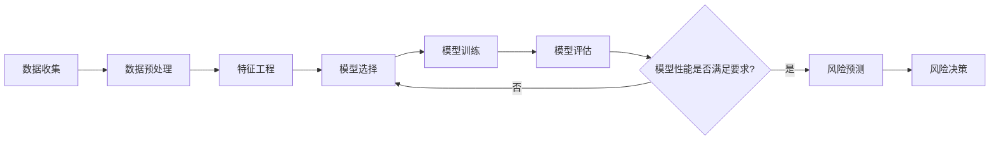

# 人工智能在市场流动性风险评估中的应用

> 关键词：人工智能、市场流动性风险、风险评估、机器学习、深度学习

> 摘要：本文聚焦于人工智能在市场流动性风险评估中的应用。在金融市场中，准确评估流动性风险至关重要，而传统方法存在一定局限性。人工智能凭借其强大的数据处理和分析能力，为市场流动性风险评估带来了新的思路和方法。文章详细介绍了相关核心概念、算法原理、数学模型，通过项目实战展示其具体应用，探讨了实际应用场景，推荐了相关工具和资源，最后对未来发展趋势与挑战进行了总结。

## 1. 背景介绍 
### 1.1 目的和范围
市场流动性风险是金融市场中一个关键的风险因素，它直接影响着金融机构的稳定性和投资者的利益。传统的市场流动性风险评估方法往往基于历史数据和简单的统计模型，难以适应复杂多变的市场环境。本文章的目的在于深入探讨人工智能在市场流动性风险评估中的应用，分析其原理、方法和优势，为金融从业者和研究人员提供全面的参考。范围涵盖了人工智能的主要技术，如机器学习、深度学习等在市场流动性风险评估中的应用，包括数据处理、模型构建、风险度量等方面。

### 1.2 预期读者
本文预期读者包括金融领域的从业者，如银行家、投资经理、风险管理人员等，他们可以从中了解人工智能在市场流动性风险评估中的具体应用，为实际工作提供新的思路和方法。同时，也适合计算机科学和人工智能领域的研究人员和学生，帮助他们了解金融领域的实际需求，拓展研究方向。此外，对金融市场和人工智能感兴趣的普通读者也可以通过本文对相关知识有一个初步的了解。

### 1.3 文档结构概述
本文首先介绍背景信息，包括目的、预期读者和文档结构概述等内容。接着阐述核心概念与联系，解释市场流动性风险和人工智能相关概念，并展示其关系的示意图和流程图。然后详细讲解核心算法原理和具体操作步骤，结合 Python 源代码进行说明。之后介绍数学模型和公式，并举例说明。通过项目实战展示代码实际案例和详细解释。探讨实际应用场景，推荐相关工具和资源。最后总结未来发展趋势与挑战，提供常见问题与解答和扩展阅读参考资料。

### 1.4 术语表
#### 1.4.1 核心术语定义
- **市场流动性风险**：指金融资产在市场中能够以合理价格迅速买卖的能力受到限制的风险。当市场流动性不足时，投资者可能难以在需要时以合理价格买入或卖出资产，从而导致损失。
- **人工智能（AI）**：是研究、开发用于模拟、延伸和扩展人的智能的理论、方法、技术及应用系统的一门新的技术科学。在本文中主要涉及机器学习和深度学习等技术在市场流动性风险评估中的应用。
- **机器学习（ML）**：是一门多领域交叉学科，涉及概率论、统计学、逼近论、凸分析、算法复杂度理论等多门学科。它专门研究计算机怎样模拟或实现人类的学习行为，以获取新的知识或技能，重新组织已有的知识结构使之不断改善自身的性能。
- **深度学习（DL）**：是机器学习的一个分支领域，它是一种基于对数据进行表征学习的方法。深度学习通过构建具有很多层的神经网络模型，自动从大量数据中学习特征和模式。

#### 1.4.2 相关概念解释
- **风险评估**：是对风险的可能性和影响程度进行评估的过程。在市场流动性风险评估中，需要综合考虑各种因素，如市场交易活跃度、资产价格波动等，以确定风险水平。
- **数据挖掘**：是指从大量的数据中通过算法搜索隐藏于其中信息的过程。在市场流动性风险评估中，数据挖掘可以帮助发现数据中的潜在模式和关系，为风险评估提供依据。
- **神经网络**：是一种模仿人类神经系统的计算模型，由大量的神经元组成。神经网络可以自动学习数据中的特征和模式，具有很强的非线性映射能力。

#### 1.4.3 缩略词列表
- **AI**：Artificial Intelligence（人工智能）
- **ML**：Machine Learning（机器学习）
- **DL**：Deep Learning（深度学习）
- **LSTM**：Long Short - Term Memory（长短期记忆网络）
- **GRU**：Gated Recurrent Unit（门控循环单元）

## 2. 核心概念与联系 
### 市场流动性风险概述
市场流动性风险是金融市场中一个重要的风险因素。它主要体现在资产的买卖难度和价格波动上。当市场流动性较好时，投资者可以迅速地以合理价格买卖资产；而当市场流动性不足时，投资者可能需要等待较长时间才能完成交易，或者不得不接受较大的价格折扣。市场流动性风险受到多种因素的影响，包括市场参与者的行为、宏观经济环境、政策变化等。

### 人工智能技术在风险评估中的作用
人工智能技术，特别是机器学习和深度学习，在市场流动性风险评估中具有重要作用。机器学习算法可以通过对历史数据的学习，发现数据中的模式和规律，从而对未来的市场流动性风险进行预测。深度学习则可以处理更复杂的数据，如文本数据、图像数据等，挖掘出更多隐藏的信息。通过人工智能技术，可以提高风险评估的准确性和效率，帮助金融机构更好地管理风险。

### 核心概念原理和架构的文本示意图
市场流动性风险评估的核心概念原理和架构可以用以下文本示意图表示：

数据收集（包括市场交易数据、宏观经济数据等） -> 数据预处理（清洗、转换、归一化等） -> 特征工程（提取与市场流动性风险相关的特征） -> 模型选择（机器学习或深度学习模型） -> 模型训练（使用历史数据进行训练） -> 模型评估（评估模型的性能） -> 风险预测（使用训练好的模型对未来市场流动性风险进行预测） -> 风险决策（根据预测结果进行风险控制和管理）

### Mermaid 流程图


## 3. 核心算法原理 & 具体操作步骤 
### 机器学习算法原理
#### 逻辑回归
逻辑回归是一种常用的分类算法，它通过对输入特征进行线性组合，然后使用逻辑函数将其转换为概率值。在市场流动性风险评估中，可以将市场流动性风险分为高、中、低三个等级，使用逻辑回归算法进行分类预测。

Python 代码示例：
```python
import numpy as np
from sklearn.linear_model import LogisticRegression
from sklearn.model_selection import train_test_split
from sklearn.metrics import accuracy_score

# 生成示例数据
X = np.random.rand(100, 5)  # 特征数据
y = np.random.randint(0, 3, 100)  # 标签数据

# 划分训练集和测试集
X_train, X_test, y_train, y_test = train_test_split(X, y, test_size=0.2, random_state=42)

# 创建逻辑回归模型
model = LogisticRegression()

# 训练模型
model.fit(X_train, y_train)

# 预测
y_pred = model.predict(X_test)

# 评估模型
accuracy = accuracy_score(y_test, y_pred)
print(f"Accuracy: {accuracy}")
```
#### 决策树
决策树是一种基于树结构进行决策的算法。它通过对特征进行划分，构建决策树模型。在市场流动性风险评估中，决策树可以根据不同的特征条件对市场流动性风险进行分类。

Python 代码示例：
```python
from sklearn.tree import DecisionTreeClassifier

# 创建决策树模型
model = DecisionTreeClassifier()

# 训练模型
model.fit(X_train, y_train)

# 预测
y_pred = model.predict(X_test)

# 评估模型
accuracy = accuracy_score(y_test, y_pred)
print(f"Accuracy: {accuracy}")
```
### 深度学习算法原理
#### 多层感知机（MLP）
多层感知机是一种基本的神经网络模型，由输入层、隐藏层和输出层组成。在市场流动性风险评估中，多层感知机可以学习输入特征与市场流动性风险之间的复杂关系。

Python 代码示例：
```python
import tensorflow as tf
from tensorflow.keras.models import Sequential
from tensorflow.keras.layers import Dense

# 构建多层感知机模型
model = Sequential([
    Dense(10, activation='relu', input_shape=(5,)),
    Dense(3, activation='softmax')
])

# 编译模型
model.compile(optimizer='adam', loss='sparse_categorical_crossentropy', metrics=['accuracy'])

# 训练模型
model.fit(X_train, y_train, epochs=10, batch_size=32, validation_data=(X_test, y_test))

# 评估模型
_, accuracy = model.evaluate(X_test, y_test)
print(f"Accuracy: {accuracy}")
```
#### 长短期记忆网络（LSTM）
长短期记忆网络是一种特殊的循环神经网络，它可以处理序列数据。在市场流动性风险评估中，LSTM 可以处理时间序列数据，如市场交易数据的历史记录，从而更好地捕捉市场流动性风险的变化趋势。

Python 代码示例：
```python
from tensorflow.keras.layers import LSTM

# 调整数据形状以适应 LSTM 输入
X_train = np.reshape(X_train, (X_train.shape[0], 1, X_train.shape[1]))
X_test = np.reshape(X_test, (X_test.shape[0], 1, X_test.shape[1]))

# 构建 LSTM 模型
model = Sequential([
    LSTM(10, input_shape=(1, 5)),
    Dense(3, activation='softmax')
])

# 编译模型
model.compile(optimizer='adam', loss='sparse_categorical_crossentropy', metrics=['accuracy'])

# 训练模型
model.fit(X_train, y_train, epochs=10, batch_size=32, validation_data=(X_test, y_test))

# 评估模型
_, accuracy = model.evaluate(X_test, y_test)
print(f"Accuracy: {accuracy}")
```
### 具体操作步骤
1. **数据收集**：收集与市场流动性风险相关的数据，包括市场交易数据（如成交量、成交额、价格波动等）、宏观经济数据（如 GDP 增长率、通货膨胀率等）、政策数据等。
2. **数据预处理**：对收集到的数据进行清洗，去除缺失值和异常值；进行数据转换，如将分类数据转换为数值数据；对数据进行归一化处理，使数据具有相同的尺度。
3. **特征工程**：从预处理后的数据中提取与市场流动性风险相关的特征。可以使用统计方法、领域知识等进行特征提取。
4. **模型选择**：根据数据的特点和问题的需求，选择合适的机器学习或深度学习模型。
5. **模型训练**：使用训练数据对选择的模型进行训练，调整模型的参数，使模型的性能达到最优。
6. **模型评估**：使用测试数据对训练好的模型进行评估，评估指标包括准确率、召回率、F1 值等。
7. **风险预测**：使用训练好的模型对未来的市场流动性风险进行预测。
8. **风险决策**：根据预测结果，制定相应的风险控制和管理策略。

## 4. 数学模型和公式 & 详细讲解 & 举例说明 
### 逻辑回归的数学模型和公式
逻辑回归的数学模型基于逻辑函数，也称为 sigmoid 函数。逻辑函数的公式为：
$$\sigma(z)=\frac{1}{1 + e^{-z}}$$
其中，$z$ 是输入特征的线性组合，即：
$$z = \theta_0+\theta_1x_1+\theta_2x_2+\cdots+\theta_nx_n$$
$\theta_0,\theta_1,\cdots,\theta_n$ 是模型的参数，$x_1,x_2,\cdots,x_n$ 是输入特征。

逻辑回归的目标是通过最大化似然函数来估计模型的参数。似然函数的公式为：
$$L(\theta)=\prod_{i = 1}^{m}P(y^{(i)}|x^{(i)};\theta)$$
其中，$m$ 是样本数量，$y^{(i)}$ 是第 $i$ 个样本的标签，$x^{(i)}$ 是第 $i$ 个样本的特征。

为了方便计算，通常对似然函数取对数，得到对数似然函数：
$$\ell(\theta)=\log L(\theta)=\sum_{i = 1}^{m}\log P(y^{(i)}|x^{(i)};\theta)$$

通过最大化对数似然函数，可以得到模型的最优参数。

举例说明：假设有一个二分类问题，输入特征为 $x_1$ 和 $x_2$，模型的参数为 $\theta_0 = 1$，$\theta_1 = 2$，$\theta_2 = 3$。对于一个样本 $(x_1 = 0.5, x_2 = 0.3)$，计算 $z$ 的值为：
$$z = 1+2\times0.5 + 3\times0.3=1 + 1+0.9 = 2.9$$
然后计算 $\sigma(z)$ 的值：
$$\sigma(2.9)=\frac{1}{1 + e^{-2.9}}\approx0.94$$
如果设定阈值为 0.5，则该样本的预测标签为 1。

### 决策树的数学模型和公式
决策树的构建基于信息增益、信息增益比、基尼指数等准则。以信息增益为例，信息增益的计算公式为：
$$IG(D, A)=H(D)-H(D|A)$$
其中，$D$ 是数据集，$A$ 是特征，$H(D)$ 是数据集 $D$ 的信息熵，$H(D|A)$ 是在特征 $A$ 给定的条件下数据集 $D$ 的条件熵。

信息熵的计算公式为：
$$H(D)=-\sum_{k = 1}^{K}p_k\log_2p_k$$
其中，$K$ 是类别数量，$p_k$ 是第 $k$ 类样本在数据集 $D$ 中所占的比例。

条件熵的计算公式为：
$$H(D|A)=\sum_{v = 1}^{V}\frac{|D^v|}{|D|}H(D^v)$$
其中，$V$ 是特征 $A$ 的取值数量，$D^v$ 是特征 $A$ 取值为 $v$ 的样本子集。

举例说明：假设有一个数据集 $D$ 包含 10 个样本，分为 2 类，其中第一类有 6 个样本，第二类有 4 个样本。则数据集 $D$ 的信息熵为：
$$H(D)=-\frac{6}{10}\log_2\frac{6}{10}-\frac{4}{10}\log_2\frac{4}{10}\approx0.97$$
假设有一个特征 $A$ 有 2 个取值，$A = 1$ 时有 4 个样本，其中第一类有 3 个，第二类有 1 个；$A = 2$ 时有 6 个样本，其中第一类有 3 个，第二类有 3 个。则条件熵为：
$$H(D|A)=\frac{4}{10}\left(-\frac{3}{4}\log_2\frac{3}{4}-\frac{1}{4}\log_2\frac{1}{4}\right)+\frac{6}{10}\left(-\frac{3}{6}\log_2\frac{3}{6}-\frac{3}{6}\log_2\frac{3}{6}\right)\approx0.81$$
信息增益为：
$$IG(D, A)=0.97 - 0.81 = 0.16$$

### 多层感知机的数学模型和公式
多层感知机的数学模型基于神经元的激活函数。常见的激活函数有 sigmoid 函数、ReLU 函数等。以 ReLU 函数为例，其公式为：
$$f(x)=\max(0, x)$$

多层感知机的前向传播过程可以表示为：
$$z^{(l)} = W^{(l)}a^{(l - 1)}+b^{(l)}$$
$$a^{(l)} = f(z^{(l)})$$
其中，$l$ 表示层数，$W^{(l)}$ 是第 $l$ 层的权重矩阵，$b^{(l)}$ 是第 $l$ 层的偏置向量，$a^{(l)}$ 是第 $l$ 层的输出，$f$ 是激活函数。

多层感知机的训练通常使用反向传播算法，通过计算损失函数的梯度来更新模型的参数。

举例说明：假设有一个简单的多层感知机，输入层有 2 个神经元，隐藏层有 3 个神经元，输出层有 1 个神经元。输入特征为 $(x_1 = 0.5, x_2 = 0.3)$，隐藏层的权重矩阵 $W^{(1)}$ 为：
$$W^{(1)}=\begin{bmatrix}0.1 & 0.2\\0.3 & 0.4\\0.5 & 0.6\end{bmatrix}$$
隐藏层的偏置向量 $b^{(1)}$ 为 $(0.1, 0.2, 0.3)$。则隐藏层的输入 $z^{(1)}$ 为：
$$z^{(1)} = W^{(1)}\begin{bmatrix}0.5\\0.3\end{bmatrix}+\begin{bmatrix}0.1\\