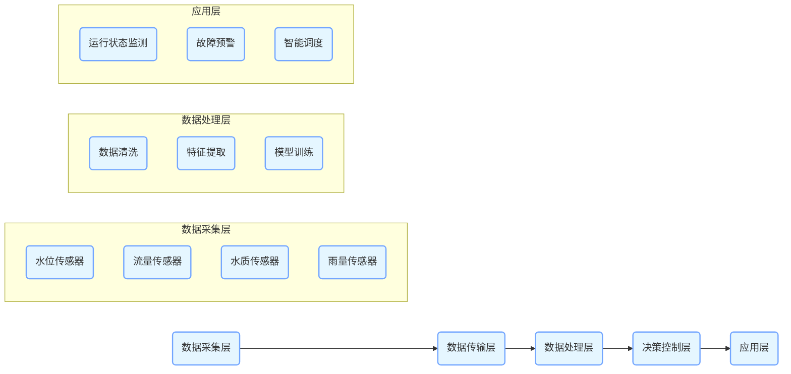

# 人工智能在智慧城市排水系统优化中的应用

> 关键词：人工智能、智慧城市、排水系统优化、数据分析、机器学习、传感器技术、物联网

> 摘要：本文聚焦于人工智能在智慧城市排水系统优化中的应用。首先介绍了相关背景，包括目的范围、预期读者等内容。接着阐述了核心概念与联系，深入剖析了人工智能与排水系统的关联及原理架构。详细讲解了核心算法原理及具体操作步骤，用 Python 代码进行了说明。同时给出了相关数学模型和公式并举例。通过项目实战展示了代码实现及解读，探讨了实际应用场景。推荐了相关学习资源、开发工具框架和论文著作。最后总结了未来发展趋势与挑战，并提供了常见问题解答及参考资料，旨在全面呈现人工智能在智慧城市排水系统优化中的应用全貌。

## 1. 背景介绍 
### 1.1 目的和范围
智慧城市的建设是当今城市发展的重要方向，排水系统作为城市基础设施的关键组成部分，其高效运行对于城市的正常运转和居民的生活质量至关重要。传统的排水系统管理方式往往依赖于经验和人工监测，难以应对复杂多变的城市环境和极端天气情况。本文章的目的在于探讨如何利用人工智能技术来优化智慧城市的排水系统，提高排水系统的运行效率、降低洪涝灾害风险、实现水资源的合理利用。

范围涵盖了人工智能在排水系统的数据采集、分析、预测、决策和控制等各个环节的应用，涉及到传感器技术、物联网、机器学习、深度学习等多种人工智能相关技术。

### 1.2 预期读者
本文预期读者包括城市规划者、排水系统工程师、人工智能研究人员、相关领域的学者以及对智慧城市建设和排水系统优化感兴趣的专业人士。对于城市规划者，可以帮助他们在城市规划中更好地融入人工智能技术，提升排水系统的设计水平；排水系统工程师可以学习如何利用人工智能改进现有排水系统的运行管理；人工智能研究人员可以从排水系统优化这个具体应用场景中获取研究灵感；学者可以在相关学术研究中参考本文的内容；普通专业人士可以增进对智慧城市和人工智能应用的了解。

### 1.3 文档结构概述
本文将按照以下结构展开：首先介绍背景信息，让读者了解研究的目的、范围、预期读者等。接着阐述核心概念与联系，明确人工智能与智慧城市排水系统相关概念及它们之间的关系。然后详细讲解核心算法原理及具体操作步骤，通过 Python 代码进行演示。随后给出数学模型和公式，并举例说明。在项目实战部分，展示代码实际案例并进行详细解释。探讨实际应用场景，说明人工智能在不同场景下的应用方式。推荐相关的工具和资源，包括学习资源、开发工具框架和论文著作。最后总结未来发展趋势与挑战，提供常见问题解答及参考资料。

### 1.4 术语表
#### 1.4.1 核心术语定义
- **人工智能（Artificial Intelligence，AI）**：指机器所表现出来的智能，通常是通过计算机程序实现，能够模拟人类的认知和决策过程。
- **智慧城市（Smart City）**：利用信息技术和通信技术手段感测、分析、整合城市运行核心系统的各项关键信息，从而对包括民生、环保、公共安全、城市服务、工商业活动在内的各种需求做出智能响应的城市形态。
- **排水系统（Drainage System）**：由排水管网、泵站、污水处理厂等设施组成，用于收集、输送、处理和排放城市污水和雨水的系统。
- **机器学习（Machine Learning，ML）**：人工智能的一个分支，它使计算机能够从数据中学习模式和规律，而无需明确的编程指令。
- **深度学习（Deep Learning，DL）**：一种基于人工神经网络的机器学习技术，通过构建多层神经网络来学习数据的复杂特征和模式。

#### 1.4.2 相关概念解释
- **物联网（Internet of Things，IoT）**：通过各种信息传感器、射频识别技术、全球定位系统、红外感应器、激光扫描器等各种装置与技术，实时采集任何需要监控、 连接、互动的物体或过程，采集其声、光、热、电、力学、化学、生物、位置等各种需要的信息，通过各类可能的网络接入，实现物与物、物与人的泛在连接，实现对物品和过程的智能化感知、识别和管理。在智慧城市排水系统中，物联网技术用于连接各种传感器，实现数据的实时传输和共享。
- **传感器技术（Sensor Technology）**：利用各种传感器设备获取物理、化学、生物等信息的技术。在排水系统中，传感器可以监测水位、流量、水质等参数，为人工智能分析提供数据支持。

#### 1.4.3 缩略词列表
- **AI**：Artificial Intelligence（人工智能）
- **ML**：Machine Learning（机器学习）
- **DL**：Deep Learning（深度学习）
- **IoT**：Internet of Things（物联网）

## 2. 核心概念与联系 

### 人工智能与智慧城市排水系统的关联
人工智能在智慧城市排水系统优化中起着至关重要的作用。通过物联网技术，排水系统中的各种传感器实时收集水位、流量、水质等数据。这些数据传输到数据中心后，人工智能算法可以对其进行分析和处理。例如，机器学习算法可以学习历史数据中的模式和规律，预测未来的水位变化、降雨量等情况。深度学习算法可以处理复杂的图像和视频数据，如监测排水管道的堵塞情况。基于这些分析和预测结果，人工智能可以辅助决策，优化排水系统的运行策略，如调整泵站的运行参数、控制排水阀门的开关等。

### 核心概念原理和架构的文本示意图
人工智能在智慧城市排水系统优化中的应用架构主要包括数据采集层、数据传输层、数据处理层、决策控制层和应用层。

- **数据采集层**：由各种传感器组成，如水位传感器、流量传感器、水质传感器、雨量传感器等，负责实时采集排水系统的相关数据。
- **数据传输层**：通过物联网技术，将数据采集层采集到的数据传输到数据中心。可以采用有线或无线通信方式，如以太网、Wi-Fi、LoRa、4G/5G 等。
- **数据处理层**：利用人工智能算法对采集到的数据进行分析和处理。包括数据清洗、特征提取、模型训练等步骤。可以使用机器学习算法，如线性回归、决策树、支持向量机等，也可以使用深度学习算法，如卷积神经网络（CNN）、循环神经网络（RNN）等。
- **决策控制层**：根据数据处理层的分析结果，生成相应的决策和控制指令。例如，当预测到水位将超过警戒值时，自动启动泵站进行排水；当检测到排水管道堵塞时，及时通知维修人员进行处理。
- **应用层**：为用户提供各种应用服务，如排水系统运行状态监测、故障预警、智能调度等。用户可以通过手机应用、网页等方式访问这些服务。

### Mermaid 流程图


## 3. 核心算法原理 & 具体操作步骤 

### 核心算法原理
在智慧城市排水系统优化中，常用的人工智能算法包括机器学习算法和深度学习算法。下面以线性回归算法为例，介绍其原理。

线性回归是一种用于建立自变量和因变量之间线性关系的统计模型。假设我们有一组数据集 $\{(x_1, y_1), (x_2, y_2), \cdots, (x_n, y_n)\}$，其中 $x_i$ 是自变量，$y_i$ 是因变量。线性回归模型的目标是找到一条直线 $y = \theta_0 + \theta_1x$，使得预测值 $\hat{y}_i$ 与真实值 $y_i$ 之间的误差最小。误差通常用均方误差（Mean Squared Error，MSE）来衡量，其公式为：

$$MSE = \frac{1}{n} \sum_{i=1}^{n} (y_i - \hat{y}_i)^2 = \frac{1}{n} \sum_{i=1}^{n} (y_i - (\theta_0 + \theta_1x_i))^2$$

为了找到最优的 $\theta_0$ 和 $\theta_1$，可以使用最小二乘法或梯度下降法。最小二乘法通过求解偏导数为零的方程组来得到最优解；梯度下降法通过迭代更新 $\theta_0$ 和 $\theta_1$ 的值，使得 MSE 逐渐减小。

### 具体操作步骤及 Python 源代码
以下是使用 Python 和 Scikit-learn 库实现线性回归的具体步骤和代码：

```python
# 步骤 1: 导入必要的库
import numpy as np
from sklearn.linear_model import LinearRegression
from sklearn.model_selection import train_test_split
from sklearn.metrics import mean_squared_error
import matplotlib.pyplot as plt

# 步骤 2: 生成示例数据
# 假设我们要预测排水流量（y）与降雨量（x）之间的关系
np.random.seed(0)
x = np.random.rand(100, 1) * 10  # 降雨量数据
y = 2 * x + 1 + np.random.randn(100, 1)  # 排水流量数据，加入一些噪声

# 步骤 3: 划分训练集和测试集
x_train, x_test, y_train, y_test = train_test_split(x, y, test_size=0.2, random_state=42)

# 步骤 4: 创建线性回归模型
model = LinearRegression()

# 步骤 5: 训练模型
model.fit(x_train, y_train)

# 步骤 6: 进行预测
y_pred = model.predict(x_test)

# 步骤 7: 评估模型
mse = mean_squared_error(y_test, y_pred)
print(f"均方误差 (MSE): {mse}")

# 步骤 8: 可视化结果
plt.scatter(x_test, y_test, color='blue', label='实际值')
plt.plot(x_test, y_pred, color='red', linewidth=2, label='预测值')
plt.xlabel('降雨量')
plt.ylabel('排水流量')
plt.title('线性回归预测排水流量与降雨量的关系')
plt.legend()
plt.show()
```

### 代码解释
1. **导入必要的库**：导入了 `numpy` 用于数值计算，`sklearn.linear_model` 中的 `LinearRegression` 用于创建线性回归模型，`sklearn.model_selection` 中的 `train_test_split` 用于划分训练集和测试集，`sklearn.metrics` 中的 `mean_squared_error` 用于评估模型，`matplotlib.pyplot` 用于可视化结果。
2. **生成示例数据**：使用 `numpy` 生成了 100 个降雨量数据和对应的排水流量数据，并加入了一些噪声。
3. **划分训练集和测试集**：使用 `train_test_split` 函数将数据划分为训练集和测试集，其中测试集占 20%。
4. **创建线性回归模型**：使用 `LinearRegression` 类创建了一个线性回归模型。
5. **训练模型**：使用 `fit` 方法对模型进行训练，将训练集的输入特征 `x_train` 和目标值 `y_train` 作为参数传入。
6. **进行预测**：使用 `predict` 方法对测试集的输入特征 `x_test` 进行预测，得到预测值 `y_pred`。
7. **评估模型**：使用 `mean_squared_error` 函数计算预测值和真实值之间的均方误差。
8. **可视化结果**：使用 `matplotlib` 绘制散点图和直线图，展示实际值和预测值之间的关系。

## 4. 数学模型和公式 & 详细讲解 & 举例说明 

### 线性回归数学模型和公式
线性回归的数学模型可以表示为：

$$y = \theta_0 + \theta_1x_1 + \theta_2x_2 + \cdots + \theta_nx_n + \epsilon$$

其中，$y$ 是因变量，$x_1, x_2, \cdots, x_n$ 是自变量，$\theta_0, \theta_1, \cdots, \theta_n$ 是模型的参数，$\epsilon$ 是误差项，通常假设 $\epsilon$ 服从均值为 0 的正态分布。

在简单线性回归中，只有一个自变量，即 $n = 1$，模型可以简化为：

$$y = \theta_0 + \theta_1x + \epsilon$$

### 最小二乘法求解参数
最小二乘法的目标是使预测值 $\hat{y}$ 与真实值 $y$ 之间的误差平方和最小。误差平方和可以表示为：

$$S(\theta_0, \theta_1) = \sum_{i=1}^{m} (y_i - (\theta_0 + \theta_1x_i))^2$$

为了找到使 $S(\theta_0, \theta_1)$ 最小的 $\theta_0$ 和 $\theta_1$，分别对 $\theta_0$ 和 $\theta_1$ 求偏导数，并令偏导数为 0：

$$\frac{\partial S}{\partial \theta_0} = -2 \sum_{i=1}^{m} (y_i - (\theta_0 + \theta_1x_i)) = 0$$

$$\frac{\partial S}{\partial \theta_1} = -2 \sum_{i=1}^{m} x_i(y_i - (\theta_0 + \theta_1x_i)) = 0$$

解上述方程组，可以得到 $\theta_0$ 和 $\theta_1$ 的最优解：

$$\theta_1 = \frac{\sum_{i=1}^{m} (x_i - \bar{x})(y_i - \bar{y})}{\sum_{i=1}^{m} (x_i - \bar{x})^2}$$

$$\theta_0 = \bar{y} - \theta_1\bar{x}$$

其中，$\bar{x}$ 和 $\bar{y}$ 分别是 $x$ 和 $y$ 的均值。

### 举例说明
假设我们有以下数据集：

| 降雨量 $x$ | 排水流量 $y$ |
| --- | --- |
| 1 | 3 |
| 2 | 5 |
| 3 | 7 |
| 4 | 9 |
| 5 | 11 |

首先计算 $x$ 和 $y$ 的均值：

$$\bar{x} = \frac{1 + 2 + 3 + 4 + 5}{5} = 3$$

$$\bar{y} = \frac{3 + 5 + 7 + 9 + 11}{5} = 7$$

然后计算 $\theta_1$：

$$\sum_{i=1}^{5} (x_i - \bar{x})(y_i - \bar{y}) = (1 - 3)(3 - 7) + (2 - 3)(5 - 7) + (3 - 3)(7 - 7) + (4 - 3)(9 - 7) + (5 - 3)(11 - 7) = 20$$

$$\sum_{i=1}^{5} (x_i - \bar{x})^2 = (1 - 3)^2 + (2 - 3)^2 + (3 - 3)^2 + (4 - 3)^2 + (5 - 3)^2 = 10$$

$$\theta_1 = \frac{20}{10} = 2$$

最后计算 $\theta_0$：

$$\theta_0 = \bar{y} - \theta_1\bar{x} = 7 - 2 \times 3 = 1$$

所以，线性回归模型为 $y = 1 + 2x$。

## 5. 项目实战：代码实际案例和详细解释说明 

### 5.1  开发环境搭建
在进行智慧城市排水系统优化的项目实战之前，需要搭建相应的开发环境。以下是具体步骤：

#### 硬件环境
- **服务器**：选择一台性能稳定的服务器，如阿里云、腾讯云等云服务器，或者使用本地服务器。服务器的配置根据项目的规模和需求进行选择，建议至少具备 4 核 CPU、8GB 内存和 100GB 硬盘空间。
- **传感器设备**：购买水位传感器、流量传感器、水质传感器、雨量传感器等设备，并进行安装和调试。确保传感器能够正常采集数据，并通过物联网网关将数据传输到服务器。

#### 软件环境
- **操作系统**：选择 Linux 操作系统，如 Ubuntu、CentOS 等。
- **编程语言**：选择 Python 作为主要的编程语言，Python 具有丰富的科学计算库和机器学习库，如 `numpy`、`pandas`、`scikit-learn`、`tensorflow` 等。
- **数据库**：选择 MySQL 或 PostgreSQL 作为数据库，用于存储传感器采集到的数据和模型训练的结果。
- **开发工具**：选择 PyCharm 或 Jupyter Notebook 作为开发工具，方便编写和调试代码。

### 5.2  源代码详细实现和代码解读
以下是