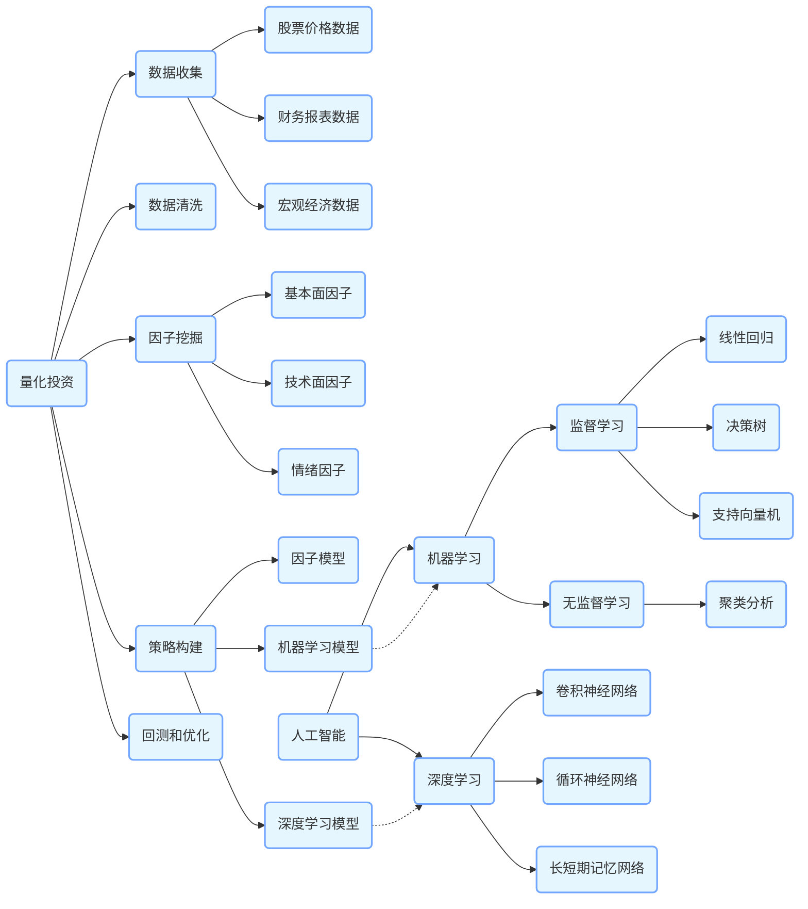

# 人工智能在量化投资中的应用与挑战

> 关键词：人工智能、量化投资、机器学习、深度学习、应用挑战

> 摘要：本文深入探讨了人工智能在量化投资领域的应用与挑战。首先介绍了量化投资和人工智能的背景知识，包括目的、预期读者、文档结构和相关术语。接着阐述了人工智能与量化投资相关的核心概念及联系，给出了原理和架构的示意图与流程图。详细讲解了核心算法原理及操作步骤，并结合 Python 代码进行说明，同时介绍了相关的数学模型和公式。通过项目实战，展示了代码的实际案例和详细解释。分析了人工智能在量化投资中的实际应用场景，推荐了学习资源、开发工具框架和相关论文著作。最后总结了未来发展趋势与挑战，提供了常见问题解答和扩展阅读参考资料，旨在为读者全面呈现人工智能在量化投资领域的全貌。

## 1. 背景介绍 
### 1.1 目的和范围
量化投资是利用数学、统计学和计算机技术来进行投资决策的方法，旨在通过系统化的策略获取稳定的投资回报。而人工智能技术的发展为量化投资带来了新的机遇和挑战。本文的目的是深入探讨人工智能在量化投资中的应用方式、核心算法、实际案例以及面临的挑战，帮助读者全面了解这一领域的发展现状和未来趋势。范围涵盖了人工智能的主要技术，如机器学习、深度学习等在量化投资策略构建、风险评估、资产定价等方面的应用。

### 1.2 预期读者
本文预期读者包括金融行业从业者，如量化分析师、投资经理等，他们希望借助人工智能技术提升投资决策的效率和准确性；计算机科学领域的专业人士，对将人工智能技术应用于金融领域感兴趣；以及对量化投资和人工智能交叉领域有学习需求的学生和研究人员。

### 1.3 文档结构概述
本文首先介绍量化投资和人工智能相关的背景知识，包括术语定义和概念解释。然后阐述人工智能与量化投资的核心概念及联系，给出原理和架构的示意图与流程图。接着详细讲解核心算法原理及操作步骤，结合 Python 代码进行说明，并介绍相关的数学模型和公式。通过项目实战展示代码的实际案例和详细解释。分析人工智能在量化投资中的实际应用场景，推荐学习资源、开发工具框架和相关论文著作。最后总结未来发展趋势与挑战，提供常见问题解答和扩展阅读参考资料。

### 1.4 术语表
#### 1.4.1 核心术语定义
- **量化投资**：通过数学模型和计算机算法，对海量的金融数据进行分析和处理，以制定投资策略的一种投资方式。
- **人工智能**：研究如何使计算机系统能够模拟人类智能的学科和技术，包括机器学习、深度学习、自然语言处理等多个领域。
- **机器学习**：让计算机通过数据学习模式和规律，从而进行预测和决策的技术，常见的算法有线性回归、决策树、支持向量机等。
- **深度学习**：机器学习的一个分支，使用多层神经网络来学习数据的复杂特征和模式，在图像识别、语音识别等领域取得了显著成果。
- **因子模型**：量化投资中常用的模型，通过分析各种影响资产价格的因素（因子）来构建投资组合。

#### 1.4.2 相关概念解释
- **数据挖掘**：从大量的数据中发现有价值的信息和模式的过程，在量化投资中用于挖掘潜在的投资机会。
- **风险评估**：对投资过程中可能面临的风险进行评估和度量，以便采取相应的风险管理措施。
- **资产定价**：确定资产的合理价格，是量化投资中的重要环节。

#### 1.4.3 缩略词列表
- **ML**：Machine Learning，机器学习
- **DL**：Deep Learning，深度学习
- **SVM**：Support Vector Machine，支持向量机
- **LSTM**：Long Short-Term Memory，长短期记忆网络

## 2. 核心概念与联系 

### 2.1 量化投资的核心概念
量化投资的核心在于通过数据驱动的方式构建投资策略。其基本流程包括数据收集、数据清洗、因子挖掘、策略构建、回测和优化等步骤。数据收集是获取各种金融数据，如股票价格、财务报表、宏观经济数据等。数据清洗是对收集到的数据进行预处理，去除噪声和异常值。因子挖掘是寻找影响资产价格的因素，如市盈率、市净率等。策略构建是根据挖掘到的因子构建投资组合，回测是使用历史数据对策略进行验证，优化是对策略进行调整以提高其性能。

### 2.2 人工智能的核心概念
人工智能包括多个领域，其中机器学习和深度学习在量化投资中应用广泛。机器学习通过对数据的学习，建立模型来进行预测和决策。常见的机器学习算法有监督学习和无监督学习。监督学习是在有标签的数据上进行学习，如线性回归、决策树等，用于预测资产价格等；无监督学习是在无标签的数据上进行学习，如聚类分析，用于对资产进行分类。深度学习使用多层神经网络来学习数据的复杂特征和模式，能够处理大规模和高维度的数据，如卷积神经网络（CNN）和循环神经网络（RNN）等。

### 2.3 人工智能与量化投资的联系
人工智能为量化投资提供了更强大的工具和方法。机器学习和深度学习可以处理海量的金融数据，挖掘更复杂的因子和模式，提高投资策略的准确性和稳定性。例如，深度学习可以自动提取金融文本数据中的情感信息，用于预测市场走势。同时，量化投资为人工智能提供了丰富的应用场景和数据，促进了人工智能技术的发展和创新。

### 2.4 核心概念原理和架构的文本示意图
```plaintext
量化投资
|-- 数据收集
|   |-- 股票价格数据
|   |-- 财务报表数据
|   |-- 宏观经济数据
|-- 数据清洗
|-- 因子挖掘
|   |-- 基本面因子
|   |-- 技术面因子
|   |-- 情绪因子
|-- 策略构建
|   |-- 因子模型
|   |-- 机器学习模型
|   |-- 深度学习模型
|-- 回测和优化

人工智能
|-- 机器学习
|   |-- 监督学习
|   |   |-- 线性回归
|   |   |-- 决策树
|   |   |-- 支持向量机
|   |-- 无监督学习
|   |   |-- 聚类分析
|-- 深度学习
|   |-- 卷积神经网络
|   |-- 循环神经网络
|   |-- 长短期记忆网络
```

### 2.5 Mermaid 流程图


## 3. 核心算法原理 & 具体操作步骤 

### 3.1 线性回归算法原理
线性回归是一种简单而常用的机器学习算法，用于建立自变量和因变量之间的线性关系。假设我们有一组自变量 $X = [x_1, x_2,..., x_n]$ 和因变量 $y$，线性回归模型可以表示为：
$$y = \theta_0 + \theta_1x_1 + \theta_2x_2 +... + \theta_nx_n + \epsilon$$
其中，$\theta_0, \theta_1,..., \theta_n$ 是模型的参数，$\epsilon$ 是误差项。线性回归的目标是找到一组最优的参数 $\theta$，使得预测值 $\hat{y}$ 与真实值 $y$ 之间的误差最小。常用的误差度量方法是均方误差（MSE）：
$$MSE = \frac{1}{m} \sum_{i=1}^{m} (y^{(i)} - \hat{y}^{(i)})^2$$
其中，$m$ 是样本数量，$y^{(i)}$ 是第 $i$ 个样本的真实值，$\hat{y}^{(i)}$ 是第 $i$ 个样本的预测值。

### 3.2 线性回归算法的 Python 实现
```python
import numpy as np
from sklearn.linear_model import LinearRegression

# 生成一些示例数据
X = np.array([[1], [2], [3], [4], [5]])
y = np.array([2, 4, 6, 8, 10])

# 创建线性回归模型
model = LinearRegression()

# 训练模型
model.fit(X, y)

# 预测新数据
new_X = np.array([[6]])
prediction = model.predict(new_X)

print("预测值:", prediction)
```
### 3.3 决策树算法原理
决策树是一种基于树结构进行决策的机器学习算法。它通过对数据的特征进行划分，构建一个树形结构，每个内部节点表示一个特征上的测试，每个分支表示测试输出，每个叶节点表示一个类别或值。决策树的构建过程通常采用贪心算法，每次选择最优的特征进行划分，以最大化信息增益或基尼指数等指标。

### 3.4 决策树算法的 Python 实现
```python
from sklearn.datasets import load_iris
from sklearn.tree import DecisionTreeClassifier
from sklearn.model_selection import train_test_split
from sklearn.metrics import accuracy_score

# 加载鸢尾花数据集
iris = load_iris()
X = iris.data
y = iris.target

# 划分训练集和测试集
X_train, X_test, y_train, y_test = train_test_split(X, y, test_size=0.2, random_state=42)

# 创建决策树模型
model = DecisionTreeClassifier()

# 训练模型
model.fit(X_train, y_train)

# 预测测试集
y_pred = model.predict(X_test)

# 计算准确率
accuracy = accuracy_score(y_test, y_pred)
print("准确率:", accuracy)
```
### 3.5 具体操作步骤
在量化投资中应用这些算法的具体操作步骤如下：
1. **数据准备**：收集和整理金融数据，进行数据清洗和特征工程，将数据转换为适合模型输入的格式。
2. **模型选择**：根据问题的特点和数据的情况，选择合适的机器学习或深度学习模型，如线性回归、决策树、神经网络等。
3. **模型训练**：使用训练数据对模型进行训练，调整模型的参数以最小化损失函数。
4. **模型评估**：使用测试数据对训练好的模型进行评估，计算评估指标，如准确率、均方误差等，评估模型的性能。
5. **策略构建**：根据模型的预测结果，构建投资策略，如买入、卖出信号等。
6. **回测和优化**：使用历史数据对投资策略进行回测，评估策略的性能，并根据回测结果对策略进行优化。

## 4. 数学模型和公式 & 详细讲解 & 举例说明 

### 4.1 因子模型
因子模型是量化投资中常用的数学模型，用于解释资产收益率的变化。单因子模型可以表示为：
$$R_i = \alpha_i + \beta_iF + \epsilon_i$$
其中，$R_i$ 是资产 $i$ 的收益率，$\alpha_i$ 是资产 $i$ 的超额收益率，$\beta_i$ 是资产 $i$ 对因子 $F$ 的敏感度，$F$ 是因子收益率，$\epsilon_i$ 是资产 $i$ 的特异收益率。

多因子模型则考虑多个因子的影响：
$$R_i = \alpha_i + \beta_{i1}F_1 + \beta_{i2}F_2 +... + \beta_{in}F_n + \epsilon_i$$
其中，$F_1, F_2,..., F_n$ 是不同的因子收益率，$\beta_{i1}, \beta_{i2},..., \beta_{in}$ 是资产 $i$ 对不同因子的敏感度。

例如，在 Fama - French 三因子模型中，考虑了市场因子、市值因子和账面市值比因子：
$$R_i - R_f = \alpha_i + \beta_{iM}(R_M - R_f) + \beta_{iSMB}SMB + \beta_{iHML}HML + \epsilon_i$$
其中，$R_i$ 是资产 $i$ 的收益率，$R_f$ 是无风险收益率，$R_M$ 是市场收益率，$SMB$ 是小市值组合与大市值组合的收益率之差，$HML$ 是高账面市值比组合与低账面市值比组合的收益率之差。

### 4.2 风险度量模型
在量化投资中，常用的风险度量指标是方差和标准差。资产组合的方差可以表示为：
$$\sigma_p^2 = \sum_{i=1}^{n} \sum_{j=1}^{n} w_iw_j\sigma_{ij}$$
其中，$\sigma_p^2$ 是资产组合的方差，$w_i$ 和 $w_j$ 分别是资产 $i$ 和资产 $j$ 在组合中的权重，$\sigma_{ij}$ 是资产 $i$ 和资产 $j$ 的协方差。

标准差 $\sigma_p$ 是方差的平方根，用于衡量资产组合的风险程度。

例如，假设有两个资产 $A$ 和 $B$，它们的收益率分别为 $R_A$ 和 $R_B$，权重分别为 $w_A$ 和 $w_B$，协方差为 $\sigma_{AB}$，则资产组合的方差为：
$$\sigma_p^2 = w_A^2\sigma_A^2 + w_B^2\sigma_B^2 + 2w_Aw_B\sigma_{AB}$$

### 4.3 优化模型
在量化投资中，常使用优化模型来确定资产组合的最优权重。例如，均值 - 方差优化模型的目标是在给定预期收益率的情况下，最小化资产组合的方差。其数学表达式为：
$$\min_{w} \sigma_p^2 = \sum_{i=1}^{n} \sum_{j=1}^{n} w_iw_j\sigma_{ij}$$
$$s.t. \quad \sum_{i=1}^{n} w_i = 1$$
$$\sum_{i=1}^{n} w_iE(R_i) = E(R_p)$$
其中，$E(R_i)$ 是资产 $i$ 的预期收益率，$E(R_p)$ 是资产组合的预期收益率。

例如，使用 Python 的 `cvxpy` 库可以实现均值 - 方差优化：
```python
import cvxpy as cp
import numpy as np

# 假设有三个资产，预期收益率和协方差矩阵
expected_returns = np.array([0.1, 0.15, 0.2])
cov_matrix = np.array([[0.1, 0.05, 0.03],
                       [0.05, 0.12, 0.06],
                       [0.03, 0.06, 0.15]])

# 目标预期收益率
target_return = 0.12

# 资产数量
n = len(expected_returns)

# 定义变量
weights = cp.Variable(n)

# 定义目标函数
portfolio_variance = cp.quad_form(weights, cov_matrix)

# 定义约束条件
constraints = [cp.sum(weights) == 1,
               weights >= 0,
               weights @ expected_returns == target_return]

# 定义问题
prob = cp.Problem(cp.Minimize(portfolio_variance), constraints)

# 求解问题
prob.solve()

# 输出最优权重
print("最优权重:", weights.value)
```

## 5. 项目实战：代码实际案例和详细解释说明 

### 5.1  开发环境搭建
在进行量化投资项目实战时，需要搭建相应的开发环境。以下是具体步骤：
1. **安装 Python**：建议使用 Python 3.7 及以上版本，可以从 Python 官方网站（https://www.python.org/downloads/）下载并安装。
2. **安装必要的库**：使用 `pip` 或 `conda` 安装以下常用的库：
    - `pandas`：用于数据处理和分析。
    - `numpy`：用于数值计算。
    - `scikit - learn`：用于机器学习算法。
    - `tensorflow` 或 `pytorch`：用于深度学习。
    - `yfinance`：用于获取金融数据。

例如，使用 `pip` 安装这些库的命令如下：
```sh
pip install pandas numpy scikit-learn tensorflow yfinance
```

### 5.2  源代码详细实现和代码解读
以下是一个使用线性回归模型进行股票价格预测的示例代码：
```python
import yfinance as yf
import pandas as pd
import numpy as np
from sklearn.linear_model import LinearRegression
from sklearn.model_selection import train_test_split
import matplotlib.pyplot as plt

# 下载股票数据
stock_symbol = 'AAPL'
start_date = '2020-01-01'
end_date = '2023-01-01'
data = yf.download(stock_symbol, start=start_date, end=end_date)

# 提取特征和目标变量
X = data[['Open', 'High', 'Low', 'Volume']]
y = data['Close']

# 划分训练集和测试集
X_train, X_test, y_train, y_test = train_test_split(X, y, test_size=0.2, random_state=42)

# 创建线性回归模型
model = LinearRegression()

# 训练模型
model.fit(X_train, y_train)

# 预测测试集
y_pred = model.predict(X_test)

# 可视化预测结果
plt.figure(figsize=(10, 6))
plt.plot(y_test.index, y_test.values, label='Actual Price')
plt.plot(y_test.index, y_pred, label='Predicted Price')
plt.title(f'{stock_symbol} Stock Price Prediction')
plt.xlabel('Date')
plt.ylabel('Price')
plt.legend()
plt.show()
```
### 代码解读：
1. **数据下载**：使用 `yfinance` 库下载苹果公司（AAPL）从 2020 年 1 月 1 日到 2023 年 1 月 1 日的股票数据。
2. **特征提取**：选择开盘价、最高价、最低价和成交量作为特征变量，收盘价作为目标变量。
3. **数据划分**：使用 `train_test_split` 函数将数据划分为训练集和测试集，测试集占比 20%。
4. **模型创建和训练**：创建线性回归模型，并使用训练集数据进行训练。
5. **预测和可视化**：使用训练好的模型对测试集进行预测，并将实际价格和预测价格进行可视化展示。

### 5.3  代码解读与分析
从代码的运行结果可以看出，线性回归模型对股票价格进行了一定程度的预测。然而，股票价格的变化受到多种因素的影响，是一个复杂的非线性过程，线性回归模型可能无法捕捉到所有的信息。因此，在实际应用中，可以考虑使用更复杂的机器学习或深度学习模型，如决策树、神经网络等，以提高预测的准确性。

同时，需要注意数据的质量和特征的选择。在实际应用中，可能需要对数据进行更深入的清洗和预处理，选择更有代表性的特征，以提高模型的性能。

## 6. 实际应用场景 
### 6.1 投资策略构建
人工智能可以用于构建各种投资策略。例如，通过机器学习算法对历史数据进行分析，挖掘出有预测能力的因子，然后根据这些因子构建选股策略。深度学习模型可以处理更复杂的非线性关系，用于预测市场趋势和资产价格的变化，从而制定相应的投资策略。

### 6.2 风险评估与管理
人工智能可以帮助量化投资中的风险评估和管理。通过对大量的市场数据和资产信息进行分析，机器学习模型可以预测资产的风险水平，如波动率、VaR（Value at Risk）等。同时，人工智能还可以用于实时监测市场风险，及时调整投资组合，降低风险。

### 6.3 资产定价
人工智能在资产定价方面也有重要应用。传统的资产定价模型往往基于一些假设和简化，而人工智能可以通过对大量数据的学习，挖掘出更复杂的资产价格影响因素，从而提高资产定价的准确性。例如，深度学习模型可以处理文本数据，如新闻报道、社交媒体信息等，从中提取情感信息，用于资产定价。

### 6.4 高频交易
在高频交易领域，人工智能可以发挥重要作用。高频交易需要快速处理大量的市场数据，并在短时间内做出交易决策。机器学习和深度学习算法可以实时分析市场数据，识别交易机会，实现自动化的高频交易。

## 7. 工具和资源推荐
### 7.1 学习资源推荐
#### 7.1.1 书籍推荐
- 《量化投资：策略与技术》：全面介绍了量化投资的基本概念、策略和技术，是量化投资领域的经典教材。
- 《机器学习》：周志华教授的著作，系统地介绍了机器学习的基本理论和算法，是学习机器学习的优秀书籍。
- 《深度学习》：由 Ian Goodfellow、Yoshua Bengio 和 Aaron Courville 合著，是深度学习领域的权威教材。

#### 7.1.2 在线课程
- Coursera 上的“机器学习”课程：由 Andrew Ng 教授讲授，是学习机器学习的入门课程，内容丰富，讲解详细。
- edX 上的“深度学习专项课程”：由深度学习领域的知名学者讲授，涵盖了深度学习的多个方面，如卷积神经网络、循环神经网络等。
- 中国大学 MOOC 上的“量化投资与智能决策”课程：结合了量化投资和人工智能的知识，适合初学者学习。

#### 7.1.3 技术博客和网站
- Medium：上面有很多关于量化投资和人工智能的技术博客文章，作者来自不同的领域，分享了很多实践经验和最新研究成果。
- Towards Data Science：专注于数据科学和机器学习领域，有很多关于量化投资的技术文章和案例分析。
- 量化投资与机器学习社区：国内专注于量化投资和机器学习的社区，提供了丰富的学习资源和交流平台。

### 7.2 开发工具框架推荐
#### 7.2.1 IDE和编辑器
- PyCharm：功能强大的 Python 集成开发环境，提供了代码编辑、调试、版本控制等功能，适合专业的 Python 开发。
- Jupyter Notebook：交互式的开发环境，支持 Python、R 等多种编程语言，适合数据探索和模型开发。
- Visual Studio Code：轻量级的代码编辑器，支持多种编程语言和插件扩展，可用于量化投资项目的开发。

#### 7.2.2 调试和性能分析工具
- `pdb`：Python 自带的调试工具，可以在代码中设置断点，逐步执行代码，帮助调试程序。
- `cProfile`：Python 自带的性能分析工具，可以分析代码的运行时间和函数调用次数，找出性能瓶颈。
- TensorBoard：TensorFlow 提供的可视化工具，可以用于深度学习模型的训练过程可视化和性能分析。

#### 7.2.3 相关框架和库
- `pandas`：用于数据处理和分析的 Python 库，提供了高效的数据结构和数据操作方法。
- `numpy`：用于数值计算的 Python 库，提供了高效的数组操作和数学函数。
- `scikit - learn`：用于机器学习的 Python 库，提供了丰富的机器学习算法和工具。
- `tensorflow` 和 `pytorch`：用于深度学习的 Python 框架，提供了高效的神经网络构建和训练工具。

### 7.3 相关论文著作推荐
#### 7.3.1 经典论文
- Fama, E. F., & French, K. R. (1993). Common risk factors in the returns on stocks and bonds. *Journal of Financial Economics*, 33(1), 3-56. 这篇论文提出了 Fama - French 三因子模型，是量化投资领域的经典论文。
- Sharpe, W. F. (1964). Capital asset prices: A theory of market equilibrium under conditions of risk. *The Journal of Finance*, 19(3), 425-442. 这篇论文提出了资本资产定价模型（CAPM），是现代金融理论的重要基础。

#### 7.3.2 最新研究成果
- 在 arXiv 上可以找到很多关于量化投资和人工智能的最新研究论文，涵盖了机器学习、深度学习在量化投资中的应用、新型投资策略的研究等方面。
- 《Journal of Financial Economics》《Review of Financial Studies》等金融领域的顶级期刊也会发表一些关于量化投资和人工智能的最新研究成果。

#### 7.3.3 应用案例分析
- 一些量化投资公司的官方网站会分享他们在实际应用中使用人工智能的案例和经验，如 Renaissance Technologies 等。
- 一些金融科技会议和论坛也会有关于量化投资和人工智能应用案例的分享和讨论。

## 8. 总结：未来发展趋势与挑战
### 8.1 未来发展趋势
- **多模态数据融合**：未来，量化投资将越来越多地融合多种类型的数据，如文本数据、图像数据、音频数据等。人工智能技术可以更好地处理这些多模态数据，挖掘出更多有价值的信息，提高投资决策的准确性。
- **强化学习的应用**：强化学习在量化投资中的应用将越来越广泛。强化学习可以通过与环境的交互，不断优化投资策略，适应市场的变化。例如，使用强化学习算法进行高频交易、投资组合优化等。
- **量子计算与人工智能的结合**：随着量子计算技术的发展，量子计算与人工智能的结合将为量化投资带来新的突破。量子计算可以更快地处理大规模的数据和复杂的计算问题，提高人工智能算法的效率和性能。

### 8.2 挑战
- **数据质量和隐私问题**：量化投资依赖于大量的数据，但数据的质量和隐私问题是一个挑战。数据可能存在噪声、缺失值等问题，需要进行有效的清洗和预处理。同时，金融数据涉及到用户的隐私和敏感信息，需要采取有效的措施保护数据的安全和隐私。
- **模型可解释性**：深度学习等复杂的人工智能模型往往具有较高的预测准确性，但模型的可解释性较差。在量化投资中，投资者需要了解模型的决策过程和依据，以便做出合理的投资决策。因此，提高模型的可解释性是一个重要的挑战。
- **市场变化和适应性**：金融市场是动态变化的，投资策略需要不断适应市场的变化。人工智能模型可能在历史数据上表现良好，但在新的市场环境下可能失效。因此，如何提高模型的适应性和鲁棒性是量化投资中面临的一个挑战。

## 9. 附录：常见问题与解答
### 9.1 人工智能在量化投资中的应用是否会取代人类投资经理？
目前来看，人工智能在量化投资中的应用不会完全取代人类投资经理。虽然人工智能可以处理大量的数据和复杂的计算，提供更准确的投资决策建议，但人类投资经理具有丰富的经验、直觉和判断力，能够考虑到一些无法用数据和模型量化的因素，如市场情绪、政策变化等。因此，未来更可能是人工智能与人类投资经理相结合，发挥各自的优势。

### 9.2 如何选择适合量化投资的人工智能模型？
选择适合量化投资的人工智能模型需要考虑多个因素，如问题的特点、数据的类型和规模、模型的可解释性等。如果问题是线性的，且数据规模较小，线性回归等简单的模型可能就足够了；如果问题是非线性的，且数据规模较大，可以考虑使用深度学习模型，如神经网络。同时，还需要考虑模型的可解释性，对于一些对解释性要求较高的应用场景，决策树等可解释性较强的模型可能更合适。

### 9.3 人工智能在量化投资中的应用需要具备哪些技能和知识？
人工智能在量化投资中的应用需要具备金融知识、计算机科学知识和数学知识。金融知识包括投资理论、金融市场、风险管理等方面的知识；计算机科学知识包括编程语言（如 Python）、数据处理、机器学习和深度学习算法等；数学知识包括线性代数、概率论、统计学等。

## 10. 扩展阅读 & 参考资料
### 扩展阅读
- 《智能金融：人工智能时代的金融变革与创新》：介绍了人工智能在金融领域的广泛应用和发展趋势，包括量化投资、风险管理、金融监管等方面。
- 《算法金融：人工智能与金融科技的融合》：探讨了算法金融的概念、技术和应用，以及人工智能对金融行业的影响。

### 参考资料
- 各金融数据提供商的官方网站，如雅虎财经、东方财富等，提供了丰富的金融数据。
- 各开源库和框架的官方文档，如 `pandas`、`numpy`、`scikit - learn`、`tensorflow` 等，提供了详细的使用说明和示例代码。

作者：AI天才研究院/AI Genius Institute & 禅与计算机程序设计艺术 /Zen And The Art of Computer Programming