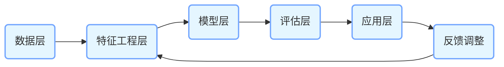

# 人工智能辅助的风险管理系统设计

> 关键词：人工智能、风险管理系统、风险评估、机器学习、深度学习

> 摘要：本文聚焦于人工智能辅助的风险管理系统设计。随着金融市场的复杂性不断增加以及各行业面临的风险种类日益繁多，传统的风险管理方法已难以满足实际需求。人工智能技术凭借其强大的数据处理和分析能力，为风险管理带来了新的解决方案。文章将深入探讨人工智能在风险管理系统中的应用，包括核心概念、算法原理、数学模型，通过项目实战展示系统的具体实现，并分析其实际应用场景，最后对未来发展趋势与挑战进行总结。

## 1. 背景介绍 
### 1.1 目的和范围
随着全球经济的快速发展和科技的不断进步，各类企业和机构面临着越来越复杂多变的风险。传统的风险管理方法主要依赖于人工经验和简单的统计模型，在处理海量数据和复杂风险关系时存在明显的局限性。本项目旨在设计一个基于人工智能的风险管理系统，利用先进的机器学习和深度学习算法，提高风险识别、评估和应对的准确性与效率。

本系统的应用范围涵盖金融、医疗、能源、制造业等多个行业，可用于信用风险评估、市场风险预警、操作风险监测等多个方面。

### 1.2 预期读者
本文的预期读者包括风险管理专业人士、人工智能研究者、金融分析师、软件开发者以及对风险管理和人工智能应用感兴趣的人员。通过阅读本文，读者可以了解人工智能在风险管理领域的应用原理、技术实现和实际案例，为其在相关领域的研究和实践提供参考。

### 1.3 文档结构概述
本文将按照以下结构进行组织：
- 核心概念与联系：介绍人工智能和风险管理的核心概念，以及它们之间的联系，并通过文本示意图和Mermaid流程图进行直观展示。
- 核心算法原理 & 具体操作步骤：详细讲解人工智能在风险管理中常用的算法原理，如决策树、神经网络等，并给出Python源代码示例。
- 数学模型和公式 & 详细讲解 & 举例说明：介绍风险管理中的数学模型和公式，如风险价值（VaR）、条件风险价值（CVaR）等，并通过具体例子进行说明。
- 项目实战：代码实际案例和详细解释说明：通过一个具体的项目实战，展示人工智能辅助的风险管理系统的开发过程，包括开发环境搭建、源代码实现和代码解读。
- 实际应用场景：分析人工智能辅助的风险管理系统在不同行业的实际应用场景。
- 工具和资源推荐：推荐学习人工智能和风险管理的相关书籍、在线课程、技术博客和网站，以及开发工具、框架和相关论文著作。
- 总结：未来发展趋势与挑战：对人工智能辅助的风险管理系统的未来发展趋势进行展望，并分析可能面临的挑战。
- 附录：常见问题与解答：解答读者在阅读过程中可能遇到的常见问题。
- 扩展阅读 & 参考资料：提供进一步学习和研究的扩展阅读资料和参考书目。

### 1.4 术语表
#### 1.4.1 核心术语定义
- **人工智能（Artificial Intelligence，AI）**：指计算机系统能够执行通常需要人类智能才能完成的任务，如学习、推理、解决问题等。
- **风险管理（Risk Management）**：指识别、评估和应对风险的过程，旨在降低风险对组织目标的影响。
- **机器学习（Machine Learning，ML）**：人工智能的一个分支，研究计算机如何通过数据学习模式和规律，从而进行预测和决策。
- **深度学习（Deep Learning，DL）**：机器学习的一个子领域，基于人工神经网络，通过多层神经网络自动学习数据的特征表示。
- **风险评估（Risk Assessment）**：对风险的可能性和影响程度进行评估的过程。
- **风险预警（Risk Early Warning）**：通过对风险因素的监测和分析，提前发出风险信号的过程。

#### 1.4.2 相关概念解释
- **特征工程（Feature Engineering）**：指从原始数据中提取和选择有用的特征，以提高机器学习模型的性能。
- **模型训练（Model Training）**：使用训练数据对机器学习模型进行参数调整的过程。
- **模型评估（Model Evaluation）**：使用测试数据对训练好的机器学习模型进行性能评估的过程。
- **过拟合（Overfitting）**：指机器学习模型在训练数据上表现良好，但在测试数据上表现不佳的现象。
- **欠拟合（Underfitting）**：指机器学习模型在训练数据和测试数据上都表现不佳的现象。

#### 1.4.3 缩略词列表
- **AI**：Artificial Intelligence
- **ML**：Machine Learning
- **DL**：Deep Learning
- **VaR**：Value at Risk
- **CVaR**：Conditional Value at Risk

## 2. 核心概念与联系 

### 核心概念原理
#### 人工智能
人工智能是让计算机模拟人类智能的技术，它包含多个子领域，如机器学习、自然语言处理、计算机视觉等。在风险管理系统中，主要利用机器学习和深度学习技术。机器学习通过对大量历史数据的学习，发现数据中的模式和规律，从而对未来的风险进行预测。深度学习则是通过构建多层神经网络，自动学习数据的复杂特征表示，在处理高维数据和复杂关系时具有很强的优势。

#### 风险管理
风险管理是一个系统性的过程，包括风险识别、风险评估、风险应对和风险监控四个主要环节。风险识别是找出可能影响组织目标实现的风险因素；风险评估是对识别出的风险进行量化分析，评估其发生的可能性和影响程度；风险应对是根据风险评估的结果，选择合适的策略来降低风险；风险监控是对风险应对措施的执行情况进行跟踪和评估，及时调整策略。

### 架构的文本示意图
```plaintext
人工智能辅助的风险管理系统架构

数据层
|-- 历史风险数据
|-- 实时业务数据
|-- 外部市场数据

特征工程层
|-- 数据清洗
|-- 特征提取
|-- 特征选择

模型层
|-- 机器学习模型（决策树、随机森林等）
|-- 深度学习模型（神经网络、卷积神经网络等）

评估层
|-- 模型评估指标（准确率、召回率等）
|-- 风险评估指标（VaR、CVaR等）

应用层
|-- 风险预警
|-- 风险决策支持
|-- 风险报告生成
```

### Mermaid流程图


该流程图展示了人工智能辅助的风险管理系统的主要流程。数据层提供各种数据，经过特征工程层进行数据处理和特征提取，然后输入到模型层进行建模和训练。评估层对模型和风险进行评估，结果应用于应用层，如风险预警和决策支持。最后，根据应用层的反馈对系统进行调整，形成一个闭环的风险管理系统。

## 3. 核心算法原理 & 具体操作步骤 

### 决策树算法原理
决策树是一种基于树结构进行决策的机器学习算法。它通过对数据的特征进行划分，构建一棵决策树，每个内部节点表示一个特征上的测试，每个分支表示一个测试输出，每个叶节点表示一个类别或值。决策树的构建过程是一个递归的过程，每次选择一个最优的特征进行划分，直到满足停止条件。

### Python代码实现决策树算法
```python
import numpy as np
from sklearn.datasets import load_iris
from sklearn.model_selection import train_test_split
from sklearn.tree import DecisionTreeClassifier
from sklearn.metrics import accuracy_score

# 加载数据集
iris = load_iris()
X = iris.data
y = iris.target

# 划分训练集和测试集
X_train, X_test, y_train, y_test = train_test_split(X, y, test_size=0.3, random_state=42)

# 创建决策树分类器
clf = DecisionTreeClassifier()

# 训练模型
clf.fit(X_train, y_train)

# 预测
y_pred = clf.predict(X_test)

# 评估模型
accuracy = accuracy_score(y_test, y_pred)
print(f"决策树模型的准确率: {accuracy}")
```

### 具体操作步骤
1. **数据准备**：加载数据集，并将其划分为训练集和测试集。
2. **模型创建**：创建决策树分类器对象。
3. **模型训练**：使用训练集对决策树分类器进行训练。
4. **模型预测**：使用训练好的模型对测试集进行预测。
5. **模型评估**：使用评估指标（如准确率）对模型的性能进行评估。

### 神经网络算法原理
神经网络是一种模仿人类神经系统的机器学习模型，由多个神经元组成。每个神经元接收输入信号，经过加权求和和激活函数处理后输出信号。神经网络通过多层神经元的组合，可以学习到数据的复杂特征表示。在风险管理中，神经网络可以用于风险预测和分类。

### Python代码实现简单的神经网络算法
```python
import numpy as np

# 定义激活函数（sigmoid函数）
def sigmoid(x):
    return 1 / (1 + np.exp(-x))

# 定义神经网络类
class NeuralNetwork:
    def __init__(self, input_size, hidden_size, output_size):
        # 初始化权重
        self.weights_input_hidden = np.random.rand(input_size, hidden_size)
        self.weights_hidden_output = np.random.rand(hidden_size, output_size)

    def forward(self, X):
        # 前向传播
        self.hidden_input = np.dot(X, self.weights_input_hidden)
        self.hidden_output = sigmoid(self.hidden_input)
        self.final_input = np.dot(self.hidden_output, self.weights_hidden_output)
        self.final_output = sigmoid(self.final_input)
        return self.final_output

# 示例使用
input_size = 2
hidden_size = 3
output_size = 1
nn = NeuralNetwork(input_size, hidden_size, output_size)
X = np.array([[0.5, 0.3]])
output = nn.forward(X)
print(f"神经网络的输出: {output}")
```

### 具体操作步骤
1. **定义激活函数**：选择合适的激活函数，如sigmoid函数。
2. **定义神经网络类**：初始化神经网络的权重，并实现前向传播方法。
3. **创建神经网络对象**：根据输入、隐藏和输出层的大小创建神经网络对象。
4. **输入数据**：提供输入数据。
5. **前向传播**：调用神经网络的前向传播方法，得到输出结果。

## 4. 数学模型和公式 & 详细讲解 & 举例说明 

### 风险价值（VaR）
#### 公式
风险价值（Value at Risk，VaR）是一种常用的风险度量指标，它表示在一定的置信水平下，某一投资组合在未来特定时期内可能遭受的最大损失。其计算公式为：

$$P(\Delta V \leq -VaR) = 1 - c$$

其中，$\Delta V$ 表示投资组合在未来特定时期内的价值变化，$c$ 表示置信水平。

#### 详细讲解
VaR的计算基于历史数据或模拟数据。通过对历史数据进行统计分析或使用蒙特卡罗模拟等方法，得到投资组合价值变化的概率分布。然后，根据置信水平确定对应的分位数，该分位数即为VaR值。

#### 举例说明
假设某投资组合在过去1000个交易日的收益率数据已知。我们选择95%的置信水平，那么我们需要找到收益率分布的第5%分位数。假设该分位数对应的收益率为 -2%，投资组合的初始价值为100万元，则VaR值为：

$VaR = 100 \times 2\% = 2$（万元）

这意味着在95%的置信水平下，该投资组合在未来一个交易日内可能遭受的最大损失为2万元。

### 条件风险价值（CVaR）
#### 公式
条件风险价值（Conditional Value at Risk，CVaR）也称为期望损失（Expected Shortfall），它表示在损失超过VaR的条件下，损失的期望值。其计算公式为：

$$CVaR = E(\Delta V | \Delta V \leq -VaR)$$

#### 详细讲解
CVaR是对VaR的一种改进，它考虑了损失超过VaR的情况，提供了更全面的风险信息。计算CVaR需要先计算VaR，然后在损失超过VaR的样本中计算损失的期望值。

#### 举例说明
继续以上面的投资组合为例，假设在损失超过 -2%的样本中，平均收益率为 -3%，则CVaR值为：

$CVaR = 100 \times 3\% = 3$（万元）

这意味着在损失超过VaR的情况下，该投资组合的平均损失为3万元。

### 夏普比率（Sharpe Ratio）
#### 公式
夏普比率是一种衡量投资组合风险调整后收益的指标，它表示投资组合每承担一单位风险所获得的额外收益。其计算公式为：

$$Sharpe Ratio = \frac{R_p - R_f}{\sigma_p}$$

其中，$R_p$ 表示投资组合的预期收益率，$R_f$ 表示无风险收益率，$\sigma_p$ 表示投资组合的收益率标准差。

#### 详细讲解
夏普比率越高，说明投资组合在承担相同风险的情况下获得的收益越高，投资组合的绩效越好。通过计算夏普比率，可以比较不同投资组合的风险调整后收益，选择最优的投资组合。

#### 举例说明
假设某投资组合的预期收益率为10%，无风险收益率为2%，收益率标准差为15%，则夏普比率为：

$Sharpe Ratio = \frac{10\% - 2\%}{15\%} = 0.53$

这意味着该投资组合每承担一单位风险可以获得0.53单位的额外收益。

## 5. 项目实战：代码实际案例和详细解释说明 

### 5.1  开发环境搭建
#### 操作系统
建议使用Windows、Linux或macOS操作系统。

#### 编程语言和库
- **Python**：选择Python 3.7及以上版本。
- **NumPy**：用于数值计算。
- **Pandas**：用于数据处理和分析。
- **Scikit-learn**：用于机器学习模型的构建和训练。
- **TensorFlow** 或 **PyTorch**：用于深度学习模型的构建和训练。

#### 安装步骤
```bash
# 创建虚拟环境
python -m venv risk_management_env

# 激活虚拟环境
# Windows
risk_management_env\Scripts\activate
# Linux/macOS
source risk_management_env/bin/activate

# 安装所需库
pip install numpy pandas scikit-learn tensorflow
```

### 5.2  源代码详细实现和代码解读
#### 数据准备
```python
import pandas as pd
from sklearn.model_selection import train_test_split

# 读取数据
data = pd.read_csv('risk_data.csv')

# 分离特征和标签
X = data.drop('risk_label', axis=1)
y = data['risk_label']

# 划分训练集和测试集
X_train, X_test, y_train, y_test = train_test_split(X, y, test_size=0.2, random_state=42)
```
**代码解读**：首先使用Pandas库读取存储风险数据的CSV文件。然后将数据分为特征矩阵 `X` 和标签向量 `y`。最后使用 `train_test_split` 函数将数据划分为训练集和测试集，测试集占总数据的20%。

#### 模型构建和训练
```python
from sklearn.ensemble import RandomForestClassifier

# 创建随机森林分类器
clf = RandomForestClassifier(n_estimators=100, random_state=42)

# 训练模型
clf.fit(X_train, y_train)
```
**代码解读**：使用Scikit-learn库中的 `RandomForestClassifier` 类创建一个随机森林分类器，设置决策树的数量为100。然后使用训练集对模型进行训练。

#### 模型评估
```python
from sklearn.metrics import accuracy_score, precision_score, recall_score, f1_score

# 预测
y_pred = clf.predict(X_test)

# 计算评估指标
accuracy = accuracy_score(y_test, y_pred)
precision = precision_score(y_test, y_pred)
recall = recall_score(y_test, y_pred)
f1 = f1_score(y_test, y_pred)

print(f"准确率: {accuracy}")
print(f"精确率: {precision}")
print(f"召回率: {recall}")
print(f"F1分数: {f1}")
```
**代码解读**：使用训练好的模型对测试集进行预测，得到预测结果 `y_pred`。然后使用 `accuracy_score`、`precision_score`、`recall_score` 和 `f1_score` 函数计算模型的准确率、精确率、召回率和F1分数，并打印输出。

### 5.3  代码解读与分析
#### 数据准备阶段
数据准备是机器学习项目的重要基础。通过读取数据、分离特征和标签以及划分训练集和测试集，确保模型能够在不同的数据子集上进行训练和评估。合理的数据集划分可以避免过拟合和欠拟合问题，提高模型的泛化能力。

#### 模型构建和训练阶段
随机森林是一种集成学习算法，它通过组合多个决策树来提高模型的性能和稳定性。在构建随机森林分类器时，需要选择合适的参数，如决策树的数量 `n_estimators`。通过训练模型，随机森林可以学习到数据中的特征和模式，从而对新的数据进行预测。

#### 模型评估阶段
使用多种评估指标对模型进行评估可以全面了解模型的性能。准确率反映了模型预测正确的比例，精确率和召回率分别衡量了模型在正样本预测中的准确性和完整性，F1分数是精确率和召回率的调和平均值。通过综合分析这些指标，可以判断模型是否满足实际需求，并进行必要的调整和优化。

## 6. 实际应用场景 
### 金融行业
#### 信用风险评估
在金融贷款业务中，银行需要评估借款人的信用风险，以决定是否给予贷款以及确定贷款额度和利率。人工智能辅助的风险管理系统可以通过分析借款人的个人信息、信用历史、收入情况等多维度数据，使用机器学习模型预测借款人的违约概率。例如，使用逻辑回归模型对借款人的信用评分进行预测，根据评分结果进行风险分级，从而做出合理的贷款决策。

#### 市场风险预警
金融市场的价格波动频繁，投资者需要及时了解市场风险。风险管理系统可以利用深度学习模型对市场数据进行实时监测和分析，如股票价格、汇率、利率等。通过构建时间序列模型，预测市场趋势和风险变化，提前发出风险预警信号。例如，使用长短期记忆网络（LSTM）对股票价格进行预测，当预测价格出现大幅下跌的趋势时，及时提醒投资者采取风险应对措施。

### 医疗行业
#### 医疗风险预测
在医疗领域，医生需要对患者的病情进行评估和预测，以制定合理的治疗方案。人工智能辅助的风险管理系统可以分析患者的病历数据、检查报告、基因信息等，使用机器学习算法预测患者发生并发症、疾病复发等风险。例如，使用决策树模型对糖尿病患者发生心血管疾病的风险进行预测，帮助医生提前采取预防措施。

#### 医疗资源分配
医院需要合理分配医疗资源，以提高医疗服务的效率和质量。风险管理系统可以根据患者的病情严重程度、治疗需求等因素，使用优化算法对医疗资源进行分配。例如，使用线性规划模型对手术资源进行分配，确保紧急手术能够及时进行，同时提高资源的利用率。

### 能源行业
#### 能源供应风险评估
能源企业需要确保能源的稳定供应，避免因供应中断等风险对生产和生活造成影响。风险管理系统可以分析能源生产、运输、储存等环节的数据，使用概率统计模型评估能源供应风险。例如，使用蒙特卡罗模拟方法对天然气供应中断的概率和影响进行评估，制定相应的应急预案。

#### 能源价格风险管理
能源价格的波动对能源企业的经济效益有重要影响。风险管理系统可以使用时间序列分析和机器学习模型对能源价格进行预测，帮助企业制定合理的价格策略。例如，使用支持向量机（SVM）模型对石油价格进行预测，企业可以根据预测结果调整采购和销售计划，降低价格波动带来的风险。

## 7. 工具和资源推荐
### 7.1 学习资源推荐
#### 7.1.1 书籍推荐
- 《人工智能：一种现代的方法》（Artificial Intelligence: A Modern Approach）：这是一本经典的人工智能教材，全面介绍了人工智能的各个领域，包括搜索算法、知识表示、机器学习、自然语言处理等。
- 《机器学习》（Machine Learning）：由周志华教授编写，系统地介绍了机器学习的基本概念、算法和应用，适合初学者和有一定基础的读者。
- 《深度学习》（Deep Learning）：由Ian Goodfellow、Yoshua Bengio和Aaron Courville合著，是深度学习领域的权威著作，详细介绍了深度学习的理论和实践。

#### 7.1.2 在线课程
- Coursera上的“机器学习”课程：由Andrew Ng教授授课，是全球最受欢迎的机器学习课程之一，课程内容丰富，讲解深入浅出。
- edX上的“人工智能导论”课程：由伯克利大学开设，介绍了人工智能的基本概念、算法和应用，包括搜索算法、机器学习、计算机视觉等。
- 中国大学MOOC上的“深度学习基础”课程：由北京大学开设，系统地介绍了深度学习的基本原理、模型和应用，适合初学者学习。

#### 7.1.3 技术博客和网站
- Medium：是一个技术博客平台，上面有很多关于人工智能、机器学习和风险管理的优质文章。
- Towards Data Science：专注于数据科学和机器学习领域，提供了大量的技术文章、案例分析和教程。
- Kaggle：是一个数据科学竞赛平台，上面有很多关于风险管理的数据集和竞赛项目，可以通过参与竞赛来提高自己的实践能力。

### 7.2 开发工具框架推荐
#### 7.2.1 IDE和编辑器
- PyCharm：是一款专门为Python开发设计的集成开发环境（IDE），具有代码自动补全、调试、版本控制等功能，适合开发大型Python项目。
- Jupyter Notebook：是一个交互式的开发环境，支持Python、R等多种编程语言，适合进行数据探索、模型实验和可视化展示。
- Visual Studio Code：是一款轻量级的代码编辑器，支持多种编程语言和插件扩展，具有丰富的代码编辑和调试功能。

#### 7.2.2 调试和性能分析工具
- TensorBoard：是TensorFlow提供的一个可视化工具，用于监控模型的训练过程、查看模型的结构和性能指标等。
- Py-Spy：是一个Python性能分析工具，可以实时监控Python程序的CPU使用情况、函数调用时间等，帮助开发者找出性能瓶颈。
- Memory Profiler：是一个Python内存分析工具，可以分析Python程序的内存使用情况，帮助开发者优化内存使用。

#### 7.2.3 相关框架和库
- Scikit-learn：是一个常用的机器学习库，提供了丰富的机器学习算法和工具，如分类、回归、聚类等，适合初学者和快速开发。
- TensorFlow：是一个开源的深度学习框架，由Google开发，支持多种深度学习模型的构建和训练，具有高效的分布式计算能力。
- PyTorch：是另一个流行的深度学习框架，由Facebook开发，具有动态图的特点，易于使用和调试，适合研究和创新。

### 7.3 相关论文著作推荐
#### 7.3.1 经典论文
- “A Decision-Theoretic Generalization of On-Line Learning and an Application to Boosting”：介绍了AdaBoost算法的理论基础和应用，是机器学习领域的经典论文之一。
- “ImageNet Classification with Deep Convolutional Neural Networks”：提出了AlexNet模型，开启了深度学习在计算机视觉领域的新纪元。
- “Long Short-Term Memory”：介绍了长短期记忆网络（LSTM）的原理和应用，是深度学习领域的重要论文。

#### 7.3.2 最新研究成果
- 可以关注顶级学术会议如NeurIPS（神经信息处理系统大会）、ICML（国际机器学习会议）、CVPR（计算机视觉与模式识别会议）等的论文，了解人工智能和风险管理领域的最新研究进展。
- 也可以关注顶级学术期刊如Journal of Machine Learning Research（机器学习研究杂志）、Artificial Intelligence（人工智能杂志）等的文章。

#### 7.3.3 应用案例分析
- 《金融科技前沿：人工智能在金融风险管理中的应用》：介绍了人工智能在金融风险管理中的具体应用案例和实践经验。
- 《医疗大数据与人工智能》：探讨了人工智能在医疗领域的应用，包括医疗风险预测、医疗资源分配等方面的案例分析。

## 8. 总结：未来发展趋势与挑战
### 未来发展趋势
#### 融合多种人工智能技术
未来的风险管理系统将融合多种人工智能技术，如机器学习、深度学习、自然语言处理、计算机视觉等。通过综合运用这些技术，可以更全面、准确地识别和评估风险。例如，结合自然语言处理技术对新闻报道、社交媒体等文本数据进行分析，获取市场情绪和风险信息；利用计算机视觉技术对监控视频进行分析，识别潜在的安全风险。

#### 实时动态风险管理
随着数据采集和处理技术的不断发展，风险管理系统将实现实时动态风险管理。系统可以实时监测各种风险因素的变化，及时调整风险评估和应对策略。例如，在金融市场中，实时获取股票价格、交易量等数据，利用深度学习模型实时预测市场风险，及时发出预警信号。

#### 与物联网技术结合
物联网技术的发展将为风险管理带来更多的数据来源。风险管理系统可以与物联网设备连接，获取传感器数据，如温度、湿度、压力等，对设备的运行状态和环境风险进行实时监测和评估。例如，在工业生产中，通过物联网传感器监测设备的运行参数，预测设备故障的可能性，提前采取维护措施，降低生产风险。

### 挑战
#### 数据质量和安全问题
人工智能辅助的风险管理系统依赖于大量的数据进行训练和决策。数据的质量直接影响模型的性能和准确性。同时，数据的安全也是一个重要问题，风险管理系统涉及到大量的敏感信息，如个人隐私、商业机密等，需要采取有效的措施保障数据的安全。

#### 模型可解释性问题
深度学习模型等复杂的人工智能模型往往具有较高的预测准确率，但缺乏可解释性。在风险管理领域，模型的可解释性非常重要，因为决策者需要了解模型的决策依据。如何提高模型的可解释性，是未来需要解决的一个重要问题。

#### 法律法规和伦理问题
人工智能在风险管理中的应用涉及到一系列的法律法规和伦理问题。例如，模型的公平性、隐私保护、责任认定等。需要建立健全相关的法律法规和伦理准则，规范人工智能在风险管理领域的应用。

## 9. 附录：常见问题与解答
### 问题1：人工智能辅助的风险管理系统与传统风险管理方法有什么区别？
**解答**：传统风险管理方法主要依赖于人工经验和简单的统计模型，在处理海量数据和复杂风险关系时存在局限性。人工智能辅助的风险管理系统利用机器学习和深度学习算法，能够自动学习数据中的模式和规律，处理高维数据和复杂关系，提高风险识别、评估和应对的准确性与效率。

### 问题2：如何选择合适的机器学习算法用于风险管理？
**解答**：选择合适的机器学习算法需要考虑多个因素，如数据类型、问题类型、模型复杂度等。对于分类问题，可以选择决策树、随机森林、逻辑回归等算法；对于回归问题，可以选择线性回归、支持向量回归等算法；对于复杂的非线性问题，可以考虑使用深度学习算法，如神经网络。同时，还需要通过实验和评估来选择最优的算法和参数。

### 问题3：人工智能辅助的风险管理系统需要多少数据进行训练？
**解答**：所需的数据量取决于多个因素，如问题的复杂度、模型的类型和性能要求等。一般来说，数据量越大，模型的性能越好。但也需要注意数据的质量和多样性，确保数据能够代表实际情况。在实际应用中，可以通过数据增强、特征工程等方法来提高数据的利用效率。

### 问题4：如何评估人工智能辅助的风险管理系统的性能？
**解答**：可以使用多种评估指标来评估系统的性能，如准确率、精确率、召回率、F1分数、风险价值（VaR）、条件风险价值（CVaR）等。根据具体的应用场景和需求，选择合适的评估指标。同时，还可以进行交叉验证、模型对比等实验，以确保系统的性能稳定可靠。

## 10. 扩展阅读 & 参考资料
### 扩展阅读
- 《人工智能时代的风险管理》
- 《大数据与风险管理》
- 《金融科技：人工智能与区块链在金融领域的应用》

### 参考资料
- 《人工智能基础教程》
- 《机器学习实战》
- 《深度学习实战》
- 相关学术期刊和会议论文

作者：AI天才研究院/AI Genius Institute & 禅与计算机程序设计艺术 /Zen And The Art of Computer Programming