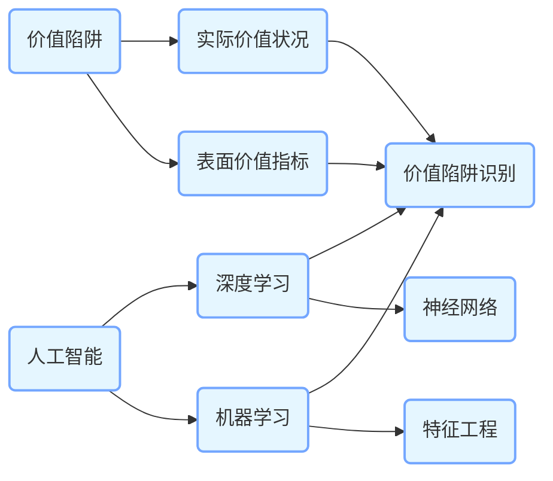

# 人工智能辅助识别价值陷阱

> 关键词：人工智能、价值陷阱、识别算法、机器学习、数据分析

> 摘要：本文围绕人工智能辅助识别价值陷阱展开深入探讨。首先介绍了研究的背景、目的、预期读者等内容，接着阐述了相关核心概念及联系，详细讲解了用于识别价值陷阱的核心算法原理与具体操作步骤，给出了对应的数学模型和公式并举例说明。通过项目实战展示了如何在实际中运用代码进行价值陷阱识别，分析了其实际应用场景。同时推荐了学习所需的工具和资源，最后总结了未来发展趋势与挑战，还提供了常见问题解答和扩展阅读参考资料，旨在为读者全面呈现利用人工智能识别价值陷阱的技术体系和应用前景。

## 1. 背景介绍 
### 1.1 目的和范围
在金融投资、商业决策等众多领域，价值陷阱是一个常见且极具挑战性的问题。价值陷阱指的是那些看似具有投资价值或商业潜力，但实际上隐藏着巨大风险，最终可能导致投资者或决策者遭受重大损失的情况。本研究的目的在于探讨如何利用人工智能技术来辅助识别这些价值陷阱，降低决策风险，提高投资和决策的准确性。

研究范围涵盖了多种可能出现价值陷阱的场景，包括股票投资、企业并购、项目投资等。同时，涉及到多种人工智能技术，如机器学习、深度学习、数据分析等在价值陷阱识别中的应用。

### 1.2 预期读者
本文预期读者包括金融投资者、企业决策者、数据科学家、人工智能研究人员以及对价值陷阱识别和人工智能应用感兴趣的相关人士。金融投资者可以借助本文了解如何运用人工智能工具优化投资决策，避免陷入价值陷阱；企业决策者能够从中获取关于商业决策中风险识别的方法和思路；数据科学家和人工智能研究人员可以深入研究相关算法和技术的应用与改进。

### 1.3 文档结构概述
本文将按照以下结构展开：首先介绍核心概念与联系，明确价值陷阱和人工智能相关技术的基本原理和相互关系；接着详细阐述核心算法原理及具体操作步骤，通过Python代码进行说明；然后给出数学模型和公式，并举例解释其在价值陷阱识别中的应用；进行项目实战，展示代码的实际案例和详细解读；分析实际应用场景；推荐学习所需的工具和资源；总结未来发展趋势与挑战；提供常见问题解答和扩展阅读参考资料。

### 1.4 术语表
#### 1.4.1 核心术语定义
- **价值陷阱**：指资产（如股票、债券、企业等）表面上具有吸引人的价值指标（如低市盈率、高股息率等），但实际上由于基本面存在严重问题，未来价值可能持续下降，导致投资者遭受损失的情况。
- **人工智能**：是一门研究如何使计算机系统能够模拟人类智能的技术领域，包括机器学习、深度学习、自然语言处理等多个子领域。
- **机器学习**：是人工智能的一个重要分支，它让计算机通过数据学习模式和规律，从而进行预测和决策，而无需明确的编程指令。
- **深度学习**：是一种基于人工神经网络的机器学习技术，通过构建多层神经网络来自动提取数据中的复杂特征。

#### 1.4.2 相关概念解释
- **特征工程**：在机器学习中，特征工程是指从原始数据中提取和转换特征的过程，目的是提高模型的性能和预测能力。
- **过拟合**：指模型在训练数据上表现良好，但在未见过的测试数据上表现不佳的现象，通常是由于模型过于复杂，过度拟合了训练数据中的噪声和异常值。
- **欠拟合**：与过拟合相反，欠拟合指模型在训练数据和测试数据上的表现都不佳，通常是由于模型过于简单，无法捕捉数据中的复杂模式。

#### 1.4.3 缩略词列表
- **AI**：Artificial Intelligence，人工智能
- **ML**：Machine Learning，机器学习
- **DL**：Deep Learning，深度学习
- **P/E**：Price-to-Earnings Ratio，市盈率
- **ROE**：Return on Equity，净资产收益率

## 2. 核心概念与联系 
### 价值陷阱的本质和特征
价值陷阱的本质在于资产的表面价值与实际价值之间存在巨大差距。从财务指标上看，价值陷阱的资产可能具有较低的市盈率、较高的股息率等看似诱人的特征，但这些指标可能是由于企业面临困境、行业竞争激烈、技术变革等原因导致的虚假信号。

例如，一家传统制造业企业可能由于市场需求下降、产能过剩等原因，导致股价下跌，市盈率降低。投资者可能被低市盈率所吸引，但忽略了企业未来业绩可能继续下滑的风险，从而陷入价值陷阱。

### 人工智能在价值陷阱识别中的作用
人工智能技术可以通过对大量数据的分析和挖掘，发现隐藏在数据中的模式和规律，从而帮助识别价值陷阱。具体来说，机器学习和深度学习算法可以处理复杂的非线性关系，对各种财务指标、市场数据、行业信息等进行综合分析，提高识别的准确性和效率。

例如，通过构建机器学习模型，可以对企业的财务报表、市场行情、行业动态等数据进行分析，预测企业未来的业绩走势，判断是否存在价值陷阱。

### 核心概念的架构示意图


## 3. 核心算法原理 & 具体操作步骤 
### 算法选择与原理
在价值陷阱识别中，我们选择逻辑回归算法作为核心算法。逻辑回归是一种常用的分类算法，它通过对输入特征进行线性组合，然后使用逻辑函数将线性组合的结果映射到[0, 1]区间，从而实现分类预测。

逻辑回归的原理基于以下假设：对于一个二分类问题，我们可以用一个线性函数来表示样本属于正类的概率。设输入特征向量为 $x = [x_1, x_2,..., x_n]$，对应的权重向量为 $w = [w_1, w_2,..., w_n]$，偏置项为 $b$，则线性组合的结果为：

$z = w_1x_1 + w_2x_2 +... + w_nx_n + b = w^Tx + b$

为了将 $z$ 映射到[0, 1]区间，我们使用逻辑函数（也称为Sigmoid函数）：

$\sigma(z) = \frac{1}{1 + e^{-z}}$

最终，样本属于正类的概率为 $P(y = 1|x) = \sigma(w^Tx + b)$，属于负类的概率为 $P(y = 0|x) = 1 - P(y = 1|x)$。

### 具体操作步骤
#### 步骤1：数据收集与预处理
首先，我们需要收集与价值陷阱相关的数据，包括企业的财务指标、市场数据、行业信息等。然后，对收集到的数据进行预处理，包括数据清洗、缺失值处理、异常值处理、特征标准化等操作。

以下是一个简单的数据预处理示例代码：
```python
import pandas as pd
from sklearn.preprocessing import StandardScaler

# 读取数据
data = pd.read_csv('value_trap_data.csv')

# 处理缺失值
data = data.dropna()

# 分离特征和标签
X = data.drop('label', axis=1)
y = data['label']

# 特征标准化
scaler = StandardScaler()
X_scaled = scaler.fit_transform(X)
```

#### 步骤2：模型训练
使用预处理后的数据对逻辑回归模型进行训练。在训练过程中，我们需要选择合适的优化算法来求解模型的参数 $w$ 和 $b$。常用的优化算法有梯度下降法、随机梯度下降法等。

以下是一个使用Python的`sklearn`库进行逻辑回归模型训练的示例代码：
```python
from sklearn.linear_model import LogisticRegression
from sklearn.model_selection import train_test_split

# 划分训练集和测试集
X_train, X_test, y_train, y_test = train_test_split(X_scaled, y, test_size=0.2, random_state=42)

# 创建逻辑回归模型
model = LogisticRegression()

# 训练模型
model.fit(X_train, y_train)
```

#### 步骤3：模型评估
使用测试集对训练好的模型进行评估，常用的评估指标包括准确率、精确率、召回率、F1值等。

以下是一个模型评估的示例代码：
```python
from sklearn.metrics import accuracy_score, precision_score, recall_score, f1_score

# 预测测试集
y_pred = model.predict(X_test)

# 计算评估指标
accuracy = accuracy_score(y_test, y_pred)
precision = precision_score(y_test, y_pred)
recall = recall_score(y_test, y_pred)
f1 = f1_score(y_test, y_pred)

print(f"Accuracy: {accuracy}")
print(f"Precision: {precision}")
print(f"Recall: {recall}")
print(f"F1 Score: {f1}")
```

#### 步骤4：模型应用
将训练好的模型应用到实际数据中，对新的样本进行价值陷阱识别。

以下是一个模型应用的示例代码：
```python
# 假设有一个新的样本
new_sample = [[1.2, 2.3, 3.4, 4.5]]

# 对新样本进行特征标准化
new_sample_scaled = scaler.transform(new_sample)

# 预测新样本
prediction = model.predict(new_sample_scaled)

print(f"Prediction: {prediction}")
```

## 4. 数学模型和公式 & 详细讲解 & 举例说明 
### 逻辑回归的数学模型
逻辑回归的数学模型可以表示为：

$P(y = 1|x) = \frac{1}{1 + e^{-(w^Tx + b)}}$

其中，$P(y = 1|x)$ 表示样本 $x$ 属于正类的概率，$w$ 是权重向量，$b$ 是偏置项。

### 损失函数
为了求解逻辑回归模型的参数 $w$ 和 $b$，我们需要定义一个损失函数。常用的损失函数是对数损失函数（也称为交叉熵损失函数）：

$L(w, b) = -\frac{1}{m}\sum_{i=1}^{m}[y^{(i)}\log(P(y^{(i)} = 1|x^{(i)})) + (1 - y^{(i)})\log(1 - P(y^{(i)} = 1|x^{(i)}))]$

其中，$m$ 是样本数量，$y^{(i)}$ 是第 $i$ 个样本的真实标签，$P(y^{(i)} = 1|x^{(i)})$ 是第 $i$ 个样本属于正类的预测概率。

### 梯度下降法求解参数
为了最小化损失函数 $L(w, b)$，我们可以使用梯度下降法。梯度下降法的基本思想是沿着损失函数的负梯度方向更新参数 $w$ 和 $b$，直到损失函数收敛。

参数更新公式如下：

$w = w - \alpha\frac{\partial L(w, b)}{\partial w}$

$b = b - \alpha\frac{\partial L(w, b)}{\partial b}$

其中，$\alpha$ 是学习率，控制参数更新的步长。

### 举例说明
假设我们有一个简单的二分类问题，输入特征向量 $x = [x_1, x_2]$，权重向量 $w = [w_1, w_2]$，偏置项 $b$。我们有两个样本：

样本1：$x^{(1)} = [1, 2]$，$y^{(1)} = 1$

样本2：$x^{(2)} = [3, 4]$，$y^{(2)} = 0$

首先，我们计算样本属于正类的概率：

$P(y^{(1)} = 1|x^{(1)}) = \frac{1}{1 + e^{-(w_1\times1 + w_2\times2 + b)}}$

$P(y^{(2)} = 1|x^{(2)}) = \frac{1}{1 + e^{-(w_1\times3 + w_2\times4 + b)}}$

然后，计算损失函数：

$L(w, b) = -\frac{1}{2}[(1\times\log(P(y^{(1)} = 1|x^{(1)})) + (1 - 1)\times\log(1 - P(y^{(1)} = 1|x^{(1)}))) + (0\times\log(P(y^{(2)} = 1|x^{(2)})) + (1 - 0)\times\log(1 - P(y^{(2)} = 1|x^{(2)})))]$

最后，使用梯度下降法更新参数 $w$ 和 $b$，直到损失函数收敛。

## 5. 项目实战：代码实际案例和详细解释说明 
### 5.1  开发环境搭建
#### 安装Python
首先，需要安装Python编程语言。建议使用Python 3.7及以上版本，可以从Python官方网站（https://www.python.org/downloads/）下载并安装。

#### 安装必要的库
在项目中，我们需要使用一些Python库，如`pandas`、`numpy`、`scikit-learn`等。可以使用`pip`命令进行安装：
```sh
pip install pandas numpy scikit-learn
```

### 5.2  源代码详细实现和代码解读
以下是一个完整的价值陷阱识别项目的源代码示例：
```python
import pandas as pd
from sklearn.preprocessing import StandardScaler
from sklearn.linear_model import LogisticRegression
from sklearn.model_selection import train_test_split
from sklearn.metrics import accuracy_score, precision_score, recall_score, f1_score

# 步骤1：数据收集与预处理
# 读取数据
data = pd.read_csv('value_trap_data.csv')

# 处理缺失值
data = data.dropna()

# 分离特征和标签
X = data.drop('label', axis=1)
y = data['label']

# 特征标准化
scaler = StandardScaler()
X_scaled = scaler.fit_transform(X)

# 步骤2：模型训练
# 划分训练集和测试集
X_train, X_test, y_train, y_test = train_test_split(X_scaled, y, test_size=0.2, random_state=42)

# 创建逻辑回归模型
model = LogisticRegression()

# 训练模型
model.fit(X_train, y_train)

# 步骤3：模型评估
# 预测测试集
y_pred = model.predict(X_test)

# 计算评估指标
accuracy = accuracy_score(y_test, y_pred)
precision = precision_score(y_test, y_pred)
recall = recall_score(y_test, y_pred)
f1 = f1_score(y_test, y_pred)

print(f"Accuracy: {accuracy}")
print(f"Precision: {precision}")
print(f"Recall: {recall}")
print(f"F1 Score: {f1}")

# 步骤4：模型应用
# 假设有一个新的样本
new_sample = [[1.2, 2.3, 3.4, 4.5]]

# 对新样本进行特征标准化
new_sample_scaled = scaler.transform(new_sample)

# 预测新样本
prediction = model.predict(new_sample_scaled)

print(f"Prediction: {prediction}")
```

### 代码解读与分析
#### 数据收集与预处理
- `pd.read_csv('value_trap_data.csv')`：使用`pandas`库读取存储在CSV文件中的数据。
- `data.dropna()`：删除包含缺失值的行。
- `StandardScaler()`：使用`sklearn`库的`StandardScaler`类对特征进行标准化处理，使特征具有零均值和单位方差。

#### 模型训练
- `train_test_split(X_scaled, y, test_size=0.2, random_state=42)`：将数据集划分为训练集和测试集，其中测试集占比为20%。
- `LogisticRegression()`：创建一个逻辑回归模型。
- `model.fit(X_train, y_train)`：使用训练集对模型进行训练。

#### 模型评估
- `model.predict(X_test)`：使用训练好的模型对测试集进行预测。
- `accuracy_score(y_test, y_pred)`、`precision_score(y_test, y_pred)`、`recall_score(y_test, y_pred)`、`f1_score(y_test, y_pred)`：分别计算模型的准确率、精确率、召回率和F1值。

#### 模型应用
- `scaler.transform(new_sample)`：对新样本进行特征标准化处理。
- `model.predict(new_sample_scaled)`：使用训练好的模型对新样本进行预测。

## 6. 实际应用场景 
### 股票投资
在股票投资中，投资者常常会面临价值陷阱的问题。一些股票可能由于业绩下滑、行业竞争加剧等原因，导致股价下跌，市盈率降低。投资者可能被低市盈率所吸引，但忽略了企业未来业绩可能继续下滑的风险。

通过使用人工智能技术，可以对股票的财务指标、市场数据、行业信息等进行综合分析，识别出可能存在价值陷阱的股票，帮助投资者做出更明智的投资决策。

### 企业并购
在企业并购过程中，收购方需要对目标企业的价值进行评估。目标企业可能表面上具有较高的资产价值和盈利能力，但实际上可能存在隐藏的债务、法律纠纷、市场风险等问题，从而陷入价值陷阱。

利用人工智能技术，可以对目标企业的财务报表、业务数据、市场前景等进行深入分析，识别出潜在的价值陷阱，降低并购风险。

### 项目投资
在项目投资中，投资者需要对项目的可行性和盈利能力进行评估。一些项目可能由于技术难题、市场需求不足、竞争激烈等原因，导致项目无法达到预期的收益，从而陷入价值陷阱。

通过人工智能技术，可以对项目的市场数据、技术指标、财务预测等进行分析，评估项目的风险和价值，帮助投资者做出合理的投资决策。

## 7. 工具和资源推荐
### 7.1 学习资源推荐
#### 7.1.1 书籍推荐
- 《机器学习》（周志华著）：全面介绍了机器学习的基本概念、算法和应用，是机器学习领域的经典教材。
- 《深度学习》（Ian Goodfellow、Yoshua Bengio和Aaron Courville著）：深入讲解了深度学习的原理、模型和算法，是深度学习领域的权威著作。
- 《Python数据分析实战》（Sebastian Raschka著）：介绍了使用Python进行数据分析的方法和技巧，包括数据处理、可视化、机器学习等方面。

#### 7.1.2 在线课程
- Coursera上的“机器学习”课程（Andrew Ng教授授课）：是一门经典的机器学习入门课程，介绍了机器学习的基本概念、算法和应用。
- edX上的“深度学习”课程（由多个知名大学的教授授课）：深入讲解了深度学习的原理、模型和算法，提供了丰富的实践项目。
- 阿里云天池平台的“人工智能实战营”：提供了一系列人工智能实战课程，包括数据处理、机器学习、深度学习等方面的内容。

#### 7.1.3 技术博客和网站
- Medium：是一个技术博客平台，上面有很多关于人工智能、机器学习、深度学习等领域的优秀文章。
- Towards Data Science：是一个专注于数据科学和机器学习的技术博客，提供了很多实用的教程和案例。
- Kaggle：是一个数据科学竞赛平台，上面有很多关于数据分析、机器学习、深度学习等领域的数据集和竞赛项目，可以通过参与竞赛来提高自己的技能。

### 7.2 开发工具框架推荐
#### 7.2.1 IDE和编辑器
- PyCharm：是一款专门为Python开发设计的集成开发环境（IDE），提供了丰富的代码编辑、调试、版本控制等功能。
- Jupyter Notebook：是一个交互式的开发环境，适合进行数据探索、模型开发和可视化等工作。
- Visual Studio Code：是一款轻量级的代码编辑器，支持多种编程语言，具有丰富的插件和扩展功能。

#### 7.2.2 调试和性能分析工具
- pdb：是Python自带的调试工具，可以帮助开发者在代码中设置断点、单步执行代码、查看变量值等。
- cProfile：是Python的性能分析工具，可以帮助开发者找出代码中的性能瓶颈。
- TensorBoard：是TensorFlow提供的可视化工具，可以帮助开发者可视化模型的训练过程、性能指标等。

#### 7.2.3 相关框架和库
- scikit-learn：是一个常用的机器学习库，提供了丰富的机器学习算法和工具，包括分类、回归、聚类等算法。
- TensorFlow：是一个开源的深度学习框架，由Google开发，提供了丰富的深度学习模型和工具，支持CPU和GPU计算。
- PyTorch：是一个开源的深度学习框架，由Facebook开发，具有动态图机制，易于使用和调试。

### 7.3 相关论文著作推荐
#### 7.3.1 经典论文
- “Pattern Recognition and Machine Learning”（Christopher M. Bishop著）：是机器学习领域的经典著作，系统地介绍了机器学习的基本概念、算法和理论。
- “Deep Learning”（Yoshua Bengio、Ian Goodfellow和Aaron Courville著）：是深度学习领域的权威论文集，涵盖了深度学习的各个方面。
- “A Logical Calculus of the Ideas Immanent in Nervous Activity”（Warren S. McCulloch和Walter Pitts著）：是神经网络领域的经典论文，提出了神经元的数学模型。

#### 7.3.2 最新研究成果
- arXiv.org：是一个预印本平台，上面有很多关于人工智能、机器学习、深度学习等领域的最新研究成果。
- NeurIPS（Neural Information Processing Systems）：是人工智能领域的顶级学术会议，每年都会发表很多关于机器学习、深度学习等领域的最新研究成果。
- ICML（International Conference on Machine Learning）：是机器学习领域的顶级学术会议，专注于机器学习的理论和应用研究。

#### 7.3.3 应用案例分析
- 《人工智能：现代方法》（Stuart Russell和Peter Norvig著）：介绍了人工智能的基本概念、算法和应用，包含了很多实际应用案例。
- Kaggle上的竞赛项目：Kaggle上有很多关于数据分析、机器学习、深度学习等领域的竞赛项目，每个项目都有详细的数据集和解决方案，可以通过学习这些项目来了解人工智能的实际应用。

## 8. 总结：未来发展趋势与挑战
### 未来发展趋势
#### 多模态数据融合
未来，人工智能在价值陷阱识别中将越来越多地融合多模态数据，如文本数据、图像数据、音频数据等。通过综合分析多种类型的数据，可以更全面地了解资产的价值和风险，提高识别的准确性。

#### 深度学习模型的优化
随着深度学习技术的不断发展，未来将出现更加复杂和强大的深度学习模型，如Transformer模型、图神经网络等。这些模型可以更好地处理复杂的非线性关系和结构化数据，提高价值陷阱识别的性能。

#### 实时监测和预警
未来的价值陷阱识别系统将具备实时监测和预警功能，能够及时发现潜在的价值陷阱，并向投资者或决策者发出预警信号。通过实时分析市场数据和企业动态，可以更好地应对市场变化，降低风险。

### 挑战
#### 数据质量和隐私问题
人工智能模型的性能高度依赖于数据的质量和数量。在价值陷阱识别中，数据的准确性、完整性和一致性对模型的性能至关重要。同时，数据隐私问题也是一个需要关注的挑战，如何在保护数据隐私的前提下，充分利用数据进行价值陷阱识别是一个亟待解决的问题。

#### 模型解释性和可解释性
深度学习模型通常是黑盒模型，难以解释其决策过程和结果。在价值陷阱识别中，投资者和决策者需要了解模型的决策依据，以便做出合理的决策。因此，如何提高模型的解释性和可解释性是一个重要的挑战。

#### 市场变化和不确定性
金融市场和商业环境是不断变化的，价值陷阱的特征和表现形式也可能随之变化。如何使人工智能模型能够适应市场变化和不确定性，及时调整识别策略，是一个需要解决的问题。

## 9. 附录：常见问题与解答
### 问题1：如何选择合适的特征用于价值陷阱识别？
答：选择合适的特征需要结合领域知识和数据探索。可以从企业的财务指标、市场数据、行业信息等方面入手，选择与价值陷阱相关的特征。同时，可以使用特征选择算法，如相关性分析、卡方检验、随机森林特征重要性等，来筛选出最重要的特征。

### 问题2：逻辑回归模型的性能如何提升？
答：可以从以下几个方面提升逻辑回归模型的性能：
- 数据预处理：对数据进行清洗、缺失值处理、异常值处理、特征标准化等操作，提高数据的质量。
- 特征工程：通过特征选择、特征提取、特征组合等方法，提高特征的质量和数量。
- 模型调优：使用网格搜索、随机搜索等方法，寻找最优的模型参数。
- 集成学习：将多个逻辑回归模型或其他类型的模型进行集成，提高模型的性能。

### 问题3：如何评估价值陷阱识别模型的性能？
答：可以使用多种评估指标来评估价值陷阱识别模型的性能，如准确率、精确率、召回率、F1值、ROC曲线、AUC值等。不同的评估指标适用于不同的场景，需要根据具体情况选择合适的评估指标。

### 问题4：人工智能在价值陷阱识别中的局限性是什么？
答：人工智能在价值陷阱识别中的局限性主要包括以下几个方面：
- 数据依赖：人工智能模型的性能高度依赖于数据的质量和数量，如果数据存在偏差或缺失，可能会影响模型的性能。
- 模型解释性：深度学习模型通常是黑盒模型，难以解释其决策过程和结果，这可能会影响投资者和决策者对模型的信任。
- 市场变化：金融市场和商业环境是不断变化的，价值陷阱的特征和表现形式也可能随之变化，人工智能模型可能无法及时适应市场变化。

## 10. 扩展阅读 & 参考资料
### 扩展阅读
- 《金融科技前沿：人工智能在金融领域的应用》：介绍了人工智能在金融领域的各种应用，包括价值陷阱识别、风险评估、投资决策等方面。
- 《智能金融：科技重塑金融未来》：探讨了金融科技的发展趋势和应用场景，以及人工智能在金融领域的创新应用。

### 参考资料
- 周志华. 机器学习. 清华大学出版社, 2016.
- Ian Goodfellow, Yoshua Bengio, Aaron Courville. 深度学习. 人民邮电出版社, 2017.
- Sebastian Raschka. Python数据分析实战. 机械工业出版社, 2018.

作者：AI天才研究院/AI Genius Institute & 禅与计算机程序设计艺术 /Zen And The Art of Computer Programming