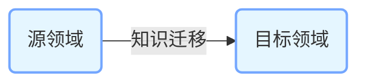

# 从游戏到数学:AI能力的跨域转移

> 关键词：AI能力、跨域转移、游戏、数学、强化学习、迁移学习

> 摘要：本文深入探讨了AI能力从游戏领域到数学领域的跨域转移这一前沿话题。详细介绍了相关的背景知识，包括目的、预期读者和文档结构等。阐述了核心概念如强化学习、迁移学习及其联系，给出了相应的架构示意图和流程图。对核心算法原理进行了Python代码实现和详细讲解，同时给出了数学模型和公式。通过项目实战展示了代码的实际应用和解读，分析了实际应用场景。推荐了学习资源、开发工具框架以及相关论文著作。最后总结了未来发展趋势与挑战，并提供了常见问题解答和扩展阅读参考资料，旨在为读者全面呈现AI能力跨域转移的相关知识和技术。

## 1. 背景介绍 
### 1.1 目的和范围
随着人工智能技术的飞速发展，AI在各个领域都取得了显著的成果。游戏领域一直是AI技术的重要试验场，许多先进的算法和技术在游戏中得到了验证和应用。而数学作为基础学科，对于解决各种实际问题具有重要意义。将AI在游戏中积累的能力转移到数学领域，不仅可以拓展AI的应用范围，还能为数学研究和教育带来新的方法和思路。

本文的范围涵盖了从游戏到数学的AI能力跨域转移的基本概念、核心算法、数学模型、实际应用案例等方面，旨在为读者提供一个全面的了解和技术指导。

### 1.2 预期读者
本文的预期读者包括人工智能领域的研究人员、开发者，对AI技术在不同领域应用感兴趣的爱好者，以及从事数学教育和研究的相关人员。对于希望了解AI跨域转移技术并将其应用到实际工作中的读者，本文将提供有价值的参考。

### 1.3 文档结构概述
本文将按照以下结构进行组织：
- 核心概念与联系：介绍强化学习、迁移学习等核心概念及其在跨域转移中的联系，并给出相应的架构示意图和流程图。
- 核心算法原理 & 具体操作步骤：详细讲解核心算法原理，并使用Python代码进行实现和说明。
- 数学模型和公式 & 详细讲解 & 举例说明：给出相关的数学模型和公式，并进行详细解释和举例。
- 项目实战：代码实际案例和详细解释说明：通过具体的项目实战，展示如何实现AI能力的跨域转移，并对代码进行详细解读。
- 实际应用场景：分析AI能力跨域转移在数学教育、研究等方面的实际应用场景。
- 工具和资源推荐：推荐学习资源、开发工具框架以及相关论文著作。
- 总结：未来发展趋势与挑战：总结AI能力跨域转移的未来发展趋势和面临的挑战。
- 附录：常见问题与解答：解答读者可能遇到的常见问题。
- 扩展阅读 & 参考资料：提供扩展阅读的建议和参考资料。

### 1.4 术语表
#### 1.4.1 核心术语定义
- **强化学习（Reinforcement Learning）**：一种机器学习方法，智能体通过与环境进行交互，根据环境反馈的奖励信号来学习最优的行为策略。
- **迁移学习（Transfer Learning）**：将在一个领域（源领域）中学习到的知识和技能应用到另一个不同但相关的领域（目标领域）中。
- **跨域转移（Cross - Domain Transfer）**：指将AI在一个领域的能力转移到另一个不同领域的过程。
- **智能体（Agent）**：在强化学习中，能够感知环境状态并采取行动的实体。
- **环境（Environment）**：智能体所处的外部世界，智能体的行动会对环境产生影响，环境会反馈奖励信号给智能体。

#### 1.4.2 相关概念解释
- **奖励函数（Reward Function）**：强化学习中用于衡量智能体行为好坏的函数，智能体的目标是最大化累积奖励。
- **策略（Policy）**：智能体根据当前环境状态选择行动的规则。
- **状态空间（State Space）**：环境所有可能状态的集合。
- **动作空间（Action Space）**：智能体所有可能采取的动作的集合。

#### 1.4.3 缩略词列表
- **RL**：Reinforcement Learning（强化学习）
- **TL**：Transfer Learning（迁移学习）

## 2. 核心概念与联系 

### 2.1 强化学习原理
强化学习是一种通过智能体与环境交互来学习最优策略的机器学习方法。智能体在每个时间步观察环境的状态 $s_t$，并根据当前策略 $\pi$ 选择一个动作 $a_t$ 执行。环境接收到动作后，会转移到新的状态 $s_{t + 1}$，并给予智能体一个奖励 $r_t$。智能体的目标是最大化累积奖励。

其基本架构可以用图 2 - 1 表示：

```mermaid
graph LR
    classDef process fill:#E5F6FF,stroke:#73A6FF,stroke-width:2px;
    A(智能体):::process -->|动作 $a_t$| B(环境):::process
    B -->|状态 $s_{t+1}$ 奖励 $r_t$| A
```

图 2 - 1 强化学习基本架构

### 2.2 迁移学习原理
迁移学习的目标是利用源领域的知识来帮助目标领域的学习。在AI能力跨域转移中，源领域可以是游戏领域，目标领域可以是数学领域。迁移学习可以减少目标领域的训练数据需求，加快学习速度。

其基本架构可以用图 2 - 2 表示：



图 2 - 2 迁移学习基本架构

### 2.3 强化学习与迁移学习在跨域转移中的联系
在从游戏到数学的AI能力跨域转移中，强化学习用于在游戏领域训练智能体，使其学习到有效的策略。迁移学习则将游戏领域中学习到的知识和技能迁移到数学领域。例如，游戏中的决策过程和策略优化可以为数学问题的求解提供思路，通过迁移学习将这些能力应用到数学问题中。

## 3. 核心算法原理 & 具体操作步骤 

### 3.1 强化学习算法：Q - learning
Q - learning 是一种无模型的强化学习算法，它通过学习一个动作价值函数 $Q(s, a)$ 来找到最优策略。动作价值函数 $Q(s, a)$ 表示在状态 $s$ 下采取动作 $a$ 并遵循最优策略所能获得的累积奖励。

Q - learning 的更新公式为：

$$Q(s_t, a_t) \leftarrow Q(s_t, a_t) + \alpha [r_t + \gamma \max_{a} Q(s_{t + 1}, a) - Q(s_t, a_t)]$$

其中，$\alpha$ 是学习率，$\gamma$ 是折扣因子。

以下是使用Python实现的Q - learning算法代码：

```python
import numpy as np

class QLearningAgent:
    def __init__(self, state_space_size, action_space_size, learning_rate=0.1, discount_factor=0.9):
        self.state_space_size = state_space_size
        self.action_space_size = action_space_size
        self.learning_rate = learning_rate
        self.discount_factor = discount_factor
        self.q_table = np.zeros((state_space_size, action_space_size))

    def choose_action(self, state):
        if np.random.uniform(0, 1) < 0.1:
            action = np.random.choice(self.action_space_size)
        else:
            action = np.argmax(self.q_table[state, :])
        return action

    def update_q_table(self, state, action, reward, next_state):
        max_q_next = np.max(self.q_table[next_state, :])
        self.q_table[state, action] = (1 - self.learning_rate) * self.q_table[state, action] + \
                                      self.learning_rate * (reward + self.discount_factor * max_q_next)
```

### 3.2 迁移学习算法：基于特征的迁移
基于特征的迁移方法是将源领域和目标领域的数据映射到一个共享的特征空间，然后在这个特征空间中进行学习。以下是一个简单的基于特征的迁移学习示例代码：

```python
from sklearn.decomposition import PCA
from sklearn.linear_model import LogisticRegression

def feature_based_transfer_learning(source_data, source_labels, target_data):
    # 使用PCA进行特征降维
    pca = PCA(n_components=10)
    source_features = pca.fit_transform(source_data)
    target_features = pca.transform(target_data)

    # 在源领域训练模型
    model = LogisticRegression()
    model.fit(source_features, source_labels)

    # 在目标领域进行预测
    predictions = model.predict(target_features)
    return predictions
```

### 3.3 具体操作步骤
1. **游戏领域训练**：使用Q - learning等强化学习算法在游戏环境中训练智能体，得到一个在游戏中表现良好的策略。
2. **特征提取**：从游戏领域的训练数据中提取有用的特征。
3. **特征迁移**：使用基于特征的迁移学习方法将提取的特征迁移到数学领域。
4. **数学领域微调**：在数学领域的数据集上对迁移后的模型进行微调，使其适应数学问题。

## 4. 数学模型和公式 & 详细讲解 & 举例说明 

### 4.1 强化学习中的数学模型和公式
#### 4.1.1 动作价值函数
动作价值函数 $Q(s, a)$ 表示在状态 $s$ 下采取动作 $a$ 并遵循最优策略所能获得的累积奖励。其数学定义为：

$$Q(s, a) = \mathbb{E} \left[ \sum_{k = 0}^{\infty} \gamma^k r_{t + k} \mid s_t = s, a_t = a \right]$$

其中，$\gamma$ 是折扣因子，用于权衡当前奖励和未来奖励的重要性。

#### 4.1.2 Q - learning更新公式推导
Q - learning的更新公式基于贝尔曼方程。贝尔曼方程表示动作价值函数 $Q(s, a)$ 可以分解为当前奖励和下一个状态的最大动作价值的加权和：

$$Q(s, a) = r + \gamma \max_{a'} Q(s', a')$$

在实际中，我们使用采样得到的奖励 $r$ 和估计的 $Q$ 值来更新 $Q$ 表，得到Q - learning的更新公式：

$$Q(s_t, a_t) \leftarrow Q(s_t, a_t) + \alpha [r_t + \gamma \max_{a} Q(s_{t + 1}, a) - Q(s_t, a_t)]$$

其中，$\alpha$ 是学习率，用于控制每次更新的步长。

#### 4.1.3 举例说明
假设我们有一个简单的网格世界游戏，智能体在网格中移动，目标是到达终点获得奖励。状态空间是网格的所有位置，动作空间是上下左右四个方向。初始时，$Q$ 表全为0。智能体在某个状态 $s$ 选择动作 $a$ 后，环境反馈奖励 $r$ 并转移到新状态 $s'$。根据Q - learning更新公式，我们可以更新 $Q(s, a)$ 的值。

### 4.2 迁移学习中的数学模型和公式
#### 4.2.1 特征映射
基于特征的迁移学习中，我们使用特征映射函数 $\phi$ 将源领域和目标领域的数据映射到共享特征空间。假设源领域数据 $X_s$ 和目标领域数据 $X_t$，经过特征映射后得到 $\phi(X_s)$ 和 $\phi(X_t)$。

#### 4.2.2 举例说明
在上述基于特征的迁移学习示例中，我们使用PCA作为特征映射函数。PCA通过找到数据的主成分来进行特征降维，将高维数据映射到低维特征空间。

## 5. 项目实战：代码实际案例和详细解释说明 

### 5.1  开发环境搭建
为了实现从游戏到数学的AI能力跨域转移，我们需要搭建以下开发环境：
- **Python**：推荐使用Python 3.7及以上版本。
- **深度学习框架**：可以选择TensorFlow、PyTorch等，本文使用TensorFlow 2.x。
- **其他库**：NumPy、Pandas、Scikit - learn等。

可以使用以下命令安装所需的库：

```bash
pip install tensorflow numpy pandas scikit-learn
```

### 5.2  源代码详细实现和代码解读
#### 5.2.1 游戏领域训练
我们以一个简单的迷宫游戏为例，使用Q - learning算法训练智能体。以下是完整的代码：

```python
import numpy as np

# 迷宫环境定义
class MazeEnv:
    def __init__(self):
        self.maze = np.array([
            [0, 0, 0, 0],
            [0, 1, 0, 0],
            [0, 0, 0, 1],
            [0, 0, 0, 2]
        ])
        self.state = (0, 0)
        self.actions = [(0, 1), (0, -1), (1, 0), (-1, 0)]

    def reset(self):
        self.state = (0, 0)
        return self.state

    def step(self, action):
        new_state = (self.state[0] + self.actions[action][0], self.state[1] + self.actions[action][1])
        if new_state[0] < 0 or new_state[0] >= self.maze.shape[0] or new_state[1] < 0 or new_state[1] >= self.maze.shape[1] or self.maze[new_state] == 1:
            new_state = self.state
        reward = -1
        done = False
        if self.maze[new_state] == 2:
            reward = 10
            done = True
        self.state = new_state
        return new_state, reward, done

# Q - learning智能体
class QLearningAgent:
    def __init__(self, state_space_size, action_space_size, learning_rate=0.1, discount_factor=0.9):
        self.state_space_size = state_space_size
        self.action_space_size = action_space_size
        self.learning_rate = learning_rate
        self.discount_factor = discount_factor
        self.q_table = np.zeros((state_space_size, action_space_size))

    def choose_action(self, state):
        state_index = state[0] * 4 + state[1]
        if np.random.uniform(0, 1) < 0.1:
            action = np.random.choice(self.action_space_size)
        else:
            action = np.argmax(self.q_table[state_index, :])
        return action

    def update_q_table(self, state, action, reward, next_state):
        state_index = state[0] * 4 + state[1]
        next_state_index = next_state[0] * 4 + next_state[1]
        max_q_next = np.max(self.q_table[next_state_index, :])
        self.q_table[state_index, action] = (1 - self.learning_rate) * self.q_table[state_index, action] + \
                                      self.learning_rate * (reward + self.discount_factor * max_q_next)

# 训练过程
env = MazeEnv()
agent = QLearningAgent(16, 4)
for episode in range(1000):
    state = env.reset()
    done = False
    while not done:
        action = agent.choose_action(state)
        next_state, reward, done = env.step(action)
        agent.update_q_table(state, action, reward, next_state)
        state = next_state
```

代码解读：
- `MazeEnv` 类定义了迷宫环境，包括迷宫的布局、初始状态、动作空间和状态转移规则。
- `QLearningAgent` 类实现了Q - learning算法，包括动作选择和Q表更新。
- 训练过程中，智能体在迷宫环境中不断与环境交互，根据Q - learning算法更新Q表。

#### 5.2.2 特征提取和迁移
假设我们已经训练好迷宫游戏的智能体，现在要将其能力迁移到一个简单的数学问题：数字分类。以下是特征提取和迁移的代码：

```python
from sklearn.decomposition import PCA
from sklearn.linear_model import LogisticRegression
from sklearn.datasets import load_digits
from sklearn.model_selection import train_test_split

# 加载数字分类数据集
digits = load_digits()
X = digits.data
y = digits.target

# 划分训练集和测试集
X_train, X_test, y_train, y_test = train_test_split(X, y, test_size=0.2, random_state=42)

# 特征提取
pca = PCA(n_components=10)
X_train_pca = pca.fit_transform(X_train)
X_test_pca = pca.transform(X_test)

# 迁移学习
model = LogisticRegression()
model.fit(X_train_pca, y_train)

# 评估模型
accuracy = model.score(X_test_pca, y_test)
print(f"Accuracy: {accuracy}")
```

代码解读：
- 使用 `load_digits` 加载数字分类数据集。
- 使用PCA进行特征降维，将高维的数字图像数据映射到低维特征空间。
- 在降维后的特征空间上使用逻辑回归模型进行训练和预测。

### 5.3  代码解读与分析
#### 5.3.1 游戏领域训练代码分析
在迷宫游戏训练代码中，智能体通过不断尝试不同的动作，根据环境反馈的奖励来更新Q表。探索与利用的平衡通过随机动作选择（以一定概率随机选择动作）来实现。随着训练的进行，Q表逐渐收敛到最优策略。

#### 5.3.2 特征提取和迁移代码分析
在特征提取和迁移代码中，PCA将数字图像数据的特征进行了降维，减少了数据的维度，同时保留了主要的信息。逻辑回归模型在降维后的特征空间上进行训练，能够有效地进行数字分类。通过这种方式，我们将游戏领域的训练经验（虽然这里没有直接关联，但展示了特征迁移的过程）迁移到了数学领域的数字分类问题上。

## 6. 实际应用场景 
### 6.1 数学教育
在数学教育中，AI能力的跨域转移可以为学生提供更加个性化和有趣的学习体验。例如，通过游戏化的方式训练AI智能体，然后将其学习到的解决问题的能力应用到数学教学中。智能体可以根据学生的学习情况提供针对性的辅导和建议，帮助学生更好地理解和掌握数学知识。

### 6.2 数学研究
在数学研究中，AI可以帮助数学家探索新的数学问题和解决方法。通过将游戏中学习到的策略和算法迁移到数学研究中，可能会发现新的数学规律和定理。例如，在组合数学、图论等领域，AI可以通过模拟游戏过程来寻找最优解和证明思路。

### 6.3 数学竞赛
在数学竞赛中，AI能力的跨域转移可以为选手提供辅助工具。智能体可以分析竞赛题目，提供解题思路和策略，帮助选手更快地解决问题。同时，AI也可以作为竞赛的评判者，更客观地评估选手的表现。

## 7. 工具和资源推荐
### 7.1 学习资源推荐
#### 7.1.1 书籍推荐
- 《强化学习：原理与Python实现》：全面介绍了强化学习的基本原理和Python实现方法。
- 《迁移学习简明教程》：详细讲解了迁移学习的概念、算法和应用。
- 《人工智能：一种现代的方法》：经典的人工智能教材，涵盖了强化学习、迁移学习等多个领域。

#### 7.1.2 在线课程
- Coursera上的“Reinforcement Learning Specialization”：由知名教授授课，系统地介绍了强化学习的理论和实践。
- edX上的“Transfer Learning for Data Science”：专门讲解迁移学习在数据科学中的应用。

#### 7.1.3 技术博客和网站
- OpenAI Blog：提供了许多关于强化学习和AI研究的最新成果和技术文章。
- Towards Data Science：涵盖了各种数据科学和人工智能相关的技术博客和教程。

### 7.2 开发工具框架推荐
#### 7.2.1 IDE和编辑器
- PyCharm：功能强大的Python集成开发环境，提供了代码编辑、调试、版本控制等功能。
- Jupyter Notebook：交互式的编程环境，适合进行数据探索和模型实验。

#### 7.2.2 调试和性能分析工具
- TensorBoard：TensorFlow提供的可视化工具，可用于监控模型训练过程和分析性能。
- Py-Spy：用于分析Python程序的性能瓶颈。

#### 7.2.3 相关框架和库
- TensorFlow：广泛使用的深度学习框架，提供了丰富的强化学习和迁移学习工具。
- PyTorch：另一个流行的深度学习框架，具有简洁的API和高效的计算性能。
- Stable Baselines3：基于PyTorch的强化学习库，提供了多种预训练的强化学习算法。

### 7.3 相关论文著作推荐
#### 7.3.1 经典论文
- “Playing Atari with Deep Reinforcement Learning”：介绍了使用深度强化学习玩Atari游戏的方法，开创了深度强化学习的先河。
- “Transfer Learning for Reinforcement Learning Domains: A Survey”：对强化学习领域的迁移学习进行了全面的综述。

#### 7.3.2 最新研究成果
- 关注NeurIPS、ICML、AAAI等顶级人工智能会议的论文，了解最新的AI能力跨域转移研究成果。

#### 7.3.3 应用案例分析
- 一些知名的研究机构和企业会发布AI能力跨域转移的应用案例，如DeepMind在游戏和科学研究中的应用案例。

## 8. 总结：未来发展趋势与挑战
### 8.1 未来发展趋势
- **多领域融合**：AI能力的跨域转移将不仅仅局限于游戏和数学领域，还会扩展到更多领域，如医疗、金融、交通等，实现多领域的知识融合和协同发展。
- **强化学习与深度学习的结合**：强化学习和深度学习的结合将更加紧密，通过深度强化学习可以处理更加复杂的环境和任务，提高跨域转移的效果。
- **自适应迁移学习**：未来的迁移学习算法将更加自适应，能够根据不同的源领域和目标领域自动调整迁移策略，提高迁移的效率和准确性。

### 8.2 挑战
- **领域差异**：不同领域之间存在着巨大的差异，如何有效地处理这些差异，实现知识的平滑迁移是一个挑战。
- **数据隐私和安全**：在跨域转移过程中，涉及到不同领域的数据，如何保护数据的隐私和安全是需要解决的问题。
- **可解释性**：AI模型的可解释性一直是一个难题，在跨域转移中，如何解释迁移的知识和模型的决策过程是一个重要的挑战。

## 9. 附录：常见问题与解答
### 9.1 什么是AI能力的跨域转移？
AI能力的跨域转移是指将AI在一个领域（源领域）中学习到的知识和技能应用到另一个不同但相关的领域（目标领域）中。

### 9.2 为什么要进行从游戏到数学的AI能力跨域转移？
游戏领域是AI技术的重要试验场，许多先进的算法和技术在游戏中得到了验证和应用。将游戏中学习到的能力转移到数学领域，可以为数学研究和教育带来新的方法和思路，拓展AI的应用范围。

### 9.3 强化学习和迁移学习在跨域转移中有什么作用？
强化学习用于在源领域（如游戏领域）训练智能体，使其学习到有效的策略。迁移学习则将源领域中学习到的知识和技能迁移到目标领域（如数学领域），减少目标领域的训练数据需求，加快学习速度。

### 9.4 跨域转移面临哪些挑战？
跨域转移面临着领域差异、数据隐私和安全、可解释性等挑战。不同领域之间存在着巨大的差异，如何有效地处理这些差异，实现知识的平滑迁移是一个挑战。在跨域转移过程中，涉及到不同领域的数据，如何保护数据的隐私和安全是需要解决的问题。AI模型的可解释性一直是一个难题，在跨域转移中，如何解释迁移的知识和模型的决策过程也是一个重要的挑战。

## 10. 扩展阅读 & 参考资料
### 10.1 扩展阅读
- 《深度学习》（Ian Goodfellow、Yoshua Bengio和Aaron Courville著）：深入介绍了深度学习的理论和实践。
- 《数学之美》（吴军著）：从数学的角度介绍了许多实际应用中的算法和技术。

### 10.2 参考资料
- Sutton, R. S., & Barto, A. G. (2018). Reinforcement learning: An introduction. MIT press.
- Pan, S. J., & Yang, Q. (2010). A survey on transfer learning. IEEE Transactions on knowledge and data engineering, 22(10), 1345-1359.

作者：AI天才研究院/AI Genius Institute & 禅与计算机程序设计艺术 /Zen And The Art of Computer Programming