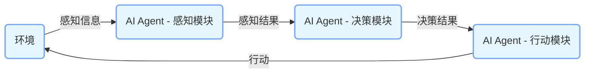

# 从零开始：搭建AI Agent开发环境

> 关键词：AI Agent、开发环境搭建、Python、深度学习框架、开发工具

> 摘要：本文旨在为开发者提供一个全面且详细的指南，帮助他们从零开始搭建AI Agent开发环境。文章将深入介绍AI Agent的核心概念、相关算法原理，通过Python代码进行具体阐述。同时，会给出数学模型和公式，并结合实际项目案例进行代码解读。此外，还会探讨AI Agent的实际应用场景，推荐学习资源、开发工具和相关论文著作。最后，对AI Agent未来的发展趋势与挑战进行总结，并提供常见问题解答和扩展阅读参考资料。

## 1. 背景介绍 
### 1.1 目的和范围
随着人工智能技术的飞速发展，AI Agent作为一种能够自主感知环境、做出决策并执行行动的智能实体，在众多领域展现出巨大的应用潜力。搭建AI Agent开发环境是开展相关研究和开发工作的基础。本指南的目的在于帮助开发者，无论是初学者还是有一定经验的专业人士，系统地了解并完成AI Agent开发环境的搭建。本指南将涵盖从基础软件安装到深度学习框架配置的全过程，同时介绍相关的开发工具和资源。

### 1.2 预期读者
本文主要面向对AI Agent开发感兴趣的初学者、计算机科学相关专业的学生以及想要涉足人工智能领域的开发者。无论您是否有编程基础，都可以通过本指南逐步搭建起自己的AI Agent开发环境。

### 1.3 文档结构概述
本文将按照以下结构进行组织：首先介绍AI Agent的核心概念与联系，包括其原理和架构；接着详细讲解核心算法原理，并给出Python源代码示例；然后介绍相关的数学模型和公式，并举例说明；之后通过项目实战，给出代码实际案例并进行详细解释；再探讨AI Agent的实际应用场景；随后推荐学习资源、开发工具和相关论文著作；最后对AI Agent的未来发展趋势与挑战进行总结，提供常见问题解答和扩展阅读参考资料。

### 1.4 术语表
#### 1.4.1 核心术语定义
- **AI Agent**：人工智能代理，是一种能够感知环境、根据感知信息做出决策并执行相应行动的智能实体。它可以是软件程序、机器人等。
- **深度学习框架**：用于构建和训练深度学习模型的软件库，如TensorFlow、PyTorch等。
- **开发环境**：指开发者进行软件开发所需的硬件和软件的组合，包括操作系统、编程语言、开发工具等。

#### 1.4.2 相关概念解释
- **感知**：AI Agent通过传感器或其他方式获取环境信息的过程。
- **决策**：AI Agent根据感知到的信息，运用一定的算法和策略选择合适行动的过程。
- **行动**：AI Agent根据决策结果在环境中执行的具体操作。

#### 1.4.3 缩略词列表
- **GPU**：Graphics Processing Unit，图形处理器，常用于加速深度学习计算。
- **CPU**：Central Processing Unit，中央处理器。
- **IDE**：Integrated Development Environment，集成开发环境。

## 2. 核心概念与联系 

### 核心概念原理
AI Agent的核心原理基于感知 - 决策 - 行动的循环。AI Agent通过传感器或输入接口感知环境状态，将感知到的信息传递给决策模块。决策模块根据预设的算法和模型，对感知信息进行分析和处理，选择合适的行动。最后，行动模块将决策结果转化为具体的行动，作用于环境。这个循环不断重复，使AI Agent能够适应环境的变化并实现特定的目标。

### 架构示意图


这个流程图展示了AI Agent与环境之间的交互过程。AI Agent从环境中获取感知信息，经过决策模块处理后产生行动，行动又会对环境产生影响，环境的变化再次被AI Agent感知，形成一个闭环。

## 3. 核心算法原理 & 具体操作步骤 

### 算法原理
在AI Agent开发中，常用的算法包括强化学习算法，如Q - 学习（Q - learning）。Q - 学习是一种无模型的强化学习算法，其核心思想是通过不断地试错来学习最优的行动策略。Q - 学习使用一个Q表来存储每个状态 - 行动对的价值估计，Q值表示在某个状态下采取某个行动所能获得的长期累积奖励。

### Python源代码实现
```python
import numpy as np

# 定义环境参数
num_states = 5
num_actions = 2
gamma = 0.9  # 折扣因子
alpha = 0.1  # 学习率

# 初始化Q表
Q = np.zeros((num_states, num_actions))

# 定义奖励函数
rewards = np.array([
    [-1, -1],
    [-1, -1],
    [-1, 10],
    [-1, -1],
    [-1, -1]
])

# 定义Q - 学习算法
def q_learning(num_episodes):
    for episode in range(num_episodes):
        state = np.random.randint(0, num_states)  # 随机初始化状态
        done = False
        while not done:
            # 选择行动
            if np.random.uniform(0, 1) < 0.1:  # 探索率为0.1
                action = np.random.randint(0, num_actions)
            else:
                action = np.argmax(Q[state, :])

            # 执行行动，获取下一个状态和奖励
            next_state = np.random.randint(0, num_states)
            reward = rewards[state, action]

            # 更新Q表
            Q[state, action] = (1 - alpha) * Q[state, action] + alpha * (reward + gamma * np.max(Q[next_state, :]))

            state = next_state

            # 判断是否结束
            if state == 2 and action == 1:
                done = True

    return Q

# 训练Q表
Q = q_learning(num_episodes=1000)
print("最终的Q表：")
print(Q)
```

### 具体操作步骤
1. **初始化Q表**：根据状态和行动的数量，创建一个全零的Q表。
2. **定义奖励函数**：根据环境的规则，定义每个状态 - 行动对的奖励值。
3. **选择行动**：在每个时间步，根据当前状态和Q表选择行动。可以采用探索 - 利用策略，如ε - 贪心策略。
4. **执行行动**：根据选择的行动，在环境中执行相应的操作，获取下一个状态和奖励。
5. **更新Q表**：根据Q - 学习的更新公式，更新当前状态 - 行动对的Q值。
6. **重复步骤3 - 5**：直到达到终止条件，如达到最大时间步数或完成目标。

## 4. 数学模型和公式 & 详细讲解 & 举例说明 

### 数学模型
Q - 学习的数学模型基于贝尔曼方程（Bellman equation）。贝尔曼方程描述了最优Q值的递归关系：

$$Q^*(s,a) = \mathbb{E}_{s'}\left[r(s,a) + \gamma \max_{a'} Q^*(s',a')\right]$$

其中，$Q^*(s,a)$ 表示在状态 $s$ 下采取行动 $a$ 的最优Q值，$r(s,a)$ 表示在状态 $s$ 下采取行动 $a$ 所获得的即时奖励，$\gamma$ 是折扣因子，用于权衡即时奖励和未来奖励的重要性，$s'$ 是采取行动 $a$ 后转移到的下一个状态。

### Q - 学习更新公式
Q - 学习使用以下更新公式来迭代更新Q值：

$$Q(s,a) \leftarrow (1 - \alpha)Q(s,a) + \alpha\left[r(s,a) + \gamma \max_{a'} Q(s',a')\right]$$

其中，$\alpha$ 是学习率，控制每次更新时新信息的权重。

### 详细讲解
- **贝尔曼方程**：贝尔曼方程的核心思想是，最优Q值等于即时奖励加上折扣后的未来最优Q值的期望。这意味着在某个状态下采取某个行动的价值，不仅取决于即时奖励，还取决于采取该行动后能够转移到的下一个状态的最优价值。
- **Q - 学习更新公式**：Q - 学习更新公式是基于贝尔曼方程的近似更新方法。每次更新时，根据当前的奖励和下一个状态的最大Q值来更新当前状态 - 行动对的Q值。学习率 $\alpha$ 控制了新信息的权重，$\alpha$ 越大，新信息对Q值的影响越大；$\alpha$ 越小，Q值的更新越缓慢。

### 举例说明
假设我们有一个简单的网格世界，有5个状态和2个行动。状态 $s = 2$ 是目标状态，当在状态 $s = 2$ 采取行动 $a = 1$ 时，获得奖励 $r = 10$，其他状态 - 行动对的奖励为 $r = -1$。折扣因子 $\gamma = 0.9$，学习率 $\alpha = 0.1$。

初始时，Q表全为零。假设当前状态 $s = 1$，选择行动 $a = 0$，转移到下一个状态 $s' = 2$，获得奖励 $r = -1$。根据Q - 学习更新公式：

$$Q(1,0) \leftarrow (1 - 0.1)Q(1,0) + 0.1\left[-1 + 0.9 \max_{a'} Q(2,a')\right]$$

由于初始时 $Q(2,a')$ 全为零，所以 $Q(1,0)$ 的更新值为：

$$Q(1,0) \leftarrow 0.9 \times 0 + 0.1\times(-1) = -0.1$$

随着不断地迭代更新，Q表中的值会逐渐收敛到最优值。

## 5. 项目实战：代码实际案例和详细解释说明 

### 5.1  开发环境搭建
#### 操作系统选择
可以选择Windows、Linux或macOS作为开发环境的操作系统。这里以Ubuntu 20.04为例进行介绍。

#### 安装Python
Ubuntu 20.04默认安装了Python 3.8。可以使用以下命令检查Python版本：
```bash
python3 --version
```

如果需要安装其他版本的Python，可以使用`pyenv`工具。首先安装`pyenv`：
```bash
curl https://pyenv.run | bash
```

然后按照提示配置环境变量，重启终端后安装所需的Python版本，例如Python 3.9：
```bash
pyenv install 3.9.7
pyenv global 3.9.7
```

#### 安装深度学习框架
这里以安装PyTorch为例。可以使用`pip`或`conda`进行安装。如果使用`pip`，可以根据自己的CUDA版本选择合适的安装命令。例如，安装CPU版本的PyTorch：
```bash
pip install torch torchvision torchaudio
```

如果需要安装支持CUDA的版本，可以参考PyTorch官方文档选择合适的命令。

#### 安装开发工具
可以安装Visual Studio Code作为开发工具。可以从官方网站下载安装包，然后进行安装。安装完成后，可以安装Python和PyTorch相关的扩展，以提高开发效率。

### 5.2  源代码详细实现和代码解读
以下是一个使用PyTorch实现简单AI Agent的代码示例，该AI Agent用于解决CartPole问题。

```python
import gym
import torch
import torch.nn as nn
import torch.optim as optim
import numpy as np

# 定义神经网络模型
class PolicyNetwork(nn.Module):
    def __init__(self, input_size, output_size):
        super(PolicyNetwork, self).__init__()
        self.fc1 = nn.Linear(input_size, 128)
        self.fc2 = nn.Linear(128, output_size)
        self.relu = nn.ReLU()
        self.softmax = nn.Softmax(dim=1)

    def forward(self, x):
        x = self.relu(self.fc1(x))
        x = self.softmax(self.fc2(x))
        return x

# 定义训练函数
def train(env, policy_network, optimizer, num_episodes, gamma=0.99):
    for episode in range(num_episodes):
        state = env.reset()
        log_probs = []
        rewards = []
        done = False
        while not done:
            state = torch.FloatTensor(state).unsqueeze(0)
            action_probs = policy_network(state)
            action = torch.multinomial(action_probs, 1).item()
            log_prob = torch.log(action_probs.squeeze(0)[action])
            log_probs.append(log_prob)
            next_state, reward, done, _ = env.step(action)
            rewards.append(reward)
            state = next_state

        # 计算折扣奖励
        discounted_rewards = []
        R = 0
        for r in reversed(rewards):
            R = r + gamma * R
            discounted_rewards.insert(0, R)
        discounted_rewards = torch.FloatTensor(discounted_rewards)
        discounted_rewards = (discounted_rewards - discounted_rewards.mean()) / (discounted_rewards.std() + 1e-9)

        # 计算损失
        loss = []
        for log_prob, reward in zip(log_probs, discounted_rewards):
            loss.append(-log_prob * reward)
        loss = torch.stack(loss).sum()

        # 更新模型参数
        optimizer.zero_grad()
        loss.backward()
        optimizer.step()

        if episode % 10 == 0:
            print(f"Episode {episode}: Total reward = {sum(rewards)}")

# 主函数
if __name__ == "__main__":
    env = gym.make('CartPole-v1')
    input_size = env.observation_space.shape[0]
    output_size = env.action_space.n
    policy_network = PolicyNetwork(input_size, output_size)
    optimizer = optim.Adam(policy_network.parameters(), lr=0.001)
    train(env, policy_network, optimizer, num_episodes=1000)
    env.close()
```

### 5.3  代码解读与分析
#### 神经网络模型
`PolicyNetwork`类定义了一个简单的两层全连接神经网络，用于学习行动策略。输入层的大小为环境的观测空间维度，输出层的大小为环境的行动空间维度。通过`softmax`函数将输出转换为行动概率分布。

#### 训练函数
`train`函数实现了训练过程。在每个回合中，AI Agent与环境进行交互，记录每个时间步的行动对数概率和奖励。然后计算折扣奖励，并根据策略梯度算法计算损失。最后使用反向传播更新模型参数。

#### 主函数
在主函数中，创建了`CartPole-v1`环境，初始化神经网络模型和优化器，调用`train`函数进行训练。训练完成后关闭环境。

## 6. 实际应用场景 
### 游戏领域
AI Agent在游戏领域有广泛的应用。例如，在电子竞技游戏中，AI Agent可以作为对手与玩家进行对战，通过学习和优化策略来提高游戏水平。在围棋、国际象棋等棋类游戏中，AI Agent也取得了显著的成果，如AlphaGo击败了人类顶尖棋手。

### 自动驾驶领域
在自动驾驶领域，AI Agent可以作为车辆的决策系统，感知周围环境，如交通信号、其他车辆和行人等，根据感知信息做出决策，如加速、减速、转弯等，以实现安全、高效的自动驾驶。

### 智能客服领域
AI Agent可以作为智能客服，与用户进行对话，解答用户的问题，提供相关的服务和建议。通过自然语言处理技术，AI Agent可以理解用户的意图，并生成合适的回复。

### 工业自动化领域
在工业自动化领域，AI Agent可以控制机器人进行生产操作，如物料搬运、零件组装等。通过感知生产环境和任务要求，AI Agent可以自主规划行动路径，提高生产效率和质量。

## 7. 工具和资源推荐
### 7.1 学习资源推荐
#### 7.1.1 书籍推荐
- 《人工智能：一种现代的方法》（Artificial Intelligence: A Modern Approach）：这是一本经典的人工智能教材，全面介绍了人工智能的各个领域，包括搜索算法、知识表示、机器学习、自然语言处理等。
- 《深度学习》（Deep Learning）：由Ian Goodfellow、Yoshua Bengio和Aaron Courville编写，详细介绍了深度学习的基本原理、模型结构和应用。
- 《强化学习：原理与Python实现》（Reinforcement Learning: An Introduction）：由Richard S. Sutton和Andrew G. Barto编写，是强化学习领域的经典教材，对强化学习的理论和算法进行了深入的讲解。

#### 7.1.2 在线课程
- Coursera上的“机器学习”（Machine Learning）课程：由Andrew Ng教授授课，是机器学习领域的经典入门课程，涵盖了线性回归、逻辑回归、神经网络等基本算法。
- edX上的“深度学习微硕士”（Deep Learning MicroMasters）课程：由多个知名高校的教授联合授课，系统地介绍了深度学习的理论和实践。
- OpenAI Gym官方文档和教程：OpenAI Gym是一个用于开发和比较强化学习算法的工具包，其官方文档和教程提供了丰富的示例和代码，帮助开发者快速上手。

#### 7.1.3 技术博客和网站
- Medium上的人工智能相关博客：Medium上有许多优秀的人工智能博客，如Towards Data Science、AI in Plain English等，这些博客经常发布最新的研究成果和技术实践经验。
- arXiv.org：一个预印本服务器，提供了大量的学术论文，涵盖了人工智能的各个领域，可以及时了解最新的研究动态。
- GitHub上的开源项目：GitHub上有许多优秀的人工智能开源项目，如TensorFlow、PyTorch等，可以通过学习这些项目的代码来提高自己的开发能力。

### 7.2 开发工具框架推荐
#### 7.2.1 IDE和编辑器
- Visual Studio Code：一款轻量级的开源代码编辑器，支持多种编程语言和扩展，具有丰富的功能和插件，适合AI Agent开发。
- PyCharm：一款专门为Python开发设计的集成开发环境，提供了代码调试、代码分析、自动补全等功能，提高开发效率。
- Jupyter Notebook：一个交互式的开发环境，支持Python、R等多种编程语言，适合进行数据分析和模型实验。

#### 7.2.2 调试和性能分析工具
- TensorBoard：TensorFlow的可视化工具，可以用于监控模型的训练过程，如损失函数的变化、准确率的变化等，还可以可视化模型的结构和参数。
- PyTorch Profiler：PyTorch提供的性能分析工具，可以分析模型的计算时间、内存使用情况等，帮助开发者优化模型性能。
- cProfile：Python标准库中的性能分析工具，可以分析Python代码的运行时间和函数调用次数，找出性能瓶颈。

#### 7.2.3 相关框架和库
- TensorFlow：Google开发的深度学习框架，具有丰富的工具和库，支持分布式训练和模型部署，广泛应用于工业界和学术界。
- PyTorch：Facebook开发的深度学习框架，具有动态图特性，易于使用和调试，受到研究人员的广泛喜爱。
- OpenAI Gym：用于开发和比较强化学习算法的工具包，提供了多种环境和评估指标，方便开发者进行强化学习实验。

### 7.3 相关论文著作推荐
#### 7.3.1 经典论文
- “Playing Atari with Deep Reinforcement Learning”：首次提出了深度Q网络（Deep Q - Network，DQN）算法，将深度学习和强化学习相结合，在Atari游戏中取得了显著的成果。
- “Mastering the Game of Go with Deep Neural Networks and Tree Search”：介绍了AlphaGo的算法原理，通过深度神经网络和蒙特卡罗树搜索相结合，实现了在围棋领域的突破。
- “Attention Is All You Need”：提出了Transformer模型，该模型在自然语言处理领域取得了巨大的成功，被广泛应用于机器翻译、文本生成等任务。

#### 7.3.2 最新研究成果
- 关注顶级学术会议如NeurIPS（神经信息处理系统大会）、ICML（国际机器学习会议）、CVPR（计算机视觉与模式识别会议）等的论文，这些会议汇聚了人工智能领域的最新研究成果。
- 关注知名研究机构如OpenAI、DeepMind等的官方网站，他们经常发布最新的研究论文和技术报告。

#### 7.3.3 应用案例分析
- 研究工业界的应用案例，如特斯拉的自动驾驶技术、亚马逊的智能客服系统等，了解AI Agent在实际应用中的挑战和解决方案。
- 参考开源项目的文档和博客文章，如OpenAI的GPT系列模型的应用案例，学习如何将AI Agent技术应用到实际项目中。

## 8. 总结：未来发展趋势与挑战
### 未来发展趋势
- **多智能体协作**：未来的AI Agent将不仅仅是单个智能体的独立运行，而是多个智能体之间的协作。例如，在自动驾驶领域，多辆车之间的协作可以提高交通效率和安全性；在物流领域，多个机器人之间的协作可以实现高效的货物搬运和配送。
- **与物理世界的融合**：AI Agent将更加深入地与物理世界进行融合，如机器人技术、物联网技术等。通过与物理设备的交互，AI Agent可以更好地感知和控制物理环境，实现更加复杂的任务。
- **可解释性和可信性**：随着AI Agent在关键领域的应用越来越广泛，其可解释性和可信性将成为重要的研究方向。用户需要了解AI Agent的决策过程和依据，确保其决策的合理性和可靠性。
- **强化学习与其他技术的结合**：强化学习将与深度学习、计算机视觉、自然语言处理等技术更加紧密地结合，以解决更加复杂的问题。例如，将强化学习与计算机视觉相结合，可以实现更加智能的机器人视觉导航。

### 挑战
- **数据隐私和安全**：AI Agent的训练和运行需要大量的数据，这些数据可能包含用户的隐私信息。如何保护数据的隐私和安全，防止数据泄露和滥用，是一个重要的挑战。
- **计算资源需求**：深度学习和强化学习算法通常需要大量的计算资源，如GPU等。如何降低计算资源的需求，提高算法的效率，是一个亟待解决的问题。
- **环境适应性**：现实世界的环境是复杂多变的，AI Agent需要具备良好的环境适应性。如何让AI Agent在不同的环境中都能稳定运行，是一个挑战。
- **伦理和法律问题**：随着AI Agent的智能化程度不断提高，其决策和行为可能会对人类社会产生影响。如何制定相应的伦理和法律规范，确保AI Agent的行为符合人类的价值观和法律要求，是一个重要的问题。

## 9. 附录：常见问题与解答
### 问题1：搭建AI Agent开发环境需要什么样的硬件配置？
答：如果只是进行简单的实验和学习，普通的笔记本电脑或台式机即可。如果需要进行大规模的深度学习训练，建议配备高性能的GPU，如NVIDIA的RTX系列显卡。

### 问题2：如何选择合适的深度学习框架？
答：选择深度学习框架需要考虑多个因素，如个人偏好、项目需求、社区支持等。TensorFlow适合工业界的大规模应用，具有丰富的工具和库；PyTorch适合研究人员，具有动态图特性，易于使用和调试。

### 问题3：在训练AI Agent时，遇到训练不稳定的问题怎么办？
答：训练不稳定可能是由于学习率设置不合理、数据分布不均匀等原因导致的。可以尝试调整学习率、增加训练数据、使用正则化方法等。

### 问题4：如何评估AI Agent的性能？
答：评估AI Agent的性能可以使用不同的指标，如奖励值、准确率、成功率等。具体的评估指标需要根据任务的特点和需求来选择。

## 10. 扩展阅读 & 参考资料
- 李开复, 王咏刚. 《人工智能》. 文化发展出版社, 2017.
- Goodfellow, I., Bengio, Y., & Courville, A. 《深度学习》. 人民邮电出版社, 2017.
- Sutton, R. S., & Barto, A. G. 《强化学习：原理与Python实现》. 电子工业出版社, 2019.
- OpenAI官方文档：https://openai.com/
- TensorFlow官方文档：https://www.tensorflow.org/
- PyTorch官方文档：https://pytorch.org/

作者：AI天才研究院/AI Genius Institute & 禅与计算机程序设计艺术 /Zen And The Art of Computer Programming