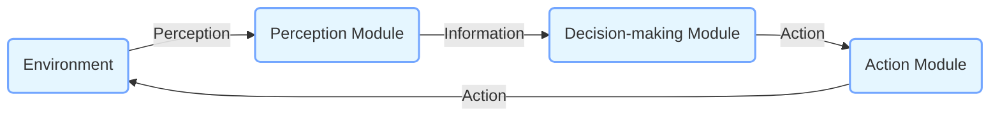

# 从零开始：构建AI Agent的完整指南

> 关键词：AI Agent、人工智能、构建指南、智能体、算法原理、项目实战

> 摘要：本文旨在为读者提供一个从零基础开始构建AI Agent的完整指南。详细介绍了AI Agent的核心概念、算法原理、数学模型，通过具体的Python代码展示了构建过程。同时，给出了项目实战案例，包括开发环境搭建、源代码实现与解读。此外，探讨了AI Agent的实际应用场景，推荐了相关的学习资源、开发工具框架以及论文著作。最后，对AI Agent的未来发展趋势与挑战进行了总结，并提供了常见问题解答和扩展阅读参考资料，帮助读者全面深入地了解和掌握构建AI Agent的技术。

## 1. 背景介绍 
### 1.1 目的和范围
本指南的主要目的是帮助零基础的读者逐步了解并掌握构建AI Agent的完整流程。从最基础的概念开始讲解，深入剖析核心算法原理，通过实际的Python代码实现具体的操作步骤。范围涵盖了AI Agent的理论知识、实践操作、应用场景、相关工具和资源等方面，旨在为读者提供一个全面、系统的学习路径。

### 1.2 预期读者
本文预期读者包括对人工智能领域感兴趣的初学者，如计算机科学专业的学生、想要转行进入AI领域的人员；也适用于有一定编程基础，但对AI Agent构建缺乏深入了解的开发者；同时，对于希望进一步探索AI Agent技术应用的研究人员和工程师也具有一定的参考价值。

### 1.3 文档结构概述
本文将按照以下结构进行阐述：首先介绍AI Agent的核心概念及其相互联系，通过文本示意图和Mermaid流程图直观展示其架构；接着详细讲解核心算法原理，并使用Python源代码说明具体操作步骤；然后介绍相关的数学模型和公式，并举例说明；之后通过项目实战，展示开发环境搭建、源代码实现和代码解读；再探讨AI Agent的实际应用场景；随后推荐学习资源、开发工具框架和相关论文著作；最后总结未来发展趋势与挑战，提供常见问题解答和扩展阅读参考资料。

### 1.4 术语表
#### 1.4.1 核心术语定义
- **AI Agent（人工智能智能体）**：是一个能够感知环境、做出决策并采取行动以实现特定目标的软件实体。它可以接收来自环境的信息，通过内部的决策机制进行分析，然后选择合适的行动来影响环境。
- **环境（Environment）**：是AI Agent所处的外部世界，它为AI Agent提供感知信息，并对AI Agent的行动做出响应。环境可以是物理世界，也可以是虚拟的软件环境。
- **感知（Perception）**：指AI Agent从环境中获取信息的过程。这些信息可以是传感器数据、文本信息、图像等。
- **决策（Decision-making）**：AI Agent根据感知到的信息，运用内部的算法和策略，选择合适行动的过程。
- **行动（Action）**：AI Agent为了实现目标而在环境中采取的具体操作。行动可以是物理动作，也可以是软件操作，如发送消息、修改数据等。

#### 1.4.2 相关概念解释
- **智能（Intelligence）**：AI Agent表现出的智能是指它能够灵活地适应环境变化，根据不同的情况做出合理的决策和行动。智能的表现形式包括学习能力、推理能力、问题解决能力等。
- **自主性（Autonomy）**：自主性是指AI Agent能够在没有人类直接干预的情况下，独立地感知环境、做出决策和采取行动。具有较高自主性的AI Agent能够更好地应对复杂多变的环境。
- **目标导向（Goal-oriented）**：AI Agent的行为是为了实现特定的目标。目标可以是明确的，如完成一项任务、达到某个指标；也可以是模糊的，如提高用户满意度。

#### 1.4.3 缩略词列表
- **AI**：Artificial Intelligence，人工智能
- **RL**：Reinforcement Learning，强化学习
- **ML**：Machine Learning，机器学习
- **NLP**：Natural Language Processing，自然语言处理
- **CV**：Computer Vision，计算机视觉

## 2. 核心概念与联系 
### 核心概念原理
AI Agent的核心原理基于感知 - 决策 - 行动的循环过程。AI Agent通过感知模块从环境中获取信息，这些信息被传递到决策模块。决策模块根据预设的算法和策略，对感知信息进行分析和处理，选择合适的行动。然后，行动模块将决策结果转化为具体的行动，作用于环境。环境对行动做出响应，产生新的状态，AI Agent再次感知环境，开始新的循环。

### 架构的文本示意图
```plaintext
          +-------------------+
          |     Environment     |
          +-------------------+
                   ^    |
                   |    v
+-----------------+    +-----------------+
|    Perception   |    |    Action       |
+-----------------+    +-----------------+
                   |    |
                   v    v
             +-----------------+
             |  Decision-making  |
             +-----------------+
```

### Mermaid流程图


## 3. 核心算法原理 & 具体操作步骤 
### 算法原理讲解
在构建AI Agent时，常用的算法包括强化学习算法。以Q - learning算法为例，Q - learning是一种无模型的强化学习算法，它通过学习一个Q值函数来指导AI Agent的决策。Q值函数 $Q(s, a)$ 表示在状态 $s$ 下采取行动 $a$ 的预期累积奖励。

AI Agent在每个时间步 $t$ 会处于一个状态 $s_t$，它会根据当前的Q值函数选择一个行动 $a_t$，执行该行动后，环境会反馈一个奖励 $r_t$ 并转移到新的状态 $s_{t + 1}$。Q值函数会根据以下更新公式进行更新：

$$Q(s_t, a_t) \leftarrow Q(s_t, a_t) + \alpha [r_t + \gamma \max_{a} Q(s_{t + 1}, a) - Q(s_t, a_t)]$$

其中，$\alpha$ 是学习率，控制每次更新的步长；$\gamma$ 是折扣因子，用于平衡即时奖励和未来奖励。

### Python源代码实现
```python
import numpy as np

# 定义Q - learning类
class QLearningAgent:
    def __init__(self, num_states, num_actions, learning_rate=0.1, discount_factor=0.9):
        # 初始化Q表
        self.q_table = np.zeros((num_states, num_actions))
        self.learning_rate = learning_rate
        self.discount_factor = discount_factor

    def choose_action(self, state, epsilon=0.1):
        # epsilon - greedy策略选择行动
        if np.random.uniform(0, 1) < epsilon:
            # 探索：随机选择一个行动
            action = np.random.choice(range(self.q_table.shape[1]))
        else:
            # 利用：选择Q值最大的行动
            action = np.argmax(self.q_table[state, :])
        return action

    def update_q_table(self, state, action, reward, next_state):
        # 更新Q表
        max_q_next = np.max(self.q_table[next_state, :])
        self.q_table[state, action] += self.learning_rate * (
            reward + self.discount_factor * max_q_next - self.q_table[state, action]
        )

# 示例使用
num_states = 10
num_actions = 4
agent = QLearningAgent(num_states, num_actions)

# 模拟一个时间步
state = 0
action = agent.choose_action(state)
reward = 1
next_state = 1
agent.update_q_table(state, action, reward, next_state)

print("更新后的Q表：")
print(agent.q_table)
```
### 具体操作步骤
1. **初始化Q表**：根据状态和行动的数量，创建一个全零的Q表。
2. **选择行动**：使用epsilon - greedy策略，在探索和利用之间进行权衡，选择一个行动。
3. **执行行动并获取奖励和新状态**：将选择的行动应用到环境中，环境会反馈一个奖励和新的状态。
4. **更新Q表**：根据Q - learning更新公式，更新当前状态和行动对应的Q值。
5. **重复步骤2 - 4**：不断循环，直到达到终止条件。

## 4. 数学模型和公式 & 详细讲解 & 举例说明 
### Q - learning的数学模型和公式
Q - learning的核心是Q值函数 $Q(s, a)$ 的更新公式：

$$Q(s_t, a_t) \leftarrow Q(s_t, a_t) + \alpha [r_t + \gamma \max_{a} Q(s_{t + 1}, a) - Q(s_t, a_t)]$$

### 详细讲解
- **$Q(s_t, a_t)$**：表示在时间步 $t$ 处于状态 $s_t$ 时采取行动 $a_t$ 的Q值。
- **$\alpha$**：学习率，取值范围通常在 $[0, 1]$ 之间。学习率越大，每次更新Q值时对新信息的权重就越大；学习率越小，Q值的更新就越缓慢，更依赖于之前的经验。
- **$r_t$**：在时间步 $t$ 执行行动 $a_t$ 后从环境中获得的即时奖励。
- **$\gamma$**：折扣因子，取值范围在 $[0, 1]$ 之间。折扣因子用于平衡即时奖励和未来奖励，$\gamma$ 越接近1，AI Agent越看重未来的奖励；$\gamma$ 越接近0，AI Agent越关注即时奖励。
- **$\max_{a} Q(s_{t + 1}, a)$**：表示在新状态 $s_{t + 1}$ 下所有可能行动的最大Q值。

### 举例说明
假设一个简单的网格世界环境，AI Agent的目标是从起点移动到终点。环境有10个状态（10个网格位置）和4个行动（上、下、左、右）。初始时，Q表全为0。

在某一时刻，AI Agent处于状态 $s_t = 0$，选择行动 $a_t = 1$（向下移动），执行该行动后获得奖励 $r_t = 1$，并转移到新状态 $s_{t + 1} = 1$。假设学习率 $\alpha = 0.1$，折扣因子 $\gamma = 0.9$。

初始时，$Q(0, 1) = 0$，在新状态 $s_{t + 1} = 1$ 下，假设 $\max_{a} Q(1, a) = 0$（因为初始Q表全为0）。

根据Q - learning更新公式：

$$Q(0, 1) \leftarrow 0 + 0.1\times[1 + 0.9\times0 - 0] = 0.1$$

更新后，$Q(0, 1)$ 的值变为0.1。随着不断的学习和更新，Q表会逐渐收敛到一个最优的Q值函数，指导AI Agent做出最优的决策。

## 5. 项目实战：代码实际案例和详细解释说明 
### 5.1  开发环境搭建
#### 安装Python
首先，需要安装Python编程语言。可以从Python官方网站（https://www.python.org/downloads/）下载适合自己操作系统的Python版本。建议安装Python 3.6及以上版本。

#### 安装必要的库
在本项目中，主要使用`numpy`库进行数值计算。可以使用以下命令通过`pip`安装`numpy`：
```sh
pip install numpy
```

### 5.2  源代码详细实现和代码解读
#### 完整代码
```python
import numpy as np

# 定义环境类
class GridWorld:
    def __init__(self, grid_size=4):
        self.grid_size = grid_size
        self.num_states = grid_size * grid_size
        self.num_actions = 4  # 上、下、左、右
        self.start_state = 0
        self.goal_state = self.num_states - 1
        self.current_state = self.start_state

    def reset(self):
        # 重置环境到初始状态
        self.current_state = self.start_state
        return self.current_state

    def step(self, action):
        # 执行行动并返回新状态、奖励和是否终止
        x, y = self._state_to_xy(self.current_state)
        if action == 0:  # 上
            new_x = max(x - 1, 0)
            new_y = y
        elif action == 1:  # 下
            new_x = min(x + 1, self.grid_size - 1)
            new_y = y
        elif action == 2:  # 左
            new_x = x
            new_y = max(y - 1, 0)
        elif action == 3:  # 右
            new_x = x
            new_y = min(y + 1, self.grid_size - 1)

        new_state = self._xy_to_state(new_x, new_y)
        if new_state == self.goal_state:
            reward = 1
            done = True
        else:
            reward = 0
            done = False

        self.current_state = new_state
        return new_state, reward, done

    def _state_to_xy(self, state):
        # 将状态转换为二维坐标
        x = state // self.grid_size
        y = state % self.grid_size
        return x, y

    def _xy_to_state(self, x, y):
        # 将二维坐标转换为状态
        return x * self.grid_size + y

# 定义Q - learning类
class QLearningAgent:
    def __init__(self, num_states, num_actions, learning_rate=0.1, discount_factor=0.9, epsilon=0.1):
        # 初始化Q表
        self.q_table = np.zeros((num_states, num_actions))
        self.learning_rate = learning_rate
        self.discount_factor = discount_factor
        self.epsilon = epsilon

    def choose_action(self, state):
        # epsilon - greedy策略选择行动
        if np.random.uniform(0, 1) < self.epsilon:
            # 探索：随机选择一个行动
            action = np.random.choice(range(self.q_table.shape[1]))
        else:
            # 利用：选择Q值最大的行动
            action = np.argmax(self.q_table[state, :])
        return action

    def update_q_table(self, state, action, reward, next_state):
        # 更新Q表
        max_q_next = np.max(self.q_table[next_state, :])
        self.q_table[state, action] += self.learning_rate * (
            reward + self.discount_factor * max_q_next - self.q_table[state, action]
        )

# 主训练循环
if __name__ == "__main__":
    env = GridWorld()
    agent = QLearningAgent(env.num_states, env.num_actions)
    num_episodes = 1000

    for episode in range(num_episodes):
        state = env.reset()
        done = False
        while not done:
            action = agent.choose_action(state)
            next_state, reward, done = env.step(action)
            agent.update_q_table(state, action, reward, next_state)
            state = next_state

    # 打印最终的Q表
    print("最终的Q表：")
    print(agent.q_table)
```

#### 代码解读
1. **GridWorld类**：
    - `__init__`方法：初始化环境的参数，包括网格大小、状态数量、行动数量、起始状态和目标状态。
    - `reset`方法：将环境重置到初始状态，并返回初始状态。
    - `step`方法：根据输入的行动，更新环境的状态，返回新状态、奖励和是否终止的标志。
    - `_state_to_xy`和`_xy_to_state`方法：用于状态和二维坐标之间的转换。

2. **QLearningAgent类**：
    - `__init__`方法：初始化Q表、学习率、折扣因子和探索率。
    - `choose_action`方法：使用epsilon - greedy策略选择行动。
    - `update_q_table`方法：根据Q - learning更新公式更新Q表。

3. **主训练循环**：
    - 创建环境和AI Agent对象。
    - 进行多次训练回合（`num_episodes`）。
    - 在每个回合中，重置环境，不断选择行动、执行行动、更新Q表，直到达到目标状态。

### 5.3  代码解读与分析
#### 训练过程分析
在训练过程中，AI Agent通过不断地与环境交互，逐渐学习到最优的行动策略。初始时，由于Q表全为0，AI Agent主要通过探索（随机选择行动）来了解环境。随着训练的进行，Q表中的值逐渐更新，AI Agent开始更多地利用已有的经验（选择Q值最大的行动）。

#### 收敛性分析
Q - learning算法在一定条件下是收敛的。当学习率 $\alpha$ 逐渐减小，折扣因子 $\gamma$ 固定，并且环境是静态的，Q表最终会收敛到最优的Q值函数。在实际应用中，通常需要通过多次实验来调整学习率和折扣因子，以达到较好的训练效果。

#### 性能评估
可以通过统计AI Agent在训练过程中达到目标状态的平均步数、成功率等指标来评估其性能。随着训练回合的增加，AI Agent应该能够更快地找到目标状态，成功率也会逐渐提高。

## 6. 实际应用场景 
### 游戏领域
在游戏中，AI Agent可以作为游戏角色的智能控制器。例如，在策略游戏中，AI Agent可以根据当前的游戏局势，选择最佳的战略决策，如建造建筑、派遣部队等。在动作游戏中，AI Agent可以控制角色的移动、攻击等行为，与玩家进行对抗。

### 机器人控制
在机器人领域，AI Agent可以用于控制机器人的行为。例如，在自动驾驶汽车中，AI Agent可以感知周围的环境，如道路状况、其他车辆和行人的位置，然后做出决策，如加速、减速、转弯等。在工业机器人中，AI Agent可以根据生产任务的要求，控制机器人的动作，完成装配、搬运等工作。

### 智能客服
在智能客服系统中，AI Agent可以与用户进行对话，理解用户的问题，并提供相应的解答。通过自然语言处理技术，AI Agent可以处理用户的文本或语音输入，分析用户的意图，然后从知识库中查找相关的信息，生成合适的回复。

### 金融领域
在金融领域，AI Agent可以用于投资决策、风险评估等。例如，AI Agent可以分析市场数据、公司财务报表等信息，预测股票价格的走势，为投资者提供投资建议。同时，AI Agent可以评估金融交易的风险，及时发现潜在的风险因素，并采取相应的措施进行防范。

## 7. 工具和资源推荐
### 7.1 学习资源推荐
#### 7.1.1 书籍推荐
- 《人工智能：一种现代的方法》（*Artificial Intelligence: A Modern Approach*）：这是一本经典的人工智能教材，全面介绍了人工智能的各个领域，包括搜索算法、知识表示、机器学习、自然语言处理等。
- 《强化学习：原理与Python实现》（*Reinforcement Learning: An Introduction*）：由强化学习领域的两位权威专家Richard S. Sutton和Andrew G. Barto所著，系统地介绍了强化学习的基本概念、算法和应用。
- 《Python机器学习》（*Python Machine Learning*）：这本书详细介绍了如何使用Python进行机器学习，包括数据预处理、模型选择、评估和优化等方面的内容。

#### 7.1.2 在线课程
- Coursera上的“人工智能基础”（*Foundations of Artificial Intelligence*）：该课程由斯坦福大学的教授授课，介绍了人工智能的基本概念、算法和应用。
- edX上的“强化学习”（*Reinforcement Learning*）：这是一门深入讲解强化学习的课程，包括Q - learning、策略梯度算法等内容。
- 吴恩达的“机器学习”课程：该课程在Coursera上非常受欢迎，全面介绍了机器学习的基本算法和实践技巧。

#### 7.1.3 技术博客和网站
- Medium：Medium上有许多关于人工智能和机器学习的优秀博客文章，涵盖了最新的研究成果、技术应用和实践经验。
- arXiv：arXiv是一个预印本平台，提供了大量的人工智能相关的研究论文，包括最新的研究成果和技术趋势。
- OpenAI Blog：OpenAI的官方博客，分享了OpenAI在人工智能领域的最新研究和开发进展。

### 7.2 开发工具框架推荐
#### 7.2.1 IDE和编辑器
- PyCharm：是一款专门为Python开发设计的集成开发环境（IDE），提供了丰富的功能，如代码编辑、调试、版本控制等。
- Jupyter Notebook：是一个交互式的开发环境，适合进行数据探索、模型实验和文档编写。
- Visual Studio Code：是一款轻量级的代码编辑器，支持多种编程语言，通过安装Python扩展可以方便地进行Python开发。

#### 7.2.2 调试和性能分析工具
- PDB：Python自带的调试器，可以帮助开发者在代码中设置断点、查看变量值等。
- cProfile：Python标准库中的性能分析工具，可以分析代码的执行时间和函数调用次数。
- TensorBoard：是TensorFlow的可视化工具，可以用于可视化训练过程中的损失函数、准确率等指标。

#### 7.2.3 相关框架和库
- TensorFlow：是一个开源的机器学习框架，广泛应用于深度学习领域，提供了丰富的工具和函数，方便开发者构建和训练模型。
- PyTorch：是另一个流行的深度学习框架，具有动态图的特点，易于使用和调试。
- Stable Baselines：是一个基于OpenAI Gym的强化学习库，提供了多种强化学习算法的实现，方便开发者进行强化学习实验。

### 7.3 相关论文著作推荐
#### 7.3.1 经典论文
- “Q - learning”：由Christopher J. C. H. Watkins和Peter Dayan发表，首次提出了Q - learning算法，是强化学习领域的经典论文。
- “Playing Atari with Deep Reinforcement Learning”：由DeepMind团队发表，介绍了如何使用深度强化学习算法玩Atari游戏，开启了深度强化学习的研究热潮。
- “Attention Is All You Need”：由Google团队发表，提出了Transformer模型，在自然语言处理领域取得了巨大的成功。

#### 7.3.2 最新研究成果
- 关注顶级学术会议，如NeurIPS（神经信息处理系统大会）、ICML（国际机器学习会议）、CVPR（计算机视觉与模式识别会议）等，这些会议上发表的论文代表了人工智能领域的最新研究成果。
- 关注知名研究机构和实验室的官方网站，如OpenAI、DeepMind、斯坦福人工智能实验室等，他们会发布最新的研究报告和论文。

#### 7.3.3 应用案例分析
- 《人工智能应用案例集》：收集了人工智能在各个领域的应用案例，包括医疗、金融、交通等，通过实际案例分析，帮助读者了解人工智能的实际应用场景和解决方案。
- 相关行业的研究报告：如麦肯锡、波士顿咨询等咨询公司发布的关于人工智能应用的研究报告，提供了行业内的最新动态和应用案例。

## 8. 总结：未来发展趋势与挑战
### 未来发展趋势
#### 多智能体系统
未来的AI Agent将不再是孤立的个体，而是会形成多智能体系统。多个AI Agent可以通过协作和竞争的方式完成复杂的任务，例如在智能交通系统中，多个自动驾驶汽车可以通过协作来优化交通流量。

#### 与其他技术的融合
AI Agent将与物联网、区块链、5G等技术深度融合。例如，在物联网环境中，AI Agent可以实时感知和处理大量的传感器数据，实现智能决策和控制。区块链技术可以为AI Agent提供可信的环境，保证数据的安全性和隐私性。5G技术可以提供高速、低延迟的通信，支持AI Agent之间的实时交互。

#### 通用人工智能
目前的AI Agent大多是针对特定任务进行设计和训练的，未来的研究方向将朝着通用人工智能发展。通用人工智能能够理解、学习和应用各种知识，像人类一样灵活地应对不同的任务和环境。

### 挑战
#### 数据隐私和安全
随着AI Agent的广泛应用，大量的数据被收集和处理，数据隐私和安全问题变得尤为重要。如何保护用户的个人信息，防止数据泄露和滥用，是需要解决的关键问题。

#### 可解释性和透明度
许多AI Agent采用深度学习等复杂的模型，其决策过程往往是不透明的，难以解释。在一些关键领域，如医疗、金融等，需要AI Agent的决策具有可解释性，以便用户能够理解和信任其决策结果。

#### 伦理和道德问题
AI Agent的行为可能会对人类社会产生影响，因此需要考虑伦理和道德问题。例如，在自动驾驶汽车中，当面临不可避免的碰撞时，AI Agent应该如何做出决策，这涉及到伦理和道德的困境。

## 9. 附录：常见问题与解答
### Q1：什么是AI Agent？
A1：AI Agent是一个能够感知环境、做出决策并采取行动以实现特定目标的软件实体。它可以接收来自环境的信息，通过内部的决策机制进行分析，然后选择合适的行动来影响环境。

### Q2：Q - learning算法的收敛条件是什么？
A2：Q - learning算法在一定条件下是收敛的。主要条件包括学习率 $\alpha$ 逐渐减小，折扣因子 $\gamma$ 固定，并且环境是静态的。在实际应用中，通常需要通过多次实验来调整学习率和折扣因子，以达到较好的训练效果。

### Q3：如何评估AI Agent的性能？
A3：可以通过统计AI Agent在训练过程中达到目标状态的平均步数、成功率等指标来评估其性能。在实际应用中，还可以根据具体的任务需求，选择合适的评估指标，如准确率、召回率、F1值等。

### Q4：AI Agent和机器学习有什么关系？
A4：AI Agent可以使用机器学习算法来实现其决策和学习能力。机器学习为AI Agent提供了从数据中学习和改进的方法，例如Q - learning算法就是一种基于机器学习的强化学习算法。

### Q5：构建AI Agent需要哪些编程语言和工具？
A5：构建AI Agent通常使用Python编程语言，因为Python具有丰富的机器学习和深度学习库。常用的工具包括IDE（如PyCharm、Visual Studio Code）、调试和性能分析工具（如PDB、cProfile）以及相关的框架和库（如TensorFlow、PyTorch）。

## 10. 扩展阅读 & 参考资料
### 扩展阅读
- 《人工智能简史》：了解人工智能的发展历程和重要里程碑。
- 《奇点临近》：探讨人工智能对人类社会未来发展的影响。
- 《深度学习》（*Deep Learning*）：由Ian Goodfellow、Yoshua Bengio和Aaron Courville所著，深入介绍了深度学习的理论和实践。

### 参考资料
- Sutton, R. S., & Barto, A. G. (2018). *Reinforcement Learning: An Introduction*. MIT Press.
- Goodfellow, I., Bengio, Y., & Courville, A. (2016). *Deep Learning*. MIT Press.
- Russell, S. J., & Norvig, P. (2020). *Artificial Intelligence: A Modern Approach*. Pearson.

作者：AI天才研究院/AI Genius Institute & 禅与计算机程序设计艺术 /Zen And The Art of Computer Programming