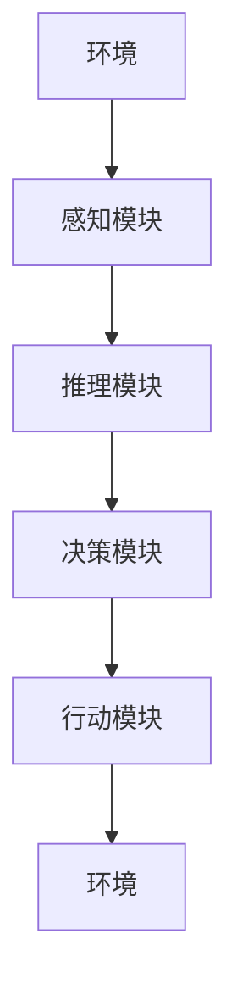

# 从零构建 AI Agent：LLM 大模型应用开发实践

> 关键词：AI Agent、LLM 大模型、应用开发、智能体、实践

> 摘要：本文围绕从零构建 AI Agent 展开，详细阐述了在 LLM 大模型基础上进行应用开发的实践过程。首先介绍了相关背景知识，包括目的、预期读者等；接着深入剖析了核心概念与联系，展示了其原理和架构；随后讲解了核心算法原理并给出 Python 源代码示例，同时介绍了数学模型和公式；通过项目实战，给出具体代码案例并进行详细解释；探讨了实际应用场景；推荐了相关工具和资源；最后总结了未来发展趋势与挑战，还设置了附录解答常见问题，并提供扩展阅读和参考资料，旨在为开发者提供全面且深入的开发指导。

## 1. 背景介绍 
### 1.1 目的和范围
在当今人工智能快速发展的时代，AI Agent 作为一种能够自主感知环境、做出决策并采取行动的智能实体，具有巨大的应用潜力。LLM（Large Language Model，大语言模型）的出现为 AI Agent 的构建提供了强大的语言处理能力。本文的目的在于指导开发者从零开始构建 AI Agent，基于 LLM 大模型进行应用开发。范围涵盖了从核心概念的理解、算法原理的掌握、数学模型的应用到项目实战的具体操作，以及实际应用场景的探讨和相关工具资源的推荐等方面。

### 1.2 预期读者
本文预期读者包括对人工智能和 AI Agent 开发感兴趣的初学者、有一定编程基础想要深入学习 LLM 应用开发的程序员、从事相关领域研究的科研人员以及希望了解 AI Agent 开发实践的技术爱好者。

### 1.3 文档结构概述
本文将按照以下结构展开：首先介绍背景知识，包括目的、预期读者和文档结构概述等；接着深入讲解核心概念与联系，包括原理和架构；然后阐述核心算法原理并给出具体操作步骤，通过 Python 源代码进行详细说明；介绍数学模型和公式并举例说明；进行项目实战，包括开发环境搭建、源代码实现和代码解读；探讨实际应用场景；推荐相关工具和资源；总结未来发展趋势与挑战；设置附录解答常见问题；最后提供扩展阅读和参考资料。

### 1.4 术语表
#### 1.4.1 核心术语定义
- **AI Agent**：即人工智能智能体，是一种能够感知环境、进行推理和决策，并采取行动以实现特定目标的智能实体。
- **LLM（Large Language Model）**：大语言模型，是基于深度学习的语言模型，具有强大的语言理解和生成能力。
- **智能体架构**：指 AI Agent 的组成结构和各部分之间的交互关系。
- **推理引擎**：用于根据输入信息和知识进行推理和决策的组件。

#### 1.4.2 相关概念解释
- **环境感知**：AI Agent 通过各种传感器或输入接口获取环境信息的过程。
- **决策制定**：根据感知到的环境信息和自身的目标，AI Agent 选择合适的行动方案的过程。
- **行动执行**：AI Agent 将决策转化为实际行动的过程。

#### 1.4.3 缩略词列表
- **LLM**：Large Language Model（大语言模型）
- **API**：Application Programming Interface（应用程序编程接口）

## 2. 核心概念与联系 
### 2.1 核心概念原理
AI Agent 的核心原理在于其能够模拟人类的智能行为，通过感知环境、处理信息、做出决策并执行行动。LLM 作为其语言处理的核心组件，为 AI Agent 提供了强大的自然语言理解和生成能力。

AI Agent 通常由以下几个主要部分组成：
- **感知模块**：负责获取环境信息，例如文本输入、图像、音频等。
- **推理模块**：利用 LLM 对感知到的信息进行处理和分析，生成推理结果。
- **决策模块**：根据推理结果和预设的目标，制定合适的行动策略。
- **行动模块**：将决策转化为实际行动，例如文本输出、调用外部 API 等。

### 2.2 架构的文本示意图
AI Agent 的架构可以用以下文本描述：

AI Agent 接收来自环境的输入信息，这些信息首先进入感知模块进行预处理。感知模块将处理后的信息传递给推理模块，推理模块利用 LLM 进行自然语言处理和推理。推理结果被发送到决策模块，决策模块根据预设的规则和目标制定行动策略。最后，行动模块根据决策结果执行相应的行动，并将结果反馈给环境。

### 2.3 Mermaid 流程图


## 3. 核心算法原理 & 具体操作步骤 
### 3.1 核心算法原理
在构建 AI Agent 时，核心算法主要涉及自然语言处理和决策制定。其中，LLM 是自然语言处理的关键。常见的 LLM 如 GPT 系列，通过预训练学习大量的文本数据，能够对输入的文本进行理解和生成。

在决策制定方面，可以采用基于规则的方法或机器学习算法。基于规则的方法根据预设的规则和条件进行决策，而机器学习算法则通过学习历史数据来优化决策策略。

### 3.2 具体操作步骤
#### 3.2.1 数据准备
首先需要收集和整理用于训练和测试的数据。数据可以包括文本语料、用户指令、环境信息等。

#### 3.2.2 模型选择和加载
选择合适的 LLM 模型，例如 Hugging Face 上的开源模型。使用相应的库加载模型，以下是使用 Python 和 Transformers 库加载模型的示例代码：
```python
from transformers import AutoTokenizer, AutoModelForCausalLM

# 选择模型名称
model_name = "gpt2"

# 加载分词器
tokenizer = AutoTokenizer.from_pretrained(model_name)

# 加载模型
model = AutoModelForCausalLM.from_pretrained(model_name)
```

#### 3.2.3 推理过程
将输入的文本进行分词处理，然后输入到模型中进行推理，得到输出结果。以下是推理过程的示例代码：
```python
# 输入文本
input_text = "今天天气怎么样？"

# 分词处理
input_ids = tokenizer.encode(input_text, return_tensors="pt")

# 推理
output = model.generate(input_ids)

# 解码输出
output_text = tokenizer.decode(output[0], skip_special_tokens=True)

print(output_text)
```

#### 3.2.4 决策制定
根据推理结果和预设的规则或目标，制定相应的行动策略。例如，如果推理结果是关于天气的信息，可以根据用户的需求提供不同的建议。

#### 3.2.5 行动执行
将决策转化为实际行动，例如输出文本、调用外部 API 等。以下是调用外部天气 API 的示例代码：
```python
import requests

# 天气 API 地址
api_url = "https://api.weather.com/weather"

# 发送请求
response = requests.get(api_url)

# 处理响应
if response.status_code == 200:
    weather_info = response.json()
    print(weather_info)
else:
    print("请求失败")
```

## 4. 数学模型和公式 & 详细讲解 & 举例说明 
### 4.1 数学模型
在 LLM 中，常见的数学模型是基于Transformer 架构的神经网络。Transformer 架构由编码器和解码器组成，通过多头自注意力机制和前馈神经网络进行信息处理。

### 4.2 公式
#### 4.2.1 自注意力机制
自注意力机制的计算公式如下：
$$
\text{Attention}(Q, K, V) = \text{softmax}(\frac{QK^T}{\sqrt{d_k}})V
$$
其中，$Q$ 是查询矩阵，$K$ 是键矩阵，$V$ 是值矩阵，$d_k$ 是键向量的维度。

#### 4.2.2 多头自注意力机制
多头自注意力机制的计算公式如下：
$$
\text{MultiHead}(Q, K, V) = \text{Concat}(\text{head}_1, \ldots, \text{head}_h)W^O
$$
其中，$\text{head}_i = \text{Attention}(QW_i^Q, KW_i^K, VW_i^V)$，$W_i^Q$、$W_i^K$、$W_i^V$ 和 $W^O$ 是可学习的参数矩阵，$h$ 是头的数量。

### 4.3 详细讲解
自注意力机制允许模型在处理序列时关注序列中的不同位置，从而捕捉序列中的长距离依赖关系。多头自注意力机制通过多个头并行计算自注意力，增加了模型的表达能力。

### 4.4 举例说明
假设我们有一个输入序列 $x = [x_1, x_2, x_3]$，其中 $x_i$ 是一个向量。首先，我们将 $x$ 分别乘以 $W^Q$、$W^K$ 和 $W^V$ 得到 $Q$、$K$ 和 $V$。然后，计算 $QK^T$ 并除以 $\sqrt{d_k}$，再通过 softmax 函数得到注意力分数。最后，将注意力分数乘以 $V$ 得到输出。

## 5. 项目实战：代码实际案例和详细解释说明 
### 5.1  开发环境搭建
#### 5.1.1 安装 Python
首先需要安装 Python 环境，建议使用 Python 3.7 及以上版本。可以从 Python 官方网站下载安装包进行安装。

#### 5.1.2 安装依赖库
使用 pip 安装所需的依赖库，例如 Transformers、requests 等。以下是安装命令：
```bash
pip install transformers requests
```

### 5.2  源代码详细实现和代码解读
以下是一个简单的 AI Agent 示例代码，实现了文本输入和输出的功能：
```python
from transformers import AutoTokenizer, AutoModelForCausalLM

# 选择模型名称
model_name = "gpt2"

# 加载分词器
tokenizer = AutoTokenizer.from_pretrained(model_name)

# 加载模型
model = AutoModelForCausalLM.from_pretrained(model_name)

def generate_response(input_text):
    # 分词处理
    input_ids = tokenizer.encode(input_text, return_tensors="pt")

    # 推理
    output = model.generate(input_ids)

    # 解码输出
    output_text = tokenizer.decode(output[0], skip_special_tokens=True)

    return output_text

while True:
    # 获取用户输入
    user_input = input("请输入文本（输入 'exit' 退出）：")

    if user_input == "exit":
        break

    # 生成响应
    response = generate_response(user_input)

    print("AI Agent 响应：", response)
```

### 5.3  代码解读与分析
- **模型加载**：使用 `AutoTokenizer` 和 `AutoModelForCausalLM` 从 Hugging Face 加载 GPT-2 模型和分词器。
- **生成响应函数**：`generate_response` 函数接收用户输入的文本，进行分词处理后输入到模型中进行推理，最后解码输出结果。
- **主循环**：通过一个无限循环不断获取用户输入，直到用户输入 'exit' 退出。对于每个用户输入，调用 `generate_response` 函数生成响应并输出。

## 6. 实际应用场景 
### 6.1 智能客服
AI Agent 可以作为智能客服，通过与用户进行自然语言交互，解答用户的问题、提供产品信息和处理客户投诉等。利用 LLM 的强大语言处理能力，能够理解用户的意图并给出准确的回答。

### 6.2 智能写作助手
AI Agent 可以辅助用户进行写作，例如提供文章大纲、优化语句、检查语法错误等。通过分析用户输入的文本，生成相关的建议和内容。

### 6.3 智能教育辅导
在教育领域，AI Agent 可以作为智能辅导工具，根据学生的学习情况和问题提供个性化的学习建议和解答。例如，解答数学难题、讲解知识点等。

### 6.4 智能家居控制
AI Agent 可以与智能家居设备进行交互，通过语音指令控制设备的开关、调节温度、播放音乐等。实现家居的智能化控制。

## 7. 工具和资源推荐
### 7.1 学习资源推荐
#### 7.1.1 书籍推荐
- 《深度学习》（Deep Learning）：由 Ian Goodfellow、Yoshua Bengio 和 Aaron Courville 合著，是深度学习领域的经典教材。
- 《Python 深度学习》（Deep Learning with Python）：由 Francois Chollet 著，介绍了如何使用 Python 和 Keras 进行深度学习开发。
- 《自然语言处理入门》（Natural Language Processing in Action）：由 Hobson Lane、Cole Howard 和 Hannes Hapke 著，系统介绍了自然语言处理的基本概念和技术。

#### 7.1.2 在线课程
- Coursera 上的“深度学习专项课程”（Deep Learning Specialization）：由 Andrew Ng 教授授课，涵盖了深度学习的各个方面。
- edX 上的“自然语言处理”（Natural Language Processing）：介绍了自然语言处理的基本算法和技术。
- 哔哩哔哩上的一些 AI 相关视频教程，如“吴恩达深度学习视频教程”等。

#### 7.1.3 技术博客和网站
- Hugging Face 官方博客：提供了关于 LLM 和自然语言处理的最新研究和技术分享。
- Medium 上的 AI 相关博客：有很多优秀的 AI 技术文章和实践经验分享。
- 机器之心：专注于人工智能领域的资讯和技术报道。

### 7.2 开发工具框架推荐
#### 7.2.1 IDE和编辑器
- PyCharm：一款功能强大的 Python 集成开发环境，提供代码编辑、调试、版本控制等功能。
- Visual Studio Code：轻量级的代码编辑器，支持多种编程语言和插件扩展。

#### 7.2.2 调试和性能分析工具
- TensorBoard：用于可视化深度学习模型的训练过程和性能指标。
- Py-Spy：一个用于分析 Python 程序性能的工具，可以查看函数调用时间和内存使用情况。

#### 7.2.3 相关框架和库
- Transformers：Hugging Face 开发的用于自然语言处理的库，提供了各种预训练模型和工具。
- PyTorch：一个开源的深度学习框架，广泛应用于自然语言处理和计算机视觉等领域。
- TensorFlow：另一个流行的深度学习框架，具有丰富的工具和库。

### 7.3 相关论文著作推荐
#### 7.3.1 经典论文
- “Attention Is All You Need”：介绍了 Transformer 架构，是自然语言处理领域的经典论文。
- “BERT: Pre-training of Deep Bidirectional Transformers for Language Understanding”：提出了 BERT 模型，开创了预训练语言模型的先河。

#### 7.3.2 最新研究成果
- 关注 ArXiv 等预印本平台上关于 LLM 和 AI Agent 的最新研究论文。
- 参加相关的学术会议，如 ACL、EMNLP 等，了解最新的研究进展。

#### 7.3.3 应用案例分析
- 研究一些成功的 AI Agent 应用案例，如 Siri、小爱同学等，分析其技术实现和应用场景。

## 8. 总结：未来发展趋势与挑战
### 8.1 未来发展趋势
- **更强的语言理解和生成能力**：随着 LLM 技术的不断发展，AI Agent 将具备更强大的语言理解和生成能力，能够处理更复杂的自然语言任务。
- **多模态融合**：AI Agent 将不仅仅局限于文本处理，还将融合图像、音频等多种模态信息，实现更加智能的交互。
- **个性化和自适应**：AI Agent 将能够根据用户的个性化需求和行为习惯进行自适应调整，提供更加个性化的服务。
- **与其他技术的融合**：AI Agent 将与区块链、物联网等技术深度融合，拓展应用场景和功能。

### 8.2 挑战
- **数据隐私和安全**：AI Agent 在处理用户数据时需要保证数据的隐私和安全，防止数据泄露和滥用。
- **计算资源需求**：LLM 模型通常需要大量的计算资源进行训练和推理，如何降低计算成本是一个挑战。
- **伦理和道德问题**：AI Agent 的决策和行为可能会对社会和人类产生影响，需要解决伦理和道德方面的问题。
- **泛化能力**：AI Agent 在不同的场景和任务中可能表现出不同的性能，如何提高其泛化能力是一个重要的研究方向。

## 9. 附录：常见问题与解答
### 9.1 问题：如何选择合适的 LLM 模型？
解答：选择合适的 LLM 模型需要考虑多个因素，如任务需求、计算资源、模型性能等。可以参考模型的官方文档、相关研究论文和社区评价，选择适合自己应用场景的模型。

### 9.2 问题：如何解决 LLM 模型的计算资源需求问题？
解答：可以采用以下方法解决计算资源需求问题：使用云服务提供商的计算资源、采用模型量化和压缩技术、优化模型架构等。

### 9.3 问题：如何保证 AI Agent 的数据隐私和安全？
解答：可以采用数据加密、访问控制、匿名化处理等技术手段保证数据隐私和安全。同时，需要遵守相关的法律法规和行业标准。

### 9.4 问题：如何提高 AI Agent 的泛化能力？
解答：可以通过增加训练数据的多样性、采用