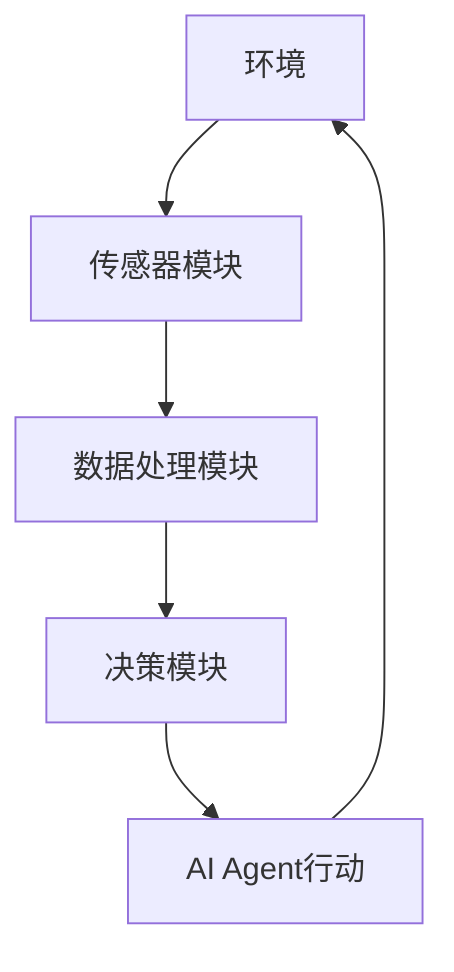

# 从零构建AI Agent的情境感知系统

> 关键词：AI Agent、情境感知系统、传感器技术、数据融合、机器学习

> 摘要：本文旨在深入探讨如何从零开始构建AI Agent的情境感知系统。详细介绍了情境感知系统的背景知识，包括目的、预期读者、文档结构和相关术语。阐述了核心概念、算法原理、数学模型，并通过Python代码进行了详细说明。结合项目实战，给出了开发环境搭建、代码实现和解读。同时，介绍了该系统的实际应用场景，推荐了相关的学习资源、开发工具和论文著作。最后总结了未来发展趋势与挑战，并提供了常见问题解答和参考资料，为开发者和研究者提供全面的指导。

## 1. 背景介绍 
### 1.1 目的和范围
情境感知系统对于AI Agent至关重要，它能让AI Agent感知周围环境的变化，并根据这些变化做出合理的决策。本文的目的是引导读者从零开始构建一个完整的AI Agent情境感知系统。范围涵盖了从基本概念的介绍，到核心算法的原理讲解，再到实际项目的开发和应用场景的探讨。通过本文，读者将能够了解情境感知系统的全貌，并具备构建一个简单情境感知系统的能力。

### 1.2 预期读者
本文的预期读者包括对AI Agent和情境感知系统感兴趣的开发者、研究人员，以及希望了解相关技术的学生。无论你是初学者还是有一定经验的专业人士，都能从本文中获得有价值的信息。对于初学者，本文将帮助你建立起对情境感知系统的基本认识；对于有经验的开发者，本文提供的详细算法和代码实现可以作为参考，用于优化和扩展自己的项目。

### 1.3 文档结构概述
本文将按照以下结构进行组织：首先介绍背景知识，包括目的、预期读者、文档结构和相关术语；接着阐述核心概念和它们之间的联系，并通过文本示意图和Mermaid流程图进行展示；然后详细讲解核心算法原理和具体操作步骤，同时给出Python源代码；再介绍数学模型和公式，并举例说明；之后进行项目实战，包括开发环境搭建、源代码实现和代码解读；随后介绍实际应用场景；接着推荐相关的工具和资源；最后总结未来发展趋势与挑战，提供常见问题解答和参考资料。

### 1.4 术语表
#### 1.4.1 核心术语定义
- **AI Agent**：能够感知环境并根据感知结果采取行动以实现特定目标的智能实体。
- **情境感知系统**：使AI Agent能够感知周围环境信息，如温度、湿度、光照等，并对这些信息进行处理和分析的系统。
- **传感器**：用于收集环境信息的设备，如温度传感器、摄像头等。
- **数据融合**：将来自多个传感器的数据进行整合和处理，以获得更准确、更全面的信息。

#### 1.4.2 相关概念解释
- **感知**：指AI Agent通过传感器获取环境信息的过程。
- **处理**：对感知到的信息进行分析、转换和解释的过程。
- **决策**：根据处理后的信息，AI Agent选择合适的行动方案的过程。

#### 1.4.3 缩略词列表
- **AI**：Artificial Intelligence（人工智能）
- **IoT**：Internet of Things（物联网）

## 2. 核心概念与联系 
### 核心概念原理
AI Agent的情境感知系统主要由传感器、数据处理模块和决策模块组成。传感器负责收集环境信息，如温度、湿度、光照强度等。数据处理模块对传感器收集到的数据进行预处理、特征提取和数据融合，以获得更有价值的信息。决策模块根据处理后的数据，结合AI Agent的目标和规则，做出相应的决策。

### 架构的文本示意图
```plaintext
+---------------------+
|     AI Agent        |
+---------------------+
| 情境感知系统       |
| +-----------------+ |
| | 传感器模块      | |
| |  - 温度传感器   | |
| |  - 湿度传感器   | |
| |  - 光照传感器   | |
| +-----------------+ |
| | 数据处理模块    | |
| |  - 数据预处理   | |
| |  - 特征提取     | |
| |  - 数据融合     | |
| +-----------------+ |
| | 决策模块        | |
| |  - 规则引擎     | |
| |  - 机器学习模型 | |
| +-----------------+ |
+---------------------+
```

### Mermaid流程图


在这个流程图中，环境信息被传感器模块收集，然后传输到数据处理模块进行处理。处理后的数据被发送到决策模块，决策模块根据这些数据做出决策，AI Agent根据决策采取行动，行动结果又会影响环境，形成一个闭环。

## 3. 核心算法原理 & 具体操作步骤 
### 核心算法原理
在情境感知系统中，常用的算法包括数据预处理算法、特征提取算法和数据融合算法。下面我们将分别介绍这些算法的原理，并给出Python源代码实现。

#### 数据预处理算法
数据预处理的目的是去除噪声、填补缺失值和归一化数据。常用的方法包括均值滤波、中位数滤波和Z-score归一化。

```python
import numpy as np

# 均值滤波
def mean_filter(data, window_size):
    filtered_data = []
    for i in range(len(data)):
        if i < window_size:
            filtered_data.append(np.mean(data[:i+1]))
        else:
            filtered_data.append(np.mean(data[i-window_size+1:i+1]))
    return np.array(filtered_data)

# Z-score归一化
def z_score_normalization(data):
    mean = np.mean(data)
    std = np.std(data)
    normalized_data = (data - mean) / std
    return normalized_data

# 示例数据
data = np.array([1, 2, 3, 4, 5, 6, 7, 8, 9, 10])
filtered_data = mean_filter(data, 3)
normalized_data = z_score_normalization(filtered_data)
print("Filtered data:", filtered_data)
print("Normalized data:", normalized_data)
```

#### 特征提取算法
特征提取的目的是从原始数据中提取出有代表性的特征。常用的方法包括时域特征提取和频域特征提取。

```python
import numpy as np
from scipy.fft import fft

# 时域特征提取：计算均值和标准差
def time_domain_features(data):
    mean = np.mean(data)
    std = np.std(data)
    return mean, std

# 频域特征提取：计算频谱幅值
def frequency_domain_features(data):
    N = len(data)
    yf = fft(data)
    amplitudes = 2.0/N * np.abs(yf[:N//2])
    return amplitudes

# 示例数据
data = np.array([1, 2, 3, 4, 5, 6, 7, 8, 9, 10])
mean, std = time_domain_features(data)
amplitudes = frequency_domain_features(data)
print("Mean:", mean)
print("Standard deviation:", std)
print("Amplitudes:", amplitudes)
```

#### 数据融合算法
数据融合的目的是将来自多个传感器的数据进行整合，以获得更准确、更全面的信息。常用的方法包括加权平均法和卡尔曼滤波法。

```python
import numpy as np

# 加权平均法
def weighted_average(data, weights):
    weighted_sum = np.sum(data * weights)
    total_weight = np.sum(weights)
    fused_data = weighted_sum / total_weight
    return fused_data

# 示例数据
data1 = np.array([1, 2, 3])
data2 = np.array([4, 5, 6])
data = np.vstack((data1, data2))
weights = np.array([0.3, 0.7])
fused_data = weighted_average(data, weights)
print("Fused data:", fused_data)
```

### 具体操作步骤
1. **传感器数据收集**：使用各种传感器收集环境信息。
2. **数据预处理**：对收集到的数据进行去噪、填补缺失值和归一化处理。
3. **特征提取**：从预处理后的数据中提取有代表性的特征。
4. **数据融合**：将来自多个传感器的特征进行融合。
5. **决策制定**：根据融合后的数据，结合AI Agent的目标和规则，做出决策。

## 4. 数学模型和公式 & 详细讲解 & 举例说明 
### 数据预处理的数学模型和公式
#### 均值滤波
均值滤波的数学公式为：
$$
y_i = \frac{1}{n} \sum_{j = i - k}^{i} x_j
$$
其中，$y_i$ 是滤波后的数据，$x_j$ 是原始数据，$n$ 是窗口大小，$k = n - 1$。

#### Z-score归一化
Z-score归一化的数学公式为：
$$
x_{norm} = \frac{x - \mu}{\sigma}
$$
其中，$x_{norm}$ 是归一化后的数据，$x$ 是原始数据，$\mu$ 是数据的均值，$\sigma$ 是数据的标准差。

### 特征提取的数学模型和公式
#### 时域特征提取
均值的数学公式为：
$$
\mu = \frac{1}{N} \sum_{i = 1}^{N} x_i
$$
标准差的数学公式为：
$$
\sigma = \sqrt{\frac{1}{N} \sum_{i = 1}^{N} (x_i - \mu)^2}
$$
其中，$N$ 是数据的长度，$x_i$ 是原始数据。

#### 频域特征提取
离散傅里叶变换（DFT）的数学公式为：
$$
X(k) = \sum_{n = 0}^{N - 1} x(n) e^{-j \frac{2 \pi}{N} k n}
$$
其中，$X(k)$ 是频域信号，$x(n)$ 是时域信号，$N$ 是数据的长度。

### 数据融合的数学模型和公式
#### 加权平均法
加权平均法的数学公式为：
$$
y = \frac{\sum_{i = 1}^{m} w_i x_i}{\sum_{i = 1}^{m} w_i}
$$
其中，$y$ 是融合后的数据，$x_i$ 是第 $i$ 个传感器的数据，$w_i$ 是第 $i$ 个传感器的权重，$m$ 是传感器的数量。

### 举例说明
假设我们有两个温度传感器，分别测量到的温度值为 $x_1 = 25^{\circ}C$ 和 $x_2 = 26^{\circ}C$，权重分别为 $w_1 = 0.4$ 和 $w_2 = 0.6$。使用加权平均法进行数据融合，可得：
$$
y = \frac{0.4 \times 25 + 0.6 \times 26}{0.4 + 0.6} = \frac{10 + 15.6}{1} = 25.6^{\circ}C
$$

## 5. 项目实战：代码实际案例和详细解释说明 
### 5.1  开发环境搭建
#### 硬件环境
- **传感器**：选择合适的传感器，如温度传感器、湿度传感器、光照传感器等。
- **开发板**：可以选择树莓派、Arduino等开发板，用于连接传感器并收集数据。

#### 软件环境
- **操作系统**：可以选择Linux系统，如Raspbian、Ubuntu等。
- **编程语言**：Python是一个不错的选择，因为它有丰富的库和工具，适合进行数据处理和机器学习。
- **开发工具**：可以使用PyCharm、VS Code等开发工具进行代码编写和调试。

### 5.2  源代码详细实现和代码解读
以下是一个简单的情境感知系统的Python代码示例，用于收集温度和湿度数据，并进行数据处理和决策。

```python
import time
import random

# 模拟传感器数据收集
def collect_sensor_data():
    temperature = random.uniform(20, 30)
    humidity = random.uniform(40, 60)
    return temperature, humidity

# 数据预处理
def preprocess_data(data):
    # 这里简单地进行归一化处理
    normalized_data = [(d - min(data)) / (max(data) - min(data)) for d in data]
    return normalized_data

# 决策制定
def make_decision(temperature, humidity):
    if temperature > 25 and humidity > 50:
        return "开启空调和除湿器"
    elif temperature > 25:
        return "开启空调"
    elif humidity > 50:
        return "开启除湿器"
    else:
        return "无需操作"

# 主程序
while True:
    temperature, humidity = collect_sensor_data()
    print(f"Temperature: {temperature}°C, Humidity: {humidity}%")
    
    data = [temperature, humidity]
    preprocessed_data = preprocess_data(data)
    
    decision = make_decision(temperature, humidity)
    print(f"Decision: {decision}")
    
    time.sleep(5)
```

### 代码解读与分析
- **collect_sensor_data函数**：模拟传感器数据收集，随机生成温度和湿度数据。
- **preprocess_data函数**：对收集到的数据进行归一化处理，将数据缩放到0到1的范围内。
- **make_decision函数**：根据温度和湿度数据，做出相应的决策。
- **主程序**：循环收集传感器数据，进行数据预处理和决策制定，并打印结果。每隔5秒进行一次数据收集和处理。

## 6. 实际应用场景 
### 智能家居
在智能家居中，AI Agent的情境感知系统可以感知室内的温度、湿度、光照等环境信息，并根据这些信息自动调节空调、加湿器、灯光等设备的状态，提供舒适的居住环境。

### 智能交通
在智能交通中，情境感知系统可以感知车辆的位置、速度、行驶方向等信息，以及道路的交通状况，为自动驾驶车辆提供决策支持，提高交通安全性和效率。

### 工业自动化
在工业自动化中，情境感知系统可以感知生产设备的运行状态、环境参数等信息，及时发现设备故障和异常情况，实现自动化生产和智能管理。

### 医疗保健
在医疗保健中，情境感知系统可以感知患者的生命体征、活动状态等信息，为医生提供实时的健康数据，辅助诊断和治疗。

## 7. 工具和资源推荐
### 7.1 学习资源推荐
#### 7.1.1 书籍推荐
- 《人工智能：一种现代的方法》：全面介绍了人工智能的基本概念、算法和应用。
- 《机器学习》：详细讲解了机器学习的各种算法和模型。
- 《传感器技术》：介绍了各种传感器的原理、应用和设计方法。

#### 7.1.2 在线课程
- Coursera上的“人工智能基础”课程：由知名教授授课，系统地介绍了人工智能的基础知识。
- edX上的“机器学习”课程：提供了丰富的实践项目和案例，帮助学生掌握机器学习的应用。

#### 7.1.3 技术博客和网站
- Medium：有很多关于人工智能和情境感知系统的技术文章和案例分享。
- Towards Data Science：专注于数据科学和机器学习领域的技术博客。

### 7.2 开发工具框架推荐
#### 7.2.1 IDE和编辑器
- PyCharm：专业的Python集成开发环境，提供了丰富的代码编辑、调试和分析功能。
- VS Code：轻量级的代码编辑器，支持多种编程语言和插件扩展。

#### 7.2.2 调试和性能分析工具
- PDB：Python自带的调试工具，用于调试Python代码。
- cProfile：Python的性能分析工具，用于分析代码的执行时间和性能瓶颈。

#### 7.2.3 相关框架和库
- NumPy：用于科学计算和数值处理的Python库。
- Pandas：用于数据处理和分析的Python库。
- Scikit-learn：用于机器学习的Python库，提供了各种机器学习算法和模型。

### 7.3 相关论文著作推荐
#### 7.3.1 经典论文
- “A Context-Aware Computing Architecture for Smart Homes”：介绍了智能家居中的情境感知计算架构。
- “Sensor Data Fusion: An Introduction”：对传感器数据融合技术进行了全面的介绍。

#### 7.3.2 最新研究成果
- 可以通过IEEE Xplore、ACM Digital Library等学术数据库搜索最新的关于情境感知系统的研究论文。

#### 7.3.3 应用案例分析
- 一些科技公司的官方博客和研究报告中会分享情境感知系统的应用案例，可以从中学习到实际应用中的经验和技巧。

## 8. 总结：未来发展趋势与挑战
### 未来发展趋势
- **多模态感知**：未来的情境感知系统将不仅仅依赖于单一类型的传感器，而是会融合多种传感器的数据，如视觉、听觉、触觉等，实现更全面、更准确的环境感知。
- **智能化决策**：随着人工智能技术的不断发展，情境感知系统将具备更强的智能化决策能力，能够根据复杂的环境信息和用户需求做出更加合理的决策。
- **与物联网的深度融合**：情境感知系统将与物联网技术深度融合，实现设备之间的互联互通和协同工作，为用户提供更加智能、便捷的服务。

### 挑战
- **数据隐私和安全**：情境感知系统需要收集大量的用户数据，如何保护这些数据的隐私和安全是一个重要的挑战。
- **传感器精度和可靠性**：传感器的精度和可靠性直接影响到情境感知系统的性能，如何提高传感器的质量和稳定性是一个亟待解决的问题。
- **算法复杂度和计算资源**：随着情境感知系统的功能不断增强，算法的复杂度也会不断提高，如何在有限的计算资源下实现高效的算法是一个挑战。

## 9. 附录：常见问题与解答
### 问题1：如何选择合适的传感器？
解答：选择合适的传感器需要考虑多个因素，如测量范围、精度、响应时间、成本等。根据具体的应用场景和需求，选择能够满足要求的传感器。

### 问题2：数据融合的方法有哪些？
解答：常见的数据融合方法包括加权平均法、卡尔曼滤波法、贝叶斯融合法等。不同的方法适用于不同的场景，需要根据具体情况选择合适的方法。

### 问题3：如何提高情境感知系统的性能？
解答：可以从多个方面提高情境感知系统的性能，如选择高精度的传感器、优化数据处理算法、提高决策模型的准确性等。

## 10. 扩展阅读 & 参考资料
### 扩展阅读
- 《深度学习》：深入介绍了深度学习的原理和应用，对于理解情境感知系统中的机器学习算法有很大帮助。
- 《智能传感器系统设计》：详细讲解了智能传感器的设计和开发方法。

### 参考资料
- IEEE Transactions on Mobile Computing：关于移动计算和情境感知系统的权威学术期刊。
- ACM SIGMOBILE：专注于移动计算和无线通信领域的学术组织，提供了丰富的研究资源和会议信息。

作者：AI天才研究院/AI Genius Institute & 禅与计算机程序设计艺术 /Zen And The Art of Computer Programming