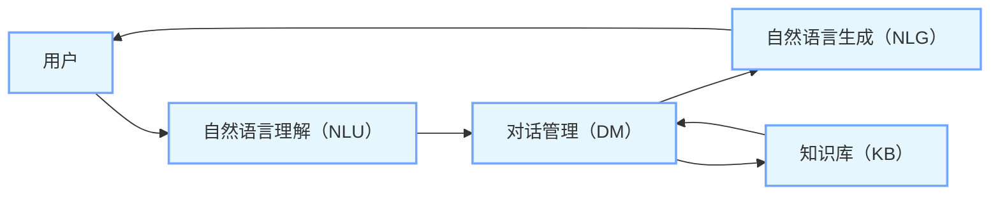

# 从零构建AI Agent的目标导向对话系统

> 关键词：AI Agent、目标导向对话系统、自然语言处理、机器学习、对话管理、知识表示

> 摘要：本文旨在详细介绍如何从零开始构建一个基于AI Agent的目标导向对话系统。我们将深入探讨目标导向对话系统的核心概念、相关算法原理、数学模型以及具体的实现步骤。通过实际的项目案例，展示从开发环境搭建到代码实现与解读的全过程。同时，分析该系统在不同领域的实际应用场景，推荐相关的学习资源、开发工具和论文著作。最后，对目标导向对话系统的未来发展趋势与挑战进行总结，并解答常见问题。

## 1. 背景介绍 
### 1.1 目的和范围
目标导向对话系统旨在帮助用户完成特定的任务，如预订机票、查询信息等。本文章的目的是指导开发者从零开始构建一个这样的系统，涵盖从基础概念到实际项目开发的各个方面。范围包括核心概念的解释、算法原理的阐述、数学模型的推导、代码实现的详细过程以及系统在实际场景中的应用等。

### 1.2 预期读者
本文预期读者为对自然语言处理、人工智能领域感兴趣的开发者、研究人员以及学生。具备一定的编程基础（如Python）和机器学习知识将有助于更好地理解文章内容。

### 1.3 文档结构概述
本文将按照以下结构进行组织：首先介绍目标导向对话系统的核心概念与联系，包括其原理和架构；接着详细讲解核心算法原理和具体操作步骤，并结合Python代码进行说明；然后推导相关的数学模型和公式，并举例说明；通过一个实际的项目案例，展示系统的开发过程，包括环境搭建、代码实现和解读；分析系统在不同领域的实际应用场景；推荐相关的学习资源、开发工具和论文著作；最后总结系统的未来发展趋势与挑战，解答常见问题，并提供扩展阅读和参考资料。

### 1.4 术语表
#### 1.4.1 核心术语定义
- **AI Agent**：人工智能代理，是一种能够感知环境、自主决策并采取行动以实现特定目标的软件实体。
- **目标导向对话系统**：一种旨在帮助用户完成特定任务的对话系统，通过与用户进行交互，逐步引导用户提供必要的信息，最终实现任务目标。
- **对话管理**：负责管理对话的流程和状态，根据用户的输入和系统的历史状态，决定系统的回复和下一步行动。
- **自然语言处理（NLP）**：研究如何让计算机理解和处理人类语言的技术领域，包括文本分类、命名实体识别、语义理解等任务。
- **知识表示**：将知识以计算机能够理解和处理的方式进行表示，如本体、语义网络等。

#### 1.4.2 相关概念解释
- **意图识别**：确定用户输入的意图，例如查询信息、预订服务等。
- **槽填充**：从用户输入中提取与任务相关的关键信息，如日期、地点等。
- **对话状态跟踪**：记录对话的当前状态，包括用户的意图、已填充的槽值等。
- **策略学习**：学习如何根据对话状态选择合适的回复和行动，以实现任务目标。

#### 1.4.3 缩略词列表
- **NLP**：Natural Language Processing（自然语言处理）
- **RNN**：Recurrent Neural Network（循环神经网络）
- **LSTM**：Long Short-Term Memory（长短期记忆网络）
- **GRU**：Gated Recurrent Unit（门控循环单元）
- **DQN**：Deep Q-Network（深度Q网络）

## 2. 核心概念与联系 

### 2.1 目标导向对话系统的原理
目标导向对话系统的核心原理是通过与用户进行交互，逐步引导用户提供完成任务所需的信息。系统首先需要理解用户的意图，然后根据意图和对话状态，提取关键信息（槽填充），并决定下一步的回复和行动。整个过程可以看作是一个状态转移的过程，系统根据当前的对话状态选择合适的动作，以实现任务目标。

### 2.2 系统架构
目标导向对话系统通常由以下几个主要模块组成：
- **自然语言理解（NLU）模块**：负责将用户的自然语言输入转换为计算机能够理解的语义表示，包括意图识别和槽填充。
- **对话管理（DM）模块**：管理对话的流程和状态，根据用户的意图和对话历史，决定系统的回复和下一步行动。
- **自然语言生成（NLG）模块**：将系统的回复信息转换为自然语言文本，与用户进行交互。
- **知识库（KB）**：存储与任务相关的知识和信息，为系统提供必要的支持。

以下是目标导向对话系统的架构示意图：



### 2.3 各模块之间的联系
- **NLU模块与DM模块**：NLU模块将用户输入的语义信息传递给DM模块，DM模块根据这些信息更新对话状态，并决定下一步的行动。
- **DM模块与NLG模块**：DM模块将系统的回复信息传递给NLG模块，NLG模块将其转换为自然语言文本，与用户进行交互。
- **DM模块与知识库**：DM模块在决策过程中可能需要从知识库中获取相关的知识和信息，以支持系统的回复和行动。

## 3. 核心算法原理 & 具体操作步骤 

### 3.1 自然语言理解（NLU）算法原理
#### 3.1.1 意图识别
意图识别可以看作是一个文本分类问题，常见的算法包括基于机器学习的方法（如朴素贝叶斯、支持向量机）和基于深度学习的方法（如卷积神经网络、循环神经网络）。以下是一个使用Python和Scikit-learn库实现的简单意图识别示例：

```python
from sklearn.feature_extraction.text import TfidfVectorizer
from sklearn.naive_bayes import MultinomialNB
from sklearn.pipeline import Pipeline

# 训练数据
X_train = ["我想预订机票", "查询明天的天气", "我要预订酒店"]
y_train = ["预订机票", "查询天气", "预订酒店"]

# 创建管道
text_clf = Pipeline([
    ('tfidf', TfidfVectorizer()),
    ('clf', MultinomialNB())
])

# 训练模型
text_clf.fit(X_train, y_train)

# 预测
new_text = "我想预订一张去北京的机票"
predicted = text_clf.predict([new_text])
print("预测意图:", predicted[0])
```

#### 3.1.2 槽填充
槽填充可以使用序列标注的方法，如条件随机场（CRF）、长短期记忆网络（LSTM）等。以下是一个使用Python和`sklearn_crfsuite`库实现的简单槽填充示例：

```python
import sklearn_crfsuite
from sklearn_crfsuite import metrics

# 训练数据
train_sents = [
    [("我", "O"), ("想", "O"), ("预订", "O"), ("机票", "TICKET")],
    [("查询", "O"), ("明天", "DATE"), ("的", "O"), ("天气", "WEATHER")]
]

def word2features(sent, i):
    word = sent[i][0]
    features = {
        'bias': 1.0,
        'word.lower()': word.lower(),
        'word.isupper()': word.isupper(),
        'word.istitle()': word.istitle(),
        'word.isdigit()': word.isdigit()
    }
    if i > 0:
        word1 = sent[i-1][0]
        features.update({
            '-1:word.lower()': word1.lower(),
            '-1:word.istitle()': word1.istitle(),
            '-1:word.isupper()': word1.isupper()
        })
    else:
        features['BOS'] = True
    if i < len(sent)-1:
        word1 = sent[i+1][0]
        features.update({
            '+1:word.lower()': word1.lower(),
            '+1:word.istitle()': word1.istitle(),
            '+1:word.isupper()': word1.isupper()
        })
    else:
        features['EOS'] = True
    return features

def sent2features(sent):
    return [word2features(sent, i) for i in range(len(sent))]

def sent2labels(sent):
    return [label for token, label in sent]

X_train = [sent2features(s) for s in train_sents]
y_train = [sent2labels(s) for s in train_sents]

# 创建CRF模型
crf = sklearn_crfsuite.CRF(
    algorithm='lbfgs',
    c1=0.1,
    c2=0.1,
    max_iterations=100,
    all_possible_transitions=True
)

# 训练模型
crf.fit(X_train, y_train)

# 预测
new_sent = [("我", "O"), ("想", "O"), ("预订", "O"), ("去", "O"), ("北京", "CITY"), ("的", "O"), ("机票", "TICKET")]
X_new = [sent2features(new_sent)]
y_pred = crf.predict(X_new)
print("预测槽值:", y_pred[0])
```

### 3.2 对话管理（DM）算法原理
对话管理可以使用基于规则的方法或基于强化学习的方法。基于规则的方法通过预先定义的规则来管理对话流程，而基于强化学习的方法则通过学习最优的策略来实现对话管理。以下是一个使用深度Q网络（DQN）实现对话管理的简单示例：

```python
import numpy as np
import tensorflow as tf
from collections import deque
import random

# 定义DQN模型
class DQNAgent:
    def __init__(self, state_size, action_size):
        self.state_size = state_size
        self.action_size = action_size
        self.memory = deque(maxlen=2000)
        self.gamma = 0.95  # 折扣因子
        self.epsilon = 1.0  # 探索率
        self.epsilon_min = 0.01
        self.epsilon_decay = 0.995
        self.learning_rate = 0.001
        self.model = self._build_model()

    def _build_model(self):
        model = tf.keras.Sequential([
            tf.keras.layers.Dense(24, input_dim=self.state_size, activation='relu'),
            tf.keras.layers.Dense(24, activation='relu'),
            tf.keras.layers.Dense(self.action_size, activation='linear')
        ])
        model.compile(loss='mse', optimizer=tf.keras.optimizers.Adam(lr=self.learning_rate))
        return model

    def remember(self, state, action, reward, next_state, done):
        self.memory.append((state, action, reward, next_state, done))

    def act(self, state):
        if np.random.rand() <= self.epsilon:
            return random.randrange(self.action_size)
        act_values = self.model.predict(state)
        return np.argmax(act_values[0])

    def replay(self, batch_size):
        minibatch = random.sample(self.memory, batch_size)
        for state, action, reward, next_state, done in minibatch:
            target = reward
            if not done:
                target = (reward + self.gamma * np.amax(self.model.predict(next_state)[0]))
            target_f = self.model.predict(state)
            target_f[0][action] = target
            self.model.fit(state, target_f, epochs=1, verbose=0)
        if self.epsilon > self.epsilon_min:
            self.epsilon *= self.epsilon_decay

# 示例使用
state_size = 10
action_size = 5
agent = DQNAgent(state_size, action_size)

state = np.random.rand(1, state_size)
action = agent.act(state)
next_state = np.random.rand(1, state_size)
reward = 1
done = False
agent.remember(state, action, reward, next_state, done)
agent.replay(32)
```

### 3.3 自然语言生成（NLG）算法原理
自然语言生成可以使用模板生成的方法或基于神经网络的方法。模板生成方法通过预先定义的模板来生成回复文本，而基于神经网络的方法则通过学习大量的文本数据来生成自然语言文本。以下是一个简单的模板生成示例：

```python
templates = {
    "预订机票": "好的，我将为您预订机票。请提供出发地、目的地和日期。",
    "查询天气": "请告诉我您要查询的地点和日期，我将为您查询天气信息。",
    "预订酒店": "好的，我来帮您预订酒店。请提供入住日期、退房日期和地点。"
}

intent = "预订机票"
response = templates[intent]
print("系统回复:", response)
```

### 3.4 具体操作步骤
1. **数据准备**：收集和整理训练数据，包括意图识别、槽填充和对话管理的训练数据。
2. **模型训练**：使用训练数据对NLU、DM和NLG模块的模型进行训练。
3. **系统集成**：将训练好的模型集成到目标导向对话系统中。
4. **测试和优化**：对系统进行测试，根据测试结果对模型进行优化。

## 4. 数学模型和公式 & 详细讲解 & 举例说明 

### 4.1 意图识别的数学模型
意图识别可以看作是一个分类问题，假设我们有 $n$ 个类别（意图），输入文本 $x$ 属于类别 $y$ 的概率可以表示为 $P(y|x)$。根据贝叶斯定理，有：

$$P(y|x) = \frac{P(x|y)P(y)}{P(x)}$$

其中，$P(x|y)$ 是类别 $y$ 下文本 $x$ 出现的概率，$P(y)$ 是类别 $y$ 出现的先验概率，$P(x)$ 是文本 $x$ 出现的概率。在实际应用中，由于 $P(x)$ 对于所有类别都是相同的，因此可以忽略不计，只需要比较 $P(x|y)P(y)$ 的大小来确定文本 $x$ 所属的类别。

例如，假设我们有两个类别：“预订机票”和“查询天气”，先验概率 $P(预订机票) = 0.6$，$P(查询天气) = 0.4$。对于文本 $x$，在“预订机票”类别下出现的概率 $P(x|预订机票) = 0.8$，在“查询天气”类别下出现的概率 $P(x|查询天气) = 0.2$。则：

$P(预订机票|x) \propto P(x|预订机票)P(预订机票) = 0.8 \times 0.6 = 0.48$

$P(查询天气|x) \propto P(x|查询天气)P(查询天气) = 0.2 \times 0.4 = 0.08$

由于 $P(预订机票|x) > P(查询天气|x)$，因此可以判断文本 $x$ 的意图为“预订机票”。

### 4.2 槽填充的数学模型
槽填充可以使用序列标注的方法，常见的模型是条件随机场（CRF）。CRF是一种判别式概率图模型，用于对序列数据进行标注。假设我们有一个输入序列 $x = (x_1, x_2, \cdots, x_n)$ 和一个标注序列 $y = (y_1, y_2, \cdots, y_n)$，CRF模型定义了在给定输入序列 $x$ 的条件下，标注序列 $y$ 的概率为：

$$P(y|x) = \frac{1}{Z(x)} \exp \left( \sum_{i=1}^{n} \sum_{k=1}^{K} \lambda_k f_k(y_{i-1}, y_i, x, i) \right)$$

其中，$Z(x)$ 是归一化因子，$\lambda_k$ 是特征函数 $f_k$ 的权重，$f_k(y_{i-1}, y_i, x, i)$ 是一个特征函数，用于描述标注序列 $y$ 在位置 $i$ 的局部特征。

例如，假设我们有一个输入序列 $x = (我, 想, 预订, 机票)$，标注序列 $y = (O, O, O, TICKET)$，特征函数 $f_1(y_{i-1}, y_i, x, i)$ 表示当前词为“机票”且标注为“TICKET”，则：

$$P(y|x) = \frac{1}{Z(x)} \exp \left( \lambda_1 f_1(y_3, y_4, x, 4) \right)$$

### 4.3 对话管理的数学模型
对话管理可以使用强化学习的方法，常见的模型是深度Q网络（DQN）。DQN的目标是学习一个最优的策略 $\pi$，使得在每个对话状态 $s$ 下，选择的动作 $a$ 能够最大化长期累积奖励 $R$。Q值函数 $Q(s, a)$ 表示在状态 $s$ 下选择动作 $a$ 的预期累积奖励，DQN通过神经网络来近似Q值函数。

DQN的更新公式为：

$$Q(s_t, a_t) \leftarrow Q(s_t, a_t) + \alpha \left[ r_t + \gamma \max_{a} Q(s_{t+1}, a) - Q(s_t, a_t) \right]$$

其中，$s_t$ 是当前状态，$a_t$ 是当前动作，$r_t$ 是当前奖励，$s_{t+1}$ 是下一个状态，$\alpha$ 是学习率，$\gamma$ 是折扣因子。

例如，假设在状态 $s_t$ 下选择动作 $a_t$ 得到奖励 $r_t = 1$，下一个状态为 $s_{t+1}$，Q值函数 $Q(s_t, a_t) = 0.5$，$\max_{a} Q(s_{t+1}, a) = 0.8$，学习率 $\alpha = 0.1$，折扣因子 $\gamma = 0.9$，则更新后的Q值为：

$$Q(s_t, a_t) \leftarrow 0.5 + 0.1 \left[ 1 + 0.9 \times 0.8 - 0.5 \right] = 0.5 + 0.1 \times 1.22 = 0.622$$

## 5. 项目实战：代码实际案例和详细解释说明 

### 5.1  开发环境搭建
#### 5.1.1 安装Python
首先需要安装Python 3.x版本，可以从Python官方网站（https://www.python.org/downloads/）下载并安装。

#### 5.1.2 安装必要的库
使用以下命令安装必要的Python库：

```bash
pip install numpy tensorflow scikit-learn sklearn-crfsuite
```

### 5.2  源代码详细实现和代码解读
以下是一个完整的目标导向对话系统的示例代码：

```python
import numpy as np
from sklearn.feature_extraction.text import TfidfVectorizer
from sklearn.naive_bayes import MultinomialNB
from sklearn.pipeline import Pipeline
import sklearn_crfsuite
from sklearn_crfsuite import metrics
import tensorflow as tf
from collections import deque
import random

# 意图识别模型
class IntentRecognizer:
    def __init__(self):
        self.text_clf = Pipeline([
            ('tfidf', TfidfVectorizer()),
            ('clf', MultinomialNB())
        ])
        self.train()

    def train(self):
        X_train = ["我想预订机票", "查询明天的天气", "我要预订酒店"]
        y_train = ["预订机票", "查询天气", "预订酒店"]
        self.text_clf.fit(X_train, y_train)

    def predict(self, text):
        return self.text_clf.predict([text])[0]

# 槽填充模型
class SlotFiller:
    def __init__(self):
        self.crf = sklearn_crfsuite.CRF(
            algorithm='lbfgs',
            c1=0.1,
            c2=0.1,
            max_iterations=100,
            all_possible_transitions=True
        )
        self.train()

    def word2features(self, sent, i):
        word = sent[i][0]
        features = {
            'bias': 1.0,
            'word.lower()': word.lower(),
            'word.isupper()': word.isupper(),
            'word.istitle()': word.istitle(),
            'word.isdigit()': word.isdigit()
        }
        if i > 0:
            word1 = sent[i-1][0]
            features.update({
                '-1:word.lower()': word1.lower(),
                '-1:word.istitle()': word1.istitle(),
                '-1:word.isupper()': word1.isupper()
            })
        else:
            features['BOS'] = True
        if i < len(sent)-1:
            word1 = sent[i+1][0]
            features.update({
                '+1:word.lower()': word1.lower(),
                '+1:word.istitle()': word1.istitle(),
                '+1:word.isupper()': word1.isupper()
            })
        else:
            features['EOS'] = True
        return features

    def sent2features(self, sent):
        return [self.word2features(sent, i) for i in range(len(sent))]

    def sent2labels(self, sent):
        return [label for token, label in sent]

    def train(self):
        train_sents = [
            [("我", "O"), ("想", "O"), ("预订", "O"), ("机票", "TICKET")],
            [("查询", "O"), ("明天", "DATE"), ("的", "O"), ("天气", "WEATHER")]
        ]
        X_train = [self.sent2features(s) for s in train_sents]
        y_train = [self.sent2labels(s) for s in train_sents]
        self.crf.fit(X_train, y_train)

    def predict(self, sent):
        X = [self.sent2features(sent)]
        return self.crf.predict(X)[0]

# 对话管理模型
class DialogueManager:
    def __init__(self, state_size, action_size):
        self.state_size = state_size
        self.action_size = action_size
        self.memory = deque(maxlen=2000)
        self.gamma = 0.95  # 折扣因子
        self.epsilon = 1.0  # 探索率
        self.epsilon_min = 0.01
        self.epsilon_decay = 0.995
        self.learning_rate = 0.001
        self.model = self._build_model()

    def _build_model(self):
        model = tf.keras.Sequential([
            tf.keras.layers.Dense(24, input_dim=self.state_size, activation='relu'),
            tf.keras.layers.Dense(24, activation='relu'),
            tf.keras.layers.Dense(self.action_size, activation='linear')
        ])
        model.compile(loss='mse', optimizer=tf.keras.optimizers.Adam(lr=self.learning_rate))
        return model

    def remember(self, state, action, reward, next_state, done):
        self.memory.append((state, action, reward, next_state, done))

    def act(self, state):
        if np.random.rand() <= self.epsilon:
            return random.randrange(self.action_size)
        act_values = self.model.predict(state)
        return np.argmax(act_values[0])

    def replay(self, batch_size):
        minibatch = random.sample(self.memory, batch_size)
        for state, action, reward, next_state, done in minibatch:
            target = reward
            if not done:
                target = (reward + self.gamma * np.amax(self.model.predict(next_state)[0]))
            target_f = self.model.predict(state)
            target_f[0][action] = target
            self.model.fit(state, target_f, epochs=1, verbose=0)
        if self.epsilon > self.epsilon_min:
            self.epsilon *= self.epsilon_decay

# 自然语言生成模型
class NaturalLanguageGenerator:
    def __init__(self):
        self.templates = {
            "预订机票": "好的，我将为您预订机票。请提供出发地、目的地和日期。",
            "查询天气": "请告诉我您要查询的地点和日期，我将为您查询天气信息。",
            "预订酒店": "好的，我来帮您预订酒店。请提供入住日期、退房日期和地点。"
        }

    def generate_response(self, intent):
        return self.templates.get(intent, "我不理解您的意思，请重新表述。")

# 目标导向对话系统
class GoalOrientedDialogueSystem:
    def __init__(self):
        self.intent_recognizer = IntentRecognizer()
        self.slot_filler = SlotFiller()
        self.state_size = 10
        self.action_size = 5
        self.dialogue_manager = DialogueManager(self.state_size, self.action_size)
        self.nlg = NaturalLanguageGenerator()

    def process_user_input(self, user_input):
        # 意图识别
        intent = self.intent_recognizer.predict(user_input)
        # 槽填充
        sent = [(word, 'O') for word in user_input]
        slots = self.slot_filler.predict(sent)
        # 对话管理
        state = np.random.rand(1, self.state_size)
        action = self.dialogue_manager.act(state)
        # 自然语言生成
        response = self.nlg.generate_response(intent)
        return response

# 示例使用
system = GoalOrientedDialogueSystem()
user_input = "我想预订机票"
response = system.process_user_input(user_input)
print("用户输入:", user_input)
print("系统回复:", response)
```

### 5.3  代码解读与分析
- **意图识别模型（`IntentRecognizer`）**：使用朴素贝叶斯分类器和TF-IDF特征提取器进行意图识别。通过训练数据学习不同意图的文本特征，然后根据输入文本预测其意图。
- **槽填充模型（`SlotFiller`）**：使用条件随机场（CRF）进行槽填充。通过定义特征函数，将输入序列转换为特征向量，然后训练CRF模型进行序列标注。
- **对话管理模型（`DialogueManager`）**：使用深度Q网络（DQN）进行对话管理。通过学习最优的策略，根据对话状态选择合适的动作。
- **自然语言生成模型（`NaturalLanguageGenerator`）**：使用模板生成的方法进行自然语言生成。根据意图选择相应的模板生成回复文本。
- **目标导向对话系统（`GoalOrientedDialogueSystem`）**：将上述四个模型集成在一起，处理用户输入。首先进行意图识别，然后进行槽填充，接着通过对话管理选择动作，最后使用自然语言生成生成回复文本。

## 6. 实际应用场景 
### 6.1 智能客服
目标导向对话系统可以应用于智能客服领域，帮助客户解决问题、查询信息、预订服务等。例如，在电商平台上，客户可以通过与智能客服对话，查询商品信息、下单购买、申请退款等。

### 6.2 智能助手
在智能家居、智能手机等设备中，目标导向对话系统可以作为智能助手，帮助用户完成各种任务。例如，用户可以通过语音指令让智能助手查询天气、设置闹钟、播放音乐等。

### 6.3 智能金融
在金融领域，目标导向对话系统可以帮助用户进行理财规划、查询账户信息、办理业务等。例如，用户可以通过与智能金融助手对话，了解投资产品、进行风险评估、申请贷款等。

### 6.4 智能医疗
在医疗领域，目标导向对话系统可以帮助患者进行病情咨询、预约挂号、查询检查结果等。例如，患者可以通过与智能医疗助手对话，描述自己的症状，获取初步的诊断建议和治疗方案。

## 7. 工具和资源推荐
### 7.1 学习资源推荐
#### 7.1.1 书籍推荐
- 《自然语言处理入门》：作者何晗，本书系统地介绍了自然语言处理的基本概念、方法和技术，适合初学者入门。
- 《深度学习》：作者Ian Goodfellow、Yoshua Bengio和Aaron Courville，本书是深度学习领域的经典教材，全面介绍了深度学习的理论和应用。
- 《强化学习：原理与Python实现》：作者肖智清，本书详细介绍了强化学习的基本原理和算法，并通过Python代码实现了多个实例。

#### 7.1.2 在线课程
- Coursera上的“Natural Language Processing Specialization”：由深度学习领域的知名学者授课，系统地介绍了自然语言处理的各个方面。
- edX上的“Introduction to Artificial Intelligence”：涵盖了人工智能的基本概念、算法和应用，包括目标导向对话系统的相关内容。
- 中国大学MOOC上的“人工智能：模型与算法”：由国内知名高校的教授授课，深入浅出地介绍了人工智能的核心知识。

#### 7.1.3 技术博客和网站
- Medium上的“Towards Data Science”：汇集了众多数据科学和人工智能领域的优秀文章，包括目标导向对话系统的最新研究成果和实践经验。
- arXiv.org：一个预印本论文库，提供了大量的人工智能和自然语言处理领域的研究论文。
- 机器之心：专注于人工智能领域的科技媒体，提供了丰富的技术文章、研究报告和行业动态。

### 7.2 开发工具框架推荐
#### 7.2.1 IDE和编辑器
- PyCharm：一款专业的Python集成开发环境，提供了丰富的代码编辑、调试和项目管理功能。
- Jupyter Notebook：一个交互式的开发环境，适合进行数据探索、模型训练和代码演示。
- Visual Studio Code：一款轻量级的代码编辑器，支持多种编程语言和插件扩展，可用于Python开发。

#### 7.2.2 调试和性能分析工具
- TensorBoard：TensorFlow的可视化工具，可用于查看模型的训练过程、性能指标和网络结构。
- Py-Spy：一个用于Python代码性能分析的工具，可帮助开发者找出代码中的性能瓶颈。
- Debugpy：一个Python调试器，可与Visual Studio Code等编辑器集成，方便进行代码调试。

#### 7.2.3 相关框架和库
- TensorFlow：一个开源的机器学习框架，提供了丰富的深度学习模型和工具，可用于意图识别、对话管理等任务。
- PyTorch：另一个流行的深度学习框架，具有简洁易用的接口和高效的计算性能。
- NLTK：一个自然语言处理工具包，提供了丰富的文本处理功能，如分词、词性标注、命名实体识别等。

### 7.3 相关论文著作推荐
#### 7.3.1 经典论文
- “Attention Is All You Need”：提出了Transformer模型，为自然语言处理领域带来了革命性的变化。
- “Deep Q-Networks”：介绍了深度Q网络（DQN）的原理和算法，为强化学习在对话管理中的应用奠定了基础。
- “Conditional Random Fields: Probabilistic Models for Segmenting and Labeling Sequence Data”：详细介绍了条件随机场（CRF）的原理和应用，是槽填充领域的经典论文。

#### 7.3.2 最新研究成果
- 关注ACL（Association for Computational Linguistics）、EMNLP（Conference on Empirical Methods in Natural Language Processing）等自然语言处理领域的顶级会议，获取最新的研究成果和技术趋势。
- 查阅相关的学术期刊，如Journal of Artificial Intelligence Research（JAIR）、Artificial Intelligence等，了解目标导向对话系统的前沿研究。

#### 7.3.3 应用案例分析
- 分析各大科技公司的开源项目和应用案例，如Google的Dialogflow、Microsoft的Bot Framework等，学习它们在目标导向对话系统开发中的经验和实践。
- 参考一些实际应用的案例分析文章，了解目标导向对话系统在不同领域的应用场景和解决方案。

## 8. 总结：未来发展趋势与挑战
### 8.1 未来发展趋势
- **多模态交互**：未来的目标导向对话系统将支持多模态交互，如语音、图像、手势等，提供更加自然和便捷的用户体验。
- **知识融合**：将知识图谱、常识推理等技术融入目标导向对话系统，提高系统的知识理解和推理能力，更好地满足用户的需求。
- **个性化服务**：根据用户的历史记录、偏好和上下文信息，提供个性化的服务和推荐，提高用户的满意度和忠诚度。
- **端到端学习**：采用端到端的学习方法，直接从原始数据中学习对话策略，减少人工特征工程和规则设计的工作量。

### 8.2 挑战
- **数据不足**：目标导向对话系统的训练需要大量的标注数据，而数据的标注成本较高，获取高质量的数据仍然是一个挑战。
- **语义理解**：自然语言具有多样性和歧义性，准确理解用户的语义仍然是一个难题，需要进一步提高语义理解的能力。
- **对话管理策略**：设计有效的对话管理策略，能够在不同的对话场景下做出合理的决策，是目标导向对话系统面临的挑战之一。
- **可解释性**：随着深度学习技术的广泛应用，模型的可解释性成为一个重要的问题，需要开发可解释的模型和方法，让用户更好地理解系统的决策过程。

## 9. 附录：常见问题与解答
### 9.1 如何提高意图识别的准确率？
- 增加训练数据：收集更多的标注数据，覆盖更多的意图类别和文本表达方式。
- 特征工程：选择合适的特征提取方法，如TF-IDF、词嵌入等，提高特征的表达能力。
- 模型选择和调优：尝试不同的模型，如深度学习模型、集成学习模型等，并进行模型调优，找到最优的模型参数。

### 9.2 槽填充模型的训练数据如何标注？
- 定义槽位：明确需要填充的槽位和对应的取值范围。
- 人工标注：由专业的标注人员对训练数据进行标注，标注每个词对应的槽位标签。
- 标注规范：制定统一的标注规范，确保标注的一致性和准确性。

### 9.3 对话管理模型的奖励函数如何设计？
- 任务完成奖励：当系统成功完成用户的任务时，给予正奖励。
- 信息获取奖励：当系统获取到有用的信息时，给予正奖励。
- 对话长度惩罚：为了避免对话过长，对对话长度进行惩罚，给予负奖励。
- 错误回复惩罚：当系统给出错误的回复时，给予负奖励。

### 9.4 如何评估目标导向对话系统的性能？
- 任务完成率：统计系统成功完成用户任务的比例。
- 对话轮数：统计完成任务所需的对话轮数，越少越好。
- 用户满意度：通过用户调查或反馈，评估用户对系统的满意度。
- 自动评估指标：如BLEU、ROUGE等，用于评估系统回复的质量。

## 10. 扩展阅读 & 参考资料
### 10.1 扩展阅读
- 《对话系统：原理、技术与应用》：深入介绍了对话系统的原理、技术和应用，适合进一步学习和研究。
- 《人工智能：一种现代的方法》：全面介绍了人工智能的各个领域，包括目标导向对话系统的相关知识。
- 《自然语言处理实战：基于Python和深度学习》：通过实际案例，详细介绍了自然语言处理的各个任务和实现方法。

### 10.2 参考资料
- 相关的学术论文和研究报告，可从学术数据库（如IEEE Xplore、ACM Digital Library等）中获取。
- 开源项目和代码库，如GitHub上的相关项目，可参考和学习他人的实现经验。
- 各大科技公司的官方文档和技术博客，如Google、Microsoft、Facebook等公司的技术分享。

作者：AI天才研究院/AI Genius Institute & 禅与计算机程序设计艺术 /Zen And The Art of Computer Programming