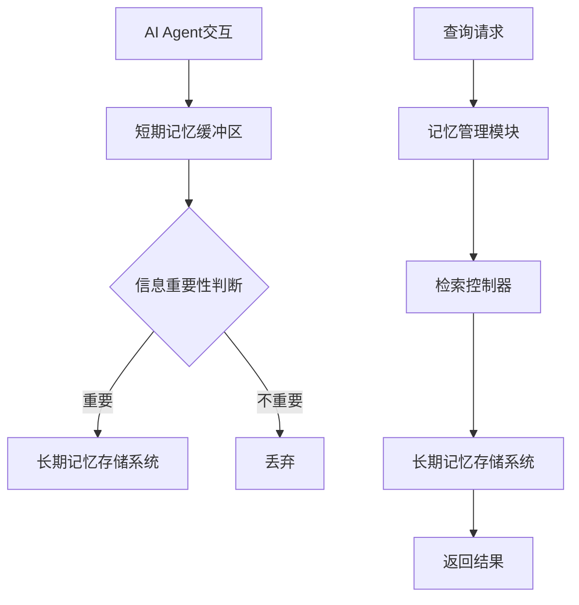

# 从零构建AI Agent的长期记忆机制

> 关键词：AI Agent、长期记忆机制、记忆存储、记忆检索、知识图谱

> 摘要：本文围绕从零构建AI Agent的长期记忆机制展开。首先介绍了相关背景知识，包括构建该机制的目的、适用读者、文档结构和术语表。接着深入探讨了核心概念，通过文本示意图和Mermaid流程图展示了其原理和架构。详细阐述了核心算法原理和具体操作步骤，并结合Python代码进行说明。还介绍了相关的数学模型和公式，给出了实际案例和详细解释。分析了该机制的实际应用场景，推荐了学习资源、开发工具框架以及相关论文著作。最后总结了未来发展趋势与挑战，解答了常见问题，并提供了扩展阅读和参考资料，旨在为开发者提供全面且深入的指导，帮助他们成功构建AI Agent的长期记忆机制。

## 1. 背景介绍 
### 1.1 目的和范围
AI Agent在当今的人工智能领域中扮演着至关重要的角色，它能够模拟人类的行为和决策过程，在诸多场景下为用户提供智能服务。然而，要让AI Agent具备更强大的智能和更自然的交互能力，长期记忆机制是不可或缺的。本文章的目的在于详细阐述如何从零开始构建AI Agent的长期记忆机制，涵盖了从核心概念的理解、算法原理的剖析、代码实现的讲解，到实际应用场景的分析等多个方面。范围涉及到与长期记忆机制相关的各个环节，包括记忆的存储、检索、更新等，旨在为开发者提供一套完整的构建方案。

### 1.2 预期读者
本文预期读者主要包括对人工智能和AI Agent开发有浓厚兴趣的开发者、研究人员以及相关领域的技术爱好者。无论你是刚刚踏入人工智能领域的新手，还是有一定开发经验的专业人士，都能从本文中获取有价值的信息。对于新手来说，可以通过本文了解长期记忆机制的基本概念和构建方法；对于专业人士而言，本文深入的算法分析和代码实现细节能够为他们的实际项目提供参考和启发。

### 1.3 文档结构概述
本文将按照以下结构进行组织：首先介绍背景知识，让读者对构建AI Agent长期记忆机制有一个整体的认识；接着阐述核心概念，通过文本示意图和流程图展示其原理和架构；然后详细讲解核心算法原理和具体操作步骤，并结合Python代码进行说明；随后介绍相关的数学模型和公式，并举例说明；再通过项目实战，给出代码实际案例和详细解释；分析该机制的实际应用场景；推荐学习资源、开发工具框架以及相关论文著作；最后总结未来发展趋势与挑战，解答常见问题，并提供扩展阅读和参考资料。

### 1.4 术语表
#### 1.4.1 核心术语定义
- **AI Agent**：是一种能够感知环境、进行决策并采取行动以实现特定目标的智能实体。它可以是软件程序、机器人等不同形式。
- **长期记忆机制**：指的是AI Agent用于存储和管理长期信息的系统，这些信息可以在需要时被检索和使用，以支持Agent的决策和行为。
- **记忆存储**：将信息以特定的方式保存到长期记忆系统中的过程。
- **记忆检索**：从长期记忆系统中查找和获取所需信息的过程。

#### 1.4.2 相关概念解释
- **知识图谱**：是一种以图的形式表示知识的结构，其中节点表示实体，边表示实体之间的关系。在长期记忆机制中，知识图谱可以用于组织和存储知识，方便信息的检索和推理。
- **向量空间模型**：将文本或其他数据表示为向量的模型，通过计算向量之间的相似度来衡量数据之间的相关性。在记忆检索中，向量空间模型可以用于快速找到与查询相关的记忆。

#### 1.4.3 缩略词列表
- **RNN**：循环神经网络（Recurrent Neural Network），是一种具有循环结构的神经网络，适用于处理序列数据。
- **LSTM**：长短期记忆网络（Long Short-Term Memory），是RNN的一种变体，能够有效解决长序列数据中的梯度消失问题，常用于处理时间序列数据和文本数据。
- **TF-IDF**：词频 - 逆文档频率（Term Frequency - Inverse Document Frequency），是一种用于评估一个词在文档集合中重要性的统计方法。

## 2. 核心概念与联系 
### 核心概念原理
AI Agent的长期记忆机制主要包括记忆的存储和检索两个核心过程。记忆存储是将Agent在与环境交互过程中获取的信息进行编码和保存，以便后续使用。这些信息可以是文本、图像、音频等不同形式的数据。记忆检索则是根据Agent当前的需求，从长期记忆中查找和获取相关的信息。

为了实现高效的记忆存储和检索，需要采用合适的数据结构和算法。例如，可以使用知识图谱来组织和存储知识，将实体和它们之间的关系表示为图的节点和边。在检索时，可以通过图的遍历算法快速找到相关的知识。另外，向量空间模型也是一种常用的方法，将记忆数据表示为向量，通过计算向量之间的相似度来进行检索。

### 架构的文本示意图
```plaintext
+---------------------+
|     AI Agent        |
+---------------------+
|                     |
| 短期记忆缓冲区     |
|                     |
+---------------------+
|                     |
| 长期记忆存储系统    |
|  - 知识图谱         |
|  - 向量数据库       |
|                     |
+---------------------+
|                     |
| 记忆管理模块        |
|  - 存储控制器       |
|  - 检索控制器       |
|                     |
+---------------------+
```
### Mermaid流程图

该流程图展示了AI Agent的长期记忆机制的主要流程。首先，AI Agent在与环境交互过程中获取的信息会先进入短期记忆缓冲区。然后，通过信息重要性判断，重要的信息会被存储到长期记忆存储系统中，不重要的信息则被丢弃。当有查询请求时，记忆管理模块会调用检索控制器从长期记忆存储系统中查找相关信息，并返回结果。

## 3. 核心算法原理 & 具体操作步骤 
### 记忆存储算法原理
在记忆存储过程中，我们可以使用TF-IDF算法对文本信息进行处理，以确定每个词的重要性。TF-IDF算法的基本思想是，一个词在一个文档中出现的频率越高，同时在整个文档集合中出现的频率越低，那么这个词就越重要。

以下是使用Python实现TF-IDF算法进行文本信息存储的代码示例：
```python
from sklearn.feature_extraction.text import TfidfVectorizer
import numpy as np

# 示例文本数据
documents = [
    "This is the first document.",
    "This document is the second document.",
    "And this is the third one.",
    "Is this the first document?"
]

# 创建TF-IDF向量器
vectorizer = TfidfVectorizer()

# 计算TF-IDF矩阵
tfidf_matrix = vectorizer.fit_transform(documents)

# 获取特征名称（词汇表）
feature_names = vectorizer.get_feature_names_out()

# 打印每个文档的TF-IDF向量
for doc_index in range(len(documents)):
    feature_index = tfidf_matrix[doc_index, :].nonzero()[1]
    tfidf_scores = zip(feature_index, [tfidf_matrix[doc_index, x] for x in feature_index])
    print(f"Document {doc_index}:")
    for w, s in [(feature_names[i], s) for (i, s) in tfidf_scores]:
        print(f"  {w}: {s}")
```
### 具体操作步骤
1. **数据预处理**：对输入的文本数据进行清洗，去除停用词、标点符号等。
2. **创建TF-IDF向量器**：使用`TfidfVectorizer`类创建一个向量器对象。
3. **计算TF-IDF矩阵**：调用向量器的`fit_transform`方法，计算文本数据的TF-IDF矩阵。
4. **存储TF-IDF矩阵**：将计算得到的TF-IDF矩阵存储到长期记忆存储系统中，可以使用数据库或文件系统进行存储。

### 记忆检索算法原理
在记忆检索过程中，我们可以使用余弦相似度算法来计算查询向量与记忆向量之间的相似度。余弦相似度是通过计算两个向量之间的夹角余弦值来衡量它们的相似度，余弦值越接近1，表示两个向量越相似。

以下是使用Python实现余弦相似度算法进行记忆检索的代码示例：
```python
from sklearn.metrics.pairwise import cosine_similarity
import numpy as np

# 示例查询向量
query = "This is a query document."

# 将查询文本转换为TF-IDF向量
query_vector = vectorizer.transform([query])

# 计算查询向量与每个文档向量的余弦相似度
similarities = cosine_similarity(query_vector, tfidf_matrix)

# 获取相似度最高的文档索引
most_similar_index = np.argmax(similarities)

# 打印最相似的文档
print(f"Most similar document: {documents[most_similar_index]}")
```
### 具体操作步骤
1. **查询预处理**：对查询文本进行与存储时相同的预处理操作。
2. **将查询文本转换为向量**：使用之前训练好的TF-IDF向量器将查询文本转换为向量。
3. **计算相似度**：使用`cosine_similarity`函数计算查询向量与记忆向量之间的相似度。
4. **排序和选择**：根据相似度得分对记忆向量进行排序，选择相似度最高的记忆作为查询结果。

## 4. 数学模型和公式 & 详细讲解 & 举例说明 
### TF-IDF公式
TF-IDF的计算公式如下：
$$
\text{TF-IDF}(t, d, D) = \text{TF}(t, d) \times \text{IDF}(t, D)
$$
其中，$\text{TF}(t, d)$ 表示词 $t$ 在文档 $d$ 中的词频，计算公式为：
$$
\text{TF}(t, d) = \frac{\text{词 }t\text{ 在文档 }d\text{ 中出现的次数}}{\text{文档 }d\text{ 中的总词数}}
$$
$\text{IDF}(t, D)$ 表示词 $t$ 在文档集合 $D$ 中的逆文档频率，计算公式为：
$$
\text{IDF}(t, D) = \log\frac{\text{文档集合 }D\text{ 中的文档总数}}{\text{包含词 }t\text{ 的文档数} + 1}
$$
### 详细讲解
TF-IDF的核心思想是，一个词在一个文档中出现的频率越高，同时在整个文档集合中出现的频率越低，那么这个词就越能代表该文档的特征。词频（TF）反映了词在文档中的重要性，逆文档频率（IDF）则反映了词在整个文档集合中的稀有性。通过将两者相乘，可以得到一个综合的重要性得分。

### 举例说明
假设有以下文档集合：
- 文档1："This is a cat."
- 文档2："This is a dog."
- 文档3："The cat is cute."

对于词 "cat"，在文档1中出现了1次，文档1的总词数为4，所以 $\text{TF}("cat", \text{文档1}) = \frac{1}{4} = 0.25$。文档集合中总共有3个文档，包含词 "cat" 的文档有2个，所以 $\text{IDF}("cat", \text{文档集合}) = \log\frac{3}{2 + 1} = \log 1 = 0$。因此，$\text{TF-IDF}("cat", \text{文档1}, \text{文档集合}) = 0.25 \times 0 = 0$。

### 余弦相似度公式
余弦相似度的计算公式如下：
$$
\text{cosine similarity}(\mathbf{A}, \mathbf{B}) = \frac{\mathbf{A} \cdot \mathbf{B}}{\|\mathbf{A}\| \|\mathbf{B}\|}
$$
其中，$\mathbf{A}$ 和 $\mathbf{B}$ 是两个向量，$\mathbf{A} \cdot \mathbf{B}$ 表示它们的点积，$\|\mathbf{A}\|$ 和 $\|\mathbf{B}\|$ 分别表示它们的模。

### 详细讲解
余弦相似度通过计算两个向量之间的夹角余弦值来衡量它们的相似度。当两个向量的方向完全相同时，夹角为0度，余弦值为1，表示它们完全相似；当两个向量的方向完全相反时，夹角为180度，余弦值为 -1，表示它们完全不相似。

### 举例说明
假设有两个向量 $\mathbf{A} = [1, 2, 3]$ 和 $\mathbf{B} = [2, 4, 6]$。它们的点积为 $\mathbf{A} \cdot \mathbf{B} = 1 \times 2 + 2 \times 4 + 3 \times 6 = 2 + 8 + 18 = 28$。$\mathbf{A}$ 的模为 $\|\mathbf{A}\| = \sqrt{1^2 + 2^2 + 3^2} = \sqrt{14}$，$\mathbf{B}$ 的模为 $\|\mathbf{B}\| = \sqrt{2^2 + 4^2 + 6^2} = \sqrt{56} = 2\sqrt{14}$。因此，$\text{cosine similarity}(\mathbf{A}, \mathbf{B}) = \frac{28}{\sqrt{14} \times 2\sqrt{14}} = 1$，表示这两个向量完全相似。

## 5. 项目实战：代码实际案例和详细解释说明 
### 5.1  开发环境搭建
#### 安装Python
首先，确保你已经安装了Python。可以从Python官方网站（https://www.python.org/downloads/）下载并安装适合你操作系统的Python版本。建议安装Python 3.7及以上版本。

#### 安装必要的库
使用以下命令安装所需的Python库：
```bash
pip install scikit-learn numpy
```
### 5.2  源代码详细实现和代码解读
以下是一个完整的项目实战代码示例，实现了AI Agent的长期记忆机制的存储和检索功能：
```python
from sklearn.feature_extraction.text import TfidfVectorizer
from sklearn.metrics.pairwise import cosine_similarity
import numpy as np

# 示例文本数据，代表AI Agent的长期记忆
documents = [
    "The sun rises in the east.",
    "The moon orbits around the earth.",
    "Water boils at 100 degrees Celsius.",
    "Plants need sunlight to grow."
]

# 创建TF-IDF向量器
vectorizer = TfidfVectorizer()

# 计算TF-IDF矩阵，将文本数据转换为向量表示
tfidf_matrix = vectorizer.fit_transform(documents)

# 获取特征名称（词汇表）
feature_names = vectorizer.get_feature_names_out()

# 定义一个函数用于存储新的记忆
def store_memory(new_document):
    global documents, vectorizer, tfidf_matrix
    # 将新的文档添加到文档列表中
    documents.append(new_document)
    # 重新计算TF-IDF矩阵
    tfidf_matrix = vectorizer.fit_transform(documents)

# 定义一个函数用于检索记忆
def retrieve_memory(query):
    # 将查询文本转换为TF-IDF向量
    query_vector = vectorizer.transform([query])
    # 计算查询向量与每个文档向量的余弦相似度
    similarities = cosine_similarity(query_vector, tfidf_matrix)
    # 获取相似度最高的文档索引
    most_similar_index = np.argmax(similarities)
    # 返回最相似的文档
    return documents[most_similar_index]

# 存储一个新的记忆
new_memory = "Animals need food and water to survive."
store_memory(new_memory)

# 进行查询
query = "What do animals need?"
result = retrieve_memory(query)
print(f"Query: {query}")
print(f"Result: {result}")
```
### 代码解读与分析
#### 数据准备
- `documents` 列表存储了AI Agent的初始长期记忆，每个元素是一个文本字符串。
#### TF-IDF向量器
- `TfidfVectorizer` 类用于将文本数据转换为TF-IDF向量表示。通过调用 `fit_transform` 方法，可以计算文本数据的TF-IDF矩阵。
#### 存储记忆
- `store_memory` 函数用于存储新的记忆。它将新的文档添加到 `documents` 列表中，并重新计算TF-IDF矩阵，以更新长期记忆的向量表示。
#### 检索记忆
- `retrieve_memory` 函数用于根据查询文本检索相关的记忆。它将查询文本转换为TF-IDF向量，计算与每个文档向量的余弦相似度，选择相似度最高的文档作为结果返回。
#### 测试
- 最后，我们存储了一个新的记忆，并进行了一次查询，打印出查询结果。

## 6. 实际应用场景 
### 智能客服系统
在智能客服系统中，AI Agent可以使用长期记忆机制来存储常见问题的答案和历史对话记录。当用户提出问题时，Agent可以通过检索长期记忆找到相关的答案，并提供给用户。同时，Agent还可以根据历史对话记录了解用户的偏好和需求，提供更加个性化的服务。

### 智能教育助手
智能教育助手可以利用长期记忆机制来存储知识点、学习资料和学生的学习历史。当学生提出问题或需要学习资源时，助手可以从长期记忆中查找相关的信息，并提供给学生。此外，助手还可以根据学生的学习历史分析学生的学习情况，提供针对性的学习建议。

### 智能家居控制系统
在智能家居控制系统中，AI Agent可以使用长期记忆机制来存储用户的使用习惯和设备状态信息。例如，Agent可以记录用户在不同时间段的灯光亮度、温度设置等信息。当用户发出控制指令时，Agent可以根据长期记忆中的信息进行智能调整，提供更加舒适和便捷的家居体验。

### 自动驾驶汽车
自动驾驶汽车中的AI Agent可以利用长期记忆机制来存储地图信息、交通规则和历史驾驶数据。在行驶过程中，Agent可以根据长期记忆中的信息进行路径规划和决策，提高驾驶的安全性和效率。同时，Agent还可以通过学习历史驾驶数据，不断优化自己的驾驶策略。

## 7. 工具和资源推荐
### 7.1 学习资源推荐
#### 7.1.1 书籍推荐
- 《人工智能：一种现代的方法》：这是一本经典的人工智能教材，涵盖了人工智能的各个方面，包括知识表示、推理、机器学习等，对于理解AI Agent的长期记忆机制有很大的帮助。
- 《Python机器学习》：详细介绍了Python在机器学习领域的应用，包括各种机器学习算法的实现和使用，对于实现长期记忆机制中的算法有很好的参考价值。
#### 7.1.2 在线课程
- Coursera上的“人工智能基础”课程：由知名教授授课，系统地介绍了人工智能的基本概念和方法，适合初学者入门。
- edX上的“深度学习专项课程”：深入讲解了深度学习的原理和应用，对于理解和实现长期记忆机制中的神经网络模型有很大的帮助。
#### 7.1.3 技术博客和网站
- Medium：上面有很多关于人工智能和机器学习的技术文章，涵盖了各种最新的研究成果和实践经验。
- Towards Data Science：专注于数据科学和机器学习领域，提供了很多高质量的技术文章和教程。
### 7.2 开发工具框架推荐
#### 7.2.1 IDE和编辑器
- PyCharm：是一款专门为Python开发设计的集成开发环境，具有强大的代码编辑、调试和分析功能，适合开发AI Agent的长期记忆机制。
- Jupyter Notebook：是一个交互式的开发环境，支持Python代码的编写和运行，同时可以方便地展示代码和结果，适合进行算法的实验和验证。
#### 7.2.2 调试和性能分析工具
- Py-Spy：是一个用于Python代码性能分析的工具，可以帮助开发者找出代码中的性能瓶颈，优化代码性能。
- PDB：是Python自带的调试器，可以帮助开发者在代码运行过程中进行调试，找出代码中的错误。
#### 7.2.3 相关框架和库
- Scikit-learn：是一个常用的机器学习库，提供了各种机器学习算法的实现，包括TF-IDF、余弦相似度等，对于实现长期记忆机制中的算法非常方便。
- TensorFlow：是一个开源的深度学习框架，支持各种神经网络模型的构建和训练，对于实现基于神经网络的长期记忆机制有很大的帮助。
### 7.3 相关论文著作推荐
#### 7.3.1 经典论文
- "Long Short-Term Memory"：介绍了长短期记忆网络（LSTM）的原理和应用，LSTM在处理序列数据和长期依赖问题上有很好的效果，对于实现长期记忆机制有重要的参考价值。
- "Efficient Estimation of Word Representations in Vector Space"：提出了Word2Vec模型，用于将单词表示为向量，这种向量表示可以用于文本的语义分析和相似度计算，在长期记忆机制的检索中可以发挥重要作用。
#### 7.3.2 最新研究成果
- 关注arXiv.org上关于人工智能和机器学习的最新研究论文，了解该领域的最新技术和方法。
#### 7.3.3 应用案例分析
- 阅读一些关于AI Agent在实际应用中的案例分析，了解长期记忆机制在不同场景下的应用和优化方法。

## 8. 总结：未来发展趋势与挑战
### 未来发展趋势
#### 与其他技术的融合
AI Agent的长期记忆机制将与其他人工智能技术，如深度学习、强化学习等进行更深入的融合。例如，结合深度学习模型可以更好地处理复杂的非结构化数据，如图像、音频等，提高记忆存储和检索的准确性。强化学习可以用于优化记忆管理策略，使AI Agent能够根据不同的任务和环境动态调整记忆的存储和检索方式。

#### 分布式和云端存储
随着数据量的不断增加，分布式和云端存储将成为AI Agent长期记忆机制的重要发展方向。分布式存储可以提高数据的可靠性和可扩展性，云端存储则可以提供更大的存储空间和更强大的计算能力。通过分布式和云端存储，AI Agent可以处理和管理海量的记忆数据，实现更高效的记忆存储和检索。

#### 跨领域应用
AI Agent的长期记忆机制将在更多的领域得到应用，如医疗、金融、工业等。在医疗领域，AI Agent可以利用长期记忆机制存储患者的病历和诊断信息，辅助医生进行疾病诊断和治疗方案制定。在金融领域，AI Agent可以存储市场数据和交易记录，进行风险评估和投资决策。

### 挑战
#### 数据隐私和安全
随着AI Agent长期记忆机制存储的数据量不断增加，数据隐私和安全问题变得越来越重要。如何确保存储在长期记忆中的数据不被泄露和滥用，是一个亟待解决的问题。需要采用更加先进的加密技术和访问控制机制，保障数据的安全性。

#### 记忆管理的复杂性
随着记忆数据的不断积累，记忆管理的复杂性也会不断增加。如何有效地组织和管理海量的记忆数据，提高记忆检索的效率和准确性，是一个挑战。需要研究和开发更加高效的记忆管理算法和数据结构。

#### 语义理解和推理
目前的长期记忆机制主要基于关键词匹配和向量相似度计算，对于语义理解和推理的能力还比较有限。如何让AI Agent能够更好地理解记忆数据的语义，并进行有效的推理，是未来需要解决的问题。需要结合自然语言处理和知识图谱等技术，提高AI Agent的语义理解和推理能力。

## 9. 附录：常见问题与解答
### 问题1：如何选择合适的记忆存储方式？
解答：选择合适的记忆存储方式需要考虑多个因素，如数据类型、数据量、访问频率等。如果数据是结构化的，如表格数据，可以使用关系型数据库进行存储；如果数据是非结构化的，如文本、图像等，可以使用文件系统或非关系型数据库进行存储。对于需要频繁访问的数据，可以考虑使用内存数据库或缓存技术来提高访问速度。

### 问题2：如何处理长期记忆中的噪声数据？
解答：处理长期记忆中的噪声数据可以采用以下方法：首先，进行数据预处理，如去除停用词、标点符号等；其次，可以使用机器学习算法进行数据清洗，如聚类分析、异常检测等，将噪声数据识别并去除；另外，还可以设置数据质量阈值，对于质量低于阈值的数据进行过滤。

### 问题3：如何评估长期记忆机制的性能？
解答：可以从以下几个方面评估长期记忆机制的性能：
- **检索准确率**：通过计算检索结果与实际相关记忆的匹配程度来评估，常用的指标有准确率、召回率等。
- **检索效率**：通过记录检索操作的响应时间来评估，响应时间越短，说明检索效率越高。
- **存储效率**：通过计算存储单位数据所需的存储空间来评估，存储空间越小，说明存储效率越高。

## 10. 扩展阅读 & 参考资料
### 扩展阅读
- 《知识图谱：方法、实践与应用》：深入介绍了知识图谱的原理、构建方法和应用场景，对于理解和应用知识图谱来构建AI Agent的长期记忆机制有很大的帮助。
- 《深度学习实战》：通过实际案例详细介绍了深度学习的应用和实践，对于实现基于深度学习的长期记忆机制有很好的参考价值。
### 参考资料
- 相关的学术论文和研究报告，可以从IEEE Xplore、ACM Digital Library等学术数据库中获取。
- 开源项目和代码库，如GitHub上的相关项目，可以参考和学习其他开发者的实现经验。

作者：AI天才研究院/AI Genius Institute & 禅与计算机程序设计艺术 /Zen And The Art of Computer Programming