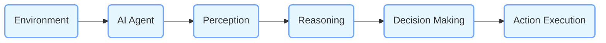

# 从零构建AI Agent：LLM大模型应用开发实践概述

> 关键词：AI Agent、LLM大模型、应用开发、从零构建、实践概述

> 摘要：本文围绕从零构建AI Agent的LLM大模型应用开发实践展开，深入探讨了AI Agent的核心概念、算法原理、数学模型等基础知识。通过详细的Python代码示例展示了开发的具体步骤，并结合实际项目案例进行了深入解读。同时，分析了AI Agent在不同场景下的应用，推荐了相关的学习资源、开发工具和论文著作。最后，对AI Agent未来的发展趋势和挑战进行了总结，为开发者提供了全面的指导和参考。

## 1. 背景介绍 
### 1.1 目的和范围
随着人工智能技术的飞速发展，大型语言模型（LLM）如ChatGPT、GPT - 4等展现出了强大的语言理解和生成能力。AI Agent作为一种能够自主感知环境、做出决策并执行任务的智能实体，结合LLM的能力，可以在多个领域实现更智能、更高效的应用。本文的目的在于为开发者提供一个从零开始构建AI Agent的详细指南，涵盖从核心概念的理解到实际项目开发的全过程。范围包括AI Agent的基本原理、算法实现、数学模型、项目实战以及实际应用场景等方面。

### 1.2 预期读者
本文预期读者主要包括对人工智能和机器学习有一定基础的开发者、数据科学家、研究人员以及对AI Agent应用开发感兴趣的技术爱好者。读者需要具备基本的Python编程知识和一定的机器学习概念理解，以便更好地理解文中的内容和代码示例。

### 1.3 文档结构概述
本文将按照以下结构进行组织：首先介绍相关的背景知识，包括目的、预期读者和文档结构。接着深入讲解AI Agent的核心概念及其与LLM的联系，展示相应的原理和架构示意图。然后详细阐述核心算法原理和具体操作步骤，并用Python代码进行说明。之后介绍相关的数学模型和公式，并举例说明。通过实际项目案例展示代码的实现和解读。分析AI Agent的实际应用场景。推荐相关的学习资源、开发工具和论文著作。最后总结未来发展趋势和挑战，并提供常见问题的解答和扩展阅读参考资料。

### 1.4 术语表
#### 1.4.1 核心术语定义
- **AI Agent**：人工智能代理，是一种能够感知环境、根据感知信息做出决策并采取行动以实现特定目标的智能实体。
- **LLM（Large Language Model）**：大型语言模型，是基于深度学习技术训练的具有大量参数的语言模型，能够处理和生成自然语言文本。
- **Prompt Engineering**：提示工程，指通过设计合适的输入提示来引导LLM生成更符合预期的输出。
- **ReAct（Reason + Act）**：一种结合推理和行动的AI Agent设计模式，使Agent能够在推理的基础上采取行动。

#### 1.4.2 相关概念解释
- **环境感知**：AI Agent通过各种传感器或输入接口获取周围环境的信息，例如文本、图像、声音等。
- **决策制定**：根据感知到的环境信息，AI Agent运用一定的算法和策略来决定采取何种行动。
- **行动执行**：AI Agent根据决策结果，通过执行器或输出接口对环境产生影响，例如生成文本回复、控制设备等。

#### 1.4.3 缩略词列表
- **API**：Application Programming Interface，应用程序编程接口
- **JSON**：JavaScript Object Notation，一种轻量级的数据交换格式
- **HTTP**：Hypertext Transfer Protocol，超文本传输协议

## 2. 核心概念与联系 

### 核心概念原理
AI Agent的核心原理是模拟人类的智能行为，通过感知环境、分析信息、做出决策和执行行动来实现特定的目标。LLM作为AI Agent的重要组成部分，为Agent提供了强大的语言理解和生成能力。Agent可以利用LLM对输入的文本信息进行处理和分析，从而做出更智能的决策。

例如，一个智能客服AI Agent可以接收用户的咨询文本，使用LLM理解用户的意图，然后根据预定义的策略生成合适的回复并发送给用户。

### 架构的文本示意图
```plaintext
+---------------------+
|      Environment    |
| (Text, Images, etc.)|
+---------------------+
          |
          v
+---------------------+
|    AI Agent         |
| +-----------------+ |
| |  Perception     | |
| | (Input Parsing) | |
| +-----------------+ |
|          |          |
|          v          |
| +-----------------+ |
| |  Reasoning      | |
| | (LLM Interaction)| |
| +-----------------+ |
|          |          |
|          v          |
| +-----------------+ |
| |  Decision Making | |
| +-----------------+ |
|          |          |
|          v          |
| +-----------------+ |
| |  Action Execution| |
| | (Output Generation)| |
| +-----------------+ |
+---------------------+
```

### Mermaid流程图


在这个流程图中，环境中的信息首先被AI Agent的感知模块接收，然后传递给推理模块，推理模块借助LLM进行信息处理和分析，根据分析结果进行决策，最后由行动执行模块生成相应的输出。

## 3. 核心算法原理 & 具体操作步骤 

### 核心算法原理
AI Agent的核心算法涉及到多个方面，其中与LLM交互的算法是关键。一种常见的方法是基于提示工程的方法，通过设计合适的提示来引导LLM生成符合需求的输出。例如，在一个问答系统中，我们可以给LLM提供一个包含问题和一些上下文信息的提示，让LLM根据这些信息生成答案。

另一种重要的算法是决策算法，AI Agent需要根据LLM的输出和当前的任务目标来做出决策。这可能涉及到规则引擎、强化学习等技术。

### 具体操作步骤
以下是一个简单的AI Agent开发的具体操作步骤：
1. **需求分析**：明确AI Agent的任务目标和应用场景，例如是一个智能客服、智能助手还是一个游戏AI。
2. **数据准备**：收集和整理与任务相关的数据，例如训练数据、知识库等。
3. **LLM选择**：根据任务需求选择合适的LLM，例如OpenAI的GPT系列、Hugging Face的开源模型等。
4. **提示工程设计**：设计合适的提示模板，用于与LLM进行交互。
5. **决策算法实现**：根据任务特点实现相应的决策算法。
6. **行动执行模块开发**：实现AI Agent的行动执行功能，例如文本回复、调用外部API等。
7. **测试和优化**：对AI Agent进行测试，根据测试结果进行优化和调整。

### Python源代码详细阐述
以下是一个简单的基于OpenAI GPT的问答AI Agent的Python代码示例：

```python
import openai

# 设置OpenAI API密钥
openai.api_key = "YOUR_API_KEY"

def generate_answer(question):
    # 设计提示
    prompt = f"Question: {question}\nAnswer:"
    try:
        # 调用OpenAI API
        response = openai.Completion.create(
            engine="text-davinci-003",
            prompt=prompt,
            max_tokens=100,
            temperature=0.7
        )
        # 提取答案
        answer = response.choices[0].text.strip()
        return answer
    except Exception as e:
        print(f"Error: {e}")
        return None

# 示例问题
question = "What is the capital of France?"
answer = generate_answer(question)
print(f"Question: {question}")
print(f"Answer: {answer}")
```

在这个代码示例中，我们首先设置了OpenAI的API密钥，然后定义了一个`generate_answer`函数，该函数接收一个问题作为输入，设计一个提示并调用OpenAI的API来生成答案。最后，我们给出一个示例问题并打印出答案。

## 4. 数学模型和公式 & 详细讲解 & 举例说明 

### 数学模型
在AI Agent开发中，涉及到多个数学模型，其中与LLM相关的主要是语言模型的概率模型。以简单的n - 元语法模型为例，假设我们有一个文本序列 $w_1, w_2, \cdots, w_n$，n - 元语法模型可以计算该序列的概率为：

$$P(w_1, w_2, \cdots, w_n) = \prod_{i = 1}^{n} P(w_i | w_{i - n + 1}, \cdots, w_{i - 1})$$

其中 $P(w_i | w_{i - n + 1}, \cdots, w_{i - 1})$ 表示在给定前 $n - 1$ 个词的条件下，第 $i$ 个词出现的概率。

在实际的LLM中，使用的是更复杂的神经网络模型，如Transformer，其核心是自注意力机制。自注意力机制可以计算输入序列中每个位置的表示，公式如下：

$$Attention(Q, K, V) = softmax(\frac{QK^T}{\sqrt{d_k}})V$$

其中 $Q$ 是查询矩阵，$K$ 是键矩阵，$V$ 是值矩阵，$d_k$ 是键向量的维度。

### 详细讲解
- **n - 元语法模型**：n - 元语法模型是一种基于统计的语言模型，通过统计语料库中n - 元组（n个连续的词）的出现频率来估计概率。例如，在二元语法模型（$n = 2$）中，我们可以统计每个词对的出现频率，然后计算条件概率。这种模型简单易懂，但存在数据稀疏和长距离依赖问题。
- **自注意力机制**：自注意力机制可以让模型在处理输入序列时，关注序列中不同位置的信息。通过计算查询矩阵 $Q$ 与键矩阵 $K$ 的相似度，得到每个位置的注意力权重，然后根据这些权重对值矩阵 $V$ 进行加权求和，得到每个位置的表示。这样，模型可以更好地捕捉序列中的长距离依赖关系。

### 举例说明
假设我们有一个简单的文本序列 "The dog runs fast"，使用二元语法模型计算该序列的概率。首先，我们需要统计语料库中每个词对的出现频率。假设我们有以下统计结果：

| 词对 | 出现频率 |
| --- | --- |
| The dog | 10 |
| dog runs | 8 |
| runs fast | 6 |

假设总的词对数量为 100，那么每个词对的概率分别为：

$$P(dog | The) = \frac{10}{100} = 0.1$$
$$P(runs | dog) = \frac{8}{100} = 0.08$$
$$P(fast | runs) = \frac{6}{100} = 0.06$$

则该文本序列的概率为：

$$P(The, dog, runs, fast) = P(dog | The) \times P(runs | dog) \times P(fast | runs) = 0.1 \times 0.08 \times 0.06 = 0.00048$$

对于自注意力机制，假设我们有一个输入序列 $x = [x_1, x_2, x_3]$，通过线性变换得到查询矩阵 $Q$、键矩阵 $K$ 和值矩阵 $V$。然后计算 $QK^T$ 得到相似度矩阵，再经过 $softmax$ 函数得到注意力权重矩阵，最后与值矩阵 $V$ 相乘得到输出表示。

## 5. 项目实战：代码实际案例和详细解释说明 

### 5.1  开发环境搭建
#### 安装Python
首先，确保你已经安装了Python 3.6或更高版本。你可以从Python官方网站（https://www.python.org/downloads/）下载并安装适合你操作系统的Python版本。

#### 安装依赖库
在项目中，我们需要使用一些Python库，如`openai`、`requests`等。可以使用`pip`命令来安装这些库：

```bash
pip install openai requests
```

#### 获取OpenAI API密钥
如果你要使用OpenAI的LLM，需要在OpenAI官方网站（https://platform.openai.com/）上注册并获取API密钥。将获取到的API密钥设置为环境变量或在代码中直接使用。

### 5.2  源代码详细实现和代码解读
以下是一个更完整的基于OpenAI GPT的智能客服AI Agent的代码示例：

```python
import openai
import json

# 设置OpenAI API密钥
openai.api_key = "YOUR_API_KEY"

# 模拟知识库
knowledge_base = {
    "What is your company's name?": "Our company's name is ABC Tech.",
    "What products do you offer?": "We offer a variety of software products, including AI tools and web applications."
}

def get_response_from_knowledge_base(question):
    """
    从知识库中获取答案
    """
    if question in knowledge_base:
        return knowledge_base[question]
    return None

def generate_answer(question):
    """
    调用OpenAI API生成答案
    """
    # 首先尝试从知识库中获取答案
    answer = get_response_from_knowledge_base(question)
    if answer:
        return answer
    # 设计提示
    prompt = f"Question: {question}\nAnswer:"
    try:
        # 调用OpenAI API
        response = openai.Completion.create(
            engine="text-davinci-003",
            prompt=prompt,
            max_tokens=100,
            temperature=0.7
        )
        # 提取答案
        answer = response.choices[0].text.strip()
        return answer
    except Exception as e:
        print(f"Error: {e}")
        return None

def main():
    while True:
        # 获取用户输入
        question = input("Please enter your question (type 'quit' to exit): ")
        if question.lower() == 'quit':
            break
        # 生成答案
        answer = generate_answer(question)
        if answer:
            print(f"Answer: {answer}")
        else:
            print("Sorry, I can't answer your question.")

if __name__ == "__main__":
    main()
```

### 5.3  代码解读与分析
- **知识库**：`knowledge_base` 是一个字典，存储了一些常见问题和对应的答案。在处理用户问题时，首先会尝试从知识库中查找答案，如果找到则直接返回。
- **`get_response_from_knowledge_base` 函数**：该函数用于从知识库中查找问题的答案，如果找到则返回答案，否则返回 `None`。
- **`generate_answer` 函数**：该函数首先调用 `get_response_from_knowledge_base` 函数尝试从知识库中获取答案，如果没有找到则设计提示并调用OpenAI API生成答案。
- **`main` 函数**：该函数是程序的入口，通过一个无限循环不断获取用户输入的问题，直到用户输入 `quit` 退出。对于每个问题，调用 `generate_answer` 函数生成答案并打印。

通过这种方式，我们实现了一个简单的智能客服AI Agent，结合了知识库和LLM的能力，提高了回答的准确性和效率。

## 6. 实际应用场景 
### 智能客服
AI Agent可以作为智能客服，自动回答用户的咨询问题。通过结合知识库和LLM的能力，能够快速准确地响应各种问题，提高客户服务的效率和质量。例如，在电商平台上，智能客服可以回答用户关于商品信息、订单状态、退换货政策等问题。

### 智能助手
智能助手可以帮助用户完成各种任务，如日程安排、信息查询、文件处理等。AI Agent可以理解用户的自然语言指令，利用LLM生成相应的操作步骤，并执行这些操作。例如，用户可以告诉智能助手“明天下午三点提醒我开会”，智能助手可以自动设置提醒。

### 智能写作
AI Agent可以用于智能写作，如文章生成、文案创作、诗歌写作等。通过输入主题和一些相关信息，AI Agent可以利用LLM生成高质量的文本内容。例如，在新闻媒体领域，智能写作可以快速生成新闻稿件，提高新闻报道的效率。

### 游戏AI
在游戏中，AI Agent可以作为游戏角色的智能控制者，根据游戏环境和玩家的操作做出相应的决策。例如，在策略游戏中，AI Agent可以制定战略、指挥部队行动，增加游戏的趣味性和挑战性。

## 7. 工具和资源推荐
### 7.1 学习资源推荐
#### 7.1.1 书籍推荐
- 《深度学习》（Deep Learning）：由Ian Goodfellow、Yoshua Bengio和Aaron Courville所著，是深度学习领域的经典教材，涵盖了神经网络、卷积神经网络、循环神经网络等内容。
- 《Python机器学习》（Python Machine Learning）：Sebastian Raschka和Vahid Mirjalili所著，介绍了Python在机器学习中的应用，包括数据预处理、模型选择、深度学习等方面。
- 《自然语言处理入门》（Natural Language Processing with Python）：Steven Bird、Ewan Klein和Edward Loper所著，详细介绍了Python在自然语言处理中的应用，包括文本处理、词性标注、命名实体识别等。

#### 7.1.2 在线课程
- Coursera上的“深度学习专项课程”（Deep Learning Specialization）：由Andrew Ng教授授课，包括神经网络基础、卷积神经网络、循环神经网络等多个课程。
- edX上的“自然语言处理”（Natural Language Processing）：由华盛顿大学提供，介绍了自然语言处理的基本概念和方法。
- Udemy上的“Python for Data Science and Machine Learning Bootcamp”：适合初学者，介绍了Python在数据科学和机器学习中的应用。

#### 7.1.3 技术博客和网站
- Medium：有很多关于人工智能和机器学习的技术博客文章，涵盖了最新的研究成果和实践经验。
- Towards Data Science：专注于数据科学和机器学习领域，提供了大量的技术文章和教程。
- Hugging Face博客：介绍了开源自然语言处理模型的最新进展和应用案例。

### 7.2 开发工具框架推荐
#### 7.2.1 IDE和编辑器
- PyCharm：一款专业的Python集成开发环境，提供了代码编辑、调试、版本控制等功能。
- Jupyter Notebook：一种交互式的开发环境，适合数据探索和模型实验。
- Visual Studio Code：一款轻量级的代码编辑器，支持多种编程语言，有丰富的插件扩展。

#### 7.2.2 调试和性能分析工具
- PDB：Python自带的调试器，可以帮助开发者定位代码中的问题。
- cProfile：Python的性能分析工具，可以分析代码的运行时间和函数调用情况。
- TensorBoard：用于可视化深度学习模型的训练过程和性能指标。

#### 7.2.3 相关框架和库
- TensorFlow：Google开发的深度学习框架，支持多种深度学习模型的构建和训练。
- PyTorch：Facebook开发的深度学习框架，具有动态图的优势，适合快速开发和研究。
- Hugging Face Transformers：提供了大量预训练的自然语言处理模型，方便开发者进行文本处理和生成任务。

### 7.3 相关论文著作推荐
#### 7.3.1 经典论文
- “Attention Is All You Need”：介绍了Transformer架构，是当前自然语言处理领域的基础。
- “BERT: Pre-training of Deep Bidirectional Transformers for Language Understanding”：提出了BERT模型，在自然语言处理任务中取得了很好的效果。
- “Generative Adversarial Nets”：提出了生成对抗网络（GAN），在图像生成等领域有广泛应用。

#### 7.3.2 最新研究成果
- 关注顶级学术会议如NeurIPS、ICML、ACL等的最新论文，了解人工智能领域的最新研究进展。
- arXiv.org上有很多预印本论文，涵盖了最新的研究成果和技术方法。

#### 7.3.3 应用案例分析
- 一些科技公司的博客会分享他们在AI Agent应用开发中的实践经验和案例分析，如OpenAI、Google、Microsoft等。

## 8. 总结：未来发展趋势与挑战
### 未来发展趋势
- **更强的智能和自主性**：未来的AI Agent将具备更强的智能和自主性，能够在更复杂的环境中独立完成任务。例如，在自动驾驶领域，AI Agent可以更好地应对各种路况和突发情况。
- **多模态融合**：AI Agent将不仅仅局限于处理文本信息，还将融合图像、声音、视频等多种模态的信息，实现更全面的感知和交互。例如，智能助手可以通过语音和图像识别来理解用户的需求。
- **个性化服务**：根据用户的偏好和历史行为，AI Agent将提供更加个性化的服务。例如，智能推荐系统可以根据用户的兴趣推荐更符合需求的商品和内容。
- **与物联网的结合**：AI Agent将与物联网设备深度结合，实现对物理世界的智能控制和管理。例如，智能家居系统中的AI Agent可以根据环境信息自动调节家电设备的运行状态。

### 挑战
- **数据隐私和安全**：随着AI Agent处理的数据量越来越大，数据隐私和安全问题变得尤为重要。如何保护用户的个人信息不被泄露和滥用是一个亟待解决的问题。
- **伦理和道德问题**：AI Agent的决策和行为可能会对人类社会产生影响，因此需要考虑伦理和道德问题。例如，自动驾驶汽车在面临紧急情况时的决策应该遵循怎样的伦理原则。
- **可解释性和透明度**：目前的LLM大多是黑盒模型，其决策过程难以解释。在一些关键领域，如医疗、金融等，需要AI Agent具有可解释性和透明度，以便用户理解和信任其决策。
- **计算资源需求**：训练和运行大型的AI Agent需要大量的计算资源，这对于一些小型企业和开发者来说是一个挑战。如何降低计算成本和提高计算效率是未来的研究方向之一。

## 9. 附录：常见问题与解答
### 问题1：如何选择合适的LLM？
答：选择合适的LLM需要考虑多个因素，如任务需求、计算资源、成本等。如果任务对语言理解和生成能力要求较高，且有足够的计算资源和预算，可以选择OpenAI的GPT系列等商业模型。如果注重开源和定制化，可以选择Hugging Face上的开源模型，如BERT、RoBERTa等。

### 问题2：如何提高AI Agent的性能？
答：可以从以下几个方面提高AI Agent的性能：优化提示工程，设计更合适的提示来引导LLM生成更准确的输出；增加知识库的内容，提高回答的准确性和效率；使用强化学习等技术对决策算法进行优化；不断进行模型训练和调优，提高模型的性能。

### 问题3：AI Agent会取代人类工作吗？
答：虽然AI Agent在一些领域可以提高工作效率和质量，但目前还不能完全取代人类工作。AI Agent更适合处理一些重复性、规律性的任务，而人类在创造力、情感理解、复杂决策等方面具有优势。未来，AI Agent将与人类协同工作，共同推动社会的发展。

### 问题4：如何保证AI Agent的安全性？
答：保证AI Agent的安全性需要从多个方面入手。首先，要对输入数据进行严格的过滤和验证，防止恶意输入。其次，要对模型进行安全评估和测试，及时发现和修复潜在的安全漏洞。此外，还可以采用加密技术对数据进行保护，防止数据泄露。

## 10. 扩展阅读 & 参考资料
- OpenAI官方文档：https://platform.openai.com/docs/
- Hugging Face官方文档：https://huggingface.co/docs/transformers/index
- 《人工智能：一种现代的方法》（Artificial Intelligence: A Modern Approach），Stuart Russell和Peter Norvig著
- 顶级学术会议论文集，如NeurIPS、ICML、ACL等

作者：AI天才研究院/AI Genius Institute & 禅与计算机程序设计艺术 /Zen And The Art of Computer Programming