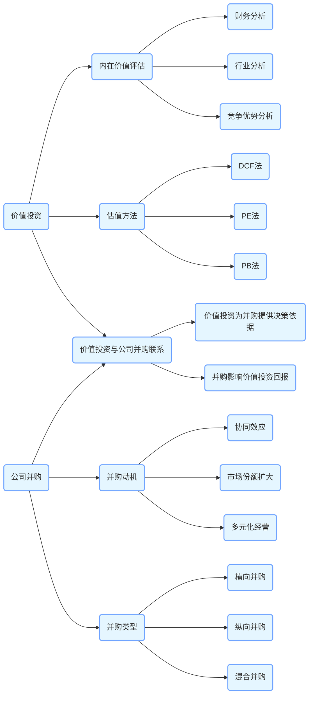

# 价值投资与公司并购策略

> 关键词：价值投资、公司并购、财务分析、市场估值、协同效应、投资策略、风险管理

> 摘要：本文深入探讨了价值投资与公司并购策略的相关内容。首先介绍了价值投资和公司并购的背景知识，包括目的、预期读者等。接着阐述了核心概念及相互联系，详细讲解了核心算法原理与操作步骤，并用数学模型和公式进行进一步说明。通过项目实战案例展示了如何将理论应用于实际。分析了价值投资和公司并购在不同场景下的实际应用，推荐了相关的学习资源、开发工具和论文著作。最后总结了未来发展趋势与挑战，并对常见问题进行了解答，为投资者和企业管理者在价值投资和公司并购决策方面提供全面的参考。

## 1. 背景介绍 
### 1.1 目的和范围
价值投资作为一种重要的投资理念，旨在通过深入分析公司的内在价值，寻找被市场低估的股票进行投资，以获取长期稳定的回报。公司并购则是企业实现扩张、优化资源配置、提升竞争力的重要战略手段。本文的目的在于系统地阐述价值投资的原理和方法，以及公司并购的策略和流程，探讨两者之间的联系和相互影响。范围涵盖了价值投资的基本概念、估值方法、投资决策过程，以及公司并购的动机、类型、尽职调查、交易结构设计等方面。同时，通过实际案例分析，展示如何将价值投资理念应用于公司并购决策中，以及公司并购对价值投资的影响。

### 1.2 预期读者
本文预期读者主要包括投资者、企业管理者、金融分析师、学者以及对价值投资和公司并购感兴趣的人士。投资者可以从中学习如何运用价值投资理念进行投资决策，以及如何评估公司并购对投资组合的影响。企业管理者可以了解公司并购的策略和流程，为企业的战略规划和并购决策提供参考。金融分析师可以通过本文深入了解价值投资和公司并购的分析方法和工具，提升分析能力和专业水平。学者可以将本文作为研究价值投资和公司并购的参考资料，开展相关的学术研究。

### 1.3 文档结构概述
本文共分为十个部分。第一部分为背景介绍，阐述了文章的目的、范围、预期读者和文档结构。第二部分介绍了价值投资和公司并购的核心概念及相互联系，包括价值投资的核心原则、公司并购的类型和动机等，并通过文本示意图和 Mermaid 流程图进行直观展示。第三部分详细讲解了价值投资和公司并购的核心算法原理和具体操作步骤，并用 Python 源代码进行了详细阐述。第四部分介绍了相关的数学模型和公式，如估值模型、协同效应模型等，并通过举例进行了详细说明。第五部分通过项目实战案例，展示了价值投资和公司并购的实际应用，包括开发环境搭建、源代码实现和代码解读。第六部分分析了价值投资和公司并购在不同场景下的实际应用，如行业整合、多元化经营等。第七部分推荐了相关的学习资源、开发工具和论文著作，为读者提供进一步学习和研究的参考。第八部分总结了价值投资和公司并购的未来发展趋势与挑战。第九部分为附录，解答了常见问题。第十部分提供了扩展阅读和参考资料。

### 1.4 术语表
#### 1.4.1 核心术语定义
- **价值投资**：一种基于对公司内在价值的评估，寻找被市场低估的股票进行投资的理念和方法。
- **公司并购**：指一家公司通过购买另一家公司的股权或资产，实现对其控制或合并的行为。
- **内在价值**：公司未来现金流量的现值，是价值投资的核心概念。
- **协同效应**：指公司并购后，由于资源整合、业务互补等原因，产生的额外价值。
- **尽职调查**：在公司并购过程中，对目标公司进行全面的调查和评估，以了解其财务状况、经营情况、法律风险等。

#### 1.4.2 相关概念解释
- **市场估值**：市场对公司价值的评估，通常通过股票价格或企业价值倍数等指标来反映。
- **投资组合**：投资者持有的多种资产的组合，旨在分散风险和实现投资目标。
- **交易结构设计**：在公司并购过程中，设计合理的交易方式和支付方式，以实现交易双方的利益最大化。
- **风险管理**：在价值投资和公司并购过程中，识别、评估和控制风险的过程。

#### 1.4.3 缩略词列表
- **DCF**：Discounted Cash Flow，现金流折现法
- **PE**：Price-to-Earnings Ratio，市盈率
- **PB**：Price-to-Book Ratio，市净率
- **EV/EBITDA**：Enterprise Value to Earnings Before Interest, Taxes, Depreciation and Amortization，企业价值倍数

## 2. 核心概念与联系 

### 价值投资核心概念
价值投资的核心原则是寻找被市场低估的股票，即股票的市场价格低于其内在价值。投资者通过对公司的财务报表、行业前景、竞争优势等进行深入分析，评估公司的内在价值。常见的估值方法包括现金流折现法（DCF）、市盈率（PE）法、市净率（PB）法等。

### 公司并购核心概念
公司并购是企业实现扩张和战略转型的重要手段。并购的动机主要包括协同效应、市场份额扩大、多元化经营等。根据并购的方式和对象，公司并购可以分为横向并购、纵向并购和混合并购等类型。

### 价值投资与公司并购的联系
价值投资理念可以为公司并购提供决策依据。在进行并购决策时，收购方需要评估目标公司的内在价值，判断其是否被低估。同时，公司并购也会对价值投资产生影响。成功的并购可以提升公司的内在价值，为投资者带来丰厚的回报；而失败的并购则可能导致公司价值下降，给投资者带来损失。

### 文本示意图
```plaintext
价值投资
|-- 内在价值评估
|   |-- 财务分析
|   |-- 行业分析
|   |-- 竞争优势分析
|-- 估值方法
|   |-- DCF法
|   |-- PE法
|   |-- PB法

公司并购
|-- 并购动机
|   |-- 协同效应
|   |-- 市场份额扩大
|   |-- 多元化经营
|-- 并购类型
|   |-- 横向并购
|   |-- 纵向并购
|   |-- 混合并购

价值投资与公司并购联系
|-- 价值投资为并购提供决策依据
|-- 并购影响价值投资回报
```

### Mermaid 流程图


## 3. 核心算法原理 & 具体操作步骤 

### 价值投资核心算法原理
#### 现金流折现法（DCF）
现金流折现法是一种基于未来现金流量的估值方法。其基本原理是将公司未来的现金流量按照一定的折现率折现到当前，得到公司的内在价值。公式如下：
$$V = \sum_{t=1}^{n} \frac{CF_t}{(1 + r)^t} + \frac{TV}{(1 + r)^n}$$
其中，$V$ 表示公司的内在价值，$CF_t$ 表示第 $t$ 年的现金流量，$r$ 表示折现率，$n$ 表示预测期，$TV$ 表示终值。

#### 市盈率（PE）法
市盈率法是一种相对估值方法，通过比较公司的市盈率与同行业其他公司的市盈率，来评估公司的价值。公式如下：
$$V = EPS \times PE$$
其中，$V$ 表示公司的价值，$EPS$ 表示每股收益，$PE$ 表示市盈率。

#### 市净率（PB）法
市净率法也是一种相对估值方法，通过比较公司的市净率与同行业其他公司的市净率，来评估公司的价值。公式如下：
$$V = BVPS \times PB$$
其中，$V$ 表示公司的价值，$BVPS$ 表示每股净资产，$PB$ 表示市净率。

### 具体操作步骤
#### 价值投资操作步骤
1. **选择投资标的**：根据自己的投资目标和风险偏好，选择具有投资价值的公司。
2. **收集信息**：收集公司的财务报表、行业报告、新闻资讯等信息，了解公司的基本情况。
3. **进行财务分析**：对公司的财务报表进行分析，评估公司的盈利能力、偿债能力、运营能力等。
4. **进行行业分析**：分析公司所处的行业前景、竞争格局等，了解行业的发展趋势。
5. **评估竞争优势**：评估公司的竞争优势，如品牌优势、技术优势、成本优势等。
6. **计算内在价值**：根据上述分析结果，选择合适的估值方法，计算公司的内在价值。
7. **做出投资决策**：将公司的内在价值与市场价格进行比较，如果内在价值高于市场价格，则可以考虑买入；反之，则可以考虑卖出或不买入。

#### 公司并购操作步骤
1. **确定并购战略**：根据公司的发展战略，确定并购的目标和方向。
2. **寻找目标公司**：通过各种渠道寻找符合并购战略的目标公司。
3. **进行尽职调查**：对目标公司进行全面的尽职调查，了解其财务状况、经营情况、法律风险等。
4. **评估目标公司价值**：根据尽职调查结果，选择合适的估值方法，评估目标公司的价值。
5. **设计交易结构**：根据目标公司的价值和双方的利益诉求，设计合理的交易结构，包括交易方式、支付方式等。
6. **谈判和签约**：与目标公司进行谈判，达成并购协议，并签订合同。
7. **整合资源**：并购完成后，对双方的资源进行整合，实现协同效应。

### Python 源代码实现
```python
import numpy as np

# 现金流折现法（DCF）
def dcf_valuation(cash_flows, discount_rate, terminal_value):
    n = len(cash_flows)
    present_values = []
    for t in range(n):
        present_value = cash_flows[t] / ((1 + discount_rate) ** (t + 1))
        present_values.append(present_value)
    terminal_present_value = terminal_value / ((1 + discount_rate) ** n)
    total_value = sum(present_values) + terminal_present_value
    return total_value

# 市盈率（PE）法
def pe_valuation(eps, pe_ratio):
    value = eps * pe_ratio
    return value

# 市净率（PB）法
def pb_valuation(bvps, pb_ratio):
    value = bvps * pb_ratio
    return value

# 示例数据
cash_flows = [100, 120, 150, 180, 200]
discount_rate = 0.1
terminal_value = 1000
eps = 5
pe_ratio = 15
bvps = 20
pb_ratio = 2

# 计算价值
dcf_value = dcf_valuation(cash_flows, discount_rate, terminal_value)
pe_value = pe_valuation(eps, pe_ratio)
pb_value = pb_valuation(bvps, pb_ratio)

print(f"DCF法计算的价值: {dcf_value}")
print(f"PE法计算的价值: {pe_value}")
print(f"PB法计算的价值: {pb_value}")
```

## 4. 数学模型和公式 & 详细讲解 & 举例说明 

### 现金流折现法（DCF）详细讲解
现金流折现法的核心是预测公司未来的现金流量，并将其折现到当前。在实际应用中，需要对未来现金流量进行合理的预测，同时选择合适的折现率。折现率反映了投资者对投资风险的要求，一般可以采用加权平均资本成本（WACC）作为折现率。

#### 举例说明
假设一家公司未来 5 年的现金流量分别为 100 万元、120 万元、150 万元、180 万元和 200 万元，预测期结束后的终值为 1000 万元，折现率为 10%。则该公司的内在价值为：
$$V = \frac{100}{(1 + 0.1)^1} + \frac{120}{(1 + 0.1)^2} + \frac{150}{(1 + 0.1)^3} + \frac{180}{(1 + 0.1)^4} + \frac{200}{(1 + 0.1)^5} + \frac{1000}{(1 + 0.1)^5}$$
通过计算可得：
```python
cash_flows = [100, 120, 150, 180, 200]
discount_rate = 0.1
terminal_value = 1000
dcf_value = dcf_valuation(cash_flows, discount_rate, terminal_value)
print(f"DCF法计算的价值: {dcf_value}")
```

### 市盈率（PE）法详细讲解
市盈率法是一种简单易懂的估值方法，通过比较公司的市盈率与同行业其他公司的市盈率，来评估公司的价值。市盈率反映了市场对公司未来盈利的预期，一般来说，市盈率越高，市场对公司的预期越好。

#### 举例说明
假设一家公司的每股收益为 5 元，同行业平均市盈率为 15 倍。则该公司的价值为：
$$V = 5 \times 15 = 75$$（元）

### 市净率（PB）法详细讲解
市净率法通过比较公司的市净率与同行业其他公司的市净率，来评估公司的价值。市净率反映了公司的净资产与市场价格的关系，一般来说，市净率越低，公司的投资价值越高。

#### 举例说明
假设一家公司的每股净资产为 20 元，同行业平均市净率为 2 倍。则该公司的价值为：
$$V = 20 \times 2 = 40$$（元）

### 协同效应模型
在公司并购中，协同效应是一个重要的概念。协同效应可以分为经营协同效应、财务协同效应和管理协同效应等。常用的协同效应模型有增量现金流模型和价值增值模型。

#### 增量现金流模型
增量现金流模型通过计算并购后公司的增量现金流量，来评估协同效应的价值。公式如下：
$$V_{synergy} = \sum_{t=1}^{n} \frac{\Delta CF_t}{(1 + r)^t}$$
其中，$V_{synergy}$ 表示协同效应的价值，$\Delta CF_t$ 表示第 $t$ 年的增量现金流量，$r$ 表示折现率，$n$ 表示预测期。

#### 价值增值模型
价值增值模型通过计算并购后公司的价值增值，来评估协同效应的价值。公式如下：
$$V_{synergy} = V_{merged} - (V_{acquirer} + V_{target})$$
其中，$V_{synergy}$ 表示协同效应的价值，$V_{merged}$ 表示并购后公司的价值，$V_{acquirer}$ 表示收购方的价值，$V_{target}$ 表示目标公司的价值。

## 5. 项目实战：代码实际案例和详细解释说明 

### 5.1  开发环境搭建
本项目使用 Python 进行开发，需要安装以下库：
- `numpy`：用于数值计算
- `pandas`：用于数据处理和分析

可以使用以下命令进行安装：
```sh
pip install numpy pandas
```

### 5.2  源代码详细实现和代码解读
```python
import numpy as np
import pandas as pd

# 模拟公司财务数据
data = {
    'Year': [2021, 2022, 2023, 2024, 2025],
    'CashFlow': [100, 120, 150, 180, 200],
    'EPS': [5, 6, 7, 8, 9],
    'BVPS': [20, 22, 24, 26, 28]
}
df = pd.DataFrame(data)

# 现金流折现法（DCF）
def dcf_valuation(cash_flows, discount_rate, terminal_value):
    n = len(cash_flows)
    present_values = []
    for t in range(n):
        present_value = cash_flows[t] / ((1 + discount_rate) ** (t + 1))
        present_values.append(present_value)
    terminal_present_value = terminal_value / ((1 + discount_rate) ** n)
    total_value = sum(present_values) + terminal_present_value
    return total_value

# 市盈率（PE）法
def pe_valuation(eps, pe_ratio):
    value = eps * pe_ratio
    return value

# 市净率（PB）法
def pb_valuation(bvps, pb_ratio):
    value = bvps * pb_ratio
    return value

# 计算价值
discount_rate = 0.1
terminal_value = 1000
pe_ratio = 15
pb_ratio = 2

dcf_value = dcf_valuation(df['CashFlow'].values, discount_rate, terminal_value)
pe_value = pe_valuation(df['EPS'].iloc[-1], pe_ratio)
pb_value = pb_valuation(df['BVPS'].iloc[-1], pb_ratio)

print(f"DCF法计算的价值: {dcf_value}")
print(f"PE法计算的价值: {pe_value}")
print(f"PB法计算的价值: {pb_value}")
```

### 代码解读与分析
1. **数据模拟**：使用 `pandas` 库模拟了一家公司 5 年的财务数据，包括现金流量、每股收益和每股净资产。
2. **估值函数定义**：定义了现金流折现法（DCF）、市盈率（PE）法和市净率（PB）法的估值函数。
3. **价值计算**：使用定义的估值函数计算公司的价值，并输出结果。

通过这个项目实战案例，我们可以看到如何使用 Python 实现价值投资的估值方法，并对公司的价值进行评估。

## 6. 实际应用场景 
### 价值投资应用场景
- **长期投资**：价值投资者通常采用长期投资策略，通过持有被低估的股票，等待市场对公司价值的重新认识，从而获得长期稳定的回报。
- **投资组合构建**：价值投资可以作为投资组合的一部分，与其他投资策略相结合，实现风险分散和收益最大化。
- **逆向投资**：在市场低迷时，价值投资者可以寻找被市场过度抛售的股票，进行逆向投资，以获取更高的回报。

### 公司并购应用场景
- **行业整合**：通过并购同行业的其他公司，实现行业整合，提高市场集中度和竞争力。
- **多元化经营**：通过并购不同行业的公司，实现多元化经营，降低单一行业的风险。
- **战略转型**：通过并购具有新技术、新业务的公司，实现企业的战略转型，提升企业的核心竞争力。

### 价值投资与公司并购结合的应用场景
- **并购目标筛选**：价值投资者可以运用价值投资理念，筛选具有投资价值的并购目标，提高并购的成功率和回报率。
- **并购后整合**：在并购完成后，价值投资者可以关注并购双方的资源整合和协同效应的实现，确保并购能够提升公司的内在价值。

## 7. 工具和资源推荐
### 7.1 学习资源推荐
#### 7.1.1 书籍推荐
- 《聪明的投资者》（The Intelligent Investor）：本杰明·格雷厄姆（Benjamin Graham）著，价值投资的经典之作。
- 《证券分析》（Security Analysis）：本杰明·格雷厄姆和大卫·多德（David Dodd）著，被誉为投资界的“圣经”。
- 《巴菲特致股东的信》（Letters to Shareholders of Berkshire Hathaway）：沃伦·巴菲特（Warren Buffett）著，深入了解巴菲特的投资理念和方法。
- 《并购创造价值》（Creating Value Through Mergers and Acquisitions）：马克·L·赛罗沃（Mark L. Sirower）著，系统介绍公司并购的理论和实践。

#### 7.1.2 在线课程
- Coursera 上的“投资学原理”（Principles of Investing）课程，由哥伦比亚大学教授授课，涵盖了价值投资的基本原理和方法。
- edX 上的“公司金融”（Corporate Finance）课程，由麻省理工学院教授授课，介绍了公司并购的相关知识。

#### 7.1.3 技术博客和网站
- Seeking Alpha：提供专业的投资分析和研究报告，涵盖了价值投资和公司并购等领域。
- Bloomberg：全球知名的财经媒体，提供及时的金融市场信息和公司并购动态。

### 7.2 开发工具框架推荐
#### 7.2.1 IDE和编辑器
- PyCharm：功能强大的 Python 集成开发环境，适合进行 Python 代码的开发和调试。
- Jupyter Notebook：交互式的开发环境，适合进行数据分析和模型验证。

#### 7.2.2 调试和性能分析工具
- pdb：Python 内置的调试工具，可以帮助开发者定位代码中的问题。
- cProfile：Python 内置的性能分析工具，可以分析代码的运行时间和资源占用情况。

#### 7.2.3 相关框架和库
- numpy：用于数值计算和数组处理。
- pandas：用于数据处理和分析。
- scikit-learn：用于机器学习和数据分析。

### 7.3 相关论文著作推荐
#### 7.3.1 经典论文
- Fama, E. F., & French, K. R. (1992). The cross-section of expected stock returns. The Journal of Finance, 47(2), 427-465. 该论文提出了著名的 Fama-French 三因子模型，对价值投资的研究产生了深远影响。
- Jensen, M. C., & Ruback, R. S. (1983). The market for corporate control: The scientific evidence. Journal of Financial Economics, 11(1-4), 5-50. 该论文对公司并购的市场效率和股东财富效应进行了深入研究。

#### 7.3.2 最新研究成果
- Harford, J., Humphery-Jenner, M., & Powell, R. (2017). What drives merger waves? Journal of Financial Economics, 123(2), 363-386. 该论文研究了公司并购浪潮的驱动因素。
- DeLong, G. (2001). Does corporate performance improve after mergers? The Journal of Finance, 56(5), 1763-1794. 该论文对公司并购后的绩效进行了实证研究。

#### 7.3.3 应用案例分析
- 联想并购 IBM PC 业务案例分析，探讨了跨国并购的战略、整合和风险控制。
- 阿里巴巴并购饿了么案例分析，分析了互联网企业并购的动机、协同效应和市场影响。

## 8. 总结：未来发展趋势与挑战
### 未来发展趋势
- **数字化转型**：随着科技的不断发展，价值投资和公司并购将更加注重数字化转型。投资者和企业将更加关注具有新技术、新模式的公司，通过并购实现数字化升级。
- **国际化并购**：全球化的趋势将促使更多的企业进行国际化并购，以拓展海外市场、获取资源和技术。
- **可持续投资**：投资者将越来越关注企业的社会责任和可持续发展，价值投资和公司并购将更加注重环境、社会和治理（ESG）因素。

### 挑战
- **市场不确定性**：金融市场的不确定性增加，如宏观经济波动、政策变化等，给价值投资和公司并购带来了更大的风险。
- **信息不对称**：在公司并购过程中，信息不对称问题较为突出，收购方可能难以全面了解目标公司的真实情况，从而导致并购决策失误。
- **整合难度**：公司并购后的整合是一个复杂的过程，涉及到文化融合、业务整合、人员安排等多个方面，整合难度较大，可能影响并购的效果。

## 9. 附录：常见问题与解答
### 价值投资相关问题
- **问**：价值投资一定能获得高回报吗？
**答**：价值投资并不一定能保证获得高回报。价值投资是基于对公司内在价值的评估，但市场价格受到多种因素的影响，可能长期偏离内在价值。此外，公司的经营状况也可能发生变化，导致内在价值下降。因此，价值投资需要投资者具备一定的分析能力和耐心。

- **问**：如何确定公司的内在价值？
**答**：确定公司的内在价值需要综合考虑多个因素，如公司的财务状况、行业前景、竞争优势等。常用的估值方法包括现金流折现法、市盈率法、市净率法等。投资者可以根据公司的特点和行业情况，选择合适的估值方法进行评估。

### 公司并购相关问题
- **问**：公司并购的风险有哪些？
**答**：公司并购的风险主要包括市场风险、财务风险、整合风险等。市场风险是指并购后市场环境发生变化，导致并购效果不佳。财务风险是指并购过程中涉及的融资、估值等问题，可能导致财务困境。整合风险是指并购后双方的资源整合和协同效应难以实现，影响公司的发展。

- **问**：如何提高公司并购的成功率？
**答**：提高公司并购的成功率需要做好以下几个方面的工作：一是明确并购战略，选择合适的并购目标；二是进行充分的尽职调查，了解目标公司的真实情况；三是设计合理的交易结构，确保交易双方的利益最大化；四是做好并购后的整合工作，实现协同效应。

## 10. 扩展阅读 & 参考资料
### 扩展阅读
- 《财务报表分析与证券定价》（Financial Statement Analysis and Security Valuation）：斯蒂芬·H·佩因曼（Stephen H. Penman）著，深入介绍了财务报表分析在证券定价中的应用。
- 《并购之王：KKR 的投资传奇》（The Barbarians at the Gate: The Fall of RJR Nabisco）：布赖恩·伯勒（Bryan Burrough）和约翰·希利亚尔（John Helyar）著，讲述了 KKR 公司的并购故事和投资策略。

### 参考资料
- 相关上市公司的年报和财务报告。
- 金融机构发布的研究报告和分析文章。
- 行业协会发布的行业数据和研究报告。

作者：AI天才研究院/AI Genius Institute & 禅与计算机程序设计艺术 /Zen And The Art of Computer Programming