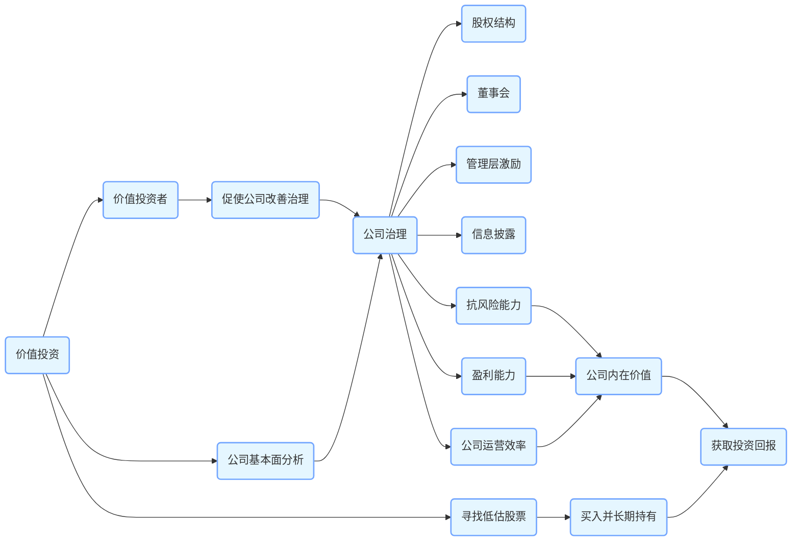

# 价值投资与公司治理的关系

> 关键词：价值投资、公司治理、股权结构、管理层激励、企业价值

> 摘要：本文深入探讨了价值投资与公司治理之间的紧密关系。首先介绍了价值投资和公司治理的背景知识，明确了研究的目的、范围和预期读者。接着详细阐述了两者的核心概念及联系，包括其原理和架构，并通过Mermaid流程图进行直观展示。在核心算法原理部分，使用Python代码模拟了相关决策过程。从数学模型角度，分析了公司治理因素对企业价值的影响。通过项目实战，给出具体代码案例并详细解读。探讨了价值投资与公司治理在实际中的应用场景，推荐了学习资源、开发工具和相关论文著作。最后总结了未来发展趋势与挑战，解答了常见问题，并提供了扩展阅读和参考资料，旨在帮助投资者和企业管理者更好地理解两者关系，做出更明智的决策。

## 1. 背景介绍 
### 1.1 目的和范围
本研究的主要目的是深入剖析价值投资与公司治理之间的内在联系，揭示公司治理质量对价值投资决策和回报的影响，以及价值投资理念如何推动公司治理的改善。范围涵盖了价值投资的基本理论、公司治理的主要要素，以及两者在不同行业和市场环境下的相互作用。通过理论分析、案例研究和实证检验，全面探讨如何通过优化公司治理来实现价值投资的目标，以及价值投资如何促进公司治理的完善。

### 1.2 预期读者
本文预期读者包括金融投资者，如个人投资者、机构投资者等，他们可以从中了解如何通过评估公司治理状况来选择具有投资价值的公司；企业管理者，能够认识到良好的公司治理对吸引价值投资者和提升企业长期竞争力的重要性；学术研究人员，为他们进一步深入研究价值投资和公司治理相关课题提供参考；以及金融监管机构人员，有助于他们制定相关政策，促进市场的健康发展。

### 1.3 文档结构概述
本文首先介绍背景知识，明确研究目的、范围、预期读者和文档结构。接着阐述价值投资和公司治理的核心概念及联系，通过原理和流程图展示其内在逻辑。然后讲解核心算法原理，用Python代码模拟决策过程。从数学模型角度分析公司治理对企业价值的影响，并举例说明。通过项目实战给出代码案例并详细解读。探讨实际应用场景，推荐学习资源、开发工具和相关论文著作。最后总结未来发展趋势与挑战，解答常见问题，提供扩展阅读和参考资料。

### 1.4 术语表
#### 1.4.1 核心术语定义
- **价值投资**：一种投资策略，投资者通过分析公司的基本面，如财务状况、盈利能力、竞争优势等，寻找被市场低估的股票，长期持有以获取企业价值增长带来的收益。
- **公司治理**：一套用于管理和控制公司的制度和机制，旨在平衡公司各利益相关者（如股东、管理层、员工、债权人等）的利益，确保公司的决策和运营符合股东的长期利益，提高公司的运营效率和透明度。

#### 1.4.2 相关概念解释
- **股权结构**：指公司股东的构成和股权分配比例，包括大股东、中小股东的持股比例和性质，不同的股权结构会影响公司的决策机制和治理效率。
- **管理层激励**：为了促使管理层更好地为股东利益服务，公司采取的一系列激励措施，如股票期权、奖金、晋升等，以提高管理层的工作积极性和决策的科学性。
- **信息披露**：公司向投资者和其他利益相关者公开其财务状况、经营成果、重大事项等信息的过程，良好的信息披露有助于提高公司的透明度，增强投资者的信心。

#### 1.4.3 缩略词列表
- **ROE**：Return on Equity，净资产收益率，反映股东权益的收益水平，用以衡量公司运用自有资本的效率。
- **EPS**：Earnings Per Share，每股收益，是指税后利润与股本总数的比率，反映普通股的获利水平。

## 2. 核心概念与联系 

### 价值投资的核心概念
价值投资的核心在于寻找被市场低估的股票，基于对公司内在价值的评估进行投资决策。投资者通过分析公司的财务报表、行业地位、竞争优势等因素，确定公司的真实价值。如果股票价格低于其内在价值，投资者认为存在投资机会，会买入并长期持有，等待市场发现公司的价值，从而实现股价的上涨和投资回报。

### 公司治理的核心概念
公司治理是一套复杂的制度和机制，旨在确保公司的决策和运营符合股东的长期利益。它包括股权结构、董事会组成、管理层激励、信息披露等多个方面。合理的股权结构可以避免一股独大或股权过于分散带来的问题，保证决策的科学性和公正性；有效的董事会能够对管理层进行监督和指导，防止管理层的机会主义行为；合理的管理层激励机制可以使管理层的利益与股东利益相一致，提高管理层的工作积极性和决策的科学性；良好的信息披露可以增强公司的透明度，减少信息不对称，保护投资者的利益。

### 价值投资与公司治理的联系
良好的公司治理是价值投资的重要基础。一个公司治理完善的企业，通常具有更高的运营效率、更强的盈利能力和更好的抗风险能力，其内在价值也相对较高。投资者在进行价值投资时，会更加青睐公司治理良好的企业，因为这些企业的财务报表更加真实可靠，决策更加科学合理，能够为股东创造长期稳定的回报。另一方面，价值投资理念的普及也会促使企业更加重视公司治理。当越来越多的投资者关注公司治理状况时，企业为了吸引投资者，会主动改善自身的治理结构，提高治理水平。

### 文本示意图
```plaintext
价值投资 <-- 基于公司内在价值评估 --> 公司基本面分析
         <-- 关注因素 --> 公司治理（股权结构、董事会、管理层激励、信息披露等）
公司治理 <-- 影响 --> 公司运营效率、盈利能力、抗风险能力
         <-- 决定 --> 公司内在价值
         <-- 吸引 --> 价值投资者
价值投资者 <-- 促使 --> 公司改善治理结构
```

### Mermaid流程图


## 3. 核心算法原理 & 具体操作步骤 

### 核心算法原理
在价值投资与公司治理的决策过程中，我们可以通过构建一个综合评估模型来评估公司的投资价值和治理水平。假设我们考虑公司的财务指标（如ROE、EPS等）和治理指标（如股权集中度、董事会独立性等），可以使用加权平均的方法计算公司的综合得分。

### Python源代码实现
```python
import pandas as pd

# 定义公司数据
company_data = {
    'ROE': [0.15, 0.2, 0.12],
    'EPS': [2.5, 3, 1.8],
    '股权集中度': [0.6, 0.7, 0.5],
    '董事会独立性': [0.8, 0.9, 0.7]
}

# 转换为DataFrame
df = pd.DataFrame(company_data)

# 定义指标权重
weights = {
    'ROE': 0.3,
    'EPS': 0.3,
    '股权集中度': 0.2,
    '董事会独立性': 0.2
}

# 计算综合得分
def calculate_score(row):
    score = 0
    for key, weight in weights.items():
        score += row[key] * weight
    return score

df['综合得分'] = df.apply(calculate_score, axis=1)

# 按综合得分排序
sorted_df = df.sort_values(by='综合得分', ascending=False)

print(sorted_df)
```

### 具体操作步骤
1. **数据收集**：收集公司的财务指标和治理指标数据，如ROE、EPS、股权集中度、董事会独立性等。
2. **数据整理**：将收集到的数据整理成适合分析的格式，如使用Pandas的DataFrame。
3. **定义权重**：根据各指标的重要性，为每个指标定义相应的权重。
4. **计算综合得分**：使用加权平均的方法，计算每个公司的综合得分。
5. **排序和筛选**：根据综合得分对公司进行排序，选择得分较高的公司作为投资候选对象。

## 4. 数学模型和公式 & 详细讲解 & 举例说明 

### 数学模型
假设我们有 $n$ 个评估指标 $x_1, x_2, \cdots, x_n$，对应的权重为 $w_1, w_2, \cdots, w_n$，且 $\sum_{i=1}^{n} w_i = 1$。则公司的综合得分 $S$ 可以表示为：

$$S = \sum_{i=1}^{n} w_i x_i$$

### 详细讲解
这个数学模型的核心思想是通过加权平均的方法，将多个评估指标综合为一个得分。每个指标的权重反映了该指标在评估中的重要性。权重越大，该指标对综合得分的影响就越大。通过计算综合得分，我们可以对不同公司进行比较和排序，从而选择具有较高投资价值的公司。

### 举例说明
假设我们有三家公司A、B、C，其评估指标和权重如下：

| 公司 | ROE ($x_1$) | EPS ($x_2$) | 股权集中度 ($x_3$) | 董事会独立性 ($x_4$) |
| ---- | ---- | ---- | ---- | ---- |
| A | 0.15 | 2.5 | 0.6 | 0.8 |
| B | 0.2 | 3 | 0.7 | 0.9 |
| C | 0.12 | 1.8 | 0.5 | 0.7 |

权重分别为 $w_1 = 0.3$，$w_2 = 0.3$，$w_3 = 0.2$，$w_4 = 0.2$。

对于公司A，其综合得分 $S_A$ 为：

$$
\begin{align*}
S_A &= w_1 x_{1A} + w_2 x_{2A} + w_3 x_{3A} + w_4 x_{4A}\\
&= 0.3\times0.15 + 0.3\times2.5 + 0.2\times0.6 + 0.2\times0.8\\
&= 0.045 + 0.75 + 0.12 + 0.16\\
&= 1.075
\end{align*}
$$

同理，对于公司B，其综合得分 $S_B$ 为：

$$
\begin{align*}
S_B &= w_1 x_{1B} + w_2 x_{2B} + w_3 x_{3B} + w_4 x_{4B}\\
&= 0.3\times0.2 + 0.3\times3 + 0.2\times0.7 + 0.2\times0.9\\
&= 0.06 + 0.9 + 0.14 + 0.18\\
&= 1.28
\end{align*}
$$

对于公司C，其综合得分 $S_C$ 为：

$$
\begin{align*}
S_C &= w_1 x_{1C} + w_2 x_{2C} + w_3 x_{3C} + w_4 x_{4C}\\
&= 0.3\times0.12 + 0.3\times1.8 + 0.2\times0.5 + 0.2\times0.7\\
&= 0.036 + 0.54 + 0.1 + 0.14\\
&= 0.816
\end{align*}
$$

比较三家公司的综合得分，$S_B > S_A > S_C$，因此公司B的投资价值相对较高。

## 5. 项目实战：代码实际案例和详细解释说明 

### 5.1  开发环境搭建
- **操作系统**：推荐使用Windows、Linux或macOS等主流操作系统。
- **Python环境**：安装Python 3.7及以上版本，可以从Python官方网站（https://www.python.org/downloads/）下载安装包进行安装。
- **开发工具**：可以使用PyCharm、Jupyter Notebook等开发工具。如果使用PyCharm，可以从JetBrains官方网站（https://www.jetbrains.com/pycharm/download/）下载安装社区版；如果使用Jupyter Notebook，可以通过Anaconda（https://www.anaconda.com/products/individual）进行安装。
- **依赖库**：安装Pandas库，用于数据处理和分析。可以使用以下命令进行安装：
```sh
pip install pandas
```

### 5.2  源代码详细实现和代码解读
```python
import pandas as pd

# 定义公司数据
company_data = {
    'ROE': [0.15, 0.2, 0.12],
    'EPS': [2.5, 3, 1.8],
    '股权集中度': [0.6, 0.7, 0.5],
    '董事会独立性': [0.8, 0.9, 0.7]
}

# 转换为DataFrame
df = pd.DataFrame(company_data)

# 定义指标权重
weights = {
    'ROE': 0.3,
    'EPS': 0.3,
    '股权集中度': 0.2,
    '董事会独立性': 0.2
}

# 计算综合得分
def calculate_score(row):
    score = 0
    for key, weight in weights.items():
        score += row[key] * weight
    return score

df['综合得分'] = df.apply(calculate_score, axis=1)

# 按综合得分排序
sorted_df = df.sort_values(by='综合得分', ascending=False)

print(sorted_df)
```

### 代码解读与分析
1. **导入库**：`import pandas as pd` 导入Pandas库，并将其别名设置为 `pd`，方便后续使用。
2. **定义公司数据**：使用字典 `company_data` 存储三家公司的评估指标数据，包括ROE、EPS、股权集中度和董事会独立性。
3. **转换为DataFrame**：使用 `pd.DataFrame(company_data)` 将字典数据转换为Pandas的DataFrame对象，方便进行数据处理和分析。
4. **定义指标权重**：使用字典 `weights` 定义每个评估指标的权重，权重之和为1。
5. **计算综合得分**：定义函数 `calculate_score`，该函数接受一个DataFrame的行作为输入，根据权重计算该行的综合得分。使用 `df.apply(calculate_score, axis=1)` 将该函数应用到DataFrame的每一行，计算每个公司的综合得分，并将结果存储在新的列 `综合得分` 中。
6. **排序**：使用 `df.sort_values(by='综合得分', ascending=False)` 按综合得分对DataFrame进行降序排序，得到排序后的DataFrame `sorted_df`。
7. **输出结果**：使用 `print(sorted_df)` 打印排序后的DataFrame，显示每个公司的评估指标和综合得分。

通过这个代码案例，我们可以根据公司的财务指标和治理指标，计算综合得分，并对公司进行排序，从而选择具有较高投资价值的公司。

## 6. 实际应用场景 
### 投资者决策
对于投资者来说，在进行股票投资时，公司治理状况是一个重要的考虑因素。价值投资者会通过分析公司的股权结构、董事会组成、管理层激励等方面，评估公司的治理水平。如果一个公司的治理结构合理，管理层激励有效，信息披露透明，那么该公司更有可能实现长期稳定的发展，其股票也更具有投资价值。例如，巴菲特在选择投资标的时，非常注重公司的治理质量，他会选择那些具有优秀管理层、良好企业文化和完善治理结构的公司进行投资。

### 企业融资
企业在进行融资时，良好的公司治理可以提高企业的信用评级和市场形象，吸引更多的投资者和债权人。投资者更愿意向治理良好的企业投资，因为他们相信这些企业能够更好地保护股东的利益，实现资金的有效利用。例如，一些上市企业为了吸引机构投资者的投资，会主动改善公司的治理结构，加强信息披露，提高董事会的独立性。

### 企业战略规划
公司治理对企业的战略规划也有着重要的影响。合理的公司治理结构可以确保企业的战略决策符合股东的长期利益，避免管理层的短期行为。例如，董事会可以通过对管理层的监督和指导，确保企业在制定战略时充分考虑市场趋势、竞争环境和自身优势，从而实现企业的可持续发展。

### 监管机构监管
金融监管机构可以通过制定相关政策和法规，引导企业完善公司治理结构。例如，要求上市公司建立健全独立董事制度、加强信息披露等。通过加强对公司治理的监管，可以提高市场的透明度和稳定性，保护投资者的利益。

## 7. 工具和资源推荐
### 7.1 学习资源推荐
#### 7.1.1 书籍推荐
- 《聪明的投资者》（The Intelligent Investor）：本杰明·格雷厄姆（Benjamin Graham）著，这本书是价值投资领域的经典之作，详细介绍了价值投资的理念、方法和策略。
- 《公司治理》（Corporate Governance）：科林·梅耶（Colin Mayer）著，全面阐述了公司治理的理论和实践，包括股权结构、董事会、管理层激励等方面的内容。
- 《巴菲特致股东的信：股份公司教程》（Letters to Shareholders of Berkshire Hathaway）：沃伦·巴菲特（Warren Buffett）著，通过巴菲特写给股东的信，深入了解他的投资哲学和对公司治理的看法。

#### 7.1.2 在线课程
- Coursera上的“价值投资基础”（Foundations of Value Investing）课程，由知名教授授课，系统讲解价值投资的基本原理和方法。
- edX上的“公司治理与社会责任”（Corporate Governance and Social Responsibility）课程，介绍公司治理的理论和实践，以及企业在社会责任方面的作用。

#### 7.1.3 技术博客和网站
- 雪球网（https://xueqiu.com/）：一个专注于投资交流的社区，有很多投资者分享价值投资的经验和研究成果。
- 巨潮资讯网（http://www.cninfo.com.cn/）：中国上市公司信息披露的指定网站，可以获取上市公司的财务报表、公告等信息，有助于分析公司的治理状况。

### 7.2 开发工具框架推荐
#### 7.2.1 IDE和编辑器
- PyCharm：一款功能强大的Python集成开发环境，提供代码编辑、调试、自动补全、版本控制等功能，适合开发Python程序。
- Jupyter Notebook：一个交互式的开发环境，可以将代码、文本、图表等整合在一起，方便进行数据分析和可视化。

#### 7.2.2 调试和性能分析工具
- PDB：Python自带的调试工具，可以在代码中设置断点，逐步执行代码，查看变量的值和程序的执行流程。
- cProfile：Python的性能分析工具，可以统计程序中各个函数的执行时间和调用次数，帮助找出性能瓶颈。

#### 7.2.3 相关框架和库
- Pandas：一个强大的数据处理和分析库，提供了DataFrame、Series等数据结构，方便进行数据清洗、转换、统计分析等操作。
- NumPy：一个用于科学计算的Python库，提供了高效的多维数组对象和各种数学函数，可用于数值计算和数据分析。

### 7.3 相关论文著作推荐
#### 7.3.1 经典论文
- “The Modern Corporation and Private Property”（《现代公司与私有财产》）：阿道夫·伯利（Adolf Berle）和加德纳·米恩斯（Gardiner Means）著，该论文首次提出了所有权与控制权分离的问题，对公司治理理论的发展产生了深远影响。
- “Agency Costs of Free Cash Flow, Corporate Finance, and Takeovers”（《自由现金流的代理成本、公司财务与收购》）：迈克尔·詹森（Michael Jensen）著，提出了自由现金流的代理成本理论，解释了公司治理中管理层与股东之间的利益冲突。

#### 7.3.2 最新研究成果
- 关注《Journal of Financial Economics》、《Review of Financial Studies》等顶级金融学术期刊，这些期刊会发表关于价值投资和公司治理的最新研究成果。
- 参加金融学术会议，如美国金融协会（American Finance Association）年会，了解该领域的前沿研究动态。

#### 7.3.3 应用案例分析
- 可以参考一些知名企业的案例分析，如阿里巴巴、腾讯等公司的治理模式和发展历程，了解公司治理在实际应用中的效果和挑战。
- 一些咨询公司和研究机构会发布关于公司治理的案例研究报告，可以从中获取实践经验和启示。

## 8. 总结：未来发展趋势与挑战
### 未来发展趋势
- **数字化治理**：随着信息技术的发展，公司治理将越来越数字化。例如，利用大数据和人工智能技术对公司的运营数据、财务数据进行实时监测和分析，及时发现潜在的风险和问题；通过区块链技术实现股权登记、投票等治理流程的透明化和自动化，提高治理效率和公正性。
- **可持续发展导向**：未来的公司治理将更加注重可持续发展。投资者和社会公众越来越关注企业的环境、社会和治理（ESG）表现，企业需要将可持续发展理念融入到公司治理中，制定长期的可持续发展战略，平衡经济、社会和环境效益。
- **利益相关者治理**：传统的公司治理主要关注股东利益，未来将更加注重利益相关者的参与和权益保护。企业需要与员工、客户、供应商、社区等利益相关者建立良好的合作关系，共同推动企业的发展。

### 挑战
- **数据安全和隐私问题**：在数字化治理过程中，公司需要收集和处理大量的敏感数据，如财务数据、客户信息等。如何确保数据的安全和隐私，防止数据泄露和滥用，是一个重要的挑战。
- **可持续发展指标的量化和评估**：虽然可持续发展理念得到了广泛认可，但如何准确量化和评估企业的可持续发展表现，还存在一定的困难。目前缺乏统一的可持续发展指标体系和评估方法，需要进一步研究和完善。
- **利益相关者协调**：利益相关者治理涉及到多个利益主体的利益协调，不同利益主体的诉求可能存在冲突。如何在保证股东利益的前提下，兼顾其他利益相关者的权益，实现各方利益的平衡，是公司治理面临的一个挑战。

## 9. 附录：常见问题与解答
### 问题1：价值投资是否只适用于成熟行业的公司？
解答：不是的。虽然成熟行业的公司通常具有较为稳定的现金流和盈利能力，更符合价值投资的特点，但价值投资并不局限于成熟行业。新兴行业的公司如果具有独特的技术、创新的商业模式和良好的发展前景，也可能被低估，具有投资价值。投资者需要通过深入分析公司的基本面，评估其内在价值，而不仅仅关注行业的成熟度。

### 问题2：公司治理的改善是否一定能带来股价的上涨？
解答：公司治理的改善有助于提高公司的运营效率、盈利能力和抗风险能力，从而提升公司的内在价值。从长期来看，公司内在价值的提升通常会反映在股价上。但股价的波动受到多种因素的影响，如市场整体行情、宏观经济环境、行业竞争等。因此，公司治理的改善不一定能立即带来股价的上涨，但从长期来看，对股价的提升具有积极的影响。

### 问题3：如何评估董事会的独立性？
解答：评估董事会的独立性可以从以下几个方面入手：一是独立董事的比例，独立董事在董事会中所占的比例越高，董事会的独立性越强；二是独立董事的背景和经验，独立董事应具有丰富的专业知识和独立的判断能力，能够独立于管理层和大股东进行决策；三是董事会的决策机制，董事会的决策是否遵循了科学、公正、透明的原则，是否存在大股东或管理层操纵决策的情况。

### 问题4：价值投资和成长投资有什么区别？
解答：价值投资注重寻找被市场低估的股票，强调股票的价格与内在价值的差异，投资者更关注公司的当前财务状况和盈利能力。成长投资则更关注公司的未来成长潜力，即使公司目前的盈利水平不高，但如果具有良好的发展前景和增长空间，也会被纳入投资范围。价值投资更倾向于长期投资，而成长投资可能更注重短期的股价波动和资本增值。

## 10. 扩展阅读 & 参考资料
### 扩展阅读
- 《证券分析》（Security Analysis）：本杰明·格雷厄姆（Benjamin Graham）和戴维·多德（David Dodd）著，是价值投资领域的另一本经典著作，深入阐述了证券分析的方法和技巧。
- 《从优秀到卓越》（Good to Great）：吉姆·柯林斯（Jim Collins）著，研究了一些从优秀企业成长为卓越企业的案例，分析了这些企业在公司治理、战略规划等方面的成功经验。

### 参考资料
- 中国证券监督管理委员会官方网站（http://www.csrc.gov.cn/）：获取中国证券市场的相关政策、法规和监管信息。
- 世界银行公司治理网页（https://www.worldbank.org/en/topic/corporategovernance）：提供全球公司治理的研究报告和案例分析。

作者：AI天才研究院/AI Genius Institute & 禅与计算机程序设计艺术 /Zen And The Art of Computer Programming