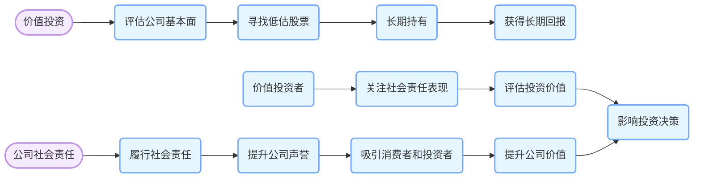

# 价值投资与公司社会责任

> 关键词：价值投资、公司社会责任、财务绩效、可持续发展、长期投资、企业伦理、利益相关者

> 摘要：本文深入探讨了价值投资与公司社会责任之间的紧密联系。首先介绍了研究的背景、目的、预期读者和文档结构等内容。阐述了价值投资和公司社会责任的核心概念及二者之间的联系，并通过示意图和流程图进行直观展示。详细讲解了相关的核心算法原理和具体操作步骤，同时给出了数学模型和公式进行深入分析。通过项目实战案例，展示了如何在实际中结合价值投资和公司社会责任进行投资决策。分析了价值投资与公司社会责任在不同领域的实际应用场景，推荐了相关的学习资源、开发工具框架和论文著作。最后总结了未来发展趋势与挑战，并对常见问题进行了解答。旨在帮助投资者和企业更好地理解和运用价值投资与公司社会责任的理念，实现可持续的经济和社会发展。

## 1. 背景介绍 
### 1.1 目的和范围
本研究的目的在于全面剖析价值投资与公司社会责任之间的关系，揭示公司履行社会责任对价值投资决策的影响，以及价值投资理念如何引导企业更加重视社会责任。研究范围涵盖了价值投资和公司社会责任的基本概念、理论基础、实际应用案例，以及相关的算法原理和数学模型。通过对这些方面的研究，为投资者提供更科学的投资决策依据，为企业提供提升社会责任意识和实践的思路。

### 1.2 预期读者
本文预期读者包括投资者，无论是个人投资者还是机构投资者，他们可以从本文中获取关于价值投资和公司社会责任的深入理解，以便做出更明智的投资决策；企业管理者，他们可以了解如何通过履行社会责任来提升企业的价值和竞争力；学术研究人员，他们可以在本文的基础上开展更深入的学术研究；以及对价值投资和公司社会责任感兴趣的普通大众，他们可以通过本文了解相关领域的基本知识和发展动态。

### 1.3 文档结构概述
本文首先介绍了研究的背景信息，包括目的、预期读者和文档结构等。接着阐述了价值投资和公司社会责任的核心概念及二者之间的联系，并通过示意图和流程图进行直观展示。然后详细讲解了相关的核心算法原理和具体操作步骤，同时给出了数学模型和公式进行深入分析。通过项目实战案例，展示了如何在实际中结合价值投资和公司社会责任进行投资决策。分析了价值投资与公司社会责任在不同领域的实际应用场景，推荐了相关的学习资源、开发工具框架和论文著作。最后总结了未来发展趋势与挑战，并对常见问题进行了解答。

### 1.4 术语表
#### 1.4.1 核心术语定义
- **价值投资**：一种投资策略，强调通过分析公司的基本面，如财务状况、盈利能力、竞争优势等，寻找被低估的股票进行投资，以获取长期的资本增值。
- **公司社会责任**：企业在创造利润、对股东和员工承担法律责任的同时，还要承担对消费者、社区和环境的责任，包括遵守商业道德、保障生产安全和职业健康、保护劳动者的合法权益、保护环境、支持慈善事业、捐助社会公益、保护弱势群体等。
- **财务绩效**：企业在一定时期内通过经营活动所取得的成果，通常用财务指标如净利润、营业收入、资产回报率等来衡量。
- **可持续发展**：既满足当代人的需求，又不损害后代人满足其需求的能力的发展模式，强调经济、社会和环境的协调发展。

#### 1.4.2 相关概念解释
- **利益相关者**：与企业的经营活动密切相关的个人或群体，包括股东、员工、消费者、供应商、社区等。企业的决策和行为会对利益相关者产生影响，同时利益相关者也会影响企业的发展。
- **企业伦理**：企业在经营过程中遵循的道德原则和规范，涉及企业与利益相关者之间的关系、企业的社会责任等方面。

#### 1.4.3 缩略词列表
- **ESG**：环境（Environmental）、社会（Social）和治理（Governance）的缩写，是衡量企业可持续发展和社会责任的重要指标体系。

## 2. 核心概念与联系 

### 价值投资的核心概念
价值投资的核心思想是寻找被市场低估的股票，通过长期持有来获得超过市场平均水平的回报。价值投资者通常关注公司的基本面，如财务报表、盈利能力、竞争优势等。他们认为，股票的价格最终会反映公司的内在价值，当股票价格低于其内在价值时，就是投资的机会。

### 公司社会责任的核心概念
公司社会责任强调企业不仅要追求经济利益，还要对社会和环境负责。企业应该在经营过程中考虑利益相关者的利益，遵守商业道德，保护环境，促进社会公平和可持续发展。公司社会责任的实践包括改善员工福利、推动环境保护、支持公益事业等。

### 价值投资与公司社会责任的联系
价值投资与公司社会责任之间存在着密切的联系。一方面，履行社会责任的公司通常具有更好的声誉和品牌形象，能够吸引更多的消费者和投资者，从而提升公司的市场价值。另一方面，价值投资者越来越关注公司的社会责任表现，将其作为评估公司长期投资价值的重要因素之一。

### 文本示意图
```plaintext
价值投资 <----> 公司社会责任
    |               |
    | 影响公司价值 |
    |               |
    v               v
  长期投资回报    社会可持续发展
```

### Mermaid 流程图


## 3. 核心算法原理 & 具体操作步骤 

### 价值投资的核心算法原理
价值投资的核心算法是通过对公司的财务数据进行分析，计算公司的内在价值。常用的方法有现金流折现法（DCF）、市盈率法（P/E）、市净率法（P/B）等。

#### 现金流折现法（DCF）
现金流折现法的基本原理是将公司未来的现金流折现到当前，以计算公司的内在价值。其计算公式为：

$$V = \sum_{t=1}^{n} \frac{CF_t}{(1 + r)^t} + \frac{TV}{(1 + r)^n}$$

其中，$V$ 表示公司的内在价值，$CF_t$ 表示第 $t$ 期的现金流，$r$ 表示折现率，$n$ 表示预测期数，$TV$ 表示终值。

#### Python 代码实现
```python
def dcf_valuation(cash_flows, discount_rate, terminal_value):
    """
    计算公司的内在价值
    :param cash_flows: 未来各期的现金流列表
    :param discount_rate: 折现率
    :param terminal_value: 终值
    :return: 公司的内在价值
    """
    n = len(cash_flows)
    present_value = 0
    for t in range(n):
        present_value += cash_flows[t] / ((1 + discount_rate) ** (t + 1))
    present_value += terminal_value / ((1 + discount_rate) ** n)
    return present_value

# 示例数据
cash_flows = [100, 120, 150, 180, 200]
discount_rate = 0.1
terminal_value = 1000

# 计算内在价值
intrinsic_value = dcf_valuation(cash_flows, discount_rate, terminal_value)
print(f"公司的内在价值为: {intrinsic_value}")
```

### 考虑公司社会责任的价值投资操作步骤
1. **筛选具有良好社会责任表现的公司**：可以通过参考 ESG 评级、社会责任报告等信息，筛选出在环境、社会和治理方面表现良好的公司。
2. **分析公司的基本面**：对筛选出的公司进行基本面分析，包括财务状况、盈利能力、竞争优势等。
3. **计算公司的内在价值**：使用现金流折现法等方法计算公司的内在价值。
4. **比较股票价格与内在价值**：如果股票价格低于内在价值，则认为该股票具有投资价值。
5. **做出投资决策**：根据以上分析结果，做出是否投资该股票的决策。

## 4. 数学模型和公式 & 详细讲解 & 举例说明 

### 考虑社会责任的价值投资数学模型
为了将公司社会责任纳入价值投资的分析框架，我们可以对现金流折现法进行扩展。假设公司履行社会责任会对未来的现金流产生影响，我们可以引入一个社会责任调整因子 $\alpha$，对未来的现金流进行调整。调整后的现金流计算公式为：

$$CF_t' = CF_t \times (1 + \alpha)$$

其中，$CF_t'$ 表示调整后的第 $t$ 期现金流，$CF_t$ 表示未调整的第 $t$ 期现金流，$\alpha$ 表示社会责任调整因子。$\alpha$ 的取值可以根据公司的社会责任表现进行评估，表现越好，$\alpha$ 的值越大。

调整后的公司内在价值计算公式为：

$$V' = \sum_{t=1}^{n} \frac{CF_t'}{(1 + r)^t} + \frac{TV'}{(1 + r)^n}$$

其中，$V'$ 表示调整后的公司内在价值，$TV'$ 表示调整后的终值。

### 详细讲解
社会责任调整因子 $\alpha$ 的引入是为了反映公司履行社会责任对未来现金流的影响。当公司积极履行社会责任时，可能会提升公司的声誉和品牌形象，吸引更多的消费者和投资者，从而增加未来的现金流。因此，$\alpha$ 的值为正数。相反，如果公司存在社会责任问题，如环境污染、劳工纠纷等，可能会对公司的声誉和经营产生负面影响，导致未来现金流减少，此时 $\alpha$ 的值为负数。

### 举例说明
假设一家公司未来 5 年的现金流分别为 $CF_1 = 100$，$CF_2 = 120$，$CF_3 = 150$，$CF_4 = 180$，$CF_5 = 200$，折现率 $r = 0.1$，终值 $TV = 1000$。根据 ESG 评级，该公司的社会责任表现良好，我们可以将社会责任调整因子 $\alpha$ 设定为 0.05。

首先，计算调整后的现金流：
$CF_1' = CF_1 \times (1 + \alpha) = 100 \times (1 + 0.05) = 105$
$CF_2' = CF_2 \times (1 + \alpha) = 120 \times (1 + 0.05) = 126$
$CF_3' = CF_3 \times (1 + \alpha) = 150 \times (1 + 0.05) = 157.5$
$CF_4' = CF_4 \times (1 + \alpha) = 180 \times (1 + 0.05) = 189$
$CF_5' = CF_5 \times (1 + \alpha) = 200 \times (1 + 0.05) = 210$

然后，计算调整后的终值：
$TV' = TV \times (1 + \alpha) = 1000 \times (1 + 0.05) = 1050$

最后，计算调整后的公司内在价值：
$$V' = \sum_{t=1}^{5} \frac{CF_t'}{(1 + r)^t} + \frac{TV'}{(1 + r)^5}$$
$$= \frac{105}{(1 + 0.1)^1} + \frac{126}{(1 + 0.1)^2} + \frac{157.5}{(1 + 0.1)^3} + \frac{189}{(1 + 0.1)^4} + \frac{210}{(1 + 0.1)^5} + \frac{1050}{(1 + 0.1)^5}$$
```python
import math

cash_flows = [105, 126, 157.5, 189, 210]
discount_rate = 0.1
terminal_value = 1050
n = len(cash_flows)
present_value = 0
for t in range(n):
    present_value += cash_flows[t] / ((1 + discount_rate) ** (t + 1))
present_value += terminal_value / ((1 + discount_rate) ** n)
print(f"调整后的公司内在价值为: {present_value}")
```

通过比较调整前后的公司内在价值，我们可以看到公司履行社会责任对其投资价值的影响。

## 5. 项目实战：代码实际案例和详细解释说明 

### 5.1  开发环境搭建
为了实现考虑公司社会责任的价值投资项目，我们可以使用 Python 编程语言。以下是开发环境的搭建步骤：
1. **安装 Python**：从 Python 官方网站（https://www.python.org/downloads/）下载并安装 Python 3.x 版本。
2. **安装必要的库**：使用以下命令安装必要的库：
```bash
pip install pandas numpy matplotlib
```
- `pandas`：用于数据处理和分析。
- `numpy`：用于数值计算。
- `matplotlib`：用于数据可视化。

### 5.2  源代码详细实现和代码解读
```python
import pandas as pd
import numpy as np
import matplotlib.pyplot as plt

# 示例数据：假设有 5 家公司的财务数据和 ESG 评级
data = {
    'Company': ['A', 'B', 'C', 'D', 'E'],
    'Cash_Flows': [[100, 120, 150, 180, 200], [80, 100, 130, 160, 190], [110, 130, 160, 190, 220], [90, 110, 140, 170, 200], [105, 125, 155, 185, 215]],
    'ESG_Rating': [80, 70, 90, 60, 85],
    'Discount_Rate': [0.1, 0.1, 0.1, 0.1, 0.1],
    'Terminal_Value': [1000, 900, 1100, 800, 1050]
}

df = pd.DataFrame(data)

# 定义社会责任调整因子函数
def get_social_responsibility_factor(esg_rating):
    """
    根据 ESG 评级计算社会责任调整因子
    :param esg_rating: ESG 评级
    :return: 社会责任调整因子
    """
    if esg_rating >= 90:
        return 0.1
    elif esg_rating >= 80:
        return 0.05
    elif esg_rating >= 70:
        return 0
    elif esg_rating >= 60:
        return -0.05
    else:
        return -0.1

# 计算调整后的现金流和内在价值
adjusted_intrinsic_values = []
for index, row in df.iterrows():
    cash_flows = row['Cash_Flows']
    esg_rating = row['ESG_Rating']
    discount_rate = row['Discount_Rate']
    terminal_value = row['Terminal_Value']
    
    # 计算社会责任调整因子
    alpha = get_social_responsibility_factor(esg_rating)
    
    # 调整现金流
    adjusted_cash_flows = [cf * (1 + alpha) for cf in cash_flows]
    
    # 调整终值
    adjusted_terminal_value = terminal_value * (1 + alpha)
    
    # 计算调整后的内在价值
    n = len(adjusted_cash_flows)
    present_value = 0
    for t in range(n):
        present_value += adjusted_cash_flows[t] / ((1 + discount_rate) ** (t + 1))
    present_value += adjusted_terminal_value / ((1 + discount_rate) ** n)
    
    adjusted_intrinsic_values.append(present_value)

df['Adjusted_Intrinsic_Value'] = adjusted_intrinsic_values

# 输出结果
print(df[['Company', 'ESG_Rating', 'Adjusted_Intrinsic_Value']])

# 可视化结果
plt.bar(df['Company'], df['Adjusted_Intrinsic_Value'])
plt.xlabel('Company')
plt.ylabel('Adjusted Intrinsic Value')
plt.title('Adjusted Intrinsic Value of Companies Considering Social Responsibility')
plt.show()
```

### 5.3  代码解读与分析
1. **数据准备**：使用 `pandas` 库创建一个包含公司财务数据和 ESG 评级的 DataFrame。
2. **社会责任调整因子函数**：定义 `get_social_responsibility_factor` 函数，根据 ESG 评级计算社会责任调整因子。
3. **计算调整后的现金流和内在价值**：遍历 DataFrame 中的每一行，根据社会责任调整因子调整现金流和终值，然后使用现金流折现法计算调整后的内在价值。
4. **结果输出和可视化**：将调整后的内在价值添加到 DataFrame 中，并使用 `matplotlib` 库进行可视化展示。

通过这个项目实战，我们可以看到如何在实际中结合公司社会责任进行价值投资分析。

## 6. 实际应用场景 
### 投资者角度
- **长期投资组合构建**：投资者可以将具有良好社会责任表现的公司纳入长期投资组合，以降低投资风险，提高投资回报。例如，一些大型机构投资者会根据 ESG 评级筛选股票，构建可持续投资组合。
- **风险评估**：关注公司的社会责任表现可以帮助投资者评估公司的潜在风险。例如，一家存在环境污染问题的公司可能面临法律诉讼和声誉损失，从而影响其股价和投资价值。

### 企业角度
- **提升品牌形象**：积极履行社会责任可以提升企业的品牌形象和声誉，吸引更多的消费者和投资者。例如，一些企业通过开展公益活动、推动环保事业等方式，赢得了社会的认可和好评。
- **增强竞争力**：履行社会责任可以帮助企业吸引和留住优秀人才，提高员工的工作积极性和创造力，从而增强企业的竞争力。例如，一家注重员工福利和职业发展的企业更容易吸引到优秀的人才。

### 社会角度
- **促进可持续发展**：价值投资与公司社会责任的结合可以引导企业更加注重可持续发展，推动经济、社会和环境的协调发展。例如，投资者对清洁能源、环保产业等领域的投资可以促进这些产业的发展，减少对环境的污染。
- **推动社会进步**：企业履行社会责任可以为社会做出贡献，如支持教育、医疗、扶贫等公益事业，推动社会的进步和发展。

## 7. 工具和资源推荐
### 7.1 学习资源推荐
#### 7.1.1 书籍推荐
- 《聪明的投资者》（The Intelligent Investor）：本杰明·格雷厄姆（Benjamin Graham）著，价值投资领域的经典著作，介绍了价值投资的基本原理和方法。
- 《巴菲特致股东的信：投资者和公司高管教程》（Letters to Shareholders of Berkshire Hathaway）：沃伦·巴菲特（Warren Buffett）著，通过巴菲特致股东的信，阐述了价值投资的理念和实践。
- 《企业的社会责任：理论与实践》（Corporate Social Responsibility: Theory and Practice）：安德鲁·克莱恩（Andrew Crane）和迪尔德丽·马滕（Deirdre Matten）著，系统介绍了公司社会责任的理论和实践。

#### 7.1.2 在线课程
- Coursera 上的“价值投资入门”（Introduction to Value Investing）课程：由专业教授授课，介绍了价值投资的基本概念和分析方法。
- edX 上的“公司社会责任与可持续发展”（Corporate Social Responsibility and Sustainability）课程：讲解了公司社会责任的理论和实践，以及如何将其融入企业战略。

#### 7.1.3 技术博客和网站
- Seeking Alpha：提供股票分析、投资策略等方面的文章和评论，其中包括很多关于价值投资的内容。
- CSRwire：专注于公司社会责任领域的新闻和资讯，提供企业社会责任报告、案例分析等内容。

### 7.2 开发工具框架推荐
#### 7.2.1 IDE和编辑器
- PyCharm：一款专业的 Python 集成开发环境，提供代码编辑、调试、版本控制等功能，适合开发价值投资和数据分析相关的项目。
- Jupyter Notebook：一种交互式的开发环境，支持 Python、R 等多种编程语言，适合进行数据探索和分析。

#### 7.2.2 调试和性能分析工具
- pdb：Python 自带的调试工具，可以帮助开发者定位和解决代码中的问题。
- cProfile：Python 标准库中的性能分析工具，可以分析代码的运行时间和函数调用情况，帮助开发者优化代码性能。

#### 7.2.3 相关框架和库
- Pandas：用于数据处理和分析的 Python 库，提供了高效的数据结构和数据操作方法。
- Numpy：用于数值计算的 Python 库，提供了多维数组和数学函数等功能。
- Scikit-learn：用于机器学习的 Python 库，提供了各种机器学习算法和工具，可用于构建投资模型。

### 7.3 相关论文著作推荐
#### 7.3.1 经典论文
- “The Cost of Capital, Corporation Finance and the Theory of Investment”（资本成本、公司财务与投资理论）：弗兰科·莫迪利安尼（Franco Modigliani）和默顿·米勒（Merton Miller）著，该论文提出了著名的 MM 定理，对公司财务和投资理论产生了深远影响。
- “The Efficient Market Hypothesis and Its Critics”（有效市场假说及其批评者）：尤金·法玛（Eugene F. Fama）著，介绍了有效市场假说的基本概念和相关研究。

#### 7.3.2 最新研究成果
- 关于价值投资与公司社会责任关系的实证研究论文，如研究公司社会责任表现对股票收益率的影响等。
- 关于 ESG 投资策略和绩效评估的研究论文。

#### 7.3.3 应用案例分析
- 一些知名企业的社会责任报告和案例分析，如苹果、谷歌等公司的社会责任实践。
- 投资机构的可持续投资案例分析，如贝莱德、先锋等机构的可持续投资策略和实践。

## 8. 总结：未来发展趋势与挑战
### 未来发展趋势
- **社会责任投资的普及**：随着投资者对社会责任的关注度不断提高，社会责任投资将越来越普及。越来越多的投资者将把公司的社会责任表现纳入投资决策的考虑因素，推动企业更加重视社会责任。
- **ESG 评级体系的完善**：ESG 评级体系将不断完善，评级方法和标准将更加科学和准确。这将有助于投资者更好地评估公司的社会责任表现，提高投资决策的科学性。
- **企业社会责任的战略化**：企业将把社会责任纳入战略规划，将其作为提升企业竞争力和可持续发展能力的重要手段。企业将更加注重社会责任的实践和管理，推动社会责任与企业业务的深度融合。

### 挑战
- **数据质量和透明度问题**：目前，公司社会责任数据的质量和透明度存在一定问题，部分企业的社会责任报告存在夸大和虚假信息。这给投资者评估公司的社会责任表现带来了困难。
- **社会责任与财务绩效的平衡**：企业在履行社会责任时需要投入一定的资源，如何在社会责任和财务绩效之间找到平衡是企业面临的一个挑战。一些企业可能会因为担心影响财务绩效而不愿意积极履行社会责任。
- **缺乏统一的标准和规范**：目前，公司社会责任领域缺乏统一的标准和规范，不同的机构和组织对社会责任的定义和评估方法存在差异。这给投资者和企业带来了困惑，也影响了社会责任投资的发展。

## 9. 附录：常见问题与解答
### 问题 1：价值投资与成长投资有什么区别？
价值投资强调寻找被市场低估的股票，关注公司的基本面和内在价值；而成长投资则更注重公司的成长潜力，关注公司的营业收入、净利润等指标的增长速度。价值投资者通常更倾向于投资成熟的企业，而成长投资者更愿意投资具有高成长潜力的新兴企业。

### 问题 2：公司履行社会责任一定会提高其投资价值吗？
不一定。虽然公司履行社会责任通常可以提升公司的声誉和品牌形象，吸引更多的消费者和投资者，但这并不意味着一定会提高其投资价值。公司的投资价值还受到多种因素的影响，如财务状况、行业竞争、宏观经济环境等。因此，在评估公司的投资价值时，需要综合考虑多个因素。

### 问题 3：如何评估公司的社会责任表现？
可以通过参考 ESG 评级、社会责任报告、媒体报道等信息来评估公司的社会责任表现。ESG 评级是一种常用的评估方法，它从环境、社会和治理三个方面对公司进行评估。社会责任报告是公司披露其社会责任实践和成果的重要文件，通过阅读社会责任报告可以了解公司在社会责任方面的工作。媒体报道可以反映公司在社会责任方面的声誉和形象。

### 问题 4：价值投资与公司社会责任的结合是否适用于所有行业？
价值投资与公司社会责任的结合适用于大多数行业，但在不同行业的应用程度可能会有所不同。一些行业，如能源、化工、制造业等，由于其对环境和社会的影响较大，公司的社会责任表现对其投资价值的影响可能更为显著。而一些行业，如金融、科技等，公司的社会责任表现对其投资价值的影响可能相对较小。但总体来说，无论在哪个行业，公司履行社会责任都有助于提升其长期竞争力和可持续发展能力。

## 10. 扩展阅读 & 参考资料
- 格雷厄姆, B., & 多德, D. L. (2009). 证券分析. 中国人民大学出版社.
- 巴菲特, W. E. (2017). 巴菲特致股东的信. 机械工业出版社.
- Carroll, A. B., & Shabana, K. M. (2010). The business case for corporate social responsibility: A review of concepts, research and practice. International Journal of Management Reviews, 12(1), 85-105.
- Fama, E. F., & French, K. R. (1992). The cross-section of expected stock returns. The Journal of Finance, 47(2), 427-465.

作者：AI天才研究院/AI Genius Institute & 禅与计算机程序设计艺术 /Zen And The Art of Computer Programming