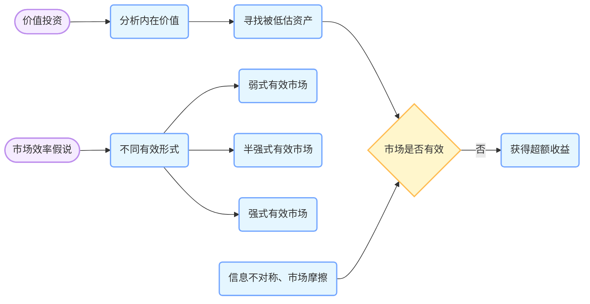

# 价值投资与市场效率假说的关系

> 关键词：价值投资、市场效率假说、有效市场、股票估值、投资策略

> 摘要：本文深入探讨了价值投资与市场效率假说之间的关系。首先介绍了研究的背景、目的、预期读者和文档结构，对相关术语进行了详细解释。接着阐述了价值投资和市场效率假说的核心概念及联系，通过示意图和流程图进行直观展示。分析了核心算法原理，给出了Python代码示例。讲解了相关的数学模型和公式，并举例说明。通过项目实战展示了如何结合两者进行股票投资分析，包括开发环境搭建、源代码实现和代码解读。探讨了它们在实际中的应用场景，推荐了学习所需的工具和资源。最后总结了未来发展趋势与挑战，解答了常见问题，并提供了扩展阅读和参考资料，旨在帮助投资者更好地理解两者关系，优化投资决策。

## 1. 背景介绍 
### 1.1 目的和范围
价值投资和市场效率假说在金融投资领域都是非常重要的概念。价值投资旨在寻找被低估的资产，通过长期持有来获取超额收益；而市场效率假说则认为市场价格已经反映了所有可用信息，投资者难以通过分析信息获得超额收益。本研究的目的在于深入剖析这两个概念之间的关系，明确它们在理论和实践中的相互影响。研究范围涵盖了价值投资的基本原理、市场效率假说的不同形式，以及它们在股票市场、债券市场等金融市场中的应用情况。

### 1.2 预期读者
本文预期读者主要包括金融投资领域的从业者，如基金经理、证券分析师、投资顾问等，他们需要在日常工作中运用价值投资和市场效率假说的相关知识进行投资决策。同时，也适合对金融投资感兴趣的学者和学生，帮助他们深入理解金融市场的运行机制和投资策略。此外，普通投资者也可以通过阅读本文，提升自己的投资知识和决策能力。

### 1.3 文档结构概述
本文首先介绍了价值投资和市场效率假说的相关背景知识，包括研究目的、预期读者和文档结构。接着阐述了这两个核心概念及其联系，通过示意图和流程图进行直观展示。然后分析了核心算法原理，给出了Python代码示例。讲解了相关的数学模型和公式，并举例说明。通过项目实战展示了如何结合两者进行股票投资分析，包括开发环境搭建、源代码实现和代码解读。探讨了它们在实际中的应用场景，推荐了学习所需的工具和资源。最后总结了未来发展趋势与挑战，解答了常见问题，并提供了扩展阅读和参考资料。

### 1.4 术语表
#### 1.4.1 核心术语定义
- **价值投资**：一种投资策略，投资者通过分析资产的内在价值，寻找被市场低估的资产进行投资，期望在资产价格回归内在价值时获得收益。
- **市场效率假说**：该假说认为市场价格能够迅速、准确地反映所有可用信息，根据信息的不同层次，可分为弱式有效市场、半强式有效市场和强式有效市场。
- **内在价值**：资产在未来所能产生的现金流的现值，是价值投资中评估资产是否被低估的重要依据。
- **超额收益**：投资者获得的收益超过市场平均收益的部分。

#### 1.4.2 相关概念解释
- **有效市场**：在有效市场中，资产价格能够充分反映所有可用信息，投资者无法通过分析这些信息获得超额收益。不同形式的有效市场对信息的反映程度不同。
- **基本面分析**：通过分析公司的财务报表、行业前景、宏观经济环境等基本面因素，评估公司的内在价值，是价值投资常用的分析方法。
- **技术分析**：通过研究股票价格和成交量的历史数据，预测股票价格的未来走势，在不同市场效率下其有效性存在差异。

#### 1.4.3 缩略词列表
- **EMH**：Efficient Market Hypothesis，市场效率假说
- **PE**：Price-to-Earnings Ratio，市盈率
- **PB**：Price-to-Book Ratio，市净率

## 2. 核心概念与联系 
### 价值投资的核心概念
价值投资的核心思想是寻找价格低于内在价值的资产。投资者通过对公司的基本面进行深入分析，包括财务状况、盈利能力、行业竞争力等，来评估公司的内在价值。例如，通过分析公司的财务报表，计算市盈率、市净率等指标，与同行业其他公司进行比较，判断公司是否被低估。

价值投资强调长期投资，认为市场短期内可能会出现价格波动，但从长期来看，资产价格会回归其内在价值。投资者应该关注公司的长期发展前景，而不是短期的市场波动。

### 市场效率假说的核心概念
市场效率假说认为市场价格能够迅速、准确地反映所有可用信息。根据信息的不同层次，市场效率假说可分为以下三种形式：
- **弱式有效市场**：市场价格已经反映了所有历史价格和成交量信息。在弱式有效市场中，技术分析失去作用，因为过去的价格和成交量信息已经包含在当前价格中，无法通过分析这些信息预测未来价格走势。
- **半强式有效市场**：市场价格不仅反映了所有历史信息，还反映了所有公开可用的信息，如公司财务报表、新闻公告等。在半强式有效市场中，基本面分析也无法帮助投资者获得超额收益，因为公开信息已经反映在价格中。
- **强式有效市场**：市场价格反映了所有信息，包括公开信息和内幕信息。在强式有效市场中，即使拥有内幕信息也无法获得超额收益。

### 价值投资与市场效率假说的联系
价值投资与市场效率假说之间存在着复杂的关系。从理论上讲，如果市场是强式有效或半强式有效的，那么价值投资就很难获得超额收益，因为市场价格已经反映了所有可用信息，不存在被低估的资产。然而，在现实市场中，市场并非完全有效，存在着各种信息不对称和市场摩擦，这为价值投资提供了机会。

例如，在弱式有效市场中，虽然技术分析可能无效，但投资者可以通过基本面分析寻找被低估的资产。在半强式有效市场中，虽然公开信息已经反映在价格中，但投资者可以通过深入分析和独特的见解，发现市场尚未充分反映的信息，从而进行价值投资。

### 文本示意图
```plaintext
          价值投资
             |
             | 分析内在价值
             v
寻找被低估资产 -- 市场非完全有效 --> 获得超额收益
             ^
             |
             | 信息不对称、市场摩擦
             |
          市场效率假说
             |
             | 不同有效形式
             v
弱式有效市场 - 半强式有效市场 - 强式有效市场
```

### Mermaid 流程图


## 3. 核心算法原理 & 具体操作步骤 
### 价值投资的核心算法原理
价值投资的核心是评估资产的内在价值。常用的方法之一是现金流折现法（DCF），该方法通过预测公司未来的现金流，并将其折现到当前，得到公司的内在价值。

现金流折现法的基本公式为：
$$V = \sum_{t=1}^{n} \frac{CF_t}{(1 + r)^t}$$
其中，$V$ 表示公司的内在价值，$CF_t$ 表示第 $t$ 期的现金流，$r$ 表示折现率，$n$ 表示预测期数。

### Python 代码实现现金流折现法
```python
def dcf_valuation(cash_flows, discount_rate):
    """
    计算现金流折现法下的公司内在价值
    :param cash_flows: 未来各期的现金流列表
    :param discount_rate: 折现率
    :return: 公司的内在价值
    """
    value = 0
    for t, cf in enumerate(cash_flows, start=1):
        value += cf / ((1 + discount_rate) ** t)
    return value

# 示例数据
cash_flows = [100, 120, 150, 180, 200]
discount_rate = 0.1

# 计算内在价值
intrinsic_value = dcf_valuation(cash_flows, discount_rate)
print(f"公司的内在价值为: {intrinsic_value}")
```

### 具体操作步骤
1. **预测现金流**：分析公司的历史财务数据、行业前景和宏观经济环境，预测公司未来各期的现金流。
2. **确定折现率**：折现率反映了投资者对投资风险的预期，通常可以使用资本资产定价模型（CAPM）来确定。
3. **计算内在价值**：将预测的现金流按照折现率折现到当前，得到公司的内在价值。
4. **比较内在价值和市场价格**：如果内在价值高于市场价格，说明公司被低估，可以考虑投资；反之，则不建议投资。

## 4. 数学模型和公式 & 详细讲解 & 举例说明 
### 现金流折现法（DCF）
#### 公式详细讲解
现金流折现法的公式为：
$$V = \sum_{t=1}^{n} \frac{CF_t}{(1 + r)^t}$$
其中：
- $V$：公司的内在价值。
- $CF_t$：第 $t$ 期的现金流。现金流可以是自由现金流、股息等，根据具体情况进行选择。
- $r$：折现率。折现率反映了投资者对投资风险的预期，通常可以使用资本资产定价模型（CAPM）来确定。
- $n$：预测期数。预测期数的选择需要根据公司的实际情况进行判断，一般可以选择 5 - 10 年。

#### 举例说明
假设一家公司未来 5 年的自由现金流分别为 100 万元、120 万元、150 万元、180 万元和 200 万元，折现率为 10%。则该公司的内在价值计算如下：
$$
\begin{align*}
V &= \frac{100}{(1 + 0.1)^1} + \frac{120}{(1 + 0.1)^2} + \frac{150}{(1 + 0.1)^3} + \frac{180}{(1 + 0.1)^4} + \frac{200}{(1 + 0.1)^5}\\
&= \frac{100}{1.1} + \frac{120}{1.21} + \frac{150}{1.331} + \frac{180}{1.4641} + \frac{200}{1.61051}\\
&\approx 90.91 + 99.17 + 112.69 + 122.94 + 124.18\\
&\approx 549.89
\end{align*}
$$
因此，该公司的内在价值约为 549.89 万元。

### 资本资产定价模型（CAPM）
#### 公式详细讲解
资本资产定价模型的公式为：
$$r_i = r_f + \beta_i (r_m - r_f)$$
其中：
- $r_i$：第 $i$ 种资产的预期收益率。
- $r_f$：无风险收益率，通常可以使用国债收益率来近似代替。
- $\beta_i$：第 $i$ 种资产的贝塔系数，反映了该资产的系统性风险。
- $r_m$：市场组合的预期收益率。

#### 举例说明
假设无风险收益率为 3%，市场组合的预期收益率为 10%，某股票的贝塔系数为 1.2。则该股票的预期收益率计算如下：
$$
\begin{align*}
r_i &= 3\% + 1.2 \times (10\% - 3\%)\\
&= 3\% + 1.2 \times 7\%\\
&= 3\% + 8.4\%\\
&= 11.4\%
\end{align*}
$$
因此，该股票的预期收益率为 11.4%。

## 5. 项目实战：代码实际案例和详细解释说明 
### 5.1  开发环境搭建
- **Python 环境**：建议使用 Python 3.7 及以上版本。可以从 Python 官方网站（https://www.python.org/downloads/）下载并安装。
- **开发工具**：推荐使用 PyCharm 作为开发工具，它提供了丰富的代码编辑、调试和管理功能。可以从 JetBrains 官方网站（https://www.jetbrains.com/pycharm/download/）下载并安装。
- **所需库**：需要安装 pandas、numpy 等库，用于数据处理和分析。可以使用以下命令进行安装：
```sh
pip install pandas numpy
```

### 5.2  源代码详细实现和代码解读
以下是一个结合价值投资和市场效率假说的股票投资分析示例代码：
```python
import pandas as pd
import numpy as np

# 模拟股票数据
data = {
    '股票代码': ['000001', '000002', '000003', '000004', '000005'],
    '市盈率': [10, 15, 20, 25, 30],
    '市净率': [1.5, 2, 2.5, 3, 3.5],
    '每股收益': [1, 1.2, 1.5, 1.8, 2],
    '市场价格': [10, 18, 30, 45, 60]
}

df = pd.DataFrame(data)

# 计算内在价值（简单示例，假设内在价值 = 每股收益 * 合理市盈率）
reasonable_pe = 12
df['内在价值'] = df['每股收益'] * reasonable_pe

# 判断股票是否被低估
df['是否低估'] = df['内在价值'] > df['市场价格']

# 筛选出被低估的股票
undervalued_stocks = df[df['是否低估']]

print("被低估的股票：")
print(undervalued_stocks)
```

### 5.3  代码解读与分析
1. **数据模拟**：使用字典 `data` 模拟了 5 只股票的相关数据，包括股票代码、市盈率、市净率、每股收益和市场价格。然后使用 `pandas` 库的 `DataFrame` 函数将数据转换为数据框 `df`。
2. **计算内在价值**：假设合理市盈率为 12，通过每股收益乘以合理市盈率计算出每只股票的内在价值，并将结果添加到数据框中。
3. **判断股票是否被低估**：通过比较内在价值和市场价格，判断每只股票是否被低估，并将结果添加到数据框中。
4. **筛选被低估的股票**：使用布尔索引筛选出被低估的股票，并将结果存储在 `undervalued_stocks` 中。
5. **输出结果**：打印出被低估的股票信息。

通过这个示例代码，我们可以看到如何结合价值投资的思想，通过计算内在价值和比较市场价格，筛选出被低估的股票。

## 6. 实际应用场景 
### 股票投资
在股票投资中，价值投资者可以根据价值投资的原理，通过分析公司的基本面，计算公司的内在价值，寻找被低估的股票进行投资。同时，市场效率假说可以帮助投资者判断市场的有效性，确定投资策略。例如，在弱式有效市场中，投资者可以更多地依赖基本面分析；在半强式有效市场中，投资者需要更加深入地分析和挖掘信息。

### 基金投资
基金经理在进行投资决策时，也会考虑价值投资和市场效率假说。他们会通过分析基金的持仓情况、业绩表现等，判断基金是否采用了价值投资策略，并结合市场效率情况，调整基金的投资组合。

### 债券投资
在债券投资中，价值投资的思想同样适用。投资者可以通过分析债券的票面利率、到期收益率、信用评级等因素，评估债券的内在价值，寻找被低估的债券进行投资。市场效率假说也可以帮助投资者判断债券市场的有效性，确定投资策略。

## 7. 工具和资源推荐
### 7.1 学习资源推荐
#### 7.1.1 书籍推荐
- 《聪明的投资者》（The Intelligent Investor）：本杰明·格雷厄姆（Benjamin Graham）著，被誉为价值投资的圣经，详细介绍了价值投资的原理和方法。
- 《证券分析》（Security Analysis）：本杰明·格雷厄姆和大卫·多德（David Dodd）著，是价值投资领域的经典著作，对证券分析的基本原理和方法进行了深入阐述。
- 《有效市场假说》（Efficient Market Hypothesis）：尤金·法玛（Eugene F. Fama）的相关著作，系统介绍了市场效率假说的理论和实证研究。

#### 7.1.2 在线课程
- Coursera 上的“投资学原理”（Principles of Investing）：由知名教授授课，涵盖了价值投资、市场效率等投资学的基本原理和方法。
- edX 上的“金融市场”（Financial Markets）：耶鲁大学教授罗伯特·席勒（Robert J. Shiller）主讲，深入探讨了金融市场的运行机制和投资策略。

#### 7.1.3 技术博客和网站
- 雪球网（https://xueqiu.com/）：国内知名的投资社区，提供了丰富的股票、基金等投资信息和分析文章。
- Seeking Alpha（https://seekingalpha.com/）：国外知名的投资研究网站，提供了大量的投资分析报告和市场评论。

### 7.2 开发工具框架推荐
#### 7.2.1 IDE和编辑器
- PyCharm：功能强大的 Python 集成开发环境，提供了丰富的代码编辑、调试和管理功能。
- Jupyter Notebook：交互式的开发环境，适合进行数据分析和可视化，方便进行投资分析和研究。

#### 7.2.2 调试和性能分析工具
- Py-Spy：用于分析 Python 程序的性能瓶颈，帮助开发者优化代码性能。
- PDB：Python 自带的调试器，可以帮助开发者调试代码，查找和解决问题。

#### 7.2.3 相关框架和库
- Pandas：用于数据处理和分析的 Python 库，提供了丰富的数据结构和数据操作方法，方便进行投资数据的处理和分析。
- Numpy：用于科学计算的 Python 库，提供了高效的数组操作和数学函数，是进行投资分析和建模的基础库。

### 7.3 相关论文著作推荐
#### 7.3.1 经典论文
- Fama, E. F. (1970). Efficient capital markets: A review of theory and empirical work. The Journal of Finance, 25(2), 383 - 417. 该论文系统阐述了市场效率假说的理论和实证研究，是市场效率假说领域的经典之作。
- Graham, B., & Dodd, D. L. (1934). Security analysis. McGraw - Hill. 这本著作奠定了价值投资的理论基础，对证券分析的基本原理和方法进行了深入探讨。

#### 7.3.2 最新研究成果
- Barberis, N., & Thaler, R. H. (2003). A survey of behavioral finance. Handbook of the Economics of Finance, 1, 1053 - 1128. 该论文对行为金融学的研究成果进行了综述，探讨了投资者的心理和行为对市场效率的影响。
- Campbell, J. Y., & Shiller, R. J. (1988). The dividend - price ratio and expectations of future dividends and discount factors. The Review of Financial Studies, 1(3), 195 - 228. 该论文研究了股息 - 价格比与未来股息和折现因子的关系，对股票估值和市场效率的研究具有重要意义。

#### 7.3.3 应用案例分析
- Buffett, W. E. (1984). The superinvestors of Graham - and - Doddsville. Hermes, 17(1), 4 - 22. 该文章介绍了巴菲特等价值投资者的投资理念和成功案例，对价值投资的实践应用具有重要的参考价值。

## 8. 总结：未来发展趋势与挑战
### 未来发展趋势
- **融合行为金融学**：随着行为金融学的发展，未来价值投资和市场效率假说可能会与行为金融学相结合，更加关注投资者的心理和行为对市场的影响。例如，投资者的过度自信、羊群效应等行为可能会导致市场价格偏离内在价值，为价值投资提供更多机会。
- **大数据和人工智能的应用**：大数据和人工智能技术的发展将为价值投资和市场效率研究带来新的机遇。通过分析海量的金融数据，利用机器学习和深度学习算法，可以更准确地评估资产的内在价值和市场效率，优化投资决策。
- **全球市场的一体化**：随着全球经济的一体化，金融市场之间的联系日益紧密。价值投资者需要更加关注全球市场的动态，寻找全球范围内被低估的资产。同时，市场效率假说也需要考虑全球市场的信息传播和价格形成机制。

### 挑战
- **市场复杂性增加**：金融市场的复杂性不断增加，新的金融产品和交易策略不断涌现，使得市场效率的判断更加困难。例如，高频交易、量化投资等策略的出现，可能会影响市场价格的形成机制，增加市场的不确定性。
- **信息过载**：在信息爆炸的时代，投资者面临着海量的信息，如何筛选和分析有用的信息成为一个挑战。同时，信息的真实性和准确性也需要投资者进行判断，否则可能会导致错误的投资决策。
- **黑天鹅事件的影响**：黑天鹅事件是指那些难以预测、具有重大影响的事件，如金融危机、自然灾害等。这些事件可能会导致市场价格的剧烈波动，打破市场的有效性，给价值投资带来巨大的挑战。

## 9. 附录：常见问题与解答
### 问题 1：市场效率假说是否意味着价值投资无效？
答：市场效率假说并不意味着价值投资无效。虽然在强式有效市场中，价值投资很难获得超额收益，但在现实市场中，市场并非完全有效，存在着各种信息不对称和市场摩擦。投资者可以通过深入分析和独特的见解，发现市场尚未充分反映的信息，从而进行价值投资，获得超额收益。

### 问题 2：如何确定合理的折现率？
答：折现率的确定需要考虑多种因素，如无风险收益率、市场风险溢价、资产的系统性风险等。常用的方法是使用资本资产定价模型（CAPM），该模型通过无风险收益率、贝塔系数和市场组合的预期收益率来计算资产的预期收益率，作为折现率。此外，还可以根据投资者的风险偏好和投资目标，对折现率进行适当调整。

### 问题 3：价值投资是否适合所有投资者？
答：价值投资并不适合所有投资者。价值投资需要投资者具备一定的财务分析能力和耐心，能够进行深入的基本面分析，并长期持有资产。对于那些追求短期收益、缺乏耐心的投资者来说，价值投资可能并不适合。此外，价值投资也存在一定的风险，如市场风险、行业风险等，投资者需要根据自己的风险承受能力和投资目标来选择是否采用价值投资策略。

## 10. 扩展阅读 & 参考资料
### 扩展阅读
- 《战胜华尔街》（One Up on Wall Street）：彼得·林奇（Peter Lynch）著，分享了他的投资经验和选股策略，对价值投资的实践具有重要的参考价值。
- 《金融炼金术》（The Alchemy of Finance）：乔治·索罗斯（George Soros）著，探讨了金融市场的反身性原理，对市场效率和投资决策的理解具有启发意义。

### 参考资料
- Fama, E. F. (1991). Efficient capital markets: II. The Journal of Finance, 46(5), 1575 - 1617.
- Graham, B. (1949). The intelligent investor. Harper & Brothers.
- Shiller, R. J. (2000). Irrational exuberance. Princeton University Press.

作者：AI天才研究院/AI Genius Institute & 禅与计算机程序设计艺术 /Zen And The Art of Computer Programming