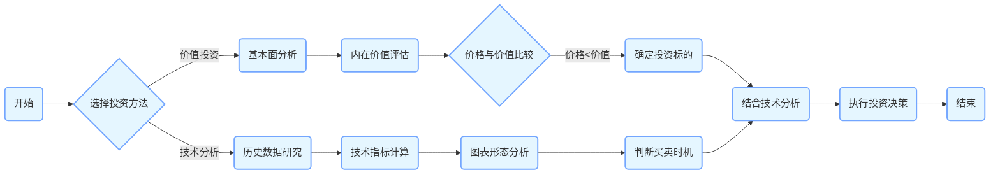

# 价值投资与技术分析的结合

> 关键词：价值投资、技术分析、投资策略、金融市场、投资决策

> 摘要：本文深入探讨了价值投资与技术分析相结合的投资策略。首先介绍了相关背景，包括目的、预期读者等内容。接着阐述了价值投资和技术分析的核心概念及其联系，通过文本示意图和 Mermaid 流程图进行清晰展示。详细讲解了核心算法原理和具体操作步骤，并给出 Python 代码示例。运用数学模型和公式对相关理论进行支撑，结合实际例子说明。通过项目实战部分展示代码的实际应用和详细解读。分析了这种结合策略在不同场景下的实际应用，并推荐了学习资源、开发工具框架以及相关论文著作。最后总结了未来发展趋势与挑战，还提供了常见问题解答和扩展阅读参考资料，旨在为投资者提供全面、深入的价值投资与技术分析结合的知识体系和实践指导。

## 1. 背景介绍 
### 1.1 目的和范围
在金融投资领域，价值投资和技术分析是两种广泛应用的投资方法。价值投资侧重于对公司基本面的分析，评估公司的内在价值，寻找被低估的股票；而技术分析则主要通过研究股票价格和交易量的历史数据，预测未来价格走势。本文章的目的是探讨如何将这两种方法结合起来，以提高投资决策的准确性和成功率。范围涵盖了价值投资和技术分析的基本概念、原理、算法，以及它们在实际投资中的应用，同时会通过项目实战展示具体的代码实现和分析。

### 1.2 预期读者
本文预期读者包括金融投资者、金融分析师、程序员、对金融投资和技术分析感兴趣的技术爱好者等。无论是希望优化投资策略的投资者，还是想要将技术应用于金融领域的程序员，都能从本文中获得有价值的信息。

### 1.3 文档结构概述
本文首先介绍了价值投资与技术分析结合的背景信息，包括目的、读者和文档结构。接着阐述了核心概念与联系，通过文本示意图和 Mermaid 流程图展示两者关系。然后详细讲解核心算法原理和具体操作步骤，给出 Python 代码示例。运用数学模型和公式对理论进行支撑，并举例说明。通过项目实战部分展示代码的实际应用和解读。分析了实际应用场景，推荐了学习资源、开发工具框架和相关论文著作。最后总结未来发展趋势与挑战，提供常见问题解答和扩展阅读参考资料。

### 1.4 术语表
#### 1.4.1 核心术语定义
- **价值投资**：一种投资策略，通过对公司的财务状况、行业地位、管理团队等基本面因素进行分析，评估公司的内在价值，寻找被市场低估的股票进行投资，期望在股票价格回归其内在价值时获得收益。
- **技术分析**：通过研究证券市场的历史交易数据，如价格、成交量等，运用各种技术指标和图表形态，来预测证券价格未来走势的分析方法。
- **内在价值**：指公司的真实价值，是基于公司的资产、盈利、现金流等基本面因素所计算出来的价值，不依赖于市场价格。
- **技术指标**：根据证券市场的历史数据计算出来的一系列数值，用于辅助分析价格走势和市场趋势，如移动平均线、相对强弱指标（RSI）等。

#### 1.4.2 相关概念解释
- **基本面分析**：与价值投资密切相关，是对影响公司价值和股票价格的宏观经济因素、行业发展状况、公司财务状况等进行分析的方法。
- **图表形态分析**：技术分析的重要组成部分，通过观察股票价格走势图上的各种形态，如头肩顶、双底等，来预测价格的未来走势。
- **市场效率**：指市场价格反映所有可用信息的程度。在有效市场中，股票价格能够迅速反映所有公开信息，价值投资和技术分析的有效性会受到一定限制。

#### 1.4.3 缩略词列表
- **RSI**：相对强弱指标（Relative Strength Index），用于衡量证券价格变动的相对强弱程度。
- **MA**：移动平均线（Moving Average），是一种平滑价格数据的技术指标，用于显示价格的长期趋势。
- **MACD**：指数平滑异同移动平均线（Moving Average Convergence Divergence），通过对不同周期的移动平均线进行计算，来判断买卖信号。

## 2. 核心概念与联系 

### 价值投资的核心概念
价值投资的核心在于寻找被市场低估的股票，其理论基础是股票价格会围绕其内在价值波动。投资者通过对公司的基本面进行深入分析，包括财务报表、行业前景、管理团队等，来评估公司的内在价值。当股票价格低于其内在价值时，投资者认为该股票具有投资价值，会选择买入；当股票价格高于其内在价值时，则考虑卖出。

### 技术分析的核心概念
技术分析主要基于市场的历史数据，认为市场行为涵盖了一切信息，价格会按照一定的趋势运动，并且历史会重演。技术分析通过研究价格和成交量的变化，运用各种技术指标和图表形态来预测未来价格走势。常见的技术指标包括移动平均线、相对强弱指标（RSI）、MACD 等，图表形态有头肩顶、双底、三角形等。

### 价值投资与技术分析的联系
价值投资和技术分析并不是相互排斥的，而是可以相互补充的。价值投资为投资提供了基本面的支撑，确定了投资的大方向，即选择具有投资价值的股票；而技术分析则可以帮助投资者更好地把握买入和卖出的时机。例如，通过价值投资筛选出了一些被低估的股票后，可以利用技术分析来判断这些股票何时处于合适的买入点或卖出点。

### 文本示意图
```plaintext
价值投资与技术分析结合
|-- 价值投资
|   |-- 基本面分析
|   |   |-- 财务报表分析
|   |   |-- 行业前景分析
|   |   |-- 管理团队分析
|   |-- 内在价值评估
|-- 技术分析
|   |-- 历史数据研究
|   |   |-- 价格分析
|   |   |-- 成交量分析
|   |-- 技术指标运用
|   |   |-- 移动平均线
|   |   |-- 相对强弱指标（RSI）
|   |   |-- MACD
|   |-- 图表形态分析
|       |-- 头肩顶
|       |-- 双底
|       |-- 三角形
|-- 结合应用
|   |-- 价值投资确定投资标的
|   |-- 技术分析确定买卖时机
```

### Mermaid 流程图


## 3. 核心算法原理 & 具体操作步骤 

### 核心算法原理
在价值投资与技术分析的结合中，主要涉及到两个方面的算法：一是价值评估算法，用于计算公司的内在价值；二是技术指标计算算法，用于分析股票的价格走势。

#### 价值评估算法 - 现金流折现法（DCF）
现金流折现法是一种常用的价值评估方法，其基本原理是将公司未来的现金流按照一定的折现率折现到当前，得到公司的内在价值。公式如下：

$$V = \sum_{t=1}^{n} \frac{CF_t}{(1 + r)^t}$$

其中，$V$ 表示公司的内在价值，$CF_t$ 表示第 $t$ 期的现金流，$r$ 表示折现率，$n$ 表示预测的期数。

#### 技术指标计算算法 - 移动平均线（MA）
移动平均线是一种平滑价格数据的技术指标，用于显示价格的长期趋势。简单移动平均线（SMA）的计算公式如下：

$$SMA_n = \frac{\sum_{i=0}^{n-1} P_{t-i}}{n}$$

其中，$SMA_n$ 表示 $n$ 期的简单移动平均线，$P_{t-i}$ 表示第 $t - i$ 期的价格，$n$ 表示计算的期数。

### 具体操作步骤

#### 价值投资部分
1. **收集公司信息**：收集公司的财务报表、行业报告、新闻资讯等，了解公司的业务模式、财务状况、行业地位等。
2. **进行基本面分析**：对公司的财务报表进行分析，包括盈利能力、偿债能力、运营能力等；分析行业前景，评估公司在行业中的竞争力；考察管理团队的能力和信誉。
3. **预测未来现金流**：根据公司的历史数据和行业发展趋势，预测公司未来的现金流。
4. **确定折现率**：折现率反映了投资者对投资风险的要求，通常可以参考市场利率、行业平均收益率等。
5. **计算内在价值**：使用现金流折现法计算公司的内在价值。
6. **比较价格与价值**：将股票的市场价格与计算得到的内在价值进行比较，如果市场价格低于内在价值，则认为该股票具有投资价值。

#### 技术分析部分
1. **获取历史数据**：从金融数据提供商处获取股票的历史价格和成交量数据。
2. **计算技术指标**：根据需要计算各种技术指标，如移动平均线、相对强弱指标（RSI）、MACD 等。
3. **进行图表形态分析**：观察股票价格走势图，识别各种图表形态，如头肩顶、双底、三角形等。
4. **判断买卖时机**：根据技术指标和图表形态的分析结果，判断股票的买卖时机。例如，当短期移动平均线向上穿过长期移动平均线时，可能是买入信号；当 RSI 指标超过 70 时，可能是卖出信号。

### Python 代码示例

```python
import pandas as pd
import numpy as np

# 价值评估 - 现金流折现法
def dcf_valuation(cash_flows, discount_rate):
    """
    计算公司的内在价值
    :param cash_flows: 未来现金流列表
    :param discount_rate: 折现率
    :return: 公司的内在价值
    """
    n = len(cash_flows)
    present_values = []
    for t in range(n):
        present_value = cash_flows[t] / ((1 + discount_rate) ** (t + 1))
        present_values.append(present_value)
    return sum(present_values)

# 技术指标计算 - 简单移动平均线
def simple_moving_average(prices, n):
    """
    计算简单移动平均线
    :param prices: 价格列表
    :param n: 计算的期数
    :return: 简单移动平均线列表
    """
    sma = []
    for i in range(len(prices)):
        if i < n - 1:
            sma.append(np.nan)
        else:
            sma_value = sum(prices[i - n + 1:i + 1]) / n
            sma.append(sma_value)
    return sma

# 示例数据
cash_flows = [100, 120, 150, 180, 200]
discount_rate = 0.1
prices = [10, 12, 15, 13, 16, 18, 20, 19, 22, 25]
n = 3

# 计算内在价值
intrinsic_value = dcf_valuation(cash_flows, discount_rate)
print(f"公司的内在价值: {intrinsic_value}")

# 计算简单移动平均线
sma = simple_moving_average(prices, n)
print(f"简单移动平均线: {sma}")
```

## 4. 数学模型和公式 & 详细讲解 & 举例说明 

### 价值投资的数学模型和公式

#### 现金流折现法（DCF）
现金流折现法的核心公式为：

$$V = \sum_{t=1}^{n} \frac{CF_t}{(1 + r)^t}$$

详细讲解：
- $V$ 表示公司的内在价值，是我们最终要计算的结果。
- $CF_t$ 表示第 $t$ 期的现金流，现金流是指公司在一定时期内的现金流入和流出的净额。预测现金流需要考虑公司的业务增长、成本控制、市场竞争等因素。
- $r$ 表示折现率，折现率反映了投资者对投资风险的要求。折现率越高，说明投资者对风险的承受能力越低，对未来现金流的现值要求也越低。
- $n$ 表示预测的期数，预测期数的长短会影响内在价值的计算结果。一般来说，预测期数越长，不确定性越大。

举例说明：
假设一家公司未来 5 年的现金流分别为 100 万元、120 万元、150 万元、180 万元和 200 万元，折现率为 10%。则该公司的内在价值计算如下：

$$
\begin{align*}
V &= \frac{100}{(1 + 0.1)^1} + \frac{120}{(1 + 0.1)^2} + \frac{150}{(1 + 0.1)^3} + \frac{180}{(1 + 0.1)^4} + \frac{200}{(1 + 0.1)^5}\\
&= \frac{100}{1.1} + \frac{120}{1.21} + \frac{150}{1.331} + \frac{180}{1.4641} + \frac{200}{1.61051}\\
&\approx 90.91 + 99.17 + 112.69 + 122.94 + 124.18\\
&\approx 549.89 \text{（万元）}
\end{align*}
$$

#### 市盈率法（PE）
市盈率法是另一种常用的价值评估方法，其公式为：

$$V = EPS \times PE$$

其中，$V$ 表示公司的内在价值，$EPS$ 表示每股收益，$PE$ 表示市盈率。

详细讲解：
- $EPS$ 是指公司每股的盈利，反映了公司的盈利能力。
- $PE$ 是指市盈率，是股票价格与每股收益的比值，反映了市场对公司的估值水平。不同行业的市盈率水平可能会有所不同，一般来说，成长性较好的行业市盈率较高，而传统行业的市盈率较低。

举例说明：
假设一家公司的每股收益为 2 元，行业平均市盈率为 15 倍。则该公司的内在价值为：

$V = 2 \times 15 = 30$（元/股）

### 技术分析的数学模型和公式

#### 移动平均线（MA）
简单移动平均线（SMA）的公式为：

$$SMA_n = \frac{\sum_{i=0}^{n-1} P_{t-i}}{n}$$

详细讲解：
- $SMA_n$ 表示 $n$ 期的简单移动平均线，用于平滑价格数据，显示价格的长期趋势。
- $P_{t-i}$ 表示第 $t - i$ 期的价格，$n$ 表示计算的期数。期数越大，移动平均线越平滑，但对价格变化的反应也越迟钝。

举例说明：
假设某股票的价格序列为 [10, 12, 15, 13, 16, 18, 20, 19, 22, 25]，计算 3 期的简单移动平均线。

当 $t = 0$ 时，由于数据不足 3 期，$SMA_3$ 为 `NaN`；
当 $t = 1$ 时，$SMA_3$ 为 `NaN`；
当 $t = 2$ 时，$SMA_3 = \frac{10 + 12 + 15}{3} = 12.33$；
当 $t = 3$ 时，$SMA_3 = \frac{12 + 15 + 13}{3} = 13.33$；
以此类推。

#### 相对强弱指标（RSI）
相对强弱指标（RSI）的计算公式为：

$$RSI = 100 - \frac{100}{1 + RS}$$

其中，$RS = \frac{\text{平均上涨幅度}}{\text{平均下跌幅度}}$。

详细讲解：
- RSI 指标用于衡量证券价格变动的相对强弱程度，取值范围在 0 到 100 之间。
- 当 RSI 超过 70 时，表明证券处于超买状态，可能会出现回调；当 RSI 低于 30 时，表明证券处于超卖状态，可能会出现反弹。

举例说明：
假设某股票在过去 14 个交易日中，上涨交易日的平均涨幅为 2%，下跌交易日的平均跌幅为 1%。则：

$RS = \frac{2}{1} = 2$

$RSI = 100 - \frac{100}{1 + 2} \approx 66.67$

这表明该股票目前处于相对强势状态，但尚未达到超买状态。

## 5. 项目实战：代码实际案例和详细解释说明 

### 5.1  开发环境搭建
为了实现价值投资与技术分析的结合，我们需要搭建一个开发环境。以下是具体的步骤：

#### 安装 Python
首先，确保你已经安装了 Python 3.x 版本。你可以从 Python 官方网站（https://www.python.org/downloads/） 下载并安装适合你操作系统的 Python 版本。

#### 安装必要的库
我们需要安装一些 Python 库来处理金融数据和进行数据分析。可以使用 `pip` 命令来安装这些库：

```sh
pip install pandas numpy matplotlib yfinance
```

- `pandas`：用于数据处理和分析。
- `numpy`：用于数值计算。
- `matplotlib`：用于数据可视化。
- `yfinance`：用于获取金融数据。

### 5.2  源代码详细实现和代码解读

```python
import yfinance as yf
import pandas as pd
import numpy as np
import matplotlib.pyplot as plt

# 获取股票数据
def get_stock_data(ticker, start_date, end_date):
    """
    获取指定股票在指定日期范围内的历史数据
    :param ticker: 股票代码
    :param start_date: 开始日期
    :param end_date: 结束日期
    :return: 股票历史数据 DataFrame
    """
    data = yf.download(ticker, start=start_date, end=end_date)
    return data

# 计算简单移动平均线
def simple_moving_average(prices, n):
    """
    计算简单移动平均线
    :param prices: 价格列表
    :param n: 计算的期数
    :return: 简单移动平均线列表
    """
    sma = []
    for i in range(len(prices)):
        if i < n - 1:
            sma.append(np.nan)
        else:
            sma_value = sum(prices[i - n + 1:i + 1]) / n
            sma.append(sma_value)
    return sma

# 主函数
def main():
    # 股票代码
    ticker = 'AAPL'
    # 开始日期
    start_date = '2020-01-01'
    # 结束日期
    end_date = '2021-01-01'

    # 获取股票数据
    stock_data = get_stock_data(ticker, start_date, end_date)
    # 提取收盘价
    close_prices = stock_data['Close'].values

    # 计算 5 日和 20 日简单移动平均线
    sma_5 = simple_moving_average(close_prices, 5)
    sma_20 = simple_moving_average(close_prices, 20)

    # 创建一个 DataFrame 存储数据
    data = pd.DataFrame({
        'Close': close_prices,
        'SMA_5': sma_5,
        'SMA_20': sma_20
    }, index=stock_data.index)

    # 绘制图表
    plt.figure(figsize=(12, 6))
    plt.plot(data['Close'], label='Close Price')
    plt.plot(data['SMA_5'], label='5-day SMA')
    plt.plot(data['SMA_20'], label='20-day SMA')
    plt.title(f'{ticker} Stock Price with SMA')
    plt.xlabel('Date')
    plt.ylabel('Price')
    plt.legend()
    plt.show()

if __name__ == "__main__":
    main()
```

### 代码解读与分析
1. **获取股票数据**：使用 `yfinance` 库的 `download` 函数获取指定股票在指定日期范围内的历史数据。
2. **计算简单移动平均线**：定义了 `simple_moving_average` 函数，用于计算指定期数的简单移动平均线。
3. **主函数**：
    - 定义了股票代码、开始日期和结束日期。
    - 调用 `get_stock_data` 函数获取股票数据，并提取收盘价。
    - 计算 5 日和 20 日简单移动平均线。
    - 创建一个 `DataFrame` 存储收盘价和移动平均线数据。
    - 使用 `matplotlib` 库绘制股票收盘价和移动平均线的图表。

通过观察移动平均线的交叉情况，我们可以判断股票的买卖时机。例如，当 5 日移动平均线向上穿过 20 日移动平均线时，可能是买入信号；当 5 日移动平均线向下穿过 20 日移动平均线时，可能是卖出信号。

## 6. 实际应用场景 
### 个人投资者
对于个人投资者来说，价值投资与技术分析的结合可以帮助他们做出更明智的投资决策。通过价值投资筛选出具有投资价值的股票，然后利用技术分析确定买入和卖出的时机。例如，个人投资者可以在研究公司基本面的基础上，关注股票的技术指标和图表形态，当股票价格处于低位且技术指标显示买入信号时，进行买入操作；当股票价格上涨且技术指标显示卖出信号时，进行卖出操作。这样可以提高投资的成功率，降低投资风险。

### 机构投资者
机构投资者通常管理着大量的资金，需要更加严谨的投资策略。价值投资与技术分析的结合可以为机构投资者提供更全面的投资分析方法。机构投资者可以利用价值投资对大量的股票进行筛选和评估，确定投资组合的基本构成；然后运用技术分析对投资组合中的股票进行动态调整，把握市场的短期波动机会。例如，基金经理可以根据公司的基本面情况选择一些优质的股票纳入基金组合，同时根据技术分析的结果调整股票的持仓比例，以实现基金资产的增值。

### 金融分析师
金融分析师需要对市场和股票进行深入的研究和分析，为投资者提供投资建议。价值投资与技术分析的结合可以为金融分析师提供更丰富的分析工具和视角。金融分析师可以通过价值投资分析公司的内在价值和投资潜力，为投资者提供长期的投资建议；同时利用技术分析预测股票的短期价格走势，为投资者提供短期的交易策略。例如，金融分析师可以在研究报告中同时给出股票的基本面分析和技术分析结果，帮助投资者更好地理解股票的投资价值和风险。

### 量化投资策略开发
在量化投资领域，价值投资与技术分析的结合可以用于开发各种量化投资策略。量化投资者可以将价值投资的指标和技术分析的指标进行量化，构建投资模型，通过计算机程序自动执行投资决策。例如，量化投资者可以根据公司的市盈率、市净率等价值指标和移动平均线、相对强弱指标等技术指标，构建一个多因子选股模型，筛选出具有投资价值且技术指标显示买入信号的股票进行投资。

## 7. 工具和资源推荐
### 7.1 学习资源推荐
#### 7.1.1 书籍推荐
- 《聪明的投资者》（The Intelligent Investor）：作者是本杰明·格雷厄姆（Benjamin Graham），被誉为价值投资的圣经，书中详细阐述了价值投资的理念和方法。
- 《证券分析》（Security Analysis）：同样是本杰明·格雷厄姆的著作，是价值投资领域的经典之作，对公司的基本面分析和估值方法进行了深入的探讨。
- 《期货市场技术分析》（Technical Analysis of the Financial Markets）：作者是约翰·墨菲（John J. Murphy），是技术分析领域的权威书籍，介绍了各种技术分析工具和方法。
- 《金融炼金术》（The Alchemy of Finance）：作者是乔治·索罗斯（George Soros），书中分享了索罗斯的投资哲学和交易策略，对价值投资和技术分析的结合有一定的启示。

#### 7.1.2 在线课程
- Coursera 上的“投资学原理”（Principles of Investing）课程：由哥伦比亚大学教授授课，介绍了投资的基本原理和方法，包括价值投资和技术分析的内容。
- Udemy 上的“股票技术分析实战课程”（Stock Technical Analysis Masterclass）：提供了丰富的技术分析案例和实践操作，帮助学习者掌握技术分析的技巧。
- 中国大学 MOOC 上的“金融市场与金融机构”课程：讲解了金融市场的基本概念和投资策略，对价值投资和技术分析有一定的涉及。

#### 7.1.3 技术博客和网站
- Seeking Alpha：一个提供金融分析和投资建议的网站，有很多专业的分析师和投资者分享价值投资和技术分析的观点和研究成果。
- StockCharts：专注于技术分析的网站，提供各种股票和指数的技术图表和分析工具。
- 雪球：国内知名的投资社区，有很多投资者分享自己的投资经验和分析方法，包括价值投资和技术分析的内容。

### 7.2 开发工具框架推荐
#### 7.2.1 IDE和编辑器
- PyCharm：一款专业的 Python 集成开发环境，提供了丰富的代码编辑、调试和分析功能，适合进行金融数据分析和量化投资策略开发。
- Jupyter Notebook：一个交互式的开发环境，支持 Python、R 等多种编程语言，非常适合进行数据探索和可视化分析。
- Visual Studio Code：一款轻量级的代码编辑器，支持多种编程语言和插件扩展，可用于快速开发和调试金融分析代码。

#### 7.2.2 调试和性能分析工具
- PDB：Python 自带的调试工具，可以帮助开发者定位代码中的错误和问题。
- cProfile：Python 的性能分析工具，用于分析代码的执行时间和性能瓶颈。
- Py-Spy：一个用于分析 Python 程序性能的工具，可以实时监测程序的 CPU 使用率和函数调用情况。

#### 7.2.3 相关框架和库
- Pandas：用于数据处理和分析的 Python 库，提供了丰富的数据结构和数据操作方法，非常适合处理金融数据。
- NumPy：用于数值计算的 Python 库，提供了高效的数组和矩阵运算功能，是金融数据分析和量化投资策略开发的基础库。
- Matplotlib：用于数据可视化的 Python 库，可以绘制各种类型的图表，帮助开发者直观地展示金融数据和分析结果。
- TA-Lib：一个专门用于技术分析的 Python 库，提供了各种技术指标的计算函数，如移动平均线、相对强弱指标等。

### 7.3 相关论文著作推荐
#### 7.3.1 经典论文
- “The Capital Asset Pricing Model: Theory and Evidence”：由 Eugene F. Fama 和 Kenneth R. French 撰写，对资本资产定价模型进行了深入的研究和分析，是金融领域的经典论文之一。
- “Random Walks in Stock Market Prices”：由 Burton G. Malkiel 撰写，提出了股票价格随机游走的理论，对技术分析的有效性提出了质疑。
- “Value versus Growth: The International Evidence”：由 Eugene F. Fama 和 Kenneth R. French 撰写，研究了价值投资和成长投资在国际市场上的表现，为价值投资提供了实证支持。

#### 7.3.2 最新研究成果
- 可以关注《Journal of Finance》《Review of Financial Studies》等金融领域的顶级学术期刊，了解价值投资和技术分析的最新研究成果。
- 一些知名的金融研究机构，如麻省理工学院斯隆管理学院、哈佛大学商学院等，也会发布相关的研究报告和工作论文。

#### 7.3.3 应用案例分析
- 《量化投资：策略与技术》：作者是丁鹏，书中介绍了各种量化投资策略的应用案例，包括价值投资与技术分析结合的策略。
- 《海龟交易法则》：作者是柯蒂斯·费思（Curtis Faith），分享了著名的海龟交易策略的应用案例，对技术分析在交易中的应用有很好的借鉴作用。

## 8. 总结：未来发展趋势与挑战
### 未来发展趋势
#### 智能化与自动化
随着人工智能和机器学习技术的不断发展，价值投资与技术分析的结合将越来越智能化和自动化。投资者可以利用机器学习算法对大量的金融数据进行分析和挖掘，自动筛选出具有投资价值的股票，并根据技术指标自动生成买卖信号。例如，使用深度学习算法对公司的财务报表和新闻资讯进行分析，预测公司的未来业绩；使用强化学习算法优化投资组合的配置和交易策略。

#### 大数据与云计算
大数据和云计算技术的应用将为价值投资与技术分析提供更丰富的数据资源和更强大的计算能力。投资者可以获取更多的金融数据，包括公司的财务数据、市场交易数据、社交媒体数据等，进行更全面的分析和研究。同时，云计算平台可以提供高效的计算资源，加速数据分析和模型训练的过程。

#### 跨市场和跨资产投资
未来，投资者将越来越倾向于跨市场和跨资产投资，价值投资与技术分析的结合也将应用于更广泛的领域。除了股票市场，投资者还可以将这种策略应用于债券市场、期货市场、外汇市场等。同时，投资者可以将不同资产类别进行组合投资，以降低投资风险，提高投资收益。

### 挑战
#### 数据质量和可靠性
价值投资与技术分析的结合依赖于大量的金融数据，数据的质量和可靠性直接影响分析结果的准确性。然而，金融数据可能存在误差、缺失和虚假等问题，投资者需要花费大量的时间和精力来清洗和处理数据，以确保数据的质量。

#### 市场不确定性和复杂性
金融市场是复杂多变的，受到多种因素的影响，如宏观经济环境、政策法规、突发事件等。这些因素的不确定性增加了价值投资与技术分析的难度，投资者很难准确预测市场的走势和股票的价格变化。

#### 技术更新换代快
人工智能、机器学习等技术发展迅速，新的算法和模型不断涌现。投资者需要不断学习和更新自己的知识和技能，以跟上技术的发展步伐，否则可能会错过一些有效的投资策略和机会。

#### 监管和合规要求
金融市场受到严格的监管，投资者在应用价值投资与技术分析的结合策略时，需要遵守相关的法律法规和监管要求。例如，在进行量化投资时，需要确保算法的透明度和合规性，避免操纵市场和内幕交易等违法行为。

## 9. 附录：常见问题与解答
### 问题 1：价值投资和技术分析哪个更重要？
答：价值投资和技术分析都有其重要性，不能简单地说哪个更重要。价值投资为投资提供了基本面的支撑，帮助投资者选择具有投资价值的股票；而技术分析则可以帮助投资者更好地把握买入和卖出的时机。在实际投资中，将两者结合起来使用，可以提高投资决策的准确性和成功率。

### 问题 2：如何确定公司的内在价值？
答：确定公司的内在价值有多种方法，常见的有现金流折现法（DCF）、市盈率法（PE）、市净率法（PB）等。现金流折现法是将公司未来的现金流按照一定的折现率折现到当前，得到公司的内在价值；市盈率法是用每股收益乘以行业平均市盈率得到公司的内在价值；市净率法是用每股净资产乘以行业平均市净率得到公司的内在价值。在实际应用中，需要综合考虑公司的财务状况、行业前景、管理团队等因素，选择合适的估值方法。

### 问题 3：技术指标的有效性如何？
答：技术指标是基于历史数据计算出来的，其有效性受到市场环境和投资者行为的影响。在某些市场环境下，技术指标可能会给出准确的买卖信号；而在另一些市场环境下，技术指标可能会失效。因此，不能仅仅依赖技术指标进行投资决策，需要结合价值投资和其他分析方法进行综合判断。

### 问题 4：如何选择合适的技术指标？
答：选择合适的技术指标需要根据投资目标、投资周期和市场环境等因素进行综合考虑。不同的技术指标有不同的特点和适用范围，例如，移动平均线适用于判断价格的长期趋势，相对强弱指标（RSI）适用于判断价格的超买超卖情况。投资者可以根据自己的需求选择合适的技术指标，并结合多个技术指标进行分析，以提高分析的准确性。

### 问题 5：价值投资与技术分析的结合策略是否适用于所有投资者？
答：价值投资与技术分析的结合策略并不适用于所有投资者。这种策略需要投资者具备一定的金融知识和分析能力，能够进行基本面分析和技术分析。同时，这种策略需要投资者有一定的耐心和长期投资的理念，不能过于追求短期的收益。对于一些缺乏投资经验和风险承受能力较低的投资者来说，可以选择一些简单的投资策略，如指数基金投资等。

## 10. 扩展阅读 & 参考资料
### 扩展阅读
- 《漫步华尔街》（A Random Walk Down Wall Street）：作者是伯顿·马尔基尔（Burton G. Malkiel），书中介绍了各种投资理论和策略，对价值投资和技术分析进行了深入的探讨。
- 《怎样选择成长股》（Common Stocks and Uncommon Profits）：作者是菲利普·费雪（Philip A. Fisher），分享了如何选择具有成长潜力的股票的方法和经验。
- 《投资最重要的事》（The Most Important Thing Illuminated）：作者是霍华德·马克斯（Howard Marks），书中阐述了投资的基本原则和策略，对价值投资和风险控制有深刻的见解。

### 参考资料
- 金融数据提供商：雅虎财经（https://finance.yahoo.com/）、新浪财经（https://finance.sina.com.cn/）、东方财富网（https://www.eastmoney.com/）等。
- 金融学术数据库：EBSCOhost、ProQuest、中国知网（https://www.cnki.net/）等。
- 相关研究报告和论文：可以从金融机构的官方网站、学术期刊网站等获取。

作者：AI天才研究院/AI Genius Institute & 禅与计算机程序设计艺术 /Zen And The Art of Computer Programming