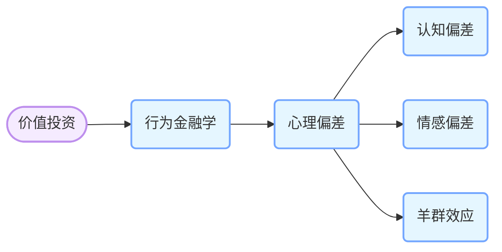

# 价值投资与行为金融学：心理偏差的识别与克服

> 关键词：价值投资、行为金融学、心理偏差、识别、克服

> 摘要：本文深入探讨了价值投资与行为金融学之间的关系，聚焦于心理偏差的识别与克服。首先介绍了价值投资和行为金融学的背景知识，明确研究目的和范围。接着阐述了相关核心概念及它们之间的联系，通过详细的算法原理、数学模型进行深入分析。以实际案例展示了如何在投资中识别和处理心理偏差，还介绍了适用于该领域的工具和资源。最后总结了未来发展趋势与挑战，为投资者在价值投资过程中避免心理偏差提供全面的指导。

## 1. 背景介绍 
### 1.1 目的和范围
在金融投资领域，价值投资一直是一种备受关注的投资策略，它强调基于企业的内在价值进行投资决策。然而，投资者在实际操作中往往会受到各种心理因素的影响，导致投资决策偏离理性。行为金融学正是研究投资者心理和行为对金融市场影响的学科。本文的目的在于探讨价值投资与行为金融学之间的关联，重点分析投资者在价值投资过程中可能出现的心理偏差，并提供有效的识别和克服方法。研究范围涵盖了常见的心理偏差类型、其形成的原因、对价值投资决策的影响，以及相应的应对策略。

### 1.2 预期读者
本文预期读者主要包括对价值投资感兴趣的个人投资者、金融机构的投资从业者、金融专业的学生以及研究行为金融学的学者。无论是初涉投资领域的新手，还是经验丰富的专业人士，都能从本文中获得关于心理偏差识别与克服的有价值信息，从而优化自己的投资决策。

### 1.3 文档结构概述
本文将按照以下结构展开：首先介绍核心概念与联系，明确价值投资、行为金融学和心理偏差的定义及相互关系；接着阐述核心算法原理和具体操作步骤，帮助读者理解如何运用数学方法分析心理偏差；然后通过数学模型和公式进一步深入讲解心理偏差的量化分析；之后通过项目实战展示实际案例和代码实现；再介绍心理偏差在实际投资场景中的应用；随后推荐相关的工具和资源；最后总结未来发展趋势与挑战，并提供常见问题解答和扩展阅读资料。

### 1.4 术语表
#### 1.4.1 核心术语定义
- **价值投资**：一种投资策略，投资者通过分析企业的基本面，如财务状况、盈利能力、竞争优势等，评估企业的内在价值，并在股票价格低于其内在价值时买入，等待价格回归价值时获利。
- **行为金融学**：将心理学、社会学等学科的理论与传统金融学相结合，研究投资者的心理和行为如何影响金融市场的价格形成、交易行为和投资决策的学科。
- **心理偏差**：投资者在投资决策过程中，由于认知、情感等心理因素的影响，偏离理性决策的现象。

#### 1.4.2 相关概念解释
- **认知偏差**：指投资者在获取、处理和解释信息时出现的偏差，如过度自信、代表性偏差、可得性偏差等。
- **情感偏差**：由投资者的情绪和情感因素导致的偏差，如恐惧、贪婪、后悔等。
- **羊群效应**：投资者在投资决策时，受到其他投资者的影响，跟随大众的投资行为，而忽略自己的独立判断。

#### 1.4.3 缩略词列表
- **EMH**：Efficient Market Hypothesis，有效市场假说，认为市场价格已经反映了所有可用的信息，投资者无法通过分析信息获得超额收益。
- **CAPM**：Capital Asset Pricing Model，资本资产定价模型，用于描述资产预期收益率与风险之间的关系。

## 2. 核心概念与联系 

### 2.1 价值投资的原理
价值投资的核心原理基于企业的内在价值。企业的内在价值是其未来现金流的现值，投资者通过对企业的财务报表、行业前景、管理团队等方面进行分析，估算出企业的内在价值。当股票市场价格低于其内在价值时，投资者认为该股票被低估，具有投资价值，从而买入；当市场价格高于内在价值时，认为股票被高估，选择卖出或持有观望。

### 2.2 行为金融学的基本观点
行为金融学认为，传统金融学的有效市场假说和理性人假设在现实中并不完全成立。投资者并非完全理性，他们的决策会受到心理因素的影响。市场也并非总是有效的，存在着各种价格偏离价值的现象。行为金融学通过研究投资者的心理和行为模式，解释了这些市场异常现象的原因。

### 2.3 心理偏差与价值投资的联系
心理偏差会对价值投资决策产生重大影响。例如，过度自信的投资者可能会高估自己对企业内在价值的判断能力，从而在股票价格并未真正低估时就盲目买入；而恐惧和贪婪的情绪可能导致投资者在市场下跌时过度抛售，错过低价买入的机会，或者在市场上涨时追高买入，面临价格回调的风险。因此，识别和克服心理偏差对于价值投资者来说至关重要。

### 2.4 核心概念原理和架构的文本示意图
```plaintext
              价值投资
               |
               | 基于企业内在价值分析
               |
        行为金融学
               |
               | 研究投资者心理行为
               |
         心理偏差
         /     |     \
 认知偏差  情感偏差  羊群效应
```

### 2.5 Mermaid 流程图


## 3. 核心算法原理 & 具体操作步骤 

### 3.1 过度自信偏差的量化分析算法
过度自信偏差表现为投资者高估自己的知识和能力，从而对投资决策过于乐观。我们可以通过比较投资者的预测准确率和实际准确率来量化过度自信偏差。

以下是使用 Python 实现的示例代码：
```python
import numpy as np

# 投资者的预测结果
predictions = np.array([1, 1, 0, 1, 0])  # 1 表示预测上涨，0 表示预测下跌
# 实际市场结果
actual_results = np.array([1, 0, 0, 1, 1])

# 计算预测准确率
prediction_accuracy = np.mean(predictions == actual_results)

# 假设投资者认为自己的准确率为 0.8
self_perceived_accuracy = 0.8

# 计算过度自信偏差
overconfidence_bias = self_perceived_accuracy - prediction_accuracy

print(f"预测准确率: {prediction_accuracy}")
print(f"自我感知准确率: {self_perceived_accuracy}")
print(f"过度自信偏差: {overconfidence_bias}")
```
### 3.2 具体操作步骤
1. **数据收集**：收集投资者的预测结果和实际市场结果数据。
2. **计算预测准确率**：使用上述代码中的方法，计算投资者的实际预测准确率。
3. **确定自我感知准确率**：通过问卷调查或访谈等方式，了解投资者认为自己的预测准确率。
4. **计算过度自信偏差**：用自我感知准确率减去实际预测准确率，得到过度自信偏差值。

### 3.3 代表性偏差的分析算法
代表性偏差是指投资者根据事物的典型特征来判断其发生的概率，而忽略了基本概率。我们可以通过构建一个简单的概率模型来分析代表性偏差。

```python
# 假设事件 A 发生的基本概率为 0.2
base_probability = 0.2

# 投资者根据代表性特征判断事件 A 发生的概率为 0.5
representative_probability = 0.5

# 计算代表性偏差
representativeness_bias = representative_probability - base_probability

print(f"基本概率: {base_probability}")
print(f"代表性判断概率: {representative_probability}")
print(f"代表性偏差: {representativeness_bias}")
```
### 3.4 具体操作步骤
1. **确定基本概率**：通过历史数据或统计分析，确定事件发生的基本概率。
2. **获取代表性判断概率**：了解投资者根据事物的代表性特征判断事件发生的概率。
3. **计算代表性偏差**：用代表性判断概率减去基本概率，得到代表性偏差值。

## 4. 数学模型和公式 & 详细讲解 & 举例说明 

### 4.1 过度自信偏差的数学模型
设投资者的实际预测准确率为 $P_{actual}$，自我感知准确率为 $P_{self}$，则过度自信偏差 $B_{overconfidence}$ 可以表示为：
$$B_{overconfidence} = P_{self} - P_{actual}$$
详细讲解：实际预测准确率是通过比较投资者的预测结果和实际市场结果得到的，它反映了投资者真实的预测能力。自我感知准确率是投资者主观认为自己的预测准确率。两者的差值即为过度自信偏差，当差值为正时，说明投资者存在过度自信的情况。

举例说明：假设投资者在 10 次投资预测中，正确预测了 6 次，则实际预测准确率 $P_{actual} = 0.6$。而投资者认为自己的预测准确率为 0.8，则过度自信偏差 $B_{overconfidence} = 0.8 - 0.6 = 0.2$。

### 4.2 代表性偏差的数学模型
设事件发生的基本概率为 $P_{base}$，投资者根据代表性特征判断的概率为 $P_{representative}$，则代表性偏差 $B_{representativeness}$ 可以表示为：
$$B_{representativeness} = P_{representative} - P_{base}$$
详细讲解：基本概率是基于历史数据或统计分析得到的事件发生的概率，它是客观的。代表性判断概率是投资者根据事物的典型特征主观判断的事件发生概率。两者的差值反映了代表性偏差的大小。

举例说明：假设某股票在过去 100 个交易日中，有 20 个交易日上涨，那么其上涨的基本概率 $P_{base} = 0.2$。投资者看到该股票最近连续三天上涨，认为其接下来上涨的概率为 0.5，则代表性偏差 $B_{representativeness} = 0.5 - 0.2 = 0.3$。

### 4.3 羊群效应的数学模型
羊群效应可以通过投资者的交易行为来量化。设 $N_{total}$ 为总的投资者数量，$N_{follow}$ 为跟随大众交易的投资者数量，则羊群效应强度 $H$ 可以表示为：
$$H = \frac{N_{follow}}{N_{total}}$$
详细讲解：羊群效应强度反映了投资者跟随大众交易的比例。当该比例较高时，说明羊群效应较为明显。

举例说明：假设有 100 个投资者，其中 80 个投资者跟随大众进行了相同方向的交易，则羊群效应强度 $H = \frac{80}{100} = 0.8$，表明羊群效应非常强烈。

## 5. 项目实战：代码实际案例和详细解释说明 

### 5.1  开发环境搭建
#### 5.1.1 安装 Python
首先，确保你已经安装了 Python 环境。可以从 Python 官方网站（https://www.python.org/downloads/）下载适合你操作系统的 Python 版本，并按照安装向导进行安装。

#### 5.1.2 安装必要的库
在本项目中，我们需要使用 `numpy` 库进行数值计算。可以使用以下命令来安装：
```sh
pip install numpy
```

### 5.2  源代码详细实现和代码解读
#### 5.2.1 综合心理偏差分析代码
```python
import numpy as np

# 模拟投资者的预测结果和实际市场结果
predictions = np.array([1, 1, 0, 1, 0, 1, 1, 0, 1, 0])
actual_results = np.array([1, 0, 0, 1, 1, 0, 1, 1, 0, 1])

# 计算预测准确率
prediction_accuracy = np.mean(predictions == actual_results)

# 假设投资者认为自己的准确率为 0.8
self_perceived_accuracy = 0.8

# 计算过度自信偏差
overconfidence_bias = self_perceived_accuracy - prediction_accuracy

# 假设事件 A 发生的基本概率为 0.2
base_probability = 0.2

# 投资者根据代表性特征判断事件 A 发生的概率为 0.5
representative_probability = 0.5

# 计算代表性偏差
representativeness_bias = representative_probability - base_probability

# 模拟投资者数量和跟随大众交易的投资者数量
total_investors = 100
follow_investors = 80

# 计算羊群效应强度
herd_behavior_intensity = follow_investors / total_investors

print(f"预测准确率: {prediction_accuracy}")
print(f"自我感知准确率: {self_perceived_accuracy}")
print(f"过度自信偏差: {overconfidence_bias}")
print(f"基本概率: {base_probability}")
print(f"代表性判断概率: {representative_probability}")
print(f"代表性偏差: {representativeness_bias}")
print(f"羊群效应强度: {herd_behavior_intensity}")
```
#### 5.2.2 代码解读
1. **数据模拟**：使用 `numpy` 数组模拟投资者的预测结果和实际市场结果，以及事件的基本概率和代表性判断概率。
2. **过度自信偏差计算**：通过比较实际预测准确率和自我感知准确率，计算过度自信偏差。
3. **代表性偏差计算**：用代表性判断概率减去基本概率，得到代表性偏差。
4. **羊群效应强度计算**：用跟随大众交易的投资者数量除以总投资者数量，得到羊群效应强度。

### 5.3  代码解读与分析
#### 5.3.1 过度自信偏差分析
从代码中可以看出，过度自信偏差的计算依赖于投资者的实际预测准确率和自我感知准确率。如果投资者的自我感知准确率过高，而实际预测准确率较低，就会产生较大的过度自信偏差。这可能导致投资者在投资决策中过于冒险，忽视风险。

#### 5.3.2 代表性偏差分析
代表性偏差的计算反映了投资者根据代表性特征判断事件概率时与基本概率的差异。较大的代表性偏差可能使投资者做出错误的投资决策，因为他们忽略了基本概率的影响。

#### 5.3.3 羊群效应强度分析
羊群效应强度的计算表明了投资者跟随大众交易的程度。当羊群效应强度较高时，市场可能会出现过度波动，投资者容易受到市场情绪的影响，做出不理性的决策。

## 6. 实际应用场景 
### 6.1 股票投资
在股票投资中，心理偏差会对投资者的决策产生显著影响。例如，过度自信的投资者可能会频繁交易，认为自己能够准确预测股票价格的走势，从而增加交易成本，降低投资收益。代表性偏差可能导致投资者只关注股票的短期表现，而忽略了公司的基本面。羊群效应则可能使投资者在市场上涨时盲目追高，在市场下跌时恐慌抛售。

### 6.2 基金投资
在基金投资中，投资者也容易受到心理偏差的影响。一些投资者可能会根据基金的短期业绩排名来选择基金，而忽略了基金的长期表现和风险特征，这是代表性偏差的表现。过度自信的投资者可能会自行调整基金组合，频繁更换基金，而没有充分考虑投资的长期目标。羊群效应可能导致大量投资者同时涌入或赎回某只基金，影响基金的正常运作。

### 6.3 房地产投资
房地产投资同样存在心理偏差的问题。投资者可能会因为对当地房地产市场的过度熟悉而产生过度自信，高估房产的增值潜力。代表性偏差可能使投资者只看到某一区域房产价格的短期上涨，而忽略了市场供需关系和宏观经济因素的影响。羊群效应可能导致房地产市场出现过热或过冷的现象，投资者跟风购买或抛售房产。

## 7. 工具和资源推荐
### 7.1 学习资源推荐
#### 7.1.1 书籍推荐
- 《聪明的投资者》（The Intelligent Investor）：本杰明·格雷厄姆（Benjamin Graham）著，被誉为价值投资的圣经，详细介绍了价值投资的理念和方法。
- 《思考，快与慢》（Thinking, Fast and Slow）：丹尼尔·卡尼曼（Daniel Kahneman）著，深入探讨了人类的思维方式和认知偏差，对行为金融学的发展产生了重要影响。
- 《行为金融学》：饶育蕾、刘达锋编著，系统介绍了行为金融学的基本理论和应用。

#### 7.1.2 在线课程
- Coursera 上的“Behavioral Finance”课程：由知名教授授课，讲解行为金融学的前沿知识和研究成果。
- edX 上的“Investment Management with Python and Machine Learning”课程：结合 Python 编程和机器学习技术，介绍投资管理的方法和应用。

#### 7.1.3 技术博客和网站
- 雪球网：提供股票、基金等投资领域的资讯和交流平台，投资者可以分享自己的投资经验和观点。
- 量化投资与机器学习论坛：专注于量化投资和机器学习在金融领域的应用，有很多关于心理偏差分析的讨论和案例。

### 7.2 开发工具框架推荐
#### 7.2.1 IDE和编辑器
- PyCharm：一款功能强大的 Python 集成开发环境，提供代码编辑、调试、版本控制等功能，适合开发复杂的投资分析程序。
- Jupyter Notebook：交互式的编程环境，方便进行数据探索和可视化，适合进行投资数据的分析和建模。

#### 7.2.2 调试和性能分析工具
- pdb：Python 内置的调试器，可以帮助开发者定位代码中的错误和问题。
- cProfile：Python 的性能分析工具，可以分析代码的运行时间和资源消耗情况，优化代码性能。

#### 7.2.3 相关框架和库
- Pandas：用于数据处理和分析的 Python 库，提供了丰富的数据结构和函数，方便处理投资数据。
- Matplotlib：用于数据可视化的 Python 库，可以绘制各种图表，直观展示投资数据和分析结果。

### 7.3 相关论文著作推荐
#### 7.3.1 经典论文
- “Prospect Theory: An Analysis of Decision under Risk”：丹尼尔·卡尼曼（Daniel Kahneman）和阿莫斯·特沃斯基（Amos Tversky）发表的论文，提出了前景理论，解释了投资者在面对风险时的决策行为。
- “A Behavioral Model of Rational Choice”：赫伯特·西蒙（Herbert Simon）发表的论文，提出了有限理性的概念，对传统的理性人假设进行了挑战。

#### 7.3.2 最新研究成果
- 关注《Journal of Financial Economics》、《Review of Financial Studies》等金融领域的顶级学术期刊，获取行为金融学的最新研究成果。

#### 7.3.3 应用案例分析
- 一些金融机构和研究机构会发布关于心理偏差在投资中的应用案例分析报告，可以通过互联网搜索获取相关资料。

## 8. 总结：未来发展趋势与挑战
### 8.1 未来发展趋势
#### 8.1.1 技术融合
随着人工智能、大数据和机器学习技术的不断发展，这些技术将与行为金融学更紧密地结合。通过对大量投资者行为数据的分析，可以更准确地识别心理偏差，并开发出更有效的投资策略。

#### 8.1.2 个性化投资
未来的投资服务将更加注重个性化，根据投资者的心理特征和风险偏好，为其提供定制化的投资建议和解决方案。行为金融学将在个性化投资领域发挥重要作用。

#### 8.1.3 跨学科研究
行为金融学将与心理学、社会学、神经科学等学科进行更深入的跨学科研究，从多个角度揭示投资者的心理和行为机制，为金融市场的研究和实践提供更全面的理论支持。

### 8.2 挑战
#### 8.2.1 数据隐私和安全
在收集和分析投资者行为数据时，需要面临数据隐私和安全的挑战。如何在保护投资者隐私的前提下，合法、合规地获取和使用数据，是需要解决的重要问题。

#### 8.2.2 模型的准确性和可靠性
虽然可以通过数学模型和算法来量化心理偏差，但这些模型和算法的准确性和可靠性仍然存在一定的局限性。如何提高模型的准确性，使其更好地反映投资者的实际行为，是未来的研究方向之一。

#### 8.2.3 投资者教育
投资者对心理偏差的认识和理解还不够深入，需要加强投资者教育，提高投资者的心理素质和投资决策能力。如何有效地开展投资者教育，是金融市场健康发展的关键。

## 9. 附录：常见问题与解答
### 9.1 如何判断自己是否存在心理偏差？
可以通过回顾自己的投资决策过程，分析是否存在过度自信、代表性偏差、羊群效应等现象。也可以使用一些量化分析方法，如本文介绍的计算过度自信偏差、代表性偏差等，来判断自己是否存在心理偏差。

### 9.2 克服心理偏差有哪些具体方法？
- **学习和了解行为金融学知识**：通过学习行为金融学的理论和案例，了解常见的心理偏差及其影响，提高自我认知能力。
- **制定投资计划**：明确投资目标、风险承受能力和投资期限，制定详细的投资计划，并严格按照计划执行，避免受到情绪和心理偏差的影响。
- **分散投资**：通过分散投资降低单一资产的风险，减少因心理偏差导致的过度集中投资。
- **定期复盘**：定期回顾自己的投资决策，分析哪些决策受到了心理偏差的影响，总结经验教训，不断改进自己的投资策略。

### 9.3 心理偏差对投资收益的影响有多大？
心理偏差对投资收益的影响程度因人而异，但总体来说，心理偏差可能导致投资者做出错误的投资决策，增加交易成本，降低投资收益。一些研究表明，心理偏差可能使投资者的投资收益降低 10% - 30% 甚至更多。

## 10. 扩展阅读 & 参考资料
### 10.1 扩展阅读
- 《非理性繁荣》（Irrational Exuberance）：罗伯特·席勒（Robert Shiller）著，探讨了金融市场中的非理性行为和泡沫现象。
- 《金融心理学》（Financial Psychology）：拉斯·特维德（Lars Tvede）著，介绍了金融市场中的心理因素和行为规律。

### 10.2 参考资料
- Fama, E. F. (1970). Efficient capital markets: A review of theory and empirical work. The Journal of Finance, 25(2), 383 - 417.
- Kahneman, D., & Tversky, A. (1979). Prospect theory: An analysis of decision under risk. Econometrica: Journal of the Econometric Society, 263 - 291.

作者：AI天才研究院/AI Genius Institute & 禅与计算机程序设计艺术 /Zen And The Art of Computer Programming