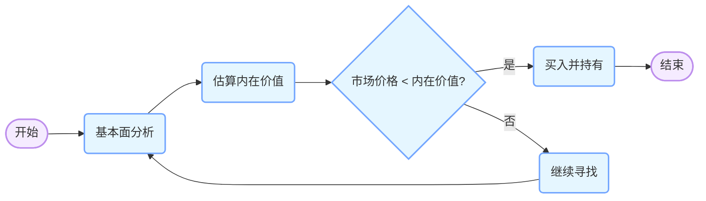

# 价值投资与通货膨胀：保护投资组合购买力的策略

> 关键词：价值投资、通货膨胀、投资组合、购买力保护、投资策略

> 摘要：本文聚焦于价值投资与通货膨胀的关系，旨在探讨如何运用价值投资理念来保护投资组合的购买力。首先介绍了相关背景知识，包括目的范围、预期读者等。接着阐述了价值投资和通货膨胀的核心概念及其联系，详细讲解了相关核心算法原理与操作步骤，并通过数学模型和公式进行深入分析。结合项目实战，给出代码实际案例并详细解释。还探讨了实际应用场景，推荐了学习、开发等方面的工具和资源。最后总结了未来发展趋势与挑战，提供常见问题解答和扩展阅读参考资料，帮助投资者在通货膨胀环境下更好地运用价值投资策略保护资产。

## 1. 背景介绍 
### 1.1 目的和范围
在经济发展过程中，通货膨胀是一个不可忽视的因素，它会对投资组合的实际价值产生影响。本文章的目的在于深入探讨价值投资在应对通货膨胀时的作用，以及如何制定有效的策略来保护投资组合的购买力。范围涵盖了价值投资和通货膨胀的基本概念、相关理论和实践方法，同时通过代码案例和实际应用场景分析，为投资者提供全面的指导。

### 1.2 预期读者
本文预期读者包括对投资领域感兴趣的个人投资者、金融从业者、投资分析师以及相关专业的学生。无论是初涉投资领域的新手，还是有一定经验的专业人士，都能从本文中获取有价值的信息，提升对价值投资和通货膨胀的理解，并掌握保护投资组合购买力的策略。

### 1.3 文档结构概述
本文将按照以下结构展开：首先介绍核心概念与联系，帮助读者理解价值投资和通货膨胀的基本原理和相互关系；接着详细阐述核心算法原理和具体操作步骤，并结合Python代码进行说明；通过数学模型和公式进一步深入分析；然后通过项目实战展示代码实际案例和详细解释；探讨实际应用场景；推荐相关的工具和资源；最后总结未来发展趋势与挑战，提供常见问题解答和扩展阅读参考资料。

### 1.4 术语表
#### 1.4.1 核心术语定义
- **价值投资**：一种投资策略，强调通过分析公司的基本面，如财务状况、盈利能力、竞争优势等，寻找被市场低估的股票，并长期持有，以获得高于市场平均水平的回报。
- **通货膨胀**：指在货币流通条件下，因货币供给大于货币实际需求，也即现实购买力大于产出供给,导致货币贬值，而引起的一段时间内物价持续而普遍地上涨现象。其实质是社会总需求大于社会总供给 。
- **投资组合**：由投资者持有的多种资产组成的集合，包括股票、债券、基金、房地产等，旨在通过分散投资降低风险。
- **购买力**：指单位货币在一定的价格水平下能买到的商品或劳务的数量。

#### 1.4.2 相关概念解释
- **实际收益率**：考虑了通货膨胀因素后的收益率，计算公式为：实际收益率 = （1 + 名义收益率）/（1 + 通货膨胀率） - 1。
- **抗通胀资产**：指在通货膨胀环境下，其价值能够保持相对稳定或增长的资产，如黄金、房地产、通胀保值债券等。

#### 1.4.3 缩略词列表
- **CPI**：消费者物价指数（Consumer Price Index），是反映居民家庭一般所购买的消费品和服务项目价格水平变动情况的宏观经济指标。
- **P/E**：市盈率（Price-to-Earnings Ratio），是指股票价格除以每股收益的比率，用于衡量股票的估值水平。

## 2. 核心概念与联系 

### 价值投资的原理和架构
价值投资的核心原理是基于对公司内在价值的评估。公司的内在价值是指公司未来现金流的现值。投资者通过分析公司的财务报表、行业前景、竞争优势等因素，估算公司的内在价值。如果股票的市场价格低于其内在价值，那么该股票就被认为是被低估的，具有投资价值。

价值投资的架构可以用以下示意图表示：



### 通货膨胀的原理和影响
通货膨胀的原理主要是货币供应量的增加超过了实际经济增长的需求。当市场上货币过多时，物价就会上涨，货币的购买力下降。通货膨胀对经济和投资有多方面的影响：
- **对消费者**：生活成本上升，同样的货币能购买的商品和服务减少。
- **对企业**：原材料成本上升，利润空间可能受到挤压，但也可能通过提高产品价格来转嫁成本。
- **对投资者**：投资组合的实际价值可能下降，如果投资收益率低于通货膨胀率，那么投资者的财富实际上是在缩水。

### 价值投资与通货膨胀的联系
价值投资与通货膨胀之间存在着密切的联系。在通货膨胀环境下，价值投资可以通过以下方式保护投资组合的购买力：
- **选择抗通胀资产**：价值投资者可以选择那些在通货膨胀期间能够保持价值稳定或增长的资产，如具有强大品牌和定价能力的公司股票、房地产等。
- **关注公司的盈利能力**：通货膨胀可能导致企业成本上升，但具有较强盈利能力和竞争优势的公司能够更好地应对成本压力，保持利润增长，从而为投资者带来回报。
- **长期投资**：价值投资强调长期持有，通过长期投资可以平滑通货膨胀的短期波动，实现资产的增值。

## 3. 核心算法原理 & 具体操作步骤 

### 估算公司内在价值的算法原理
估算公司内在价值常用的方法是现金流折现法（Discounted Cash Flow, DCF）。该方法的基本原理是将公司未来的现金流按照一定的折现率折现到当前时刻，得到公司的内在价值。

现金流折现法的Python代码实现如下：

```python
def dcf_valuation(free_cash_flows, discount_rate, terminal_growth_rate):
    """
    现金流折现法估算公司内在价值
    :param free_cash_flows: 未来各期的自由现金流列表
    :param discount_rate: 折现率
    :param terminal_growth_rate: 终值增长率
    :return: 公司的内在价值
    """
    n = len(free_cash_flows)
    present_value = 0
    # 计算各期现金流的现值
    for i, cash_flow in enumerate(free_cash_flows):
        present_value += cash_flow / ((1 + discount_rate) ** (i + 1))
    
    # 计算终值
    last_cash_flow = free_cash_flows[-1]
    terminal_value = last_cash_flow * (1 + terminal_growth_rate) / (discount_rate - terminal_growth_rate)
    terminal_present_value = terminal_value / ((1 + discount_rate) ** n)
    
    # 计算内在价值
    intrinsic_value = present_value + terminal_present_value
    return intrinsic_value

# 示例数据
free_cash_flows = [100, 120, 130, 140, 150]
discount_rate = 0.1
terminal_growth_rate = 0.03

# 计算内在价值
intrinsic_value = dcf_valuation(free_cash_flows, discount_rate, terminal_growth_rate)
print(f"公司的内在价值为: {intrinsic_value}")
```

### 具体操作步骤
1. **收集数据**：收集公司的财务报表，获取未来各期的自由现金流数据。自由现金流是指公司在满足了所有营运成本和资本支出后剩余的现金流量。
2. **确定折现率**：折现率反映了投资者对投资风险的预期。通常可以使用资本资产定价模型（CAPM）来确定折现率。
3. **确定终值增长率**：终值增长率是指公司在预测期结束后的长期增长率。一般可以参考行业的平均增长率来确定。
4. **计算内在价值**：使用现金流折现法公式计算公司的内在价值。
5. **比较市场价格和内在价值**：如果市场价格低于内在价值，那么该股票可能被低估，具有投资价值。

## 4. 数学模型和公式 & 详细讲解 & 举例说明 

### 现金流折现法的数学模型和公式
现金流折现法的数学模型可以表示为：

$$
V = \sum_{t=1}^{n} \frac{FCF_t}{(1 + r)^t} + \frac{FCF_n(1 + g)}{(r - g)(1 + r)^n}
$$

其中：
- $V$ 表示公司的内在价值
- $FCF_t$ 表示第 $t$ 期的自由现金流
- $r$ 表示折现率
- $n$ 表示预测期数
- $g$ 表示终值增长率

### 详细讲解
- **第一部分**：$\sum_{t=1}^{n} \frac{FCF_t}{(1 + r)^t}$ 表示预测期内各期自由现金流的现值之和。通过将未来的现金流按照折现率折现到当前时刻，考虑了货币的时间价值。
- **第二部分**：$\frac{FCF_n(1 + g)}{(r - g)(1 + r)^n}$ 表示终值的现值。终值是指公司在预测期结束后的价值，假设公司的现金流以固定的增长率 $g$ 持续增长。

### 举例说明
假设一家公司未来 5 年的自由现金流分别为 100 万元、120 万元、130 万元、140 万元和 150 万元，折现率为 10%，终值增长率为 3%。

1. 计算预测期内各期自由现金流的现值：
    - 第 1 年：$PV_1 = \frac{100}{(1 + 0.1)^1} \approx 90.91$ 万元
    - 第 2 年：$PV_2 = \frac{120}{(1 + 0.1)^2} \approx 99.17$ 万元
    - 第 3 年：$PV_3 = \frac{130}{(1 + 0.1)^3} \approx 97.67$ 万元
    - 第 4 年：$PV_4 = \frac{140}{(1 + 0.1)^4} \approx 95.62$ 万元
    - 第 5 年：$PV_5 = \frac{150}{(1 + 0.1)^5} \approx 93.14$ 万元

    预测期内现金流现值之和为：$PV = PV_1 + PV_2 + PV_3 + PV_4 + PV_5 \approx 476.51$ 万元

2. 计算终值：
    - 第 5 年的自由现金流为 150 万元，终值为：$TV = \frac{150(1 + 0.03)}{(0.1 - 0.03)} \approx 2207.14$ 万元

3. 计算终值的现值：
    - $PV_{TV} = \frac{2207.14}{(1 + 0.1)^5} \approx 1364.47$ 万元

4. 计算公司的内在价值：
    - $V = PV + PV_{TV} \approx 476.51 + 1364.47 = 1840.98$ 万元

## 5. 项目实战：代码实际案例和详细解释说明 

### 5.1  开发环境搭建
- **操作系统**：推荐使用 Windows、Linux 或 macOS。
- **Python 版本**：建议使用 Python 3.7 及以上版本。
- **安装必要的库**：使用以下命令安装所需的库：
```sh
pip install pandas numpy matplotlib
```

### 5.2  源代码详细实现和代码解读
以下是一个完整的项目实战代码示例，用于分析股票的价值投资和通货膨胀情况：

```python
import pandas as pd
import numpy as np
import matplotlib.pyplot as plt

# 模拟股票价格数据
np.random.seed(0)
dates = pd.date_range(start='2010-01-01', end='2020-12-31', freq='D')
stock_prices = np.random.randn(len(dates)).cumsum() + 100
stock_data = pd.DataFrame({'Stock Price': stock_prices}, index=dates)

# 模拟通货膨胀数据
inflation_rates = np.random.uniform(0.01, 0.05, len(dates))
inflation_data = pd.DataFrame({'Inflation Rate': inflation_rates}, index=dates)

# 计算实际收益率
nominal_returns = stock_data['Stock Price'].pct_change()
real_returns = (1 + nominal_returns) / (1 + inflation_data['Inflation Rate']) - 1

# 绘制股票价格和实际收益率曲线
fig, ax1 = plt.subplots()
ax1.plot(stock_data.index, stock_data['Stock Price'], color='blue', label='Stock Price')
ax1.set_xlabel('Date')
ax1.set_ylabel('Stock Price', color='blue')
ax1.tick_params(axis='y', labelcolor='blue')

ax2 = ax1.twinx()
ax2.plot(real_returns.index, real_returns, color='red', label='Real Return')
ax2.set_ylabel('Real Return', color='red')
ax2.tick_params(axis='y', labelcolor='red')

lines, labels = ax1.get_legend_handles_labels()
lines2, labels2 = ax2.get_legend_handles_labels()
ax2.legend(lines + lines2, labels + labels2, loc='upper left')

plt.title('Stock Price and Real Return with Inflation')
plt.show()

# 筛选被低估的股票
# 假设使用市盈率（P/E）作为估值指标
pe_ratios = np.random.uniform(5, 20, len(dates))
pe_data = pd.DataFrame({'P/E Ratio': pe_ratios}, index=dates)
undervalued_stocks = pe_data[pe_data['P/E Ratio'] < 10]
print("被低估的股票数据：")
print(undervalued_stocks)
```

### 5.3  代码解读与分析
1. **数据模拟**：
    - 使用 `np.random.randn` 和 `np.random.uniform` 函数模拟股票价格和通货膨胀率数据。
    - 使用 `pd.date_range` 生成日期索引。

2. **计算实际收益率**：
    - 首先计算名义收益率，即股票价格的百分比变化。
    - 然后根据实际收益率的计算公式，考虑通货膨胀率计算实际收益率。

3. **绘制图表**：
    - 使用 `matplotlib` 库绘制股票价格和实际收益率的曲线，通过双 Y 轴显示不同的数据。

4. **筛选被低估的股票**：
    - 模拟市盈率数据，使用市盈率作为估值指标。
    - 筛选出市盈率低于 10 的股票，认为这些股票可能被低估。

## 6. 实际应用场景 
### 个人投资者
个人投资者可以运用价值投资策略来保护自己的投资组合免受通货膨胀的影响。例如，通过分析公司的基本面，选择具有稳定现金流和盈利能力的公司股票进行长期投资。同时，可以适当配置一些抗通胀资产，如黄金、房地产等，以分散风险。在通货膨胀期间，个人投资者还可以关注那些能够通过提高产品价格来转嫁成本的公司，如消费必需品行业的公司。

### 机构投资者
机构投资者，如基金公司、保险公司等，通常管理着大量的资金。他们可以通过构建多元化的投资组合，包括股票、债券、房地产等资产，来应对通货膨胀。机构投资者还可以运用专业的分析工具和模型，对投资组合进行动态调整，以实现资产的保值增值。例如，在通货膨胀上升时，增加抗通胀资产的配置比例；在通货膨胀下降时，适当增加股票等风险资产的配置。

### 企业财务管理
企业在进行财务管理时，也需要考虑通货膨胀的影响。企业可以通过价值投资的理念，选择合适的投资项目，提高资金的使用效率。例如，企业可以投资于那些具有核心竞争力和市场份额的企业，以获取长期的收益。同时，企业还可以通过合理的融资策略，降低通货膨胀对企业财务状况的影响。

## 7. 工具和资源推荐
### 7.1 学习资源推荐
#### 7.1.1 书籍推荐
- 《聪明的投资者》（The Intelligent Investor）：本杰明·格雷厄姆（Benjamin Graham）著，被誉为价值投资的圣经，介绍了价值投资的基本理念和方法。
- 《证券分析》（Security Analysis）：本杰明·格雷厄姆和戴维·多德（David Dodd）著，是价值投资领域的经典著作，深入阐述了公司基本面分析的方法。
- 《巴菲特致股东的信》（Letters to Shareholders of Berkshire Hathaway）：沃伦·巴菲特（Warren Buffett）著，通过巴菲特写给股东的信，展示了他的投资理念和策略。

#### 7.1.2 在线课程
- Coursera 上的“投资学原理”（Principles of Investing）课程，由知名教授授课，系统介绍了投资学的基本原理和方法。
- edX 上的“价值投资基础”（Foundations of Value Investing）课程，帮助学习者掌握价值投资的核心概念和分析技巧。

#### 7.1.3 技术博客和网站
- Seeking Alpha：提供大量的投资分析文章和研究报告，涵盖了股票、债券、基金等多个领域。
- Morningstar：是一家知名的投资研究机构，提供基金评级、股票分析等服务，其网站上有丰富的投资资讯和研究成果。

### 7.2 开发工具框架推荐
#### 7.2.1 IDE和编辑器
- PyCharm：是一款专业的 Python 集成开发环境，具有强大的代码编辑、调试和分析功能，适合开发投资分析相关的 Python 代码。
- Jupyter Notebook：是一个交互式的开发环境，支持多种编程语言，非常适合进行数据分析和可视化。

#### 7.2.2 调试和性能分析工具
- pdb：Python 自带的调试工具，可以帮助开发者定位代码中的问题。
- cProfile：Python 的性能分析工具，可以分析代码的运行时间和函数调用情况，帮助优化代码性能。

#### 7.2.3 相关框架和库
- Pandas：是一个强大的数据处理和分析库，提供了丰富的数据结构和函数，方便进行投资数据的处理和分析。
- Numpy：是 Python 的科学计算基础库，提供了高效的数组操作和数学函数，用于数值计算和算法实现。
- Matplotlib：是一个常用的数据可视化库，可以绘制各种类型的图表，帮助投资者直观地展示投资数据。

### 7.3 相关论文著作推荐
#### 7.3.1 经典论文
- Fama, E. F., & French, K. R. (1992). The cross-section of expected stock returns. Journal of Finance, 47(2), 427-465. 该论文提出了著名的 Fama-French 三因子模型，用于解释股票收益率的差异。
- Graham, B., & Dodd, D. L. (1934). Security analysis. McGraw-Hill. 这是价值投资领域的经典著作，对公司基本面分析和估值方法进行了系统阐述。

#### 7.3.2 最新研究成果
- Barro, R. J., & Ursúa, J. F. (2012). Inflation and growth. American Economic Journal: Macroeconomics, 4(1), 1-44. 该论文研究了通货膨胀与经济增长之间的关系。
- Cochrane, J. H. (2017). Asset pricing. Princeton University Press. 本书对资产定价理论进行了全面的介绍和深入的分析。

#### 7.3.3 应用案例分析
- Buffett, W. E. (2008). Letter to shareholders. Berkshire Hathaway. 巴菲特在信中分享了他的投资决策过程和对市场的看法，是非常有价值的应用案例。
- Damodaran, A. (2019). Investment valuation: Tools and techniques for determining the value of any asset. Wiley. 本书通过大量的实际案例，介绍了各种资产的估值方法和应用。

## 8. 总结：未来发展趋势与挑战
### 未来发展趋势
- **数字化投资**：随着科技的发展，数字化投资将成为未来的趋势。投资者可以通过在线平台进行投资，获取更多的投资信息和分析工具。同时，人工智能和机器学习技术也将在投资领域得到更广泛的应用，帮助投资者做出更准确的投资决策。
- **可持续投资**：越来越多的投资者开始关注环境、社会和治理（ESG）因素，可持续投资将成为未来投资的重要方向。投资者将更加注重投资项目的可持续性和社会责任，推动企业实现可持续发展。
- **全球资产配置**：随着全球化的发展，投资者将更加注重全球资产配置。通过投资不同国家和地区的资产，可以分散风险，提高投资组合的收益率。

### 挑战
- **通货膨胀的不确定性**：通货膨胀的走势受到多种因素的影响，如货币政策、经济增长、地缘政治等，具有很大的不确定性。投资者很难准确预测通货膨胀的变化，从而增加了投资决策的难度。
- **市场波动加剧**：全球经济和政治环境的不确定性增加，导致市场波动加剧。投资者需要具备更强的风险承受能力和应对市场波动的能力。
- **技术变革带来的挑战**：虽然数字化投资和人工智能技术为投资者带来了便利，但也带来了新的挑战。例如，数据安全和隐私问题、算法偏见等，需要投资者和监管机构共同应对。

## 9. 附录：常见问题与解答
### 问题 1：价值投资一定能战胜通货膨胀吗？
答：价值投资并不一定能保证在所有情况下都战胜通货膨胀。价值投资的成功取决于多种因素，如投资者对公司基本面的分析能力、市场环境、宏观经济形势等。在某些情况下，即使是采用价值投资策略，投资组合的实际收益率也可能低于通货膨胀率。但是，从长期来看，价值投资通过选择具有内在价值的资产，并长期持有，可以提高战胜通货膨胀的概率。

### 问题 2：如何选择抗通胀资产？
答：选择抗通胀资产可以从以下几个方面考虑：
- **资产的特性**：如黄金具有保值功能，房地产在通货膨胀期间通常能够保持价值稳定或增长。
- **公司的基本面**：选择具有强大品牌和定价能力的公司股票，这些公司能够更好地应对通货膨胀带来的成本上升。
- **宏观经济环境**：根据不同的宏观经济环境，选择适合的抗通胀资产。例如，在通货膨胀上升初期，商品类资产可能表现较好；在通货膨胀稳定期，股票和房地产可能更具优势。

### 问题 3：价值投资和成长投资有什么区别？
答：价值投资和成长投资是两种不同的投资策略。价值投资强调寻找被市场低估的股票，关注公司的当前价值和股息回报；而成长投资则更注重公司的未来增长潜力，愿意为具有高增长预期的公司支付较高的价格。价值投资通常更注重安全性和稳定性，而成长投资则更追求高收益和高风险。

## 10. 扩展阅读 & 参考资料
### 扩展阅读
- 《穷查理宝典》（Poor Charlie's Almanack）：查理·芒格（Charlie Munger）著，介绍了芒格的投资理念和生活智慧。
- 《金融炼金术》（The Alchemy of Finance）：乔治·索罗斯（George Soros）著，探讨了金融市场的运行规律和投资者的心理因素。

### 参考资料
- Graham, B. (1949). The intelligent investor. Harper & Brothers.
- Buffett, W. E. (Annual letters to shareholders). Berkshire Hathaway.
- Damodaran, A. (Online lectures and articles). Stern School of Business, New York University.

作者：AI天才研究院/AI Genius Institute & 禅与计算机程序设计艺术 /Zen And The Art of Computer Programming