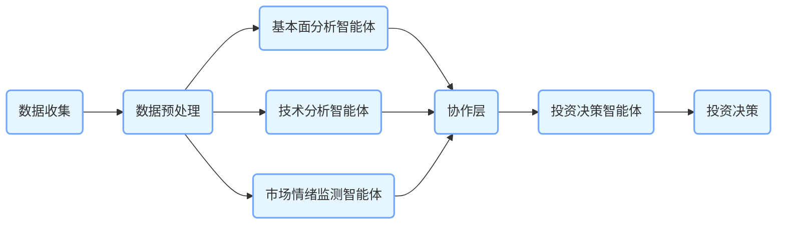

# 价值投资中的AI多智能体协作：超越人类分析师的能力

> 关键词：价值投资、AI多智能体协作、人类分析师、金融市场、数据分析、投资决策、智能算法

> 摘要：本文聚焦于价值投资领域中AI多智能体协作的应用。首先介绍了价值投资的背景以及引入AI多智能体协作的意义。接着详细阐述了AI多智能体的核心概念、架构与工作原理，通过Python代码展示了相关算法原理和具体操作步骤，并结合数学模型与公式深入剖析其理论基础。通过项目实战，展示了AI多智能体协作在实际价值投资中的代码实现与分析。同时探讨了其在不同场景下的实际应用，推荐了相关的学习资源、开发工具和研究论文。最后总结了AI多智能体协作在价值投资中的未来发展趋势与挑战，为投资者和相关从业者提供全面且深入的参考。

## 1. 背景介绍 
### 1.1 目的和范围
价值投资作为一种重要的投资策略，旨在寻找被低估的资产并长期持有以获取收益。然而，传统的价值投资依赖人类分析师，其在面对海量数据、复杂市场动态和情绪因素时存在局限性。本文的目的是探讨如何利用AI多智能体协作来弥补这些不足，提高价值投资决策的准确性和效率。范围涵盖AI多智能体的基本概念、算法原理、数学模型，以及在价值投资中的实际应用案例和未来发展趋势。

### 1.2 预期读者
本文预期读者包括金融投资者、投资分析师、金融科技从业者、计算机科学与人工智能领域的研究人员和学生，以及对价值投资和AI技术结合感兴趣的人士。

### 1.3 文档结构概述
本文首先介绍价值投资和AI多智能体协作的背景知识，包括相关术语的定义。接着阐述AI多智能体的核心概念和联系，展示其架构和工作流程。然后详细讲解核心算法原理和具体操作步骤，结合数学模型和公式进行理论分析。通过项目实战展示AI多智能体协作在价值投资中的代码实现和分析。探讨其在不同场景下的实际应用，推荐相关的学习资源、开发工具和研究论文。最后总结未来发展趋势与挑战，并提供常见问题解答和扩展阅读参考资料。

### 1.4 术语表
#### 1.4.1 核心术语定义
- **价值投资**：一种投资策略，基于对资产内在价值的评估，寻找价格低于内在价值的资产进行投资，强调长期投资和基本面分析。
- **AI多智能体协作**：多个智能体（具有自主决策和行动能力的实体）通过相互通信和协作，共同完成复杂任务的AI技术。
- **智能体**：在特定环境中感知信息、进行决策并采取行动的自主实体。
- **投资决策**：投资者根据各种信息和分析，决定是否买入、持有或卖出资产的过程。

#### 1.4.2 相关概念解释
- **基本面分析**：通过研究公司的财务状况、经营业绩、行业前景等基本面因素，评估资产的内在价值。
- **技术分析**：通过研究资产价格和交易量的历史数据，预测未来价格走势的分析方法。
- **市场情绪**：投资者对市场的整体看法和心理状态，会影响资产价格的波动。

#### 1.4.3 缩略词列表
- **AI**：Artificial Intelligence（人工智能）
- **ML**：Machine Learning（机器学习）
- **RL**：Reinforcement Learning（强化学习）

## 2. 核心概念与联系 

### 2.1 AI多智能体的基本概念
AI多智能体系统由多个智能体组成，每个智能体具有一定的自主性和智能性。智能体可以感知环境信息，根据自身的目标和规则进行决策，并采取相应的行动。多智能体之间通过通信和协作，共同完成复杂的任务。

### 2.2 价值投资与AI多智能体的联系
在价值投资中，AI多智能体可以分别承担不同的任务，如数据收集、基本面分析、技术分析、市场情绪监测等。通过多智能体的协作，可以更全面、准确地评估资产的内在价值，做出更合理的投资决策。例如，一个智能体可以负责收集公司的财务报表和行业数据，另一个智能体可以对这些数据进行分析和建模，还有一个智能体可以监测市场情绪的变化，最后多个智能体通过协作得出投资建议。

### 2.3 核心概念原理和架构的文本示意图
AI多智能体协作在价值投资中的架构可以分为以下几个层次：
- **数据层**：负责收集和存储各种与价值投资相关的数据，包括公司财务数据、市场行情数据、新闻资讯等。
- **智能体层**：由多个不同功能的智能体组成，如数据处理智能体、分析智能体、决策智能体等。每个智能体根据自身的任务和规则对数据进行处理和分析。
- **协作层**：负责协调多个智能体之间的通信和协作，确保它们能够共同完成投资决策任务。
- **决策层**：根据智能体的分析结果和协作信息，做出最终的投资决策。

### 2.4 Mermaid流程图


## 3. 核心算法原理 & 具体操作步骤 

### 3.1 数据处理智能体算法原理
数据处理智能体的主要任务是收集、清洗和预处理投资相关的数据。以下是一个简单的Python代码示例，展示如何使用`pandas`库进行数据清洗和预处理：
```python
import pandas as pd

def data_preprocessing(data):
    # 处理缺失值
    data = data.dropna()
    
    # 处理异常值
    q1 = data.quantile(0.25)
    q3 = data.quantile(0.75)
    iqr = q3 - q1
    data = data[~((data < (q1 - 1.5 * iqr)) | (data > (q3 + 1.5 * iqr)))]
    
    # 数据标准化
    data = (data - data.mean()) / data.std()
    
    return data

# 示例数据
data = pd.DataFrame({
    'price': [100, 102, 105, 103, 108, 110, 106],
    'volume': [1000, 1200, 1500, 1300, 1800, 2000, 1600]
})

processed_data = data_preprocessing(data)
print(processed_data)
```
### 3.2 基本面分析智能体算法原理
基本面分析智能体主要根据公司的财务数据和行业信息，评估公司的内在价值。常用的方法包括市盈率（P/E）、市净率（P/B）、股息率等指标的计算。以下是一个简单的Python代码示例，计算市盈率和市净率：
```python
def fundamental_analysis(financial_data):
    price = financial_data['price']
    earnings_per_share = financial_data['earnings_per_share']
    book_value_per_share = financial_data['book_value_per_share']
    
    pe_ratio = price / earnings_per_share
    pb_ratio = price / book_value_per_share
    
    return pe_ratio, pb_ratio

# 示例财务数据
financial_data = {
    'price': 100,
    'earnings_per_share': 5,
    'book_value_per_share': 20
}

pe, pb = fundamental_analysis(financial_data)
print(f"市盈率: {pe}, 市净率: {pb}")
```
### 3.3 技术分析智能体算法原理
技术分析智能体主要根据资产价格和交易量的历史数据，预测未来价格走势。常用的技术分析方法包括移动平均线、相对强弱指数（RSI）等。以下是一个简单的Python代码示例，计算移动平均线：
```python
import pandas as pd

def moving_average(data, window):
    return data.rolling(window=window).mean()

# 示例数据
data = pd.Series([100, 102, 105, 103, 108, 110, 106])
ma_5 = moving_average(data, 5)
print(ma_5)
```
### 3.4 市场情绪监测智能体算法原理
市场情绪监测智能体主要通过分析新闻资讯、社交媒体等文本数据，了解投资者的情绪状态。常用的方法包括自然语言处理（NLP）技术，如情感分析。以下是一个简单的Python代码示例，使用`TextBlob`库进行情感分析：
```python
from textblob import TextBlob

def sentiment_analysis(text):
    blob = TextBlob(text)
    sentiment = blob.sentiment.polarity
    return sentiment

# 示例文本
text = "股票市场前景乐观，投资者信心增强。"
sentiment = sentiment_analysis(text)
print(f"情感极性: {sentiment}")
```
### 3.5 投资决策智能体算法原理
投资决策智能体根据其他智能体的分析结果，综合考虑各种因素，做出最终的投资决策。可以使用机器学习算法，如决策树、支持向量机等，进行投资决策的建模。以下是一个简单的Python代码示例，使用决策树进行投资决策：
```python
from sklearn.tree import DecisionTreeClassifier
import numpy as np

# 示例数据
X = np.array([[10, 20, 0.5], [15, 25, 0.6], [20, 30, 0.7]])
y = np.array([0, 1, 1])

# 训练决策树模型
model = DecisionTreeClassifier()
model.fit(X, y)

# 预测投资决策
new_data = np.array([[12, 22, 0.55]])
prediction = model.predict(new_data)
print(f"投资决策: {prediction}")
```

## 4. 数学模型和公式 & 详细讲解 & 举例说明 

### 4.1 市盈率（P/E）模型
市盈率（P/E）是衡量公司股票价格相对于每股盈利的指标，计算公式为：
$$ P/E = \frac{股价}{每股盈利} $$
其中，股价是指公司股票的当前市场价格，每股盈利是指公司每股股票的盈利金额。例如，某公司股票的当前价格为100元，每股盈利为5元，则该公司的市盈率为：
$$ P/E = \frac{100}{5} = 20 $$
一般来说，市盈率较低的公司可能被低估，具有投资价值；而市盈率较高的公司可能被高估，投资风险较大。

### 4.2 市净率（P/B）模型
市净率（P/B）是衡量公司股票价格相对于每股净资产的指标，计算公式为：
$$ P/B = \frac{股价}{每股净资产} $$
其中，股价是指公司股票的当前市场价格，每股净资产是指公司每股股票的净资产金额。例如，某公司股票的当前价格为100元，每股净资产为20元，则该公司的市净率为：
$$ P/B = \frac{100}{20} = 5 $$
一般来说，市净率较低的公司可能被低估，具有投资价值；而市净率较高的公司可能被高估，投资风险较大。

### 4.3 移动平均线（MA）模型
移动平均线（MA）是一种常用的技术分析工具，用于平滑价格数据，反映价格的趋势。计算公式为：
$$ MA(n) = \frac{\sum_{i=0}^{n-1} P_{t-i}}{n} $$
其中，$MA(n)$ 表示 $n$ 期移动平均线的值，$P_{t-i}$ 表示第 $t-i$ 期的价格，$n$ 表示移动平均线的周期。例如，计算5期移动平均线，假设最近5期的价格分别为100、102、105、103、108，则5期移动平均线的值为：
$$ MA(5) = \frac{100 + 102 + 105 + 103 + 108}{5} = 103.6 $$
移动平均线可以帮助投资者判断价格的趋势，当短期移动平均线向上穿过长期移动平均线时，通常被视为买入信号；当短期移动平均线向下穿过长期移动平均线时，通常被视为卖出信号。

### 4.4 相对强弱指数（RSI）模型
相对强弱指数（RSI）是一种衡量证券价格变动幅度的技术指标，计算公式为：
$$ RSI = 100 - \frac{100}{1 + RS} $$
其中，$RS$ 表示相对强度，计算公式为：
$$ RS = \frac{平均上涨幅度}{平均下跌幅度} $$
例如，假设某证券在最近14个交易日中，平均上涨幅度为5元，平均下跌幅度为3元，则相对强度为：
$$ RS = \frac{5}{3} \approx 1.67 $$
相对强弱指数为：
$$ RSI = 100 - \frac{100}{1 + 1.67} \approx 62.5 $$
一般来说，RSI值在70以上表示超买，可能存在价格回调的风险；RSI值在30以下表示超卖，可能存在价格反弹的机会。

### 4.5 决策树模型
决策树是一种常用的机器学习算法，用于分类和回归问题。决策树的基本思想是通过对特征进行划分，构建一个树形结构的分类器。决策树的节点表示特征，分支表示特征的取值，叶子节点表示分类结果。决策树的构建过程可以使用信息增益、基尼指数等指标来选择最优的特征划分。例如，假设有一个投资决策问题，特征包括市盈率、市净率和市场情绪，分类结果为买入、持有和卖出。可以使用决策树算法对历史数据进行训练，构建一个决策树模型，用于预测未来的投资决策。

## 5. 项目实战：代码实际案例和详细解释说明 

### 5.1  开发环境搭建
- **操作系统**：推荐使用Windows、Linux或macOS。
- **Python版本**：推荐使用Python 3.7及以上版本。
- **开发工具**：推荐使用PyCharm、Jupyter Notebook等。
- **所需库**：安装`pandas`、`numpy`、`scikit-learn`、`textblob`等库，可以使用以下命令进行安装：
```sh
pip install pandas numpy scikit-learn textblob
```

### 5.2  源代码详细实现和代码解读
以下是一个完整的AI多智能体协作在价值投资中的代码示例：
```python
import pandas as pd
import numpy as np
from sklearn.tree import DecisionTreeClassifier
from textblob import TextBlob

# 数据处理智能体
def data_preprocessing(data):
    # 处理缺失值
    data = data.dropna()
    
    # 处理异常值
    q1 = data.quantile(0.25)
    q3 = data.quantile(0.75)
    iqr = q3 - q1
    data = data[~((data < (q1 - 1.5 * iqr)) | (data > (q3 + 1.5 * iqr)))]
    
    # 数据标准化
    data = (data - data.mean()) / data.std()
    
    return data

# 基本面分析智能体
def fundamental_analysis(financial_data):
    price = financial_data['price']
    earnings_per_share = financial_data['earnings_per_share']
    book_value_per_share = financial_data['book_value_per_share']
    
    pe_ratio = price / earnings_per_share
    pb_ratio = price / book_value_per_share
    
    return pe_ratio, pb_ratio

# 技术分析智能体
def moving_average(data, window):
    return data.rolling(window=window).mean()

# 市场情绪监测智能体
def sentiment_analysis(text):
    blob = TextBlob(text)
    sentiment = blob.sentiment.polarity
    return sentiment

# 投资决策智能体
def investment_decision(pe_ratio, pb_ratio, sentiment):
    X = np.array([[pe_ratio, pb_ratio, sentiment]])
    # 示例训练数据
    X_train = np.array([[10, 20, 0.5], [15, 25, 0.6], [20, 30, 0.7]])
    y_train = np.array([0, 1, 1])
    
    # 训练决策树模型
    model = DecisionTreeClassifier()
    model.fit(X_train, y_train)
    
    # 预测投资决策
    prediction = model.predict(X)
    return prediction

# 示例数据
financial_data = {
    'price': 100,
    'earnings_per_share': 5,
    'book_value_per_share': 20
}
text = "股票市场前景乐观，投资者信心增强。"
price_data = pd.Series([100, 102, 105, 103, 108, 110, 106])

# 数据处理
processed_price_data = data_preprocessing(price_data)

# 基本面分析
pe, pb = fundamental_analysis(f