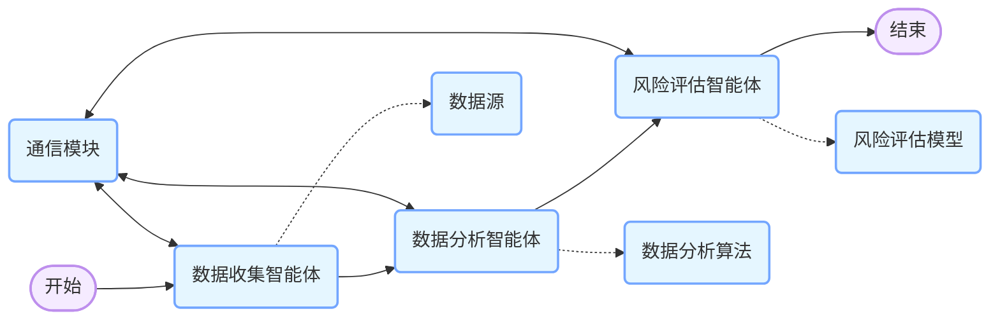

# 价值投资中的AI尽职调查：多智能体系统的全方位分析

> 关键词：价值投资、AI尽职调查、多智能体系统、全方位分析、金融科技

> 摘要：本文围绕价值投资中的AI尽职调查展开，深入探讨多智能体系统在其中的应用。详细介绍了相关背景知识，包括目的、预期读者等内容。对多智能体系统的核心概念和联系进行了剖析，阐述其原理与架构，并通过Mermaid流程图展示。讲解了核心算法原理及具体操作步骤，运用Python代码进行说明。分析了相关数学模型和公式，并举例阐释。通过项目实战案例，展示代码实现和解读。探讨了该技术在实际中的应用场景，推荐了学习、开发等相关的工具和资源。最后总结未来发展趋势与挑战，解答常见问题并提供扩展阅读和参考资料，旨在为价值投资中的AI尽职调查提供全面且深入的技术分析。

## 1. 背景介绍 
### 1.1 目的和范围
在价值投资领域，尽职调查是至关重要的环节，它有助于投资者全面了解投资目标的真实状况，降低投资风险。传统的尽职调查方式往往依赖人工收集和分析大量的数据，效率低下且容易出现疏漏。随着人工智能技术的发展，AI尽职调查逐渐成为研究和应用的热点。本文章的目的是深入探讨多智能体系统在价值投资AI尽职调查中的应用，通过全方位的分析，揭示其原理、实现方法和应用价值。

本文的范围涵盖了多智能体系统的核心概念、算法原理、数学模型，以及在实际项目中的应用案例。同时，还会介绍相关的工具和资源，为读者提供全面的学习和实践指导。

### 1.2 预期读者
本文预期读者包括价值投资领域的投资者、金融分析师、人工智能研究者和开发者。对于投资者和金融分析师来说，了解多智能体系统在AI尽职调查中的应用可以帮助他们更好地评估投资目标，做出更明智的投资决策。对于人工智能研究者和开发者来说，本文提供了一个具体的应用场景，有助于他们深入研究多智能体系统的理论和技术，并将其应用到实际项目中。

### 1.3 文档结构概述
本文将按照以下结构进行组织：
1. 背景介绍：阐述文章的目的、范围、预期读者和文档结构概述，以及相关术语的定义和解释。
2. 核心概念与联系：介绍多智能体系统的核心概念、原理和架构，通过文本示意图和Mermaid流程图展示其联系。
3. 核心算法原理 & 具体操作步骤：讲解多智能体系统在AI尽职调查中的核心算法原理，使用Python代码详细阐述具体操作步骤。
4. 数学模型和公式 & 详细讲解 & 举例说明：分析相关的数学模型和公式，通过具体例子进行详细讲解。
5. 项目实战：代码实际案例和详细解释说明：通过一个实际项目案例，展示多智能体系统在AI尽职调查中的代码实现和详细解读。
6. 实际应用场景：探讨多智能体系统在价值投资AI尽职调查中的实际应用场景。
7. 工具和资源推荐：推荐学习、开发和研究相关的工具和资源，包括书籍、在线课程、技术博客、开发工具框架和相关论文著作。
8. 总结：未来发展趋势与挑战：总结多智能体系统在价值投资AI尽职调查中的应用现状，分析未来发展趋势和面临的挑战。
9. 附录：常见问题与解答：解答读者在阅读过程中可能遇到的常见问题。
10. 扩展阅读 & 参考资料：提供相关的扩展阅读材料和参考资料，方便读者进一步深入学习。

### 1.4 术语表
#### 1.4.1 核心术语定义
- **价值投资**：一种投资策略，投资者通过分析公司的基本面，如财务状况、行业竞争力等，寻找被低估的股票进行投资，以期获得长期的资本增值。
- **AI尽职调查**：利用人工智能技术对投资目标进行全面、深入的调查和分析，以评估其投资价值和风险。
- **多智能体系统（Multi-Agent System, MAS）**：由多个智能体组成的系统，每个智能体具有一定的自主性和智能，能够通过相互协作和交互来完成复杂的任务。
- **智能体（Agent）**：具有感知、决策和行动能力的实体，能够根据环境的变化自主地做出决策并执行相应的行动。

#### 1.4.2 相关概念解释
- **自主性**：智能体能够独立地感知环境、做出决策和执行行动，不受外部直接控制。
- **协作性**：多个智能体之间能够通过通信和协调，共同完成一个或多个任务。
- **适应性**：智能体能够根据环境的变化和自身的经验，调整自己的行为和策略。

#### 1.4.3 缩略词列表
- **MAS**：Multi-Agent System，多智能体系统
- **AI**：Artificial Intelligence，人工智能

## 2. 核心概念与联系 

### 核心概念原理
多智能体系统的核心原理基于分布式人工智能的思想，将复杂的任务分解为多个子任务，每个子任务由一个或多个智能体负责处理。智能体之间通过通信和协作来交换信息、协调行动，共同完成整个任务。

在价值投资的AI尽职调查中，多智能体系统可以由多个不同类型的智能体组成，例如数据收集智能体、数据分析智能体、风险评估智能体等。数据收集智能体负责从各种数据源收集与投资目标相关的数据，如财务报表、行业报告、新闻资讯等。数据分析智能体对收集到的数据进行清洗、预处理和分析，提取有价值的信息和特征。风险评估智能体根据分析结果对投资目标的风险进行评估，并给出相应的建议。

### 架构的文本示意图
```plaintext
多智能体系统
|-- 数据收集智能体
|   |-- 数据源1（财务报表）
|   |-- 数据源2（行业报告）
|   |-- 数据源3（新闻资讯）
|-- 数据分析智能体
|   |-- 数据清洗模块
|   |-- 数据预处理模块
|   |-- 数据分析算法（机器学习、深度学习等）
|-- 风险评估智能体
|   |-- 风险评估模型
|   |-- 评估结果输出
|-- 通信模块
    |-- 智能体之间的通信
    |-- 与外部系统的通信
```

### Mermaid流程图


在这个流程图中，整个多智能体系统的工作流程从数据收集开始，经过数据分析，最后进行风险评估。通信模块负责智能体之间以及与外部系统的通信，确保信息的流通和协作的顺利进行。

## 3. 核心算法原理 & 具体操作步骤 

### 核心算法原理
在多智能体系统的AI尽职调查中，涉及到多种核心算法，其中机器学习和深度学习算法是常用的数据分析工具。以下以一个简单的线性回归算法为例，说明如何使用机器学习算法进行数据分析。

线性回归是一种用于建立自变量和因变量之间线性关系的统计模型。在价值投资的尽职调查中，我们可以使用线性回归来分析公司的财务指标（如营业收入、净利润等）与股票价格之间的关系。

线性回归的数学模型可以表示为：

$$y = \beta_0 + \beta_1x_1 + \beta_2x_2 + \cdots + \beta_nx_n + \epsilon$$

其中，$y$ 是因变量（如股票价格），$x_1, x_2, \cdots, x_n$ 是自变量（如财务指标），$\beta_0, \beta_1, \beta_2, \cdots, \beta_n$ 是回归系数，$\epsilon$ 是误差项。

我们的目标是通过最小化误差项的平方和来估计回归系数 $\beta_0, \beta_1, \beta_2, \cdots, \beta_n$，这就是最小二乘法。

### 具体操作步骤及Python代码实现

#### 步骤1：数据收集和预处理
首先，我们需要收集与投资目标相关的数据，并进行清洗和预处理。以下是一个简单的Python代码示例，使用`pandas`库来读取和处理数据：

```python
import pandas as pd

# 读取数据
data = pd.read_csv('financial_data.csv')

# 处理缺失值
data = data.dropna()

# 分离自变量和因变量
X = data[['revenue', 'profit']]
y = data['stock_price']
```

#### 步骤2：数据划分
将数据集划分为训练集和测试集，用于模型的训练和评估。

```python
from sklearn.model_selection import train_test_split

# 划分训练集和测试集
X_train, X_test, y_train, y_test = train_test_split(X, y, test_size=0.2, random_state=42)
```

#### 步骤3：模型训练
使用`sklearn`库中的`LinearRegression`模型进行训练。

```python
from sklearn.linear_model import LinearRegression

# 创建线性回归模型
model = LinearRegression()

# 训练模型
model.fit(X_train, y_train)
```

#### 步骤4：模型评估
使用测试集对训练好的模型进行评估。

```python
from sklearn.metrics import mean_squared_error, r2_score

# 预测测试集
y_pred = model.predict(X_test)

# 计算均方误差和决定系数
mse = mean_squared_error(y_test, y_pred)
r2 = r2_score(y_test, y_pred)

print(f"均方误差: {mse}")
print(f"决定系数: {r2}")
```

#### 步骤5：结果分析
根据模型评估的结果，分析模型的性能和预测能力。如果均方误差较小，决定系数接近1，则说明模型的拟合效果较好。

通过以上步骤，我们可以使用线性回归算法对投资目标的财务数据进行分析，从而为价值投资的尽职调查提供有价值的信息。

## 4. 数学模型和公式 & 详细讲解 & 举例说明 

### 线性回归数学模型和公式
如前面所述，线性回归的数学模型为：

$$y = \beta_0 + \beta_1x_1 + \beta_2x_2 + \cdots + \beta_nx_n + \epsilon$$

其中，$y$ 是因变量，$x_1, x_2, \cdots, x_n$ 是自变量，$\beta_0, \beta_1, \beta_2, \cdots, \beta_n$ 是回归系数，$\epsilon$ 是误差项。

最小二乘法的目标是最小化误差项的平方和，即：

$$\min_{\beta_0, \beta_1, \cdots, \beta_n} \sum_{i=1}^{m} (y_i - (\beta_0 + \beta_1x_{i1} + \beta_2x_{i2} + \cdots + \beta_nx_{in}))^2$$

其中，$m$ 是样本数量，$y_i$ 是第 $i$ 个样本的因变量值，$x_{i1}, x_{i2}, \cdots, x_{in}$ 是第 $i$ 个样本的自变量值。

### 详细讲解
最小二乘法的原理是通过找到一组回归系数 $\beta_0, \beta_1, \cdots, \beta_n$，使得预测值与实际值之间的误差平方和最小。这样可以使模型尽可能地拟合数据，提高预测的准确性。

在实际计算中，我们可以使用矩阵运算来求解回归系数。将线性回归模型表示为矩阵形式：

$$\mathbf{y} = \mathbf{X}\boldsymbol{\beta} + \boldsymbol{\epsilon}$$

其中，$\mathbf{y}$ 是 $m \times 1$ 的因变量向量，$\mathbf{X}$ 是 $m \times (n + 1)$ 的自变量矩阵（第一列全为1，对应 $\beta_0$），$\boldsymbol{\beta}$ 是 $(n + 1) \times 1$ 的回归系数向量，$\boldsymbol{\epsilon}$ 是 $m \times 1$ 的误差向量。

最小二乘法的解为：

$$\hat{\boldsymbol{\beta}} = (\mathbf{X}^T\mathbf{X})^{-1}\mathbf{X}^T\mathbf{y}$$

其中，$\hat{\boldsymbol{\beta}}$ 是回归系数的估计值，$\mathbf{X}^T$ 是 $\mathbf{X}$ 的转置矩阵，$(\mathbf{X}^T\mathbf{X})^{-1}$ 是 $\mathbf{X}^T\mathbf{X}$ 的逆矩阵。

### 举例说明
假设我们有以下数据集：

| 营业收入（$x_1$） | 净利润（$x_2$） | 股票价格（$y$） |
| --- | --- | --- |
| 100 | 20 | 50 |
| 200 | 30 | 60 |
| 300 | 40 | 70 |
| 400 | 50 | 80 |
| 500 | 60 | 90 |

我们可以使用线性回归来分析营业收入和净利润与股票价格之间的关系。

首先，将数据集表示为矩阵形式：

$$\mathbf{X} = \begin{bmatrix}
1 & 100 & 20 \\
1 & 200 & 30 \\
1 & 300 & 40 \\
1 & 400 & 50 \\
1 & 500 & 60
\end{bmatrix}$$

$$\mathbf{y} = \begin{bmatrix}
50 \\
60 \\
70 \\
80 \\
90
\end{bmatrix}$$

然后，计算 $\mathbf{X}^T\mathbf{X}$ 和 $\mathbf{X}^T\mathbf{y}$：

$$\mathbf{X}^T\mathbf{X} = \begin{bmatrix}
5 & 1500 & 200 \\
1500 & 550000 & 70000 \\
200 & 70000 & 9000
\end{bmatrix}$$

$$\mathbf{X}^T\mathbf{y} = \begin{bmatrix}
350 \\
135000 \\
19000
\end{bmatrix}$$

接着，计算 $(\mathbf{X}^T\mathbf{X})^{-1}$：

```python
import numpy as np

X = np.array([[1, 100, 20], [1, 200, 30], [1, 300, 40], [1, 400, 50], [1, 500, 60]])
y = np.array([50, 60, 70, 80, 90])

XTX = np.dot(X.T, X)
XTy = np.dot(X.T, y)

XTX_inv = np.linalg.inv(XTX)
```

最后，计算回归系数的估计值：

```python
beta_hat = np.dot(XTX_inv, XTy)
print(beta_hat)
```

通过以上计算，我们可以得到回归系数的估计值，从而建立线性回归模型。

## 5. 项目实战：代码实际案例和详细解释说明 

### 5.1  开发环境搭建
在进行项目实战之前，我们需要搭建开发环境。以下是具体步骤：

#### 安装Python
首先，确保你已经安装了Python。建议使用Python 3.7及以上版本。你可以从Python官方网站（https://www.python.org/downloads/）下载并安装Python。

#### 安装必要的库
我们需要安装一些必要的Python库，如`pandas`、`numpy`、`scikit-learn`等。可以使用`pip`命令进行安装：

```sh
pip install pandas numpy scikit-learn
```

### 5.2  源代码详细实现和代码解读
以下是一个完整的多智能体系统在AI尽职调查中的代码示例，使用线性回归算法进行数据分析：

```python
import pandas as pd
import numpy as np
from sklearn.model_selection import train_test_split
from sklearn.linear_model import LinearRegression
from sklearn.metrics import mean_squared_error, r2_score

# 数据收集智能体
class DataCollectionAgent:
    def __init__(self, file_path):
        self.file_path = file_path

    def collect_data(self):
        # 读取数据
        data = pd.read_csv(self.file_path)
        return data

# 数据分析智能体
class DataAnalysisAgent:
    def __init__(self):
        pass

    def preprocess_data(self, data):
        # 处理缺失值
        data = data.dropna()
        # 分离自变量和因变量
        X = data[['revenue', 'profit']]
        y = data['stock_price']
        return X, y

    def split_data(self, X, y):
        # 划分训练集和测试集
        X_train, X_test, y_train, y_test = train_test_split(X, y, test_size=0.2, random_state=42)
        return X_train, X_test, y_train, y_test

    def train_model(self, X_train, y_train):
        # 创建线性回归模型
        model = LinearRegression()
        # 训练模型
        model.fit(X_train, y_train)
        return model

    def evaluate_model(self, model, X_test, y_test):
        # 预测测试集
        y_pred = model.predict(X_test)
        # 计算均方误差和决定系数
        mse = mean_squared_error(y_test, y_pred)
        r2 = r2_score(y_test, y_pred)
        return mse, r2

# 风险评估智能体
class RiskAssessmentAgent:
    def __init__(self):
        pass

    def assess_risk(self, mse, r2):
        if mse < 10 and r2 > 0.8:
            risk_level = '低'
        elif mse < 20 and r2 > 0.6:
            risk_level = '中'
        else:
            risk_level = '高'
        return risk_level

# 主程序
if __name__ == "__main__":
    # 数据收集
    data_collection_agent = DataCollectionAgent('financial_data.csv')
    data = data_collection_agent.collect_data()

    # 数据分析
    data_analysis_agent = DataAnalysisAgent()
    X, y = data_analysis_agent.preprocess_data(data)
    X_train, X_test, y_train, y_test = data_analysis_agent.split_data(X, y)
    model = data_analysis_agent.train_model(X_train, y_train)
    mse, r2 = data_analysis_agent.evaluate_model(model, X_test, y_test)

    # 风险评估
    risk_assessment_agent = RiskAssessmentAgent()
    risk_level = risk_assessment_agent.assess_risk(mse, r2)

    print(f"均方误差: {mse}")
    print(f"决定系数: {r2}")
    print(f"风险等级: {risk_level}")
```

### 5.3  代码解读与分析
#### 数据收集智能体（DataCollectionAgent）
- `__init__` 方法：初始化数据收集智能体，接收数据文件的路径作为参数。
- `collect_data` 方法：使用`pandas`库读取数据文件，并返回数据。

#### 数据分析智能体（DataAnalysisAgent）
- `preprocess_data` 方法：对数据进行预处理，包括处理缺失值和分离自变量和因变量。
- `split_data` 方法：将数据集划分为训练集和测试集。
- `train_model` 方法：创建线性回归模型并进行训练。
- `evaluate_model` 方法：使用测试集对训练好的模型进行评估，计算均方误差和决定系数。

#### 风险评估智能体（RiskAssessmentAgent）
- `assess_risk` 方法：根据均方误差和决定系数评估投资目标的风险等级。

#### 主程序
在主程序中，我们依次调用数据收集智能体、数据分析智能体和风险评估智能体的方法，完成数据收集、分析和风险评估的整个流程。最后输出模型评估的结果和风险等级。

通过这个项目实战，我们可以看到多智能体系统在价值投资AI尽职调查中的具体应用，各个智能体分工协作，共同完成复杂的任务。

## 6. 实际应用场景 
### 投资组合优化
在价值投资中，投资者通常会构建投资组合来分散风险。多智能体系统可以用于投资组合的优化，通过对不同投资目标的尽职调查，评估其风险和收益特征，然后根据投资者的风险偏好和投资目标，自动调整投资组合的权重。例如，数据收集智能体可以收集各个投资目标的财务数据、市场数据等，数据分析智能体对这些数据进行分析，计算出每个投资目标的预期收益和风险指标，风险评估智能体根据这些指标评估投资组合的整体风险，最后根据评估结果调整投资组合的权重，以实现最优的风险-收益平衡。

### 企业并购尽职调查
在企业并购过程中，尽职调查是非常重要的环节。多智能体系统可以帮助投资者全面了解目标企业的情况，包括财务状况、经营管理、市场竞争力等。数据收集智能体可以从多个渠道收集目标企业的相关信息，如财务报表、行业报告、新闻资讯等。数据分析智能体对这些信息进行分析，识别潜在的风险和问题，如财务造假、法律纠纷等。风险评估智能体根据分析结果评估并购的风险，并提供相应的建议。通过多智能体系统的全方位分析，可以提高企业并购尽职调查的效率和准确性，降低并购风险。

### 新兴市场投资分析
新兴市场通常具有较高的投资潜力，但也伴随着较高的风险。多智能体系统可以用于新兴市场的投资分析，帮助投资者了解新兴市场的特点和趋势，评估投资机会和风险。数据收集智能体可以收集新兴市场的宏观经济数据、行业数据、政策法规等信息。数据分析智能体对这些信息进行分析，挖掘潜在的投资机会和风险因素。风险评估智能体根据分析结果评估投资的风险等级，并提供相应的投资建议。通过多智能体系统的分析，投资者可以更好地把握新兴市场的投资机会，降低投资风险。

## 7. 工具和资源推荐
### 7.1 学习资源推荐
#### 7.1.1 书籍推荐
- 《人工智能：一种现代的方法》（Artificial Intelligence: A Modern Approach）：这是一本经典的人工智能教材，涵盖了人工智能的各个领域，包括多智能体系统。书中详细介绍了多智能体系统的基本概念、算法和应用，适合初学者和有一定基础的读者阅读。
- 《机器学习》（Machine Learning）：由周志华教授编写的一本机器学习教材，系统地介绍了机器学习的基本概念、算法和应用。书中包含了线性回归、逻辑回归、决策树等多种机器学习算法的详细讲解，对于理解多智能体系统中的数据分析算法有很大的帮助。
- 《Python数据分析实战》（Python Data Analysis Cookbook）：这本书以实际案例为导向，介绍了如何使用Python进行数据分析。书中包含了数据处理、数据可视化、机器学习等方面的内容，适合想要使用Python进行数据分析的读者阅读。

#### 7.1.2 在线课程
- Coursera上的“人工智能基础”（Fundamentals of Artificial Intelligence）课程：该课程由知名高校的教授授课，系统地介绍了人工智能的基本概念、算法和应用。课程内容包括搜索算法、机器学习、多智能体系统等，适合初学者学习。
- edX上的“机器学习”（Machine Learning）课程：由斯坦福大学的教授授课，是一门非常经典的机器学习课程。课程内容包括线性回归、逻辑回归、神经网络等多种机器学习算法的详细讲解，通过大量的实例和编程作业帮助学生掌握机器学习的基本技能。
- 中国大学MOOC上的“Python语言程序设计”（Python Programming）课程：该课程由国内知名高校的教授授课，适合零基础的学习者学习Python语言。课程内容包括Python的基本语法、数据结构、函数、面向对象编程等，为后续使用Python进行数据分析和人工智能开发打下基础。

#### 7.1.3 技术博客和网站
- Medium：一个知名的技术博客平台，上面有很多关于人工智能、机器学习和多智能体系统的优质文章。可以关注一些知名的博主，如Towards Data Science、AI in Plain English等，获取最新的技术动态和研究成果。
- GitHub：一个全球最大的开源代码托管平台，上面有很多关于人工智能和多智能体系统的开源项目。可以通过搜索相关关键词，找到一些优秀的开源代码和项目，学习他人的经验和代码实现。
- 知乎：一个知识问答社区，上面有很多关于人工智能和金融科技的讨论和分享。可以关注一些相关的话题和领域的专家，获取他们的见解和经验。

### 7.2 开发工具框架推荐
#### 7.2.1 IDE和编辑器
- PyCharm：一款专门为Python开发设计的集成开发环境（IDE），具有代码编辑、调试、版本控制等功能。PyCharm提供了丰富的插件和工具，可以提高开发效率。
- Jupyter Notebook：一个交互式的开发环境，适合进行数据分析和机器学习实验。Jupyter Notebook可以将代码、文本、图表等内容整合在一起，方便用户进行数据探索和模型训练。
- Visual Studio Code：一款轻量级的代码编辑器，支持多种编程语言和插件。Visual Studio Code具有强大的代码编辑和调试功能，适合初学者和有一定经验的开发者使用。

#### 7.2.2 调试和性能分析工具
- Py-Spy：一个Python性能分析工具，可以实时监控Python程序的CPU使用情况和函数调用情况。通过Py-Spy可以找出程序中的性能瓶颈，优化代码性能。
- PDB：Python自带的调试器，可以帮助开发者调试Python程序。PDB可以设置断点、单步执行代码、查看变量值等，方便开发者找出程序中的错误。
- TensorBoard：一个用于可视化深度学习模型训练过程的工具，由TensorFlow提供。TensorBoard可以可视化模型的训练损失、准确率、梯度等信息，帮助开发者了解模型的训练情况。

#### 7.2.3 相关框架和库
- Scikit-learn：一个用于机器学习的Python库，提供了丰富的机器学习算法和工具。Scikit-learn可以用于数据预处理、模型选择、模型评估等任务，适合初学者和有一定经验的开发者使用。
- TensorFlow：一个开源的深度学习框架，由Google开发。TensorFlow可以用于构建和训练各种深度学习模型，如神经网络、卷积神经网络等。
- PyTorch：一个开源的深度学习框架，由Facebook开发。PyTorch具有动态图的特点，适合进行研究和开发。PyTorch提供了丰富的深度学习模型和工具，方便开发者进行模型构建和训练。

### 7.3 相关论文著作推荐
#### 7.3.1 经典论文
- "Multiagent Systems: A Modern Approach to Distributed Artificial Intelligence"：这篇论文系统地介绍了多智能体系统的基本概念、算法和应用，是多智能体系统领域的经典论文之一。
- "Machine Learning: A Probabilistic Perspective"：这篇论文从概率的角度介绍了机器学习的基本概念和算法，对于理解机器学习的本质有很大的帮助。
- "Deep Learning"：这篇论文由深度学习领域的三位顶尖学者Yoshua Bengio、Geoffrey Hinton和Yann LeCun共同撰写，系统地介绍了深度学习的基本概念、算法和应用，是深度学习领域的经典论文之一。

#### 7.3.2 最新研究成果
- 可以关注顶级学术会议和期刊上的最新研究成果，如AAAI（Association for the Advancement of Artificial Intelligence）、IJCAI（International Joint Conference on Artificial Intelligence）、NeurIPS（Neural Information Processing Systems）等。这些会议和期刊上发表的论文通常代表了人工智能领域的最新研究进展。
- 一些知名的研究机构和学者也会在自己的网站上发布最新的研究成果，如OpenAI、DeepMind等。可以关注这些机构和学者的动态，获取最新的研究信息。

#### 7.3.3 应用案例分析
- 可以阅读一些关于多智能体系统在金融领域应用的案例分析报告，了解多智能体系统在实际应用中的效果和挑战。一些金融科技公司和研究机构会发布相关的案例分析报告，可以通过搜索引擎或专业的金融科技网站获取这些报告。

## 8. 总结：未来发展趋势与挑战
### 未来发展趋势
#### 与其他技术的融合
多智能体系统将与区块链、物联网、大数据等技术深度融合，创造出更加智能、高效的价值投资AI尽职调查解决方案。例如，区块链技术可以提供数据的不可篡改和可追溯性，增强数据的可信度；物联网技术可以实时收集更多的投资目标相关数据，如设备运行状态、生产环境等；大数据技术可以处理和分析海量的数据，挖掘更多有价值的信息。

#### 强化学习的应用
强化学习是一种通过智能体与环境进行交互，不断学习最优策略的机器学习方法。在价值投资的AI尽职调查中，强化学习可以用于优化智能体的决策策略，提高投资决策的准确性和效率。例如，智能体可以通过与市场环境进行交互，学习如何根据不同的市场情况调整投资组合的权重，以实现最大的收益。

#### 个性化服务
随着人工智能技术的发展，多智能体系统将能够为投资者提供更加个性化的服务。根据投资者的风险偏好、投资目标、资产状况等因素，智能体可以为投资者量身定制投资方案和尽职调查报告，提高投资者的满意度和投资收益。

### 面临的挑战
#### 数据质量和隐私问题
多智能体系统在AI尽职调查中需要大量的数据支持，但数据质量和隐私问题是一个重要的挑战。数据可能存在不准确、不完整、不一致等问题，影响分析结果的准确性。同时，数据隐私问题也需要得到重视，如何在保护数据隐私的前提下，充分利用数据进行分析是一个亟待解决的问题。

#### 智能体之间的协作和协调
多智能体系统由多个智能体组成，智能体之间的协作和协调是一个复杂的问题。不同的智能体可能具有不同的目标和策略，如何确保它们之间能够有效地协作和协调，共同完成任务是一个挑战。此外，智能体之间的通信和交互也需要解决可靠性和安全性的问题。

#### 模型的可解释性和可靠性
在价值投资的AI尽职调查中，模型的可解释性和可靠性是非常重要的。投资者需要了解模型的决策过程和依据，以便做出合理的投资决策。然而，一些复杂的人工智能模型，如深度学习模型，往往具有较高的复杂度和黑盒性，难以解释其决策过程。因此，如何提高模型的可解释性和可靠性是一个需要解决的问题。

## 9. 附录：常见问题与解答
### 问题1：多智能体系统在AI尽职调查中的优势是什么？
解答：多智能体系统在AI尽职调查中具有以下优势：
- 高效性：多个智能体可以并行工作，提高数据收集、分析和处理的效率。
- 灵活性：智能体可以根据不同的任务和环境进行灵活配置和调整，适应不同的尽职调查需求。
- 协作性：智能体之间可以通过协作和交互，共同完成复杂的任务，提高尽职调查的全面性和准确性。
- 适应性：智能体可以根据环境的变化和自身的经验，调整自己的行为和策略，提高应对不确定性的能力。

### 问题2：如何评估多智能体系统在AI尽职调查中的性能？
解答：可以从以下几个方面评估多智能体系统在AI尽职调查中的性能：
- 准确性：评估模型的预测结果与实际情况的符合程度，如均方误差、决定系数等指标。
- 效率：评估系统的数据收集、分析和处理的时间，以及智能体之间的协作效率。
- 可靠性：评估系统在不同环境和条件下的稳定性和可靠性，如系统的容错能力、抗干扰能力等。
- 可解释性：评估模型的决策过程和依据是否可以被理解和解释，对于投资者来说，可解释性是非常重要的。

### 问题3：多智能体系统在AI尽职调查中可能会遇到哪些风险？
解答：多智能体系统在AI尽职调查中可能会遇到以下风险：
- 数据风险：数据可能存在不准确、不完整、不一致等问题，影响分析结果的准确性。
- 模型风险：模型可能存在过拟合、欠拟合等问题，导致预测结果不准确。
- 协作风险：智能体之间可能存在协作不畅、冲突等问题，影响系统的整体性能。
- 安全风险：系统可能面临数据泄露、网络攻击等安全问题，威胁数据的安全和隐私。

### 问题4：如何选择适合的开发工具和框架来实现多智能体系统？
解答：选择适合的开发工具和框架需要考虑以下因素：
- 功能需求：根据项目的具体需求，选择具有相应功能的开发工具和框架。例如，如果需要进行数据分析，可以选择Scikit-learn、TensorFlow等机器学习框架；如果需要进行多智能体系统的开发，可以选择JADE、Repast等多智能体开发框架。
- 易用性：选择易于学习和使用的开发工具和框架，降低开发成本和难度。例如，对于初学者来说，可以选择Python语言和相关的库，如PyCharm、Jupyter Notebook等开发工具。
- 性能和可扩展性：考虑开发工具和框架的性能和可扩展性，以满足项目的长期发展需求。例如，对于大规模数据处理和复杂模型训练的项目，可以选择高性能的深度学习框架，如TensorFlow、PyTorch等。
- 社区支持：选择具有活跃社区支持的开发工具和框架，方便获取相关的文档、教程和技术支持。例如，Scikit-learn、TensorFlow等框架都有庞大的社区支持，可以帮助开发者解决遇到的问题。

## 10. 扩展阅读 & 参考资料
### 扩展阅读
- 《多智能体系统导论》（An Introduction to MultiAgent Systems）：这本书系统地介绍了多智能体系统的基本概念、理论和方法，适合对多智能体系统感兴趣的读者深入学习。
- 《金融科技：重构未来金融生态》：这本书介绍了金融科技的发展趋势和应用场景，包括人工智能在金融领域的应用，对于了解价值投资中的AI尽职调查有很大的帮助。
- 《深度学习实战》（Deep Learning in Practice）：这本书通过实际案例介绍了深度学习的应用和开发，适合想要学习深度学习的读者阅读。

### 参考资料
- 相关学术论文：可以参考AAAI、IJCAI、NeurIPS等顶级学术会议和期刊上发表的关于多智能体系统和人工智能在金融领域应用的论文。
- 行业报告：可以参考一些金融科技公司和研究机构发布的关于价值投资和AI尽职调查的行业报告。
- 开源项目：可以参考GitHub上的一些关于多智能体系统和人工智能在金融领域应用的开源项目，学习他人的经验和代码实现。

作者：AI天才研究院/AI Genius Institute & 禅与计算机程序设计艺术 /Zen And The Art of Computer Programming