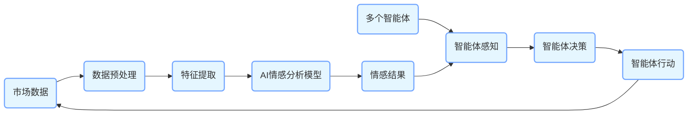

# 价值投资中的AI情感分析：多智能体系统解读市场心理

> 关键词：价值投资、AI情感分析、多智能体系统、市场心理、金融市场

> 摘要：本文聚焦于价值投资领域中运用AI情感分析和多智能体系统来解读市场心理。首先介绍了相关背景知识，包括研究目的、预期读者、文档结构等。接着阐述了核心概念与联系，分析了核心算法原理并给出Python代码示例，同时对数学模型和公式进行详细讲解与举例。通过项目实战展示代码实现和解读，探讨了实际应用场景。推荐了学习资源、开发工具框架和相关论文著作。最后总结了未来发展趋势与挑战，并提供常见问题解答和扩展阅读参考资料，旨在帮助读者深入理解如何利用先进技术在价值投资中把握市场心理。

## 1. 背景介绍 
### 1.1 目的和范围
在价值投资领域，准确理解市场心理至关重要。市场参与者的情感和心理状态会对资产价格产生显著影响。本研究的目的是探讨如何运用AI情感分析和多智能体系统来解读市场心理，为价值投资者提供更准确的决策依据。研究范围涵盖了金融市场中的各种资产，如股票、债券、期货等，以及不同类型的市场参与者，包括个人投资者、机构投资者等。

### 1.2 预期读者
本文预期读者包括金融行业从业者，如投资经理、分析师等，他们希望借助先进的技术手段提升投资决策的准确性；计算机科学领域的研究人员和开发者，对将AI技术应用于金融市场感兴趣；以及对价值投资和市场心理分析有深入研究需求的学者和爱好者。

### 1.3 文档结构概述
本文将首先介绍核心概念与联系，包括AI情感分析和多智能体系统的原理和架构。接着详细阐述核心算法原理，并给出具体的Python代码实现步骤。之后介绍相关的数学模型和公式，并举例说明其应用。通过项目实战展示如何在实际中运用这些技术进行市场心理分析。探讨实际应用场景，为读者提供更清晰的应用思路。推荐学习资源、开发工具框架和相关论文著作，帮助读者进一步深入学习。最后总结未来发展趋势与挑战，解答常见问题，并提供扩展阅读和参考资料。

### 1.4 术语表
#### 1.4.1 核心术语定义
- **价值投资**：一种投资策略，投资者通过分析资产的内在价值，寻找被低估的资产进行投资，以获取长期的资本增值。
- **AI情感分析**：利用人工智能技术对文本、语音等数据进行分析，识别其中所表达的情感倾向，如积极、消极或中性。
- **多智能体系统**：由多个智能体组成的系统，每个智能体具有自主决策能力，能够根据自身的目标和环境信息进行行动，并与其他智能体进行交互。
- **市场心理**：市场参与者在交易过程中表现出的心理状态和情感倾向，如乐观、悲观、恐惧等，这些心理因素会影响他们的投资决策和市场行为。

#### 1.4.2 相关概念解释
- **自然语言处理（NLP）**：是AI情感分析的重要技术基础，用于处理和分析人类语言文本，包括文本分类、情感识别、命名实体识别等任务。
- **机器学习算法**：在AI情感分析和多智能体系统中广泛应用，如支持向量机、神经网络等，用于训练模型以实现对数据的分类和预测。
- **博弈论**：与多智能体系统密切相关，用于分析多个智能体之间的交互和决策过程，帮助智能体在复杂的环境中做出最优决策。

#### 1.4.3 缩略词列表
- **NLP**：Natural Language Processing（自然语言处理）
- **ML**：Machine Learning（机器学习）
- **SVM**：Support Vector Machine（支持向量机）
- **ANN**：Artificial Neural Network（人工神经网络）

## 2. 核心概念与联系 

### 核心概念原理
#### AI情感分析原理
AI情感分析主要基于自然语言处理技术，通过对文本数据的特征提取和模型训练，识别文本中所表达的情感倾向。其基本流程包括数据预处理、特征提取、模型训练和情感分类。首先，对原始文本数据进行清洗、分词等预处理操作，去除噪声和无用信息。然后，提取文本的特征，如词频、词性、情感词典得分等。接着，使用机器学习或深度学习算法对提取的特征进行训练，构建情感分类模型。最后，将待分析的文本输入到训练好的模型中，得到其情感倾向的分类结果。

#### 多智能体系统原理
多智能体系统由多个智能体组成，每个智能体具有一定的感知能力、决策能力和行动能力。智能体可以感知周围环境的信息，并根据自身的目标和规则进行决策和行动。智能体之间可以通过通信和交互机制进行信息共享和协作，以实现共同的目标。在金融市场中，每个智能体可以代表一个市场参与者，如投资者、交易员等，它们根据市场信息和自身的投资策略进行决策和交易，通过相互作用影响市场的价格和走势。

### 架构示意图

该架构图展示了AI情感分析和多智能体系统之间的联系。市场数据经过数据预处理和特征提取后，输入到AI情感分析模型中得到情感结果。多个智能体通过感知市场数据和情感结果进行决策和行动，其行动又会影响市场数据，形成一个循环。

## 3. 核心算法原理 & 具体操作步骤 

### AI情感分析算法原理
在AI情感分析中，常用的算法是基于机器学习的分类算法，如支持向量机（SVM）。SVM的基本思想是在特征空间中找到一个最优的超平面，将不同类别的样本分开，使得分类间隔最大。

#### Python代码实现
```python
import numpy as np
from sklearn import svm
from sklearn.feature_extraction.text import TfidfVectorizer
from sklearn.model_selection import train_test_split
from sklearn.metrics import accuracy_score

# 示例数据
corpus = [
    "这是一篇非常积极的文章，我很喜欢。",
    "这篇文章太糟糕了，我一点也不喜欢。",
    "这个产品真的很不错，值得购买。",
    "这个服务太差劲了，我不会再用了。"
]
labels = [1, 0, 1, 0]  # 1表示积极，0表示消极

# 数据预处理和特征提取
vectorizer = TfidfVectorizer()
X = vectorizer.fit_transform(corpus)

# 划分训练集和测试集
X_train, X_test, y_train, y_test = train_test_split(X, labels, test_size=0.2, random_state=42)

# 训练SVM模型
clf = svm.SVC(kernel='linear')
clf.fit(X_train, y_train)

# 预测
y_pred = clf.predict(X_test)

# 评估模型
accuracy = accuracy_score(y_test, y_pred)
print(f"模型准确率: {accuracy}")
```
### 代码解释
1. **数据准备**：定义了一个示例文本数据集`corpus`和对应的情感标签`labels`。
2. **特征提取**：使用`TfidfVectorizer`将文本数据转换为TF-IDF特征向量。
3. **数据集划分**：使用`train_test_split`将数据集划分为训练集和测试集。
4. **模型训练**：使用`svm.SVC`创建一个线性核的SVM分类器，并使用训练集进行训练。
5. **模型预测**：使用训练好的模型对测试集进行预测。
6. **模型评估**：使用`accuracy_score`计算模型的准确率。

### 多智能体系统算法原理
在多智能体系统中，每个智能体的决策过程可以使用基于规则的方法或强化学习方法。这里以基于规则的方法为例，每个智能体根据市场的情感结果和自身的投资策略进行决策。

#### Python代码实现
```python
class Agent:
    def __init__(self, strategy):
        self.strategy = strategy

    def make_decision(self, sentiment):
        if sentiment == 1 and self.strategy == 'buy_on_positive':
            return 'buy'
        elif sentiment == 0 and self.strategy == 'sell_on_negative':
            return 'sell'
        else:
            return 'hold'

# 创建智能体
agent1 = Agent('buy_on_positive')
agent2 = Agent('sell_on_negative')

# 模拟市场情感结果
sentiment = 1

# 智能体决策
decision1 = agent1.make_decision(sentiment)
decision2 = agent2.make_decision(sentiment)

print(f"智能体1的决策: {decision1}")
print(f"智能体2的决策: {decision2}")
```
### 代码解释
1. **智能体类定义**：定义了一个`Agent`类，每个智能体具有一个投资策略`strategy`。
2. **决策方法**：`make_decision`方法根据市场的情感结果和自身的投资策略进行决策，返回`buy`、`sell`或`hold`。
3. **智能体创建**：创建了两个不同策略的智能体`agent1`和`agent2`。
4. **模拟市场情感**：模拟了一个市场情感结果`sentiment`。
5. **智能体决策**：调用智能体的`make_decision`方法进行决策，并输出决策结果。

## 4. 数学模型和公式 & 详细讲解 & 举例说明 

### AI情感分析中的数学模型
在AI情感分析中，常用的数学模型是逻辑回归模型。逻辑回归是一种广义线性模型，用于解决二分类问题。其基本公式为：

$$P(y=1|x)=\frac{1}{1 + e^{-(w_0 + w_1x_1 + w_2x_2 + \cdots + w_nx_n)}}$$

其中，$P(y=1|x)$表示样本$x$属于正类的概率，$w_0, w_1, \cdots, w_n$是模型的参数，$x_1, x_2, \cdots, x_n$是样本的特征。

#### 详细讲解
逻辑回归模型通过对样本的特征进行线性组合，然后使用逻辑函数将线性组合的结果映射到$[0, 1]$区间，得到样本属于正类的概率。模型的训练过程就是通过最小化损失函数来求解最优的参数$w$。常用的损失函数是对数损失函数：

$$L(w)=-\frac{1}{m}\sum_{i=1}^{m}[y_i\log(P(y_i=1|x_i)) + (1 - y_i)\log(1 - P(y_i=1|x_i))]$$

其中，$m$是样本的数量，$y_i$是样本$i$的真实标签。

#### 举例说明
假设有一个简单的文本情感分析任务，样本的特征是文本中“好”这个词的出现次数$x_1$和“坏”这个词的出现次数$x_2$。模型的参数$w_0 = 0.1$，$w_1 = 0.5$，$w_2 = -0.3$。对于一个样本$x = [2, 1]$，可以计算其属于正类的概率：

$$P(y=1|x)=\frac{1}{1 + e^{-(0.1 + 0.5\times2 - 0.3\times1)}}=\frac{1}{1 + e^{-0.8}}\approx0.69$$

### 多智能体系统中的数学模型
在多智能体系统中，常用的数学模型是博弈论模型。以两人零和博弈为例，其数学模型可以用一个收益矩阵来表示。

假设两个智能体$A$和$B$，每个智能体有两种策略：合作（$C$）和背叛（$D$）。收益矩阵如下：

|  | $C$ | $D$ |
| --- | --- | --- |
| $C$ | $(3, 3)$ | $(0, 5)$ |
| $D$ | $(5, 0)$ | $(1, 1)$ |

#### 详细讲解
矩阵中的每个元素表示两个智能体采取相应策略时的收益。例如，当智能体$A$选择合作（$C$），智能体$B$也选择合作（$C$）时，两个智能体的收益都是3。博弈论的目标是找到每个智能体的最优策略，使得自身的收益最大化。在这个例子中，使用纳什均衡的概念可以分析出，当两个智能体都选择背叛（$D$）时，达到纳什均衡。

#### 举例说明
假设智能体$A$和$B$进行多次博弈。如果智能体$A$选择合作（$C$），智能体$B$选择背叛（$D$），则智能体$A$的收益为0，智能体$B$的收益为5。如果两个智能体都选择背叛（$D$），则每个智能体的收益为1。在实际应用中，智能体可以根据历史博弈结果和其他智能体的策略调整自己的策略，以实现长期收益的最大化。

## 5. 项目实战：代码实际案例和详细解释说明 

### 5.1  开发环境搭建
#### 硬件环境
- 处理器：Intel Core i5及以上
- 内存：8GB及以上
- 硬盘：至少有50GB的可用空间

#### 软件环境
- 操作系统：Windows 10、macOS或Linux
- Python版本：Python 3.7及以上
- 开发工具：推荐使用Anaconda作为Python环境管理工具，PyCharm作为集成开发环境（IDE）

#### 安装依赖库
使用以下命令安装所需的Python库：
```sh
pip install numpy pandas scikit-learn matplotlib seaborn
```

### 5.2  源代码详细实现和代码解读
#### 数据获取和预处理
```python
import pandas as pd

# 读取数据
data = pd.read_csv('market_news.csv')

# 数据清洗
data = data.dropna(subset=['text'])

# 分词和去除停用词
import jieba
import jieba.analyse
from sklearn.feature_extraction.text import CountVectorizer

stopwords = []
with open('stopwords.txt', 'r', encoding='utf-8') as f:
    for line in f:
        stopwords.append(line.strip())

def preprocess_text(text):
    words = jieba.lcut(text)
    filtered_words = [word for word in words if word not in stopwords]
    return ' '.join(filtered_words)

data['processed_text'] = data['text'].apply(preprocess_text)

# 特征提取
vectorizer = CountVectorizer()
X = vectorizer.fit_transform(data['processed_text'])
```
#### 代码解读
1. **数据读取**：使用`pandas`库读取包含市场新闻文本的数据文件`market_news.csv`。
2. **数据清洗**：去除文本列中为空的行。
3. **分词和去除停用词**：使用`jieba`库对文本进行分词，并去除停用词。停用词存储在`stopwords.txt`文件中。
4. **特征提取**：使用`CountVectorizer`将处理后的文本转换为词频矩阵。

#### AI情感分析模型训练
```python
from sklearn.linear_model import LogisticRegression
from sklearn.model_selection import train_test_split
from sklearn.metrics import accuracy_score

# 假设数据集中有一个label列表示情感标签
y = data['label']

# 划分训练集和测试集
X_train, X_test, y_train, y_test = train_test_split(X, y, test_size=0.2, random_state=42)

# 训练逻辑回归模型
model = LogisticRegression()
model.fit(X_train, y_train)

# 预测
y_pred = model.predict(X_test)

# 评估模型
accuracy = accuracy_score(y_test, y_pred)
print(f"模型准确率: {accuracy}")
```
#### 代码解读
1. **数据划分**：将特征矩阵$X$和情感标签$y$划分为训练集和测试集。
2. **模型训练**：使用逻辑回归模型进行训练。
3. **模型预测**：使用训练好的模型对测试集进行预测。
4. **模型评估**：使用准确率指标评估模型的性能。

#### 多智能体系统实现
```python
class MarketAgent:
    def __init__(self, id, strategy):
        self.id = id
        self.strategy = strategy
        self.portfolio = 0

    def make_decision(self, sentiment):
        if sentiment == 1 and self.strategy == 'buy_on_positive':
            self.portfolio += 1
            return 'buy'
        elif sentiment == 0 and self.strategy == 'sell_on_negative':
            if self.portfolio > 0:
                self.portfolio -= 1
                return 'sell'
            else:
                return 'hold'
        else:
            return 'hold'

# 创建多个智能体
agents = [MarketAgent(i, 'buy_on_positive') for i in range(10)] + [MarketAgent(i, 'sell_on_negative') for i in range(10, 20)]

# 模拟市场情感
for i in range(10):
    sentiment = model.predict(X_test[i].reshape(1, -1))[0]
    for agent in agents:
        decision = agent.make_decision(sentiment)
        print(f"智能体 {agent.id} 在第 {i} 轮的决策: {decision}")
```
#### 代码解读
1. **智能体类定义**：定义了一个`MarketAgent`类，每个智能体具有一个唯一的ID、投资策略和投资组合。
2. **决策方法**：`make_decision`方法根据市场的情感结果和自身的投资策略进行决策，并更新投资组合。
3. **智能体创建**：创建了20个智能体，其中10个采用`buy_on_positive`策略，10个采用`sell_on_negative`策略。
4. **模拟市场情感**：使用训练好的情感分析模型对测试集中的样本进行情感预测，并模拟多个轮次的市场交易，每个智能体根据市场情感进行决策。

### 5.3  代码解读与分析
#### AI情感分析部分
- **数据预处理**：对文本数据进行清洗、分词和去除停用词是为了提高特征提取的质量，去除噪声和无用信息。
- **特征提取**：使用词频矩阵作为特征可以简单有效地表示文本的语义信息，但可能存在维度灾难的问题。可以考虑使用更高级的特征提取方法，如TF-IDF、词嵌入等。
- **模型选择**：逻辑回归模型是一种简单有效的分类模型，具有较好的可解释性。在实际应用中，可以尝试使用更复杂的模型，如深度学习模型，以提高模型的性能。

#### 多智能体系统部分
- **智能体设计**：智能体的决策策略可以根据实际需求进行设计和调整。在本示例中，采用了简单的基于规则的决策方法，在实际应用中可以使用强化学习等方法让智能体自动学习最优策略。
- **交互机制**：本示例中智能体之间没有进行直接的交互，在实际的金融市场中，智能体之间的交互会对市场的走势产生重要影响。可以进一步扩展代码，实现智能体之间的信息共享和协作。

## 6. 实际应用场景 
### 投资决策辅助
价值投资者可以利用AI情感分析和多智能体系统来解读市场心理，辅助投资决策。通过分析市场新闻、社交媒体等数据，了解市场参与者的情感倾向，判断市场的乐观或悲观情绪。多智能体系统可以模拟不同投资者的行为和决策过程，预测市场的走势。投资者可以根据这些分析结果调整自己的投资组合，选择更有潜力的资产进行投资。

### 风险管理
在金融市场中，风险管理至关重要。AI情感分析可以帮助投资者及时发现市场的异常情绪，如恐慌、贪婪等，提前做好风险防范措施。多智能体系统可以模拟市场的极端情况，评估投资组合在不同市场环境下的风险承受能力，帮助投资者制定合理的风险管理策略。

### 市场趋势预测
通过对大量市场数据的分析和多智能体系统的模拟，可以预测市场的未来趋势。AI情感分析可以捕捉市场参与者的情绪变化，作为市场趋势预测的重要指标之一。多智能体系统可以模拟不同因素对市场的影响，如政策变化、经济数据发布等，提高市场趋势预测的准确性。

### 量化投资策略开发
量化投资策略是基于数学模型和算法的投资策略。AI情感分析和多智能体系统可以为量化投资策略提供新的数据源和分析方法。例如，可以将市场情感指标作为量化模型的输入变量，优化投资策略的参数。多智能体系统可以模拟不同投资策略之间的竞争和合作关系，帮助开发更有效的量化投资策略。

## 7. 工具和资源推荐
### 7.1 学习资源推荐
#### 7.1.1 书籍推荐
- 《Python数据分析实战》：介绍了Python在数据分析领域的应用，包括数据处理、可视化、机器学习等方面的内容，对于学习AI情感分析和多智能体系统的数据分析部分有很大帮助。
- 《机器学习》（周志华）：全面介绍了机器学习的基本概念、算法和应用，是机器学习领域的经典教材，对于理解AI情感分析和多智能体系统中的算法原理有重要作用。
- 《多智能体系统导论》：系统介绍了多智能体系统的基本概念、理论和方法，适合对多智能体系统感兴趣的读者深入学习。

#### 7.1.2 在线课程
- Coursera上的“Machine Learning”课程：由Andrew Ng教授主讲，是机器学习领域的经典在线课程，内容涵盖了机器学习的基础知识和常用算法。
- edX上的“Artificial Intelligence”课程：介绍了人工智能的基本概念、算法和应用，包括自然语言处理、机器学习等方面的内容。
- Udemy上的“Python for Data Science and Machine Learning Bootcamp”课程：通过实际项目讲解Python在数据科学和机器学习领域的应用，适合初学者快速入门。

#### 7.1.3 技术博客和网站
- Medium：一个技术博客平台，上面有很多关于AI、机器学习、金融科技等领域的优秀文章，可以及时了解最新的技术动态和研究成果。
- Towards Data Science：专注于数据科学和机器学习领域的博客网站，提供了很多实用的教程和案例分析。
- Kaggle：一个数据科学竞赛平台，上面有很多关于金融数据、文本分析等方面的竞赛和数据集，可以通过参与竞赛来提高自己的实践能力。

### 7.2 开发工具框架推荐
#### 7.2.1 IDE和编辑器
- PyCharm：一款专业的Python集成开发环境，具有代码编辑、调试、自动补全、版本控制等功能，适合Python项目的开发。
- Jupyter Notebook：一个交互式的开发环境，支持Python、R等多种编程语言，适合数据探索、模型训练和结果展示等工作。
- Visual Studio Code：一款轻量级的代码编辑器，支持多种编程语言和插件扩展，具有丰富的功能和良好的用户体验。

#### 7.2.2 调试和性能分析工具
- PDB：Python自带的调试工具，可以在代码中设置断点，逐行调试代码，帮助定位和解决问题。
- cProfile：Python标准库中的性能分析工具，可以分析代码的运行时间和函数调用情况，找出性能瓶颈。
- TensorBoard：一个用于可视化深度学习模型训练过程的工具，可以实时监控模型的训练损失、准确率等指标，帮助优化模型。

#### 7.2.3 相关框架和库
- Scikit-learn：一个开源的机器学习库，提供了丰富的机器学习算法和工具，如分类、回归、聚类等，适合初学者快速上手。
- TensorFlow：一个开源的深度学习框架，由Google开发，支持大规模的分布式训练和部署，广泛应用于自然语言处理、计算机视觉等领域。
- PyTorch：一个开源的深度学习框架，具有动态图机制，易于使用和调试，受到很多研究者和开发者的喜爱。

### 7.3 相关论文著作推荐
#### 7.3.1 经典论文
- "A Mathematical Theory of Communication"（Claude E. Shannon）：信息论的经典论文，为自然语言处理和数据传输等领域奠定了理论基础。
- "Support-Vector Networks"（Corinna Cortes and Vladimir Vapnik）：介绍了支持向量机的基本原理和算法，是机器学习领域的经典论文之一。
- "Multi-Agent Systems: A Modern Approach to Distributed Artificial Intelligence"（Gerhard Weiss）：系统介绍了多智能体系统的理论和方法，是多智能体系统领域的经典著作。

#### 7.3.2 最新研究成果
- 在ACM SIGKDD、NeurIPS、ICML等顶级学术会议上搜索关于AI情感分析、多智能体系统和金融科技的最新研究论文，了解该领域的前沿技术和发展趋势。
- 关注知名学术期刊，如《Journal of Artificial Intelligence Research》、《Artificial Intelligence》等，获取最新的研究成果。

#### 7.3.3 应用案例分析
- 阅读一些金融机构和科技公司的研究报告和案例分析，了解他们在价值投资中应用AI情感分析和多智能体系统的实际经验和效果。
- 参考一些知名的量化投资基金的公开资料，学习他们如何利用先进技术进行投资决策和风险管理。

## 8. 总结：未来发展趋势与挑战
### 未来发展趋势
#### 融合更多数据源
未来，AI情感分析和多智能体系统将融合更多的数据源，如语音数据、图像数据等。除了市场新闻和社交媒体文本，还可以分析投资者的语音交流、面部表情等信息，更全面地了解市场参与者的情感和心理状态。

#### 深度学习技术的广泛应用
深度学习技术在自然语言处理和机器学习领域取得了显著的成果。未来，深度学习模型将在AI情感分析和多智能体系统中得到更广泛的应用，如使用预训练的语言模型进行情感分析，使用深度强化学习算法训练智能体的决策策略。

#### 与区块链技术的结合
区块链技术具有去中心化、不可篡改等特点，可以为多智能体系统提供更安全、可靠的通信和协作机制。未来，AI情感分析和多智能体系统可能会与区块链技术相结合，应用于金融市场的交易结算、风险管理等领域。

#### 跨学科研究的深入
价值投资中的AI情感分析和多智能体系统涉及金融、计算机科学、心理学等多个学科。未来，跨学科研究将更加深入，不同学科的专家将共同合作，推动该领域的发展。

### 挑战
#### 数据质量和隐私问题
AI情感分析和多智能体系统需要大量的高质量数据进行训练和分析。然而，数据的质量和隐私问题是一个挑战。数据可能存在噪声、错误和偏差，需要进行有效的清洗和预处理。同时，数据的隐私保护也是一个重要问题，需要遵守相关的法律法规。

#### 模型解释性和可解释性
深度学习模型通常是黑盒模型，难以解释其决策过程和结果。在价值投资中，模型的解释性和可解释性非常重要，投资者需要了解模型的决策依据。因此，如何提高模型的解释性和可解释性是一个亟待解决的问题。

#### 智能体的协作和竞争
在多智能体系统中，智能体之间的协作和竞争关系是复杂的。如何设计有效的智能体协作机制和竞争策略，使智能体能够在复杂的环境中实现共同的目标，是一个挑战。

#### 市场的不确定性和复杂性
金融市场具有高度的不确定性和复杂性，受到多种因素的影响，如政策变化、经济数据发布、突发事件等。如何使AI情感分析和多智能体系统能够适应市场的不确定性和复杂性，提高预测的准确性和可靠性，是一个重要的挑战。

## 9. 附录：常见问题与解答
### 1. AI情感分析的准确率能达到多高？
AI情感分析的准确率受到多种因素的影响，如数据质量、特征提取方法、模型选择等。在一些简单的文本情感分析任务中，准确率可以达到80%以上。但在复杂的金融市场文本分析中，由于语言的歧义性和市场的不确定性，准确率可能会有所下降。

### 2. 多智能体系统中的智能体如何进行学习和进化？
多智能体系统中的智能体可以通过强化学习、遗传算法等方法进行学习和进化。强化学习通过智能体与环境的交互，根据奖励信号调整自己的策略，以实现长期收益的最大化。遗传算法通过模拟生物进化的过程，对智能体的策略进行优化和改进。

### 3. 如何评估AI情感分析和多智能体系统在价值投资中的效果？
可以使用多种指标来评估AI情感分析和多智能体系统在价值投资中的效果，如投资回报率、夏普比率、最大回撤等。同时，还可以进行回测实验，使用历史数据模拟投资过程，评估模型的性能和稳定性。

### 4. 数据安全和隐私问题如何解决？
在数据收集和处理过程中，需要遵守相关的法律法规，采取有效的数据安全和隐私保护措施。例如，对数据进行加密处理，限制数据的访问权限，匿名化处理敏感信息等。同时，可以使用联邦学习等技术，在不泄露原始数据的情况下进行模型训练。

### 5. 如何选择适合的AI情感分析和多智能体系统模型？
选择适合的模型需要考虑多个因素，如数据特点、任务需求、计算资源等。对于简单的任务，可以选择传统的机器学习模型，如逻辑回归、支持向量机等。对于复杂的任务，可以尝试使用深度学习模型，如神经网络、循环神经网络等。在多智能体系统中，可以根据智能体的交互方式和决策需求选择合适的算法，如基于规则的方法、强化学习方法等。

## 10. 扩展阅读 & 参考资料
### 扩展阅读
- 《金融科技前沿：AI与区块链在金融领域的应用》：介绍了AI和区块链技术在金融领域的最新应用和发展趋势，与本文的研究内容有一定的关联。
- 《行为金融学》：探讨了投资者的心理和行为对金融市场的影响，对于理解市场心理和价值投资有重要的参考价值。
- 《自然语言处理入门》：系统介绍了自然语言处理的基本概念、算法和应用，适合对AI情感分析感兴趣的读者深入学习。

### 参考资料
- 相关学术论文和研究报告，可以在学术数据库如IEEE Xplore、ACM Digital Library等上搜索获取。
- 金融市场数据和新闻，可以从专业的金融数据提供商如Wind、Bloomberg等获取。
- 开源代码和项目，可以在GitHub等代码托管平台上搜索相关的项目，学习和参考他人的实现经验。

作者：AI天才研究院/AI Genius Institute & 禅与计算机程序设计艺术 /Zen And The Art of Computer Programming