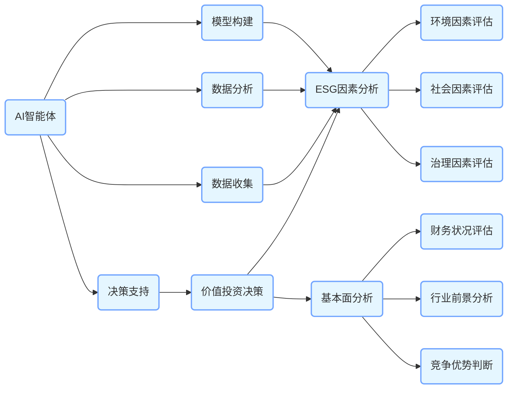

# 价值投资中的AI智能体ESG因素量化分析

> 关键词：价值投资、AI智能体、ESG因素、量化分析、投资决策

> 摘要：本文聚焦于价值投资领域，深入探讨了如何利用AI智能体对ESG因素进行量化分析。通过对背景知识的介绍，明确了研究的目的、范围和预期读者。详细阐述了核心概念，包括价值投资、AI智能体和ESG因素的原理与联系，并给出了相应的文本示意图和Mermaid流程图。对核心算法原理进行了深入讲解，结合Python源代码说明具体操作步骤。引入数学模型和公式，通过举例说明其在实际中的应用。进行项目实战，从开发环境搭建到源代码实现和解读，展示了如何将理论应用于实际。探讨了实际应用场景，推荐了相关的学习资源、开发工具框架和论文著作。最后总结了未来发展趋势与挑战，并对常见问题进行了解答，为价值投资中ESG因素的量化分析提供了全面且深入的指导。

## 1. 背景介绍 
### 1.1 目的和范围
在当今的金融市场中，价值投资一直是投资者追求长期稳定回报的重要策略。然而，传统的价值投资分析往往侧重于财务指标，忽略了企业在环境（Environmental）、社会（Social）和治理（Governance）方面的表现，即ESG因素。随着全球对可持续发展的关注度不断提高，越来越多的投资者认识到ESG因素对企业长期价值的影响。因此，本研究的目的是利用AI智能体对ESG因素进行量化分析，为价值投资决策提供更全面、准确的依据。

本研究的范围涵盖了价值投资理论、AI智能体技术以及ESG因素的相关领域。通过对这些领域的综合研究，构建一套完整的ESG因素量化分析体系，并将其应用于价值投资决策过程中。

### 1.2 预期读者
本文的预期读者包括金融投资者、投资分析师、金融科技从业者、研究价值投资和ESG领域的学者以及对AI技术在金融领域应用感兴趣的人士。这些读者可以从本文中获取关于如何利用AI智能体对ESG因素进行量化分析的理论知识和实践方法，为他们的投资决策和研究工作提供参考。

### 1.3 文档结构概述
本文将按照以下结构进行组织：
1. **背景介绍**：阐述研究的目的、范围、预期读者和文档结构概述，并对相关术语进行定义和解释。
2. **核心概念与联系**：介绍价值投资、AI智能体和ESG因素的核心概念，分析它们之间的联系，并给出相应的文本示意图和Mermaid流程图。
3. **核心算法原理 & 具体操作步骤**：详细讲解用于ESG因素量化分析的核心算法原理，结合Python源代码说明具体操作步骤。
4. **数学模型和公式 & 详细讲解 & 举例说明**：引入数学模型和公式，对其进行详细讲解，并通过具体例子说明其在ESG因素量化分析中的应用。
5. **项目实战：代码实际案例和详细解释说明**：从开发环境搭建开始，逐步实现ESG因素量化分析的源代码，并对代码进行详细解读和分析。
6. **实际应用场景**：探讨AI智能体ESG因素量化分析在价值投资中的实际应用场景。
7. **工具和资源推荐**：推荐相关的学习资源、开发工具框架和论文著作，帮助读者进一步深入学习和研究。
8. **总结：未来发展趋势与挑战**：总结AI智能体ESG因素量化分析的未来发展趋势，并分析可能面临的挑战。
9. **附录：常见问题与解答**：对读者可能遇到的常见问题进行解答。
10. **扩展阅读 & 参考资料**：提供相关的扩展阅读材料和参考资料，方便读者进一步探索。

### 1.4 术语表
#### 1.4.1 核心术语定义
- **价值投资**：一种投资策略，通过分析股票的内在价值，寻找被低估的股票进行投资，以获取长期稳定的回报。
- **AI智能体**：具有自主学习、推理和决策能力的人工智能程序，能够根据环境信息自主地执行任务。
- **ESG因素**：环境（Environmental）、社会（Social）和治理（Governance）因素的统称，反映了企业在可持续发展方面的表现。
- **量化分析**：运用数学和统计学方法对数据进行分析和处理，以揭示数据背后的规律和关系。

#### 1.4.2 相关概念解释
- **环境因素**：包括企业的能源消耗、碳排放、污染治理、资源利用效率等方面的表现。
- **社会因素**：涉及企业的员工权益、社区关系、产品质量与安全、供应链管理等方面的情况。
- **治理因素**：主要指企业的董事会结构、股东权益保护、内部控制、风险管理等方面的制度和实践。

#### 1.4.3 缩略词列表
- **ESG**：Environmental, Social and Governance（环境、社会和治理）
- **AI**：Artificial Intelligence（人工智能）
- **ML**：Machine Learning（机器学习）
- **DL**：Deep Learning（深度学习）

## 2. 核心概念与联系 

### 2.1 核心概念原理
#### 2.1.1 价值投资原理
价值投资的核心思想是认为股票的价格会围绕其内在价值波动。投资者通过对企业的财务状况、行业前景、竞争优势等基本面因素进行分析，估算出股票的内在价值。当股票价格低于其内在价值时，投资者认为该股票被低估，具有投资价值；反之，当股票价格高于其内在价值时，股票被高估，应避免投资。

#### 2.1.2 AI智能体原理
AI智能体是一种能够感知环境、自主学习和决策的智能程序。它通过传感器收集环境信息，利用机器学习、深度学习等算法对信息进行处理和分析，从而学习到环境的规律和模式。基于学习到的知识，AI智能体能够做出决策并采取行动，以实现特定的目标。

#### 2.1.3 ESG因素原理
ESG因素反映了企业在环境、社会和治理方面的表现。良好的ESG表现有助于企业降低风险、提高声誉、增强竞争力，从而对企业的长期价值产生积极影响。例如，注重环境保护的企业可以减少环境法规风险，提高资源利用效率；关注员工权益的企业可以提高员工满意度和忠诚度，促进企业的创新和发展；完善治理结构的企业可以有效防范内部风险，保障股东权益。

### 2.2 核心概念联系
价值投资、AI智能体和ESG因素之间存在着密切的联系。价值投资需要综合考虑各种因素来评估企业的内在价值，而ESG因素作为影响企业长期价值的重要方面，应该纳入价值投资的分析框架中。然而，ESG因素的数据往往具有复杂性和多样性，传统的分析方法难以对其进行全面、准确的评估。AI智能体具有强大的数据分析和处理能力，能够从海量的ESG数据中挖掘出有价值的信息，为价值投资决策提供更科学的依据。

### 2.3 文本示意图
```plaintext
价值投资
|
|-- 基本面分析
|   |-- 财务状况
|   |-- 行业前景
|   |-- 竞争优势
|
|-- ESG因素分析
|   |-- 环境因素
|   |-- 社会因素
|   |-- 治理因素
|
|-- AI智能体辅助
|   |-- 数据收集
|   |-- 数据分析
|   |-- 模型构建
|   |-- 决策支持
```

### 2.4 Mermaid流程图


## 3. 核心算法原理 & 具体操作步骤 

### 3.1 核心算法原理
在对ESG因素进行量化分析时，我们可以采用机器学习中的多变量回归分析和深度学习中的神经网络模型。

#### 3.1.1 多变量回归分析
多变量回归分析是一种用于研究多个自变量与一个因变量之间关系的统计方法。在ESG因素量化分析中，我们可以将ESG的各项指标作为自变量，企业的价值或投资回报作为因变量，建立回归模型：

$$Y = \beta_0 + \beta_1X_1 + \beta_2X_2 + \cdots + \beta_nX_n + \epsilon$$

其中，$Y$ 表示企业的价值或投资回报，$X_1, X_2, \cdots, X_n$ 表示ESG的各项指标，$\beta_0, \beta_1, \cdots, \beta_n$ 是回归系数，$\epsilon$ 是误差项。

#### 3.1.2 神经网络模型
神经网络模型是一种模仿人类神经系统的计算模型，具有强大的非线性拟合能力。在ESG因素量化分析中，我们可以构建一个多层感知机（Multilayer Perceptron, MLP）模型，将ESG指标作为输入层的神经元，企业的价值或投资回报作为输出层的神经元，中间层为隐藏层，用于提取ESG数据的特征。

### 3.2 具体操作步骤
以下是使用Python实现ESG因素量化分析的具体操作步骤：

#### 3.2.1 数据收集
首先，我们需要收集ESG相关的数据。可以从专业的ESG数据提供商、企业的年报、社会责任报告等渠道获取数据。以下是一个简单的数据收集示例：
```python
import pandas as pd

# 假设从CSV文件中读取ESG数据
esg_data = pd.read_csv('esg_data.csv')
```

#### 3.2.2 数据预处理
收集到的数据可能存在缺失值、异常值等问题，需要进行预处理。以下是一个简单的数据预处理示例：
```python
# 处理缺失值
esg_data = esg_data.fillna(esg_data.mean())

# 标准化数据
from sklearn.preprocessing import StandardScaler
scaler = StandardScaler()
esg_data_scaled = scaler.fit_transform(esg_data)
```

#### 3.2.3 模型构建与训练
使用多变量回归分析和神经网络模型进行建模和训练。以下是一个简单的示例：
```python
from sklearn.linear_model import LinearRegression
from sklearn.neural_network import MLPRegressor
from sklearn.model_selection import train_test_split

# 划分训练集和测试集
X = esg_data_scaled[:, :-1]  # 特征
y = esg_data_scaled[:, -1]   # 目标变量
X_train, X_test, y_train, y_test = train_test_split(X, y, test_size=0.2, random_state=42)

# 多变量回归分析
lr_model = LinearRegression()
lr_model.fit(X_train, y_train)

# 神经网络模型
mlp_model = MLPRegressor(hidden_layer_sizes=(10, 10), activation='relu', random_state=42)
mlp_model.fit(X_train, y_train)
```

#### 3.2.4 模型评估
使用测试集对模型进行评估，计算模型的性能指标。以下是一个简单的评估示例：
```python
from sklearn.metrics import mean_squared_error

# 多变量回归分析评估
lr_pred = lr_model.predict(X_test)
lr_mse = mean_squared_error(y_test, lr_pred)
print(f'多变量回归分析的均方误差: {lr_mse}')

# 神经网络模型评估
mlp_pred = mlp_model.predict(X_test)
mlp_mse = mean_squared_error(y_test, mlp_pred)
print(f'神经网络模型的均方误差: {mlp_mse}')
```

## 4. 数学模型和公式 & 详细讲解 & 举例说明 

### 4.1 多变量回归分析数学模型和公式
#### 4.1.1 模型公式
如前所述，多变量回归分析的模型公式为：

$$Y = \beta_0 + \beta_1X_1 + \beta_2X_2 + \cdots + \beta_nX_n + \epsilon$$

其中，$Y$ 是因变量，$X_1, X_2, \cdots, X_n$ 是自变量，$\beta_0$ 是截距项，$\beta_1, \beta_2, \cdots, \beta_n$ 是回归系数，$\epsilon$ 是误差项。

#### 4.1.2 系数估计
回归系数 $\beta_0, \beta_1, \cdots, \beta_n$ 的估计通常采用最小二乘法，即通过最小化误差项的平方和来求解：

$$\min_{\beta_0, \beta_1, \cdots, \beta_n} \sum_{i=1}^{m} (y_i - (\beta_0 + \beta_1x_{i1} + \beta_2x_{i2} + \cdots + \beta_nx_{in}))^2$$

其中，$m$ 是样本数量，$y_i$ 是第 $i$ 个样本的因变量值，$x_{i1}, x_{i2}, \cdots, x_{in}$ 是第 $i$ 个样本的自变量值。

#### 4.1.3 举例说明
假设我们有三个ESG指标：环境绩效（$X_1$）、社会贡献（$X_2$）和治理水平（$X_3$），以及企业的投资回报（$Y$）。我们收集了100个企业的数据，通过最小二乘法估计得到回归系数 $\beta_0 = 0.5$，$\beta_1 = 0.2$，$\beta_2 = 0.3$，$\beta_3 = 0.1$。那么，对于一个环境绩效为80分、社会贡献为70分、治理水平为60分的企业，其投资回报的预测值为：

$$Y = 0.5 + 0.2\times80 + 0.3\times70 + 0.1\times60 = 0.5 + 16 + 21 + 6 = 43.5$$

### 4.2 神经网络模型数学模型和公式
#### 4.2.1 模型结构
多层感知机（MLP）模型由输入层、隐藏层和输出层组成。假设输入层有 $n$ 个神经元，隐藏层有 $h$ 个神经元，输出层有 $m$ 个神经元。

#### 4.2.2 前向传播
前向传播是指输入数据从输入层经过隐藏层传递到输出层的过程。对于隐藏层的第 $j$ 个神经元，其输入为：

$$z_j = \sum_{i=1}^{n} w_{ij}x_i + b_j$$

其中，$w_{ij}$ 是输入层第 $i$ 个神经元到隐藏层第 $j$ 个神经元的权重，$x_i$ 是输入层第 $i$ 个神经元的输入值，$b_j$ 是隐藏层第 $j$ 个神经元的偏置。

经过激活函数 $\sigma$ 处理后，隐藏层第 $j$ 个神经元的输出为：

$$a_j = \sigma(z_j)$$

对于输出层的第 $k$ 个神经元，其输入为：

$$z_k = \sum_{j=1}^{h} w_{jk}a_j + b_k$$

输出层第 $k$ 个神经元的输出为：

$$y_k = \sigma(z_k)$$

#### 4.2.3 反向传播
反向传播是指根据输出层的误差来更新神经网络的权重和偏置的过程。通常使用梯度下降法来最小化损失函数。损失函数可以采用均方误差（MSE）：

$$L = \frac{1}{m} \sum_{k=1}^{m} (y_k - \hat{y}_k)^2$$

其中，$y_k$ 是真实值，$\hat{y}_k$ 是预测值。

通过计算损失函数对权重和偏置的梯度，然后根据梯度更新权重和偏置：

$$w_{ij} = w_{ij} - \alpha \frac{\partial L}{\partial w_{ij}}$$

$$b_j = b_j - \alpha \frac{\partial L}{\partial b_j}$$

其中，$\alpha$ 是学习率。

#### 4.2.4 举例说明
假设我们构建了一个简单的MLP模型，输入层有3个神经元（对应3个ESG指标），隐藏层有2个神经元，输出层有1个神经元（对应企业的投资回报）。初始权重和偏置随机设置，学习率为0.01。经过多次迭代训练后，模型收敛。对于一个新的企业，其ESG指标输入为 $[80, 70, 60]$，经过前向传播计算得到预测的投资回报为45。

## 5. 项目实战：代码实际案例和详细解释说明 

### 5.1  开发环境搭建
#### 5.1.1 安装Python
首先，需要安装Python编程语言。建议使用Python 3.7及以上版本，可以从Python官方网站（https://www.python.org/downloads/）下载并安装。

#### 5.1.2 安装必要的库
在命令行中使用以下命令安装必要的Python库：
```sh
pip install pandas numpy scikit-learn matplotlib
```

### 5.2  源代码详细实现和代码解读
以下是一个完整的ESG因素量化分析项目的源代码：
```python
import pandas as pd
import numpy as np
from sklearn.linear_model import LinearRegression
from sklearn.neural_network import MLPRegressor
from sklearn.model_selection import train_test_split
from sklearn.preprocessing import StandardScaler
from sklearn.metrics import mean_squared_error
import matplotlib.pyplot as plt

# 数据收集
esg_data = pd.read_csv('esg_data.csv')

# 数据预处理
# 处理缺失值
esg_data = esg_data.fillna(esg_data.mean())

# 标准化数据
scaler = StandardScaler()
esg_data_scaled = scaler.fit_transform(esg_data)

# 划分训练集和测试集
X = esg_data_scaled[:, :-1]  # 特征
y = esg_data_scaled[:, -1]   # 目标变量
X_train, X_test, y_train, y_test = train_test_split(X, y, test_size=0.2, random_state=42)

# 多变量回归分析
lr_model = LinearRegression()
lr_model.fit(X_train, y_train)

# 神经网络模型
mlp_model = MLPRegressor(hidden_layer_sizes=(10, 10), activation='relu', random_state=42)
mlp_model.fit(X_train, y_train)

# 模型评估
# 多变量回归分析评估
lr_pred = lr_model.predict(X_test)
lr_mse = mean_squared_error(y_test, lr_pred)
print(f'多变量回归分析的均方误差: {lr_mse}')

# 神经网络模型评估
mlp_pred = mlp_model.predict(X_test)
mlp_mse = mean_squared_error(y_test, mlp_pred)
print(f'神经网络模型的均方误差: {mlp_mse}')

# 可视化结果
plt.scatter(y_test, lr_pred, label='Linear Regression')
plt.scatter(y_test, mlp_pred, label='Neural Network')
plt.xlabel('True Values')
plt.ylabel('Predictions')
plt.title('ESG Factor Quantification Analysis Results')
plt.legend()
plt.show()
```

### 5.3  代码解读与分析
#### 5.3.1 数据收集
使用 `pandas` 库的 `read_csv` 函数从CSV文件中读取ESG数据。

#### 5.3.2 数据预处理
- 使用 `fillna` 方法处理缺失值，将缺失值填充为该列的均值。
- 使用 `StandardScaler` 对数据进行标准化处理，使得数据具有零均值和单位方差，有助于提高模型的训练效果。

#### 5.3.3 模型构建与训练
- 使用 `LinearRegression` 构建多变量回归分析模型，并使用 `fit` 方法进行训练。
- 使用 `MLPRegressor` 构建神经网络模型，设置隐藏层的大小为 `(10, 10)`，激活函数为 `relu`，并使用 `fit` 方法进行训练。

#### 5.3.4 模型评估
使用 `mean_squared_error` 函数计算模型的均方误差，评估模型的性能。

#### 5.3.5 可视化结果
使用 `matplotlib` 库绘制散点图，将真实值和预测值进行可视化，直观地展示模型的预测效果。

## 6. 实际应用场景 
### 6.1 投资组合构建
投资者可以利用AI智能体ESG因素量化分析的结果，将ESG表现良好的企业纳入投资组合中。通过综合考虑企业的财务状况和ESG因素，构建更加稳健、可持续的投资组合，降低投资风险，提高长期回报。

### 6.2 企业筛选
投资机构可以使用该量化分析方法对潜在的投资对象进行筛选。优先选择ESG表现优秀的企业进行投资，不仅可以获得良好的经济效益，还可以促进企业的可持续发展，实现社会效益和经济效益的双赢。

### 6.3 风险管理
通过对企业的ESG因素进行量化分析，投资者可以提前识别企业面临的环境、社会和治理风险。例如，企业的环境污染问题可能导致未来面临高额的罚款和声誉损失，通过对环境因素的量化评估，可以及时调整投资策略，降低风险。

### 6.4 政策制定
政府和监管机构可以利用ESG因素量化分析的结果，制定相关的政策和法规，引导企业加强ESG管理。例如，对ESG表现优秀的企业给予税收优惠、财政补贴等支持，对ESG表现不佳的企业进行限制和监管。

## 7. 工具和资源推荐
### 7.1 学习资源推荐
#### 7.1.1 书籍推荐
- 《价值投资：从格雷厄姆到巴菲特》：介绍了价值投资的理论和方法，是价值投资领域的经典著作。
- 《人工智能：一种现代的方法》：全面介绍了人工智能的基本概念、算法和应用，是学习人工智能的权威教材。
- 《ESG投资：理念、方法与实践》：系统阐述了ESG投资的相关理论和实践，为投资者提供了全面的指导。

#### 7.1.2 在线课程
- Coursera上的“Machine Learning”：由斯坦福大学教授Andrew Ng讲授，是学习机器学习的经典课程。
- edX上的“Artificial Intelligence”：介绍了人工智能的基本原理和算法，适合初学者学习。
- 中国大学MOOC上的“金融科技前沿：技术驱动的金融创新”：涵盖了金融科技的多个领域，包括AI在金融领域的应用。

#### 7.1.3 技术博客和网站
- Medium：有很多关于AI、金融科技和ESG的技术博客文章，提供了最新的技术动态和实践经验。
- Towards Data Science：专注于数据科学和机器学习领域，有很多高质量的技术文章和案例分析。
- ESG Investor：专门关注ESG投资的网站，提供了ESG相关的新闻、研究报告和分析文章。

### 7.2 开发工具框架推荐
#### 7.2.1 IDE和编辑器
- PyCharm：是一款专业的Python集成开发环境，具有强大的代码编辑、调试和项目管理功能。
- Jupyter Notebook：是一个交互式的编程环境，适合进行数据探索和模型实验。
- Visual Studio Code：是一款轻量级的代码编辑器，支持多种编程语言和插件扩展。

#### 7.2.2 调试和性能分析工具
- Py-Spy：可以对Python程序进行性能分析，找出性能瓶颈。
- TensorBoard：是TensorFlow的可视化工具，可以用于可视化神经网络的训练过程和性能指标。
- Scikit-learn的交叉验证工具：可以帮助开发者评估模型的性能和稳定性。

#### 7.2.3 相关框架和库
- Scikit-learn：是一个常用的机器学习库，提供了丰富的机器学习算法和工具。
- TensorFlow：是一个开源的深度学习框架，广泛应用于图像识别、自然语言处理等领域。
- PyTorch：是另一个流行的深度学习框架，具有动态图和易于使用的特点。

### 7.3 相关论文著作推荐
#### 7.3.1 经典论文
- Fama, E. F., & French, K. R. (1992). The cross-section of expected stock returns. The Journal of Finance, 47(2), 427-465. 该论文提出了著名的Fama-French三因子模型，对价值投资理论产生了深远影响。
- Sharpe, W. F. (1964). Capital asset prices: A theory of market equilibrium under conditions of risk. The Journal of Finance, 19(3), 425-442. 该论文提出了资本资产定价模型（CAPM），是现代金融理论的重要基础。

#### 7.3.2 最新研究成果
- Hong, H., & Kacperczyk, M. (2009). The price of sin: The effects of social norms on markets. Journal of Financial Economics, 93(1), 15-36. 该论文研究了社会规范对金融市场的影响，为ESG投资提供了理论支持。
- Pedersen, L. H., Fitzgibbons, S., & Pomorski, L. (2020). Responsible investing: The ESG-efficient frontier. The Journal of Portfolio Management, 46(4), 31-45. 该论文探讨了ESG投资的有效前沿，为投资者提供了优化投资组合的方法。

#### 7.3.3 应用案例分析
- MSCI的ESG报告：MSCI是全球著名的指数编制公司，其发布的ESG报告提供了大量的企业ESG评估案例和分析。
- Bloomberg的ESG数据和研究：Bloomberg是全球领先的金融信息服务提供商，提供了丰富的ESG数据和研究报告，有助于投资者了解ESG投资的实际应用。

## 8. 总结：未来发展趋势与挑战
### 8.1 未来发展趋势
#### 8.1.1 数据丰富化
随着ESG信息披露要求的不断提高，未来ESG数据将更加丰富和准确。这将为AI智能体进行更精确的量化分析提供有力支持，进一步提高投资决策的科学性。

#### 8.1.2 模型智能化
AI技术将不断发展，未来的模型将更加智能化。例如，引入强化学习算法，使AI智能体能够根据市场变化和投资效果自动调整策略，实现自适应的投资决策。

#### 8.1.3 应用广泛化
ESG因素量化分析将在金融领域得到更广泛的应用。除了投资组合构建和企业筛选外，还将应用于信用评级、保险定价等领域，推动金融行业的可持续发展。

### 8.2 挑战
#### 8.2.1 数据质量问题
ESG数据的质量参差不齐，存在数据缺失、不准确、不一致等问题。如何有效地处理这些数据质量问题，是提高量化分析准确性的关键挑战。

#### 8.2.2 模型解释性
深度学习模型虽然具有强大的预测能力，但往往缺乏解释性。在金融投资领域，投资者需要了解模型的决策依据，因此如何提高模型的解释性是一个重要的挑战。

#### 8.2.3 法规和标准不统一
目前，全球范围内ESG信息披露的法规和标准尚未统一，不同地区和机构对ESG因素的定义和评估方法存在差异。这给跨地区、跨机构的ESG因素量化分析带来了困难。

## 9. 附录：常见问题与解答
### 9.1 什么是ESG因素量化分析？
ESG因素量化分析是指运用数学和统计学方法，对企业在环境、社会和治理方面的表现进行量化评估的过程。通过量化分析，可以将ESG因素纳入投资决策模型，为投资者提供更全面、准确的投资依据。

### 9.2 为什么要在价值投资中考虑ESG因素？
随着全球对可持续发展的关注度不断提高，ESG因素对企业的长期价值和投资回报的影响越来越显著。良好的ESG表现有助于企业降低风险、提高声誉、增强竞争力，从而对企业的长期价值产生积极影响。因此，在价值投资中考虑ESG因素可以帮助投资者构建更加稳健、可持续的投资组合。

### 9.3 AI智能体在ESG因素量化分析中有什么优势？
AI智能体具有强大的数据分析和处理能力，能够从海量的ESG数据中挖掘出有价值的信息。同时，AI智能体可以通过机器学习和深度学习算法不断学习和优化，提高量化分析的准确性和效率。此外，AI智能体还可以实现自动化的投资决策，减少人为因素的干扰。

### 9.4 如何评估ESG因素量化分析模型的性能？
可以使用多种指标来评估ESG因素量化分析模型的性能，如均方误差（MSE）、均方根误差（RMSE）、决定系数（$R^2$）等。这些指标可以衡量模型的预测准确性和拟合程度。此外，还可以通过交叉验证、回测等方法评估模型的稳定性和泛化能力。

## 10. 扩展阅读 & 参考资料
### 10.1 扩展阅读
- 《可持续金融：从理论到实践》：深入探讨了可持续金融的相关理论和实践，包括ESG投资、绿色金融等领域。
- 《AI金融：科技重塑金融未来》：介绍了AI技术在金融领域的应用现状和未来发展趋势，对理解AI智能体在ESG因素量化分析中的应用有很大帮助。

### 10.2 参考资料
- 联合国责任投资原则组织（PRI）的官方网站：提供了大量关于ESG投资的研究报告、指南和案例。
- 国际标准化组织（ISO）发布的相关标准，如ISO 26000《社会责任指南》，为企业的ESG管理提供了国际标准。

作者：AI天才研究院/AI Genius Institute & 禅与计算机程序设计艺术 /Zen And The Art of Computer Programming