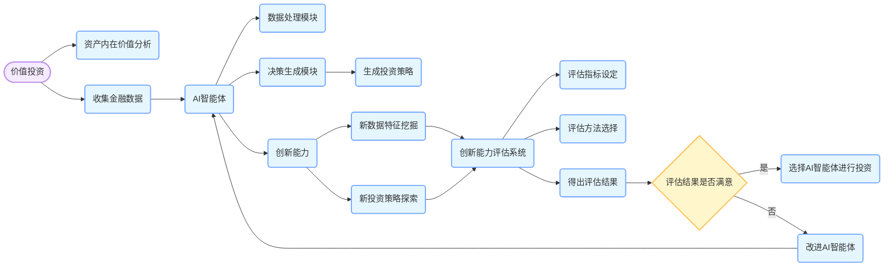

# 价值投资中的AI智能体创新能力评估系统

> 关键词：价值投资、AI智能体、创新能力评估、评估系统、金融科技、机器学习、数据分析

> 摘要：本文围绕价值投资中的AI智能体创新能力评估系统展开深入探讨。在价值投资领域，AI智能体的应用日益广泛，其创新能力对于投资决策的准确性和有效性至关重要。文章首先介绍了该评估系统的背景，包括目的、预期读者等内容。接着详细阐述了核心概念与联系，通过文本示意图和Mermaid流程图进行直观展示。然后对核心算法原理进行剖析，结合Python源代码说明具体操作步骤，并给出数学模型和公式进行详细讲解与举例。通过项目实战，展示了开发环境搭建、源代码实现与解读。同时探讨了实际应用场景，推荐了相关的学习资源、开发工具框架以及论文著作。最后总结了未来发展趋势与挑战，还提供了常见问题与解答以及扩展阅读参考资料，旨在为价值投资中AI智能体创新能力评估提供全面且深入的技术参考。

## 1. 背景介绍 
### 1.1 目的和范围
在当今的金融市场中，价值投资作为一种重要的投资策略，强调通过对资产内在价值的分析来做出投资决策。随着人工智能技术的飞速发展，AI智能体在价值投资领域的应用越来越广泛。AI智能体能够处理大量的金融数据，挖掘潜在的投资机会，为投资者提供决策支持。然而，不同的AI智能体在创新能力方面存在差异，这种创新能力直接影响着其在价值投资中的表现。

本评估系统的目的在于建立一套科学、客观、有效的方法，对价值投资中的AI智能体创新能力进行评估。通过评估，可以帮助投资者更好地选择适合自己投资策略的AI智能体，提高投资的成功率和回报率。同时，也有助于AI智能体开发者了解自身产品的优势和不足，进一步改进和优化AI智能体的性能。

本系统的范围主要涵盖与价值投资相关的AI智能体，包括但不限于基于机器学习、深度学习等技术的智能投资决策系统、量化交易策略生成器等。评估的内容主要集中在AI智能体的创新能力方面，如对新的金融数据特征的挖掘能力、对复杂市场环境的适应能力、对投资策略的创新能力等。

### 1.2 预期读者
- **投资者**：包括个人投资者和机构投资者。个人投资者可以借助本评估系统选择更具创新能力的AI智能体，提高自己的投资收益。机构投资者可以通过评估结果优化投资组合，降低投资风险。
- **AI智能体开发者**：开发者可以根据评估系统的结果，了解自己开发的AI智能体在创新能力方面的表现，发现存在的问题，从而有针对性地进行改进和优化，提升产品的竞争力。
- **金融研究人员**：研究人员可以利用本评估系统开展相关的学术研究，探索AI智能体在价值投资中的应用规律和发展趋势，为金融理论的创新提供实践依据。
- **监管机构人员**：监管机构可以通过本评估系统对市场上的AI智能体进行监管，确保其创新能力的发展符合金融市场的稳定和健康发展要求。

### 1.3 文档结构概述
本文将按照以下结构进行组织：
- 核心概念与联系：介绍价值投资、AI智能体、创新能力评估等核心概念，并通过文本示意图和Mermaid流程图展示它们之间的联系。
- 核心算法原理 & 具体操作步骤：详细阐述评估系统所采用的核心算法原理，并结合Python源代码说明具体的操作步骤。
- 数学模型和公式 & 详细讲解 & 举例说明：给出评估系统的数学模型和公式，并进行详细讲解，通过具体的例子说明其应用。
- 项目实战：代码实际案例和详细解释说明，包括开发环境搭建、源代码详细实现和代码解读。
- 实际应用场景：探讨本评估系统在价值投资中的实际应用场景。
- 工具和资源推荐：推荐相关的学习资源、开发工具框架以及论文著作。
- 总结：未来发展趋势与挑战：总结本评估系统的发展趋势和面临的挑战。
- 附录：常见问题与解答：提供常见问题的解答，帮助读者更好地理解和使用本评估系统。
- 扩展阅读 & 参考资料：列出相关的扩展阅读材料和参考资料，方便读者进一步深入研究。

### 1.4 术语表
#### 1.4.1 核心术语定义
- **价值投资**：一种投资策略，通过对资产的内在价值进行分析，寻找被低估的资产进行投资，以获取长期的投资回报。
- **AI智能体**：基于人工智能技术的智能程序或系统，能够感知环境、处理信息、做出决策并采取行动。在价值投资中，AI智能体可以用于分析金融数据、生成投资策略等。
- **创新能力评估**：对AI智能体在价值投资中表现出的创新能力进行评价和衡量的过程。创新能力包括对新数据特征的挖掘、对新投资策略的探索等方面。
- **评估系统**：一套用于对AI智能体创新能力进行评估的方法、算法和工具的集合。

#### 1.4.2 相关概念解释
- **机器学习**：一门多领域交叉学科，涉及概率论、统计学、逼近论、凸分析、算法复杂度理论等多门学科。它专门研究计算机怎样模拟或实现人类的学习行为，以获取新的知识或技能，重新组织已有的知识结构使之不断改善自身的性能。在价值投资中，机器学习算法可以用于对金融数据进行分析和预测。
- **深度学习**：机器学习的一个分支领域，它试图使用包含复杂结构或由多重非线性变换构成的多个处理层对数据进行高层抽象的算法。深度学习在图像识别、自然语言处理等领域取得了巨大的成功，在价值投资中也有广泛的应用。
- **量化交易**：指以先进的数学模型替代人为的主观判断，利用计算机技术从庞大的历史数据中海选能带来超额收益的多种“大概率”事件以制定策略，极大地减少了投资者情绪波动的影响，避免在市场极度狂热或悲观的情况下作出非理性的投资决策。

#### 1.4.3 缩略词列表
- **AI**：Artificial Intelligence，人工智能
- **ML**：Machine Learning，机器学习
- **DL**：Deep Learning，深度学习
- **QTrading**：Quantitative Trading，量化交易

## 2. 核心概念与联系 

### 核心概念原理
#### 价值投资
价值投资的核心原理是基于资产的内在价值进行投资决策。资产的内在价值是指其未来预期现金流的现值。价值投资者通过对公司的财务报表、行业前景、竞争优势等因素进行分析，估算出资产的内在价值，并与当前的市场价格进行比较。如果市场价格低于内在价值，就认为该资产被低估，具有投资价值；反之，则认为该资产被高估，不适合投资。

#### AI智能体
AI智能体是一种具有感知、决策和行动能力的智能程序或系统。在价值投资中，AI智能体可以通过对大量的金融数据进行分析，挖掘其中的规律和模式，从而生成投资策略。AI智能体的决策过程通常基于机器学习或深度学习算法，通过不断地学习和优化，提高其决策的准确性和有效性。

#### 创新能力评估
创新能力评估是对AI智能体在价值投资中表现出的创新能力进行评价和衡量的过程。创新能力包括对新数据特征的挖掘、对新投资策略的探索、对复杂市场环境的适应能力等方面。评估的目的是为了了解AI智能体的创新水平，为投资者选择合适的AI智能体提供参考，同时也为AI智能体开发者改进和优化产品提供依据。

### 架构的文本示意图
```plaintext
价值投资
|
|-- 投资决策依据：资产内在价值
|
|-- 数据来源：公司财务报表、行业数据等
|
|-- 辅助工具：AI智能体
|       |
|       |-- 数据处理模块：收集、清洗、分析金融数据
|       |
|       |-- 决策生成模块：基于机器学习或深度学习算法生成投资策略
|       |
|       |-- 创新能力：对新数据特征挖掘、新投资策略探索等
|
|-- 评估：创新能力评估系统
|       |
|       |-- 评估指标：新数据特征挖掘能力、新投资策略创新度等
|       |
|       |-- 评估方法：基于数学模型和算法
|       |
|       |-- 评估结果：AI智能体创新能力评分
```

### Mermaid流程图


## 3. 核心算法原理 & 具体操作步骤 

### 核心算法原理
本评估系统采用基于多指标综合评价的算法来评估AI智能体的创新能力。具体来说，我们将AI智能体的创新能力分解为多个评估指标，如对新数据特征的挖掘能力、对新投资策略的创新度、对复杂市场环境的适应能力等。每个评估指标都有相应的权重，通过对每个指标的评分，并结合权重进行加权求和，得到AI智能体的综合创新能力评分。

### 具体操作步骤及Python源代码

#### 步骤1：定义评估指标和权重
首先，我们需要定义评估AI智能体创新能力的指标和相应的权重。以下是一个示例：
```python
# 定义评估指标
evaluation_metrics = ['新数据特征挖掘能力', '新投资策略创新度', '复杂市场环境适应能力']

# 定义每个指标的权重
weights = [0.3, 0.4, 0.3]
```

#### 步骤2：对每个指标进行评分
接下来，我们需要对每个评估指标进行评分。评分可以根据具体的评估方法进行，例如可以通过对AI智能体的历史表现进行分析、与其他AI智能体进行比较等方式进行评分。以下是一个简单的示例，假设我们已经得到了每个指标的评分：
```python
# 假设已经得到了每个指标的评分
scores = [80, 90, 75]
```

#### 步骤3：计算综合创新能力评分
最后，我们根据每个指标的权重和评分，计算AI智能体的综合创新能力评分。计算公式为：
$$综合评分 = \sum_{i=1}^{n} 权重_i \times 评分_i$$
其中，$n$ 是评估指标的数量。

以下是Python代码实现：
```python
# 计算综合创新能力评分
def calculate_comprehensive_score(weights, scores):
    comprehensive_score = 0
    for i in range(len(weights)):
        comprehensive_score += weights[i] * scores[i]
    return comprehensive_score

# 计算综合评分
comprehensive_score = calculate_comprehensive_score(weights, scores)
print(f"AI智能体的综合创新能力评分为: {comprehensive_score}")
```

## 4. 数学模型和公式 & 详细讲解 & 举例说明 

### 数学模型和公式
如前面所述，本评估系统的数学模型基于多指标综合评价法，综合创新能力评分的计算公式为：
$$S = \sum_{i=1}^{n} w_i \times s_i$$
其中：
- $S$ 表示AI智能体的综合创新能力评分。
- $n$ 表示评估指标的数量。
- $w_i$ 表示第 $i$ 个评估指标的权重，且满足 $\sum_{i=1}^{n} w_i = 1$。
- $s_i$ 表示第 $i$ 个评估指标的评分。

### 详细讲解
- **权重的确定**：权重的确定是评估系统中的关键步骤，它反映了每个评估指标在综合创新能力中的重要程度。权重的确定可以采用多种方法，如专家打分法、层次分析法等。在实际应用中，需要根据具体的评估目的和需求，合理确定每个指标的权重。
- **评分的确定**：评分的确定需要根据具体的评估指标和评估方法进行。对于不同的评估指标，可以采用不同的评估方法，例如对于新数据特征挖掘能力，可以通过分析AI智能体发现的新数据特征的数量、质量等进行评分；对于新投资策略创新度，可以通过比较AI智能体生成的投资策略与传统策略的差异程度等进行评分。

### 举例说明
假设我们要评估一个AI智能体的创新能力，采用的评估指标和权重如下：
- 新数据特征挖掘能力：权重为 0.3
- 新投资策略创新度：权重为 0.4
- 复杂市场环境适应能力：权重为 0.3

对该AI智能体的每个指标进行评分，得到的结果如下：
- 新数据特征挖掘能力：80 分
- 新投资策略创新度：90 分
- 复杂市场环境适应能力：75 分

根据上述公式计算综合创新能力评分：
$$S = 0.3 \times 80 + 0.4 \times 90 + 0.3 \times 75$$
$$S = 24 + 36 + 22.5$$
$$S = 82.5$$

因此，该AI智能体的综合创新能力评分为 82.5 分。

## 5. 项目实战：代码实际案例和详细解释说明 

### 5.1  开发环境搭建
#### 安装Python
首先，需要安装Python开发环境。可以从Python官方网站（https://www.python.org/downloads/）下载适合自己操作系统的Python安装包，并按照安装向导进行安装。

#### 安装必要的库
本项目需要使用一些Python库，如 `numpy`、`pandas` 等。可以使用 `pip` 命令进行安装：
```sh
pip install numpy pandas
```

### 5.2  源代码详细实现和代码解读
以下是一个完整的Python代码示例，用于实现价值投资中AI智能体创新能力评估系统：
```python
import numpy as np
import pandas as pd

# 定义评估指标
evaluation_metrics = ['新数据特征挖掘能力', '新投资策略创新度', '复杂市场环境适应能力']

# 定义每个指标的权重
weights = np.array([0.3, 0.4, 0.3])

# 模拟AI智能体的评估数据
# 假设有 5 个AI智能体需要评估
num_agents = 5
scores = np.random.randint(60, 100, size=(num_agents, len(evaluation_metrics)))

# 创建DataFrame来存储评估数据
df = pd.DataFrame(scores, columns=evaluation_metrics)

# 计算每个AI智能体的综合创新能力评分
df['综合评分'] = df.apply(lambda x: np.dot(weights, x), axis=1)

# 输出评估结果
print("AI智能体创新能力评估结果：")
print(df)
```

### 5.3  代码解读与分析
- **导入必要的库**：`numpy` 用于进行数值计算，`pandas` 用于数据处理和分析。
- **定义评估指标和权重**：定义了三个评估指标和相应的权重。
- **模拟AI智能体的评估数据**：使用 `np.random.randint` 函数随机生成 5 个AI智能体的每个指标的评分。
- **创建DataFrame**：使用 `pandas` 的 `DataFrame` 来存储评估数据，方便进行数据处理和分析。
- **计算综合创新能力评分**：使用 `df.apply` 函数结合 `np.dot` 函数计算每个AI智能体的综合创新能力评分。
- **输出评估结果**：使用 `print` 函数输出评估结果。

## 6. 实际应用场景 
### 投资者选择AI智能体
投资者在选择AI智能体进行价值投资时，可以使用本评估系统对市场上的AI智能体进行评估。通过评估结果，投资者可以了解每个AI智能体的创新能力，选择创新能力较强的AI智能体，提高投资的成功率和回报率。例如，投资者可以根据综合创新能力评分对AI智能体进行排序，选择评分较高的AI智能体进行投资。

### AI智能体开发者改进产品
AI智能体开发者可以使用本评估系统对自己开发的AI智能体进行评估，了解产品在创新能力方面的优势和不足。根据评估结果，开发者可以有针对性地进行改进和优化，提高产品的性能和竞争力。例如，如果评估结果显示AI智能体在新数据特征挖掘能力方面得分较低，开发者可以加强对数据挖掘算法的研究和优化。

### 金融机构风险控制
金融机构在使用AI智能体进行投资决策时，可以使用本评估系统对AI智能体的创新能力进行评估。通过评估，可以了解AI智能体的创新能力是否符合金融机构的风险控制要求。如果AI智能体的创新能力过高，可能会带来较大的风险；如果创新能力过低，可能无法适应市场的变化。因此，金融机构可以根据评估结果，合理选择和管理AI智能体，降低投资风险。

## 7. 工具和资源推荐
### 7.1 学习资源推荐
#### 7.1.1 书籍推荐
- 《机器学习》（周志华著）：这本书全面介绍了机器学习的基本概念、算法和应用，是学习机器学习的经典教材。
- 《深度学习》（Ian Goodfellow、Yoshua Bengio和Aaron Courville著）：该书系统地介绍了深度学习的理论和实践，对于深入理解深度学习算法有很大的帮助。
- 《价值投资：从格雷厄姆到巴菲特》（布鲁斯·格林沃尔德著）：本书详细介绍了价值投资的理论和方法，是价值投资领域的经典著作。

#### 7.1.2 在线课程
- Coursera上的“机器学习”课程（Andrew Ng教授主讲）：该课程是机器学习领域的经典在线课程，内容丰富，讲解清晰，适合初学者学习。
- edX上的“深度学习”课程：由知名高校的教授授课，深入介绍了深度学习的理论和实践，对于提高深度学习水平有很大的帮助。
- 中国大学MOOC上的“金融投资学”课程：该课程系统地介绍了金融投资的基本理论和方法，对于了解价值投资有很大的帮助。

#### 7.1.3 技术博客和网站
- 博客园（https://www.cnblogs.com/）：有很多技术博客分享机器学习、深度学习等领域的技术文章和实践经验。
- 开源中国（https://www.oschina.net/）：提供了丰富的开源项目和技术资讯，对于了解最新的技术动态有很大的帮助。
- 金融界（https://www.jrj.com.cn/）：提供了大量的金融资讯和投资分析，对于了解金融市场和价值投资有很大的帮助。

### 7.2 开发工具框架推荐
#### 7.2.1 IDE和编辑器
- PyCharm：是一款专业的Python集成开发环境，具有代码编辑、调试、自动补全、代码分析等功能，适合Python开发。
- Jupyter Notebook：是一个交互式的开发环境，支持多种编程语言，尤其适合数据处理和分析、机器学习等领域的开发。
- Visual Studio Code：是一款轻量级的代码编辑器，支持多种编程语言和插件，具有丰富的功能和良好的用户体验。

#### 7.2.2 调试和性能分析工具
- `pdb`：是Python自带的调试工具，可以帮助开发者调试Python代码，定位问题。
- `cProfile`：是Python的性能分析工具，可以分析Python代码的性能瓶颈，帮助开发者优化代码。
- `TensorBoard`：是TensorFlow的可视化工具，可以帮助开发者可视化深度学习模型的训练过程和性能指标。

#### 7.2.3 相关框架和库
- `scikit-learn`：是一个简单易用的机器学习库，提供了丰富的机器学习算法和工具，适合初学者和快速开发。
- `TensorFlow`：是一个开源的深度学习框架，由Google开发，具有高效、灵活等特点，广泛应用于深度学习领域。
- `PyTorch`：是另一个开源的深度学习框架，由Facebook开发，具有简洁、易用等特点，受到很多研究者和开发者的喜爱。

### 7.3 相关论文著作推荐
#### 7.3.1 经典论文
- 《A Machine Learning Approach to Stock Price Prediction》：该论文介绍了一种使用机器学习算法进行股票价格预测的方法，对于了解机器学习在金融领域的应用有很大的帮助。
- 《Deep Learning for Financial Applications》：这篇论文探讨了深度学习在金融领域的应用，包括风险评估、投资决策等方面。
- 《Value Investing: The Use of Historical Financial Statement Information to Separate Winners from Losers》：该论文详细阐述了价值投资的理论和方法，是价值投资领域的经典论文。

#### 7.3.2 最新研究成果
- 可以关注顶级学术会议如NeurIPS（神经信息处理系统大会）、ICML（国际机器学习会议）、KDD（知识发现与数据挖掘会议）等上的相关研究成果，了解AI智能体在价值投资领域的最新研究进展。
- 一些知名学术期刊如《Journal of Financial Economics》、《The Review of Financial Studies》等也会发表关于金融和人工智能交叉领域的最新研究成果。

#### 7.3.3 应用案例分析
- 《AI in Finance: Real - World Applications and Challenges》：这本书通过实际案例分析了AI在金融领域的应用，包括价值投资中AI智能体的应用，对于了解实际应用场景和解决问题的方法有很大的帮助。
- 一些金融机构和科技公司的官方博客也会分享他们在价值投资中使用AI智能体的实践经验和案例分析，可以关注这些博客获取相关信息。

## 8. 总结：未来发展趋势与挑战
### 未来发展趋势
- **融合更多的数据源**：未来的AI智能体将融合更多的数据源，如社交媒体数据、卫星图像数据等，以挖掘更多的投资机会和新的数据特征。通过对这些非传统数据源的分析，AI智能体可以更全面地了解市场和企业的情况，提高投资决策的准确性。
- **强化学习的应用**：强化学习将在价值投资中得到更广泛的应用。强化学习可以让AI智能体通过与环境的交互不断学习和优化投资策略，以适应不断变化的市场环境。例如，AI智能体可以通过强化学习算法在不同的市场条件下自动调整投资组合，实现最优的投资回报。
- **跨领域融合**：AI智能体将与其他领域的技术进行更深入的融合，如区块链技术、物联网技术等。区块链技术可以提高金融数据的安全性和透明度，物联网技术可以提供更多的实时数据，这些技术的融合将为价值投资带来新的机遇和发展空间。

### 挑战
- **数据质量和隐私问题**：AI智能体的性能很大程度上依赖于数据的质量。在金融领域，数据的准确性、完整性和及时性都非常重要。同时，金融数据涉及到用户的隐私和商业机密，如何在保证数据质量的前提下，保护数据的隐私和安全是一个亟待解决的问题。
- **模型可解释性问题**：深度学习等复杂的AI模型往往具有较高的性能，但它们的决策过程往往难以解释。在价值投资中，投资者需要了解AI智能体的决策依据，以便做出合理的投资决策。因此，如何提高AI模型的可解释性是一个重要的挑战。
- **市场变化的适应性问题**：金融市场是复杂多变的，AI智能体需要具备较强的适应性，才能在不同的市场环境中做出准确的投资决策。如何让AI智能体快速适应市场的变化，是一个需要不断研究和解决的问题。

## 9. 附录：常见问题与解答
### 问题1：如何确定评估指标的权重？
答：评估指标的权重可以采用多种方法进行确定，如专家打分法、层次分析法等。专家打分法是邀请相关领域的专家对每个评估指标的重要程度进行打分，然后根据打分结果确定权重。层次分析法是一种系统的决策分析方法，通过建立层次结构模型，对各个指标进行两两比较，确定其相对重要性，从而得到权重。

### 问题2：评分的标准是什么？
答：评分的标准需要根据具体的评估指标进行确定。对于不同的评估指标，可以采用不同的评分标准。例如，对于新数据特征挖掘能力，可以根据发现的新数据特征的数量、质量、对投资决策的影响程度等进行评分；对于新投资策略创新度，可以根据投资策略与传统策略的差异程度、策略的盈利能力等进行评分。

### 问题3：本评估系统适用于所有的AI智能体吗？
答：本评估系统主要适用于与价值投资相关的AI智能体，如基于机器学习、深度学习等技术的智能投资决策系统、量化交易策略生成器等。对于其他类型的AI智能体，可能需要根据具体情况进行调整和优化评估指标和方法。

### 问题4：如何保证评估结果的准确性？
答：为了保证评估结果的准确性，需要从以下几个方面入手：一是确保数据的质量，评估数据应该准确、完整、及时；二是合理确定评估指标和权重，评估指标应该能够全面、客观地反映AI智能体的创新能力，权重应该根据评估目的和需求合理确定；三是采用科学、合理的评估方法，评估方法应该具有可靠性和有效性。

## 10. 扩展阅读 & 参考资料
### 扩展阅读
- 《智能金融：AI时代金融行业的转型与创新》：本书介绍了AI在金融领域的应用和发展趋势，对于了解智能金融有很大的帮助。
- 《金融科技前沿：技术驱动的金融创新》：该书探讨了金融科技的前沿技术和应用，包括AI智能体在金融领域的应用，适合对金融科技感兴趣的读者阅读。

### 参考资料
- 周志华. 机器学习[M]. 清华大学出版社, 2016.
- Ian Goodfellow, Yoshua Bengio, Aaron Courville. 深度学习[M]. 人民邮电出版社, 2017.
- 布鲁斯·格林沃尔德. 价值投资：从格雷厄姆到巴菲特[M]. 机械工业出版社, 2015.

作者：AI天才研究院/AI Genius Institute & 禅与计算机程序设计艺术 /Zen And The Art of Computer Programming