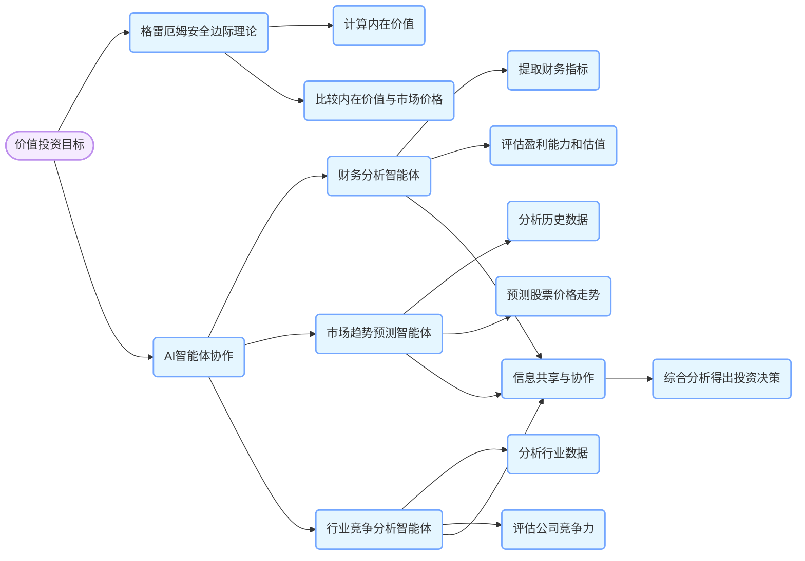

# 价值投资中的AI智能体协作：增强格雷厄姆的安全边际理论

> 关键词：价值投资、AI智能体协作、格雷厄姆安全边际理论、金融分析、机器学习

> 摘要：本文旨在探讨如何利用AI智能体协作来增强格雷厄姆的安全边际理论在价值投资中的应用。首先介绍了价值投资及安全边际理论的背景知识，阐述了文章的目的、范围、预期读者等内容。接着详细讲解了AI智能体协作与安全边际理论的核心概念及联系，给出了原理和架构的文本示意图与Mermaid流程图。然后深入剖析了核心算法原理，用Python代码进行了详细阐述，同时介绍了相关的数学模型和公式，并举例说明。通过项目实战，展示了如何搭建开发环境、实现源代码以及对代码进行解读分析。还探讨了该方法在实际中的应用场景，推荐了学习、开发工具及相关论文著作。最后总结了未来发展趋势与挑战，提供了常见问题解答及扩展阅读参考资料，以期为价值投资者提供一种新的思路和方法，提升投资决策的科学性和准确性。

## 1. 背景介绍 
### 1.1 目的和范围
价值投资作为一种重要的投资策略，由本杰明·格雷厄姆（Benjamin Graham）开创，其核心的安全边际理论强调在投资时要确保所支付的价格低于资产的内在价值，以降低投资风险。然而，随着金融市场的日益复杂和数据量的爆炸式增长，传统的价值投资分析方法面临着诸多挑战。本文的目的在于研究如何引入AI智能体协作的方式，增强格雷厄姆的安全边际理论在价值投资中的应用效果。

文章的范围主要涵盖价值投资领域，聚焦于利用AI智能体协作对安全边际理论进行优化。具体包括对AI智能体协作的原理、算法、数学模型的探讨，以及如何在实际投资项目中应用这些技术，同时分析其在不同应用场景中的表现和未来发展趋势。

### 1.2 预期读者
本文的预期读者主要包括以下几类人群：
1. **价值投资者**：希望通过引入先进的技术手段，提升自己在价值投资中的决策能力和投资回报率，深入理解如何利用AI智能体协作来增强安全边际理论的应用。
2. **金融分析师**：对金融市场的数据分析和投资策略有深入研究的专业人士，他们可以从本文中获取关于AI技术在金融分析中的应用思路和方法。
3. **AI技术开发者**：关注AI技术在金融领域应用的开发者，了解价值投资的业务需求，将AI智能体协作技术与金融分析相结合，开发出更具针对性的应用程序。
4. **金融专业学生**：正在学习金融投资相关课程的学生，通过阅读本文可以拓宽知识面，了解前沿的投资理念和技术应用。

### 1.3 文档结构概述
本文将按照以下结构进行阐述：
1. **背景介绍**：介绍文章的目的、范围、预期读者和文档结构，以及相关术语的定义和解释。
2. **核心概念与联系**：详细讲解价值投资、格雷厄姆安全边际理论和AI智能体协作的核心概念，以及它们之间的联系，并给出相应的文本示意图和Mermaid流程图。
3. **核心算法原理 & 具体操作步骤**：深入分析AI智能体协作中涉及的核心算法原理，并用Python代码详细阐述具体的操作步骤。
4. **数学模型和公式 & 详细讲解 & 举例说明**：介绍相关的数学模型和公式，对其进行详细讲解，并通过实际例子说明其应用。
5. **项目实战：代码实际案例和详细解释说明**：通过一个实际的项目案例，展示如何搭建开发环境、实现源代码，并对代码进行解读和分析。
6. **实际应用场景**：探讨AI智能体协作增强安全边际理论在不同金融市场和投资领域的实际应用场景。
7. **工具和资源推荐**：推荐学习、开发工具和相关的论文著作，帮助读者进一步深入研究。
8. **总结：未来发展趋势与挑战**：总结本文的主要内容，分析未来的发展趋势和可能面临的挑战。
9. **附录：常见问题与解答**：提供常见问题的解答，帮助读者更好地理解文章内容。
10. **扩展阅读 & 参考资料**：列出相关的扩展阅读资料和参考文献，方便读者进一步查阅。

### 1.4 术语表
#### 1.4.1 核心术语定义
1. **价值投资**：一种投资策略，通过分析公司的基本面，寻找被低估的股票，以低于其内在价值的价格买入，并长期持有，等待价格回归价值，从而获得投资收益。
2. **格雷厄姆安全边际理论**：由本杰明·格雷厄姆提出的投资理论，强调在投资时要确保所支付的价格与资产的内在价值之间存在一定的安全边际，以降低投资风险。安全边际可以理解为一种缓冲，即使未来公司的业绩出现一定的波动，投资者也不会遭受重大损失。
3. **AI智能体**：一种能够感知环境、自主决策并采取行动的人工智能实体。在本文中，AI智能体可以根据金融市场的数据和预设的规则，进行投资分析和决策。
4. **AI智能体协作**：多个AI智能体之间通过信息共享、协同工作，共同完成一个复杂的任务。在价值投资中，不同的AI智能体可以分别负责不同的分析任务，如财务报表分析、市场趋势预测等，然后通过协作得出更准确的投资决策。

#### 1.4.2 相关概念解释
1. **内在价值**：指公司的真实价值，是基于公司的财务状况、盈利能力、行业前景等因素综合评估得出的价值。内在价值是价值投资的核心概念，投资者通过寻找被低估的股票，即价格低于内在价值的股票，来实现投资收益。
2. **市场价格**：指股票在证券市场上的交易价格，由市场供求关系决定。市场价格会受到多种因素的影响，如宏观经济环境、公司业绩、投资者情绪等，因此市场价格可能会偏离公司的内在价值。
3. **机器学习**：是一门多领域交叉学科，涉及概率论、统计学、逼近论、凸分析、算法复杂度理论等多门学科。它专门研究计算机怎样模拟或实现人类的学习行为，以获取新的知识或技能，重新组织已有的知识结构使之不断改善自身的性能。在本文中，机器学习算法可以用于分析金融数据，预测股票价格走势，评估公司的内在价值等。

#### 1.4.3 缩略词列表
1. **AI**：Artificial Intelligence，人工智能
2. **ML**：Machine Learning，机器学习
3. **ROE**：Return on Equity，净资产收益率
4. **P/E**：Price-to-Earnings Ratio，市盈率

## 2. 核心概念与联系 

### 价值投资与格雷厄姆安全边际理论
价值投资的核心思想是寻找被市场低估的资产，并在价格低于其内在价值时买入，等待价格回归价值以获取收益。格雷厄姆安全边际理论是价值投资的重要基石，它为投资者提供了一种风险管理的方法。安全边际可以用公式表示为：

$$安全边际 = 内在价值 - 市场价格$$

当安全边际为正且足够大时，意味着投资者以较低的价格买入了具有较高价值的资产，从而降低了投资风险。例如，如果一家公司的内在价值经评估为每股100元，而当前市场价格为每股80元，那么安全边际为每股20元。

### AI智能体协作的原理
AI智能体是一种能够感知环境、自主决策并采取行动的人工智能实体。在AI智能体协作中，多个智能体通过信息共享和协同工作，共同完成一个复杂的任务。在价值投资中，不同的AI智能体可以分别负责不同的分析任务，如财务报表分析、市场趋势预测、行业竞争分析等。

例如，一个AI智能体可以负责对公司的财务报表进行分析，提取关键的财务指标，如净资产收益率（ROE）、市盈率（P/E）等，并根据这些指标评估公司的盈利能力和估值水平。另一个AI智能体可以负责分析市场趋势，通过对历史数据的学习和分析，预测股票价格的走势。这些智能体之间通过信息共享和协作，最终得出一个综合的投资决策。

### 核心概念的联系
AI智能体协作可以为格雷厄姆的安全边际理论提供更准确、更全面的分析支持。通过机器学习和数据分析技术，AI智能体可以处理大量的金融数据，挖掘出隐藏在数据中的信息，从而更准确地评估公司的内在价值。同时，AI智能体还可以实时监测市场价格的变化，及时发现安全边际较大的投资机会。

例如，AI智能体可以通过对公司的财务报表、行业数据、宏观经济数据等多方面的分析，建立一个综合的估值模型，更准确地计算公司的内在价值。然后，通过实时监测市场价格，当市场价格低于内在价值且安全边际达到一定阈值时，AI智能体可以及时发出投资信号。

### 原理和架构的文本示意图
```plaintext
价值投资目标：寻找安全边际大的投资机会
|
|-- 格雷厄姆安全边际理论
|   |-- 计算内在价值
|   |-- 比较内在价值与市场价格
|
|-- AI智能体协作
|   |-- 财务分析智能体
|   |   |-- 提取财务指标
|   |   |-- 评估盈利能力和估值
|   |-- 市场趋势预测智能体
|   |   |-- 分析历史数据
|   |   |-- 预测股票价格走势
|   |-- 行业竞争分析智能体
|   |   |-- 分析行业数据
|   |   |-- 评估公司竞争力
|
|-- 信息共享与协作
|   |-- 智能体之间交换信息
|   |-- 综合分析得出投资决策
```

### Mermaid流程图


## 3. 核心算法原理 & 具体操作步骤 

### 核心算法原理

#### 财务指标分析算法
在价值投资中，财务指标是评估公司盈利能力和估值水平的重要依据。常用的财务指标包括净资产收益率（ROE）、市盈率（P/E）、市净率（P/B）等。下面以ROE为例，介绍财务指标分析算法的原理。

ROE是指公司净利润与净资产的比率，反映了公司运用自有资本的效率。计算公式为：

$$ROE = \frac{净利润}{净资产} \times 100\%$$

通过计算公司的ROE，并与同行业其他公司进行比较，可以评估公司的盈利能力。一般来说，ROE越高，说明公司的盈利能力越强。

#### 市场趋势预测算法
市场趋势预测是价值投资中的重要环节，常用的方法包括时间序列分析、机器学习算法等。这里以简单的线性回归算法为例，介绍市场趋势预测算法的原理。

线性回归是一种用于建立自变量和因变量之间线性关系的统计方法。在市场趋势预测中，自变量可以是时间，因变量可以是股票价格。线性回归模型的一般形式为：

$$y = \beta_0 + \beta_1x + \epsilon$$

其中，$y$ 是股票价格，$x$ 是时间，$\beta_0$ 和 $\beta_1$ 是回归系数，$\epsilon$ 是误差项。通过最小二乘法可以估计回归系数 $\beta_0$ 和 $\beta_1$，从而得到线性回归模型。

#### 智能体协作算法
智能体协作算法的核心是信息共享和协同决策。不同的AI智能体在完成各自的分析任务后，将结果发送给一个中心智能体。中心智能体对这些结果进行综合分析，得出最终的投资决策。

例如，财务分析智能体计算出公司的ROE和P/E等财务指标，市场趋势预测智能体预测出股票价格的走势，行业竞争分析智能体评估出公司的竞争力。中心智能体根据这些信息，综合评估公司的内在价值和安全边际，从而决定是否投资该股票。

### 具体操作步骤

#### 步骤1：数据收集
首先需要收集相关的金融数据，包括公司的财务报表、股票价格历史数据、行业数据等。可以通过金融数据提供商（如Wind、东方财富等）或证券交易所网站获取这些数据。

#### 步骤2：数据预处理
收集到的数据可能存在缺失值、异常值等问题，需要进行数据预处理。常见的数据预处理方法包括缺失值填充、异常值处理、数据标准化等。

以下是一个使用Python进行数据预处理的示例代码：
```python
import pandas as pd
import numpy as np

# 读取数据
data = pd.read_csv('financial_data.csv')

# 处理缺失值
data = data.fillna(data.mean())

# 处理异常值
def remove_outliers(data, column):
    Q1 = data[column].quantile(0.25)
    Q3 = data[column].quantile(0.75)
    IQR = Q3 - Q1
    lower_bound = Q1 - 1.5 * IQR
    upper_bound = Q3 + 1.5 * IQR
    data = data[(data[column] >= lower_bound) & (data[column] <= upper_bound)]
    return data

for column in data.columns:
    data = remove_outliers(data, column)

# 数据标准化
from sklearn.preprocessing import StandardScaler
scaler = StandardScaler()
data_scaled = scaler.fit_transform(data)
```

#### 步骤3：财务指标分析
使用预处理后的数据计算公司的财务指标，如ROE、P/E等。

```python
# 计算ROE
net_income = data['净利润']
net_assets = data['净资产']
roe = (net_income / net_assets) * 100

# 计算P/E
price = data['股票价格']
earnings_per_share = data['每股收益']
pe = price / earnings_per_share
```

#### 步骤4：市场趋势预测
使用机器学习算法进行市场趋势预测。以线性回归为例：

```python
from sklearn.linear_model import LinearRegression
from sklearn.model_selection import train_test_split

# 准备数据
X = data['时间'].values.reshape(-1, 1)
y = data['股票价格'].values

# 划分训练集和测试集
X_train, X_test, y_train, y_test = train_test_split(X, y, test_size=0.2, random_state=42)

# 训练线性回归模型
model = LinearRegression()
model.fit(X_train, y_train)

# 预测股票价格
y_pred = model.predict(X_test)
```

#### 步骤5：智能体协作与决策
将财务指标分析结果和市场趋势预测结果发送给中心智能体，中心智能体进行综合分析，得出投资决策。

```python
# 假设中心智能体的决策函数
def decision_making(roe, pe, y_pred):
    if roe > 15 and pe < 20 and y_pred[-1] > y_pred[-2]:
        return '买入'
    else:
        return '不买入'

# 调用决策函数
decision = decision_making(roe, pe, y_pred)
print('投资决策:', decision)
```

## 4. 数学模型和公式 & 详细讲解 & 举例说明 

### 财务指标相关数学模型和公式

#### 净资产收益率（ROE）
$$ROE = \frac{净利润}{净资产} \times 100\%$$

详细讲解：ROE反映了公司运用自有资本的效率，是衡量公司盈利能力的重要指标。ROE越高，说明公司每单位净资产创造的净利润越多，盈利能力越强。例如，一家公司的净利润为1000万元，净资产为5000万元，则其ROE为：

$$ROE = \frac{1000}{5000} \times 100\% = 20\%$$

这意味着该公司每100元的净资产可以创造20元的净利润。

#### 市盈率（P/E）
$$P/E = \frac{股票价格}{每股收益}$$

详细讲解：P/E反映了市场对公司盈利的预期。一般来说，P/E越高，说明市场对公司的未来盈利预期越高，但也可能意味着股票价格被高估。例如，某股票的价格为20元，每股收益为1元，则其P/E为：

$$P/E = \frac{20}{1} = 20$$

这表示投资者愿意为该公司每1元的盈利支付20元的价格。

#### 市净率（P/B）
$$P/B = \frac{股票价格}{每股净资产}$$

详细讲解：P/B反映了股票价格与公司净资产的关系。P/B越低，说明股票价格相对净资产越低，可能存在被低估的情况。例如，某股票的价格为10元，每股净资产为5元，则其P/B为：

$$P/B = \frac{10}{5} = 2$$

### 市场趋势预测相关数学模型和公式

#### 线性回归模型
$$y = \beta_0 + \beta_1x + \epsilon$$

详细讲解：在线性回归模型中，$y$ 是因变量（如股票价格），$x$ 是自变量（如时间），$\beta_0$ 是截距，$\beta_1$ 是斜率，$\epsilon$ 是误差项。通过最小二乘法可以估计回归系数 $\beta_0$ 和 $\beta_1$，使得误差项的平方和最小。

例如，假设我们有一组股票价格数据和对应的时间数据，通过线性回归得到回归方程为：

$$y = 10 + 2x$$

这意味着当时间 $x$ 每增加1个单位，股票价格 $y$ 平均增加2个单位。

### 安全边际相关数学模型和公式
$$安全边际 = 内在价值 - 市场价格$$

详细讲解：安全边际是价值投资中的核心概念，它为投资者提供了一种风险管理的方法。当安全边际为正且足够大时，意味着投资者以较低的价格买入了具有较高价值的资产，从而降低了投资风险。

例如，假设通过对一家公司的财务报表、行业前景等因素进行分析，评估出该公司的内在价值为每股50元，而当前市场价格为每股40元，则安全边际为：

$$安全边际 = 50 - 40 = 10（元）$$

这表示投资者在买入该股票时，有10元的价格缓冲空间，即使未来公司的业绩出现一定的波动，投资者也不会遭受重大损失。

## 5. 项目实战：代码实际案例和详细解释说明 

### 5.1  开发环境搭建
#### 操作系统
本项目可以在Windows、Linux或macOS等主流操作系统上进行开发。建议使用Linux或macOS系统，因为它们对Python和相关开发工具的支持更好。

#### Python环境
Python是本项目的主要编程语言，建议使用Python 3.7及以上版本。可以通过以下步骤安装Python：
1. 访问Python官方网站（https://www.python.org/downloads/），下载适合你操作系统的Python安装包。
2. 运行安装包，按照安装向导的提示进行安装。在安装过程中，建议勾选“Add Python to PATH”选项，以便在命令行中可以直接使用Python。

#### 虚拟环境
为了避免不同项目之间的依赖冲突，建议使用虚拟环境来管理项目的依赖。可以使用`venv`或`conda`来创建虚拟环境。以下是使用`venv`创建虚拟环境的示例：
```bash
# 创建虚拟环境
python -m venv myenv

# 激活虚拟环境
# 在Windows上
myenv\Scripts\activate
# 在Linux或macOS上
source myenv/bin/activate
```

#### 安装依赖库
在虚拟环境中，使用`pip`安装项目所需的依赖库：
```bash
pip install pandas numpy scikit-learn matplotlib
```

### 5.2  源代码详细实现和代码解读

#### 数据收集和预处理
```python
import pandas as pd
import numpy as np

# 读取数据
data = pd.read_csv('financial_data.csv')

# 处理缺失值
data = data.fillna(data.mean())

# 处理异常值
def remove_outliers(data, column):
    Q1 = data[column].quantile(0.25)
    Q3 = data[column].quantile(0.75)
    IQR = Q3 - Q1
    lower_bound = Q1 - 1.5 * IQR
    upper_bound = Q3 + 1.5 * IQR
    data = data[(data[column] >= lower_bound) & (data[column] <= upper_bound)]
    return data

for column in data.columns:
    data = remove_outliers(data, column)

# 数据标准化
from sklearn.preprocessing import StandardScaler
scaler = StandardScaler()
data_scaled = scaler.fit_transform(data)
```
代码解读：
1. `pd.read_csv('financial_data.csv')`：使用`pandas`库读取CSV格式的金融数据文件。
2. `data.fillna(data.mean())`：使用每列的均值填充缺失值。
3. `remove_outliers`函数：通过计算四分位数和四分位距（IQR），去除数据中的异常值。
4. `StandardScaler()`：使用`sklearn`库的`StandardScaler`对数据进行标准化处理，使得数据的均值为0，标准差为1。

#### 财务指标分析
```python
# 计算ROE
net_income = data['净利润']
net_assets = data['净资产']
roe = (net_income / net_assets) * 100

# 计算P/E
price = data['股票价格']
earnings_per_share = data['每股收益']
pe = price / earnings_per_share
```
代码解读：
1. `roe = (net_income / net_assets) * 100`：根据ROE的计算公式，计算公司的净资产收益率。
2. `pe = price / earnings_per_share`：根据P/E的计算公式，计算公司的市盈率。

#### 市场趋势预测
```python
from sklearn.linear_model import LinearRegression
from sklearn.model_selection import train_test_split

# 准备数据
X = data['时间'].values.reshape(-1, 1)
y = data['股票价格'].values

# 划分训练集和测试集
X_train, X_test, y_train, y_test = train_test_split(X, y, test_size=0.2, random_state=42)

# 训练线性回归模型
model = LinearRegression()
model.fit(X_train, y_train)

# 预测股票价格
y_pred = model.predict(X_test)
```
代码解读：
1. `X = data['时间'].values.reshape(-1, 1)`：将时间数据转换为二维数组，作为线性回归模型的自变量。
2. `y = data['股票价格'].values`：将股票价格数据作为线性回归模型的因变量。
3. `train_test_split`：使用`sklearn`库的`train_test_split`函数将数据划分为训练集和测试集，测试集占比为20%。
4. `LinearRegression()`：创建线性回归模型。
5. `model.fit(X_train, y_train)`：使用训练集数据训练线性回归模型。
6. `model.predict(X_test)`：使用训练好的模型对测试集数据进行预测。

#### 智能体协作与决策
```python
# 假设中心智能体的决策函数
def decision_making(roe, pe, y_pred):
    if roe > 15 and pe < 20 and y_pred[-1] > y_pred[-2]:
        return '买入'
    else:
        return '不买入'

# 调用决策函数
decision = decision_making(roe, pe, y_pred)
print('投资决策:', decision)
```
代码解读：
1. `decision_making`函数：根据ROE、P/E和股票价格预测结果，判断是否买入股票。如果ROE大于15%，P/E小于20，且最后一个预测价格大于前一个预测价格，则建议买入；否则建议不买入。
2. `decision_making(roe, pe, y_pred)`：调用决策函数，得出投资决策并打印输出。

### 5.3  代码解读与分析
通过上述代码，我们完成了一个简单的价值投资分析项目。首先，对金融数据进行了收集和预处理，包括缺失值处理、异常值处理和数据标准化。然后，计算了公司的财务指标ROE和P/E，用于评估公司的盈利能力和估值水平。接着，使用线性回归模型对股票价格进行了预测。最后，通过一个简单的决策函数，综合考虑财务指标和市场趋势预测结果，得出投资决策。

需要注意的是，这个项目只是一个简单的示例，实际的价值投资分析要复杂得多。在实际应用中，需要考虑更多的因素，如行业竞争、宏观经济环境等，同时可以使用更复杂的机器学习算法和模型，以提高投资决策的准确性。

## 6. 实际应用场景 
### 股票投资
在股票投资中，AI智能体协作增强格雷厄姆的安全边际理论可以帮助投资者更准确地评估股票的内在价值和安全边际。通过对公司的财务报表、行业数据、市场趋势等多方面的分析，AI智能体可以发现被市场低估的股票，并及时发出投资信号。例如，当一家公司的财务指标显示其盈利能力较强，但市场价格却相对较低时，AI智能体可以通过综合分析判断该股票是否具有投资价值，并根据安全边际的大小决定是否买入。

### 基金投资
对于基金投资者来说，AI智能体协作可以帮助他们选择更优质的基金产品。通过分析基金的持仓情况、业绩表现、风险指标等数据，AI智能体可以评估基金的投资价值和风险水平。同时，结合市场趋势预测，AI智能体可以帮助投资者在合适的时机买入或卖出基金，以获取更好的投资收益。例如，当市场处于下跌趋势时，AI智能体可以提醒投资者减少股票型基金的持仓，增加债券型基金或货币型基金的持仓，以降低投资风险。

### 债券投资
在债券投资中，AI智能体协作可以帮助投资者评估债券的信用风险和投资价值。通过分析债券发行人的财务状况、行业前景、信用评级等因素，AI智能体可以预测债券违约的可能性，并计算债券的合理价格。同时，结合市场利率的变化趋势，AI智能体可以帮助投资者选择合适的债券投资时机。例如，当市场利率下降时，债券价格通常会上涨，AI智能体可以提醒投资者买入债券；当市场利率上升时，债券价格通常会下跌，AI智能体可以提醒投资者卖出债券。

### 投资组合管理
AI智能体协作还可以应用于投资组合管理。通过对不同资产类别的风险和收益进行分析，AI智能体可以帮助投资者构建最优的投资组合，实现风险和收益的平衡。例如，AI智能体可以根据投资者的风险偏好和投资目标，选择不同比例的股票、债券、基金等资产进行组合，并根据市场情况实时调整投资组合的配置。同时，AI智能体还可以监测投资组合的风险水平，当风险超过设定的阈值时，及时发出预警信号，提醒投资者采取相应的措施。

## 7. 工具和资源推荐
### 7.1 学习资源推荐
#### 7.1.1 书籍推荐
1. 《聪明的投资者》（The Intelligent Investor）：本杰明·格雷厄姆的经典著作，是价值投资领域的必读之书，详细介绍了格雷厄姆的投资理念和方法，包括安全边际理论。
2. 《证券分析》（Security Analysis）：同样是本杰明·格雷厄姆的著作，对证券分析的基本原理和方法进行了系统的阐述，是价值投资的理论基石。
3. 《机器学习》（Machine Learning）：周志华著，是机器学习领域的经典教材，全面介绍了机器学习的基本概念、算法和应用，对于理解AI智能体协作中的机器学习算法有很大帮助。
4. 《Python数据分析实战》（Python for Data Analysis）：Wes McKinney著，详细介绍了如何使用Python进行数据分析，包括数据处理、可视化等方面的内容，对于处理金融数据非常有用。

#### 7.1.2 在线课程
1. Coursera上的“机器学习”课程：由斯坦福大学教授Andrew Ng主讲，是机器学习领域最受欢迎的在线课程之一，系统介绍了机器学习的基本算法和应用。
2. edX上的“金融科技基础”课程：介绍了金融科技的基本概念、技术和应用，包括AI在金融领域的应用，对于了解AI智能体协作在价值投资中的应用有一定的帮助。
3. 网易云课堂上的“Python数据分析与挖掘实战”课程：通过实际案例介绍了如何使用Python进行数据分析和挖掘，适合初学者学习。

#### 7.1.3 技术博客和网站
1. Medium：一个知名的技术博客平台，上面有很多关于AI、金融科技等领域的优质文章，可以关注一些相关的博主，获取最新的技术动态和研究成果。
2. Towards Data Science：专门分享数据科学和机器学习相关内容的网站，有很多高质量的技术文章和教程。
3. 雪球网：国内知名的财经社区，上面有很多投资者分享自己的投资经验和分析报告，可以从中获取一些关于价值投资的信息和思路。

### 7.2 开发工具框架推荐
#### 7.2.1 IDE和编辑器
1. PyCharm：一款功能强大的Python集成开发环境（IDE），提供了代码编辑、调试、版本控制等一系列功能，适合专业的Python开发者使用。
2. Jupyter Notebook：一个交互式的开发环境，支持Python、R等多种编程语言，非常适合进行数据分析和模型开发。可以通过浏览器访问，方便代码的展示和分享。
3. Visual Studio Code：一款轻量级的代码编辑器，支持多种编程语言，具有丰富的插件扩展功能，可以通过安装Python相关插件来进行Python开发。

#### 7.2.2 调试和性能分析工具
1. PDB：Python自带的调试工具，可以在代码中设置断点，逐行调试代码，帮助开发者定位和解决问题。
2. cProfile：Python的性能分析工具，可以统计代码中各个函数的执行时间和调用次数，帮助开发者找出代码中的性能瓶颈。
3. TensorBoard：TensorFlow的可视化工具，可以用于可视化训练过程中的各种指标，如损失函数、准确率等，帮助开发者监控模型的训练情况。

#### 7.2.3 相关框架和库
1. Pandas：Python中用于数据处理和分析的库，提供了高效的数据结构和数据操作方法，如数据读取、清洗、转换等。
2. NumPy：Python中用于科学计算的基础库，提供了多维数组对象和各种数学函数，是很多机器学习和数据分析库的基础。
3. Scikit-learn：Python中常用的机器学习库，提供了各种机器学习算法和工具，如分类、回归、聚类等，方便开发者进行模型开发和训练。
4. TensorFlow和PyTorch：深度学习领域的两大主流框架，提供了丰富的深度学习模型和工具，如神经网络、卷积神经网络等，适合进行复杂的模型开发和训练。

### 7.3 相关论文著作推荐
#### 7.3.1 经典论文
1. “The Intelligent Investor”（本杰明·格雷厄姆）：这篇论文详细阐述了价值投资的理念和方法，包括安全边际理论，是价值投资领域的经典之作。
2. “Capital Asset Pricing Model”（William Sharpe）：提出了资本资产定价模型（CAPM），用于描述资产的预期收益率与风险之间的关系，是现代金融理论的重要基础。
3. “Efficient Market Hypothesis”（Eugene F. Fama）：提出了有效市场假说，认为在有效市场中，资产价格已经反映了所有可用的信息，投资者无法通过分析历史数据来获得超额收益。

#### 7.3.2 最新研究成果
1. “Artificial Intelligence in Finance”：该研究探讨了AI在金融领域的应用现状和未来发展趋势，包括AI智能体协作在投资决策中的应用。
2. “Machine Learning for Portfolio Optimization”：研究了如何使用机器学习算法进行投资组合优化，提高投资组合的风险收益比。
3. “Deep Learning for Financial Time Series Forecasting”：介绍了如何使用深度学习算法对金融时间序列数据进行预测，如股票价格预测、汇率预测等。

#### 7.3.3 应用案例分析
1. “AI-Powered Investment Strategies in Hedge Funds”：分析了对冲基金中使用AI技术的投资策略和应用案例，展示了AI在投资决策中的实际效果。
2. “Using Machine Learning to Enhance Value Investing”：通过实际案例介绍了如何使用机器学习技术增强价值投资的效果，提高投资决策的准确性。
3. “AI-Driven Portfolio Management in Asset Management Firms”：研究了资产管理公司中使用AI技术进行投资组合管理的应用案例，分析了其优势和挑战。

## 8. 总结：未来发展趋势与挑战
### 未来发展趋势
#### 更广泛的应用场景
随着AI技术的不断发展和金融市场的日益复杂，AI智能体协作增强格雷厄姆的安全边际理论将在更多的金融领域得到应用。除了股票、基金、债券投资和投资组合管理外，还可能应用于期货、期权等衍生品市场，以及保险、银行等金融机构的风险管理和投资决策。

#### 与其他技术的融合
AI智能体协作将与区块链、物联网等其他新兴技术进行深度融合。例如，区块链技术可以提供更安全、透明的金融数据共享平台，物联网技术可以提供更丰富的实时数据，从而进一步提高AI智能体协作的效率和准确性。

#### 个性化投资服务
未来，AI智能体协作可以根据投资者的个性化需求和风险偏好，提供更加定制化的投资服务。通过对投资者的历史交易数据、资产状况、投资目标等信息的分析，AI智能体可以为投资者量身定制投资策略和投资组合，实现个性化的投资决策。

#### 自动化投资决策
随着AI技术的不断进步，投资决策过程将越来越自动化。AI智能体可以实时监测市场数据，自动分析和评估投资机会，自动执行投资交易，从而实现投资决策的自动化和智能化。

### 挑战
#### 数据质量和隐私问题
AI智能体协作需要大量的金融数据作为支撑，但金融数据的质量和隐私问题是一个重要的挑战。数据可能存在缺失值、异常值、错误值等问题，影响模型的准确性。同时，金融数据涉及到投资者的隐私和敏感信息，如何保护数据的安全和隐私是一个亟待解决的问题。

#### 模型的可解释性
AI模型，尤其是深度学习模型，往往具有较高的复杂性和黑盒性，模型的决策过程难以解释。在价值投资中，投资者需要了解模型的决策依据，以便做出合理的投资决策。因此，如何提高AI模型的可解释性是一个重要的挑战。

#### 市场的不确定性
金融市场具有高度的不确定性和复杂性，市场价格受到多种因素的影响，如宏观经济环境、政策变化、投资者情绪等。AI智能体协作虽然可以通过数据分析和模型预测来评估投资风险和机会，但无法完全预测市场的未来走势。因此，如何应对市场的不确定性是一个长期的挑战。

#### 法律法规和监管问题
随着AI技术在金融领域的广泛应用，相关的法律法规和监管问题也日益凸显。如何确保AI智能体协作的合法性和合规性，如何防范AI技术带来的金融风险，是监管部门需要面对的重要问题。

## 9. 附录：常见问题与解答
### 问题1：AI智能体协作一定能提高投资回报率吗？
解答：AI智能体协作可以为投资决策提供更准确、更全面的分析支持，但并不能保证一定能提高投资回报率。金融市场具有高度的不确定性和复杂性，市场价格受到多种因素的影响，AI智能体协作虽然可以通过数据分析和模型预测来评估投资风险和机会，但无法完全预测市场的未来走势。因此，投资者在使用AI智能体协作进行投资决策时，仍需要结合自己的经验和判断，谨慎做出投资决策。

### 问题2：如何评估AI智能体协作的效果？
解答：可以从以下几个方面评估AI智能体协作的效果：
1. **投资回报率**：比较使用AI智能体协作前后的投资回报率，评估其对投资收益的影响。
2. **风险控制**：分析AI智能体协作是否能够有效降低投资风险，如通过评估投资组合的波动率、最大回撤等指标。
3. **决策准确性**：通过回溯测试等方法，评估AI智能体协作做出的投资决策的准确性。
4. **效率提升**：评估AI智能体协作是否能够提高投资决策的效率，如缩短决策时间、减少人工分析的工作量等。

### 问题3：AI智能体协作需要哪些专业知识？
解答：AI智能体协作需要涉及金融、数学、计算机科学等多个领域的专业知识，具体包括：
1. **金融知识**：了解价值投资的基本理念和方法，掌握财务分析、估值模型等金融分析工具。
2. **数学知识**：掌握概率论、统计学、线性代数等数学知识，用于数据分析和模型构建。
3. **计算机科学知识**：熟悉Python等编程语言，掌握机器学习、深度学习等AI技术，以及数据处理、算法设计等计算机科学知识。

### 问题4：如何选择合适的AI智能体协作算法？
解答：选择合适的AI智能体协作算法需要考虑以下几个因素：
1. **数据特点**：根据数据的类型、规模、分布等特点选择合适的算法。例如，如果数据是时间序列数据，可以选择时间序列分析算法；如果数据是高维数据，可以选择降维算法。
2. **问题类型**：根据具体的投资问题选择合适的算法。例如，如果是分类问题，可以选择分类算法；如果是回归问题，可以选择回归算法。
3. **算法性能**：考虑算法的准确性、效率、可解释性等性能指标，选择性能最优的算法。
4. **实际应用场景**：结合实际应用场景的需求和限制，选择合适的算法。例如，如果需要实时决策，可以选择计算速度快的算法；如果需要可解释性强的决策，可以选择可解释性好的算法。

## 10. 扩展阅读 & 参考资料
### 扩展阅读
1. 《价值投资实战手册》：唐朝著，结合中国股市的实际情况，详细介绍了价值投资的实战方法和技巧。
2. 《机器学习实战》：Peter Harrington著，通过实际案例介绍了机器学习的基本算法和应用，适合初学者学习。
3. 《深度学习》：Ian Goodfellow、Yoshua Bengio和Aaron Courville著，是深度学习领域的经典教材，全面介绍了深度学习的基本原理、算法和应用。

### 参考资料
1. Graham, B., & Dodd, D. L. (1934). Security Analysis. McGraw-Hill.
2. Sharpe, W. F. (1964). Capital asset prices: A theory of market equilibrium under conditions of risk. The Journal of Finance, 19(3), 425-442.
3. Fama, E. F. (1970). Efficient capital markets: A review of theory and empirical work. The Journal of Finance, 25(2), 383-417.

作者：AI天才研究院/AI Genius Institute & 禅与计算机程序设计艺术 /Zen And The Art of Computer Programming