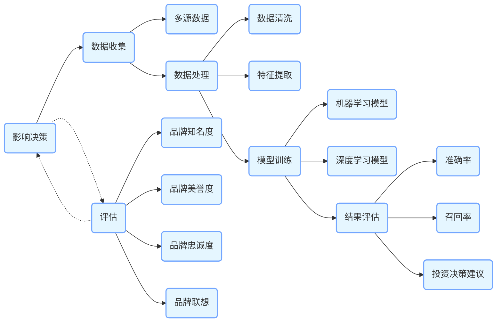

# 价值投资中的AI智能体品牌权益分析系统

> 关键词：价值投资、AI智能体、品牌权益分析、数据分析、投资决策

> 摘要：本文聚焦于价值投资领域，深入探讨AI智能体品牌权益分析系统。首先介绍系统开发的背景、目的、预期读者及文档结构，阐述相关术语。接着详细讲解核心概念，包括AI智能体、品牌权益的原理及联系，并给出相应的文本示意图和Mermaid流程图。通过Python代码阐述核心算法原理与操作步骤，运用数学模型和公式进行深入分析并举例说明。以实际项目为例，介绍开发环境搭建、源代码实现与解读。探讨系统在实际价值投资中的应用场景，推荐相关学习资源、开发工具框架及论文著作。最后总结系统未来发展趋势与挑战，解答常见问题，并提供扩展阅读与参考资料，旨在为价值投资领域提供一个全面且深入的AI智能体品牌权益分析解决方案。

## 1. 背景介绍 
### 1.1 目的和范围
在当今复杂多变的金融市场中，价值投资作为一种长期、稳健的投资策略，受到了众多投资者的青睐。而品牌权益作为企业无形资产的重要组成部分，对企业的长期价值和市场竞争力有着深远的影响。然而，传统的品牌权益分析方法往往依赖于人工经验和简单的统计分析，难以应对海量的数据和复杂的市场变化。因此，开发一个基于AI智能体的品牌权益分析系统具有重要的现实意义。

本系统的目的是利用人工智能技术，对企业的品牌权益进行全面、准确、实时的分析，为价值投资者提供科学、有效的投资决策依据。系统的范围涵盖了品牌权益的各个方面，包括品牌知名度、品牌美誉度、品牌忠诚度、品牌联想等，通过对多源数据的收集、处理和分析，挖掘品牌权益与企业价值之间的内在联系。

### 1.2 预期读者
本系统的预期读者主要包括以下几类人群：
1. **价值投资者**：希望通过深入了解企业的品牌权益，评估企业的长期投资价值，做出更加明智的投资决策。
2. **金融分析师**：需要借助先进的技术手段，对企业的品牌资产进行量化分析，为客户提供专业的投资建议。
3. **企业管理者**：关注企业品牌建设和品牌价值提升，希望通过系统了解品牌在市场中的表现，制定更加有效的品牌营销策略。
4. **科研人员**：对人工智能在金融领域的应用感兴趣，希望通过本系统的研究和开发，探索新的理论和方法。

### 1.3 文档结构概述
本文将按照以下结构展开：
1. **背景介绍**：阐述系统开发的目的、范围、预期读者和文档结构，介绍相关术语。
2. **核心概念与联系**：详细解释AI智能体、品牌权益等核心概念，分析它们之间的联系，并给出文本示意图和Mermaid流程图。
3. **核心算法原理 & 具体操作步骤**：运用Python代码讲解系统所采用的核心算法原理和具体操作步骤。
4. **数学模型和公式 & 详细讲解 & 举例说明**：建立数学模型，给出相关公式，并通过具体例子进行详细说明。
5. **项目实战：代码实际案例和详细解释说明**：以实际项目为例，介绍系统开发环境的搭建、源代码的实现和解读。
6. **实际应用场景**：探讨系统在价值投资中的实际应用场景。
7. **工具和资源推荐**：推荐相关的学习资源、开发工具框架和论文著作。
8. **总结：未来发展趋势与挑战**：总结系统的发展趋势和面临的挑战。
9. **附录：常见问题与解答**：解答读者在使用系统过程中可能遇到的常见问题。
10. **扩展阅读 & 参考资料**：提供相关的扩展阅读材料和参考资料。

### 1.4 术语表
#### 1.4.1 核心术语定义
1. **价值投资**：一种基于企业内在价值进行投资的策略，投资者通过分析企业的财务状况、行业前景、竞争优势等因素，寻找被低估的股票进行投资。
2. **AI智能体**：一种能够感知环境、自主决策并采取行动的智能程序，它可以根据预设的目标和规则，自动处理信息、学习和适应环境变化。
3. **品牌权益**：品牌所赋予企业的额外价值，它是品牌在消费者心目中的形象、声誉和认知的综合体现，包括品牌知名度、品牌美誉度、品牌忠诚度、品牌联想等方面。
4. **多源数据**：来自不同渠道、不同类型的数据，如社交媒体数据、新闻报道、财务报表、市场调研数据等。
5. **投资决策**：投资者根据对市场和企业的分析，做出是否投资、投资多少、投资何种资产等决策的过程。

#### 1.4.2 相关概念解释
1. **人工智能**：一门研究如何使计算机模拟人类智能的学科，包括机器学习、深度学习、自然语言处理、计算机视觉等技术。
2. **机器学习**：人工智能的一个分支，它通过让计算机从数据中学习模式和规律，自动改进性能，实现预测和决策。
3. **深度学习**：一种基于人工神经网络的机器学习方法，它可以自动从大量数据中学习复杂的特征和模式，在图像识别、语音识别、自然语言处理等领域取得了显著的成果。
4. **自然语言处理**：研究如何让计算机理解和处理人类语言的技术，包括文本分类、情感分析、命名实体识别等任务。
5. **数据挖掘**：从大量数据中发现有价值的信息和知识的过程，包括数据清洗、特征提取、模型选择、结果评估等步骤。

#### 1.4.3 缩略词列表
1. **AI**：Artificial Intelligence，人工智能
2. **ML**：Machine Learning，机器学习
3. **DL**：Deep Learning，深度学习
4. **NLP**：Natural Language Processing，自然语言处理
5. **API**：Application Programming Interface，应用程序编程接口

## 2. 核心概念与联系 
### 核心概念原理
#### AI智能体
AI智能体是一个具有自主性、反应性、社会性和适应性的智能实体。它可以通过传感器感知环境信息，运用内部的知识库和推理机制进行决策，并通过执行器采取相应的行动。在价值投资中的AI智能体品牌权益分析系统中，AI智能体的主要功能包括数据收集、数据处理、模型训练、结果评估和投资决策建议等。

AI智能体的工作原理基于人工智能的相关技术，如机器学习、深度学习和自然语言处理。它可以从多源数据中提取有价值的信息，构建品牌权益评估模型，预测品牌的未来发展趋势，并为投资者提供决策支持。

#### 品牌权益
品牌权益是品牌在消费者心目中的价值体现，它由多个维度构成，包括品牌知名度、品牌美誉度、品牌忠诚度和品牌联想等。品牌知名度反映了消费者对品牌的认知程度，品牌美誉度体现了消费者对品牌的好感和信任度，品牌忠诚度表示消费者对品牌的重复购买意愿，品牌联想则是消费者对品牌所产生的各种联想和印象。

品牌权益的评估需要综合考虑多个因素，如市场份额、消费者满意度、品牌形象、品牌传播等。通过对这些因素的分析，可以量化品牌的价值，为企业的品牌管理和投资决策提供依据。

### 核心概念联系
AI智能体与品牌权益之间存在着密切的联系。AI智能体可以通过对多源数据的分析，深入了解品牌在市场中的表现，评估品牌权益的大小。同时，AI智能体可以根据品牌权益的变化，实时调整投资策略，为投资者提供更加准确的决策建议。

另一方面，品牌权益的提升也可以为AI智能体提供更多的数据和信息，帮助AI智能体更好地学习和适应市场变化。例如，一个具有较高品牌知名度和美誉度的企业，往往会受到更多的媒体关注和消费者讨论，这些数据可以为AI智能体的分析和预测提供有力支持。

### 文本示意图
```plaintext
价值投资中的AI智能体品牌权益分析系统
|-- AI智能体
|   |-- 数据收集
|   |   |-- 多源数据（社交媒体、新闻、财务报表等）
|   |-- 数据处理
|   |   |-- 数据清洗
|   |   |-- 特征提取
|   |-- 模型训练
|   |   |-- 机器学习模型
|   |   |-- 深度学习模型
|   |-- 结果评估
|   |   |-- 准确率
|   |   |-- 召回率
|   |-- 投资决策建议
|-- 品牌权益
|   |-- 品牌知名度
|   |-- 品牌美誉度
|   |-- 品牌忠诚度
|   |-- 品牌联想
|-- 联系
|   |-- AI智能体评估品牌权益
|   |-- 品牌权益影响AI智能体决策
```

### Mermaid流程图


## 3. 核心算法原理 & 具体操作步骤 
### 核心算法原理
在价值投资中的AI智能体品牌权益分析系统中，主要采用了机器学习和深度学习算法来进行品牌权益的评估和预测。以下是几种常用的算法及其原理：

#### 逻辑回归
逻辑回归是一种常用的二分类算法，它通过对输入特征进行线性组合，然后使用逻辑函数将其映射到[0, 1]区间，得到样本属于正类的概率。在品牌权益分析中，可以使用逻辑回归来预测品牌是否具有较高的市场价值。

逻辑回归的数学模型可以表示为：
$$P(y = 1|x) = \frac{1}{1 + e^{-(w_0 + w_1x_1 + w_2x_2 + \cdots + w_nx_n)}}$$
其中，$P(y = 1|x)$ 表示样本 $x$ 属于正类的概率，$w_0, w_1, w_2, \cdots, w_n$ 是模型的参数，$x_1, x_2, \cdots, x_n$ 是样本的特征。

#### 决策树
决策树是一种基于树结构进行决策的算法，它通过对特征进行递归划分，将样本分为不同的类别。在品牌权益分析中，可以使用决策树来分析不同特征对品牌权益的影响程度。

决策树的构建过程可以分为以下几个步骤：
1. 选择一个特征作为根节点。
2. 根据该特征的取值将样本划分为不同的子集。
3. 对每个子集重复步骤1和2，直到满足停止条件。

#### 神经网络
神经网络是一种模仿人类神经系统的机器学习模型，它由多个神经元组成，可以自动学习数据中的复杂特征和模式。在品牌权益分析中，可以使用神经网络来构建品牌权益评估模型，提高预测的准确性。

神经网络的基本结构包括输入层、隐藏层和输出层。输入层接收样本的特征，隐藏层对输入特征进行非线性变换，输出层输出预测结果。

### 具体操作步骤
以下是使用Python实现逻辑回归算法进行品牌权益分析的具体操作步骤：

```python
import numpy as np
from sklearn.linear_model import LogisticRegression
from sklearn.model_selection import train_test_split
from sklearn.metrics import accuracy_score

# 生成示例数据
X = np.array([[1, 2], [2, 3], [3, 4], [4, 5], [5, 6], [6, 7]])
y = np.array([0, 0, 0, 1, 1, 1])

# 划分训练集和测试集
X_train, X_test, y_train, y_test = train_test_split(X, y, test_size=0.2, random_state=42)

# 创建逻辑回归模型
model = LogisticRegression()

# 训练模型
model.fit(X_train, y_train)

# 预测测试集
y_pred = model.predict(X_test)

# 计算准确率
accuracy = accuracy_score(y_test, y_pred)
print(f"Accuracy: {accuracy}")
```

### 代码解释
1. **数据生成**：使用 `numpy` 生成示例数据 `X` 和标签 `y`。
2. **数据划分**：使用 `train_test_split` 函数将数据划分为训练集和测试集。
3. **模型创建**：创建 `LogisticRegression` 模型。
4. **模型训练**：使用训练集数据对模型进行训练。
5. **模型预测**：使用训练好的模型对测试集数据进行预测。
6. **结果评估**：使用 `accuracy_score` 函数计算预测结果的准确率。

## 4. 数学模型和公式 & 详细讲解 & 举例说明 
### 数学模型和公式
#### 逻辑回归
逻辑回归的数学模型如前文所述：
$$P(y = 1|x) = \frac{1}{1 + e^{-(w_0 + w_1x_1 + w_2x_2 + \cdots + w_nx_n)}}$$
其中，$P(y = 1|x)$ 表示样本 $x$ 属于正类的概率，$w_0, w_1, w_2, \cdots, w_n$ 是模型的参数，$x_1, x_2, \cdots, x_n$ 是样本的特征。

逻辑回归的目标是通过最小化损失函数来估计模型的参数。常用的损失函数是对数损失函数：
$$L(w) = -\frac{1}{m}\sum_{i = 1}^{m}[y_i\log(P(y_i = 1|x_i)) + (1 - y_i)\log(1 - P(y_i = 1|x_i))]$$
其中，$m$ 是样本的数量，$y_i$ 是第 $i$ 个样本的真实标签。

#### 决策树
决策树的构建过程基于信息增益或基尼不纯度等指标。信息增益是指在划分数据集前后信息熵的减少量，它可以用来衡量特征的重要性。

信息熵的计算公式为：
$$H(D) = -\sum_{i = 1}^{k}p_i\log_2(p_i)$$
其中，$D$ 是数据集，$k$ 是类别数，$p_i$ 是第 $i$ 个类别的概率。

信息增益的计算公式为：
$$IG(D, A) = H(D) - \sum_{v = 1}^{V}\frac{|D^v|}{|D|}H(D^v)$$
其中，$A$ 是特征，$V$ 是特征 $A$ 的取值个数，$D^v$ 是根据特征 $A$ 的取值 $v$ 划分得到的子集。

#### 神经网络
神经网络的前向传播过程可以表示为：
$$z^{(l)} = W^{(l)}a^{(l - 1)} + b^{(l)}$$
$$a^{(l)} = f(z^{(l)})$$
其中，$z^{(l)}$ 是第 $l$ 层的加权输入，$W^{(l)}$ 是第 $l$ 层的权重矩阵，$a^{(l - 1)}$ 是第 $l - 1$ 层的输出，$b^{(l)}$ 是第 $l$ 层的偏置向量，$f$ 是激活函数。

神经网络的训练过程通常使用反向传播算法，通过计算损失函数对模型参数的梯度，然后使用梯度下降法更新参数。

### 详细讲解
#### 逻辑回归
逻辑回归通过对输入特征进行线性组合，然后使用逻辑函数将其映射到[0, 1]区间，得到样本属于正类的概率。对数损失函数的作用是衡量模型预测结果与真实标签之间的差异，通过最小化对数损失函数，可以使模型的预测结果更加准确。

#### 决策树
决策树通过对特征进行递归划分，将样本分为不同的类别。信息增益可以帮助我们选择最优的划分特征，使得划分后的子集更加纯净。在决策树的构建过程中，我们不断选择信息增益最大的特征进行划分，直到满足停止条件。

#### 神经网络
神经网络通过多个神经元的组合和非线性变换，可以自动学习数据中的复杂特征和模式。前向传播过程将输入数据逐层传递，得到最终的预测结果。反向传播算法通过计算损失函数对模型参数的梯度，然后使用梯度下降法更新参数，使得模型的损失函数不断减小。

### 举例说明
#### 逻辑回归
假设我们要预测一个品牌是否具有较高的市场价值，我们可以选择品牌知名度、品牌美誉度等特征作为输入。假设我们有以下样本数据：

| 品牌知名度 | 品牌美誉度 | 市场价值 |
| --- | --- | --- |
| 0.8 | 0.9 | 1 |
| 0.6 | 0.7 | 0 |
| 0.7 | 0.8 | 1 |

我们可以使用逻辑回归模型对这些数据进行训练，然后预测新的品牌是否具有较高的市场价值。

#### 决策树
假设我们要分析不同特征对品牌权益的影响程度，我们可以使用决策树模型。假设我们有以下特征：品牌知名度、品牌美誉度、品牌忠诚度和品牌联想。决策树可以帮助我们找到最重要的特征，并根据这些特征对品牌进行分类。

#### 神经网络
假设我们要构建一个品牌权益评估模型，我们可以使用神经网络。我们可以将品牌的各种特征作为输入，如品牌知名度、品牌美誉度、品牌忠诚度等，将品牌的市场价值作为输出。通过训练神经网络模型，我们可以得到一个准确的品牌权益评估模型。

## 5. 项目实战：代码实际案例和详细解释说明 
### 5.1  开发环境搭建
#### 操作系统
建议使用Windows、Linux或macOS操作系统。

#### Python环境
安装Python 3.6及以上版本，可以从Python官方网站（https://www.python.org/downloads/）下载并安装。

#### 开发工具
推荐使用Anaconda（https://www.anaconda.com/products/individual）来管理Python环境和安装相关库。

#### 安装必要的库
在命令行中使用以下命令安装必要的库：
```sh
pip install numpy pandas scikit-learn tensorflow keras
```

### 5.2  源代码详细实现和代码解读
以下是一个使用Python实现的基于神经网络的品牌权益分析系统的示例代码：

```python
import numpy as np
import pandas as pd
from sklearn.model_selection import train_test_split
from sklearn.preprocessing import StandardScaler
from tensorflow.keras.models import Sequential
from tensorflow.keras.layers import Dense

# 加载数据
data = pd.read_csv('brand_equity_data.csv')

# 分离特征和标签
X = data.drop('market_value', axis=1).values
y = data['market_value'].values

# 划分训练集和测试集
X_train, X_test, y_train, y_test = train_test_split(X, y, test_size=0.2, random_state=42)

# 数据标准化
scaler = StandardScaler()
X_train = scaler.fit_transform(X_train)
X_test = scaler.transform(X_test)

# 构建神经网络模型
model = Sequential()
model.add(Dense(64, activation='relu', input_shape=(X_train.shape[1],)))
model.add(Dense(32, activation='relu'))
model.add(Dense(1, activation='sigmoid'))

# 编译模型
model.compile(optimizer='adam', loss='binary_crossentropy', metrics=['accuracy'])

# 训练模型
model.fit(X_train, y_train, epochs=50, batch_size=32, validation_data=(X_test, y_test))

# 评估模型
_, accuracy = model.evaluate(X_test, y_test)
print(f"Accuracy: {accuracy}")
```

### 5.3  代码解读与分析
#### 数据加载
使用 `pandas` 库的 `read_csv` 函数加载品牌权益数据。

#### 特征和标签分离
使用 `drop` 方法分离特征和标签。

#### 数据划分
使用 `train_test_split` 函数将数据划分为训练集和测试集。

#### 数据标准化
使用 `StandardScaler` 对数据进行标准化处理，使得数据具有零均值和单位方差。

#### 模型构建
使用 `Sequential` 模型构建神经网络，添加多个全连接层，并使用 `relu` 和 `sigmoid` 作为激活函数。

#### 模型编译
使用 `adam` 优化器和 `binary_crossentropy` 损失函数编译模型。

#### 模型训练
使用 `fit` 方法对模型进行训练，指定训练的轮数和批次大小。

#### 模型评估
使用 `evaluate` 方法评估模型的准确率。

## 6. 实际应用场景 
### 投资决策支持
价值投资者可以使用AI智能体品牌权益分析系统来评估企业的品牌价值，从而做出更加明智的投资决策。系统可以通过对品牌知名度、美誉度、忠诚度等指标的分析，预测企业的未来发展趋势，为投资者提供投资建议。

### 企业品牌管理
企业管理者可以利用系统了解品牌在市场中的表现，发现品牌存在的问题和不足，及时调整品牌营销策略。系统可以对品牌传播效果、消费者反馈等进行实时监测，为企业的品牌建设提供数据支持。

### 市场竞争分析
系统可以对竞争对手的品牌权益进行分析，帮助企业了解市场竞争态势，制定差异化的竞争策略。通过比较不同品牌的优势和劣势，企业可以找到自身的定位，提高市场竞争力。

### 行业研究
研究机构和学者可以使用系统对整个行业的品牌权益进行研究，分析行业的发展趋势和规律。系统可以提供大量的数据和分析结果，为行业研究提供有力的支持。

## 7. 工具和资源推荐
### 7.1 学习资源推荐
#### 7.1.1 书籍推荐
1. 《Python机器学习》：全面介绍了Python在机器学习领域的应用，包括数据处理、模型选择、算法实现等方面。
2. 《深度学习》：由深度学习领域的三位先驱Ian Goodfellow、Yoshua Bengio和Aaron Courville撰写，是深度学习领域的经典教材。
3. 《人工智能：一种现代的方法》：涵盖了人工智能的各个方面，包括搜索算法、知识表示、机器学习、自然语言处理等。

#### 7.1.2 在线课程
1. Coursera上的《机器学习》课程：由Andrew Ng教授授课，是机器学习领域的经典课程。
2. edX上的《深度学习》课程：由深度学习领域的专家授课，介绍了深度学习的基本原理和应用。
3. Kaggle上的机器学习和数据分析教程：提供了丰富的实践项目和教程，适合初学者和有一定经验的开发者。

#### 7.1.3 技术博客和网站
1. Medium：一个技术博客平台，有很多关于人工智能、机器学习和数据分析的优质文章。
2. Towards Data Science：专注于数据科学和机器学习领域的博客，提供了很多实用的教程和案例。
3. AI开源社区：如GitHub、GitLab等，上面有很多开源的人工智能项目和代码。

### 7.2 开发工具框架推荐
#### 7.2.1 IDE和编辑器
1. PyCharm：一款专业的Python集成开发环境，提供了丰富的代码编辑、调试和测试功能。
2. Jupyter Notebook：一个交互式的开发环境，适合进行数据分析和模型训练。
3. Visual Studio Code：一款轻量级的代码编辑器，支持多种编程语言和插件。

#### 7.2.2 调试和性能分析工具
1. TensorBoard：TensorFlow的可视化工具，可以帮助开发者监控模型的训练过程和性能。
2. Py-Spy：一个Python性能分析工具，可以帮助开发者找出代码中的性能瓶颈。
3. Debugpy：Python的调试器，可以帮助开发者快速定位和解决代码中的问题。

#### 7.2.3 相关框架和库
1. TensorFlow：一个开源的机器学习框架，提供了丰富的工具和库，支持深度学习模型的开发和训练。
2. PyTorch：另一个流行的深度学习框架，具有动态图和易于使用的特点。
3. Scikit-learn：一个简单易用的机器学习库，提供了多种机器学习算法和工具。

### 7.3 相关论文著作推荐
#### 7.3.1 经典论文
1. 《Gradient-Based Learning Applied to Document Recognition》：介绍了卷积神经网络在手写字符识别中的应用，是深度学习领域的经典论文之一。
2. 《ImageNet Classification with Deep Convolutional Neural Networks》：提出了AlexNet模型，开启了深度学习在计算机视觉领域的革命。
3. 《Attention Is All You Need》：提出了Transformer模型，在自然语言处理领域取得了巨大的成功。

#### 7.3.2 最新研究成果
可以关注顶级学术会议如NeurIPS、ICML、CVPR等的论文，了解人工智能领域的最新研究成果。

#### 7.3.3 应用案例分析
可以阅读一些关于人工智能在金融、医疗、交通等领域的应用案例分析，了解实际应用中的问题和解决方案。

## 8. 总结：未来发展趋势与挑战
### 未来发展趋势
1. **多模态数据融合**：未来的AI智能体品牌权益分析系统将不仅仅依赖于文本数据，还将融合图像、音频、视频等多模态数据，以更全面地了解品牌的市场表现。
2. **强化学习的应用**：强化学习可以让AI智能体在动态环境中进行自主学习和决策，未来可以将强化学习应用于品牌权益分析系统，实现更加智能的投资决策。
3. **与区块链技术的结合**：区块链技术可以保证数据的安全性和不可篡改，未来可以将区块链技术与AI智能体品牌权益分析系统结合，提高数据的可信度和可靠性。
4. **个性化服务**：随着人工智能技术的发展，未来的系统将能够根据不同投资者的需求和偏好，提供个性化的品牌权益分析和投资决策建议。

### 挑战
1. **数据质量问题**：多源数据的质量参差不齐，存在噪声、缺失值等问题，如何有效地处理这些数据，提高数据的质量，是一个挑战。
2. **模型解释性**：深度学习模型通常是黑盒模型，难以解释其决策过程和结果，如何提高模型的解释性，让投资者更好地理解模型的预测结果，是一个重要的问题。
3. **隐私和安全问题**：品牌权益分析系统涉及到大量的企业和消费者数据，如何保护这些数据的隐私和安全，防止数据泄露和滥用，是一个严峻的挑战。
4. **人才短缺**：人工智能领域的人才短缺是一个普遍的问题，如何培养和吸引更多的专业人才，推动AI智能体品牌权益分析系统的发展，是一个亟待解决的问题。

## 9. 附录：常见问题与解答
### 1. 系统需要哪些数据？
系统需要多源数据，包括社交媒体数据、新闻报道、财务报表、市场调研数据等。这些数据可以帮助系统全面了解品牌的市场表现和消费者反馈。

### 2. 系统的预测准确率如何？
系统的预测准确率取决于多种因素，如数据质量、模型选择、特征工程等。通过不断优化数据和模型，可以提高系统的预测准确率。

### 3. 系统是否可以实时更新数据？
可以通过设置定时任务或使用实时数据接口，实现系统的数据实时更新，以保证系统的分析结果始终反映最新的市场情况。

### 4. 系统是否可以进行自定义分析？
系统支持一定程度的自定义分析，用户可以根据自己的需求选择不同的特征和模型，进行个性化的品牌权益分析。

### 5. 系统的安全性如何保障？
系统采用了多种安全措施，如数据加密、访问控制、防火墙等，以保障数据的安全性和隐私性。同时，系统还会定期进行安全审计和漏洞修复，确保系统的安全稳定运行。

## 10. 扩展阅读 & 参考资料
### 扩展阅读
1. 《金融科技：重构未来金融生态》：介绍了金融科技的发展趋势和应用场景，包括人工智能在金融领域的应用。
2. 《品牌管理：理论与实务》：全面介绍了品牌管理的理论和方法，包括品牌权益的评估和提升。
3. 《大数据时代：生活、工作与思维的大变革》：探讨了大数据时代的特点和影响，以及如何利用大数据进行决策和创新。

### 参考资料
1. 相关学术论文和研究报告，如IEEE、ACM等学术会议和期刊上的论文。
2. 行业报告和统计数据，如市场调研机构发布的报告和数据。
3. 开源项目和代码库，如GitHub上的相关项目。

作者：AI天才研究院/AI Genius Institute & 禅与计算机程序设计艺术 /Zen And The Art of Computer Programming