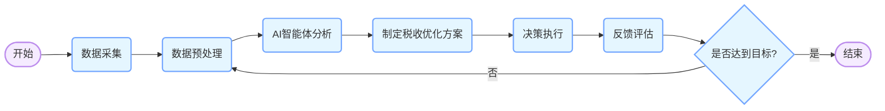

# 价值投资中的AI智能体税收优化系统

> 关键词：价值投资、AI智能体、税收优化系统、金融科技、机器学习

> 摘要：本文围绕价值投资中的AI智能体税收优化系统展开深入探讨。首先介绍了该系统产生的背景、目的、适用读者及文档结构，明确了相关术语。接着阐述了核心概念与联系，包括系统原理和架构。详细讲解了核心算法原理及具体操作步骤，并结合Python代码进行说明。给出了系统涉及的数学模型和公式，并举例分析。通过项目实战展示了系统的开发环境搭建、源代码实现及代码解读。探讨了系统在实际中的应用场景，推荐了学习、开发工具框架以及相关论文著作。最后总结了系统未来的发展趋势与挑战，解答了常见问题，并提供了扩展阅读和参考资料。旨在帮助读者全面了解和应用价值投资中的AI智能体税收优化系统。

## 1. 背景介绍 
### 1.1 目的和范围
在价值投资领域，投资者追求的是长期稳定的资产增值。然而，税收作为投资过程中的一项重要成本，会对投资收益产生显著影响。传统的税收规划方法往往依赖于人工经验和简单的规则，难以应对复杂多变的市场环境和税收政策。本系统的目的是开发一个基于AI智能体的税收优化系统，利用先进的人工智能技术，结合价值投资的理念，帮助投资者在合法合规的前提下，最大程度地降低税收负担，提高投资回报率。

本系统的范围涵盖了价值投资过程中的各类资产，包括股票、债券、基金等。系统将考虑不同国家和地区的税收政策，以及投资者的个人情况和投资目标，为投资者提供个性化的税收优化方案。

### 1.2 预期读者
本文的预期读者主要包括以下几类人群：
- **价值投资者**：希望通过优化税收来提高投资收益的个人和机构投资者。
- **金融科技从业者**：对人工智能在金融领域的应用感兴趣，特别是税收优化方面的开发者和研究人员。
- **税务顾问和财务规划师**：希望借助先进技术提升服务质量，为客户提供更专业的税收规划建议。
- **学术研究人员**：从事金融、人工智能等相关领域研究的学者和学生。

### 1.3 文档结构概述
本文将按照以下结构进行组织：
- **核心概念与联系**：介绍价值投资、AI智能体和税收优化系统的核心概念，以及它们之间的相互关系，并通过文本示意图和Mermaid流程图进行直观展示。
- **核心算法原理 & 具体操作步骤**：详细阐述系统所采用的核心算法原理，并用Python代码实现具体的操作步骤。
- **数学模型和公式 & 详细讲解 & 举例说明**：给出系统涉及的数学模型和公式，对其进行详细讲解，并通过实际例子进行说明。
- **项目实战：代码实际案例和详细解释说明**：通过一个具体的项目实战，展示系统的开发环境搭建、源代码实现和代码解读。
- **实际应用场景**：探讨系统在不同实际场景中的应用，如个人投资、机构投资等。
- **工具和资源推荐**：推荐学习、开发所需的工具和资源，包括书籍、在线课程、技术博客、IDE、调试工具、相关框架和库以及论文著作等。
- **总结：未来发展趋势与挑战**：总结系统的未来发展趋势，并分析可能面临的挑战。
- **附录：常见问题与解答**：解答读者可能关心的常见问题。
- **扩展阅读 & 参考资料**：提供相关的扩展阅读材料和参考资料。

### 1.4 术语表
#### 1.4.1 核心术语定义
- **价值投资**：一种投资策略，强调通过分析公司的基本面，如财务状况、盈利能力、竞争优势等，寻找被低估的资产，并长期持有以获得价值回归带来的收益。
- **AI智能体**：一种能够感知环境、自主决策并采取行动以实现特定目标的人工智能实体。在本系统中，AI智能体通过学习和分析市场数据、税收政策等信息，为投资者提供税收优化建议。
- **税收优化**：在合法合规的前提下，通过合理安排投资行为和税务筹划，降低税收负担，提高投资收益的过程。
- **投资组合**：投资者持有的一组不同资产的集合，旨在通过分散投资降低风险。

#### 1.4.2 相关概念解释
- **机器学习**：人工智能的一个分支，通过让计算机从数据中学习模式和规律，自动改进性能的技术。在本系统中，机器学习算法用于分析市场数据和税收政策，预测投资收益和税收情况。
- **深度学习**：机器学习的一个子领域，基于人工神经网络，能够处理复杂的非线性关系和大规模数据。本系统可能会使用深度学习算法来提高税收优化的准确性。
- **税务筹划**：纳税人在遵守税法的前提下，通过对经营、投资、理财等活动的事先筹划和安排，尽可能地减少纳税义务的行为。

#### 1.4.3 缩略词列表
- **AI**：Artificial Intelligence，人工智能
- **ML**：Machine Learning，机器学习
- **DL**：Deep Learning，深度学习
- **ROI**：Return on Investment，投资回报率

## 2. 核心概念与联系 

### 核心概念原理
#### 价值投资原理
价值投资的核心思想是寻找被市场低估的资产。投资者通过对公司的财务报表、行业前景、管理层能力等基本面因素进行深入分析，评估公司的内在价值。当股票价格低于其内在价值时，投资者认为该股票具有投资价值，会选择买入并长期持有，等待价值回归。例如，一家公司的每股收益稳定增长，资产负债表健康，但由于市场短期波动，其股价大幅下跌，此时价值投资者可能会认为该股票被低估，从而进行投资。

#### AI智能体原理
AI智能体是一种具有感知、决策和行动能力的实体。它通过传感器收集环境信息，如市场数据、税收政策等，然后利用内部的算法和模型进行分析和推理，做出决策，并通过执行器采取相应的行动。在本系统中，AI智能体的主要任务是根据投资者的投资组合和目标，结合税收政策，制定最优的税收优化方案。

#### 税收优化系统原理
税收优化系统的原理是在合法合规的前提下，通过对投资行为和税务筹划的合理安排，降低税收负担。系统会考虑多种因素，如投资资产的类型、持有期限、税收政策的变化等，通过分析和计算，找到最优的投资和税务处理方式。例如，对于长期投资的股票，某些国家和地区可能会给予税收优惠，系统会根据这一政策，建议投资者延长股票的持有期限，以享受税收优惠。

### 架构的文本示意图
本系统主要由以下几个部分组成：
- **数据采集模块**：负责收集市场数据、税收政策信息、投资者的投资组合等数据。
- **数据预处理模块**：对采集到的数据进行清洗、转换和特征提取，以便后续的分析和处理。
- **AI智能体模块**：利用机器学习和深度学习算法，对预处理后的数据进行分析和推理，制定税收优化方案。
- **决策执行模块**：根据AI智能体制定的方案，执行相应的投资和税务处理操作。
- **反馈评估模块**：对系统的运行效果进行评估和反馈，根据评估结果调整系统参数和优化方案。

### Mermaid流程图


## 3. 核心算法原理 & 具体操作步骤 

### 核心算法原理
本系统主要采用机器学习算法中的强化学习算法，如深度Q网络（Deep Q-Network，DQN）。强化学习是一种通过智能体与环境进行交互，不断学习最优策略的算法。在本系统中，AI智能体作为智能体，投资环境作为环境，税收优化目标作为奖励函数。

DQN的核心思想是通过一个深度神经网络来近似最优动作价值函数 $Q(s,a)$，其中 $s$ 表示环境状态，$a$ 表示动作。智能体在每个时间步根据当前状态 $s$ 选择一个动作 $a$，执行该动作后环境会转移到下一个状态 $s'$，并给予智能体一个奖励 $r$。智能体的目标是最大化长期累积奖励。

### 具体操作步骤及Python代码实现
以下是使用Python和PyTorch库实现一个简单的DQN算法的示例代码：

```python
import torch
import torch.nn as nn
import torch.optim as optim
import numpy as np
import random

# 定义DQN网络
class DQN(nn.Module):
    def __init__(self, input_dim, output_dim):
        super(DQN, self).__init__()
        self.fc1 = nn.Linear(input_dim, 64)
        self.fc2 = nn.Linear(64, 64)
        self.fc3 = nn.Linear(64, output_dim)

    def forward(self, x):
        x = torch.relu(self.fc1(x))
        x = torch.relu(self.fc2(x))
        return self.fc3(x)

# 定义DQN智能体
class DQNAgent:
    def __init__(self, input_dim, output_dim, learning_rate=0.001, gamma=0.99, epsilon=1.0, epsilon_decay=0.995, epsilon_min=0.01):
        self.input_dim = input_dim
        self.output_dim = output_dim
        self.learning_rate = learning_rate
        self.gamma = gamma
        self.epsilon = epsilon
        self.epsilon_decay = epsilon_decay
        self.epsilon_min = epsilon_min

        self.model = DQN(input_dim, output_dim)
        self.optimizer = optim.Adam(self.model.parameters(), lr=learning_rate)
        self.criterion = nn.MSELoss()

    def act(self, state):
        if np.random.rand() <= self.epsilon:
            return random.randrange(self.output_dim)
        state = torch.FloatTensor(state).unsqueeze(0)
        q_values = self.model(state)
        action = torch.argmax(q_values, dim=1).item()
        return action

    def train(self, state, action, reward, next_state, done):
        state = torch.FloatTensor(state).unsqueeze(0)
        next_state = torch.FloatTensor(next_state).unsqueeze(0)
        reward = torch.FloatTensor([reward])
        done = torch.FloatTensor([done])

        q_values = self.model(state)
        next_q_values = self.model(next_state)
        next_q_value = torch.max(next_q_values, dim=1)[0]

        target_q_value = q_values.clone()
        target_q_value[0][action] = reward + (1 - done) * self.gamma * next_q_value

        self.optimizer.zero_grad()
        loss = self.criterion(q_values, target_q_value)
        loss.backward()
        self.optimizer.step()

        if self.epsilon > self.epsilon_min:
            self.epsilon *= self.epsilon_decay

# 示例使用
input_dim = 10
output_dim = 5
agent = DQNAgent(input_dim, output_dim)

# 模拟环境交互
state = np.random.rand(input_dim)
action = agent.act(state)
next_state = np.random.rand(input_dim)
reward = 1.0
done = False
agent.train(state, action, reward, next_state, done)
```

### 代码解释
- **DQN类**：定义了一个简单的三层全连接神经网络，用于近似动作价值函数 $Q(s,a)$。
- **DQNAgent类**：实现了DQN智能体的主要功能，包括动作选择和训练。
    - `act` 方法：根据当前状态选择动作，以一定的概率进行随机探索，否则选择Q值最大的动作。
    - `train` 方法：根据当前状态、动作、奖励、下一个状态和是否结束的信息，更新神经网络的参数。
- **示例使用**：创建一个DQN智能体，并模拟一次环境交互，调用 `train` 方法进行训练。

## 4. 数学模型和公式 & 详细讲解 & 举例说明 

### 动作价值函数
动作价值函数 $Q(s,a)$ 表示在状态 $s$ 下采取动作 $a$ 后，智能体所能获得的长期累积奖励的期望值。其数学定义为：

$$Q(s,a) = \mathbb{E}\left[\sum_{t=0}^{\infty} \gamma^t r_{t+1} \mid s_0 = s, a_0 = a\right]$$

其中，$\gamma$ 是折扣因子，取值范围为 $[0,1]$，用于权衡当前奖励和未来奖励的重要性；$r_{t+1}$ 是在时间步 $t+1$ 时获得的奖励。

### 目标Q值
在DQN算法中，目标Q值 $y$ 的计算公式为：

$$y = r + \gamma \max_{a'} Q(s',a')$$

其中，$r$ 是当前奖励，$s'$ 是下一个状态，$a'$ 是下一个状态下的所有可能动作。

### 损失函数
DQN算法使用均方误差损失函数（MSE）来衡量预测Q值和目标Q值之间的差异，其公式为：

$$L(\theta) = \mathbb{E}\left[(y - Q(s,a;\theta))^2\right]$$

其中，$\theta$ 是神经网络的参数。

### 举例说明
假设一个简单的投资环境，状态 $s$ 表示投资组合的当前价值和市场的一些特征，动作 $a$ 表示买入、卖出或持有某种资产。奖励 $r$ 表示执行动作后投资组合的收益减去税收成本。

- 初始状态 $s_0$，智能体选择动作 $a_0$，执行动作后获得奖励 $r_1$，环境转移到下一个状态 $s_1$。
- 计算目标Q值：$y = r_1 + \gamma \max_{a'} Q(s_1,a')$
- 计算预测Q值：$Q(s_0,a_0;\theta)$
- 计算损失：$L(\theta) = (y - Q(s_0,a_0;\theta))^2$
- 使用梯度下降法更新神经网络的参数 $\theta$，以最小化损失函数。

## 5. 项目实战：代码实际案例和详细解释说明 

### 5.1  开发环境搭建
#### 安装Python
首先需要安装Python，建议使用Python 3.7及以上版本。可以从Python官方网站（https://www.python.org/downloads/）下载并安装。

#### 安装必要的库
使用pip命令安装所需的库，包括PyTorch、NumPy、Pandas等。

```bash
pip install torch numpy pandas
```

### 5.2  源代码详细实现和代码解读
以下是一个完整的项目实战代码示例，模拟了一个简单的价值投资税收优化场景：

```python
import torch
import torch.nn as nn
import torch.optim as optim
import numpy as np
import pandas as pd
import random

# 定义DQN网络
class DQN(nn.Module):
    def __init__(self, input_dim, output_dim):
        super(DQN, self).__init__()
        self.fc1 = nn.Linear(input_dim, 64)
        self.fc2 = nn.Linear(64, 64)
        self.fc3 = nn.Linear(64, output_dim)

    def forward(self, x):
        x = torch.relu(self.fc1(x))
        x = torch.relu(self.fc2(x))
        return self.fc3(x)

# 定义DQN智能体
class DQNAgent:
    def __init__(self, input_dim, output_dim, learning_rate=0.001, gamma=0.99, epsilon=1.0, epsilon_decay=0.995, epsilon_min=0.01):
        self.input_dim = input_dim
        self.output_dim = output_dim
        self.learning_rate = learning_rate
        self.gamma = gamma
        self.epsilon = epsilon
        self.epsilon_decay = epsilon_decay
        self.epsilon_min = epsilon_min

        self.model = DQN(input_dim, output_dim)
        self.optimizer = optim.Adam(self.model.parameters(), lr=learning_rate)
        self.criterion = nn.MSELoss()

    def act(self, state):
        if np.random.rand() <= self.epsilon:
            return random.randrange(self.output_dim)
        state = torch.FloatTensor(state).unsqueeze(0)
        q_values = self.model(state)
        action = torch.argmax(q_values, dim=1).item()
        return action

    def train(self, state, action, reward, next_state, done):
        state = torch.FloatTensor(state).unsqueeze(0)
        next_state = torch.FloatTensor(next_state).unsqueeze(0)
        reward = torch.FloatTensor([reward])
        done = torch.FloatTensor([done])

        q_values = self.model(state)
        next_q_values = self.model(next_state)
        next_q_value = torch.max(next_q_values, dim=1)[0]

        target_q_value = q_values.clone()
        target_q_value[0][action] = reward + (1 - done) * self.gamma * next_q_value

        self.optimizer.zero_grad()
        loss = self.criterion(q_values, target_q_value)
        loss.backward()
        self.optimizer.step()

        if self.epsilon > self.epsilon_min:
            self.epsilon *= self.epsilon_decay

# 模拟投资环境
class InvestmentEnv:
    def __init__(self, tax_rate=0.1):
        self.tax_rate = tax_rate
        self.portfolio_value = 10000
        self.market_value = 100
        self.state_dim = 2
        self.action_dim = 3  # 买入、卖出、持有

    def reset(self):
        self.portfolio_value = 10000
        self.market_value = 100
        return np.array([self.portfolio_value, self.market_value])

    def step(self, action):
        prev_portfolio_value = self.portfolio_value
        if action == 0:  # 买入
            self.portfolio_value -= self.market_value
        elif action == 1:  # 卖出
            profit = self.market_value - 100
            tax = profit * self.tax_rate
            self.portfolio_value += self.market_value - tax
        # 模拟市场波动
        self.market_value += random.randint(-10, 10)
        reward = self.portfolio_value - prev_portfolio_value
        done = False
        next_state = np.array([self.portfolio_value, self.market_value])
        return next_state, reward, done

# 训练智能体
input_dim = 2
output_dim = 3
agent = DQNAgent(input_dim, output_dim)
env = InvestmentEnv()

num_episodes = 1000
for episode in range(num_episodes):
    state = env.reset()
    total_reward = 0
    done = False
    while not done:
        action = agent.act(state)
        next_state, reward, done = env.step(action)
        agent.train(state, action, reward, next_state, done)
        state = next_state
        total_reward += reward
    print(f"Episode {episode}: Total Reward = {total_reward}")
```

### 5.3  代码解读与分析
- **DQN类和DQNAgent类**：与前面的示例代码相同，用于实现DQN网络和智能体。
- **InvestmentEnv类**：模拟了一个简单的投资环境，包括投资组合价值和市场价值。提供了 `reset` 方法用于重置环境，`step` 方法用于执行动作并返回下一个状态、奖励和是否结束的信息。
- **训练过程**：通过循环进行多个回合的训练，每个回合中智能体与环境进行交互，根据当前状态选择动作，执行动作后获得奖励和下一个状态，然后使用 `train` 方法更新智能体的参数。

通过不断训练，智能体可以学习到在不同状态下采取最优动作，以最大化长期累积奖励，从而实现税收优化的目标。

## 6. 实际应用场景 
### 个人投资
对于个人投资者来说，AI智能体税收优化系统可以帮助他们在进行股票、基金等投资时，合理安排投资行为，降低税收成本。例如，根据不同资产的持有期限和税收政策，系统可以建议投资者何时买入、卖出资产，以享受税收优惠。同时，系统还可以根据投资者的收入情况和家庭状况，提供个性化的税收筹划方案。

### 机构投资
机构投资者通常管理着大量的资产，税收成本对其投资收益的影响更为显著。AI智能体税收优化系统可以帮助机构投资者进行大规模的投资组合管理，优化资产配置，降低整体税收负担。例如，系统可以分析不同地区的税收政策，选择税收优惠较大的地区进行投资；还可以通过合理的资产转移和重组，实现税收优化。

### 税务顾问服务
税务顾问可以利用AI智能体税收优化系统为客户提供更专业、更精准的税收规划服务。系统可以快速分析客户的投资情况和税收状况，生成详细的税收优化报告和建议方案。税务顾问可以根据系统提供的信息，与客户进行沟通和协商，制定个性化的税收筹划方案，提高客户的满意度和服务质量。

## 7. 工具和资源推荐
### 7.1 学习资源推荐
#### 7.1.1 书籍推荐
- 《Python深度学习》（Francois Chollet著）：介绍了Python和深度学习的基础知识，以及如何使用Keras库进行深度学习模型的开发。
- 《强化学习：原理与Python实现》（智能系统实验室著）：详细讲解了强化学习的原理和算法，并提供了Python代码实现。
- 《价值投资：从格雷厄姆到巴菲特》（布鲁斯·格林沃尔德著）：介绍了价值投资的理论和方法，以及如何应用于实际投资中。

#### 7.1.2 在线课程
- Coursera上的“深度学习专项课程”：由Andrew Ng教授主讲，包括深度学习的基础知识、卷积神经网络、循环神经网络等内容。
- edX上的“强化学习基础”：介绍了强化学习的基本概念、算法和应用。
- Udemy上的“Python for Finance: Investment Fundamentals & Data Analytics”：讲解了如何使用Python进行金融数据分析和投资决策。

#### 7.1.3 技术博客和网站
- Medium：上面有很多关于人工智能、金融科技等领域的技术博客和文章。
- Towards Data Science：专注于数据科学和机器学习领域的技术分享和讨论。
- 金融界、东方财富网等：提供金融市场数据和投资分析报告。

### 7.2 开发工具框架推荐
#### 7.2.1 IDE和编辑器
- PyCharm：一款功能强大的Python集成开发环境，提供代码编辑、调试、版本控制等功能。
- Jupyter Notebook：交互式的开发环境，适合进行数据探索和模型开发。
- Visual Studio Code：轻量级的代码编辑器，支持多种编程语言和插件扩展。

#### 7.2.2 调试和性能分析工具
- PyTorch Profiler：用于分析PyTorch模型的性能瓶颈，帮助优化代码。
- TensorBoard：可视化工具，用于监控深度学习模型的训练过程和性能指标。
- cProfile：Python自带的性能分析工具，用于分析代码的执行时间和调用关系。

#### 7.2.3 相关框架和库
- PyTorch：开源的深度学习框架，提供了丰富的神经网络模型和优化算法。
- NumPy：用于科学计算的Python库，提供了高效的数组操作和数学函数。
- Pandas：用于数据处理和分析的Python库，提供了数据结构和数据分析工具。

### 7.3 相关论文著作推荐
#### 7.3.1 经典论文
- “Human-level control through deep reinforcement learning”（Volodymyr Mnih等著）：介绍了深度Q网络（DQN）算法，开启了深度学习与强化学习结合的先河。
- “Value Investing: The Use of Historical Financial Statement Information to Separate Winners from Losers”（Joseph D. Piotroski著）：研究了价值投资策略的有效性，提出了基于财务报表信息的选股方法。

#### 7.3.2 最新研究成果
- 关注顶级学术会议，如NeurIPS、ICML、AAAI等，这些会议上会发表人工智能和金融领域的最新研究成果。
- 查阅学术期刊，如Journal of Financial Economics、Review of Financial Studies等，了解金融领域的前沿研究。

#### 7.3.3 应用案例分析
- 一些金融科技公司的官方博客和报告中会分享他们在AI智能体税收优化系统方面的应用案例和经验。
- 研究机构和咨询公司发布的行业报告，也会包含相关的应用案例和分析。

## 8. 总结：未来发展趋势与挑战
### 未来发展趋势
- **智能化程度不断提高**：随着人工智能技术的不断发展，AI智能体税收优化系统的智能化程度将不断提高。系统将能够更准确地分析市场数据和税收政策，提供更个性化、更精准的税收优化方案。
- **与其他技术融合**：系统将与区块链、大数据、云计算等技术深度融合，实现数据的安全共享和高效处理。例如，利用区块链技术保证税收数据的真实性和不可篡改，利用大数据和云计算技术进行大规模的数据存储和分析。
- **应用场景不断拓展**：除了个人投资和机构投资领域，AI智能体税收优化系统还将应用于更多的场景，如企业财务管理、跨境投资等。系统将为不同行业和领域的用户提供定制化的税收优化服务。

### 挑战
- **数据质量和安全问题**：系统的性能和准确性依赖于大量的高质量数据。然而，数据的收集、清洗和存储过程中可能会存在数据质量问题，如数据缺失、错误等。同时，税收数据涉及用户的隐私和敏感信息，数据安全也是一个重要的挑战。
- **税收政策的复杂性**：不同国家和地区的税收政策复杂多变，系统需要及时更新和适应这些政策变化。此外，税收政策的解释和执行也存在一定的主观性，这给系统的开发和应用带来了一定的困难。
- **伦理和法律问题**：AI智能体税收优化系统的决策过程可能会受到算法偏见和伦理问题的影响。例如，系统可能会对某些群体或地区产生不公平的待遇。同时，系统的应用也需要遵守相关的法律法规，避免出现税务欺诈等违法行为。

## 9. 附录：常见问题与解答
### 问题1：AI智能体税收优化系统是否合法合规？
解答：系统的设计和开发遵循相关的法律法规，旨在帮助投资者在合法合规的前提下进行税收优化。系统会根据不同国家和地区的税收政策进行调整和优化，确保提供的方案符合法律要求。

### 问题2：系统的准确性如何保证？
解答：系统采用了先进的机器学习和深度学习算法，通过大量的数据训练和优化，提高了系统的准确性和性能。同时，系统会不断更新和学习最新的市场数据和税收政策，以保证提供的方案的准确性和有效性。

### 问题3：系统是否适用于所有类型的投资者？
解答：系统可以根据投资者的不同情况和需求，提供个性化的税收优化方案。无论是个人投资者还是机构投资者，无论是投资股票、债券还是基金等不同类型的资产，系统都可以提供相应的服务。

### 问题4：系统的使用成本高吗？
解答：系统的使用成本因不同的服务提供商和服务内容而异。一些系统可能会收取一定的使用费用，而另一些系统可能会提供免费的基础服务。投资者可以根据自己的需求和预算选择合适的系统。

## 10. 扩展阅读 & 参考资料
### 扩展阅读
- 《金融科技前沿：人工智能在金融领域的应用》
- 《税收筹划实战案例分析》
- 《投资组合理论与实践》

### 参考资料
- [Python官方文档](https://docs.python.org/3/)
- [PyTorch官方文档](https://pytorch.org/docs/stable/index.html)
- [NumPy官方文档](https://numpy.org/doc/stable/)
- [Pandas官方文档](https://pandas.pydata.org/docs/)

作者：AI天才研究院/AI Genius Institute & 禅与计算机程序设计艺术 /Zen And The Art of Computer Programming