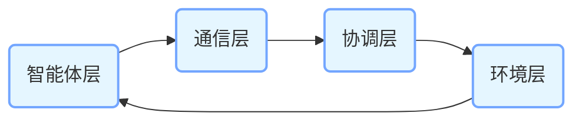

# 价值投资中的AI驱动供应链分析：多智能体系统的优势

> 关键词：价值投资、AI驱动、供应链分析、多智能体系统、优势

> 摘要：本文聚焦于价值投资领域中利用AI驱动进行供应链分析的方法，着重探讨多智能体系统在其中的优势。通过对核心概念、算法原理、数学模型等方面的详细阐述，结合实际案例展示了多智能体系统如何提升供应链分析的效率和准确性，进而为价值投资决策提供有力支持。同时，介绍了相关的工具和资源，分析了未来发展趋势与挑战，并对常见问题进行了解答。

## 1. 背景介绍 
### 1.1 目的和范围
在价值投资领域，准确评估企业的供应链状况对于判断其内在价值至关重要。传统的供应链分析方法往往依赖于人工经验和简单的数据分析，难以应对复杂多变的市场环境。随着人工智能技术的发展，利用AI驱动进行供应链分析成为一种新的趋势。本文章的目的在于深入探讨多智能体系统在价值投资的AI驱动供应链分析中的应用及其优势，范围涵盖核心概念、算法原理、实际案例等多个方面。

### 1.2 预期读者
本文预期读者包括价值投资领域的专业人士，如投资经理、分析师等，他们希望借助先进的技术手段提升供应链分析能力，为投资决策提供更科学的依据；同时也适合对人工智能和供应链管理交叉领域感兴趣的研究人员和技术开发者，帮助他们了解多智能体系统在该领域的应用场景和技术要点。

### 1.3 文档结构概述
本文将首先介绍相关的核心概念和它们之间的联系，包括价值投资、AI驱动供应链分析和多智能体系统的原理和架构；接着详细讲解核心算法原理和具体操作步骤，并给出相应的Python代码示例；然后介绍相关的数学模型和公式，并举例说明其应用；之后通过实际项目案例展示多智能体系统在供应链分析中的具体实现和效果；再探讨多智能体系统在价值投资供应链分析中的实际应用场景；推荐相关的学习资源、开发工具和论文著作；最后对未来发展趋势与挑战进行总结，并解答常见问题，同时提供扩展阅读和参考资料。

### 1.4 术语表
#### 1.4.1 核心术语定义
- **价值投资**：一种投资策略，通过对企业的基本面进行分析，寻找被低估的股票，以获取长期的投资回报。
- **AI驱动供应链分析**：利用人工智能技术，如机器学习、深度学习等，对供应链数据进行挖掘和分析，以发现潜在的风险和机会。
- **多智能体系统**：由多个自主智能体组成的系统，这些智能体可以相互通信、协作，共同完成一个或多个任务。

#### 1.4.2 相关概念解释
- **供应链**：围绕核心企业，通过对信息流、物流、资金流的控制，从采购原材料开始，制成中间产品以及最终产品，最后由销售网络把产品送到消费者手中的将供应商、制造商、分销商、零售商、直到最终用户连成一个整体的功能网链结构。
- **智能体**：具有自主决策能力的实体，能够感知环境并根据自身的目标和规则做出相应的行动。

#### 1.4.3 缩略词列表
- **AI**：Artificial Intelligence，人工智能
- **MAS**：Multi-Agent System，多智能体系统

## 2. 核心概念与联系 

### 2.1 价值投资的核心原理
价值投资的核心思想是基于企业的内在价值进行投资决策。内在价值是指企业未来现金流的现值，它受到企业的财务状况、市场竞争力、行业前景等多种因素的影响。投资者通过对这些因素的分析，评估企业的内在价值，并与当前的市场价格进行比较。如果市场价格低于内在价值，投资者认为该股票被低估，具有投资价值；反之，如果市场价格高于内在价值，则认为该股票被高估，不适合投资。

### 2.2 AI驱动供应链分析的原理
AI驱动的供应链分析通过收集和整合供应链中的各种数据，如采购数据、生产数据、物流数据等，利用人工智能算法对这些数据进行挖掘和分析。例如，机器学习算法可以用于预测供应链中的需求、识别潜在的风险因素；深度学习算法可以用于处理复杂的图像和文本数据，如产品质量检测、供应商评价等。通过这些分析，企业可以优化供应链的运作效率，降低成本，提高客户满意度。

### 2.3 多智能体系统的原理和架构
多智能体系统由多个智能体组成，每个智能体具有一定的自主性和智能性。智能体可以感知环境中的信息，并根据自身的目标和规则做出决策。智能体之间可以通过通信机制进行信息交换和协作，共同完成系统的任务。

多智能体系统的架构通常包括以下几个部分：
- **智能体层**：由多个智能体组成，每个智能体负责完成特定的任务。
- **通信层**：负责智能体之间的信息交换和通信。
- **协调层**：负责协调智能体之间的行动，避免冲突和重复工作。
- **环境层**：智能体所处的外部环境，包括供应链中的各种实体和数据。

下面是一个简单的多智能体系统架构的Mermaid流程图：


### 2.4 核心概念之间的联系
在价值投资中，供应链状况是影响企业内在价值的重要因素之一。通过AI驱动的供应链分析，可以更准确地评估企业的供应链风险和机会，从而为价值投资决策提供更有力的支持。而多智能体系统可以模拟供应链中各个实体的行为和交互，提高供应链分析的效率和准确性。例如，不同的智能体可以分别负责收集不同来源的供应链数据、进行数据分析和处理、与其他智能体进行协作等，从而实现对供应链的全面、深入分析。

## 3. 核心算法原理 & 具体操作步骤 

### 3.1 多智能体系统中的强化学习算法原理
在多智能体系统中，强化学习是一种常用的算法，用于智能体的决策和学习。强化学习的基本思想是智能体通过与环境进行交互，根据环境的反馈（奖励或惩罚）来调整自己的行为，以最大化长期的累积奖励。

在供应链分析中，每个智能体可以看作是一个决策者，负责在不同的供应链场景下做出最优的决策。例如，一个采购智能体可以根据市场价格、库存水平等因素决定是否采购原材料；一个物流智能体可以根据运输成本、交货时间等因素选择最优的运输路线。

下面是一个简单的强化学习算法（Q - learning）的Python代码示例：
```python
import numpy as np

# 定义环境
class SupplyChainEnv:
    def __init__(self):
        self.num_states = 10
        self.num_actions = 3
        self.current_state = np.random.randint(0, self.num_states)

    def step(self, action):
        # 简单的状态转移规则
        next_state = (self.current_state + action) % self.num_states
        # 简单的奖励规则
        reward = 1 if next_state % 2 == 0 else -1
        self.current_state = next_state
        return next_state, reward

# 定义Q - learning智能体
class QLearningAgent:
    def __init__(self, num_states, num_actions, learning_rate=0.1, discount_factor=0.9):
        self.num_states = num_states
        self.num_actions = num_actions
        self.learning_rate = learning_rate
        self.discount_factor = discount_factor
        self.q_table = np.zeros((num_states, num_actions))

    def choose_action(self, state):
        if np.random.uniform(0, 1) < 0.1:
            # 探索
            action = np.random.randint(0, self.num_actions)
        else:
            # 利用
            action = np.argmax(self.q_table[state, :])
        return action

    def update_q_table(self, state, action, reward, next_state):
        q_predict = self.q_table[state, action]
        q_target = reward + self.discount_factor * np.max(self.q_table[next_state, :])
        self.q_table[state, action] += self.learning_rate * (q_target - q_predict)

# 训练智能体
env = SupplyChainEnv()
agent = QLearningAgent(env.num_states, env.num_actions)

num_episodes = 1000
for episode in range(num_episodes):
    state = env.current_state
    total_reward = 0
    for _ in range(20):
        action = agent.choose_action(state)
        next_state, reward = env.step(action)
        agent.update_q_table(state, action, reward, next_state)
        state = next_state
        total_reward += reward
    if episode % 100 == 0:
        print(f"Episode {episode}: Total Reward = {total_reward}")
```

### 3.2 具体操作步骤
1. **定义智能体和环境**：首先需要定义多智能体系统中的各个智能体，以及它们所处的环境。智能体可以根据其功能进行分类，如采购智能体、生产智能体、物流智能体等；环境可以包括市场价格、库存水平、需求预测等信息。
2. **设计智能体的决策规则**：每个智能体需要根据自身的目标和环境信息做出决策。可以使用强化学习、规则引擎等方法来设计智能体的决策规则。
3. **建立智能体之间的通信和协作机制**：智能体之间需要进行信息交换和协作，以共同完成供应链分析的任务。可以使用消息传递、协商机制等方法来实现智能体之间的通信和协作。
4. **训练和优化智能体**：通过与环境进行交互，智能体可以不断学习和优化自己的决策规则。可以使用强化学习算法、遗传算法等方法来训练和优化智能体。
5. **进行供应链分析和决策**：在训练好智能体之后，可以使用多智能体系统对供应链进行分析和决策。智能体可以根据实时的环境信息做出最优的决策，从而提高供应链的效率和可靠性。

## 4. 数学模型和公式 & 详细讲解 & 举例说明 

### 4.1 强化学习中的Q - learning公式
在Q - learning算法中，智能体的目标是学习一个最优的动作价值函数 $Q(s, a)$，表示在状态 $s$ 下采取动作 $a$ 所能获得的最大长期累积奖励。Q - learning的更新公式如下：
$$Q(s_t, a_t) \leftarrow Q(s_t, a_t) + \alpha [r_{t+1} + \gamma \max_{a} Q(s_{t+1}, a) - Q(s_t, a_t)]$$
其中：
- $s_t$ 表示当前状态
- $a_t$ 表示当前动作
- $r_{t+1}$ 表示执行动作 $a_t$ 后获得的即时奖励
- $s_{t+1}$ 表示执行动作 $a_t$ 后转移到的下一个状态
- $\alpha$ 是学习率，控制每次更新的步长
- $\gamma$ 是折扣因子，用于衡量未来奖励的重要性

### 4.2 详细讲解
Q - learning算法的核心思想是通过不断地更新Q表，使得智能体能够逐渐学习到最优的动作价值函数。在每次与环境交互时，智能体根据当前的Q表选择一个动作，并执行该动作。环境会返回一个即时奖励和下一个状态。智能体根据这些信息更新Q表，使得Q表中的值更接近最优的动作价值。

### 4.3 举例说明
假设一个采购智能体处于状态 $s_t$，表示当前的库存水平为低。智能体可以选择三个动作：$a_1$ 表示采购少量原材料，$a_2$ 表示采购适量原材料，$a_3$ 表示采购大量原材料。智能体根据当前的Q表选择了动作 $a_2$，执行该动作后，环境返回即时奖励 $r_{t+1} = 10$，并转移到下一个状态 $s_{t+1}$，表示库存水平变为适中。

假设当前的Q表中 $Q(s_t, a_2) = 20$，学习率 $\alpha = 0.1$，折扣因子 $\gamma = 0.9$，且 $\max_{a} Q(s_{t+1}, a) = 30$。根据Q - learning更新公式，更新后的 $Q(s_t, a_2)$ 为：
$$Q(s_t, a_2) = 20 + 0.1 \times [10 + 0.9 \times 30 - 20] = 20 + 0.1 \times [10 + 27 - 20] = 20 + 0.1 \times 17 = 21.7$$

通过不断地与环境交互和更新Q表，智能体可以逐渐学习到在不同状态下采取最优动作的策略。

## 5. 项目实战：代码实际案例和详细解释说明 

### 5.1  开发环境搭建
为了实现一个基于多智能体系统的供应链分析项目，我们需要搭建以下开发环境：
- **操作系统**：推荐使用Linux或Windows操作系统。
- **编程语言**：Python，因为Python具有丰富的机器学习和人工智能库。
- **开发工具**：推荐使用Jupyter Notebook或PyCharm作为开发工具。
- **相关库**：需要安装NumPy、Pandas、Scikit - learn、TensorFlow等库。

可以使用以下命令安装相关库：
```bash
pip install numpy pandas scikit-learn tensorflow
```

### 5.2  源代码详细实现和代码解读
下面是一个更完整的基于多智能体系统的供应链分析项目的Python代码示例：
```python
import numpy as np
import pandas as pd
from collections import defaultdict

# 定义供应链环境
class SupplyChainEnv:
    def __init__(self, num_suppliers=3, num_customers=5):
        self.num_suppliers = num_suppliers
        self.num_customers = num_customers
        # 初始化供应商的库存和价格
        self.supplier_inventory = np.random.randint(10, 50, num_suppliers)
        self.supplier_prices = np.random.uniform(1, 10, num_suppliers)
        # 初始化客户的需求
        self.customer_demand = np.random.randint(5, 20, num_customers)

    def get_supplier_info(self):
        return self.supplier_inventory, self.supplier_prices

    def get_customer_demand(self):
        return self.customer_demand

    def update_supplier_inventory(self, supplier_index, quantity):
        if self.supplier_inventory[supplier_index] >= quantity:
            self.supplier_inventory[supplier_index] -= quantity
            return True
        return False

# 定义采购智能体
class ProcurementAgent:
    def __init__(self, env):
        self.env = env
        self.purchase_history = defaultdict(list)

    def make_purchase_decision(self):
        supplier_inventory, supplier_prices = self.env.get_supplier_info()
        customer_demand = self.env.get_customer_demand()
        total_demand = sum(customer_demand)
        purchase_plan = []
        for i in range(self.env.num_suppliers):
            if supplier_inventory[i] > 0:
                quantity = min(supplier_inventory[i], total_demand)
                if self.env.update_supplier_inventory(i, quantity):
                    purchase_plan.append((i, quantity))
                    total_demand -= quantity
        self.purchase_history[tuple(supplier_inventory)].append(purchase_plan)
        return purchase_plan

# 主程序
if __name__ == "__main__":
    env = SupplyChainEnv()
    agent = ProcurementAgent(env)
    num_steps = 10
    for step in range(num_steps):
        purchase_plan = agent.make_purchase_decision()
        print(f"Step {step}: Purchase Plan = {purchase_plan}")
```

### 5.3  代码解读与分析
- **SupplyChainEnv类**：表示供应链环境，包含供应商的库存和价格信息，以及客户的需求信息。`get_supplier_info` 方法用于获取供应商的库存和价格；`get_customer_demand` 方法用于获取客户的需求；`update_supplier_inventory` 方法用于更新供应商的库存。
- **ProcurementAgent类**：表示采购智能体，负责根据供应商的库存和客户的需求做出采购决策。`make_purchase_decision` 方法实现了采购决策的逻辑，根据供应商的库存和客户的总需求，尽可能多地从供应商处采购原材料。
- **主程序**：创建了一个供应链环境和一个采购智能体，并模拟了10个时间步的采购决策过程。在每个时间步，采购智能体根据当前的环境信息做出采购决策，并打印出采购计划。

通过这个项目案例，我们可以看到多智能体系统如何在供应链分析中发挥作用。采购智能体可以根据实时的环境信息做出最优的采购决策，从而优化供应链的运作效率。

## 6. 实际应用场景 
### 6.1 供应商评估与选择
在价值投资中，评估企业的供应商质量对于判断企业的供应链稳定性至关重要。多智能体系统可以模拟供应商的行为和决策过程，对供应商的交货时间、产品质量、价格等因素进行综合评估。例如，一个评估智能体可以收集供应商的历史数据，另一个分析智能体可以根据这些数据计算供应商的综合得分，从而帮助投资者选择最优质的供应商。

### 6.2 库存管理
合理的库存管理可以降低企业的成本，提高资金周转率。多智能体系统可以根据市场需求预测、供应商交货时间等因素，动态调整库存水平。例如，一个库存管理智能体可以根据销售数据预测未来的需求，另一个采购智能体可以根据库存水平和需求预测决定是否采购原材料，从而实现库存的最优管理。

### 6.3 物流优化
物流成本是供应链成本的重要组成部分。多智能体系统可以模拟物流网络中的各个节点和运输路径，优化物流方案。例如，一个物流规划智能体可以根据货物的重量、体积、运输距离等因素，选择最优的运输方式和路线；另一个调度智能体可以协调不同运输工具的运输时间，提高物流效率。

### 6.4 风险管理
供应链中存在着各种风险，如供应商违约、自然灾害等。多智能体系统可以实时监测供应链中的风险因素，并采取相应的措施进行应对。例如，一个风险监测智能体可以收集市场信息、天气数据等，另一个决策智能体可以根据风险评估结果制定应急预案，降低风险对供应链的影响。

## 7. 工具和资源推荐
### 7.1 学习资源推荐
#### 7.1.1 书籍推荐
- 《人工智能：一种现代的方法》：全面介绍了人工智能的基本概念、算法和应用，是人工智能领域的经典教材。
- 《供应链管理：战略、规划与运营》：系统阐述了供应链管理的理论和方法，对于理解供应链分析有很大帮助。
- 《强化学习：原理与Python实现》：详细讲解了强化学习的算法原理和Python实现，适合学习多智能体系统中的强化学习算法。

#### 7.1.2 在线课程
- Coursera上的“人工智能基础”课程：由知名教授授课，涵盖了人工智能的基本概念和算法。
- edX上的“供应链管理”课程：提供了供应链管理的系统知识和实践案例。
- Udemy上的“强化学习实战”课程：通过实际项目案例，帮助学员掌握强化学习的应用。

#### 7.1.3 技术博客和网站
- Medium：有很多关于人工智能和供应链管理的技术博客文章，提供了最新的技术动态和实践经验。
- Towards Data Science：专注于数据科学和人工智能领域，有很多高质量的技术文章和教程。
- Supply Chain Dive：专门提供供应链管理的新闻和分析，有助于了解供应链行业的最新趋势。

### 7.2 开发工具框架推荐
#### 7.2.1 IDE和编辑器
- PyCharm：功能强大的Python集成开发环境，提供了代码编辑、调试、版本控制等功能。
- Jupyter Notebook：交互式的开发环境，适合进行数据探索和模型实验。

#### 7.2.2 调试和性能分析工具
- TensorBoard：用于可视化深度学习模型的训练过程和性能指标。
- Py-Spy：可以对Python程序进行性能分析，找出性能瓶颈。

#### 7.2.3 相关框架和库
- NumPy：用于科学计算和数值处理。
- Pandas：用于数据处理和分析。
- Scikit - learn：提供了丰富的机器学习算法和工具。
- TensorFlow：开源的深度学习框架，支持多智能体系统的开发。

### 7.3 相关论文著作推荐
#### 7.3.1 经典论文
- “Multi - Agent Systems: A Modern Approach to Distributed Artificial Intelligence”：系统介绍了多智能体系统的理论和方法，是多智能体系统领域的经典论文。
- “Supply Chain Management: A Strategic Perspective”：从战略角度探讨了供应链管理的重要性和方法。

#### 7.3.2 最新研究成果
- 定期关注ACM SIGKDD、IEEE Transactions on Systems, Man, and Cybernetics等顶级学术会议和期刊，了解多智能体系统在供应链分析领域的最新研究成果。

#### 7.3.3 应用案例分析
- 一些商业咨询公司的报告，如麦肯锡、波士顿咨询集团等，会发布关于供应链管理和价值投资的应用案例分析，具有很高的参考价值。

## 8. 总结：未来发展趋势与挑战
### 8.1 未来发展趋势
- **与区块链技术的融合**：区块链技术可以提供供应链数据的不可篡改和可追溯性，与多智能体系统相结合，可以进一步提高供应链分析的准确性和可靠性。例如，智能体可以通过区块链获取真实可靠的供应链数据，从而做出更科学的决策。
- **强化学习算法的优化**：随着强化学习算法的不断发展，多智能体系统中的智能体可以学习到更复杂的决策策略，提高供应链分析的效率和效果。例如，采用深度强化学习算法可以处理更复杂的供应链环境和任务。
- **跨领域应用的拓展**：多智能体系统在价值投资的供应链分析中的应用可以拓展到其他领域，如医疗供应链、能源供应链等。通过借鉴不同领域的经验和数据，可以进一步提升多智能体系统的性能和应用范围。

### 8.2 挑战
- **数据质量和隐私问题**：多智能体系统需要大量的供应链数据来进行训练和决策，但数据的质量和隐私问题是一个挑战。不准确或不完整的数据可能会导致智能体做出错误的决策，而数据隐私问题可能会影响企业之间的合作和数据共享。
- **智能体之间的协作和协调**：在多智能体系统中，智能体之间的协作和协调是一个复杂的问题。不同智能体的目标和利益可能存在冲突，需要设计有效的协调机制来确保系统的整体性能。
- **算法的可解释性**：一些复杂的人工智能算法，如深度学习算法，具有较高的性能，但缺乏可解释性。在价值投资的供应链分析中，投资者需要了解算法的决策过程和依据，因此提高算法的可解释性是一个重要的挑战。

## 9. 附录：常见问题与解答
### 9.1 多智能体系统在供应链分析中的应用是否需要大量的计算资源？
多智能体系统的计算复杂度取决于系统的规模和智能体的数量。一般来说，随着系统规模的增大，计算资源的需求也会增加。但可以通过优化算法、采用分布式计算等方法来降低计算资源的需求。

### 9.2 如何评估多智能体系统在供应链分析中的性能？
可以从多个方面评估多智能体系统的性能，如供应链的效率、成本降低、风险控制等。可以通过模拟实验、实际案例分析等方法，比较多智能体系统与传统方法的性能差异。

### 9.3 多智能体系统中的智能体如何进行学习和更新？
智能体可以通过强化学习、监督学习等方法进行学习和更新。在强化学习中，智能体根据环境的反馈（奖励或惩罚）来调整自己的行为；在监督学习中，智能体根据标注好的数据进行训练。

## 10. 扩展阅读 & 参考资料
- Russell, S. J., & Norvig, P. (2010). Artificial Intelligence: A Modern Approach. Prentice Hall.
- Chopra, S., & Meindl, P. (2016). Supply Chain Management: Strategy, Planning, and Operation. Pearson.
- Sutton, R. S., & Barto, A. G. (2018). Reinforcement Learning: An Introduction. MIT Press.

作者：AI天才研究院/AI Genius Institute & 禅与计算机程序设计艺术 /Zen And The Art of Computer Programming