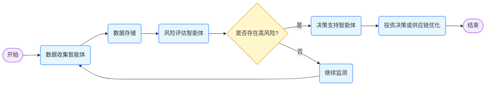

# 价值投资中的AI驱动供应链韧性评估：多智能体协作

> 关键词：价值投资、AI、供应链韧性评估、多智能体协作、风险管理

> 摘要：本文聚焦于价值投资领域中借助AI驱动的供应链韧性评估，深入探讨多智能体协作的原理、算法、数学模型等内容。通过详细阐述核心概念、算法实现步骤，结合项目实战案例进行分析，介绍了实际应用场景、相关工具和资源。旨在为价值投资者提供科学有效的供应链韧性评估方法，助力其在复杂多变的市场环境中做出更合理的投资决策，同时也为该领域的研究和实践发展提供有价值的参考，展望了未来发展趋势与挑战，解答常见问题并给出扩展阅读与参考资料。

## 1. 背景介绍 
### 1.1 目的和范围
在当今全球化的经济环境下，供应链的稳定性和韧性对于企业的生存和发展至关重要。价值投资者越来越关注被投资企业的供应链状况，因为供应链的脆弱性可能导致企业面临各种风险，从而影响其长期价值。本研究的目的在于开发一种基于AI的供应链韧性评估方法，利用多智能体协作的方式，全面、准确地评估供应链的韧性，为价值投资者提供科学的决策依据。

本研究的范围涵盖了供应链韧性评估的各个方面，包括核心概念的定义、算法的设计与实现、数学模型的构建、实际应用案例的分析等。同时，还涉及到相关工具和资源的推荐，以及对未来发展趋势和挑战的探讨。

### 1.2 预期读者
本文的预期读者主要包括价值投资者、供应链管理专业人员、AI研究人员、相关领域的学者以及对供应链韧性评估感兴趣的技术爱好者。对于价值投资者而言，本文提供的方法和工具可以帮助他们更好地评估被投资企业的供应链风险，从而做出更明智的投资决策；对于供应链管理专业人员来说，有助于他们深入理解供应链韧性的评估方法，优化供应链管理策略；对于AI研究人员和学者，本文的研究成果可以为他们在相关领域的研究提供新的思路和方向；对于技术爱好者，能帮助他们了解该领域的前沿技术和发展动态。

### 1.3 文档结构概述
本文将按照以下结构进行组织：首先介绍背景信息，包括目的、预期读者和文档结构概述；接着阐述核心概念与联系，包括相关概念的定义和它们之间的关系，并通过文本示意图和Mermaid流程图进行展示；然后详细讲解核心算法原理和具体操作步骤，使用Python源代码进行阐述；之后介绍数学模型和公式，并进行详细讲解和举例说明；再通过项目实战案例，介绍开发环境搭建、源代码实现和代码解读；随后探讨实际应用场景；接着推荐相关的工具和资源；再总结未来发展趋势与挑战；最后在附录中解答常见问题，并提供扩展阅读和参考资料。

### 1.4 术语表
#### 1.4.1 核心术语定义
- **价值投资**：一种投资策略，投资者通过分析企业的内在价值，寻找被低估的股票或其他资产进行投资，以获取长期的资本增值。
- **AI（人工智能）**：研究如何使计算机系统能够模拟人类智能的学科，包括机器学习、深度学习、自然语言处理等多个领域。
- **供应链韧性**：供应链在面对各种内外部干扰（如自然灾害、市场波动、供应商破产等）时，能够快速恢复并保持正常运作的能力。
- **多智能体协作**：多个智能体（具有一定智能和自主决策能力的实体）通过相互通信和协作，共同完成一个或多个任务的过程。

#### 1.4.2 相关概念解释
- **风险管理**：识别、评估和应对各种风险的过程，旨在降低风险对企业或项目的影响。在供应链韧性评估中，风险管理是一个重要的环节，通过对供应链风险的评估和分析，采取相应的措施来提高供应链的韧性。
- **智能体**：具有感知、决策和行动能力的实体，可以是软件程序、机器人等。在多智能体协作中，每个智能体都有自己的目标和任务，通过与其他智能体的交互来实现共同的目标。

#### 1.4.3 缩略词列表
- **AI**：Artificial Intelligence（人工智能）
- **ML**：Machine Learning（机器学习）
- **DL**：Deep Learning（深度学习）

## 2. 核心概念与联系 
### 核心概念原理
价值投资关注的是企业的长期价值，而供应链的韧性是影响企业长期价值的重要因素之一。一个具有高韧性的供应链能够更好地应对各种风险，保证企业的生产和运营不受太大影响，从而提高企业的竞争力和盈利能力。

AI在供应链韧性评估中起着关键作用。通过机器学习、深度学习等技术，AI可以对大量的供应链数据进行分析和挖掘，识别出潜在的风险因素，并预测供应链在不同情况下的表现。

多智能体协作则是一种有效的实现方式。每个智能体可以负责不同的任务，如数据收集、风险评估、决策制定等。通过智能体之间的协作，可以充分发挥各自的优势，提高评估的准确性和效率。

### 架构的文本示意图
价值投资中的AI驱动供应链韧性评估多智能体协作架构主要包括以下几个部分：
1. **数据层**：收集各种与供应链相关的数据，包括供应商信息、物流信息、市场数据等。
2. **智能体层**：包含多个智能体，如数据收集智能体、风险评估智能体、决策支持智能体等。每个智能体负责不同的任务，并通过通信机制进行协作。
3. **AI模型层**：利用机器学习、深度学习等算法对收集到的数据进行分析和处理，为智能体提供决策依据。
4. **决策层**：根据智能体的评估结果和建议，做出投资决策或供应链优化决策。

### Mermaid流程图


## 3. 核心算法原理 & 具体操作步骤 
### 核心算法原理
在价值投资中的AI驱动供应链韧性评估中，主要涉及到机器学习和多智能体协作算法。

#### 机器学习算法
可以使用分类算法（如逻辑回归、决策树、随机森林等）对供应链的风险进行分类，判断供应链是否处于高风险状态。也可以使用回归算法（如线性回归、神经网络等）预测供应链的某些指标（如交货时间、成本等），从而评估供应链的韧性。

#### 多智能体协作算法
多智能体协作算法主要包括智能体的通信协议、协调机制和决策算法。智能体之间通过通信协议进行信息交换，协调机制用于解决智能体之间的冲突和协调任务分配，决策算法则根据智能体的目标和环境信息做出决策。

### 具体操作步骤
#### 步骤1：数据收集
使用数据收集智能体收集各种与供应链相关的数据，包括供应商信息（如信誉评级、交货能力等）、物流信息（如运输时间、运输成本等）、市场数据（如需求波动、价格变化等）。

#### 步骤2：数据预处理
对收集到的数据进行清洗、归一化等预处理操作，以提高数据的质量和可用性。

```python
import pandas as pd
from sklearn.preprocessing import StandardScaler

# 读取数据
data = pd.read_csv('supply_chain_data.csv')

# 清洗数据，去除缺失值
data = data.dropna()

# 提取特征和标签
X = data.drop('risk_label', axis=1)
y = data['risk_label']

# 数据归一化
scaler = StandardScaler()
X_scaled = scaler.fit_transform(X)
```

#### 步骤3：模型训练
使用预处理后的数据训练机器学习模型，如逻辑回归模型。

```python
from sklearn.linear_model import LogisticRegression
from sklearn.model_selection import train_test_split

# 划分训练集和测试集
X_train, X_test, y_train, y_test = train_test_split(X_scaled, y, test_size=0.2, random_state=42)

# 训练逻辑回归模型
model = LogisticRegression()
model.fit(X_train, y_train)
```

#### 步骤4：风险评估
使用训练好的模型对供应链的风险进行评估，风险评估智能体根据模型的预测结果判断供应链是否处于高风险状态。

```python
# 预测风险
y_pred = model.predict(X_test)
```

#### 步骤5：决策支持
如果风险评估智能体判断供应链处于高风险状态，决策支持智能体根据评估结果和预设的规则提供决策建议，如调整供应商、优化物流方案等。

#### 步骤6：持续监测
智能体持续收集数据，对供应链的风险进行实时监测，根据监测结果及时调整决策。

## 4. 数学模型和公式 & 详细讲解 & 举例说明 
### 数学模型
在供应链韧性评估中，可以使用概率模型来描述供应链的风险。假设供应链的风险事件 $E$ 发生的概率为 $P(E)$，事件 $E$ 对供应链造成的损失为 $L(E)$，则供应链的风险值 $R$ 可以表示为：

$$R = \sum_{i=1}^{n} P(E_i) \times L(E_i)$$

其中，$n$ 为风险事件的数量。

### 详细讲解
- **概率 $P(E)$**：表示风险事件 $E$ 发生的可能性大小。可以通过历史数据统计、专家评估等方法来确定。例如，根据过去的记录，某供应商延迟交货的概率为 0.1。
- **损失 $L(E)$**：表示风险事件 $E$ 发生时对供应链造成的损失。损失可以用货币、时间等单位来衡量。例如，供应商延迟交货一天，可能导致企业的生产损失 1000 元。

### 举例说明
假设一个供应链面临两个风险事件：供应商 A 延迟交货（事件 $E_1$）和市场需求突然下降（事件 $E_2$）。已知 $P(E_1) = 0.2$，$L(E_1) = 5000$ 元；$P(E_2) = 0.1$，$L(E_2) = 8000$ 元。则该供应链的风险值为：

$$R = P(E_1) \times L(E_1) + P(E_2) \times L(E_2) = 0.2 \times 5000 + 0.1 \times 8000 = 1000 + 800 = 1800$$（元）

通过计算风险值，可以对供应链的风险进行量化评估，从而为投资决策和供应链优化提供依据。

## 5. 项目实战：代码实际案例和详细解释说明 
### 5.1  开发环境搭建
#### 操作系统
可以选择 Windows、Linux 或 macOS 等操作系统。

#### 编程语言
使用 Python 作为开发语言，因为 Python 具有丰富的机器学习和数据处理库。

#### 开发工具
推荐使用 PyCharm 作为集成开发环境（IDE），它提供了丰富的代码编辑、调试和管理功能。

#### 相关库安装
在命令行中使用以下命令安装所需的库：
```sh
pip install pandas scikit-learn numpy matplotlib
```

### 5.2  源代码详细实现和代码解读
```python
import pandas as pd
from sklearn.preprocessing import StandardScaler
from sklearn.linear_model import LogisticRegression
from sklearn.model_selection import train_test_split
from sklearn.metrics import accuracy_score

# 步骤1：数据收集
# 假设数据存储在 CSV 文件中
data = pd.read_csv('supply_chain_data.csv')

# 步骤2：数据预处理
# 去除缺失值
data = data.dropna()

# 提取特征和标签
X = data.drop('risk_label', axis=1)
y = data['risk_label']

# 数据归一化
scaler = StandardScaler()
X_scaled = scaler.fit_transform(X)

# 步骤3：模型训练
# 划分训练集和测试集
X_train, X_test, y_train, y_test = train_test_split(X_scaled, y, test_size=0.2, random_state=42)

# 训练逻辑回归模型
model = LogisticRegression()
model.fit(X_train, y_train)

# 步骤4：风险评估
# 预测风险
y_pred = model.predict(X_test)

# 步骤5：模型评估
# 计算准确率
accuracy = accuracy_score(y_test, y_pred)
print(f"模型准确率: {accuracy}")
```

### 5.3  代码解读与分析
- **数据收集**：使用 `pandas` 库的 `read_csv` 函数从 CSV 文件中读取供应链数据。
- **数据预处理**：使用 `dropna` 函数去除数据中的缺失值，然后使用 `StandardScaler` 对数据进行归一化处理，以提高模型的训练效果。
- **模型训练**：使用 `train_test_split` 函数将数据划分为训练集和测试集，然后使用 `LogisticRegression` 模型进行训练。
- **风险评估**：使用训练好的模型对测试集进行预测，得到预测结果。
- **模型评估**：使用 `accuracy_score` 函数计算模型的准确率，评估模型的性能。

## 6. 实际应用场景 
### 价值投资决策
价值投资者在选择投资对象时，可以使用 AI 驱动的供应链韧性评估方法，评估被投资企业的供应链风险。如果企业的供应链具有较高的韧性，能够更好地应对各种风险，那么该企业的长期价值更有可能得到保障，投资者可以考虑增加对该企业的投资。

### 供应链优化
企业可以利用该评估方法识别供应链中的薄弱环节，采取相应的措施进行优化。例如，如果发现某个供应商的交货能力不稳定，可以考虑寻找替代供应商；如果物流运输时间过长，可以优化物流方案，提高运输效率。

### 风险管理
在风险管理方面，通过实时监测供应链的风险，企业可以提前采取措施应对潜在的风险。例如，当预测到市场需求可能下降时，企业可以调整生产计划，减少库存积压。

## 7. 工具和资源推荐
### 7.1 学习资源推荐
#### 7.1.1 书籍推荐
- 《机器学习》（周志华著）：全面介绍了机器学习的基本概念、算法和应用，是学习机器学习的经典教材。
- 《Python 数据分析实战》（韦斯·麦金尼著）：详细介绍了使用 Python 进行数据分析的方法和技巧，包括数据处理、可视化等内容。
- 《供应链管理：战略、规划与运营》（苏尼尔·乔普拉、彼得·迈因德尔著）：系统地阐述了供应链管理的理论和实践，对于理解供应链韧性评估有很大帮助。

#### 7.1.2 在线课程
- Coursera 上的“机器学习”课程（由吴恩达教授授课）：该课程全面介绍了机器学习的基本概念和算法，通过实际案例和编程练习帮助学员掌握机器学习的应用。
- edX 上的“供应链管理基础”课程：介绍了供应链管理的基本原理和方法，包括供应链设计、采购、物流等方面的内容。

#### 7.1.3 技术博客和网站
- Medium：上面有很多关于 AI、供应链管理等领域的技术文章和案例分享。
- 知乎：有很多专业人士在上面分享关于供应链韧性评估、价值投资等方面的经验和见解。

### 7.2 开发工具框架推荐
#### 7.2.1 IDE和编辑器
- PyCharm：功能强大的 Python 集成开发环境，提供了代码编辑、调试、版本控制等功能。
- Jupyter Notebook：交互式的开发环境，适合进行数据探索和模型实验。

#### 7.2.2 调试和性能分析工具
- PDB：Python 自带的调试工具，可以帮助开发者定位和解决代码中的问题。
- Scikit-learn 的 `cross_val_score` 函数：可以用于评估模型的性能和稳定性。

#### 7.2.3 相关框架和库
- Scikit-learn：提供了丰富的机器学习算法和工具，方便开发者进行模型训练和评估。
- TensorFlow：开源的深度学习框架，可用于构建和训练复杂的神经网络模型。
- Pandas：强大的数据处理和分析库，提供了数据结构和数据操作方法。

### 7.3 相关论文著作推荐
#### 7.3.1 经典论文
- “Supply Chain Resilience: Definition, Review, and Research Agenda”：对供应链韧性的定义、研究现状和未来研究方向进行了系统的综述。
- “Machine Learning for Supply Chain Management: A Review”：综述了机器学习在供应链管理中的应用。

#### 7.3.2 最新研究成果
- 关注顶级学术期刊（如《Management Science》《Operations Research》等）上关于供应链韧性评估和 AI 应用的最新研究论文。

#### 7.3.3 应用案例分析
- 可以参考一些企业的实际应用案例，了解 AI 驱动的供应链韧性评估在实际中的应用效果和经验教训。

## 8. 总结：未来发展趋势与挑战
### 未来发展趋势
- **智能化程度不断提高**：随着 AI 技术的不断发展，供应链韧性评估将更加智能化。例如，智能体将具备更强的自主学习和决策能力，能够更好地应对复杂多变的供应链环境。
- **多学科融合**：供应链韧性评估将与更多的