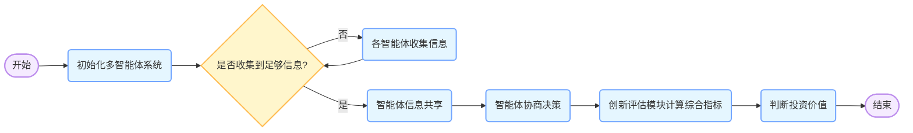

# 价值投资中的AI驱动创新评估：多智能体系统的作用

> 关键词：价值投资、AI驱动创新评估、多智能体系统、投资决策、市场分析

> 摘要：本文聚焦于价值投资领域，深入探讨了AI驱动的创新评估中多智能体系统所发挥的重要作用。首先介绍了价值投资以及相关技术的背景知识，阐述了核心概念与联系，详细讲解了核心算法原理及具体操作步骤，同时给出了相应的数学模型和公式，并举例说明。通过项目实战展示了如何运用相关技术进行实际开发和分析，探讨了其在不同实际应用场景中的表现。此外，还推荐了一系列学习资源、开发工具框架以及相关论文著作。最后总结了未来发展趋势与挑战，并对常见问题进行了解答，为价值投资领域的从业者和研究者提供了全面且深入的技术参考。

## 1. 背景介绍 
### 1.1 目的和范围
价值投资作为一种经典的投资策略，旨在寻找被低估的资产并长期持有以获取价值回归带来的收益。然而，随着市场环境日益复杂和信息爆炸式增长，传统的价值评估方法面临诸多挑战。AI技术的发展为价值投资中的创新评估提供了新的途径，而多智能体系统作为一种分布式人工智能技术，能够模拟多个智能体之间的交互和协作，为更准确、全面的创新评估提供支持。本文的目的在于深入研究多智能体系统在价值投资的AI驱动创新评估中的作用，涵盖从理论原理到实际应用的各个方面，包括核心算法、数学模型、项目实战等内容。

### 1.2 预期读者
本文预期读者包括金融投资领域的从业者，如投资经理、分析师等，他们希望借助AI技术提升价值投资决策的准确性和效率；计算机科学和人工智能领域的研究人员和开发者，对多智能体系统在金融领域的应用感兴趣；以及对价值投资和AI技术结合有学习需求的学生和爱好者。

### 1.3 文档结构概述
本文首先介绍背景知识，包括目的、预期读者和文档结构。接着阐述核心概念与联系，展示相关的文本示意图和Mermaid流程图。然后详细讲解核心算法原理及具体操作步骤，给出Python源代码。随后介绍数学模型和公式，并举例说明。通过项目实战展示代码实现和解读。探讨实际应用场景，推荐相关工具和资源。最后总结未来发展趋势与挑战，解答常见问题，并提供扩展阅读和参考资料。

### 1.4 术语表
#### 1.4.1 核心术语定义
- **价值投资**：一种投资策略，投资者通过分析资产的内在价值，寻找价格低于内在价值的资产进行投资，期望在资产价值回归时获得收益。
- **AI驱动创新评估**：利用人工智能技术对投资对象的创新能力进行评估，包括技术创新、商业模式创新等方面。
- **多智能体系统（Multi - Agent System，MAS）**：由多个智能体组成的系统，每个智能体具有一定的自主性和智能，能够通过与其他智能体的交互和协作完成特定的任务。
- **智能体（Agent）**：具有感知、决策和行动能力的实体，能够根据自身的目标和环境信息做出决策并采取行动。

#### 1.4.2 相关概念解释
- **分布式人工智能**：研究如何将多个智能体分布在不同的节点上，通过协作和交互完成复杂的任务，多智能体系统是分布式人工智能的一种具体实现。
- **创新评估指标**：用于衡量投资对象创新能力的一系列指标，如研发投入、专利数量、新产品推出速度等。

#### 1.4.3 缩略词列表
- **MAS**：Multi - Agent System（多智能体系统）
- **AI**：Artificial Intelligence（人工智能）

## 2. 核心概念与联系 

### 核心概念原理
在价值投资的AI驱动创新评估中，多智能体系统的核心原理在于模拟市场中的不同参与者，每个智能体代表一个特定的角色或信息源。这些智能体可以包括基本面分析智能体、技术分析智能体、市场情绪智能体等。基本面分析智能体负责收集和分析投资对象的财务数据、行业竞争地位等基本面信息；技术分析智能体关注市场价格走势、交易量等技术指标；市场情绪智能体则通过社交媒体、新闻等渠道感知市场参与者的情绪。

各个智能体之间通过交互和协作，共同完成对投资对象创新能力的评估。例如，基本面分析智能体发现某公司研发投入增加，但技术分析智能体发现该公司股价并未相应上涨，市场情绪智能体检测到市场对该公司存在负面情绪。此时，多个智能体通过信息共享和协商，综合判断该公司的创新潜力和投资价值。

### 架构的文本示意图
```plaintext
价值投资AI驱动创新评估系统
|
|-- 多智能体系统
|   |-- 基本面分析智能体
|   |   |-- 财务数据收集模块
|   |   |-- 行业分析模块
|   |   |-- 创新指标评估模块
|   |-- 技术分析智能体
|   |   |-- 价格走势分析模块
|   |   |-- 交易量分析模块
|   |   |-- 技术指标计算模块
|   |-- 市场情绪智能体
|   |   |-- 社交媒体数据采集模块
|   |   |-- 新闻舆情分析模块
|   |   |-- 情绪量化模块
|
|-- 智能体交互模块
|   |-- 信息共享机制
|   |-- 协商决策机制
|
|-- 创新评估模块
|   |-- 综合指标计算
|   |-- 投资价值判断
```

### Mermaid流程图


## 3. 核心算法原理 & 具体操作步骤 

### 核心算法原理
多智能体系统在价值投资的AI驱动创新评估中主要涉及以下几种核心算法：

#### 1. 信息收集与预处理算法
各个智能体需要从不同的数据源收集信息，并进行预处理。例如，基本面分析智能体从财务报表中提取数据，使用数据清洗算法去除噪声和异常值，使用归一化算法将不同量级的数据进行统一处理。以下是一个简单的数据归一化的Python代码示例：
```python
import numpy as np

def normalize(data):
    """
    对输入数据进行归一化处理
    :param data: 输入的一维或多维数组
    :return: 归一化后的数据
    """
    min_val = np.min(data)
    max_val = np.max(data)
    normalized_data = (data - min_val) / (max_val - min_val)
    return normalized_data

# 示例数据
data = np.array([1, 2, 3, 4, 5])
normalized_data = normalize(data)
print(normalized_data)
```

#### 2. 智能体决策算法
每个智能体根据自身的目标和收集到的信息做出决策。例如，技术分析智能体可以使用移动平均线交叉策略来判断股价的走势。以下是一个简单的移动平均线交叉策略的Python代码示例：
```python
import pandas as pd

def moving_average_crossover(data, short_window=5, long_window=20):
    """
    移动平均线交叉策略
    :param data: 包含股价数据的DataFrame，其中包含'close'列
    :param short_window: 短期移动平均线窗口大小
    :param long_window: 长期移动平均线窗口大小
    :return: 交易信号（1表示买入，-1表示卖出，0表示持有）
    """
    data['short_ma'] = data['close'].rolling(window=short_window).mean()
    data['long_ma'] = data['close'].rolling(window=long_window).mean()
    data['signal'] = 0
    data.loc[data['short_ma'] > data['long_ma'], 'signal'] = 1
    data.loc[data['short_ma'] < data['long_ma'], 'signal'] = -1
    return data['signal']

# 示例数据
data = pd.DataFrame({'close': [10, 11, 12, 13, 14, 13, 12, 11, 10]})
signals = moving_average_crossover(data)
print(signals)
```

#### 3. 智能体交互与协商算法
智能体之间需要进行信息共享和协商，以达成一致的决策。一种简单的协商算法是多数表决算法。以下是一个多数表决算法的Python代码示例：
```python
def majority_vote(votes):
    """
    多数表决算法
    :param votes: 包含各个智能体决策结果的列表
    :return: 最终决策结果
    """
    vote_counts = {}
    for vote in votes:
        if vote in vote_counts:
            vote_counts[vote] += 1
        else:
            vote_counts[vote] = 1
    max_count = 0
    final_decision = None
    for vote, count in vote_counts.items():
        if count > max_count:
            max_count = count
            final_decision = vote
    return final_decision

# 示例投票结果
votes = [1, 1, -1, 1, 0]
final_decision = majority_vote(votes)
print(final_decision)
```

### 具体操作步骤
1. **初始化多智能体系统**：创建各个智能体，并设置其初始参数和目标。
2. **信息收集**：各个智能体从不同的数据源收集信息，并进行预处理。
3. **智能体决策**：每个智能体根据自身的算法和收集到的信息做出决策。
4. **智能体交互与协商**：智能体之间进行信息共享，使用协商算法达成一致的决策。
5. **创新评估**：根据智能体的协商结果，计算综合创新评估指标，判断投资对象的投资价值。

## 4. 数学模型和公式 & 详细讲解 & 举例说明 

### 信息熵模型用于市场情绪量化
在市场情绪智能体中，可以使用信息熵模型来量化市场情绪的不确定性。信息熵的公式为：
$$H(X)=-\sum_{i = 1}^{n}p(x_i)\log_2p(x_i)$$
其中，$X$ 是一个随机变量，代表市场情绪的分类（如积极、消极、中性），$p(x_i)$ 是第 $i$ 种情绪分类出现的概率，$n$ 是情绪分类的总数。

信息熵的值越大，说明市场情绪的不确定性越高。例如，假设在一次市场情绪分析中，积极情绪的概率 $p_1 = 0.3$，消极情绪的概率 $p_2 = 0.4$，中性情绪的概率 $p_3 = 0.3$，则信息熵为：
$$H(X)=-(0.3\log_20.3 + 0.4\log_20.4 + 0.3\log_20.3)\approx 1.57$$

### 加权综合评估模型
在创新评估模块中，可以使用加权综合评估模型来计算投资对象的综合创新得分。假设存在 $m$ 个评估指标 $x_1, x_2, \cdots, x_m$，对应的权重为 $w_1, w_2, \cdots, w_m$，且 $\sum_{i = 1}^{m}w_i = 1$，则综合创新得分 $S$ 的计算公式为：
$$S=\sum_{i = 1}^{m}w_ix_i$$

例如，假设创新评估指标包括研发投入比例 $x_1$（权重 $w_1 = 0.4$）、专利数量 $x_2$（权重 $w_2 = 0.3$）和新产品推出速度 $x_3$（权重 $w_3 = 0.3$）。某公司的研发投入比例为 $0.1$，专利数量为 $20$（经过归一化处理后的值为 $0.6$），新产品推出速度为 $0.8$，则该公司的综合创新得分 $S$ 为：
$$S = 0.4\times0.1+0.3\times0.6 + 0.3\times0.8=0.5$$

## 5. 项目实战：代码实际案例和详细解释说明 

### 5.1  开发环境搭建
1. **安装Python**：推荐使用Python 3.7及以上版本，可以从Python官方网站（https://www.python.org/downloads/）下载并安装。
2. **安装必要的库**：使用pip命令安装以下库：
```sh
pip install pandas numpy scikit-learn matplotlib
```
其中，`pandas` 用于数据处理和分析，`numpy` 用于数值计算，`scikit-learn` 用于机器学习算法，`matplotlib` 用于数据可视化。

### 5.2  源代码详细实现和代码解读
以下是一个简单的多智能体系统在价值投资创新评估中的代码示例：
```python
import pandas as pd
import numpy as np

# 基本面分析智能体
class FundamentalAgent:
    def __init__(self):
        self.data = None

    def collect_data(self, file_path):
        """
        收集基本面数据
        :param file_path: 数据文件路径
        """
        self.data = pd.read_csv(file_path)
        # 数据清洗和预处理
        self.data = self.data.dropna()
        self.data['R&D_ratio'] = self.data['R&D_expense'] / self.data['revenue']

    def evaluate(self):
        """
        评估创新指标
        :return: 创新得分
        """
        # 简单示例：研发投入比例作为创新指标
        score = np.mean(self.data['R&D_ratio'])
        return score

# 技术分析智能体
class TechnicalAgent:
    def __init__(self):
        self.data = None

    def collect_data(self, file_path):
        """
        收集技术分析数据
        :param file_path: 数据文件路径
        """
        self.data = pd.read_csv(file_path)

    def evaluate(self):
        """
        评估技术指标
        :return: 技术得分
        """
        # 简单示例：移动平均线交叉信号作为技术指标
        short_ma = self.data['close'].rolling(window=5).mean()
        long_ma = self.data['close'].rolling(window=20).mean()
        signal = (short_ma > long_ma).astype(int)
        score = np.mean(signal)
        return score

# 市场情绪智能体
class SentimentAgent:
    def __init__(self):
        self.data = None

    def collect_data(self, file_path):
        """
        收集市场情绪数据
        :param file_path: 数据文件路径
        """
        self.data = pd.read_csv(file_path)

    def evaluate(self):
        """
        评估市场情绪
        :return: 情绪得分
        """
        # 简单示例：积极情绪比例作为情绪指标
        positive_count = len(self.data[self.data['sentiment'] == 'positive'])
        total_count = len(self.data)
        score = positive_count / total_count
        return score

# 多智能体系统
class MultiAgentSystem:
    def __init__(self):
        self.fundamental_agent = FundamentalAgent()
        self.technical_agent = TechnicalAgent()
        self.sentiment_agent = SentimentAgent()

    def collect_data(self, fundamental_path, technical_path, sentiment_path):
        """
        各智能体收集数据
        :param fundamental_path: 基本面数据文件路径
        :param technical_path: 技术分析数据文件路径
        :param sentiment_path: 市场情绪数据文件路径
        """
        self.fundamental_agent.collect_data(fundamental_path)
        self.technical_agent.collect_data(technical_path)
        self.sentiment_agent.collect_data(sentiment_path)

    def evaluate(self):
        """
        各智能体进行评估并综合得分
        :return: 综合得分
        """
        fundamental_score = self.fundamental_agent.evaluate()
        technical_score = self.technical_agent.evaluate()
        sentiment_score = self.sentiment_agent.evaluate()
        # 加权综合得分
        weights = [0.4, 0.3, 0.3]
        scores = [fundamental_score, technical_score, sentiment_score]
        total_score = np.dot(weights, scores)
        return total_score

# 主程序
if __name__ == "__main__":
    mas = MultiAgentSystem()
    mas.collect_data('fundamental_data.csv', 'technical_data.csv', 'sentiment_data.csv')
    total_score = mas.evaluate()
    print(f"综合创新得分: {total_score}")
```

### 5.3  代码解读与分析
- **基本面分析智能体（`FundamentalAgent`）**：负责收集和分析基本面数据，通过计算研发投入比例来评估创新指标。
- **技术分析智能体（`TechnicalAgent`）**：收集技术分析数据，使用移动平均线交叉信号来评估技术指标。
- **市场情绪智能体（`SentimentAgent`）**：收集市场情绪数据，通过计算积极情绪比例来评估市场情绪。
- **多智能体系统（`MultiAgentSystem`）**：协调各个智能体的工作，收集数据并进行综合评估。通过加权综合得分的方式，将各个智能体的评估结果进行整合，得到最终的综合创新得分。

## 6. 实际应用场景 
### 股票投资决策
在股票投资中，多智能体系统可以帮助投资者更全面地评估上市公司的创新能力和投资价值。基本面分析智能体可以分析公司的财务报表、研发投入等信息；技术分析智能体可以关注股价走势和交易量等技术指标；市场情绪智能体可以感知市场对该公司的情绪。通过多智能体的协作，投资者可以做出更明智的投资决策。

### 风险投资评估
风险投资机构在评估创业公司时，需要考虑多个方面的因素，如技术创新、商业模式创新、市场前景等。多智能体系统可以模拟不同的评估视角，对创业公司进行综合评估。例如，一个智能体可以评估公司的技术实力，另一个智能体可以分析市场竞争情况，通过信息共享和协商，为风险投资决策提供更准确的依据。

### 行业趋势分析
多智能体系统可以用于分析整个行业的创新趋势。不同的智能体可以关注行业内不同企业的创新动态，通过对大量数据的分析和整合，发现行业的创新热点和发展趋势。这有助于投资者提前布局，把握行业发展的机遇。

## 7. 工具和资源推荐
### 7.1 学习资源推荐
#### 7.1.1 书籍推荐
- 《人工智能：一种现代的方法》：全面介绍了人工智能的基本概念、算法和应用，是人工智能领域的经典教材。
- 《Python数据分析实战》：详细讲解了使用Python进行数据分析的方法和技巧，对于处理金融数据非常有帮助。
- 《多智能体系统导论》：系统介绍了多智能体系统的理论、技术和应用，是学习多智能体系统的重要参考书籍。

#### 7.1.2 在线课程
- Coursera上的“人工智能基础”课程：由知名高校的教授授课，系统介绍了人工智能的基础知识和算法。
- edX上的“Python数据科学”课程：专注于使用Python进行数据科学研究，包括数据处理、分析和可视化等方面。
- Udemy上的“多智能体系统开发实战”课程：通过实际项目，讲解多智能体系统的开发方法和技巧。

#### 7.1.3 技术博客和网站
- Medium：上面有很多关于人工智能、金融科技等领域的技术文章和案例分析。
- Towards Data Science：专注于数据科学和人工智能领域的技术分享和讨论。
- Kaggle：一个数据科学竞赛平台，上面有很多金融数据集和相关的分析代码，可以学习和参考。

### 7.2 开发工具框架推荐
#### 7.2.1 IDE和编辑器
- PyCharm：一款专业的Python集成开发环境，具有强大的代码编辑、调试和项目管理功能。
- Jupyter Notebook：一个交互式的编程环境，适合进行数据探索和分析，方便展示代码和结果。

#### 7.2.2 调试和性能分析工具
- pdb：Python自带的调试工具，可以帮助开发者定位和解决代码中的问题。
- cProfile：Python的性能分析工具，可以分析代码的运行时间和资源消耗情况，帮助优化代码性能。

#### 7.2.3 相关框架和库
- TensorFlow：一个开源的机器学习框架，可用于构建和训练深度学习模型，在市场情绪分析等方面有广泛应用。
- PyTorch：另一个流行的深度学习框架，具有简洁易用的特点，适合快速开发和实验。
- Mesa：一个用于构建多智能体系统的Python框架，提供了丰富的工具和接口，方便开发者实现多智能体模型。

### 7.3 相关论文著作推荐
#### 7.3.1 经典论文
- “Multi - Agent Systems: A Modern Approach to Distributed Artificial Intelligence”：该论文系统地介绍了多智能体系统的基本概念、理论和应用，是多智能体系统领域的经典之作。
- “Value Investing: The Use of Historical Financial Statement Information to Separate Winners from Losers”：探讨了价值投资中如何利用历史财务报表信息进行投资决策，为价值投资提供了理论基础。

#### 7.3.2 最新研究成果
- 近年来在顶级学术期刊如《Journal of Financial Economics》《Artificial Intelligence》上发表的关于AI在金融投资领域应用的研究论文，这些论文反映了该领域的最新研究动态和成果。

#### 7.3.3 应用案例分析
- 一些知名投资机构发布的关于AI驱动投资决策的案例分析报告，这些报告可以帮助读者了解实际应用中的方法和经验。

## 8. 总结：未来发展趋势与挑战
### 未来发展趋势
- **更深度的融合**：AI技术与价值投资的融合将更加深入，多智能体系统将结合更多的人工智能技术，如深度学习、强化学习等，提高创新评估的准确性和效率。
- **跨领域应用**：多智能体系统在价值投资中的应用将拓展到更多领域，如房地产投资、大宗商品投资等，为不同领域的投资决策提供支持。
- **实时决策支持**：随着数据获取和处理技术的发展，多智能体系统将能够提供实时的投资决策支持，帮助投资者及时把握市场机会。

### 挑战
- **数据质量和隐私问题**：多智能体系统需要大量的数据来进行分析和决策，数据的质量和隐私保护是一个重要的挑战。不准确或不完整的数据可能导致错误的决策，而数据隐私问题则需要遵守相关的法律法规。
- **模型解释性**：AI模型，尤其是深度学习模型，往往具有较高的复杂度，难以解释其决策过程。在价值投资中，投资者需要理解模型的决策依据，因此提高模型的解释性是一个亟待解决的问题。
- **市场不确定性**：金融市场具有高度的不确定性，多智能体系统虽然可以分析和预测市场趋势，但无法完全消除市场风险。如何在不确定的市场环境中提高投资决策的可靠性是一个挑战。

## 9. 附录：常见问题与解答
### 1. 多智能体系统在价值投资中的优势是什么？
多智能体系统可以模拟市场中的不同参与者，从多个角度对投资对象进行评估，提高评估的全面性和准确性。同时，智能体之间的交互和协作可以处理复杂的市场信息，为投资决策提供更科学的依据。

### 2. 如何确定多智能体系统中各个智能体的权重？
确定智能体权重的方法有很多种，常见的包括专家经验法、层次分析法、主成分分析法等。可以根据具体的应用场景和数据特点选择合适的方法。

### 3. 多智能体系统的计算复杂度高吗？
多智能体系统的计算复杂度取决于智能体的数量、算法的复杂度和数据量等因素。在实际应用中，可以通过优化算法、并行计算等方法来降低计算复杂度。

### 4. 多智能体系统能否完全替代人类的投资决策？
虽然多智能体系统可以提供有价值的信息和决策建议，但目前还不能完全替代人类的投资决策。人类的经验、直觉和判断力在投资决策中仍然起着重要的作用，多智能体系统可以作为人类决策的辅助工具。

## 10. 扩展阅读 & 参考资料
- 《金融科技前沿：人工智能与区块链》
- 《投资中最简单的事》
- 《金融市场中的人工智能应用》研究报告
- https://www.investopedia.com/ （投资百科网站）
- https://www.arxiv.org/ （学术论文预印本网站）

作者：AI天才研究院/AI Genius Institute & 禅与计算机程序设计艺术 /Zen And The Art of Computer Programming