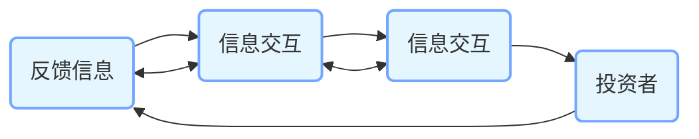

# 价值投资中的AI驱动地缘政治风险分析：多智能体系统

> 关键词：价值投资、AI、地缘政治风险分析、多智能体系统、投资决策

> 摘要：本文聚焦于价值投资领域中利用AI驱动的多智能体系统进行地缘政治风险分析。详细阐述了多智能体系统的核心概念、算法原理、数学模型等内容，通过项目实战展示了如何将其应用于实际的风险分析中，探讨了实际应用场景、相关工具和资源，并对未来发展趋势与挑战进行了总结。旨在为价值投资者提供一种新的、基于先进技术的地缘政治风险分析方法，以辅助其做出更明智的投资决策。

## 1. 背景介绍 
### 1.1 目的和范围
在当今全球化的经济环境下，地缘政治因素对金融市场和价值投资决策的影响日益显著。地缘政治事件，如战争、贸易摩擦、政治动荡等，可能导致资产价格的大幅波动，给投资者带来巨大的风险。传统的风险分析方法往往难以全面、及时地捕捉地缘政治风险的动态变化。本研究的目的在于引入AI驱动的多智能体系统，为价值投资中的地缘政治风险分析提供一种创新的解决方案。

本研究的范围涵盖了多智能体系统的基本原理、算法实现、数学模型构建，以及在价值投资领域的实际应用。通过对多智能体系统的深入研究，探索如何利用其对地缘政治风险进行有效的监测、评估和预测，为投资者提供更准确的风险信息，辅助其制定合理的投资策略。

### 1.2 预期读者
本文的预期读者主要包括价值投资者、金融分析师、投资顾问、人工智能研究人员以及对地缘政治风险分析和价值投资感兴趣的专业人士。对于投资者而言，了解如何利用AI技术进行地缘政治风险分析有助于提高投资决策的准确性和安全性；对于研究人员来说，本文提供了一个将多智能体系统应用于金融领域的研究案例，具有一定的学术参考价值。

### 1.3 文档结构概述
本文将按照以下结构展开：首先介绍多智能体系统的核心概念与联系，包括其原理和架构；接着详细阐述核心算法原理及具体操作步骤，并给出Python源代码示例；然后介绍数学模型和公式，通过举例说明其应用；之后通过项目实战展示多智能体系统在价值投资地缘政治风险分析中的具体实现；再探讨实际应用场景；推荐相关的工具和资源；最后总结未来发展趋势与挑战，并提供常见问题解答和扩展阅读参考资料。

### 1.4 术语表
#### 1.4.1 核心术语定义
- **价值投资**：一种投资策略，基于对资产内在价值的评估，选择被低估的资产进行投资，期望在资产价值回归时获得收益。
- **地缘政治风险**：由地缘政治因素引发的风险，如政治冲突、贸易政策变化、国际关系紧张等，可能对经济和金融市场产生负面影响。
- **多智能体系统（Multi - Agent System, MAS）**：由多个智能体组成的系统，每个智能体具有自主决策能力，能够感知环境并与其他智能体进行交互，以实现系统的整体目标。
- **智能体（Agent）**：具有自主性、反应性、社会性和主动性的实体，能够在一定环境中感知信息、做出决策并执行相应的动作。

#### 1.4.2 相关概念解释
- **AI（人工智能）**：研究如何使计算机模拟人类智能的技术，包括机器学习、深度学习、自然语言处理等多个领域。在本文中，AI技术被用于多智能体系统的设计和实现，以提高地缘政治风险分析的效率和准确性。
- **风险评估**：对风险的可能性和影响程度进行量化分析的过程。在价值投资中，风险评估有助于投资者了解投资项目面临的各种风险，从而制定相应的风险管理策略。
- **预测模型**：基于历史数据和统计方法构建的模型，用于预测未来事件的发生概率和趋势。在本文中，多智能体系统可以作为一种预测模型，对地缘政治风险进行预测。

#### 1.4.3 缩略词列表
- **MAS**：Multi - Agent System（多智能体系统）
- **AI**：Artificial Intelligence（人工智能）

## 2. 核心概念与联系 

### 多智能体系统原理
多智能体系统的核心思想是将复杂的问题分解为多个相对简单的子问题，每个子问题由一个智能体负责处理。智能体之间通过通信和协作来完成整个系统的任务。在价值投资的地缘政治风险分析中，不同的智能体可以负责不同的任务，如信息收集、风险评估、决策建议等。

智能体通常具有以下特性：
- **自主性**：智能体能够在没有外界直接干预的情况下，独立地做出决策和执行动作。
- **反应性**：智能体能够感知环境的变化，并及时做出相应的反应。
- **社会性**：智能体能够与其他智能体进行通信和协作，以实现共同的目标。
- **主动性**：智能体能够主动地采取行动，以实现自身的目标。

### 多智能体系统架构
多智能体系统的架构可以分为集中式、分布式和混合式三种类型。

- **集中式架构**：在集中式架构中，存在一个中央控制节点，负责协调和管理所有智能体的行为。中央控制节点接收来自各个智能体的信息，并做出决策后将指令发送给相应的智能体。这种架构的优点是易于管理和协调，但缺点是中央控制节点可能成为系统的瓶颈，一旦出现故障，整个系统可能会瘫痪。
- **分布式架构**：在分布式架构中，所有智能体都是平等的，没有中央控制节点。智能体之间通过相互通信和协作来完成任务。这种架构的优点是具有较高的灵活性和可靠性，但缺点是协调和管理难度较大。
- **混合式架构**：混合式架构结合了集中式和分布式架构的优点，既有中央控制节点负责整体的协调和管理，又允许智能体之间进行分布式的通信和协作。

### 文本示意图
多智能体系统在价值投资地缘政治风险分析中的架构可以描述如下：

系统包括多个智能体，如信息收集智能体、风险评估智能体、决策建议智能体等。信息收集智能体负责从各种数据源（如新闻媒体、政府报告、社交媒体等）收集地缘政治相关的信息，并将其发送给风险评估智能体。风险评估智能体根据收集到的信息，利用预设的风险评估模型对地缘政治风险进行评估，并将评估结果发送给决策建议智能体。决策建议智能体根据风险评估结果，结合投资者的投资目标和风险偏好，为投资者提供相应的投资决策建议。同时，各个智能体之间可以进行通信和协作，以确保信息的及时更新和处理。

### Mermaid 流程图


## 3. 核心算法原理 & 具体操作步骤 

### 核心算法原理
在多智能体系统中，常用的算法包括强化学习算法、博弈论算法等。这里以强化学习算法为例，介绍其在价值投资地缘政治风险分析中的应用。

强化学习是一种通过智能体与环境进行交互，不断尝试和学习，以最大化累积奖励的机器学习方法。在价值投资地缘政治风险分析中，智能体的目标是根据地缘政治环境的变化，做出最优的投资决策，以获得最大的投资收益。

智能体在每个时间步 $t$ 接收环境的状态 $s_t$，并根据当前的策略 $\pi$ 选择一个动作 $a_t$。执行动作后，环境会给出一个奖励 $r_t$，并转移到下一个状态 $s_{t + 1}$。智能体的目标是学习一个最优策略 $\pi^*$，使得累积奖励 $R = \sum_{t = 0}^{T} \gamma^t r_t$ 最大化，其中 $\gamma$ 是折扣因子，$T$ 是时间步数。

### 具体操作步骤
1. **定义状态空间**：状态空间 $S$ 包括地缘政治相关的各种信息，如政治局势、经济数据、国际关系等。可以将这些信息进行量化和编码，形成一个多维向量来表示状态。
2. **定义动作空间**：动作空间 $A$ 包括投资者可以采取的各种投资决策，如买入、卖出、持有等。
3. **定义奖励函数**：奖励函数 $r(s, a)$ 表示智能体在状态 $s$ 下采取动作 $a$ 后获得的奖励。奖励可以根据投资收益、风险水平等因素来定义。例如，如果投资收益增加，则奖励为正；如果投资收益减少或风险增加，则奖励为负。
4. **初始化策略**：可以随机初始化一个策略 $\pi$，也可以使用一些先验知识来初始化。
5. **智能体与环境交互**：智能体在每个时间步根据当前策略选择一个动作，并执行该动作。环境根据动作给出奖励和下一个状态。
6. **更新策略**：根据奖励和状态转移信息，使用强化学习算法（如Q - learning、深度Q网络等）更新策略，以提高累积奖励。
7. **重复步骤5和6**：不断重复智能体与环境的交互和策略更新过程，直到策略收敛或达到预设的训练次数。

### Python源代码示例
```python
import numpy as np

# 定义状态空间、动作空间和奖励函数
state_space_size = 10
action_space_size = 3

# 初始化Q表
q_table = np.zeros((state_space_size, action_space_size))

# 超参数
learning_rate = 0.1
discount_factor = 0.9
exploration_rate = 1.0
max_exploration_rate = 1.0
min_exploration_rate = 0.01
exploration_decay_rate = 0.001

# 模拟环境
def get_reward(state, action):
    # 简单示例，实际应用中需要根据具体情况定义
    if state == 0 and action == 0:
        return 1
    else:
        return -1

def get_next_state(state, action):
    # 简单示例，实际应用中需要根据具体情况定义
    return (state + action) % state_space_size

# 训练过程
num_episodes = 1000
for episode in range(num_episodes):
    state = np.random.randint(0, state_space_size)
    done = False
    
    while not done:
        # 选择动作
        if np.random.uniform(0, 1) < exploration_rate:
            action = np.random.randint(0, action_space_size)
        else:
            action = np.argmax(q_table[state, :])
        
        # 执行动作，获取奖励和下一个状态
        reward = get_reward(state, action)
        next_state = get_next_state(state, action)
        
        # 更新Q表
        q_table[state, action] = q_table[state, action] + learning_rate * (reward + discount_factor * np.max(q_table[next_state, :]) - q_table[state, action])
        
        state = next_state
        
        # 判断是否结束
        if state == 5:
            done = True
    
    # 衰减探索率
    exploration_rate = min_exploration_rate + (max_exploration_rate - min_exploration_rate) * np.exp(-exploration_decay_rate * episode)

# 输出最终的Q表
print("Final Q - table:")
print(q_table)
```

## 4. 数学模型和公式 & 详细讲解 & 举例说明 

### 强化学习数学模型
在强化学习中，常用的数学模型是马尔可夫决策过程（Markov Decision Process, MDP）。MDP 可以用一个五元组 $(S, A, P, R, \gamma)$ 来表示，其中：
- $S$ 是状态空间，表示环境可能处于的所有状态。
- $A$ 是动作空间，表示智能体可以采取的所有动作。
- $P(s_{t + 1} | s_t, a_t)$ 是状态转移概率，表示在状态 $s_t$ 下采取动作 $a_t$ 后转移到状态 $s_{t + 1}$ 的概率。
- $R(s_t, a_t)$ 是奖励函数，表示在状态 $s_t$ 下采取动作 $a_t$ 后获得的奖励。
- $\gamma$ 是折扣因子，用于权衡当前奖励和未来奖励的重要性。

### 价值函数和策略评估
价值函数用于评估智能体在某个状态或状态 - 动作对下的价值。常用的价值函数包括状态价值函数 $V^{\pi}(s)$ 和动作价值函数 $Q^{\pi}(s, a)$。

- 状态价值函数 $V^{\pi}(s)$ 表示在策略 $\pi$ 下，从状态 $s$ 开始的期望累积奖励：
$$V^{\pi}(s) = \mathbb{E}_{\pi} \left[ \sum_{t = 0}^{\infty} \gamma^t r_t | s_0 = s \right]$$

- 动作价值函数 $Q^{\pi}(s, a)$ 表示在策略 $\pi$ 下，从状态 $s$ 采取动作 $a$ 后开始的期望累积奖励：
$$Q^{\pi}(s, a) = \mathbb{E}_{\pi} \left[ \sum_{t = 0}^{\infty} \gamma^t r_t | s_0 = s, a_0 = a \right]$$

策略评估的目标是计算在给定策略 $\pi$ 下的价值函数。可以使用动态规划、蒙特卡罗方法或时序差分方法来进行策略评估。

### Q - learning 算法公式
Q - learning 是一种无模型的强化学习算法，用于学习最优动作价值函数 $Q^*(s, a)$。Q - learning 的更新公式如下：
$$Q(s_t, a_t) \leftarrow Q(s_t, a_t) + \alpha \left[ r_t + \gamma \max_{a} Q(s_{t + 1}, a) - Q(s_t, a_t) \right]$$
其中，$\alpha$ 是学习率，$r_t$ 是在时间步 $t$ 获得的奖励，$s_{t + 1}$ 是下一个状态。

### 举例说明
假设一个简单的投资场景，状态空间 $S = \{0, 1, 2\}$ 表示三种不同的地缘政治状态，动作空间 $A = \{0, 1\}$ 表示买入和卖出两种投资决策。奖励函数定义如下：
- 当状态为 0 且采取动作 0（买入）时，奖励为 10。
- 当状态为 1 且采取动作 1（卖出）时，奖励为 5。
- 其他情况下，奖励为 - 2。

折扣因子 $\gamma = 0.9$，学习率 $\alpha = 0.1$。初始时，$Q$ 表中的所有值都为 0。

在某个时间步，智能体处于状态 $s_t = 0$，选择动作 $a_t = 0$，获得奖励 $r_t = 10$，并转移到状态 $s_{t + 1} = 1$。根据 Q - learning 更新公式：
$$Q(0, 0) \leftarrow Q(0, 0) + 0.1 \left[ 10 + 0.9 \max_{a} Q(1, a) - Q(0, 0) \right]$$
由于初始时 $Q(1, 0) = Q(1, 1) = 0$，则：
$$Q(0, 0) \leftarrow 0 + 0.1 \times (10 + 0.9 \times 0 - 0) = 1$$

随着不断的学习和更新，$Q$ 表中的值会逐渐收敛到最优动作价值函数。

## 5. 项目实战：代码实际案例和详细解释说明 

### 5.1  开发环境搭建
#### 硬件环境
- 处理器：Intel Core i5 及以上
- 内存：8GB 及以上
- 硬盘：至少 500GB 可用空间

#### 软件环境
- 操作系统：Windows 10、Linux（如 Ubuntu 18.04 及以上）或 macOS
- Python 版本：Python 3.6 及以上
- 相关库：NumPy、Pandas、Scikit - learn、TensorFlow 或 PyTorch（用于深度学习）、BeautifulSoup（用于网页信息抓取）等

可以使用以下命令安装所需的库：
```sh
pip install numpy pandas scikit-learn tensorflow beautifulsoup4
```

### 5.2  源代码详细实现和代码解读
```python
import numpy as np
import pandas as pd
from bs4 import BeautifulSoup
import requests
import tensorflow as tf
from sklearn.preprocessing import StandardScaler

# 信息收集智能体
def collect_geopolitical_info():
    # 从新闻网站抓取地缘政治相关信息
    url = 'https://example.com/geopolitical-news'
    response = requests.get(url)
    soup = BeautifulSoup(response.text, 'html.parser')
    news_texts = []
    for article in soup.find_all('article'):
        news_texts.append(article.get_text())
    return news_texts

# 数据预处理
def preprocess_data(news_texts):
    # 简单示例，将文本转换为词频向量
    from sklearn.feature_extraction.text import CountVectorizer
    vectorizer = CountVectorizer()
    X = vectorizer.fit_transform(news_texts)
    X = X.toarray()
    scaler = Standard