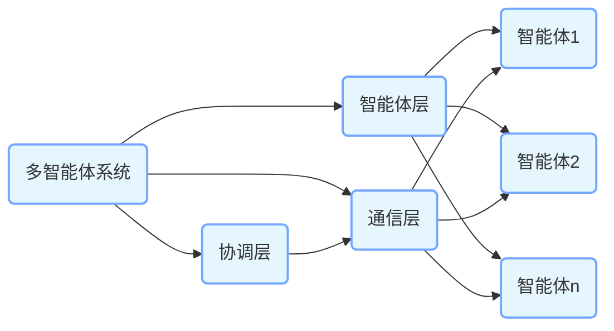

# 价值投资中的AI驱动消费者行为分析：多智能体系统

> 关键词：价值投资、AI驱动、消费者行为分析、多智能体系统、金融决策

> 摘要：本文聚焦于价值投资领域中借助AI驱动的多智能体系统进行消费者行为分析。首先介绍了研究背景，包括目的、预期读者等内容。详细阐述了核心概念，如多智能体系统的原理和架构，并给出了相应的示意图和流程图。深入讲解了核心算法原理，用Python代码进行具体说明，同时分析了相关的数学模型和公式。通过项目实战展示了如何搭建开发环境、实现源代码及进行代码解读。探讨了该技术在价值投资中的实际应用场景，推荐了学习、开发工具等资源。最后总结了未来发展趋势与挑战，解答了常见问题并提供了扩展阅读和参考资料，旨在为价值投资中利用AI分析消费者行为提供全面的技术指导。

## 1. 背景介绍 
### 1.1 目的和范围
在价值投资领域，准确理解消费者行为对于投资者做出明智决策至关重要。传统的消费者行为分析方法往往难以应对海量、复杂且动态变化的数据。随着人工智能技术的飞速发展，利用AI驱动的多智能体系统进行消费者行为分析成为一种新的趋势。本文的目的在于深入探讨如何运用多智能体系统对消费者行为进行有效分析，并将其应用于价值投资决策中。范围涵盖了从多智能体系统的基本概念、算法原理到实际项目开发和应用的全过程。

### 1.2 预期读者
本文预期读者包括价值投资者、金融分析师、人工智能研究者、计算机科学专业学生以及对利用AI技术进行金融决策感兴趣的相关人员。无论是希望提升投资决策准确性的投资者，还是致力于研究人工智能在金融领域应用的科研人员，都能从本文中获取有价值的信息。

### 1.3 文档结构概述
本文共分为十个部分。第一部分为背景介绍，阐述了研究的目的、预期读者和文档结构。第二部分介绍核心概念与联系，包括多智能体系统的原理和架构。第三部分讲解核心算法原理及具体操作步骤，并用Python代码进行详细阐述。第四部分分析数学模型和公式，并举例说明。第五部分进行项目实战，包括开发环境搭建、源代码实现和代码解读。第六部分探讨实际应用场景。第七部分推荐学习、开发工具和相关论文著作。第八部分总结未来发展趋势与挑战。第九部分解答常见问题。第十部分提供扩展阅读和参考资料。

### 1.4 术语表
#### 1.4.1 核心术语定义
- **价值投资**：一种投资策略，投资者通过分析公司的基本面，如财务状况、盈利能力等，寻找被低估的股票并长期持有，以获取投资回报。
- **AI驱动**：指利用人工智能技术，如机器学习、深度学习等，来实现系统的自动化和智能化决策。
- **消费者行为分析**：研究消费者在购买、使用产品或服务过程中的行为、态度和决策过程的学科。
- **多智能体系统**：由多个智能体组成的系统，每个智能体具有自主决策能力，它们之间通过交互和协作来完成共同的任务。

#### 1.4.2 相关概念解释
- **智能体**：具有感知、决策和行动能力的实体，可以是软件程序、机器人等。在多智能体系统中，智能体能够根据自身的知识和环境信息做出决策，并采取相应的行动。
- **机器学习**：人工智能的一个分支，通过让计算机从数据中学习模式和规律，从而实现预测和决策。常见的机器学习算法包括决策树、神经网络等。
- **深度学习**：一种基于神经网络的机器学习方法，通过构建深层神经网络来学习数据的复杂特征和模式，在图像识别、自然语言处理等领域取得了显著的成果。

#### 1.4.3 缩略词列表
- **AI**：Artificial Intelligence，人工智能
- **MAS**：Multi-Agent System，多智能体系统
- **ML**：Machine Learning，机器学习
- **DL**：Deep Learning，深度学习

## 2. 核心概念与联系 

### 2.1 多智能体系统原理
多智能体系统由多个智能体组成，每个智能体都有自己的目标、知识和能力。智能体之间通过通信和交互来协调行动，以实现共同的目标。在消费者行为分析的价值投资场景中，不同的智能体可以代表不同的消费者群体、市场因素或投资策略。例如，一个智能体可以负责收集消费者的购买数据，另一个智能体可以根据这些数据进行市场趋势分析，还有一个智能体可以根据分析结果制定投资策略。

### 2.2 多智能体系统架构
多智能体系统的架构通常包括智能体层、通信层和协调层。智能体层包含多个智能体，每个智能体负责特定的任务。通信层负责智能体之间的信息传递，确保它们能够共享数据和知识。协调层负责协调智能体之间的行动，避免冲突和重复工作。

下面是多智能体系统架构的文本示意图：

```plaintext
+---------------------+
|    协调层           |
|  协调智能体行动    |
+---------------------+
|    通信层           |
|  智能体信息传递    |
+---------------------+
|    智能体层         |
|  智能体1  智能体2 ... 智能体n |
|  执行特定任务      |
+---------------------+
```

### 2.3 Mermaid流程图


## 3. 核心算法原理 & 具体操作步骤 

### 3.1 核心算法原理
在多智能体系统中，常用的算法包括强化学习算法和博弈论算法。强化学习算法通过智能体与环境的交互，不断调整自己的策略以获得最大的奖励。博弈论算法则用于处理智能体之间的竞争和合作关系。

以Q学习算法为例，它是一种无模型的强化学习算法，通过学习一个Q值函数来确定智能体在不同状态下采取不同行动的价值。Q值函数可以表示为 $Q(s,a)$，其中 $s$ 表示状态，$a$ 表示行动。智能体在每个时间步根据当前状态 $s$ 选择一个行动 $a$，并获得一个奖励 $r$，然后转移到下一个状态 $s'$。Q值函数的更新公式如下：

$$Q(s,a) \leftarrow Q(s,a) + \alpha [r + \gamma \max_{a'} Q(s',a') - Q(s,a)]$$

其中，$\alpha$ 是学习率，控制每次更新的步长；$\gamma$ 是折扣因子，用于权衡当前奖励和未来奖励的重要性。

### 3.2 具体操作步骤
以下是使用Q学习算法实现一个简单的多智能体系统进行消费者行为分析的具体操作步骤：

1. **定义状态和行动空间**：确定智能体可以感知的状态和可以采取的行动。例如，状态可以包括消费者的购买历史、偏好等，行动可以包括推荐不同的产品或服务。
2. **初始化Q值函数**：为每个状态-行动对初始化一个Q值。
3. **智能体与环境交互**：智能体根据当前状态选择一个行动，并与环境进行交互，获得奖励和下一个状态。
4. **更新Q值函数**：根据Q值更新公式更新当前状态-行动对的Q值。
5. **重复步骤3和4**：直到达到预设的训练次数或满足收敛条件。

### 3.3 Python源代码实现
```python
import numpy as np

# 定义状态和行动空间
num_states = 10
num_actions = 5

# 初始化Q值函数
Q = np.zeros((num_states, num_actions))

# 定义参数
alpha = 0.1  # 学习率
gamma = 0.9  # 折扣因子
num_episodes = 1000  # 训练次数

# 模拟环境
def get_reward(state, action):
    # 这里简单模拟奖励，实际应用中需要根据具体情况定义
    return np.random.randint(0, 10)

def get_next_state(state, action):
    # 这里简单模拟下一个状态，实际应用中需要根据具体情况定义
    return np.random.randint(0, num_states)

# Q学习算法
for episode in range(num_episodes):
    state = np.random.randint(0, num_states)  # 随机初始化状态
    done = False
    while not done:
        # 选择行动
        action = np.argmax(Q[state, :])
        
        # 与环境交互
        reward = get_reward(state, action)
        next_state = get_next_state(state, action)
        
        # 更新Q值函数
        Q[state, action] = Q[state, action] + alpha * (reward + gamma * np.max(Q[next_state, :]) - Q[state, action])
        
        state = next_state
        
        # 判断是否结束
        if np.random.rand() < 0.1:  # 以10%的概率结束当前回合
            done = True

print("训练完成后的Q值函数：")
print(Q)
```

## 4. 数学模型和公式 & 详细讲解 & 举例说明 

### 4.1 Q学习算法的数学模型和公式
Q学习算法的核心是Q值函数的更新公式：

$$Q(s,a) \leftarrow Q(s,a) + \alpha [r + \gamma \max_{a'} Q(s',a') - Q(s,a)]$$

#### 详细讲解
- **$Q(s,a)$**：表示在状态 $s$ 下采取行动 $a$ 的Q值，即智能体在该状态下采取该行动的预期累计奖励。
- **$\alpha$**：学习率，取值范围通常在 $[0,1]$ 之间。$\alpha$ 越大，每次更新的步长越大，学习速度越快，但可能会导致不稳定；$\alpha$ 越小，学习速度越慢，但更加稳定。
- **$r$**：表示智能体在状态 $s$ 下采取行动 $a$ 后获得的即时奖励。
- **$\gamma$**：折扣因子，取值范围通常在 $[0,1]$ 之间。$\gamma$ 越接近1，智能体越注重未来的奖励；$\gamma$ 越接近0，智能体越注重当前的奖励。
- **$\max_{a'} Q(s',a')$**：表示在状态 $s'$ 下所有可能行动中Q值的最大值，即智能体在下一步状态下的最优预期累计奖励。

### 4.2 举例说明
假设智能体处于状态 $s_1$，采取行动 $a_1$，获得即时奖励 $r = 5$，转移到下一个状态 $s_2$。当前 $Q(s_1,a_1) = 10$，$\max_{a'} Q(s_2,a') = 15$，学习率 $\alpha = 0.1$，折扣因子 $\gamma = 0.9$。

根据Q值更新公式，更新后的 $Q(s_1,a_1)$ 为：

$$Q(s_1,a_1) = 10 + 0.1 \times (5 + 0.9 \times 15 - 10)$$
$$= 10 + 0.1 \times (5 + 13.5 - 10)$$
$$= 10 + 0.1 \times 8.5$$
$$= 10 + 0.85$$
$$= 10.85$$

## 5. 项目实战：代码实际案例和详细解释说明 

### 5.1 开发环境搭建
#### 5.1.1 安装Python
首先需要安装Python，建议使用Python 3.7及以上版本。可以从Python官方网站（https://www.python.org/downloads/）下载安装包，按照安装向导进行安装。

#### 5.1.2 安装必要的库
在项目中，我们需要使用一些Python库，如NumPy、Pandas等。可以使用以下命令进行安装：

```sh
pip install numpy pandas
```

### 5.2 源代码详细实现和代码解读
以下是一个更完整的多智能体系统进行消费者行为分析的Python代码示例：

```python
import numpy as np
import pandas as pd

# 模拟消费者数据
def generate_consumer_data(num_consumers, num_features):
    data = np.random.rand(num_consumers, num_features)
    return pd.DataFrame(data, columns=[f'feature_{i}' for i in range(num_features)])

# 定义智能体类
class Agent:
    def __init__(self, num_states, num_actions):
        self.Q = np.zeros((num_states, num_actions))
        self.alpha = 0.1
        self.gamma = 0.9
    
    def choose_action(self, state):
        return np.argmax(self.Q[state, :])
    
    def update_Q(self, state, action, reward, next_state):
        self.Q[state, action] = self.Q[state, action] + self.alpha * (reward + self.gamma * np.max(self.Q[next_state, :]) - self.Q[state, action])

# 定义多智能体系统类
class MultiAgentSystem:
    def __init__(self, num_agents, num_states, num_actions):
        self.agents = [Agent(num_states, num_actions) for _ in range(num_agents)]
    
    def run(self, data, num_episodes):
        num_consumers = data.shape[0]
        for episode in range(num_episodes):
            for consumer_index in range(num_consumers):
                state = consumer_index % num_states
                for agent in self.agents:
                    action = agent.choose_action(state)
                    # 这里简单模拟奖励，实际应用中需要根据具体情况定义
                    reward = np.random.randint(0, 10)
                    next_state = (consumer_index + 1) % num_states
                    agent.update_Q(state, action, reward, next_state)

# 主程序
if __name__ == "__main__":
    num_consumers = 100
    num_features = 5
    num_states = 10
    num_actions = 5
    num_agents = 3
    num_episodes = 100
    
    # 生成消费者数据
    consumer_data = generate_consumer_data(num_consumers, num_features)
    
    # 创建多智能体系统
    mas = MultiAgentSystem(num_agents, num_states, num_actions)
    
    # 运行多智能体系统
    mas.run(consumer_data, num_episodes)
    
    # 输出每个智能体的Q值函数
    for i, agent in enumerate(mas.agents):
        print(f"Agent {i} Q values:")
        print(agent.Q)
```

### 5.3 代码解读与分析
#### 5.3.1 数据生成部分
```python
def generate_consumer_data(num_consumers, num_features):
    data = np.random.rand(num_consumers, num_features)
    return pd.DataFrame(data, columns=[f'feature_{i}' for i in range(num_features)])
```
这段代码用于生成模拟的消费者数据，使用NumPy生成随机数矩阵，并将其转换为Pandas的DataFrame对象。

#### 5.3.2 智能体类
```python
class Agent:
    def __init__(self, num_states, num_actions):
        self.Q = np.zeros((num_states, num_actions))
        self.alpha = 0.1
        self.gamma = 0.9
    
    def choose_action(self, state):
        return np.argmax(self.Q[state, :])
    
    def update_Q(self, state, action, reward, next_state):
        self.Q[state, action] = self.Q[state, action] + self.alpha * (reward + self.gamma * np.max(self.Q[next_state, :]) - self.Q[state, action])
```
`Agent` 类表示一个智能体，包含Q值函数、学习率和折扣因子。`choose_action` 方法用于根据当前状态选择最优行动，`update_Q` 方法用于更新Q值函数。

#### 5.3.3 多智能体系统类
```python
class MultiAgentSystem:
    def __init__(self, num_agents, num_states, num_actions):
        self.agents = [Agent(num_states, num_actions) for _ in range(num_agents)]
    
    def run(self, data, num_episodes):
        num_consumers = data.shape[0]
        for episode in range(num_episodes):
            for consumer_index in range(num_consumers):
                state = consumer_index % num_states
                for agent in self.agents:
                    action = agent.choose_action(state)
                    reward = np.random.randint(0, 10)
                    next_state = (consumer_index + 1) % num_states
                    agent.update_Q(state, action, reward, next_state)
```
`MultiAgentSystem` 类表示多智能体系统，包含多个智能体。`run` 方法用于运行多智能体系统，每个智能体根据消费者数据进行训练。

#### 5.3.4 主程序
```python
if __name__ == "__main__":
    num_consumers = 100
    num_features = 5
    num_states = 10
    num_actions = 5
    num_agents = 3
    num_episodes = 100
    
    consumer_data = generate_consumer_data(num_consumers, num_features)
    mas = MultiAgentSystem(num_agents, num_states, num_actions)
    mas.run(consumer_data, num_episodes)
    
    for i, agent in enumerate(mas.agents):
        print(f"Agent {i} Q values:")
        print(agent.Q)
```
主程序部分定义了一些参数，生成消费者数据，创建多智能体系统并运行训练，最后输出每个智能体的Q值函数。

## 6. 实际应用场景 
### 6.1 产品推荐
在价值投资中，了解消费者的偏好和购买行为对于企业的产品推荐至关重要。通过多智能体系统进行消费者行为分析，可以根据消费者的历史数据和实时行为，为不同的消费者群体推荐个性化的产品。例如，智能体可以根据消费者的购买历史、浏览记录等信息，分析消费者的兴趣爱好，然后推荐相关的产品。这样可以提高产品的销售转化率，增加企业的收入，从而为投资者带来更高的回报。

### 6.2 市场趋势预测
多智能体系统可以分析消费者行为的变化趋势，从而预测市场的未来走向。不同的智能体可以关注不同的市场因素，如消费者需求、竞争对手动态等。通过智能体之间的交互和协作，可以综合考虑各种因素，提高市场趋势预测的准确性。投资者可以根据市场趋势预测结果，调整投资组合，选择具有潜力的企业进行投资。

### 6.3 风险管理
在价值投资中，风险管理是非常重要的。通过多智能体系统分析消费者行为，可以识别潜在的风险因素。例如，如果某个消费者群体的购买行为出现异常变化，可能预示着市场需求的下降或企业产品的竞争力减弱。投资者可以根据这些信息及时调整投资策略，降低投资风险。

## 7. 工具和资源推荐
### 7.1 学习资源推荐
#### 7.1.1 书籍推荐
- 《人工智能：一种现代的方法》：这是一本经典的人工智能教材，全面介绍了人工智能的各个领域，包括多智能体系统、机器学习等。
- 《强化学习：原理与Python实现》：详细讲解了强化学习的基本原理和算法，并提供了Python代码实现。
- 《价值投资：从格雷厄姆到巴菲特》：深入介绍了价值投资的理论和实践，对于理解价值投资的理念和方法非常有帮助。

#### 7.1.2 在线课程
- Coursera上的“人工智能基础”课程：由知名教授授课，系统介绍了人工智能的基础知识和应用。
- edX上的“强化学习”课程：提供了强化学习的深入讲解和实践项目。
- 中国大学MOOC上的“金融投资学”课程：帮助学习者了解金融投资的基本概念和方法。

#### 7.1.3 技术博客和网站
- Medium：上面有很多关于人工智能、金融科技等领域的技术文章和案例分析。
- Towards Data Science：专注于数据科学和机器学习领域，提供了丰富的技术教程和研究成果。
- 雪球网：是一个专注于投资领域的社区，有很多投资者分享的经验和见解。

### 7.2 开发工具框架推荐
#### 7.2.1 IDE和编辑器
- PyCharm：是一款功能强大的Python集成开发环境，提供了代码编辑、调试、版本控制等功能。
- Jupyter Notebook：是一个交互式的开发环境，适合进行数据探索和模型开发。
- Visual Studio Code：是一款轻量级的代码编辑器，支持多种编程语言和插件扩展。

#### 7.2.2 调试和性能分析工具
- PDB：是Python自带的调试器，可以帮助开发者定位代码中的问题。
- cProfile：是Python的性能分析工具，可以分析代码的运行时间和内存使用情况。
- TensorBoard：是TensorFlow的可视化工具，可以帮助开发者监控模型的训练过程和性能指标。

#### 7.2.3 相关框架和库
- NumPy：是Python的科学计算库，提供了高效的数组操作和数学函数。
- Pandas：是Python的数据处理库，用于数据的读取、清洗和分析。
- OpenAI Gym：是一个开源的强化学习环境库，提供了多种模拟环境供开发者进行强化学习算法的测试和验证。

### 7.3 相关论文著作推荐
#### 7.3.1 经典论文
- “Reinforcement Learning: An Introduction”：由Richard S. Sutton和Andrew G. Barto撰写，是强化学习领域的经典著作，系统介绍了强化学习的基本理论和算法。
- “Multi-Agent Systems: Algorithmic, Game-Theoretic, and Logical Foundations”：详细介绍了多智能体系统的算法、博弈论和逻辑基础。
- “The Intelligent Investor”：由本杰明·格雷厄姆撰写，是价值投资领域的经典著作，阐述了价值投资的理念和方法。

#### 7.3.2 最新研究成果
- 可以通过IEEE Xplore、ACM Digital Library等学术数据库搜索关于多智能体系统、消费者行为分析和价值投资的最新研究论文。
- 关注顶级学术会议，如AAAI（Association for the Advancement of Artificial Intelligence）、IJCAI（International Joint Conference on Artificial Intelligence）等，了解该领域的最新研究动态。

#### 7.3.3 应用案例分析
- 一些知名企业的研究报告和案例分析可以帮助我们了解多智能体系统在实际应用中的效果和经验。例如，亚马逊、谷歌等公司在消费者行为分析和产品推荐方面的应用案例。

## 8. 总结：未来发展趋势与挑战
### 8.1 未来发展趋势
- **融合多种技术**：未来，多智能体系统可能会与其他人工智能技术，如深度学习、自然语言处理等进行更深入的融合。例如，结合深度学习模型来更准确地分析消费者的文本数据，如评论、反馈等，从而更好地理解消费者的需求和偏好。
- **应用场景拓展**：除了产品推荐、市场趋势预测和风险管理等应用场景，多智能体系统在价值投资中的应用可能会进一步拓展到其他领域，如供应链管理、企业战略规划等。
- **实时分析**：随着数据的实时性要求越来越高，多智能体系统将能够实现更高效的实时消费者行为分析，为投资者提供更及时的决策支持。

### 8.2 挑战
- **数据质量和隐私问题**：准确的消费者行为分析依赖于高质量的数据，但数据的收集、存储和处理过程中可能会存在数据质量问题，如数据缺失、错误等。同时，消费者数据的隐私保护也是一个重要的问题，需要在分析过程中遵守相关的法律法规。
- **算法复杂度和计算资源**：多智能体系统和强化学习算法通常具有较高的复杂度，需要大量的计算资源进行训练和优化。如何在有限的计算资源下提高算法的效率是一个挑战。
- **智能体之间的协作和协调**：在多智能体系统中，智能体之间的协作和协调是一个关键问题。不同的智能体可能具有不同的目标和策略，如何确保它们之间能够有效地协作，避免冲突和重复工作，是需要进一步研究的问题。

## 9. 附录：常见问题与解答
### 9.1 多智能体系统和单智能体系统有什么区别？
单智能体系统只有一个智能体，它独立地与环境进行交互和决策。而多智能体系统由多个智能体组成，智能体之间需要进行通信和协作，以实现共同的目标。多智能体系统可以处理更复杂的任务，因为不同的智能体可以分工合作，发挥各自的优势。

### 9.2 如何确定Q学习算法中的学习率和折扣因子？
学习率和折扣因子的选择通常需要通过实验来确定。一般来说，学习率可以在 $[0.1, 0.5]$ 之间进行尝试，折扣因子可以在 $[0.9, 0.99]$ 之间进行尝试。可以通过比较不同参数组合下的训练效果，选择最优的参数值。

### 9.3 多智能体系统在实际应用中需要注意什么？
在实际应用中，需要注意以下几点：
- **数据质量**：确保收集到的数据准确、完整，避免数据噪声对分析结果的影响。
- **智能体设计**：合理设计智能体的目标、知识和能力，确保它们能够有效地协作和完成任务。
- **通信和协调**：建立有效的通信机制和协调策略，确保智能体之间能够及时、准确地传递信息和协调行动。
- **模型评估**：定期评估多智能体系统的性能，根据评估结果进行调整和优化。

## 10. 扩展阅读 & 参考资料
### 10.1 扩展阅读
- 《深度学习》：由Ian Goodfellow、Yoshua Bengio和Aaron Courville撰写，深入介绍了深度学习的理论和实践。
- 《博弈论与经济模型》：帮助读者了解博弈论在经济领域的应用，对于理解多智能体系统中的智能体交互有很大的帮助。
- 《金融科技前沿：技术驱动的金融创新》：探讨了金融科技领域的最新发展和应用，包括人工智能在金融领域的应用案例。

### 10.2 参考资料
- 相关学术论文和研究报告，如发表在IEEE Transactions on Neural Networks and Learning Systems、ACM Transactions on Intelligent Systems and Technology等期刊上的论文。
- 开源代码库，如GitHub上的多智能体系统和强化学习相关的项目。
- 行业报告和白皮书，如金融机构、咨询公司发布的关于价值投资和消费者行为分析的报告。

作者：AI天才研究院/AI Genius Institute & 禅与计算机程序设计艺术 /Zen And The Art of Computer Programming