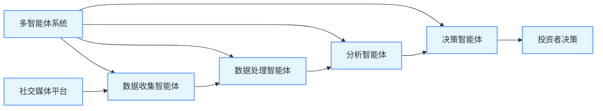

# 价值投资中的AI驱动社交媒体影响力分析：多智能体系统

> 关键词：价值投资、AI驱动、社交媒体影响力分析、多智能体系统、金融决策

> 摘要：本文聚焦于价值投资领域，深入探讨了如何借助AI驱动的多智能体系统对社交媒体影响力进行分析。首先介绍了相关背景，包括目的、预期读者等内容。接着阐述了核心概念，如多智能体系统、社交媒体影响力等，并给出了相应的原理和架构示意图。详细讲解了核心算法原理，用Python代码进行了具体说明，同时给出了数学模型和公式。通过项目实战展示了代码的实际应用和解读。分析了实际应用场景，推荐了相关的工具和资源。最后总结了未来发展趋势与挑战，并提供了常见问题解答和扩展阅读参考资料，旨在为价值投资决策提供基于社交媒体影响力分析的新视角和方法。

## 1. 背景介绍 
### 1.1 目的和范围
在当今数字化时代，社交媒体已经成为信息传播的重要渠道，其蕴含的海量信息对金融市场尤其是价值投资产生着日益显著的影响。本研究的目的在于构建一个基于AI驱动的多智能体系统，用于分析社交媒体影响力对价值投资的作用机制，为投资者提供更准确的决策依据。研究范围涵盖了社交媒体数据的收集、处理、分析，多智能体系统的设计与实现，以及如何将分析结果应用于价值投资决策中。

### 1.2 预期读者
本文预期读者主要包括金融投资领域的从业者，如股票分析师、基金经理等，他们可以借助本文的研究成果优化投资决策；计算机科学领域的研究者和开发者，对AI技术在金融领域的应用感兴趣，可从中获取技术实现思路；以及对价值投资和社交媒体数据分析有兴趣的爱好者，了解相关的理论和实践方法。

### 1.3 文档结构概述
本文将按照以下结构展开：首先介绍核心概念，明确多智能体系统和社交媒体影响力分析的基本原理和架构；接着详细阐述核心算法原理和具体操作步骤，用Python代码进行说明；给出数学模型和公式，并举例讲解；通过项目实战展示代码的实际应用和解读；分析实际应用场景；推荐相关的工具和资源；最后总结未来发展趋势与挑战，提供常见问题解答和扩展阅读参考资料。

### 1.4 术语表
#### 1.4.1 核心术语定义
- **价值投资**：一种投资策略，投资者通过分析股票的内在价值，寻找被低估的股票进行投资，期望在长期内获得稳定的收益。
- **AI驱动**：指利用人工智能技术，如机器学习、深度学习等，来实现系统的自动化、智能化决策和分析。
- **社交媒体影响力**：指社交媒体上的信息传播、用户互动等对公众认知、态度和行为产生的影响程度，在金融领域表现为对股票价格、市场情绪等的影响。
- **多智能体系统**：由多个智能体组成的系统，每个智能体具有一定的自主性和智能，能够感知环境、做出决策并与其他智能体进行交互，以实现系统的整体目标。

#### 1.4.2 相关概念解释
- **自然语言处理（NLP）**：是人工智能的一个分支，主要研究如何让计算机理解和处理人类语言，在社交媒体影响力分析中用于对文本信息进行情感分析、主题提取等。
- **机器学习**：是一门多领域交叉学科，涉及概率论、统计学、逼近论、凸分析、算法复杂度理论等多门学科。它专门研究计算机怎样模拟或实现人类的学习行为，以获取新的知识或技能，重新组织已有的知识结构使之不断改善自身的性能。在本研究中用于构建预测模型，分析社交媒体信息与股票价格的关系。
- **智能体**：是一种能够感知环境、根据自身的目标和知识做出决策并采取行动的实体。在多智能体系统中，智能体可以是软件程序、机器人等。

#### 1.4.3 缩略词列表
- **NLP**：Natural Language Processing（自然语言处理）
- **ML**：Machine Learning（机器学习）
- **LSTM**：Long Short-Term Memory（长短期记忆网络）
- **API**：Application Programming Interface（应用程序编程接口）

## 2. 核心概念与联系 

### 2.1 多智能体系统原理
多智能体系统由多个智能体组成，每个智能体具有以下特点：
- **自主性**：智能体能够独立地感知环境、做出决策并采取行动，不受其他智能体的直接控制。
- **社会性**：智能体可以与其他智能体进行交互，通过通信、协作等方式实现系统的整体目标。
- **反应性**：智能体能够对环境的变化做出及时的反应，调整自己的行为。
- **预动性**：智能体能够根据自身的目标和计划，主动地采取行动，而不仅仅是对环境的被动响应。

在价值投资中的AI驱动社交媒体影响力分析多智能体系统中，智能体可以分为数据收集智能体、数据处理智能体、分析智能体和决策智能体等。数据收集智能体负责从社交媒体平台收集相关信息；数据处理智能体对收集到的数据进行清洗、预处理；分析智能体利用机器学习和自然语言处理技术对数据进行分析，评估社交媒体影响力；决策智能体根据分析结果为投资者提供投资建议。

### 2.2 社交媒体影响力分析原理
社交媒体影响力分析主要基于社交媒体上的文本信息、用户互动数据等，通过自然语言处理和机器学习技术来评估信息的影响力。具体步骤包括：
- **数据收集**：从社交媒体平台（如Twitter、微博等）收集与金融市场、股票相关的信息。
- **文本预处理**：对收集到的文本进行清洗、分词、去除停用词等处理，以便后续分析。
- **情感分析**：利用自然语言处理技术判断文本的情感倾向，如积极、消极或中性。
- **主题提取**：从文本中提取关键主题，了解社交媒体上讨论的热点话题。
- **影响力评估**：综合考虑文本的情感倾向、主题、传播范围等因素，评估社交媒体信息对金融市场的影响力。

### 2.3 核心概念架构示意图


该示意图展示了多智能体系统的架构，各个智能体之间相互协作，完成从社交媒体数据收集到为投资者提供决策建议的整个过程。

## 3. 核心算法原理 & 具体操作步骤 

### 3.1 数据收集算法
数据收集智能体主要使用社交媒体平台提供的API来收集数据。以Twitter为例，使用Python的`tweepy`库可以方便地实现数据收集。以下是一个简单的示例代码：
```python
import tweepy

# 填写你的Twitter API凭证
consumer_key = 'your_consumer_key'
consumer_secret = 'your_consumer_secret'
access_token = 'your_access_token'
access_token_secret = 'your_access_token_secret'

# 认证
auth = tweepy.OAuthHandler(consumer_key, consumer_secret)
auth.set_access_token(access_token, access_token_secret)

# 创建API对象
api = tweepy.API(auth)

# 搜索关键词
query = 'stock market'
tweets = api.search_tweets(q=query, count=100)

# 打印推文内容
for tweet in tweets:
    print(tweet.text)
```
上述代码首先进行了Twitter API的认证，然后使用`search_tweets`方法搜索包含关键词“stock market”的推文，并打印出推文内容。

### 3.2 数据处理算法
数据处理智能体对收集到的数据进行清洗和预处理，主要包括去除特殊字符、分词、去除停用词等操作。以下是一个使用Python的`nltk`库进行数据处理的示例代码：
```python
import re
import nltk
from nltk.corpus import stopwords
from nltk.tokenize import word_tokenize

nltk.download('stopwords')
nltk.download('punkt')

# 示例推文
tweet = "RT @StockNews: The #stockmarket is looking good today! #investing"

# 去除特殊字符和链接
cleaned_tweet = re.sub(r'http\S+|#\w+|@\w+|[^\w\s]', '', tweet)

# 分词
tokens = word_tokenize(cleaned_tweet.lower())

# 去除停用词
stop_words = set(stopwords.words('english'))
filtered_tokens = [token for token in tokens if token not in stop_words]

print(filtered_tokens)
```
上述代码首先使用正则表达式去除推文中的特殊字符和链接，然后使用`nltk`库进行分词和去除停用词操作，最后打印出处理后的词列表。

### 3.3 情感分析算法
情感分析智能体使用机器学习模型来判断文本的情感倾向。这里我们使用`TextBlob`库进行简单的情感分析，以下是示例代码：
```python
from textblob import TextBlob

# 示例推文
tweet = "The stock market is doing great today!"

# 进行情感分析
analysis = TextBlob(tweet)
polarity = analysis.sentiment.polarity

if polarity > 0:
    sentiment = 'Positive'
elif polarity < 0:
    sentiment = 'Negative'
else:
    sentiment = 'Neutral'

print(f"Sentiment: {sentiment}, Polarity: {polarity}")
```
上述代码使用`TextBlob`库对推文进行情感分析，根据极性值判断情感倾向，并打印出结果。

### 3.4 影响力评估算法
影响力评估智能体综合考虑文本的情感倾向、主题、传播范围等因素，评估社交媒体信息对金融市场的影响力。这里我们简单地使用情感极性和推文的转发数来评估影响力，以下是示例代码：
```python
# 示例推文信息
tweet = {
    'text': "The stock market is doing great today!",
    'retweet_count': 100
}

# 进行情感分析
from textblob import TextBlob
analysis = TextBlob(tweet['text'])
polarity = analysis.sentiment.polarity

# 计算影响力得分
influence_score = polarity * tweet['retweet_count']

print(f"Influence Score: {influence_score}")
```
上述代码根据推文的情感极性和转发数计算影响力得分，得分越高表示影响力越大。

## 4. 数学模型和公式 & 详细讲解 & 举例说明 

### 4.1 情感分析数学模型
情感分析通常使用基于机器学习的分类模型，如朴素贝叶斯分类器、支持向量机等。这里我们以朴素贝叶斯分类器为例，介绍其数学原理。

朴素贝叶斯分类器基于贝叶斯定理，公式如下：
$$P(c|x)=\frac{P(x|c)P(c)}{P(x)}$$
其中，$P(c|x)$ 表示在给定特征 $x$ 的情况下，属于类别 $c$ 的概率；$P(x|c)$ 表示在类别 $c$ 下出现特征 $x$ 的概率；$P(c)$ 表示类别 $c$ 出现的先验概率；$P(x)$ 表示特征 $x$ 出现的概率。

在情感分析中，特征 $x$ 可以是文本中的词，类别 $c$ 可以是积极、消极或中性。由于 $P(x)$ 对于所有类别都是相同的，因此在分类时可以忽略，只需要比较 $P(x|c)P(c)$ 的大小即可。

例如，假设我们有一个训练集，包含100条积极推文和100条消极推文。在积极推文中，“good” 这个词出现了20次；在消极推文中，“good” 这个词出现了5次。现在有一条新的推文 “This stock is good”，我们要判断它的情感倾向。

首先计算先验概率：
$P(positive)=\frac{100}{200}=0.5$
$P(negative)=\frac{100}{200}=0.5$

然后计算条件概率：
$P('good'|positive)=\frac{20}{100}=0.2$
$P('good'|negative)=\frac{5}{100}=0.05$

最后计算后验概率：
$P(positive|'good') \propto P('good'|positive)P(positive)=0.2\times0.5 = 0.1$
$P(negative|'good') \propto P('good'|negative)P(negative)=0.05\times0.5 = 0.025$

由于 $P(positive|'good') > P(negative|'good')$，因此判断这条推文为积极情感。

### 4.2 影响力评估数学模型
影响力评估可以使用综合得分模型，综合考虑情感极性、传播范围等因素。公式如下：
$$I = \alpha\times p\times r + \beta\times t$$
其中，$I$ 表示影响力得分；$\alpha$ 和 $\beta$ 是权重系数，用于调整情感极性和传播范围、主题的重要性；$p$ 是情感极性，取值范围为 $[-1, 1]$；$r$ 是传播范围，如转发数、点赞数等；$t$ 是主题相关性得分，取值范围为 $[0, 1]$。

例如，假设 $\alpha = 0.8$，$\beta = 0.2$，一条推文的情感极性 $p = 0.8$，转发数 $r = 200$，主题相关性得分 $t = 0.9$，则影响力得分计算如下：
$$I = 0.8\times0.8\times200 + 0.2\times0.9 = 128 + 0.18 = 128.18$$

## 5. 项目实战：代码实际案例和详细解释说明 

### 5.1  开发环境搭建
#### 5.1.1 安装Python
首先需要安装Python，建议使用Python 3.7及以上版本。可以从Python官方网站（https://www.python.org/downloads/）下载安装包，按照安装向导进行安装。

#### 5.1.2 安装必要的库
使用`pip`命令安装项目所需的库，以下是一些常用的库：
```sh
pip install tweepy nltk textblob
```

### 5.2  源代码详细实现和代码解读
以下是一个完整的项目代码示例，实现了从数据收集到影响力评估的整个流程：
```python
import tweepy
import re
import nltk
from nltk.corpus import stopwords
from nltk.tokenize import word_tokenize
from textblob import TextBlob

# 填写你的Twitter API凭证
consumer_key = 'your_consumer_key'
consumer_secret = 'your_consumer_secret'
access_token = 'your_access_token'
access_token_secret = 'your_access_token_secret'

# 认证
auth = tweepy.OAuthHandler(consumer_key, consumer_secret)
auth.set_access_token(access_token, access_token_secret)

# 创建API对象
api = tweepy.API(auth)

# 下载必要的nltk数据
nltk.download('stopwords')
nltk.download('punkt')

# 数据收集
def collect_tweets(query, count=100):
    tweets = api.search_tweets(q=query, count=count)
    return tweets

# 数据处理
def process_tweet(tweet):
    # 去除特殊字符和链接
    cleaned_tweet = re.sub(r'http\S+|#\w+|@\w+|[^\w\s]', '', tweet.text)
    # 分词
    tokens = word_tokenize(cleaned_tweet.lower())
    # 去除停用词
    stop_words = set(stopwords.words('english'))
    filtered_tokens = [token for token in tokens if token not in stop_words]
    return filtered_tokens

# 情感分析
def sentiment_analysis(tweet):
    analysis = TextBlob(tweet.text)
    polarity = analysis.sentiment.polarity
    if polarity > 0:
        sentiment = 'Positive'
    elif polarity < 0:
        sentiment = 'Negative'
    else:
        sentiment = 'Neutral'
    return sentiment, polarity

# 影响力评估
def influence_evaluation(tweet):
    sentiment, polarity = sentiment_analysis(tweet)
    retweet_count = tweet.retweet_count
    influence_score = polarity * retweet_count
    return influence_score

# 主函数
def main():
    query = 'stock market'
    tweets = collect_tweets(query)
    for tweet in tweets:
        processed_tweet = process_tweet(tweet)
        sentiment, polarity = sentiment_analysis(tweet)
        influence_score = influence_evaluation(tweet)
        print(f"Tweet: {tweet.text}")
        print(f"Processed Tweet: {processed_tweet}")
        print(f"Sentiment: {sentiment}, Polarity: {polarity}")
        print(f"Influence Score: {influence_score}")
        print("-" * 50)

if __name__ == "__main__":
    main()
```
### 5.3  代码解读与分析
- **数据收集函数`collect_tweets`**：使用Twitter API搜索包含指定关键词的推文，并返回推文列表。
- **数据处理函数`process_tweet`**：对推文进行清洗、分词和去除停用词操作，返回处理后的词列表。
- **情感分析函数`sentiment_analysis`**：使用`TextBlob`库对推文进行情感分析，返回情感倾向和极性值。
- **影响力评估函数`influence_evaluation`**：根据推文的情感极性和转发数计算影响力得分。
- **主函数`main`**：调用上述函数，完成从数据收集到影响力评估的整个流程，并打印出结果。

## 6. 实际应用场景 
### 6.1 投资决策辅助
投资者可以利用多智能体系统对社交媒体影响力进行分析，了解市场情绪和热点话题，从而辅助投资决策。例如，如果社交媒体上对某只股票的讨论以积极情感为主，且影响力得分较高，投资者可以考虑增加对该股票的投资。

### 6.2 风险预警
通过监测社交媒体上的负面信息和异常波动，多智能体系统可以及时发出风险预警。例如，如果某只股票在社交媒体上突然出现大量负面评价，且影响力得分迅速上升，投资者可以及时采取措施，如减仓或止损。

### 6.3 公司声誉管理
上市公司可以利用多智能体系统分析社交媒体上关于公司的信息，了解公众对公司的看法和评价，及时发现并处理负面信息，维护公司的声誉。

### 6.4 市场趋势预测
多智能体系统可以通过分析社交媒体上的长期数据，发现市场趋势和规律，为投资者提供市场趋势预测，帮助他们制定长期投资策略。

## 7. 工具和资源推荐
### 7.1 学习资源推荐
#### 7.1.1 书籍推荐
- 《Python数据分析实战》：介绍了Python在数据分析领域的应用，包括数据收集、处理、分析和可视化等方面的知识。
- 《机器学习实战》：通过实际案例详细介绍了机器学习的各种算法和应用，适合初学者入门。
- 《自然语言处理入门》：系统地介绍了自然语言处理的基本概念、算法和应用，为社交媒体影响力分析提供了理论基础。

#### 7.1.2 在线课程
- Coursera上的“Machine Learning”课程：由斯坦福大学教授Andrew Ng授课，是机器学习领域的经典课程，涵盖了机器学习的基本概念、算法和应用。
- edX上的“Natural Language Processing with Deep Learning”课程：介绍了深度学习在自然语言处理中的应用，包括文本分类、情感分析等方面的知识。
- 网易云课堂上的“Python数据分析与挖掘实战”课程：结合实际案例，介绍了Python在数据分析和挖掘领域的应用。

#### 7.1.3 技术博客和网站
- Medium：是一个技术博客平台，上面有很多关于人工智能、数据分析等领域的优秀文章。
- Towards Data Science：专注于数据科学领域的技术博客，提供了大量的数据分析、机器学习等方面的教程和案例。
- Kaggle：是一个数据科学竞赛平台，上面有很多数据集和优秀的数据分析代码，可以学习和借鉴。

### 7.2 开发工具框架推荐
#### 7.2.1 IDE和编辑器
- PyCharm：是一款专门为Python开发设计的集成开发环境，具有代码编辑、调试、自动补全、版本控制等功能，适合专业开发者使用。
- Jupyter Notebook：是一个基于Web的交互式开发环境，支持Python、R等多种编程语言，适合数据分析和机器学习的快速原型开发。
- Visual Studio Code：是一款轻量级的代码编辑器，支持多种编程语言和插件扩展，具有丰富的代码编辑和调试功能。

#### 7.2.2 调试和性能分析工具
- Py-Spy：是一个用于Python代码性能分析的工具，可以实时监测Python程序的CPU使用率、函数调用次数等信息，帮助开发者找出性能瓶颈。
- PDB：是Python自带的调试器，可以在代码中设置断点，逐行调试程序，方便开发者查找和解决问题。
- Memory Profiler：是一个用于Python内存分析的工具，可以分析Python程序的内存使用情况，帮助开发者优化内存占用。

#### 7.2.3 相关框架和库
- TensorFlow：是一个开源的机器学习框架，由Google开发，广泛应用于深度学习领域，提供了丰富的深度学习模型和工具。
- PyTorch：是另一个开源的深度学习框架，由Facebook开发，具有动态图、易于使用等特点，受到了很多研究者和开发者的喜爱。
- Scikit-learn：是一个用于机器学习的Python库，提供了丰富的机器学习算法和工具，如分类、回归、聚类等。

### 7.3 相关论文著作推荐
#### 7.3.1 经典论文
- “A Sentimental Education: Sentiment Analysis Using Subjectivity Summarization Based on Minimum Cuts”：提出了一种基于最小割的主观性总结方法，用于情感分析。
- “Convolutional Neural Networks for Sentence Classification”：介绍了卷积神经网络在句子分类中的应用，为文本分类提供了新的思路。
- “Long Short-Term Memory”：详细介绍了长短期记忆网络（LSTM）的原理和应用，是深度学习领域的经典论文。

#### 7.3.2 最新研究成果
- 关注顶级学术会议，如NeurIPS（神经信息处理系统大会）、ICML（国际机器学习会议）、ACL（计算语言学协会年会）等，这些会议上会发表很多关于人工智能、自然语言处理等领域的最新研究成果。
- 查阅学术期刊，如Journal of Artificial Intelligence Research（JAIR）、Artificial Intelligence（AI）等，这些期刊上会刊登高质量的学术论文。

#### 7.3.3 应用案例分析
- 可以在金融科技公司的官方网站、研究报告中查找关于价值投资中社交媒体影响力分析的应用案例，了解实际应用中的问题和解决方案。
- 参考相关的行业报告和白皮书，如德勤、毕马威等咨询公司发布的金融科技报告，了解行业的发展趋势和应用案例。

## 8. 总结：未来发展趋势与挑战
### 8.1 未来发展趋势
- **多模态数据融合**：未来的社交媒体影响力分析将不仅仅局限于文本信息，还会融合图像、视频等多模态数据，以更全面地评估影响力。
- **深度学习技术的广泛应用**：随着深度学习技术的不断发展，更复杂的模型如Transformer、BERT等将被应用于社交媒体影响力分析，提高分析的准确性和效率。
- **与区块链技术结合**：区块链技术的去中心化、不可篡改等特点可以为社交媒体数据的真实性和可靠性提供保障，与多智能体系统结合可以构建更可信的影响力分析平台。
- **个性化分析**：根据投资者的偏好和需求，提供个性化的社交媒体影响力分析服务，帮助投资者做出更符合自身情况的投资决策。

### 8.2 挑战
- **数据质量问题**：社交媒体上的数据存在大量的噪声和虚假信息，如何保证数据的质量是一个挑战。需要开发更有效的数据清洗和验证方法，去除噪声和虚假信息。
- **隐私保护问题**：在收集和分析社交媒体数据时，需要保护用户的隐私。需要遵守相关的法律法规，采取适当的技术手段，确保用户数据的安全和隐私。
- **模型可解释性问题**：深度学习模型通常是黑盒模型，难以解释其决策过程。在价值投资领域，投资者需要了解模型的决策依据，因此提高模型的可解释性是一个重要的挑战。
- **实时性要求**：金融市场变化迅速，需要实时分析社交媒体影响力。如何在短时间内处理大量的数据并做出准确的决策，对系统的实时性提出了很高的要求。

## 9. 附录：常见问题与解答
### 9.1 如何选择合适的社交媒体平台进行数据收集？
选择社交媒体平台需要考虑以下因素：
- **用户群体**：选择与金融市场相关的用户群体较多的平台，如Twitter、StockTwits等。
- **数据可用性**：选择提供API接口，方便数据收集的平台。
- **信息质量**：选择信息质量较高，虚假信息较少的平台。

### 9.2 如何提高情感分析的准确性？
可以从以下几个方面提高情感分析的准确性：
- **使用更复杂的模型**：如深度学习模型，如LSTM、Transformer等。
- **增加训练数据**：使用更多的标注数据进行训练，提高模型的泛化能力。
- **结合领域知识**：考虑金融领域的特殊词汇和语境，提高情感分析的准确性。

### 9.3 多智能体系统如何进行智能体之间的协作？
多智能体系统可以通过以下方式进行智能体之间的协作：
- **消息传递**：智能体之间通过发送和接收消息进行通信，共享信息和协调行动。
- **合同网协议**：通过招标、投标、中标等过程，实现智能体之间的任务分配和协作。
- **社会规范和规则**：定义智能体之间的行为规范和规则，约束智能体的行为，实现系统的整体目标。

### 9.4 如何评估多智能体系统的性能？
可以从以下几个方面评估多智能体系统的性能：
- **准确性**：评估系统的分析结果与实际情况的符合程度。
- **效率**：评估系统的处理速度和响应时间。
- **鲁棒性**：评估系统在面对噪声、异常数据等情况下的稳定性和可靠性。
- **可扩展性**：评估系统在增加智能体数量或处理大规模数据时的性能表现。

## 10. 扩展阅读 & 参考资料
- [Tweepy官方文档](https://docs.tweepy.org/en/stable/)
- [NLTK官方文档](https://www.nltk.org/)
- [TextBlob官方文档](https://textblob.readthedocs.io/en/dev/)
- [TensorFlow官方文档](https://www.tensorflow.org/)
- [PyTorch官方文档](https://pytorch.org/)
- [Scikit-learn官方文档](https://scikit-learn.org/stable/)

作者：AI天才研究院/AI Genius Institute & 禅与计算机程序设计艺术 /Zen And The Art of Computer Programming