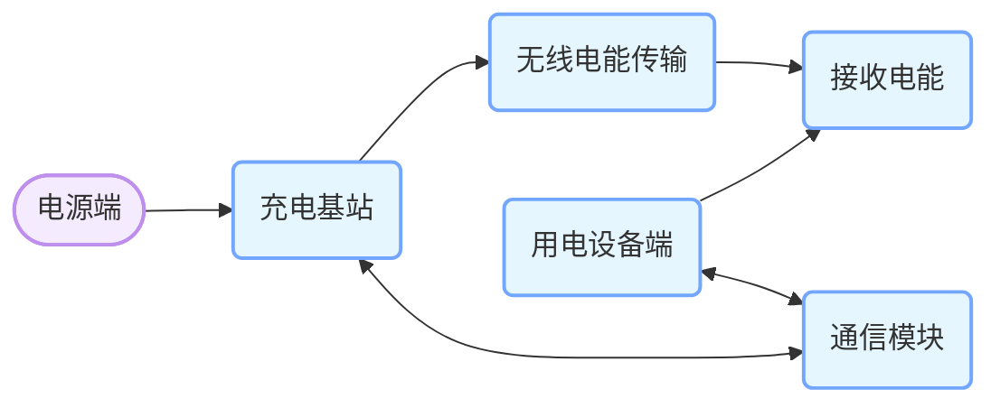

# 价值投资中的下一代无线充电网络技术前景

> 关键词：价值投资、下一代无线充电网络技术、技术前景、市场潜力、应用场景

> 摘要：本文围绕价值投资视角下的下一代无线充电网络技术前景展开探讨。首先介绍了文章的背景信息，包括目的范围、预期读者等内容。接着阐述了无线充电网络的核心概念与联系，详细讲解了核心算法原理及操作步骤，并给出数学模型和公式。通过项目实战案例，深入分析了代码实现与解读。同时探讨了该技术的实际应用场景，推荐了相关的工具和资源。最后总结了其未来发展趋势与挑战，提供常见问题解答及扩展阅读参考资料，旨在为价值投资者和相关技术人员全面呈现下一代无线充电网络技术的发展态势和投资价值。

## 1. 背景介绍 
### 1.1 目的和范围
本文章的主要目的是从价值投资的角度深入分析下一代无线充电网络技术的前景。通过对该技术的核心概念、算法原理、数学模型等方面的详细阐述，结合实际项目案例和应用场景，评估其在市场中的潜力和投资价值。范围涵盖了下一代无线充电网络技术的技术原理、发展现状、未来趋势以及可能面临的挑战，旨在为投资者、技术开发者和相关研究人员提供全面的参考信息。

### 1.2 预期读者
预期读者主要包括对价值投资感兴趣的投资者，他们希望通过了解新兴技术的发展前景来寻找有潜力的投资项目；无线充电技术领域的开发者和研究人员，他们可以从本文中获取关于下一代无线充电网络技术的最新知识和技术细节；以及对科技发展趋势关注的行业分析师和决策者，他们可以根据本文的分析来制定相关的战略和决策。

### 1.3 文档结构概述
本文将按照以下结构进行阐述：首先介绍背景信息，包括目的范围、预期读者等；接着讲解核心概念与联系，通过文本示意图和 Mermaid 流程图展示无线充电网络的架构；然后详细说明核心算法原理及具体操作步骤，并给出 Python 源代码；之后介绍数学模型和公式，并举例说明；通过项目实战案例，包括开发环境搭建、源代码实现和解读，深入分析该技术的实际应用；探讨实际应用场景；推荐相关的工具和资源，包括学习资源、开发工具框架和相关论文著作；最后总结未来发展趋势与挑战，提供常见问题解答及扩展阅读参考资料。

### 1.4 术语表
#### 1.4.1 核心术语定义
- **无线充电网络技术**：是一种利用电磁感应、磁共振、无线电波等技术，实现将电能从电源端无线传输到用电设备的充电方式，并通过构建网络实现多设备、大范围的充电功能。
- **价值投资**：是一种投资策略，投资者通过分析资产的内在价值，寻找被低估的投资标的，长期持有以获取价值增长带来的收益。
- **电磁感应**：是指闭合电路的一部分导体在磁场中做切割磁感线运动时，导体中就会产生电流的现象，无线充电中常利用此原理实现电能的初步传输。
- **磁共振**：是指具有磁矩的原子核在恒定磁场中由电磁波引起的共振跃迁现象，在无线充电中可实现更远距离和更高效率的能量传输。

#### 1.4.2 相关概念解释
- **Qi 标准**：是目前应用最广泛的无线充电标准，它基于电磁感应原理，规定了无线充电设备的接口、通信协议和充电功率等参数，确保不同厂商的设备之间具有兼容性。
- **能量传输效率**：指在无线充电过程中，从电源端传输到用电设备端的有效能量与电源端输出总能量的比值，是衡量无线充电技术性能的重要指标之一。
- **充电覆盖范围**：指无线充电网络能够有效为用电设备提供充电功能的空间范围，包括充电距离和充电区域大小。

#### 1.4.3 缩略词列表
- **NFC**：Near Field Communication，近场通信，是一种短距离的高频无线通信技术，可用于无线充电设备之间的通信和数据传输。
- **RF**：Radio Frequency，射频，是一种高频交流变化电磁波，常用于无线电波无线充电技术中。

## 2. 核心概念与联系 
下一代无线充电网络技术主要基于电磁感应、磁共振和无线电波等原理来实现电能的无线传输。其核心架构主要包括电源端、充电基站、通信模块和用电设备端。

### 文本示意图
电源端将市电转换为适合无线传输的电能形式，通过充电基站以无线方式将电能传输到周围空间。通信模块用于充电基站与用电设备之间的信息交互，包括充电状态、电量需求等。用电设备端则接收无线电能并将其转换为设备可使用的电能进行充电。

### Mermaid 流程图


## 3. 核心算法原理 & 具体操作步骤 
### 算法原理
在下一代无线充电网络中，为了实现高效的能量传输和设备管理，需要采用智能的能量分配算法。以下是一个简单的能量分配算法原理：根据用电设备的电量需求和与充电基站的距离，动态调整每个设备的充电功率。

### Python 源代码实现
```python
# 定义用电设备类
class Device:
    def __init__(self, id, power_demand, distance):
        self.id = id
        self.power_demand = power_demand
        self.distance = distance

# 定义充电基站类
class ChargingBaseStation:
    def __init__(self, total_power):
        self.total_power = total_power
        self.devices = []

    def add_device(self, device):
        self.devices.append(device)

    def energy_allocation(self):
        total_demand = sum([device.power_demand for device in self.devices])
        if total_demand <= self.total_power:
            # 总需求小于等于总功率，满足所有设备需求
            for device in self.devices:
                device.allocated_power = device.power_demand
        else:
            # 总需求大于总功率，按距离和需求分配
            sorted_devices = sorted(self.devices, key=lambda x: x.distance)
            remaining_power = self.total_power
            for device in sorted_devices:
                if remaining_power >= device.power_demand:
                    device.allocated_power = device.power_demand
                    remaining_power -= device.power_demand
                else:
                    device.allocated_power = remaining_power
                    remaining_power = 0
        return {device.id: device.allocated_power for device in self.devices}

# 示例使用
if __name__ == "__main__":
    base_station = ChargingBaseStation(total_power=100)
    device1 = Device(id=1, power_demand=30, distance=1)
    device2 = Device(id=2, power_demand=40, distance=2)
    device3 = Device(id=3, power_demand=50, distance=3)
    base_station.add_device(device1)
    base_station.add_device(device2)
    base_station.add_device(device3)
    allocation_result = base_station.energy_allocation()
    print("能量分配结果:", allocation_result)
```

### 具体操作步骤
1. **设备信息收集**：充电基站通过通信模块收集周围用电设备的电量需求和与基站的距离信息。
2. **设备添加**：将收集到的设备信息添加到充电基站的设备列表中。
3. **能量分配计算**：根据设备的电量需求和距离，调用能量分配算法计算每个设备的分配功率。
4. **功率调整**：充电基站根据计算结果调整对每个设备的充电功率。

## 4. 数学模型和公式 & 详细讲解 & 举例说明 
### 数学模型
在无线充电网络中，能量传输效率 $\eta$ 是一个重要的指标，它与充电距离 $d$、充电功率 $P$ 等因素有关。可以建立以下数学模型：

$$\eta = f(d, P)$$

其中，$f$ 是一个函数，通常可以表示为：

$$\eta = \frac{\eta_0}{1 + k_1d^2 + k_2P}$$

$\eta_0$ 是初始能量传输效率，$k_1$ 和 $k_2$ 是与充电环境和设备特性有关的常数。

### 详细讲解
- $\eta_0$：表示在理想情况下（充电距离为 0，充电功率为 0）的能量传输效率，是一个理论最大值。
- $k_1d^2$：表示充电距离对能量传输效率的影响，随着充电距离的增加，能量传输效率会急剧下降。
- $k_2P$：表示充电功率对能量传输效率的影响，充电功率越大，能量传输过程中的损耗也越大，导致效率降低。

### 举例说明
假设 $\eta_0 = 0.9$，$k_1 = 0.1$，$k_2 = 0.01$，充电距离 $d = 2$ 米，充电功率 $P = 50$ 瓦。则能量传输效率为：

$$\eta = \frac{0.9}{1 + 0.1\times2^2 + 0.01\times50}$$

$$\eta = \frac{0.9}{1 + 0.4 + 0.5}$$

$$\eta = \frac{0.9}{1.9} \approx 0.474$$

即能量传输效率约为 47.4%。

## 5. 项目实战：代码实际案例和详细解释说明 
### 5.1  开发环境搭建
#### 硬件环境
- **充电基站**：选择支持下一代无线充电技术的充电基站设备，如具有多线圈设计、高功率输出的产品。
- **用电设备**：准备具有无线充电功能的设备，如智能手机、智能手表等。
- **通信模块**：使用 NFC 或 RF 通信模块，实现充电基站与用电设备之间的信息交互。

#### 软件环境
- **操作系统**：选择适合开发的操作系统，如 Linux 或 Windows。
- **开发语言**：使用 Python 作为开发语言，因为它具有丰富的库和简洁的语法。
- **开发工具**：使用 PyCharm 作为集成开发环境（IDE），方便代码的编写、调试和管理。

### 5.2  源代码详细实现和代码解读
#### 代码实现
```python
import random

# 定义用电设备类
class Device:
    def __init__(self, id):
        self.id = id
        self.power_demand = random.randint(10, 50)  # 随机生成电量需求
        self.distance = random.uniform(0.5, 2)  # 随机生成距离
        self.allocated_power = 0

    def __str__(self):
        return f"Device {self.id}: Demand={self.power_demand}W, Distance={self.distance}m, Allocated={self.allocated_power}W"

# 定义充电基站类
class ChargingBaseStation:
    def __init__(self, total_power):
        self.total_power = total_power
        self.devices = []

    def add_device(self, device):
        self.devices.append(device)

    def energy_allocation(self):
        total_demand = sum([device.power_demand for device in self.devices])
        if total_demand <= self.total_power:
            # 总需求小于等于总功率，满足所有设备需求
            for device in self.devices:
                device.allocated_power = device.power_demand
        else:
            # 总需求大于总功率，按距离和需求分配
            sorted_devices = sorted(self.devices, key=lambda x: x.distance)
            remaining_power = self.total_power
            for device in sorted_devices:
                if remaining_power >= device.power_demand:
                    device.allocated_power = device.power_demand
                    remaining_power -= device.power_demand
                else:
                    device.allocated_power = remaining_power
                    remaining_power = 0
        return {device.id: device.allocated_power for device in self.devices}

# 主程序
if __name__ == "__main__":
    base_station = ChargingBaseStation(total_power=100)
    for i in range(5):
        device = Device(i)
        base_station.add_device(device)
    allocation_result = base_station.energy_allocation()
    print("能量分配结果:", allocation_result)
    for device in base_station.devices:
        print(device)
```

#### 代码解读
- **Device 类**：表示用电设备，包含设备的 ID、电量需求、与充电基站的距离和分配的功率等属性。电量需求和距离在初始化时随机生成。
- **ChargingBaseStation 类**：表示充电基站，包含总功率和设备列表等属性。`add_device` 方法用于添加设备到设备列表中，`energy_allocation` 方法实现能量分配算法。
- **主程序**：创建一个充电基站对象，添加 5 个用电设备，调用能量分配方法进行能量分配，并输出分配结果和每个设备的信息。

### 5.3  代码解读与分析
#### 代码优点
- **简单易懂**：代码结构清晰，使用 Python 语言实现，易于理解和维护。
- **可扩展性**：可以方便地扩展设备类和充电基站类的功能，如添加更多的设备属性和优化能量分配算法。
- **模拟真实场景**：通过随机生成设备的电量需求和距离，模拟了真实的无线充电场景。

#### 代码局限性
- **简化模型**：能量分配算法是一个简化的模型，没有考虑更多的实际因素，如设备的优先级、充电状态等。
- **缺乏通信模块**：代码中没有实现充电基站与用电设备之间的通信模块，实际应用中需要添加该功能。

## 6. 实际应用场景 
### 智能家居场景
在智能家居中，下一代无线充电网络技术可以实现各种智能设备的无线充电。例如，智能手表、智能手环、智能音箱等设备可以随时随地在房间内进行无线充电，无需插拔充电器。用户可以将这些设备随意放置在充电区域内，实现自动充电，提高了使用的便利性。

### 电动汽车场景
电动汽车的无线充电是下一代无线充电网络技术的一个重要应用场景。通过在停车场、公路等地方建设无线充电设施，电动汽车可以在停车或行驶过程中进行无线充电。这不仅解决了传统充电桩充电不方便的问题，还可以提高电动汽车的续航能力，促进电动汽车的普及。

### 工业制造场景
在工业制造中，一些移动设备和机器人需要频繁充电。使用无线充电网络技术可以实现这些设备的自动充电，减少人工干预，提高生产效率。例如，自动化仓储系统中的AGV（自动导引车）可以在运行过程中自动充电，保证系统的连续运行。

### 医疗设备场景
在医疗领域，一些医疗设备需要保持持续供电。无线充电网络技术可以为这些设备提供稳定的充电解决方案。例如，便携式医疗监测设备、植入式医疗设备等可以通过无线充电方式获取电能，避免了频繁更换电池的麻烦，提高了设备的使用安全性和可靠性。

## 7. 工具和资源推荐
### 7.1 学习资源推荐
#### 7.1.1 书籍推荐
- 《无线电能传输技术原理与应用》：全面介绍了无线电能传输的基本原理、技术方法和应用案例，适合初学者和专业人士阅读。
- 《电磁学》：经典的电磁学教材，对于理解无线充电的电磁感应、磁共振等原理有很大帮助。
- 《Python 数据分析实战》：Python 是一种常用的开发语言，这本书可以帮助读者掌握 Python 在数据分析和算法实现方面的应用。

#### 7.1.2 在线课程
- Coursera 上的“Wireless Power Transfer”课程：由知名大学的教授授课，系统讲解了无线电能传输的理论和技术。
- edX 上的“Python for Data Science”课程：帮助读者学习 Python 在数据科学领域的应用，对于开发无线充电网络的能量分配算法有很大帮助。

#### 7.1.3 技术博客和网站
- IEEE Xplore：提供了大量关于无线充电技术的学术论文和研究报告，是获取最新技术信息的重要来源。
- Hackster.io：分享了许多无线充电项目的实践经验和代码，对于实际项目开发有很大的参考价值。

### 7.2 开发工具框架推荐
#### 7.2.1 IDE和编辑器
- PyCharm：功能强大的 Python 集成开发环境，提供了代码编辑、调试、版本控制等功能，提高了开发效率。
- Visual Studio Code：轻量级的代码编辑器，支持多种编程语言，具有丰富的插件扩展功能。

#### 7.2.2 调试和性能分析工具
- PDB：Python 自带的调试工具，可以帮助开发者定位代码中的问题。
- cProfile：Python 的性能分析工具，可以分析代码的运行时间和内存使用情况，优化代码性能。

#### 7.2.3 相关框架和库
- NumPy：用于科学计算的 Python 库，提供了高效的数组操作和数学函数，在实现能量分配算法时可以提高计算效率。
- Pandas：用于数据处理和分析的 Python 库，可以方便地处理设备信息和充电数据。

### 7.3 相关论文著作推荐
#### 7.3.1 经典论文
- “A Critical Review of Recent Progress in Mid-Range Wireless Power Transfer”：对中距离无线电能传输技术的最新进展进行了全面的综述，分析了各种技术的优缺点和应用前景。
- “Magnetic Resonance Coupling As a Potential Means for Wireless Power Transfer to Multiple Small Receivers”：提出了磁共振耦合无线充电技术，为实现多设备、远距离的无线充电提供了理论基础。

#### 7.3.2 最新研究成果
- 在 IEEE Transactions on Power Electronics 等学术期刊上发表的关于无线充电技术的最新研究论文，关注技术的创新和突破。

#### 7.3.3 应用案例分析
- 一些企业和研究机构发布的无线充电技术应用案例报告，如电动汽车无线充电项目案例、智能家居无线充电解决方案等，为实际应用提供了参考。

## 8. 总结：未来发展趋势与挑战
### 未来发展趋势
#### 更高的能量传输效率
随着技术的不断进步，下一代无线充电网络技术将实现更高的能量传输效率。通过优化电磁感应、磁共振等原理的应用，减少能量传输过程中的损耗，提高充电效率，降低能源消耗。

#### 更远的充电距离
未来的无线充电技术将能够实现更远的充电距离。从目前的几厘米到几十厘米，逐步发展到数米甚至更远的距离。这将使得无线充电的应用场景更加广泛，如在大型商场、停车场等场所实现全覆盖的无线充电。

#### 多设备同时充电
为了满足用户同时使用多个设备的需求，下一代无线充电网络技术将支持多设备同时充电。充电基站可以智能地识别和分配能量给多个不同类型的设备，提高充电的便利性和效率。

#### 与其他技术的融合
无线充电技术将与物联网、人工智能等技术深度融合。通过物联网技术，实现充电设备的远程监控和管理；利用人工智能算法，优化能量分配和充电策略，提高系统的智能化水平。

### 挑战
#### 技术标准不统一
目前无线充电技术存在多种标准，如 Qi 标准、PMA 标准等，不同标准之间的兼容性较差。这给用户带来了不便，也限制了无线充电技术的推广和应用。未来需要建立统一的技术标准，促进产业的健康发展。

#### 安全问题
无线充电过程中会产生电磁辐射，长期暴露在电磁辐射环境中可能对人体健康造成影响。此外，无线充电设备的过热、短路等问题也可能引发安全事故。因此，需要加强对无线充电技术的安全研究和监管，确保用户的使用安全。

#### 成本较高
下一代无线充电网络技术的研发和生产成本较高，包括充电基站的建设、用电设备的改造等。这使得无线充电技术的普及面临一定的困难。需要通过技术创新和规模化生产，降低成本，提高市场竞争力。

## 9. 附录：常见问题与解答
### 1. 下一代无线充电网络技术的充电效率能达到多少？
目前，下一代无线充电网络技术的充电效率还在不断提高中。在理想情况下，一些先进的技术可以达到 80% 以上的充电效率，但实际应用中会受到充电距离、充电环境等因素的影响，充电效率可能会有所降低。

### 2. 无线充电对人体健康有危害吗？
正规的无线充电设备在设计和生产过程中会遵循相关的安全标准，确保电磁辐射水平在安全范围内。一般来说，正常使用无线充电设备不会对人体健康造成危害。但如果长时间近距离接触高功率的无线充电设备，可能会增加潜在的健康风险。

### 3. 下一代无线充电网络技术可以应用于哪些设备？
下一代无线充电网络技术可以应用于各种电子设备，如智能手机、智能手表、智能音箱、电动汽车、医疗设备等。只要设备具备相应的无线充电接收模块，就可以使用无线充电功能。

### 4. 无线充电网络的建设成本高吗？
无线充电网络的建设成本相对较高，主要包括充电基站的设备采购、安装调试、网络通信等方面的费用。此外，用电设备也需要进行相应的改造，以支持无线充电功能。但随着技术的发展和规模化生产，建设成本有望逐渐降低。

## 10. 扩展阅读 & 参考资料
### 扩展阅读
- 《物联网：技术、应用与创新》：了解物联网技术与无线充电技术的融合应用。
- 《人工智能：现代方法》：学习人工智能算法在无线充电网络能量分配和管理中的应用。

### 参考资料
- [IEEE Xplore](https://ieeexplore.ieee.org/)
- [Hackster.io](https://www.hackster.io/)
- [Qi 标准官方网站](https://www.wirelesspowerconsortium.com/)

作者：AI天才研究院/AI Genius Institute & 禅与计算机程序设计艺术 /Zen And The Art of Computer Programming