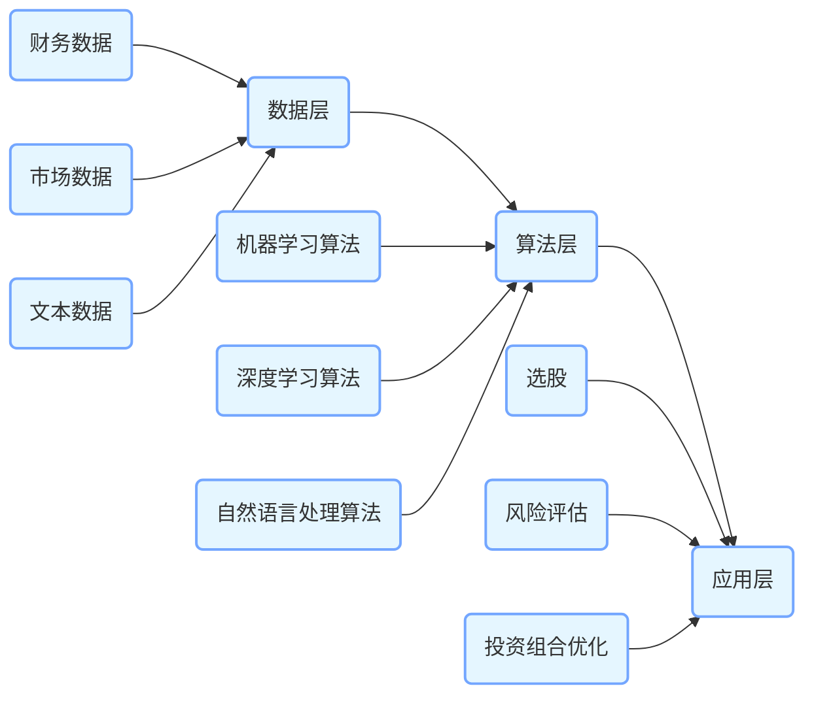

# 价值投资中的人工智能应用：提高效率与洞察

> 关键词：价值投资、人工智能、效率提升、市场洞察、机器学习

> 摘要：本文深入探讨了价值投资中人工智能的应用，旨在揭示如何利用人工智能技术提高投资效率和增强市场洞察能力。首先介绍了价值投资和人工智能的背景知识，然后详细阐述了人工智能相关核心概念、算法原理、数学模型，接着通过项目实战展示其具体应用，分析了实际应用场景，推荐了相关工具和资源，最后总结了未来发展趋势与挑战，并提供常见问题解答和参考资料。通过对这些内容的探讨，为投资者和相关从业者提供全面且深入的技术与投资知识融合的指导。

## 1. 背景介绍 
### 1.1 目的和范围
价值投资作为一种重要的投资策略，其核心在于寻找被低估的资产并长期持有。然而，传统的价值投资方法面临着信息处理能力有限、难以全面洞察市场等问题。本文章的目的在于探讨如何将人工智能技术应用于价值投资领域，以提高投资效率和增强对市场的洞察能力。范围涵盖了人工智能在价值投资各个环节的应用，包括数据处理、选股、风险评估等。

### 1.2 预期读者
本文预期读者包括投资者、金融从业者、人工智能领域的研究人员和开发者，以及对价值投资和人工智能交叉领域感兴趣的人士。希望通过本文的阐述，为不同背景的读者提供有价值的信息和思路。

### 1.3 文档结构概述
本文首先介绍价值投资和人工智能的背景知识，包括相关术语和概念。接着阐述人工智能在价值投资中的核心概念与联系，通过文本示意图和 Mermaid 流程图进行展示。然后详细讲解核心算法原理及具体操作步骤，并给出数学模型和公式。通过项目实战部分展示代码实际案例和详细解释说明。分析人工智能在价值投资中的实际应用场景，推荐相关的工具和资源。最后总结未来发展趋势与挑战，提供常见问题解答和参考资料。

### 1.4 术语表
#### 1.4.1 核心术语定义
- **价值投资**：一种投资策略，通过分析公司的基本面，如财务状况、行业地位等，寻找被市场低估的股票，并长期持有以获取收益。
- **人工智能**：研究、开发用于模拟、延伸和扩展人的智能的理论、方法、技术及应用系统的一门新的技术科学。
- **机器学习**：人工智能的一个分支，致力于让计算机通过数据学习模式和规律，而无需明确编程。
- **深度学习**：机器学习的一个子领域，基于人工神经网络，通过多层神经元对数据进行特征提取和学习。

#### 1.4.2 相关概念解释
- **数据挖掘**：从大量数据中发现潜在模式和知识的过程，在价值投资中可用于挖掘有价值的信息。
- **自然语言处理**：让计算机处理和理解人类语言的技术，可用于分析新闻、研报等文本信息。
- **量化投资**：利用数学模型和计算机技术进行投资决策的方法，人工智能在其中有广泛应用。

#### 1.4.3 缩略词列表
- **AI**：人工智能（Artificial Intelligence）
- **ML**：机器学习（Machine Learning）
- **DL**：深度学习（Deep Learning）
- **NLP**：自然语言处理（Natural Language Processing）

## 2. 核心概念与联系 

### 核心概念原理
价值投资的核心是基于公司的内在价值进行投资决策。而人工智能则可以通过处理大量的数据，发现其中的规律和模式，为价值投资提供支持。例如，机器学习算法可以对历史财务数据、市场数据等进行分析，预测公司的未来业绩；自然语言处理技术可以对新闻、社交媒体等文本信息进行情感分析，了解市场情绪对股票价格的影响。

### 架构的文本示意图
价值投资与人工智能的结合可以构建一个多层次的架构。底层是数据层，包括财务数据、市场数据、文本数据等。中间层是算法层，包括机器学习算法、深度学习算法、自然语言处理算法等。上层是应用层，包括选股、风险评估、投资组合优化等应用。

### Mermaid 流程图


## 3. 核心算法原理 & 具体操作步骤 

### 线性回归算法原理
线性回归是一种基本的机器学习算法，用于建立自变量和因变量之间的线性关系。在价值投资中，可以用线性回归来预测公司的未来盈利。其数学模型为：
$$y = \theta_0 + \theta_1x_1 + \theta_2x_2 + \cdots + \theta_nx_n + \epsilon$$
其中，$y$ 是因变量（如公司的盈利），$x_i$ 是自变量（如财务指标），$\theta_i$ 是模型的参数，$\epsilon$ 是误差项。

### Python 源代码实现
```python
import numpy as np
from sklearn.linear_model import LinearRegression

# 示例数据
X = np.array([[1], [2], [3], [4], [5]])  # 自变量
y = np.array([2, 4, 6, 8, 10])  # 因变量

# 创建线性回归模型
model = LinearRegression()

# 训练模型
model.fit(X, y)

# 预测
new_X = np.array([[6]])
prediction = model.predict(new_X)
print("预测结果:", prediction)
```

### 具体操作步骤
1. **数据收集**：收集相关的财务数据和市场数据作为自变量和因变量。
2. **数据预处理**：对数据进行清洗、归一化等处理，以提高模型的性能。
3. **模型训练**：使用训练数据对线性回归模型进行训练，得到模型的参数。
4. **模型评估**：使用测试数据对模型进行评估，计算评估指标，如均方误差、决定系数等。
5. **预测应用**：使用训练好的模型对新的数据进行预测。

## 4. 数学模型和公式 & 详细讲解 & 举例说明 

### 线性回归的损失函数
线性回归的目标是找到一组参数 $\theta$，使得预测值与真实值之间的误差最小。常用的损失函数是均方误差（MSE）：
$$MSE = \frac{1}{m}\sum_{i=1}^{m}(y^{(i)} - \hat{y}^{(i)})^2$$
其中，$m$ 是样本数量，$y^{(i)}$ 是真实值，$\hat{y}^{(i)}$ 是预测值。

### 最小二乘法求解参数
为了最小化均方误差，可以使用最小二乘法求解参数 $\theta$。最小二乘法的解为：
$$\theta = (X^TX)^{-1}X^Ty$$
其中，$X$ 是自变量矩阵，$y$ 是因变量向量。

### 举例说明
假设有以下数据：
| 自变量 $x$ | 因变量 $y$ |
| --- | --- |
| 1 | 2 |
| 2 | 4 |
| 3 | 6 |
| 4 | 8 |
| 5 | 10 |

首先，构建自变量矩阵 $X$ 和因变量向量 $y$：
$$X = \begin{bmatrix} 1 & 1 \\ 1 & 2 \\ 1 & 3 \\ 1 & 4 \\ 1 & 5 \end{bmatrix}, y = \begin{bmatrix} 2 \\ 4 \\ 6 \\ 8 \\ 10 \end{bmatrix}$$

然后，计算 $(X^TX)^{-1}X^Ty$：
$$X^TX = \begin{bmatrix} 5 & 15 \\ 15 & 55 \end{bmatrix}$$
$$(X^TX)^{-1} = \frac{1}{5\times55 - 15\times15}\begin{bmatrix} 55 & -15 \\ -15 & 5 \end{bmatrix} = \begin{bmatrix} 0.22 & -0.06 \\ -0.06 & 0.02 \end{bmatrix}$$
$$(X^TX)^{-1}X^T = \begin{bmatrix} 0.22 & -0.06 \\ -0.06 & 0.02 \end{bmatrix}\begin{bmatrix} 1 & 1 & 1 & 1 & 1 \\ 1 & 2 & 3 & 4 & 5 \end{bmatrix} = \begin{bmatrix} 0.16 & 0.1 & 0.04 & -0.02 & -0.08 \\ -0.04 & 0 & 0.04 & 0.08 & 0.12 \end{bmatrix}$$
$$\theta = (X^TX)^{-1}X^Ty = \begin{bmatrix} 0.16 & 0.1 & 0.04 & -0.02 & -0.08 \\ -0.04 & 0 & 0.04 & 0.08 & 0.12 \end{bmatrix}\begin{bmatrix} 2 \\ 4 \\ 6 \\ 8 \\ 10 \end{bmatrix} = \begin{bmatrix} 0 \\ 2 \end{bmatrix}$$

所以，线性回归模型为 $y = 0 + 2x$。

## 5. 项目实战：代码实际案例和详细解释说明 

### 5.1  开发环境搭建
1. **安装 Python**：建议使用 Python 3.7 及以上版本。
2. **安装必要的库**：使用以下命令安装所需的库：
```sh
pip install numpy pandas scikit-learn matplotlib
```
3. **选择开发工具**：可以使用 PyCharm、Jupyter Notebook 等开发工具。

### 5.2  源代码详细实现和代码解读
以下是一个使用线性回归进行股票价格预测的示例代码：
```python
import numpy as np
import pandas as pd
from sklearn.linear_model import LinearRegression
from sklearn.model_selection import train_test_split
import matplotlib.pyplot as plt

# 读取数据
data = pd.read_csv('stock_data.csv')

# 提取特征和标签
X = data[['Open', 'High', 'Low']].values
y = data['Close'].values

# 划分训练集和测试集
X_train, X_test, y_train, y_test = train_test_split(X, y, test_size=0.2, random_state=42)

# 创建线性回归模型
model = LinearRegression()

# 训练模型
model.fit(X_train, y_train)

# 预测
y_pred = model.predict(X_test)

# 绘制真实值和预测值的对比图
plt.plot(y_test, label='True Values')
plt.plot(y_pred, label='Predicted Values')
plt.xlabel('Time')
plt.ylabel('Stock Price')
plt.title('Stock Price Prediction')
plt.legend()
plt.show()
```

### 代码解读与分析
1. **数据读取**：使用 `pandas` 库读取股票数据文件。
2. **特征提取**：从数据中提取开盘价、最高价、最低价作为特征，收盘价作为标签。
3. **数据划分**：使用 `train_test_split` 函数将数据划分为训练集和测试集。
4. **模型训练**：使用线性回归模型对训练数据进行训练。
5. **预测**：使用训练好的模型对测试数据进行预测。
6. **可视化**：使用 `matplotlib` 库绘制真实值和预测值的对比图，直观展示模型的预测效果。

## 6. 实际应用场景 

### 选股
人工智能可以通过分析大量的财务数据、市场数据和文本信息，筛选出具有投资价值的股票。例如，使用机器学习算法对公司的财务指标进行分析，预测公司的未来业绩；使用自然语言处理技术对新闻、研报等文本信息进行情感分析，了解市场对公司的看法。

### 风险评估
人工智能可以对投资组合的风险进行评估，帮助投资者制定合理的投资策略。例如，使用风险模型对投资组合的风险进行量化，分析不同市场情况下投资组合的表现；使用机器学习算法对市场风险因素进行预测，提前做好风险防范措施。

### 投资组合优化
人工智能可以根据投资者的风险偏好和投资目标，优化投资组合。例如，使用优化算法对投资组合的权重进行调整，以实现收益最大化和风险最小化的目标；使用机器学习算法对市场趋势进行预测，动态调整投资组合的结构。

## 7. 工具和资源推荐
### 7.1 学习资源推荐
#### 7.1.1 书籍推荐
- 《Python 机器学习》：介绍了 Python 在机器学习中的应用，包括各种机器学习算法的原理和实现。
- 《深度学习》：深度学习领域的经典著作，详细介绍了深度学习的理论和实践。
- 《价值投资：从格雷厄姆到巴菲特》：系统介绍了价值投资的理论和方法，是价值投资领域的经典书籍。

#### 7.1.2 在线课程
- Coursera 上的“机器学习”课程：由 Andrew Ng 教授授课，是机器学习领域的经典课程。
- edX 上的“深度学习”课程：介绍了深度学习的基本概念和算法。
- 中国大学 MOOC 上的“金融数据分析与挖掘”课程：介绍了金融数据分析和挖掘的方法和应用。

#### 7.1.3 技术博客和网站
- Medium：有很多关于人工智能和金融科技的优质博客文章。
- Towards Data Science：专注于数据科学和机器学习领域的技术博客。
- 雪球网：提供股票、基金等金融产品的信息和分析，有很多价值投资的讨论和分享。

### 7.2 开发工具框架推荐
#### 7.2.1 IDE和编辑器
- PyCharm：功能强大的 Python 集成开发环境，适合开发复杂的 Python 项目。
- Jupyter Notebook：交互式的开发环境，适合进行数据分析和模型训练。
- Visual Studio Code：轻量级的代码编辑器，支持多种编程语言，有丰富的插件。

#### 7.2.2 调试和性能分析工具
- PDB：Python 内置的调试器，可用于调试 Python 代码。
- cProfile：Python 内置的性能分析工具，可用于分析代码的性能瓶颈。
- TensorBoard：TensorFlow 提供的可视化工具，可用于可视化模型的训练过程和性能指标。

#### 7.2.3 相关框架和库
- NumPy：Python 中用于科学计算的基础库，提供了高效的数组操作和数学函数。
- Pandas：用于数据处理和分析的库，提供了 DataFrame 等数据结构。
- Scikit-learn：用于机器学习的库，提供了各种机器学习算法和工具。
- TensorFlow：开源的深度学习框架，广泛应用于图像识别、自然语言处理等领域。
- PyTorch：另一个流行的深度学习框架，具有动态图的特点，易于使用和调试。

### 7.3 相关论文著作推荐
#### 7.3.1 经典论文
- “A Random Walk Down Wall Street”：介绍了随机漫步理论，对有效市场假说进行了阐述。
- “The Intelligent Investor”：本杰明·格雷厄姆的经典著作，是价值投资领域的奠基之作。
- “Capital Asset Pricing Model: Theory and Evidence”：介绍了资本资产定价模型（CAPM）的理论和实证研究。

#### 7.3.2 最新研究成果
- 关注顶级金融和计算机科学期刊，如《Journal of Finance》、《Journal of Financial Economics》、《Artificial Intelligence》等，获取最新的研究成果。
- 参加相关的学术会议，如 ACM SIGKDD、NeurIPS 等，了解最新的技术和研究动态。

#### 7.3.3 应用案例分析
- 研究一些知名投资机构的投资策略和实践案例，了解人工智能在价值投资中的应用。
- 分析一些成功的量化投资案例，学习如何运用人工智能技术进行投资决策。

## 8. 总结：未来发展趋势与挑战

### 未来发展趋势
1. **深度融合**：人工智能与价值投资将进一步深度融合，从数据处理、模型构建到投资决策的各个环节都将更加智能化。
2. **多领域融合**：不仅会融合金融、计算机科学，还会与心理学、社会学等多领域知识结合，以更全面地理解市场和投资者行为。
3. **实时决策**：借助更强大的计算能力和实时数据处理技术，实现实时的投资决策和调整。
4. **个性化投资**：根据投资者的个性化需求和风险偏好，提供定制化的投资策略和建议。

### 挑战
1. **数据质量**：高质量的数据是人工智能应用的基础，但金融数据存在噪声、缺失值等问题，需要提高数据质量和处理能力。
2. **模型解释性**：深度学习等复杂模型的解释性较差，投资者难以理解模型的决策过程，需要提高模型的可解释性。
3. **伦理和法律问题**：人工智能的应用可能会引发伦理和法律问题，如数据隐私、算法歧视等，需要建立相应的规范和制度。
4. **市场变化**：金融市场是复杂多变的，人工智能模型需要不断适应市场变化，提高模型的鲁棒性和适应性。

## 9. 附录：常见问题与解答

### 人工智能在价值投资中的应用是否会取代人类投资者？
不会。虽然人工智能可以处理大量的数据和复杂的计算，但人类投资者的经验、直觉和判断力仍然是不可替代的。人工智能可以作为人类投资者的辅助工具，提供更全面的信息和分析，但最终的投资决策还需要人类投资者来做出。

### 如何评估人工智能模型在价值投资中的性能？
可以使用多种评估指标，如均方误差、决定系数、夏普比率等。同时，还可以通过回测等方法，评估模型在历史数据上的表现，以及在不同市场环境下的稳定性。

### 人工智能在价值投资中的应用需要具备哪些技术能力？
需要具备一定的编程能力，如 Python 编程；了解机器学习、深度学习等人工智能算法的原理和应用；掌握数据处理和分析的方法和工具。

### 如何获取高质量的金融数据？
可以通过金融数据提供商，如 Wind、Bloomberg 等获取数据；也可以从公开数据源，如证券交易所网站、公司年报等获取数据。同时，需要对数据进行清洗和预处理，以提高数据质量。

## 10. 扩展阅读 & 参考资料
1. 《人工智能时代的投资革命》
2. 《金融科技：框架与实践》
3. 相关的学术论文和研究报告，如《Journal of Financial Technology》上的文章。
4. 金融科技领域的行业报告和白皮书。

作者：AI天才研究院/AI Genius Institute & 禅与计算机程序设计艺术 /Zen And The Art of Computer Programming