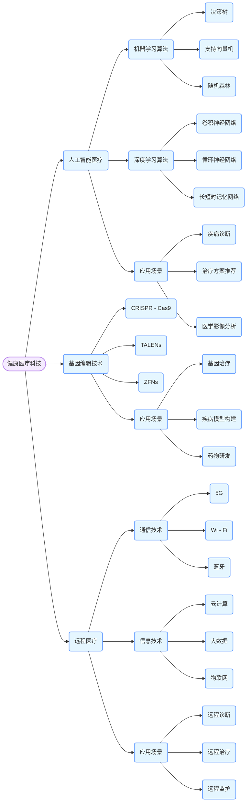

# 价值投资中的健康医疗科技趋势

> 关键词：价值投资、健康医疗科技、技术趋势、投资策略、行业应用

> 摘要：本文聚焦于价值投资领域中健康医疗科技的发展趋势。通过对健康医疗科技核心概念、算法原理、数学模型等方面的深入剖析，结合项目实战案例，探讨其在实际应用场景中的表现。同时，推荐了相关的学习资源、开发工具和研究论文，分析了未来发展趋势与挑战，旨在为价值投资者提供全面、深入的健康医疗科技领域投资参考，帮助其把握行业动态，做出明智的投资决策。

## 1. 背景介绍 
### 1.1 目的和范围
本文的主要目的是为价值投资者提供有关健康医疗科技领域的详细分析和趋势洞察。随着科技的飞速发展，健康医疗科技正经历着前所未有的变革，这些变革不仅影响着医疗行业的发展，也为价值投资带来了新的机遇和挑战。我们将深入研究健康医疗科技的多个方面，包括核心概念、算法原理、数学模型等，并通过实际案例分析其在投资中的应用。范围涵盖了从基础技术到行业应用的各个层面，旨在帮助投资者全面了解该领域的发展趋势和投资价值。

### 1.2 预期读者
本文预期读者主要包括价值投资者、金融分析师、健康医疗科技行业从业者以及对该领域感兴趣的研究人员。对于价值投资者，本文将提供有关健康医疗科技领域的投资策略和趋势分析；金融分析师可以从中获取深入的行业研究和数据支持；健康医疗科技行业从业者能够了解行业的最新技术和发展方向；而研究人员则可以通过本文了解该领域的前沿研究和应用案例。

### 1.3 文档结构概述
本文将按照以下结构进行组织：首先介绍健康医疗科技的背景和相关概念，包括核心术语定义和相关概念解释；接着阐述核心概念与联系，通过文本示意图和 Mermaid 流程图进行直观展示；然后详细讲解核心算法原理和具体操作步骤，并使用 Python 源代码进行说明；随后介绍数学模型和公式，并通过举例进行详细讲解；再通过项目实战案例，展示代码的实际应用和详细解读；接着探讨健康医疗科技的实际应用场景；之后推荐相关的学习资源、开发工具和研究论文；最后总结未来发展趋势与挑战，并提供常见问题与解答以及扩展阅读和参考资料。

### 1.4 术语表
#### 1.4.1 核心术语定义
- **价值投资**：一种投资策略，强调通过对资产内在价值的评估，寻找被低估的投资标的，以长期持有为目标获取回报。
- **健康医疗科技**：融合了医学、生物学、信息技术等多学科知识，用于改善医疗服务、提高医疗效率、推动医学研究和创新的技术领域。
- **人工智能医疗**：将人工智能技术应用于医疗领域，包括疾病诊断、治疗方案推荐、医学影像分析等。
- **基因编辑技术**：能够对生物体基因组特定目标基因进行修饰的技术，如 CRISPR - Cas9 技术。
- **远程医疗**：通过通信技术和信息技术，实现医疗机构之间、医疗机构与患者之间的远程诊断、治疗和监护。

#### 1.4.2 相关概念解释
- **医疗大数据**：指在医疗过程中产生的大量数据，包括电子病历、医学影像、临床检验数据等。这些数据具有海量、多源、异构等特点，通过对医疗大数据的分析和挖掘，可以为医疗决策提供支持。
- **区块链医疗**：将区块链技术应用于医疗领域，利用区块链的去中心化、不可篡改、安全可信等特点，实现医疗数据的安全共享、医疗供应链的管理等。
- **可穿戴医疗设备**：能够穿戴在人体上，实时监测人体生理参数和健康状况的设备，如智能手环、智能手表等。这些设备可以收集大量的个人健康数据，为个性化医疗提供支持。

#### 1.4.3 缩略词列表
- **AI**：Artificial Intelligence，人工智能
- **ML**：Machine Learning，机器学习
- **DL**：Deep Learning，深度学习
- **CRISPR**：Clustered Regularly Interspaced Short Palindromic Repeats，成簇的规律间隔的短回文重复序列
- **IoT**：Internet of Things，物联网

## 2. 核心概念与联系 
### 核心概念原理
健康医疗科技领域涉及多个核心概念，这些概念相互关联，共同推动着行业的发展。

- **人工智能医疗**：人工智能在医疗领域的应用主要基于机器学习和深度学习算法。通过对大量医疗数据的学习和分析，人工智能系统可以实现疾病的早期诊断、治疗方案的推荐和医学影像的分析。例如，深度学习算法可以对医学影像（如 X 光、CT 等）进行特征提取和分类，辅助医生进行疾病诊断。
- **基因编辑技术**：基因编辑技术的核心原理是通过特定的核酸酶对生物体基因组进行精确的修饰。以 CRISPR - Cas9 技术为例，它利用 Cas9 核酸酶在向导 RNA 的引导下，识别并切割特定的 DNA 序列，从而实现对基因的编辑。
- **远程医疗**：远程医疗依赖于通信技术和信息技术，实现医疗机构之间、医疗机构与患者之间的远程连接。通过远程医疗平台，医生可以实时获取患者的病历、检查报告等信息，进行远程诊断和治疗指导。

### 架构的文本示意图
```plaintext
健康医疗科技
├── 人工智能医疗
│   ├── 机器学习算法
│   │   ├── 决策树
│   │   ├── 支持向量机
│   │   └── 随机森林
│   ├── 深度学习算法
│   │   ├── 卷积神经网络（CNN）
│   │   ├── 循环神经网络（RNN）
│   │   └── 长短时记忆网络（LSTM）
│   └── 应用场景
│       ├── 疾病诊断
│       ├── 治疗方案推荐
│       └── 医学影像分析
├── 基因编辑技术
│   ├── CRISPR - Cas9
│   ├── TALENs
│   └── ZFNs
│   └── 应用场景
│       ├── 基因治疗
│       ├── 疾病模型构建
│       └── 药物研发
├── 远程医疗
│   ├── 通信技术
│   │   ├── 5G
│   │   ├── Wi - Fi
│   │   └── 蓝牙
│   ├── 信息技术
│   │   ├── 云计算
│   │   ├── 大数据
│   │   └── 物联网
│   └── 应用场景
│       ├── 远程诊断
│       ├── 远程治疗
│       └── 远程监护
```

### Mermaid 流程图


## 3. 核心算法原理 & 具体操作步骤 
### 机器学习算法：决策树
#### 算法原理
决策树是一种基于树结构进行决策的机器学习算法。它通过对数据集的特征进行递归划分，构建一个树形结构，每个内部节点表示一个特征上的测试，每个分支表示一个测试输出，每个叶节点表示一个类别或值。决策树的构建过程主要包括特征选择、树的生成和树的剪枝。

#### Python 源代码实现
```python
from sklearn.datasets import load_iris
from sklearn.model_selection import train_test_split
from sklearn.tree import DecisionTreeClassifier
from sklearn.metrics import accuracy_score

# 加载鸢尾花数据集
iris = load_iris()
X = iris.data
y = iris.target

# 划分训练集和测试集
X_train, X_test, y_train, y_test = train_test_split(X, y, test_size=0.3, random_state=42)

# 创建决策树分类器
clf = DecisionTreeClassifier()

# 训练模型
clf.fit(X_train, y_train)

# 预测
y_pred = clf.predict(X_test)

# 计算准确率
accuracy = accuracy_score(y_test, y_pred)
print(f"决策树模型的准确率: {accuracy}")
```

#### 具体操作步骤
1. **数据加载**：使用 `sklearn.datasets` 中的 `load_iris` 函数加载鸢尾花数据集。
2. **数据划分**：使用 `train_test_split` 函数将数据集划分为训练集和测试集。
3. **模型创建**：创建 `DecisionTreeClassifier` 类的实例。
4. **模型训练**：使用 `fit` 方法对模型进行训练。
5. **模型预测**：使用 `predict` 方法对测试集进行预测。
6. **结果评估**：使用 `accuracy_score` 函数计算模型的准确率。

### 深度学习算法：卷积神经网络（CNN）
#### 算法原理
卷积神经网络是一种专门为处理具有网格结构数据（如图像）而设计的深度学习算法。它主要由卷积层、池化层和全连接层组成。卷积层通过卷积核在输入数据上滑动进行卷积操作，提取数据的特征；池化层用于对特征图进行下采样，减少数据的维度；全连接层将池化层的输出进行全连接，输出最终的分类结果。

#### Python 源代码实现
```python
import tensorflow as tf
from tensorflow.keras.datasets import mnist
from tensorflow.keras.models import Sequential
from tensorflow.keras.layers import Conv2D, MaxPooling2D, Flatten, Dense
from tensorflow.keras.utils import to_categorical

# 加载 MNIST 数据集
(X_train, y_train), (X_test, y_test) = mnist.load_data()

# 数据预处理
X_train = X_train.reshape(-1, 28, 28, 1).astype('float32') / 255.0
X_test = X_test.reshape(-1, 28, 28, 1).astype('float32') / 255.0
y_train = to_categorical(y_train)
y_test = to_categorical(y_test)

# 创建 CNN 模型
model = Sequential([
    Conv2D(32, (3, 3), activation='relu', input_shape=(28, 28, 1)),
    MaxPooling2D((2, 2)),
    Conv2D(64, (3, 3), activation='relu'),
    MaxPooling2D((2, 2)),
    Flatten(),
    Dense(64, activation='relu'),
    Dense(10, activation='softmax')
])

# 编译模型
model.compile(optimizer='adam',
              loss='categorical_crossentropy',
              metrics=['accuracy'])

# 训练模型
model.fit(X_train, y_train, epochs=5, batch_size=64, validation_data=(X_test, y_test))

# 评估模型
test_loss, test_acc = model.evaluate(X_test, y_test)
print(f"CNN 模型的测试准确率: {test_acc}")
```

#### 具体操作步骤
1. **数据加载**：使用 `tensorflow.keras.datasets` 中的 `mnist.load_data` 函数加载 MNIST 数据集。
2. **数据预处理**：将图像数据进行归一化处理，并将标签进行 one - hot 编码。
3. **模型创建**：使用 `Sequential` 模型构建 CNN 模型，添加卷积层、池化层和全连接层。
4. **模型编译**：使用 `compile` 方法指定优化器、损失函数和评估指标。
5. **模型训练**：使用 `fit` 方法对模型进行训练。
6. **模型评估**：使用 `evaluate` 方法对模型进行评估。

## 4. 数学模型和公式 & 详细讲解 & 举例说明 
### 决策树的信息增益公式
#### 数学公式
信息增益（Information Gain）是决策树中用于特征选择的重要指标，它衡量了使用某个特征进行划分后，数据集的不确定性减少的程度。信息增益的计算公式为：
$$
IG(D, A) = H(D) - H(D|A)
$$
其中，$IG(D, A)$ 表示数据集 $D$ 在特征 $A$ 上的信息增益，$H(D)$ 表示数据集 $D$ 的熵，$H(D|A)$ 表示在特征 $A$ 给定的条件下，数据集 $D$ 的条件熵。

熵的计算公式为：
$$
H(D) = -\sum_{i = 1}^{n}p_i\log_2p_i
$$
其中，$p_i$ 表示数据集 $D$ 中第 $i$ 类样本的比例。

条件熵的计算公式为：
$$
H(D|A) = \sum_{v\in Values(A)}\frac{|D^v|}{|D|}H(D^v)
$$
其中，$Values(A)$ 表示特征 $A$ 的所有可能取值，$D^v$ 表示特征 $A$ 取值为 $v$ 的样本子集。

#### 详细讲解
信息增益的核心思想是选择能够最大程度减少数据集不确定性的特征进行划分。熵是衡量数据集不确定性的指标，熵越大，数据集的不确定性越大；条件熵则是在给定某个特征的条件下，数据集的不确定性。信息增益就是熵与条件熵的差值，差值越大，说明使用该特征进行划分后，数据集的不确定性减少得越多。

#### 举例说明
假设有一个数据集 $D$ 包含 10 个样本，分为两类：正类和负类，其中正类样本有 6 个，负类样本有 4 个。则数据集 $D$ 的熵为：
$$
H(D) = -\frac{6}{10}\log_2\frac{6}{10}-\frac{4}{10}\log_2\frac{4}{10}\approx 0.971
$$
假设我们有一个特征 $A$，它有两个取值：$A_1$ 和 $A_2$。特征 $A$ 取值为 $A_1$ 的样本有 6 个，其中正类样本有 4 个，负类样本有 2 个；特征 $A$ 取值为 $A_2$ 的样本有 4 个，其中正类样本有 2 个，负类样本有 2 个。则特征 $A$ 取值为 $A_1$ 的样本子集的熵为：
$$
H(D^{A_1}) = -\frac{4}{6}\log_2\frac{4}{6}-\frac{2}{6}\log_2\frac{2}{6}\approx 0.918
$$
特征 $A$ 取值为 $A_2$ 的样本子集的熵为：
$$
H(D^{A_2}) = -\frac{2}{4}\log_2\frac{2}{4}-\frac{2}{4}\log_2\frac{2}{4}= 1
$$
则在特征 $A$ 给定的条件下，数据集 $D$ 的条件熵为：
$$
H(D|A)=\frac{6}{10}H(D^{A_1})+\frac{4}{10}H(D^{A_2})=\frac{6}{10}\times0.918+\frac{4}{10}\times1\approx 0.951
$$
最后，数据集 $D$ 在特征 $A$ 上的信息增益为：
$$
IG(D, A)=H(D) - H(D|A)=0.971 - 0.951 = 0.02
$$

### 卷积神经网络的卷积操作公式
#### 数学公式
卷积操作是卷积神经网络的核心操作，它通过卷积核在输入数据上滑动进行卷积计算。假设输入数据为 $X$，卷积核为 $W$，输出特征图为 $Y$，则卷积操作的计算公式为：
$$
Y_{i,j}=\sum_{m = 0}^{M - 1}\sum_{n = 0}^{N - 1}X_{i + m,j + n}W_{m,n}+b
$$
其中，$Y_{i,j}$ 表示输出特征图中第 $(i, j)$ 个位置的值，$X_{i + m,j + n}$ 表示输入数据中第 $(i + m, j + n)$ 个位置的值，$W_{m,n}$ 表示卷积核中第 $(m, n)$ 个位置的值，$b$ 表示偏置项，$M$ 和 $N$ 分别表示卷积核的高度和宽度。

#### 详细讲解
卷积操作的本质是对输入数据进行特征提取。卷积核可以看作是一个滤波器，它在输入数据上滑动，对每个局部区域进行加权求和，得到输出特征图的一个值。通过不同的卷积核，可以提取输入数据的不同特征。

#### 举例说明
假设输入数据 $X$ 是一个 $3\times3$ 的矩阵：
$$
X=\begin{bmatrix}
1 & 2 & 3\\
4 & 5 & 6\\
7 & 8 & 9
\end{bmatrix}
$$
卷积核 $W$ 是一个 $2\times2$ 的矩阵：
$$
W=\begin{bmatrix}
1 & 0\\
0 & 1
\end{bmatrix}
$$
偏置项 $b = 0$。

首先，将卷积核放在输入数据的左上角，进行卷积计算：
$$
Y_{0,0}=\sum_{m = 0}^{1}\sum_{n = 0}^{1}X_{0 + m,0 + n}W_{m,n}=X_{0,0}W_{0,0}+X_{0,1}W_{0,1}+X_{1,0}W_{1,0}+X_{1,1}W_{1,1}=1\times1 + 2\times0+4\times0 + 5\times1 = 6
$$
然后，将卷积核向右滑动一个位置，进行卷积计算：
$$
Y_{0,1}=\sum_{m = 0}^{1}\sum_{n = 0}^{1}X_{0 + m,1 + n}W_{m,n}=X_{0,1}W_{0,0}+X_{0,2}W_{0,1}+X_{1,1}W_{1,0}+X_{1,2}W_{1,1}=2\times1 + 3\times0+5\times0 + 6\times1 = 8
$$
继续滑动卷积核，最终得到输出特征图：
$$
Y=\begin{bmatrix}
6 & 8\\
12 & 14
\end{bmatrix}
$$

## 5. 项目实战：代码实际案例和详细解释说明 
### 5.1  开发环境搭建
#### 安装 Python
首先，需要安装 Python 环境。可以从 Python 官方网站（https://www.python.org/downloads/） 下载适合自己操作系统的 Python 版本，并按照安装向导进行安装。

#### 安装必要的库
使用 `pip` 命令安装以下必要的库：
```sh
pip install numpy pandas scikit - learn tensorflow matplotlib
```
- `numpy`：用于进行数值计算。
- `pandas`：用于数据处理和分析。
- `scikit - learn`：提供了丰富的机器学习算法和工具。
- `tensorflow`：用于深度学习模型的构建和训练。
- `matplotlib`：用于数据可视化。

### 5.2  源代码详细实现和代码解读
#### 项目背景
我们将使用一个医疗数据集来构建一个疾病预测模型，该数据集包含了患者的一些基本信息和检查指标，我们的目标是根据这些信息预测患者是否患有某种疾病。

#### 源代码实现
```python
import pandas as pd
from sklearn.model_selection import train_test_split
from sklearn.ensemble import RandomForestClassifier
from sklearn.metrics import accuracy_score

# 加载数据集
data = pd.read_csv('medical_data.csv')

# 分离特征和标签
X = data.drop('disease', axis=1)
y = data['disease']

# 划分训练集和测试集
X_train, X_test, y_train, y_test = train_test_split(X, y, test_size=0.2, random_state=42)

# 创建随机森林分类器
clf = RandomForestClassifier(n_estimators=100, random_state=42)

# 训练模型
clf.fit(X_train, y_train)

# 预测
y_pred = clf.predict(X_test)

# 计算准确率
accuracy = accuracy_score(y_test, y_pred)
print(f"随机森林模型的准确率: {accuracy}")
```

#### 代码解读
1. **数据加载**：使用 `pandas` 的 `read_csv` 函数加载医疗数据集。
2. **特征和标签分离**：使用 `drop` 方法将标签列（`disease`）从数据集中移除，得到特征矩阵 $X$；将标签列赋值给 $y$。
3. **数据划分**：使用 `train_test_split` 函数将数据集划分为训练集和测试集，测试集占比为 20%。
4. **模型创建**：创建 `RandomForestClassifier` 类的实例，指定树的数量为 100。
5. **模型训练**：使用 `fit` 方法对模型进行训练。
6. **模型预测**：使用 `predict` 方法对测试集进行预测。
7. **结果评估**：使用 `accuracy_score` 函数计算模型的准确率。

### 5.3  代码解读与分析
#### 模型选择
随机森林是一种集成学习算法，它通过组合多个决策树来提高模型的性能。随机森林具有较高的准确性和鲁棒性，能够处理高维数据和非线性关系，因此非常适合用于疾病预测问题。

#### 数据处理
在实际应用中，医疗数据集可能包含缺失值、异常值等问题。在代码中，我们没有对数据进行预处理，实际应用中需要对数据进行清洗和预处理，例如使用 `fillna` 方法填充缺失值，使用 `scikit - learn` 中的 `StandardScaler` 对数据进行标准化处理等。

#### 模型评估
除了准确率之外，还可以使用其他指标来评估模型的性能，如精确率、召回率、F1 值等。可以使用 `scikit - learn` 中的 `classification_report` 函数来计算这些指标。

```python
from sklearn.metrics import classification_report

report = classification_report(y_test, y_pred)
print(report)
```

## 6. 实际应用场景 
### 疾病诊断
人工智能医疗技术可以辅助医生进行疾病诊断。例如，深度学习算法可以对医学影像（如 X 光、CT、MRI 等）进行分析，识别出病变区域和特征，帮助医生更准确地诊断疾病。基因编辑技术可以用于疾病的基因诊断，通过检测患者的基因序列，发现潜在的致病基因。

### 药物研发
健康医疗科技在药物研发领域也有广泛的应用。人工智能可以通过对大量的生物数据和临床数据进行分析，预测药物的疗效和副作用，加速药物研发的进程。基因编辑技术可以用于构建疾病模型，研究药物的作用机制，为药物研发提供更准确的靶点。

### 远程医疗服务
远程医疗服务通过通信技术和信息技术，实现医疗机构之间、医疗机构与患者之间的远程连接。患者可以通过远程医疗平台进行远程诊断、远程治疗和远程监护，医生可以实时获取患者的病历、检查报告等信息，为患者提供及时的医疗服务。特别是在一些偏远地区或医疗资源匮乏的地区，远程医疗服务可以有效地解决医疗资源分配不均的问题。

### 个性化医疗
随着健康医疗科技的发展，个性化医疗成为了未来医疗的发展方向。通过对患者的基因信息、生理数据和生活习惯等进行分析，医生可以为患者制定个性化的治疗方案。例如，基因编辑技术可以根据患者的基因特征进行基因治疗，人工智能可以根据患者的生理数据和疾病史推荐个性化的药物和治疗方法。

## 7. 工具和资源推荐
### 7.1 学习资源推荐
#### 7.1.1 书籍推荐
- 《深度学习》（Deep Learning）：由 Ian Goodfellow、Yoshua Bengio 和 Aaron Courville 所著，是深度学习领域的经典教材，涵盖了深度学习的基本概念、算法和应用。
- 《Python 机器学习》（Python Machine Learning）：由 Sebastian Raschka 所著，介绍了使用 Python 进行机器学习的方法和技巧，包括各种机器学习算法的实现和应用。
- 《医学人工智能》：介绍了人工智能在医学领域的应用，包括疾病诊断、治疗方案推荐、医学影像分析等方面的内容。

#### 7.1.2 在线课程
- Coursera 上的 “机器学习”（Machine Learning）课程：由 Andrew Ng 教授授课，是机器学习领域的经典课程，介绍了机器学习的基本概念、算法和应用。
- edX 上的 “深度学习”（Deep Learning Specialization）课程：由深度学习领域的知名学者授课，深入介绍了深度学习的理论和实践。
- 中国大学 MOOC 上的 “医学信息学” 课程：介绍了医学信息学的基本概念、方法和技术，以及医学信息系统的设计和开发。

#### 7.1.3 技术博客和网站
- Towards Data Science：一个专注于数据科学和机器学习的技术博客，提供了大量的技术文章和案例分析。
- Kaggle：一个数据科学竞赛平台，上面有很多关于医疗数据的竞赛和数据集，可以通过参与竞赛来提高自己的技术水平。
- 丁香园：一个专注于医学领域的网站，提供了医学资讯、学术交流、临床指南等内容。

### 7.2 开发工具框架推荐
#### 7.2.1 IDE和编辑器
- PyCharm：一款专业的 Python 集成开发环境，提供了丰富的代码编辑、调试和版本控制等功能。
- Jupyter Notebook：一个交互式的开发环境，适合进行数据探索和模型实验。
- Visual Studio Code：一款轻量级的代码编辑器，支持多种编程语言，并且有丰富的插件可以扩展其功能。

#### 7.2.2 调试和性能分析工具
- TensorBoard：TensorFlow 提供的可视化工具，可以用于可视化模型的训练过程、性能指标等。
- Py-Spy：一个用于分析 Python 代码性能的工具，可以找出代码中的性能瓶颈。
- Numba：一个用于加速 Python 代码的工具，特别是对于使用 NumPy 进行数值计算的代码有很好的加速效果。

#### 7.2.3 相关框架和库
- TensorFlow：一个开源的深度学习框架，提供了丰富的深度学习算法和工具，支持多种硬件平台。
- PyTorch：另一个开源的深度学习框架，具有动态图的特点，易于使用和调试。
- Scikit-learn：一个用于机器学习的 Python 库，提供了丰富的机器学习算法和工具，如分类、回归、聚类等。

### 7.3 相关论文著作推荐
#### 7.3.1 经典论文
- “Deep Residual Learning for Image Recognition”：提出了残差网络（ResNet），解决了深度学习中的梯度消失和梯度爆炸问题，在图像识别领域取得了很好的效果。
- “Generative Adversarial Nets”：提出了生成对抗网络（GAN），是一种强大的生成模型，在图像生成、数据增强等领域有广泛的应用。
- “Attention Is All You Need”：提出了 Transformer 模型，在自然语言处理领域取得了巨大的成功，推动了自然语言处理技术的发展。

#### 7.3.2 最新研究成果
- 关注顶级学术会议如 NeurIPS（神经信息处理系统大会）、ICML（国际机器学习会议）、CVPR（计算机视觉与模式识别会议）等，这些会议上会发布很多关于健康医疗科技的最新研究成果。
- 阅读顶级学术期刊如 Nature Medicine、Science Translational Medicine 等，这些期刊上会发表一些关于医学研究和技术应用的前沿论文。

#### 7.3.3 应用案例分析
- 可以参考一些知名的医疗科技公司的官方博客和研究报告，了解他们在健康医疗科技领域的应用案例和实践经验。例如，谷歌的 DeepMind 在医疗领域的应用案例，以及 IBM Watson 在医疗诊断和药物研发方面的应用案例。

## 8. 总结：未来发展趋势与挑战
### 未来发展趋势
#### 多学科融合
健康医疗科技将与生物学、物理学、计算机科学等多学科进行更深入的融合。例如，生物医学工程将结合生物学和工程学的知识，开发出更先进的医疗设备和技术；人工智能将与医学相结合，实现更智能的疾病诊断和治疗方案推荐。

#### 个性化医疗普及
随着基因编辑技术和人工智能技术的发展，个性化医疗将得到更广泛的应用。未来，医生可以根据患者的基因信息、生理数据和生活习惯等，为患者制定个性化的治疗方案，提高治疗效果和患者的生活质量。

#### 远程医疗服务升级
5G 技术的普及将推动远程医疗服务的升级。高速、低延迟的通信网络将使远程诊断、远程治疗和远程监护更加实时和准确。同时，虚拟现实（VR）和增强现实（AR）技术也将应用于远程医疗服务中，为医生和患者提供更加直观和真实的交互体验。

#### 医疗大数据应用深化
医疗大数据的应用将不断深化，通过对海量医疗数据的分析和挖掘，可以发现疾病的发病规律、预测疾病的发生风险、评估治疗效果等。同时，医疗大数据还可以为药物研发和医疗政策制定提供支持。

### 挑战
#### 数据隐私和安全问题
健康医疗数据包含了患者的个人敏感信息，如基因信息、病历信息等。如何保护这些数据的隐私和安全是一个重要的挑战。需要建立完善的数据隐私保护法律法规和技术手段，确保医疗数据不被泄露和滥用。

#### 技术伦理问题
基因编辑技术、人工智能等技术的应用带来了一系列的伦理问题。例如，基因编辑技术可能会导致人类基因库的改变，人工智能系统可能会出现偏见和不公平的问题。需要建立相应的伦理准则和监管机制，规范技术的应用。

#### 技术标准和互操作性问题
健康医疗科技领域涉及到多个技术和系统，如医疗设备、信息系统等。如何建立统一的技术标准和实现不同系统之间的互操作性是一个挑战。需要加强行业标准的制定和推广，促进不同技术和系统之间的互联互通。

#### 人才短缺问题
健康医疗科技的发展需要大量的跨学科人才，如医学、生物学、计算机科学等领域的专业人才。目前，这类跨学科人才相对短缺，需要加强相关学科的教育和培训，培养更多的复合型人才。

## 9. 附录：常见问题与解答
### 问题 1：价值投资在健康医疗科技领域的风险有哪些？
解答：价值投资在健康医疗科技领域的风险主要包括技术研发风险、市场竞争风险、政策法规风险等。技术研发风险是指健康医疗科技的研发具有不确定性，可能会出现研发失败的情况；市场竞争风险是指该领域竞争激烈，新的技术和产品可能会迅速取代现有的技术和产品；政策法规风险是指健康医疗科技受到严格的政策法规监管，政策法规的变化可能会对企业的发展产生不利影响。

### 问题 2：如何评估健康医疗科技企业的投资价值？
解答：评估健康医疗科技企业的投资价值可以从多个方面进行考虑。首先，要关注企业的技术实力和研发能力，包括企业拥有的专利技术、研发团队的实力等；其次，要考虑企业的市场竞争力，包括产品的市场份额、客户群体等；此外，还要关注企业的财务状况，如营收、利润、现金流等；最后，要考虑行业的发展趋势和政策环境，评估企业在未来的发展潜力。

### 问题 3：健康医疗科技领域的投资周期一般有多长？
解答：健康医疗科技领域的投资周期一般较长。由于该领域的技术研发和产品审批需要较长的时间，从技术研发到产品上市可能需要数年甚至数十年的时间。因此，价值投资者需要有长期投资的耐心和准备，不能期望在短期内获得高额回报。

### 问题 4：人工智能在健康医疗科技领域的应用是否会取代医生？
解答：人工智能在健康医疗科技领域的应用不会取代医生。虽然人工智能可以辅助医生进行疾病诊断、治疗方案推荐等工作，但医生的临床经验、人文关怀和决策能力是人工智能无法替代的。人工智能在健康医疗领域的应用主要是为医生提供支持和帮助，提高医疗服务的效率和质量。

## 10. 扩展阅读 & 参考资料
### 扩展阅读
- 《数字医疗革命》：探讨了数字技术在医疗领域的应用和发展趋势，以及对医疗行业的变革和影响。
- 《未来医疗：智能时代的健康革命》：介绍了未来医疗的发展方向和趋势，包括人工智能、基因编辑、远程医疗等技术的应用。
- 《医学的真相》：从医学的本质和发展历程出发，探讨了医学中的不确定性和挑战，以及如何做出明智的医疗决策。

### 参考资料
- 相关学术论文和研究报告，如 Nature、Science 等期刊上发表的关于健康医疗科技的论文。
- 行业报告和统计数据，如市场研究机构发布的关于健康医疗科技市场的报告。
- 政府部门发布的政策法规和文件，如国家卫生健康委员会发布的关于医疗科技发展的政策文件。

作者：AI天才研究院/AI Genius Institute & 禅与计算机程序设计艺术 /Zen And The Art of Computer Programming