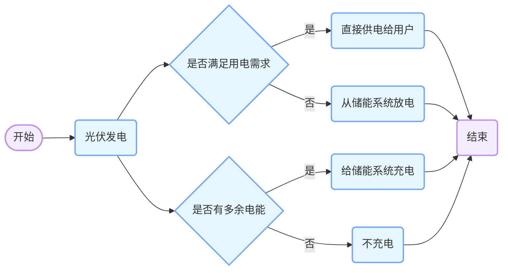

# 价值投资中的光伏储能技术分析

> 关键词：价值投资、光伏储能技术、能源存储、市场分析、技术原理

> 摘要：本文围绕价值投资视角下的光伏储能技术展开全面分析。首先介绍了研究的背景、目的、预期读者和文档结构，明确了相关术语。接着阐述了光伏储能技术的核心概念、联系及架构，详细讲解了核心算法原理与操作步骤，并给出了数学模型和公式。通过实际项目案例展示了代码实现与解读。探讨了光伏储能技术的实际应用场景，推荐了学习资源、开发工具和相关论文。最后总结了该技术的未来发展趋势与挑战，解答了常见问题并提供了扩展阅读和参考资料，旨在为投资者和技术人员深入了解光伏储能技术提供全面且深入的指引。

## 1. 背景介绍 
### 1.1 目的和范围
随着全球对清洁能源的需求日益增长，光伏发电作为一种可持续的能源解决方案，得到了广泛的关注和应用。然而，光伏发电具有间歇性和波动性的特点，这使得其在大规模应用时面临着一定的挑战。光伏储能技术的出现为解决这一问题提供了有效的途径，它可以在光伏发电过剩时储存能量，并在需要时释放出来，从而提高光伏发电的稳定性和可靠性。

本文的目的是从价值投资的角度出发，对光伏储能技术进行深入分析，探讨其市场前景、技术发展趋势以及投资价值。具体范围包括光伏储能技术的核心概念、原理、算法、数学模型，以及实际应用案例和市场分析等方面。

### 1.2 预期读者
本文预期读者主要包括以下几类人群：
1. **投资者**：对清洁能源领域感兴趣，希望了解光伏储能技术的投资价值和市场潜力，以便做出合理的投资决策。
2. **技术人员**：从事光伏储能技术研发、设计和应用的专业人员，希望深入了解该技术的原理、算法和数学模型，以提升自己的技术水平。
3. **能源行业从业者**：包括电力公司、能源供应商等，希望了解光伏储能技术对能源系统的影响和应用前景，以便更好地规划和管理能源供应。
4. **科研人员**：从事能源领域研究的学者和科研人员，希望通过本文了解光伏储能技术的最新研究进展和发展趋势，为自己的研究提供参考。

### 1.3 文档结构概述
本文共分为十个部分，具体结构如下：
1. **背景介绍**：介绍研究的目的、范围、预期读者和文档结构，明确相关术语。
2. **核心概念与联系**：阐述光伏储能技术的核心概念、原理和架构，给出文本示意图和 Mermaid 流程图。
3. **核心算法原理 & 具体操作步骤**：详细讲解光伏储能技术的核心算法原理，并使用 Python 源代码进行阐述。
4. **数学模型和公式 & 详细讲解 & 举例说明**：给出光伏储能技术的数学模型和公式，并进行详细讲解和举例说明。
5. **项目实战：代码实际案例和详细解释说明**：通过实际项目案例展示光伏储能技术的代码实现和详细解释。
6. **实际应用场景**：探讨光伏储能技术的实际应用场景，包括家庭、工业和电网等领域。
7. **工具和资源推荐**：推荐学习光伏储能技术的相关资源，包括书籍、在线课程、技术博客和网站等，以及开发工具和相关论文。
8. **总结：未来发展趋势与挑战**：总结光伏储能技术的未来发展趋势和面临的挑战。
9. **附录：常见问题与解答**：解答读者在阅读本文过程中可能遇到的常见问题。
10. **扩展阅读 & 参考资料**：提供相关的扩展阅读和参考资料，以便读者进一步深入了解光伏储能技术。

### 1.4 术语表
#### 1.4.1 核心术语定义
1. **光伏发电**：利用半导体界面的光生伏特效应而将光能直接转变为电能的一种技术。
2. **光伏储能技术**：将光伏发电产生的电能储存起来，以便在需要时释放出来的技术。
3. **储能系统**：用于储存电能的设备或系统，包括电池储能、超级电容储能等。
4. **能量管理系统（EMS）**：对储能系统进行监测、控制和管理的系统，以实现能量的优化分配和利用。
5. **荷电状态（SOC）**：电池中剩余电量与额定电量的比值，反映电池的剩余容量。

#### 1.4.2 相关概念解释
1. **峰谷电价**：电力公司根据不同时间段的用电需求，制定不同的电价政策，峰时电价高，谷时电价低。
2. **分布式能源系统**：将发电设备分散布置在用户侧，实现能源的就地生产和利用的系统。
3. **微电网**：由分布式电源、储能装置、能量转换装置、相关负荷和监控、保护装置汇集而成的小型发配电系统。

#### 1.4.3 缩略词列表
1. **PV**：Photovoltaic，光伏发电
2. **ESS**：Energy Storage System，储能系统
3. **EMS**：Energy Management System，能量管理系统
4. **SOC**：State of Charge，荷电状态

## 2. 核心概念与联系 

### 2.1 核心概念原理
光伏储能技术主要涉及光伏发电、储能和能量管理三个核心概念。

#### 2.1.1 光伏发电原理
光伏发电是基于光生伏特效应，当太阳光照射到半导体材料上时，光子的能量被半导体吸收，产生电子 - 空穴对。在半导体内部的电场作用下，电子和空穴分别向不同的方向移动，从而形成电流。常见的光伏发电系统由太阳能电池板、逆变器、控制器等组成。太阳能电池板将太阳能转化为直流电，逆变器将直流电转换为交流电，控制器则负责对光伏发电系统进行监测和控制。

#### 2.1.2 储能原理
储能是将电能以某种形式储存起来，以便在需要时释放出来的过程。常见的储能方式包括电池储能、超级电容储能、飞轮储能等。其中，电池储能是目前应用最为广泛的储能方式，其原理是通过化学反应将电能转化为化学能储存起来，在需要时再将化学能转化为电能释放出来。常见的电池类型包括铅酸电池、锂离子电池、钠硫电池等。

#### 2.1.3 能量管理原理
能量管理是对光伏发电系统和储能系统进行监测、控制和管理的过程，以实现能量的优化分配和利用。能量管理系统（EMS）通过实时监测光伏发电系统的发电功率、储能系统的荷电状态（SOC）以及用户的用电负荷，根据预设的控制策略，对储能系统的充放电进行控制，以满足用户的用电需求，同时提高光伏发电的利用率和储能系统的使用寿命。

### 2.2 架构示意图
以下是光伏储能系统的架构示意图：

```plaintext
+-----------------+          +-----------------+          +-----------------+
| 光伏发电系统   |          | 储能系统        |          | 能量管理系统    |
|                 |          |                 |          |                 |
| 太阳能电池板    |          | 电池组          |          | 监测模块        |
| 逆变器          |          | 充放电控制器    |          | 控制模块        |
| 控制器          |          |                 |          | 通信模块        |
+-----------------+          +-----------------+          +-----------------+
           |                          |                          |
           |                          |                          |
           +--------------------------+--------------------------+
                                      |
                                      |
                               +-----------------+
                               | 用户负荷        |
                               |                 |
                               | 家庭用电设备    |
                               | 工业用电设备    |
                               +-----------------+
```

### 2.3 Mermaid 流程图


## 3. 核心算法原理 & 具体操作步骤 

### 3.1 核心算法原理
在光伏储能系统中，能量管理的核心算法是根据光伏发电功率、储能系统的荷电状态（SOC）和用户用电负荷，实时计算储能系统的充放电功率，以实现能量的优化分配和利用。以下是一种常见的能量管理算法原理：

#### 3.1.1 计算净负荷
净负荷是指用户用电负荷与光伏发电功率之差，计算公式为：
$P_{net} = P_{load} - P_{pv}$
其中，$P_{net}$ 表示净负荷，$P_{load}$ 表示用户用电负荷，$P_{pv}$ 表示光伏发电功率。

#### 3.1.2 判断充放电状态
根据净负荷的大小和储能系统的荷电状态（SOC），判断储能系统的充放电状态：
1. 当 $P_{net} < 0$ 时，说明光伏发电功率大于用户用电负荷，有多余的电能可以储存，此时储能系统处于充电状态。
2. 当 $P_{net} > 0$ 时，说明光伏发电功率小于用户用电负荷，需要从储能系统放电，此时储能系统处于放电状态。
3. 当 $P_{net} = 0$ 时，说明光伏发电功率等于用户用电负荷，不需要储能系统充放电。

#### 3.1.3 计算充放电功率
根据储能系统的充放电状态和荷电状态（SOC），计算储能系统的充放电功率：
1. 充电状态：当储能系统处于充电状态时，充电功率 $P_{charge}$ 应满足以下条件：
    - $P_{charge} \leq P_{charge,max}$，其中 $P_{charge,max}$ 是储能系统的最大充电功率。
    - $SOC + \frac{P_{charge} \Delta t}{E_{rated}} \leq SOC_{max}$，其中 $\Delta t$ 是时间间隔，$E_{rated}$ 是储能系统的额定容量，$SOC_{max}$ 是储能系统的最大荷电状态。
2. 放电状态：当储能系统处于放电状态时，放电功率 $P_{discharge}$ 应满足以下条件：
    - $P_{discharge} \leq P_{discharge,max}$，其中 $P_{discharge,max}$ 是储能系统的最大放电功率。
    - $SOC - \frac{P_{discharge} \Delta t}{E_{rated}} \geq SOC_{min}$，其中 $SOC_{min}$ 是储能系统的最小荷电状态。

### 3.2 具体操作步骤
以下是使用 Python 实现上述能量管理算法的具体操作步骤：

```python
# 定义参数
P_load = 1000  # 用户用电负荷，单位：W
P_pv = 800     # 光伏发电功率，单位：W
P_charge_max = 500  # 储能系统最大充电功率，单位：W
P_discharge_max = 500  # 储能系统最大放电功率，单位：W
E_rated = 5000  # 储能系统额定容量，单位：Wh
SOC = 0.5  # 储能系统初始荷电状态
SOC_max = 0.9  # 储能系统最大荷电状态
SOC_min = 0.1  # 储能系统最小荷电状态
delta_t = 1  # 时间间隔，单位：h

# 计算净负荷
P_net = P_load - P_pv

# 判断充放电状态并计算充放电功率
if P_net < 0:
    # 充电状态
    P_charge = min(-P_net, P_charge_max)
    if SOC + (P_charge * delta_t / E_rated) > SOC_max:
        P_charge = (SOC_max - SOC) * E_rated / delta_t
    P_discharge = 0
    SOC = SOC + (P_charge * delta_t / E_rated)
elif P_net > 0:
    # 放电状态
    P_discharge = min(P_net, P_discharge_max)
    if SOC - (P_discharge * delta_t / E_rated) < SOC_min:
        P_discharge = (SOC - SOC_min) * E_rated / delta_t
    P_charge = 0
    SOC = SOC - (P_discharge * delta_t / E_rated)
else:
    # 不需要充放电
    P_charge = 0
    P_discharge = 0

# 输出结果
print(f"净负荷: {P_net} W")
print(f"充电功率: {P_charge} W")
print(f"放电功率: {P_discharge} W")
print(f"荷电状态: {SOC * 100:.2f}%")
```

### 3.3 代码解释
1. **参数定义**：定义了用户用电负荷、光伏发电功率、储能系统的最大充电功率、最大放电功率、额定容量、初始荷电状态、最大荷电状态、最小荷电状态和时间间隔等参数。
2. **计算净负荷**：根据用户用电负荷和光伏发电功率计算净负荷。
3. **判断充放电状态并计算充放电功率**：根据净负荷的大小和储能系统的荷电状态，判断储能系统的充放电状态，并计算充放电功率。在计算充放电功率时，需要考虑储能系统的最大充放电功率和荷电状态的限制。
4. **更新荷电状态**：根据充放电功率和时间间隔，更新储能系统的荷电状态。
5. **输出结果**：输出净负荷、充电功率、放电功率和荷电状态。

## 4. 数学模型和公式 & 详细讲解 & 举例说明 

### 4.1 数学模型
光伏储能系统的数学模型主要包括光伏发电模型、储能模型和能量管理模型。

#### 4.1.1 光伏发电模型
光伏发电功率 $P_{pv}$ 与太阳辐射强度 $G$、太阳能电池板面积 $A$、光电转换效率 $\eta$ 有关，其数学模型可以表示为：
$P_{pv} = G \times A \times \eta$

#### 4.1.2 储能模型
储能系统的荷电状态（SOC）随时间的变化可以用以下数学模型表示：
$SOC(t + \Delta t) = SOC(t) + \frac{I(t) \Delta t}{C}$
其中，$SOC(t)$ 表示 $t$ 时刻的荷电状态，$I(t)$ 表示 $t$ 时刻的充放电电流，$C$ 表示储能系统的额定容量，$\Delta t$ 表示时间间隔。

#### 4.1.3 能量管理模型
能量管理模型的目标是实现能量的优化分配和利用，其数学模型可以表示为：
$\min \sum_{t = 1}^{T} (C_{grid}(t) P_{grid}(t) + C_{charge}(t) P_{charge}(t) - C_{discharge}(t) P_{discharge}(t))$
subject to:
$P_{net}(t) = P_{load}(t) - P_{pv}(t) = P_{grid}(t) + P_{discharge}(t) - P_{charge}(t)$
$0 \leq P_{charge}(t) \leq P_{charge,max}$
$0 \leq P_{discharge}(t) \leq P_{discharge,max}$
$SOC_{min} \leq SOC(t) \leq SOC_{max}$
其中，$T$ 表示时间范围，$C_{grid}(t)$ 表示 $t$ 时刻的电网电价，$P_{grid}(t)$ 表示 $t$ 时刻从电网购电的功率，$C_{charge}(t)$ 表示 $t$ 时刻的充电成本，$C_{discharge}(t)$ 表示 $t$ 时刻的放电收益。

### 4.2 公式详细讲解
#### 4.2.1 光伏发电功率公式
$P_{pv} = G \times A \times \eta$
- $G$：太阳辐射强度，单位为 $W/m^2$，表示单位面积上接收到的太阳辐射功率。
- $A$：太阳能电池板面积，单位为 $m^2$，表示太阳能电池板的实际面积。
- $\eta$：光电转换效率，无单位，表示太阳能电池板将太阳能转换为电能的效率。

#### 4.2.2 储能系统荷电状态公式
$SOC(t + \Delta t) = SOC(t) + \frac{I(t) \Delta t}{C}$
- $SOC(t)$：$t$ 时刻的荷电状态，无单位，取值范围为 $[0, 1]$。
- $I(t)$：$t$ 时刻的充放电电流，单位为 $A$，充电时电流为正，放电时电流为负。
- $C$：储能系统的额定容量，单位为 $Ah$，表示储能系统能够储存的电荷量。
- $\Delta t$：时间间隔，单位为 $h$，表示计算荷电状态变化的时间范围。

#### 4.2.3 能量管理目标函数
$\min \sum_{t = 1}^{T} (C_{grid}(t) P_{grid}(t) + C_{charge}(t) P_{charge}(t) - C_{discharge}(t) P_{discharge}(t))$
该目标函数的目的是最小化总能量成本，包括从电网购电的成本、储能系统充电的成本和储能系统放电的收益。

#### 4.2.4 能量平衡约束
$P_{net}(t) = P_{load}(t) - P_{pv}(t) = P_{grid}(t) + P_{discharge}(t) - P_{charge}(t)$
该约束条件表示在每个时刻，用户用电负荷与光伏发电功率之差等于从电网购电的功率、储能系统放电功率与充电功率之差，保证能量的平衡。

#### 4.2.5 充放电功率约束
$0 \leq P_{charge}(t) \leq P_{charge,max}$
$0 \leq P_{discharge}(t) \leq P_{discharge,max}$
这两个约束条件表示储能系统的充电功率和放电功率不能超过其最大充放电功率。

#### 4.2.6 荷电状态约束
$SOC_{min} \leq SOC(t) \leq SOC_{max}$
该约束条件表示储能系统的荷电状态必须在最小荷电状态和最大荷电状态之间，以保证储能系统的安全和正常运行。

### 4.3 举例说明
假设某光伏储能系统的参数如下：
- 太阳能电池板面积 $A = 10 m^2$，光电转换效率 $\eta = 0.2$。
- 储能系统额定容量 $C = 100 Ah$，最大充电功率 $P_{charge,max} = 500 W$，最大放电功率 $P_{discharge,max} = 500 W$，初始荷电状态 $SOC(0) = 0.5$，最小荷电状态 $SOC_{min} = 0.1$，最大荷电状态 $SOC_{max} = 0.9$。
- 用户用电负荷 $P_{load}(t)$ 和太阳辐射强度 $G(t)$ 随时间的变化如下表所示：

| 时间 $t$ (h) | 用户用电负荷 $P_{load}(t)$ (W) | 太阳辐射强度 $G(t)$ ($W/m^2$) |
| ------------ | ------------------------------ | ----------------------------- |
| 0            | 1000                           | 0                             |
| 1            | 1000                           | 200                           |
| 2            | 1000                           | 400                           |
| 3            | 1000                           | 600                           |
| 4            | 1000                           | 800                           |
| 5            | 1000                           | 1000                          |

#### 4.3.1 计算光伏发电功率
根据光伏发电功率公式 $P_{pv} = G \times A \times \eta$，可以计算出每个时刻的光伏发电功率：

| 时间 $t$ (h) | 太阳辐射强度 $G(t)$ ($W/m^2$) | 光伏发电功率 $P_{pv}(t)$ (W) |
| ------------ | ----------------------------- | ----------------------------- |
| 0            | 0                             | 0                             |
| 1            | 200                           | $200 \times 10 \times 0.2 = 400$ |
| 2            | 400                           | $400 \times 10 \times 0.2 = 800$ |
| 3            | 600                           | $600 \times 10 \times 0.2 = 1200$ |
| 4            | 800                           | $800 \times 10 \times 0.2 = 1600$ |
| 5            | 1000                          | $1000 \times 10 \times 0.2 = 2000$ |

#### 4.3.2 计算净负荷
根据净负荷公式 $P_{net} = P_{load} - P_{pv}$，可以计算出每个时刻的净负荷：

| 时间 $t$ (h) | 用户用电负荷 $P_{load}(t)$ (W) | 光伏发电功率 $P_{pv}(t)$ (W) | 净负荷 $P_{net}(t)$ (W) |
| ------------ | ------------------------------ | ----------------------------- | ----------------------- |
| 0            | 1000                           | 0                             | 1000                    |
| 1            | 1000                           | 400                           | 600                     |
| 2            | 1000                           | 800                           | 200                     |
| 3            | 1000                           | 1200                          | -200                    |
| 4            | 1000                           | 1600                          | -600                    |
| 5            | 1000                           | 2000                          | -1000                   |

#### 4.3.3 计算储能系统充放电功率和荷电状态
根据能量管理算法，计算每个时刻储能系统的充放电功率和荷电状态：

| 时间 $t$ (h) | 净负荷 $P_{net}(t)$ (W) | 充电功率 $P_{charge}(t)$ (W) | 放电功率 $P_{discharge}(t)$ (W) | 荷电状态 $SOC(t)$ |
| ------------ | ----------------------- | ----------------------------- | ------------------------------- | ----------------- |
| 0            | 1000                    | 0                             | 500                             | $0.5 - \frac{500 \times 1}{100 \times 12} \approx 0.458$ |
| 1            | 600                     | 0                             | 500                             | $0.458 - \frac{500 \times 1}{100 \times 12} \approx 0.417$ |
| 2            | 200                     | 0                             | 200                             | $0.417 - \frac{200 \times 1}{100 \times 12} \approx 0.399$ |
| 3            | -200                    | 200                           | 0                             | $0.399 + \frac{200 \times 1}{100 \times 12} \approx 0.416$ |
| 4            | -600                    | 500                           | 0                             | $0.416 + \frac{500 \times 1}{100 \times 12} \approx 0.458$ |
| 5            | -1000                   | 500                           | 0                             | $0.458 + \frac{500 \times 1}{100 \times 12} \approx 0.5$ |

通过以上计算，可以清楚地了解光伏储能系统在不同时刻的运行状态，包括光伏发电功率、净负荷、储能系统的充放电功率和荷电状态等。

## 5. 项目实战：代码实际案例和详细解释说明 

### 5.1  开发环境搭建
在进行光伏储能技术的项目实战之前，需要搭建相应的开发环境。以下是具体的搭建步骤：

#### 5.1.1 安装 Python
Python 是一种广泛使用的编程语言，具有丰富的科学计算库和工具。可以从 Python 官方网站（https://www.python.org/downloads/）下载并安装适合自己操作系统的 Python 版本。建议安装 Python 3.7 及以上版本。

#### 5.1.2 安装必要的库
在 Python 中，有一些常用的库可以帮助我们进行光伏储能系统的建模和仿真，例如 NumPy、Pandas、Matplotlib 等。可以使用以下命令来安装这些库：
```sh
pip install numpy pandas matplotlib
```

#### 5.1.3 选择开发工具
可以选择使用集成开发环境（IDE）或文本编辑器来编写和运行 Python 代码。常见的 IDE 包括 PyCharm、Jupyter Notebook 等，文本编辑器包括 Visual Studio Code、Sublime Text 等。根据自己的喜好和需求选择合适的开发工具。

### 5.2  源代码详细实现和代码解读
以下是一个完整的光伏储能系统仿真代码示例，包括光伏发电功率计算、储能系统充放电控制和能量管理等功能：

```python
import numpy as np
import pandas as pd
import matplotlib.pyplot as plt

# 定义参数
A = 10  # 太阳能电池板面积，单位：m^2
eta = 0.2  # 光电转换效率
C = 100  # 储能系统额定容量，单位：Ah
P_charge_max = 500  # 储能系统最大充电功率，单位：W
P_discharge_max = 500  # 储能系统最大放电功率，单位：W
SOC_0 = 0.5  # 储能系统初始荷电状态
SOC_min = 0.1  # 储能系统最小荷电状态
SOC_max = 0.9  # 储能系统最大荷电状态
delta_t = 1  # 时间间隔，单位：h

# 生成用户用电负荷和太阳辐射强度数据
time = np.arange(0, 24, delta_t)
P_load = 1000 * np.ones_like(time)  # 用户用电负荷，单位：W
G = 1000 * np.sin(np.pi * time / 12) * (time >= 6) * (time < 18)  # 太阳辐射强度，单位：W/m^2

# 初始化数据列表
P_pv_list = []
P_net_list = []
P_charge_list = []
P_discharge_list = []
SOC_list = [SOC_0]

# 进行仿真
for i in range(len(time)):
    # 计算光伏发电功率
    P_pv = G[i] * A * eta
    P_pv_list.append(P_pv)
    
    # 计算净负荷
    P_net = P_load[i] - P_pv
    P_net_list.append(P_net)
    
    # 判断充放电状态并计算充放电功率
    if P_net < 0:
        # 充电状态
        P_charge = min(-P_net, P_charge_max)
        if SOC_list[-1] + (P_charge * delta_t / (C * 12)) > SOC_max:
            P_charge = (SOC_max - SOC_list[-1]) * C * 12 / delta_t
        P_discharge = 0
    elif P_net > 0:
        # 放电状态
        P_discharge = min(P_net, P_discharge_max)
        if SOC_list[-1] - (P_discharge * delta_t / (C * 12)) < SOC_min:
            P_discharge = (SOC_list[-1] - SOC_min) * C * 12 / delta_t
        P_charge = 0
    else:
        # 不需要充放电
        P_charge = 0
        P_discharge = 0
    
    # 更新荷电状态
    SOC = SOC_list[-1] + (P_charge * delta_t / (C * 12)) - (P_discharge * delta_t / (C * 12))
    SOC_list.append(SOC)
    
    P_charge_list.append(P_charge)
    P_discharge_list.append(P_discharge)

# 绘制结果
plt.figure(figsize=(12, 8))

plt.subplot(4, 1, 1)
plt.plot(time, P_load, label='用户用电负荷')
plt.plot(time, P_pv_list, label='光伏发电功率')
plt.xlabel('时间 (h)')
plt.ylabel('功率 (W)')
plt.title('用户用电负荷和光伏发电功率')
plt.legend()

plt.subplot(4, 1, 2)
plt.plot(time, P_net_list, label='净负荷')
plt.xlabel('时间 (h)')
plt.ylabel('功率 (W)')
plt.title('净负荷')
plt.legend()

plt.subplot(4, 1, 3)
plt.plot(time, P_charge_list, label='充电功率')
plt.plot(time, P_discharge_list, label='放电功率')
plt.xlabel('时间 (h)')
plt.ylabel('功率 (W)')
plt.title('储能系统充放电功率')
plt.legend()

plt.subplot(4, 1, 4)
plt.plot(time, SOC_list[:-1], label='荷电状态')
plt.xlabel('时间 (h)')
plt.ylabel('荷电状态')
plt.title('储能系统荷电状态')
plt.legend()

plt.tight_layout()
plt.show()
```

### 5.3  代码解读与分析
#### 5.3.1 参数定义
代码中首先定义了光伏储能系统的相关参数，包括太阳能电池板面积、光电转换效率、储能系统额定容量、最大充放电功率、初始荷电状态、最小荷电状态、最大荷电状态和时间间隔等。

#### 5.3.2 数据生成
使用 NumPy 生成用户用电负荷和太阳辐射强度数据。用户用电负荷在 24 小时内保持恒定，太阳辐射强度根据正弦函数模拟白天的变化情况。

#### 5.3.3 仿真循环
通过一个循环遍历每个时间步，进行以下操作：
1. 计算光伏发电功率：根据太阳辐射强度、太阳能电池板面积和光电转换效率计算光伏发电功率。
2. 计算净负荷：根据用户用电负荷和光伏发电功率计算净负荷。
3. 判断充放电状态并计算充放电功率：根据净负荷的大小和储能系统的荷电状态，判断储能系统的充放电状态，并计算充放电功率。在计算充放电功率时，需要考虑储能系统的最大充放电功率和荷电状态的限制。
4. 更新荷电状态：根据充放电功率和时间间隔，更新储能系统的荷电状态。

#### 5.3.4 结果绘制
使用 Matplotlib 绘制用户用电负荷、光伏发电功率、净负荷、储能系统充放电功率和荷电状态随时间的变化曲线，以便直观地观察光伏储能系统的运行状态。

通过以上代码和分析，可以对光伏储能系统的运行过程进行仿真和分析，了解其在不同条件下的性能和特点。

## 6. 实际应用场景 
光伏储能技术具有广泛的实际应用场景，以下是一些主要的应用场景介绍：

### 6.1 家庭应用
在家庭场景中，光伏储能系统可以为家庭提供稳定的电力供应，减少对电网的依赖，降低电费支出。具体应用如下：
1. **自发自用**：家庭安装的光伏发电系统将太阳能转化为电能，优先满足家庭自身的用电需求。当光伏发电功率大于家庭用电负荷时，多余的电能可以储存到储能系统中；当光伏发电功率小于家庭用电负荷时，储能系统放电补充不足的电能。
2. **峰谷电价套利**：利用峰谷电价政策，在谷时电价较低时，从电网购电给储能系统充电；在峰时电价较高时，储能系统放电为家庭供电，从而降低家庭的用电成本。
3. **应急供电**：在电网停电时，光伏储能系统可以作为应急电源，为家庭的重要用电设备（如冰箱、照明等）提供电力，保障家庭的基本生活需求。

### 6.2 工业应用
在工业场景中，光伏储能系统可以提高工业企业的能源利用效率，降低能源成本，增强供电的可靠性。具体应用如下：
1. **削峰填谷**：工业企业的用电负荷通常具有较大的波动性，在用电高峰时段，光伏储能系统放电，减少企业从电网购电的功率，降低企业的用电成本；在用电低谷时段，光伏储能系统充电，储存多余的电能。
2. **改善电能质量**：光伏储能系统可以快速响应电网的电压和频率变化，通过充放电调节，改善工业企业的电能质量，减少电压波动和频率偏差对工业设备的影响。
3. **分布式能源系统**：在一些偏远地区或工业园区，光伏储能系统可以与其他分布式能源（如风力发电、生物质能发电等）结合，构成分布式能源系统，实现能源的就地生产和利用，提高能源供应的可靠性和稳定性。

### 6.3 电网应用
在电网层面，光伏储能系统可以提高电网的稳定性和可靠性，促进可再生能源的大规模接入。具体应用如下：
1. **调峰调频**：光伏储能系统可以快速响应电网的负荷变化，在用电高峰时段放电，增加电网的供电功率；在用电低谷时段充电，减少电网的供电压力，实现电网的调峰。同时，光伏储能系统还可以通过快速充放电调节，改善电网的频率稳定性。
2. **备用电源**：在电网发生故障或紧急情况时，光伏储能系统可以作为备用电源，为重要的负荷（如医院、政府机构等）提供电力支持，保障电网的安全运行。
3. **促进可再生能源消纳**：光伏发电具有间歇性和波动性的特点，光伏储能系统可以储存光伏发电的多余电能，在光伏发电不足时释放出来，提高可再生能源的消纳能力，减少弃光现象的发生。

## 7. 工具和资源推荐
### 7.1 学习资源推荐
#### 7.1.1 书籍推荐
1. 《光伏发电技术与应用》：本书系统地介绍了光伏发电的基本原理、光伏电池、光伏系统设计、安装和维护等方面的知识，适合初学者和专业技术人员阅读。
2. 《储能技术与应用》：全面阐述了各种储能技术的原理、特点、应用场景和发展趋势，对光伏储能技术有深入的介绍。
3. 《能源管理与节能技术》：介绍了能源管理的基本理论和方法，以及节能技术在各个领域的应用，对于理解光伏储能系统的能量管理具有重要的参考价值。

#### 7.1.2 在线课程
1. Coursera 上的“Photovoltaic Systems Design and Installation”：由知名大学教授授课，详细讲解了光伏发电系统的设计、安装和维护等方面的知识。
2. edX 上的“Energy Storage Systems”：介绍了各种储能技术的原理、应用和发展趋势，对光伏储能技术有专门的章节进行讲解。
3. 中国大学 MOOC 上的“新能源发电技术”：涵盖了光伏发电、风力发电等新能源发电技术的基本原理和应用，课程内容丰富，适合初学者学习。

#### 7.1.3 技术博客和网站
1. PV Magazine：是全球领先的光伏行业媒体，提供最新的光伏技术、市场动态和行业分析等信息。
2. Energy Storage News：专注于储能领域的新闻和资讯，包括各种储能技术的发展、应用案例和市场趋势等。
3. 中国能源报：报道能源领域的政策、技术、市场等方面的新闻，对光伏储能技术有一定的关注和报道。

### 7.2 开发工具框架推荐
#### 7.2.1 IDE和编辑器
1. PyCharm：是一款专业的 Python 集成开发环境，具有代码编辑、调试、自动补全、版本控制等功能，适合开发大型的 Python 项目。
2. Jupyter Notebook：是一个交互式的编程环境，支持 Python、R 等多种编程语言，可以方便地进行数据处理、可视化和模型仿真等工作。
3. Visual Studio Code：是一款轻量级的代码编辑器，具有丰富的插件扩展功能，支持多种编程语言，适合快速开发和调试代码。

#### 7.2.2 调试和性能分析工具
1. PDB：是 Python 内置的调试工具，可以在代码中设置断点，逐步执行代码，查看变量的值和程序的执行流程。
2. cProfile：是 Python 标准库中的性能分析工具，可以统计程序中各个函数的执行时间和调用次数，帮助找出程序的性能瓶颈。
3. Py-Spy：是一个基于 Rust 编写的 Python 性能分析工具，可以实时监控 Python 程序的性能，找出性能热点。

#### 7.2.3 相关框架和库
1. NumPy：是 Python 中用于科学计算的基础库，提供了高效的多维数组对象和各种数学函数，适合进行数值计算和数据分析。
2. Pandas：是 Python 中用于数据处理和分析的库，提供了 DataFrame 和 Series 等数据结构，方便进行数据清洗、转换和分析。
3. Matplotlib：是 Python 中用于数据可视化的库，可以绘制各种类型的图表，如折线图、柱状图、散点图等，帮助直观地展示数据。

### 7.3 相关论文著作推荐
#### 7.3.1 经典论文
1. “A Review of Energy Storage Technologies for Electric Power Systems”：对电力系统中各种储能技术进行了全面的综述，包括储能技术的原理、特点、应用场景和发展趋势等。
2. “Photovoltaic Power Generation Forecasting: A Review”：对光伏发电功率预测技术进行了详细的综述，介绍了各种预测方法的原理、优缺点和应用情况。
3. “Optimal Sizing and Operation of Hybrid Renewable Energy Systems with Energy Storage”：研究了含储能的混合可再生能源系统的优化 sizing 和运行策略，提出了一种基于模型预测控制的优化方法。

#### 7.3.2 最新研究成果
可以通过学术数据库（如 IEEE Xplore、ACM Digital Library、ScienceDirect 等）搜索关于光伏储能技术的最新研究论文，了解该领域的最新研究进展和技术创新。

#### 7.3.3 应用案例分析
一些行业报告和学术论文中会包含光伏储能技术的应用案例分析，通过阅读这些案例可以了解光伏储能系统在实际应用中的设计、运行和经济效益等方面的情况。例如，国际可再生能源署（IRENA）发布的相关报告中会有光伏储能项目的案例分析。

## 8. 总结：未来发展趋势与挑战
### 8.1 未来发展趋势
#### 8.1.1 技术创新
随着科技的不断进步，光伏储能技术将不断创新和发展。例如，新型光伏电池技术（如钙钛矿太阳能电池）的研发和应用将提高光伏发电的效率和降低成本；新型储能技术（如固态电池、液流电池等）的发展将提高储能系统的性能和安全性。

#### 8.1.2 成本降低
随着规模效应的显现和技术的进步，光伏储能系统的成本将不断降低。光伏发电成本的下降和储能成本的降低将使得光伏储能系统在更多的应用场景中具有经济可行性，促进其大规模的推广和应用。

#### 8.1.3 智能化发展
光伏储能系统将朝着智能化的方向发展，通过引入人工智能、大数据等技术，实现对光伏储能系统的智能监测、控制和优化管理。例如，利用机器学习算法预测光伏发电功率和用户用电负荷，优化储能系统的充放电策略，提高能源利用效率。

#### 8.1.4 与其他能源系统融合
光伏储能系统将与其他能源系统（如风力发电、生物质能发电、智能电网等）深度融合，构成更加复杂和高效的能源系统。通过能源的互补和协同作用，提高能源供应的可靠性和稳定性，促进可再生能源的大规模接入和消纳。

### 8.2 面临的挑战
#### 8.2.1 技术挑战
虽然光伏储能技术取得了一定的进展，但仍然面临一些技术挑战。例如，光伏发电的间歇性和波动性问题仍然没有得到完全解决，储能系统的能量密度、充放电效率和使用寿命等方面还需要进一步提高。

#### 8.2.2 成本挑战
尽管光伏储能系统的成本在不断降低，但目前仍然相对较高，尤其是储能系统的成本占比较大。降低光伏储能系统的成本是促进其大规模应用的关键因素之一。

#### 8.2.3 政策挑战
光伏储能技术的发展需要政府的政策支持和引导。目前，一些地区的政策还不够完善，缺乏对光伏储能系统的明确补贴政策和市场机制，这在一定程度上制约了光伏储能技术的发展。

#### 8.2.4 市场挑战
光伏储能市场还处于发展初期，市场机制不够健全，缺乏统一的标准和规范。此外，光伏储能系统的商业模式还不够成熟，盈利模式不够清晰，这也给市场的发展带来了一定的挑战。

## 9. 附录：常见问题与解答
### 9.1 光伏储能系统的使用寿命是多久？
光伏储能系统的使用寿命取决于多个因素，包括光伏发电设备、储能电池和其他组件的质量和性能。一般来说，光伏发电设备的使用寿命可以达到 25 年以上，而储能电池的使用寿命则根据不同的电池类型有所不同。例如，铅酸电池的使用寿命一般为 3 - 5 年，锂离子电池的使用寿命可以达到 10 年以上。

### 9.2 光伏储能系统的投资回报率如何？
光伏储能系统的投资回报率受到多种因素的影响，如光伏发电成本、储能成本、电价政策、光照资源等。在一些光照资源丰富、峰谷电价差较大的地区，光伏储能系统的投资回报率相对较高。一般来说，通过合理的系统设计和运营管理，光伏储能系统的投资回收期可以控制在 5 - 10 年左右。

### 9.3 光伏储能系统对环境有什么影响？
光伏储能系统是一种清洁能源系统，对环境的影响相对较小。光伏发电过程中不产生温室气体排放，对大气环境友好。储能电池在生产和回收过程中可能会对环境造成一定的影响，但随着技术的进步和环保要求的提高，这些影响可以得到有效的控制和降低。

### 9.4 如何选择适合的光伏储能系统？
选择适合的光伏储能系统需要考虑多个因素，如用电需求、光照资源、预算、安装空间等。在选择光伏发电设备时，需要关注其转换效率、功率、质量和价格等因素；在选择储能电池时，需要考虑其容量、充放电效率、使用寿命和安全性等因素。此外，还可以咨询专业的光伏储能系统供应商或安装商，获取更详细的建议和方案。

## 10. 扩展阅读 & 参考资料
### 10.1 扩展阅读
1. 《可再生能源发展“十四五”规划》：了解国家对可再生能源发展的战略规划和政策导向。
2. 《储能产业研究白皮书》：获取储能产业的最新发展动态、技术趋势和市场分析等信息。
3. 《国际能源署（IEA）光伏报告》：了解全球光伏发电的发展现状和未来趋势。

### 10.2 参考资料
1. 国际可再生能源署（IRENA）官方网站：https://www.irena.org/
2. 中国光伏行业协会（CPIA）官方网站：https://www.cpia.org.cn/
3. 美国能源部（DOE）官方网站：https://www.energy.gov/

作者：AI天才研究院/AI Genius Institute & 禅与计算机程序设计艺术 /